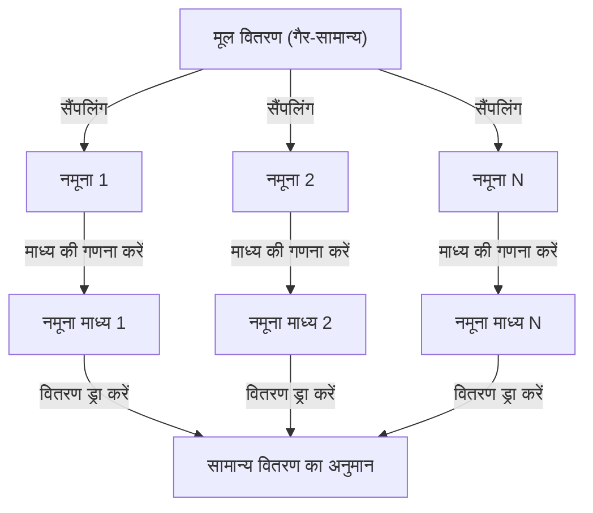

## 1. परिचय

डेटा विज्ञान और सांख्यिकी का अध्ययन करते समय, **[केंद्रीय सीमा प्रमेय](https://kenji.blog/hi/p/central-limit-theorem/)** (सेंट्रल लिमिट थ्योरम - CLT) से बचना असंभव है। इस प्रमेय में लगभग एक जादुई गुण है: "डेटा का वितरण (डिस्ट्रीब्यूशन) चाहे जो भी हो, उसके सैंपल के औसत (मीन) का वितरण नमूना आकार बढ़ने के साथ-साथ एक सामान्य वितरण (नॉर्मल डिस्ट्रीब्यूशन) के करीब पहुँच जाता है।"

इस लेख में, हम [केंद्रीय सीमा प्रमेय](https://kenji.blog/hi/p/central-limit-theorem/) को व्यापक रूप से समझाएंगे, एक सहज छवि से लेकर एक सख्त गणितीय परिभाषा और व्यावहारिक अनुप्रयोग उदाहरणों तक।

## 2. [केंद्रीय सीमा प्रमेय](https://kenji.blog/hi/p/central-limit-theorem/) क्या है?

[केंद्रीय सीमा प्रमेय](https://kenji.blog/hi/p/central-limit-theorem/) (CLT) प्रायिकता सिद्धांत और सांख्यिकी में सबसे शक्तिशाली और आश्चर्यजनक परिणामों में से एक है। सीधे शब्दों में कहें तो, बड़ी संख्या में यादृच्छिक रूप से निकाले गए स्वतंत्र यादृच्छिक चर का योग (या औसत) एक सामान्य वितरण द्वारा अनुमानित होता है, भले ही मूल चर का वितरण कुछ भी रहा हो।

### 2.1 सहज समझ

पांसे पर विचार करें। जब आप एक पांसा फेंकते हैं, तो परिणामों का वितरण एक समान (यूनिफॉर्म) होता है। हालाँकि, जब आप दो पांसे फेंकते हैं और उनका योग लेते हैं, तो वितरण एक त्रिकोण बन जाता है जिसके केंद्र में 7 का शिखर होता है। जैसे-जैसे आप पांसों की संख्या और बढ़ाते हैं, उनके योग का वितरण एक चिकनी घंटी के आकार की वक्र, यानी **सामान्य वितरण** के करीब पहुँचता जाता है।

### 2.2 गणितीय परिभाषा

मान लें कि एक समष्टि (पापुलेशन) से यादृच्छिक रूप से निकाले गए $n$ नमूने $X_1, X_2, \dots, X_n$ समान और स्वतंत्र रूप से वितरित (i.i.d.) हैं। मान लें कि इस समष्टि का माध्य (अपेक्षित मूल्य) $\mu$ है और प्रसरण (वैरिएंस) $\sigma^2$ है।

मान लें कि नमूना माध्य $\bar{X} = \frac{1}{n} \sum_{i=1}^{n} X_i$ है। [केंद्रीय सीमा प्रमेय](https://kenji.blog/hi/p/central-limit-theorem/) के अनुसार, जब $n$ पर्याप्त रूप से बड़ा होता है, तो नीचे दिखाया गया मानकीकृत चर $Z$ मानक सामान्य वितरण $\mathcal{N}(0, 1)$ की ओर अभिसरित (कन्वर्ज) होता है।


$$
Z = \frac{\bar{X} - \mu}{\frac{\sigma}{\sqrt{n}}} \xrightarrow{d} \mathcal{N}(0, 1) \text{ जब } n \to \infty
$$


यहाँ, $\xrightarrow{d}$ वितरण में अभिसरण (कन्वर्जेंस) का अर्थ है। $\text{ जब } n \to \infty$ यह इंगित करता है कि नमूना आकार अनंत तक पहुंचता है।

## 3. [केंद्रीय सीमा प्रमेय](https://kenji.blog/hi/p/central-limit-theorem/) का विज़ुअलाइज़ेशन

[केंद्रीय सीमा प्रमेय](https://kenji.blog/hi/p/central-limit-theorem/) कैसे काम करता है, इसे दृश्य रूप से समझने के लिए, यहां मर्मेड (Mermaid) का उपयोग करते हुए एक प्रक्रिया आरेख (प्रोसेस डायग्राम) दिया गया है।



## 4. पायथन के साथ सिमुलेशन

केवल सिद्धांत के बजाय, आइए इसे सत्यापित करने के लिए वास्तव में एक प्रोग्राम चलाएं। हम एक समान वितरण से डेटा निकालने का अनुकरण करेंगे और देखेंगे कि उनका माध्य कैसे वितरित होता है।

```python
import numpy as np
import matplotlib.pyplot as plt

# समष्टि पैरामीटर (समान वितरण [0, 1])
mu = 0.5
sigma = np.sqrt(1/12)

# सिमुलेशन सेटिंग्स
sample_sizes = [1, 5, 30, 100]
num_simulations = 10000

# ग्राफ ड्राइंग सेटिंग्स
fig, axes = plt.subplots(2, 2, figsize=(12, 8))
axes = axes.flatten()

for i, n in enumerate(sample_sizes):
    # समान वितरण से n नमूने num_simulations बार निकालें
    samples = np.random.uniform(0, 1, (num_simulations, n))
    
    # प्रत्येक परीक्षण के लिए नमूना माध्य की गणना करें
    sample_means = np.mean(samples, axis=1)
    
    # हिस्टोग्राम प्लॉट करें
    ax = axes[i]
    ax.hist(sample_means, bins=50, density=True, alpha=0.7, color='skyblue')
    ax.set_title(f"नमूना आकार n={n}")
    
    # सैद्धांतिक सामान्य वितरण वक्र जोड़ें
    x = np.linspace(mu - 4*sigma/np.sqrt(n), mu + 4*sigma/np.sqrt(n), 100)
    y = (1 / (np.sqrt(2 * np.pi) * (sigma/np.sqrt(n)))) * np.exp(-0.5 * ((x - mu) / (sigma/np.sqrt(n)))**2)
    ax.plot(x, y, 'r-', lw=2)

plt.tight_layout()
plt.show()
```

जब आप इस कोड को चलाते हैं, तो आप पुष्टि कर सकते हैं कि जब $n=1$ होता है तो यह एक समान वितरण है, लेकिन जैसे-जैसे $n$ बढ़ता है, हिस्टोग्राम लाल रेखा के सामान्य वितरण के करीब पहुंच जाता है।

## 5. [केंद्रीय सीमा प्रमेय](https://kenji.blog/hi/p/central-limit-theorem/) का महत्व और अनुप्रयोग

[केंद्रीय सीमा प्रमेय](https://kenji.blog/hi/p/central-limit-theorem/) इतना महत्वपूर्ण क्यों है? ऐसा इसलिए है क्योंकि भले ही हम यह नहीं जानते कि कई वास्तविक दुनिया के डेटा में वास्तव में कौन सा वितरण है, हम परिकल्पना परीक्षण (हाइपोथिसिस टेस्टिंग) करने और विश्वास अंतराल (कॉन्फिडेंस इंटरवल) बनाने के लिए नमूना माध्य जैसे आंकड़ों का उपयोग करते समय एक सामान्य वितरण मान सकते हैं।

### 5.1 सांख्यिकीय अनुमान का आधार
जब हम डेटा से कुछ अनुमान लगाते हैं, जैसे जनमत सर्वेक्षणों, गुणवत्ता नियंत्रण, या ए/बी (A/B) परीक्षण में, तो अधिकांश तर्क [केंद्रीय सीमा प्रमेय](https://kenji.blog/hi/p/central-limit-theorem/) पर निर्भर करते हैं।

### 5.2 त्रुटियों का संचय
प्रकृति में मापन त्रुटियों और कई तरह के शोर को कई छोटे स्वतंत्र कारकों के योग के रूप में भी मॉडल किया जा सकता है, इसलिए वे अक्सर एक सामान्य वितरण का पालन करते हैं। यही कारण है कि इसे गॉसियन वितरण (Gaussian distribution) भी कहा जाता है।

## 6. गहराई में जाना: प्रमाण के लिए दृष्टिकोण

[केंद्रीय सीमा प्रमेय](https://kenji.blog/hi/p/central-limit-theorem/) के एक सख्त प्रमाण के लिए अभिलक्षणिक कार्यों (कैरेक्टरिस्टिक फंक्शन्स) और टेलर विस्तार (टेलर एक्सपेंशन) का उपयोग किया जाता है। यहाँ एक संक्षिप्त अवलोकन दिया गया है।

अभिलक्षणिक कार्य $\phi_X(t) = E[e^{itX}]$ का उपयोग करते हुए, स्वतंत्र यादृच्छिक चर के योग का अभिलक्षणिक कार्य उनके संबंधित अभिलक्षणिक कार्यों का गुणनफल होता है। जब हम मानकीकृत चर $Z$ के अभिलक्षणिक कार्य की गणना करते हैं और $n \to \infty$ के रूप में सीमा लेते हैं, तो यह दिखाया जा सकता है कि यह मानक सामान्य वितरण के अभिलक्षणिक कार्य $e^{-t^2/2}$ में अभिसरित होता है। यह साबित करता है कि वितरण स्वयं एक सामान्य वितरण में अभिसरित होता है।

## 7. निष्कर्ष

[केंद्रीय सीमा प्रमेय](https://kenji.blog/hi/p/central-limit-theorem/) एक अत्यंत सुंदर प्रमेय है जो अव्यवस्थित डेटा के पीछे छिपे क्रम को दर्शाता है। इस प्रमेय को समझकर, आप डेटा विश्लेषण और सांख्यिकीय मॉडल निर्माण में गहरी अंतर्दृष्टि प्राप्त करने में सक्षम होंगे।


## परिशिष्ट: विस्तृत गणितीय पृष्ठभूमि और इतिहास

### परिशिष्ट 1: प्रायिकता सिद्धांत में विकास
[केंद्रीय सीमा प्रमेय](https://kenji.blog/hi/p/central-limit-theorem/) का इतिहास गहरा है, जिसकी उत्पत्ति अब्राहम डी मोइवर द्वारा द्विपद वितरण (बाइनोमियल डिस्ट्रीब्यूशन) के सामान्य सन्निकटन (नॉर्मल एप्रोक्सीमेशन) को दिखाने से हुई है। इसे बाद में पियरे-सिमोन लाप्लास द्वारा विस्तारित किया गया, और अलेक्सांद्र ल्यापुनोव ने अधिक सामान्य परिस्थितियों में एक प्रमाण प्रदान किया। आधुनिक प्रायिकता सिद्धांत में, लिंडबर्ग की स्थिति और ल्यापुनोव की स्थिति जैसे विभिन्न विस्तार मौजूद हैं। ये शर्तें सुनिश्चित करती हैं कि व्यक्तिगत यादृच्छिक चर का कुल योग पर प्रमुख प्रभाव नहीं पड़ता है। यह इस मूलभूत प्रश्न का उत्तर प्रदान करता है कि प्रकृति और सामाजिक विज्ञान में विविध घटनाओं का सामान्य वितरण द्वारा अनुमान क्यों लगाया जा सकता है।

### परिशिष्ट 2: आवेदन की शर्तें और प्रमेय का अर्थ

इस पाठ में चर्चा किए गए मूल रूप में, यह आवश्यक है कि $X_1,\ldots,X_n$ स्वतंत्र और समान रूप से वितरित हों, जिसमें एक परिमित माध्य $\mu$ और एक परिमित सकारात्मक प्रसरण $0<\sigma^2<\infty$ हो। कृपया इन शर्तों के दायरे में "कोई भी वितरण" स्पष्टीकरण को समझें। जो एक सामान्य वितरण के करीब पहुंचता है वह मानकीकृत योग या नमूना माध्य का वितरण है, और व्यक्तिगत टिप्पणियों का वितरण नहीं बदलता है।

### परिशिष्ट 3: मानक त्रुटि (स्टैंडर्ड एरर) और [बड़ी संख्याओं का नियम](https://kenji.blog/hi/p/law-of-large-numbers/)

स्वतंत्रता के कारण, नमूना माध्य का अपेक्षित मूल्य और प्रसरण इस प्रकार हैं। मानक त्रुटि नमूना माध्य का फैलाव है और व्यक्तिगत डेटा के मानक विचलन से अलग है।

$$
E[\bar X_n]=\mu,\qquad \operatorname{Var}(\bar X_n)=\frac{\sigma^2}{n},\qquad \operatorname{SE}(\bar X_n)=\frac{\sigma}{\sqrt n}.
$$

नमूनों की संख्या को चौगुना करने से मानक त्रुटि आधी हो जाती है। [बड़ी संख्याओं का नियम](https://kenji.blog/hi/p/law-of-large-numbers/) (लॉ ऑफ़ लार्ज नंबर्स) बताता है कि नमूना माध्य $\mu$ के करीब पहुंचता है, और [केंद्रीय सीमा प्रमेय](https://kenji.blog/hi/p/central-limit-theorem/) इसके चारों ओर के उतार-चढ़ाव को $\sqrt{n}$ से गुणा करके वितरण के आकार का वर्णन करता है।

### परिशिष्ट 4: अभिलक्षणिक कार्यों का उपयोग करके पूरक प्रमाण

मान लें कि $Y_i=(X_i-\mu)/\sigma$ और $Z_n=n^{-1/2}\sum_{i=1}^nY_i$ है। चूंकि $E[Y_i]=0$ और $E[Y_i^2]=1$ है, अभिलक्षणिक कार्य का मूल बिंदु के पास निम्नानुसार विस्तार किया जा सकता है।

$$
\phi_Y(t)=E[e^{itY}]=1-\frac{t^2}{2}+o(t^2)\quad(t\to0).
$$

स्वतंत्रता से, निम्नलिखित समीकरण प्राप्त होता है। चूंकि सीमा मानक सामान्य वितरण का अभिलक्षणिक कार्य है, वितरण में अभिसरण लेवी की निरंतरता प्रमेय (Lévy's continuity theorem) से आता है। अभिलक्षणिक कार्य और क्षण-उत्पादक कार्य (moment-generating functions) अलग-अलग होते हैं, और इस प्रमाण के लिए क्षण-उत्पादक कार्य के अस्तित्व की आवश्यकता नहीं है।

$$
\phi_{Z_n}(t)=\left[\phi_Y\!\left(\frac{t}{\sqrt n}\right)\right]^n
=\left[1-\frac{t^2}{2n}+o\!\left(\frac1n\right)\right]^n
\longrightarrow e^{-t^2/2}.
$$

### परिशिष्ट 5: अनुपयुक्त उदाहरण और सन्निकटन सटीकता

कॉची वितरण ([Cauchy](https://kenji.blog/hi/p/cauchy/) distribution) का न तो परिमित माध्य है और न ही परिमित प्रसरण है, और स्वतंत्र मानक कॉची चर का नमूना माध्य एक मानक कॉची वितरण ही बना रहता है। साथ ही, यदि सभी $X_i$ एक ही चर के बराबर हैं, तो कोई स्वतंत्रता नहीं है, और औसत लेने से फैलाव कम नहीं होता है। इस बात की भी कोई गारंटी नहीं है कि "$n\ge30$ हमेशा पर्याप्त होता है"। तिरछापन (skewness) और भारी पूंछ के आधार पर आवश्यक नमूना आकार भिन्न होता है। स्वतंत्र लेकिन समान रूप से वितरित न होने वाले मामलों के विस्तार के लिए, लिंडबर्ग या ल्यापुनोव की शर्तों जैसी अतिरिक्त शर्तों की जांच करना आवश्यक है।
