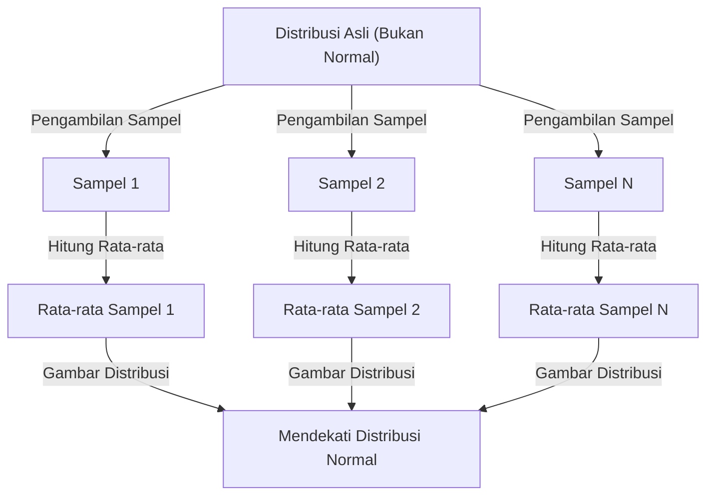

## 1. Pendahuluan

Saat mempelajari ilmu data dan statistika, **[Teorema Limit Pusat](https://kenji.blog/id/p/central-limit-theorem/)** ([Central Limit Theorem](https://kenji.blog/id/p/central-limit-theorem/) atau CLT) adalah hal yang tidak bisa dihindari. Teorema ini memiliki sifat yang hampir ajaib: "Tidak peduli apa distribusi datanya, distribusi rata-rata sampelnya akan mendekati distribusi normal seiring bertambahnya ukuran sampel."

Dalam artikel ini, kami akan menjelaskan secara luas tentang [Teorema Limit Pusat](https://kenji.blog/id/p/central-limit-theorem/), mulai dari gambaran intuitif hingga definisi matematis yang ketat serta contoh aplikasi praktisnya.

## 2. Apa Itu [Teorema Limit Pusat](https://kenji.blog/id/p/central-limit-theorem/)?

[Teorema Limit Pusat](https://kenji.blog/id/p/central-limit-theorem/) (CLT) adalah salah satu hasil yang paling kuat dan mengejutkan dalam teori probabilitas dan statistika. Sederhananya, jumlah (atau rata-rata) dari sejumlah besar variabel acak independen yang diambil secara acak akan mendekati distribusi normal, terlepas dari distribusi asli variabel-variabel tersebut.

### 2.1 Pemahaman Intuitif

Pertimbangkan dadu. Saat Anda melempar satu dadu, distribusi hasilnya adalah distribusi seragam. Namun, saat Anda melempar dua dadu dan menjumlahkannya, distribusinya menjadi segitiga dengan puncaknya di angka 7. Saat Anda terus menambah jumlah dadu, distribusi jumlahnya akan mendekati kurva berbentuk lonceng yang halus, yaitu **distribusi normal**.

### 2.2 Definisi Matematis

Misalkan $n$ sampel $X_1, X_2, \dots, X_n$ yang diambil secara acak dari suatu populasi saling independen dan identik (i.i.d.). Misalkan rata-rata (nilai harapan) dari populasi ini adalah $\mu$ dan variansnya adalah $\sigma^2$.

Misalkan rata-rata sampel adalah $\bar{X} = \frac{1}{n} \sum_{i=1}^{n} X_i$. Menurut [Teorema Limit Pusat](https://kenji.blog/id/p/central-limit-theorem/), ketika $n$ cukup besar, variabel terstandarisasi $Z$ yang ditunjukkan di bawah ini akan konvergen ke distribusi normal standar $\mathcal{N}(0, 1)$.


$$
Z = \frac{\bar{X} - \mu}{\frac{\sigma}{\sqrt{n}}} \xrightarrow{d} \mathcal{N}(0, 1) \text{ saat } n \to \infty
$$


Di sini, $\xrightarrow{d}$ berarti konvergensi dalam distribusi. $\text{ saat } n \to \infty$ menunjukkan bahwa ukuran sampel mendekati tak terhingga.

## 3. Visualisasi [Teorema Limit Pusat](https://kenji.blog/id/p/central-limit-theorem/)

Untuk memahami secara visual bagaimana [Teorema Limit Pusat](https://kenji.blog/id/p/central-limit-theorem/) bekerja, berikut adalah diagram proses menggunakan Mermaid.



## 4. Simulasi dengan Python

Alih-alih hanya teori, mari kita jalankan program untuk memastikannya. Kita akan mensimulasikan pengambilan data dari distribusi seragam dan melihat bagaimana distribusinya.

```python
import numpy as np
import matplotlib.pyplot as plt

# Parameter populasi (Distribusi seragam [0, 1])
mu = 0.5
sigma = np.sqrt(1/12)

# Pengaturan simulasi
sample_sizes = [1, 5, 30, 100]
num_simulations = 10000

# Pengaturan pembuatan grafik
fig, axes = plt.subplots(2, 2, figsize=(12, 8))
axes = axes.flatten()

for i, n in enumerate(sample_sizes):
    # Ambil n sampel dari distribusi seragam sebanyak num_simulations kali
    samples = np.random.uniform(0, 1, (num_simulations, n))
    
    # Hitung rata-rata sampel untuk setiap percobaan
    sample_means = np.mean(samples, axis=1)
    
    # Plot histogram
    ax = axes[i]
    ax.hist(sample_means, bins=50, density=True, alpha=0.7, color='skyblue')
    ax.set_title(f"Ukuran sampel n={n}")
    
    # Tambahkan kurva distribusi normal teoretis
    x = np.linspace(mu - 4*sigma/np.sqrt(n), mu + 4*sigma/np.sqrt(n), 100)
    y = (1 / (np.sqrt(2 * np.pi) * (sigma/np.sqrt(n)))) * np.exp(-0.5 * ((x - mu) / (sigma/np.sqrt(n)))**2)
    ax.plot(x, y, 'r-', lw=2)

plt.tight_layout()
plt.show()
```

Saat Anda menjalankan kode ini, Anda dapat memastikan bahwa ketika $n=1$ distribusinya adalah seragam, tetapi saat $n$ menjadi lebih besar, histogram akan mendekati garis merah distribusi normal.

## 5. Pentingnya dan Aplikasi [Teorema Limit Pusat](https://kenji.blog/id/p/central-limit-theorem/)

Mengapa [Teorema Limit Pusat](https://kenji.blog/id/p/central-limit-theorem/) begitu penting? Karena bahkan jika kita tidak tahu persis bagaimana distribusi banyak data di dunia nyata, kita dapat mengasumsikan distribusi normal saat menggunakan statistik seperti rata-rata sampel untuk melakukan pengujian hipotesis dan membangun interval kepercayaan.

### 5.1 Dasar Inferensi Statistik
Saat kita menyimpulkan sesuatu dari data, seperti dalam jajak pendapat, kontrol kualitas, atau pengujian A/B, sebagian besar dasar pemikirannya bergantung pada [Teorema Limit Pusat](https://kenji.blog/id/p/central-limit-theorem/).

### 5.2 Akumulasi Kesalahan
Kesalahan pengukuran dan banyak gangguan di alam juga dapat dimodelkan sebagai jumlah dari banyak faktor kecil yang independen, sehingga sering kali mengikuti distribusi normal. Inilah sebabnya mengapa ia juga disebut distribusi Gaussian.

## 6. Lebih Mendalam: Pendekatan Pembuktian

Fungsi karakteristik dan ekspansi Taylor digunakan untuk bukti kuat [Teorema Limit Pusat](https://kenji.blog/id/p/central-limit-theorem/). Berikut ini ringkasannya.

Menggunakan fungsi karakteristik $\phi_X(t) = E[e^{itX}]$, fungsi karakteristik dari jumlah variabel acak independen adalah hasil kali dari masing-masing fungsi karakteristiknya. Ketika kita menghitung fungsi karakteristik dari variabel terstandarisasi $Z$ dan mengambil batas saat $n \to \infty$, itu dapat terbukti konvergen ke $e^{-t^2/2}$, yang merupakan fungsi karakteristik dari distribusi normal standar. Hal ini membuktikan bahwa distribusinya sendiri konvergen ke distribusi normal.

## 7. Kesimpulan

[Teorema Limit Pusat](https://kenji.blog/id/p/central-limit-theorem/) adalah teorema yang sangat indah yang menunjukkan keteraturan yang tersembunyi di balik data yang kacau. Dengan memahami teorema ini, Anda akan dapat memperoleh wawasan yang lebih mendalam dalam analisis data dan pembuatan model statistik.


## Lampiran: Latar Belakang Matematika dan Sejarah Terperinci

### Lampiran 1: Perkembangan dalam Teori Probabilitas
Sejarah [Teorema Limit Pusat](https://kenji.blog/id/p/central-limit-theorem/) sangat panjang, bermula dari Abraham de Moivre yang menunjukkan aproksimasi normal dari distribusi binomial. Kemudian dikembangkan oleh Pierre-Simon Laplace, dan Aleksandr Lyapunov memberikan bukti di bawah kondisi yang lebih umum. Dalam teori probabilitas modern, ada berbagai ekstensi seperti kondisi Lindeberg dan kondisi Lyapunov. Kondisi-kondisi ini memastikan bahwa variabel acak individu tidak memiliki pengaruh dominan pada jumlah keseluruhan. Hal ini memberikan jawaban atas pertanyaan mendasar mengapa berbagai fenomena di alam dan ilmu sosial dapat didekati oleh distribusi normal.

### Lampiran 2: Kondisi Aplikasi dan Arti Teorema

Dalam bentuk dasar yang dibahas dalam teks ini, disyaratkan bahwa $X_1,\ldots,X_n$ adalah independen dan terdistribusi identik, dengan rata-rata berhingga $\mu$ dan varians positif berhingga $0<\sigma^2<\infty$. Harap pahami penjelasan "distribusi apa pun" dalam cakupan kondisi ini. Yang mendekati distribusi normal adalah distribusi dari jumlah terstandarisasi atau rata-rata sampel, dan distribusi pengamatan individu tidak berubah.

### Lampiran 3: Kesalahan Standar dan [Hukum Bilangan Besar](https://kenji.blog/id/p/law-of-large-numbers/)

Karena independensi, nilai harapan dan varians dari rata-rata sampel adalah sebagai berikut. Kesalahan standar adalah penyebaran dari rata-rata sampel dan berbeda dari deviasi standar data individu.

$$
E[\bar X_n]=\mu,\qquad \operatorname{Var}(\bar X_n)=\frac{\sigma^2}{n},\qquad \operatorname{SE}(\bar X_n)=\frac{\sigma}{\sqrt n}.
$$

Melipatgandakan ukuran sampel menjadi empat kali lipat akan mengurangi setengah kesalahan standar. Hukum bilangan besar menyatakan bahwa rata-rata sampel mendekati $\mu$, dan [Teorema Limit Pusat](https://kenji.blog/id/p/central-limit-theorem/) menggambarkan bentuk distribusi dengan mengalikan fluktuasi di sekitarnya dengan $\sqrt{n}$.

### Lampiran 4: Bukti Tambahan Menggunakan Fungsi Karakteristik

Misalkan $Y_i=(X_i-\mu)/\sigma$ dan $Z_n=n^{-1/2}\sum_{i=1}^nY_i$. Karena $E[Y_i]=0$ dan $E[Y_i^2]=1$, fungsi karakteristik dapat diekspansi di dekat titik asal sebagai berikut.

$$
\phi_Y(t)=E[e^{itY}]=1-\frac{t^2}{2}+o(t^2)\quad(t\to0).
$$

Dari independensi, diperoleh persamaan berikut. Karena batasnya adalah fungsi karakteristik dari distribusi normal standar, konvergensi dalam distribusi mengikuti dari teorema kontinuitas Lévy. Fungsi karakteristik dan fungsi pembangkit momen adalah hal yang berbeda, dan keberadaan fungsi pembangkit momen tidak diperlukan untuk bukti ini.

$$
\phi_{Z_n}(t)=\left[\phi_Y\!\left(\frac{t}{\sqrt n}\right)\right]^n
=\left[1-\frac{t^2}{2n}+o\!\left(\frac1n\right)\right]^n
\longrightarrow e^{-t^2/2}.
$$

### Lampiran 5: Contoh yang Tidak Dapat Diterapkan dan Akurasi Aproksimasi

Distribusi [Cauchy](https://kenji.blog/id/p/cauchy/) tidak memiliki rata-rata berhingga maupun varians berhingga, dan rata-rata sampel dari variabel Cauchy standar yang independen tetap merupakan distribusi [Cauchy](https://kenji.blog/id/p/cauchy/) standar. Selain itu, jika semua $X_i$ sama dengan variabel yang sama, tidak ada independensi, dan mengambil rata-rata tidak akan mengurangi penyebaran. Juga tidak ada jaminan bahwa "$n\ge30$ selalu cukup". Ukuran sampel yang diperlukan bervariasi tergantung pada kecondongan dan ekor yang tebal. Untuk ekstensi ke kasus yang independen tetapi tidak didistribusikan secara identik, perlu untuk memeriksa kondisi tambahan seperti kondisi Lindeberg atau Lyapunov.
