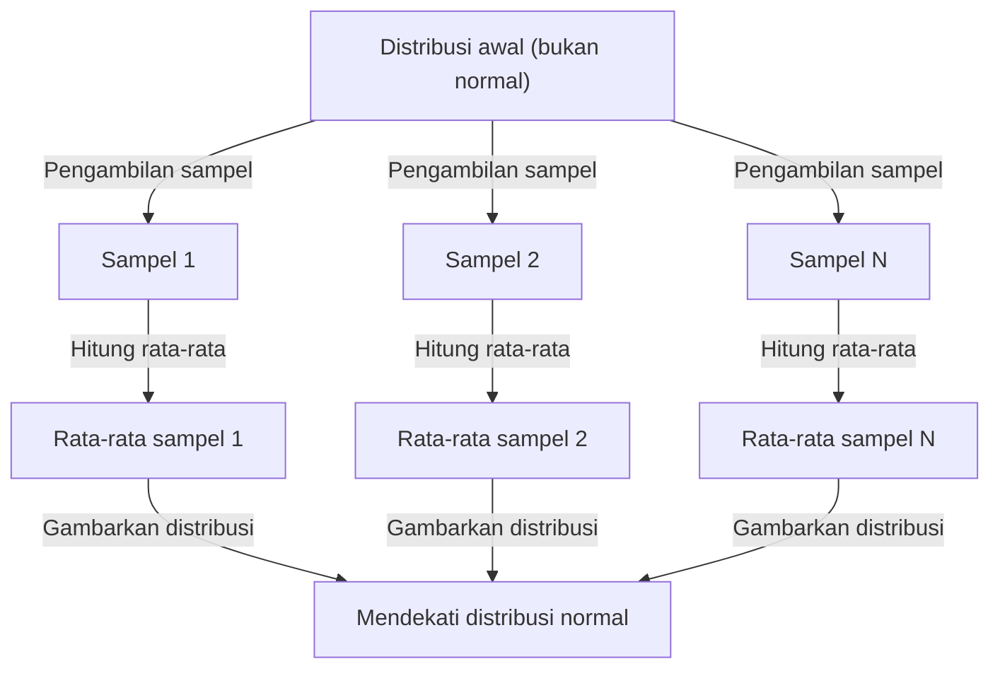

## 1. Pendahuluan

Saat mempelajari ilmu data dan statistik, satu konsep yang tidak dapat Anda hindari adalah **Teorema Limit Pusat** (CLT). Teorema ini memiliki sifat yang hampir ajaib bahwa "terlepas dari distribusi datanya, distribusi rata-rata sampel mendekati distribusi normal seiring dengan bertambahnya ukuran sampel."

Dalam artikel ini, kami memberikan penjelasan komprehensif tentang Teorema Limit Pusat, mulai dari gambaran intuitif hingga definisi matematika yang cermat dan penerapan praktis.

## 2. Apa Teorema Limit Pusat?

Teorema Limit Pusat (CLT) adalah salah satu hasil yang paling kuat dan mengejutkan dalam teori probabilitas dan statistik. Sederhananya, jumlah (atau rata-rata) sejumlah besar variabel acak independen yang diambil sampelnya secara acak didekati dengan distribusi normal, terlepas dari distribusi asli variabel-variabel tersebut.

### 2.1 Pemahaman Intuitif

Pertimbangkan dadu. Saat Anda melempar satu dadu, distribusi hasilnya seragam. Namun, saat Anda melempar dua dadu dan menjumlahkannya, distribusinya menjadi segitiga, mencapai puncaknya pada 7. Saat Anda menambah jumlah dadu, distribusi jumlahnya mendekati kurva halus berbentuk lonceng — yaitu **distribusi normal**.

### 2.2 Definisi Matematika

Misalkan sampel $n$ $X_1, X_2, \dots, X_n$ diambil secara acak dari suatu populasi dan terdistribusi secara independen dan identik (i.i.d.). Misalkan mean populasi (nilai yang diharapkan) adalah $\mu$ dan variansnya adalah $\sigma^2$.

Jika kita mendefinisikan mean sampel sebagai $\bar{X} = \frac{1}{n} \sum_{i=1}^{n} X_i$, maka menurut Teorema Limit Pusat, ketika $n$ cukup besar, variabel standar berikut $Z$ konvergen ke distribusi normal standar $\mathcal{N}(0, 1)$:


$$
Z = \frac{\bar{X} - \mu}{\frac{\sigma}{\sqrt{n}}} \xrightarrow{d} \mathcal{N}(0, 1) \text{ as } n \to \infty
$$


Di sini, $\xrightarrow{d}$ menunjukkan konvergensi dalam distribusi. $\text{ as } n \to \infty$ menunjukkan bahwa ukuran sampel mendekati tak terhingga.

## 3. Memvisualisasikan Teorema Limit Pusat

Untuk memahami secara visual cara kerja Teorema Limit Pusat, berikut adalah diagram proses menggunakan Mermaid.



## 4. Simulasi dengan Python

Mari kita verifikasi hal ini tidak hanya dengan teori tetapi dengan menjalankan program secara nyata. Kami akan mengambil sampel data dari distribusi seragam dan mensimulasikan bagaimana rata-rata didistribusikan.

```python
import numpy as np
import matplotlib.pyplot as plt

# Population parameters (Uniform distribution [0, 1])
mu = 0.5
sigma = np.sqrt(1/12)

# Simulation settings
sample_sizes = [1, 5, 30, 100]
num_simulations = 10000

# Graph drawing settings
fig, axes = plt.subplots(2, 2, figsize=(12, 8))
axes = axes.flatten()

for i, n in enumerate(sample_sizes):
    # Draw n samples from a uniform distribution, num_simulations times
    samples = np.random.uniform(0, 1, (num_simulations, n))
    
    # Calculate the sample mean for each trial
    sample_means = np.mean(samples, axis=1)
    
    # Plot the histogram
    ax = axes[i]
    ax.hist(sample_means, bins=50, density=True, alpha=0.7, color='skyblue')
    ax.set_title(f"Sample size n={n}")
    
    # Add the theoretical normal distribution curve
    x = np.linspace(mu - 4*sigma/np.sqrt(n), mu + 4*sigma/np.sqrt(n), 100)
    y = (1 / (np.sqrt(2 * np.pi) * (sigma/np.sqrt(n)))) * np.exp(-0.5 * ((x - mu) / (sigma/np.sqrt(n)))**2)
    ax.plot(x, y, 'r-', lw=2)

plt.tight_layout()
plt.show()
```

Saat Anda menjalankan kode ini, Anda dapat mengonfirmasi bahwa untuk $n=1$ distribusinya seragam, tetapi seiring bertambahnya $n$, histogram mendekati kurva distribusi normal berwarna merah.

## 5. Pentingnya dan Penerapan Teorema Limit Pusat

Mengapa Teorema Limit Pusat begitu penting? Hal ini karena bahkan tanpa mengetahui distribusi pasti dari data dunia nyata, kita dapat mengasumsikan distribusi normal untuk statistik seperti mean sampel, memungkinkan pengujian hipotesis, dan konstruksi interval kepercayaan.

### 5.1 Landasan Inferensi Statistik
Saat kita membuat kesimpulan dari data — dalam jajak pendapat, kendali mutu, pengujian A/B, dan banyak lagi — sebagian besar alasannya bergantung pada Teorema Limit Pusat.

### 5.2 Akumulasi Kesalahan
Kesalahan pengukuran dan berbagai jenis kebisingan di alam juga dapat dimodelkan sebagai jumlah dari banyak faktor independen kecil, itulah sebabnya faktor-faktor tersebut sering kali mengikuti distribusi normal. Hal ini juga yang menjadi alasan mengapa distribusi ini disebut distribusi Gaussian.

## 6. Mendalami: Pendekatan terhadap Pembuktian

Pembuktian Teorema Limit Pusat yang teliti menggunakan fungsi karakteristik (fungsi pembangkit momen) dan ekspansi Taylor. Berikut kami sajikan secara garis besarnya.

Dengan menggunakan fungsi karakteristik $\phi_X(t) = E[e^{itX}]$, fungsi karakteristik dari jumlah variabel acak independen menjadi produk dari fungsi karakteristik individualnya. Dengan menghitung fungsi karakteristik variabel terstandarisasi $Z$ dan mengambil limitnya sebagai $n \to \infty$, dapat ditunjukkan bahwa fungsi tersebut konvergen ke fungsi karakteristik distribusi normal standar $e^{-t^2/2}$. Hal ini membuktikan bahwa distribusi itu sendiri konvergen terhadap distribusi normal.

## 7. Kesimpulan

Teorema Limit Pusat adalah teorema luar biasa indah yang mengungkapkan keteraturan yang tersembunyi di balik data yang kacau. Dengan memahami teorema ini, Anda akan dapat memperoleh wawasan lebih dalam tentang analisis data dan konstruksi model statistik.


## Lampiran: Latar Belakang dan Sejarah Matematika Terperinci

### Lampiran 1: Perkembangan Teori Probabilitas
Sejarah Teorema Limit Pusat sangat mendalam, bermula dari demonstrasi Abraham de Moivre tentang perkiraan normal distribusi binomial. Hal ini kemudian diperluas oleh Pierre-Simon Laplace, dan bukti dalam kondisi yang lebih umum diberikan oleh Aleksandr Lyapunov. Dalam teori probabilitas modern, terdapat berbagai perluasan, seperti kondisi Lindeberg dan kondisi Lyapunov. Kondisi ini menjamin bahwa tidak ada variabel acak individual yang mempunyai pengaruh dominan terhadap jumlah keseluruhan. Hal ini memberikan jawaban atas pertanyaan mendasar mengapa beragam fenomena di alam dan ilmu-ilmu sosial dapat didekati dengan distribusi normal.

### Lampiran 2: Perkembangan Teori Probabilitas
Sejarah Teorema Limit Pusat sangat mendalam, bermula dari demonstrasi Abraham de Moivre tentang perkiraan normal distribusi binomial. Hal ini kemudian diperluas oleh Pierre-Simon Laplace, dan bukti dalam kondisi yang lebih umum diberikan oleh Aleksandr Lyapunov. Dalam teori probabilitas modern, terdapat berbagai perluasan, seperti kondisi Lindeberg dan kondisi Lyapunov. Kondisi ini menjamin bahwa tidak ada variabel acak individual yang mempunyai pengaruh dominan terhadap jumlah keseluruhan. Hal ini memberikan jawaban atas pertanyaan mendasar mengapa beragam fenomena di alam dan ilmu-ilmu sosial dapat didekati dengan distribusi normal.

### Lampiran 3: Perkembangan Teori Probabilitas
Sejarah Teorema Limit Pusat sangat mendalam, bermula dari demonstrasi Abraham de Moivre tentang perkiraan normal distribusi binomial. Hal ini kemudian diperluas oleh Pierre-Simon Laplace, dan bukti dalam kondisi yang lebih umum diberikan oleh Aleksandr Lyapunov. Dalam teori probabilitas modern, terdapat berbagai perluasan, seperti kondisi Lindeberg dan kondisi Lyapunov. Kondisi ini menjamin bahwa tidak ada variabel acak individual yang mempunyai pengaruh dominan terhadap jumlah keseluruhan. Hal ini memberikan jawaban atas pertanyaan mendasar mengapa beragam fenomena di alam dan ilmu-ilmu sosial dapat didekati dengan distribusi normal.

### Lampiran 4: Perkembangan Teori Probabilitas
Sejarah Teorema Limit Pusat sangat mendalam, bermula dari demonstrasi Abraham de Moivre tentang perkiraan normal distribusi binomial. Hal ini kemudian diperluas oleh Pierre-Simon Laplace, dan bukti dalam kondisi yang lebih umum diberikan oleh Aleksandr Lyapunov. Dalam teori probabilitas modern, terdapat berbagai perluasan, seperti kondisi Lindeberg dan kondisi Lyapunov. Kondisi ini menjamin bahwa tidak ada variabel acak individual yang mempunyai pengaruh dominan terhadap jumlah keseluruhan. Hal ini memberikan jawaban atas pertanyaan mendasar mengapa beragam fenomena di alam dan ilmu-ilmu sosial dapat didekati dengan distribusi normal.

### Lampiran 5: Perkembangan Teori Probabilitas
Sejarah Teorema Limit Pusat sangat mendalam, bermula dari demonstrasi Abraham de Moivre tentang perkiraan normal distribusi binomial. Hal ini kemudian diperluas oleh Pierre-Simon Laplace, dan bukti dalam kondisi yang lebih umum diberikan oleh Aleksandr Lyapunov. Dalam teori probabilitas modern, terdapat berbagai perluasan, seperti kondisi Lindeberg dan kondisi Lyapunov. Kondisi ini menjamin bahwa tidak ada variabel acak individual yang mempunyai pengaruh dominan terhadap jumlah keseluruhan. Hal ini memberikan jawaban atas pertanyaan mendasar mengapa beragam fenomena di alam dan ilmu-ilmu sosial dapat didekati dengan distribusi normal.

### Lampiran 6: Perkembangan Teori Probabilitas
Sejarah Teorema Limit Pusat sangat mendalam, bermula dari demonstrasi Abraham de Moivre tentang perkiraan normal distribusi binomial. Hal ini kemudian diperluas oleh Pierre-Simon Laplace, dan bukti dalam kondisi yang lebih umum diberikan oleh Aleksandr Lyapunov. Dalam teori probabilitas modern, terdapat berbagai perluasan, seperti kondisi Lindeberg dan kondisi Lyapunov. Kondisi ini menjamin bahwa tidak ada variabel acak individual yang mempunyai pengaruh dominan terhadap jumlah keseluruhan. Hal ini memberikan jawaban atas pertanyaan mendasar mengapa beragam fenomena di alam dan ilmu-ilmu sosial dapat didekati dengan distribusi normal.

### Lampiran 7: Perkembangan Teori Probabilitas
Sejarah Teorema Limit Pusat sangat mendalam, bermula dari demonstrasi Abraham de Moivre tentang perkiraan normal distribusi binomial. Hal ini kemudian diperluas oleh Pierre-Simon Laplace, dan bukti dalam kondisi yang lebih umum diberikan oleh Aleksandr Lyapunov. Dalam teori probabilitas modern, terdapat berbagai perluasan, seperti kondisi Lindeberg dan kondisi Lyapunov. Kondisi ini menjamin bahwa tidak ada variabel acak individual yang mempunyai pengaruh dominan terhadap jumlah keseluruhan. Hal ini memberikan jawaban atas pertanyaan mendasar mengapa beragam fenomena di alam dan ilmu-ilmu sosial dapat didekati dengan distribusi normal.

### Lampiran 8: Perkembangan Teori Probabilitas
Sejarah Teorema Limit Pusat sangat mendalam, bermula dari demonstrasi Abraham de Moivre tentang perkiraan normal distribusi binomial. Hal ini kemudian diperluas oleh Pierre-Simon Laplace, dan bukti dalam kondisi yang lebih umum diberikan oleh Aleksandr Lyapunov. Dalam teori probabilitas modern, terdapat berbagai perluasan, seperti kondisi Lindeberg dan kondisi Lyapunov. Kondisi ini menjamin bahwa tidak ada variabel acak individual yang mempunyai pengaruh dominan terhadap jumlah keseluruhan. Hal ini memberikan jawaban atas pertanyaan mendasar mengapa beragam fenomena di alam dan ilmu-ilmu sosial dapat didekati dengan distribusi normal.

### Lampiran 9: Perkembangan Teori Probabilitas
Sejarah Teorema Limit Pusat sangat mendalam, bermula dari demonstrasi Abraham de Moivre tentang perkiraan normal distribusi binomial. Hal ini kemudian diperluas oleh Pierre-Simon Laplace, dan bukti dalam kondisi yang lebih umum diberikan oleh Aleksandr Lyapunov. Dalam teori probabilitas modern, terdapat berbagai perluasan, seperti kondisi Lindeberg dan kondisi Lyapunov. Kondisi ini menjamin bahwa tidak ada variabel acak individual yang mempunyai pengaruh dominan terhadap jumlah keseluruhan. Hal ini memberikan jawaban atas pertanyaan mendasar mengapa beragam fenomena di alam dan ilmu-ilmu sosial dapat didekati dengan distribusi normal.

### Lampiran 10: Perkembangan Teori Probabilitas
Sejarah Teorema Limit Pusat sangat mendalam, bermula dari demonstrasi Abraham de Moivre tentang perkiraan normal distribusi binomial. Hal ini kemudian diperluas oleh Pierre-Simon Laplace, dan bukti dalam kondisi yang lebih umum diberikan oleh Aleksandr Lyapunov. Dalam teori probabilitas modern, terdapat berbagai perluasan, seperti kondisi Lindeberg dan kondisi Lyapunov. Kondisi ini menjamin bahwa tidak ada variabel acak individual yang mempunyai pengaruh dominan terhadap jumlah keseluruhan. Hal ini memberikan jawaban atas pertanyaan mendasar mengapa beragam fenomena di alam dan ilmu-ilmu sosial dapat didekati dengan distribusi normal.

### Lampiran 11: Perkembangan Teori Probabilitas
Sejarah Teorema Limit Pusat sangat mendalam, bermula dari demonstrasi Abraham de Moivre tentang perkiraan normal distribusi binomial. Hal ini kemudian diperluas oleh Pierre-Simon Laplace, dan bukti dalam kondisi yang lebih umum diberikan oleh Aleksandr Lyapunov. Dalam teori probabilitas modern, terdapat berbagai perluasan, seperti kondisi Lindeberg dan kondisi Lyapunov. Kondisi ini menjamin bahwa tidak ada variabel acak individual yang mempunyai pengaruh dominan terhadap jumlah keseluruhan. Hal ini memberikan jawaban atas pertanyaan mendasar mengapa beragam fenomena di alam dan ilmu-ilmu sosial dapat didekati dengan distribusi normal.

### Lampiran 12: Perkembangan Teori Probabilitas
Sejarah Teorema Limit Pusat sangat mendalam, bermula dari demonstrasi Abraham de Moivre tentang perkiraan normal distribusi binomial. Hal ini kemudian diperluas oleh Pierre-Simon Laplace, dan bukti dalam kondisi yang lebih umum diberikan oleh Aleksandr Lyapunov. Dalam teori probabilitas modern, terdapat berbagai perluasan, seperti kondisi Lindeberg dan kondisi Lyapunov. Kondisi ini menjamin bahwa tidak ada variabel acak individual yang mempunyai pengaruh dominan terhadap jumlah keseluruhan. Hal ini memberikan jawaban atas pertanyaan mendasar mengapa beragam fenomena di alam dan ilmu-ilmu sosial dapat didekati dengan distribusi normal.

### Lampiran 13: Perkembangan Teori Probabilitas
Sejarah Teorema Limit Pusat sangat mendalam, bermula dari demonstrasi Abraham de Moivre tentang perkiraan normal distribusi binomial. Hal ini kemudian diperluas oleh Pierre-Simon Laplace, dan bukti dalam kondisi yang lebih umum diberikan oleh Aleksandr Lyapunov. Dalam teori probabilitas modern, terdapat berbagai perluasan, seperti kondisi Lindeberg dan kondisi Lyapunov. Kondisi ini menjamin bahwa tidak ada variabel acak individual yang mempunyai pengaruh dominan terhadap jumlah keseluruhan. Hal ini memberikan jawaban atas pertanyaan mendasar mengapa beragam fenomena di alam dan ilmu-ilmu sosial dapat didekati dengan distribusi normal.

### Lampiran 14: Perkembangan Teori Probabilitas
Sejarah Teorema Limit Pusat sangat mendalam, bermula dari demonstrasi Abraham de Moivre tentang perkiraan normal distribusi binomial. Hal ini kemudian diperluas oleh Pierre-Simon Laplace, dan bukti dalam kondisi yang lebih umum diberikan oleh Aleksandr Lyapunov. Dalam teori probabilitas modern, terdapat berbagai perluasan, seperti kondisi Lindeberg dan kondisi Lyapunov. Kondisi ini menjamin bahwa tidak ada variabel acak individual yang mempunyai pengaruh dominan terhadap jumlah keseluruhan. Hal ini memberikan jawaban atas pertanyaan mendasar mengapa beragam fenomena di alam dan ilmu-ilmu sosial dapat didekati dengan distribusi normal.

### Lampiran 15: Perkembangan Teori Probabilitas
Sejarah Teorema Limit Pusat sangat mendalam, bermula dari demonstrasi Abraham de Moivre tentang perkiraan normal distribusi binomial. Hal ini kemudian diperluas oleh Pierre-Simon Laplace, dan bukti dalam kondisi yang lebih umum diberikan oleh Aleksandr Lyapunov. Dalam teori probabilitas modern, terdapat berbagai perluasan, seperti kondisi Lindeberg dan kondisi Lyapunov. Kondisi ini menjamin bahwa tidak ada variabel acak individual yang mempunyai pengaruh dominan terhadap jumlah keseluruhan. Hal ini memberikan jawaban atas pertanyaan mendasar mengapa beragam fenomena di alam dan ilmu-ilmu sosial dapat didekati dengan distribusi normal.

### Lampiran 16: Perkembangan Teori Probabilitas
Sejarah Teorema Limit Pusat sangat mendalam, bermula dari demonstrasi Abraham de Moivre tentang perkiraan normal distribusi binomial. Hal ini kemudian diperluas oleh Pierre-Simon Laplace, dan bukti dalam kondisi yang lebih umum diberikan oleh Aleksandr Lyapunov. Dalam teori probabilitas modern, terdapat berbagai perluasan, seperti kondisi Lindeberg dan kondisi Lyapunov. Kondisi ini menjamin bahwa tidak ada variabel acak individual yang mempunyai pengaruh dominan terhadap jumlah keseluruhan. Hal ini memberikan jawaban atas pertanyaan mendasar mengapa beragam fenomena di alam dan ilmu-ilmu sosial dapat didekati dengan distribusi normal.

### Lampiran 17: Perkembangan Teori Probabilitas
Sejarah Teorema Limit Pusat sangat mendalam, bermula dari demonstrasi Abraham de Moivre tentang perkiraan normal distribusi binomial. Hal ini kemudian diperluas oleh Pierre-Simon Laplace, dan bukti dalam kondisi yang lebih umum diberikan oleh Aleksandr Lyapunov. Dalam teori probabilitas modern, terdapat berbagai perluasan, seperti kondisi Lindeberg dan kondisi Lyapunov. Kondisi ini menjamin bahwa tidak ada variabel acak individual yang mempunyai pengaruh dominan terhadap jumlah keseluruhan. Hal ini memberikan jawaban atas pertanyaan mendasar mengapa beragam fenomena di alam dan ilmu-ilmu sosial dapat didekati dengan distribusi normal.

### Lampiran 18: Perkembangan Teori Probabilitas
Sejarah Teorema Limit Pusat sangat mendalam, bermula dari demonstrasi Abraham de Moivre tentang perkiraan normal distribusi binomial. Hal ini kemudian diperluas oleh Pierre-Simon Laplace, dan bukti dalam kondisi yang lebih umum diberikan oleh Aleksandr Lyapunov. Dalam teori probabilitas modern, terdapat berbagai perluasan, seperti kondisi Lindeberg dan kondisi Lyapunov. Kondisi ini menjamin bahwa tidak ada variabel acak individual yang mempunyai pengaruh dominan terhadap jumlah keseluruhan. Hal ini memberikan jawaban atas pertanyaan mendasar mengapa beragam fenomena di alam dan ilmu-ilmu sosial dapat didekati dengan distribusi normal.

### Lampiran 19: Perkembangan Teori Probabilitas
Sejarah Teorema Limit Pusat sangat mendalam, bermula dari demonstrasi Abraham de Moivre tentang perkiraan normal distribusi binomial. Hal ini kemudian diperluas oleh Pierre-Simon Laplace, dan bukti dalam kondisi yang lebih umum diberikan oleh Aleksandr Lyapunov. Dalam teori probabilitas modern, terdapat berbagai perluasan, seperti kondisi Lindeberg dan kondisi Lyapunov. Kondisi ini menjamin bahwa tidak ada variabel acak individual yang mempunyai pengaruh dominan terhadap jumlah keseluruhan. Hal ini memberikan jawaban atas pertanyaan mendasar mengapa beragam fenomena di alam dan ilmu-ilmu sosial dapat didekati dengan distribusi normal.

### Lampiran 20: Perkembangan Teori Probabilitas
Sejarah Teorema Limit Pusat sangat mendalam, bermula dari demonstrasi Abraham de Moivre tentang perkiraan normal distribusi binomial. Hal ini kemudian diperluas oleh Pierre-Simon Laplace, dan bukti dalam kondisi yang lebih umum diberikan oleh Aleksandr Lyapunov. Dalam teori probabilitas modern, terdapat berbagai perluasan, seperti kondisi Lindeberg dan kondisi Lyapunov. Kondisi ini menjamin bahwa tidak ada variabel acak individual yang mempunyai pengaruh dominan terhadap jumlah keseluruhan. Hal ini memberikan jawaban atas pertanyaan mendasar mengapa beragam fenomena di alam dan ilmu-ilmu sosial dapat didekati dengan distribusi normal.

### Lampiran 21: Perkembangan Teori Probabilitas
Sejarah Teorema Limit Pusat sangat mendalam, bermula dari demonstrasi Abraham de Moivre tentang perkiraan normal distribusi binomial. Hal ini kemudian diperluas oleh Pierre-Simon Laplace, dan bukti dalam kondisi yang lebih umum diberikan oleh Aleksandr Lyapunov. Dalam teori probabilitas modern, terdapat berbagai perluasan, seperti kondisi Lindeberg dan kondisi Lyapunov. Kondisi ini menjamin bahwa tidak ada variabel acak individual yang mempunyai pengaruh dominan terhadap jumlah keseluruhan. Hal ini memberikan jawaban atas pertanyaan mendasar mengapa beragam fenomena di alam dan ilmu-ilmu sosial dapat didekati dengan distribusi normal.

### Lampiran 22: Perkembangan Teori Probabilitas
Sejarah Teorema Limit Pusat sangat mendalam, bermula dari demonstrasi Abraham de Moivre tentang perkiraan normal distribusi binomial. Hal ini kemudian diperluas oleh Pierre-Simon Laplace, dan bukti dalam kondisi yang lebih umum diberikan oleh Aleksandr Lyapunov. Dalam teori probabilitas modern, terdapat berbagai perluasan, seperti kondisi Lindeberg dan kondisi Lyapunov. Kondisi ini menjamin bahwa tidak ada variabel acak individual yang mempunyai pengaruh dominan terhadap jumlah keseluruhan. Hal ini memberikan jawaban atas pertanyaan mendasar mengapa beragam fenomena di alam dan ilmu-ilmu sosial dapat didekati dengan distribusi normal.

### Lampiran 23: Perkembangan Teori Probabilitas
Sejarah Teorema Limit Pusat sangat mendalam, bermula dari demonstrasi Abraham de Moivre tentang perkiraan normal distribusi binomial. Hal ini kemudian diperluas oleh Pierre-Simon Laplace, dan bukti dalam kondisi yang lebih umum diberikan oleh Aleksandr Lyapunov. Dalam teori probabilitas modern, terdapat berbagai perluasan, seperti kondisi Lindeberg dan kondisi Lyapunov. Kondisi ini menjamin bahwa tidak ada variabel acak individual yang mempunyai pengaruh dominan terhadap jumlah keseluruhan. Hal ini memberikan jawaban atas pertanyaan mendasar mengapa beragam fenomena di alam dan ilmu-ilmu sosial dapat didekati dengan distribusi normal.

### Lampiran 24: Perkembangan Teori Probabilitas
Sejarah Teorema Limit Pusat sangat mendalam, bermula dari demonstrasi Abraham de Moivre tentang perkiraan normal distribusi binomial. Hal ini kemudian diperluas oleh Pierre-Simon Laplace, dan bukti dalam kondisi yang lebih umum diberikan oleh Aleksandr Lyapunov. Dalam teori probabilitas modern, terdapat berbagai perluasan, seperti kondisi Lindeberg dan kondisi Lyapunov. Kondisi ini menjamin bahwa tidak ada variabel acak individual yang mempunyai pengaruh dominan terhadap jumlah keseluruhan. Hal ini memberikan jawaban atas pertanyaan mendasar mengapa beragam fenomena di alam dan ilmu-ilmu sosial dapat didekati dengan distribusi normal.

### Lampiran 25: Perkembangan Teori Probabilitas
Sejarah Teorema Limit Pusat sangat mendalam, bermula dari demonstrasi Abraham de Moivre tentang perkiraan normal distribusi binomial. Hal ini kemudian diperluas oleh Pierre-Simon Laplace, dan bukti dalam kondisi yang lebih umum diberikan oleh Aleksandr Lyapunov. Dalam teori probabilitas modern, terdapat berbagai perluasan, seperti kondisi Lindeberg dan kondisi Lyapunov. Kondisi ini menjamin bahwa tidak ada variabel acak individual yang mempunyai pengaruh dominan terhadap jumlah keseluruhan. Hal ini memberikan jawaban atas pertanyaan mendasar mengapa beragam fenomena di alam dan ilmu-ilmu sosial dapat didekati dengan distribusi normal.

### Lampiran 26: Perkembangan Teori Probabilitas
Sejarah Teorema Limit Pusat sangat mendalam, bermula dari demonstrasi Abraham de Moivre tentang perkiraan normal distribusi binomial. Hal ini kemudian diperluas oleh Pierre-Simon Laplace, dan bukti dalam kondisi yang lebih umum diberikan oleh Aleksandr Lyapunov. Dalam teori probabilitas modern, terdapat berbagai perluasan, seperti kondisi Lindeberg dan kondisi Lyapunov. Kondisi ini menjamin bahwa tidak ada variabel acak individual yang mempunyai pengaruh dominan terhadap jumlah keseluruhan. Hal ini memberikan jawaban atas pertanyaan mendasar mengapa beragam fenomena di alam dan ilmu-ilmu sosial dapat didekati dengan distribusi normal.

### Lampiran 27: Perkembangan Teori Probabilitas
Sejarah Teorema Limit Pusat sangat mendalam, bermula dari demonstrasi Abraham de Moivre tentang perkiraan normal distribusi binomial. Hal ini kemudian diperluas oleh Pierre-Simon Laplace, dan bukti dalam kondisi yang lebih umum diberikan oleh Aleksandr Lyapunov. Dalam teori probabilitas modern, terdapat berbagai perluasan, seperti kondisi Lindeberg dan kondisi Lyapunov. Kondisi ini menjamin bahwa tidak ada variabel acak individual yang mempunyai pengaruh dominan terhadap jumlah keseluruhan. Hal ini memberikan jawaban atas pertanyaan mendasar mengapa beragam fenomena di alam dan ilmu-ilmu sosial dapat didekati dengan distribusi normal.

### Lampiran 28: Perkembangan Teori Probabilitas
Sejarah Teorema Limit Pusat sangat mendalam, bermula dari demonstrasi Abraham de Moivre tentang perkiraan normal distribusi binomial. Hal ini kemudian diperluas oleh Pierre-Simon Laplace, dan bukti dalam kondisi yang lebih umum diberikan oleh Aleksandr Lyapunov. Dalam teori probabilitas modern, terdapat berbagai perluasan, seperti kondisi Lindeberg dan kondisi Lyapunov. Kondisi ini menjamin bahwa tidak ada variabel acak individual yang mempunyai pengaruh dominan terhadap jumlah keseluruhan. Hal ini memberikan jawaban atas pertanyaan mendasar mengapa beragam fenomena di alam dan ilmu-ilmu sosial dapat didekati dengan distribusi normal.

### Lampiran 29: Perkembangan Teori Probabilitas
Sejarah Teorema Limit Pusat sangat mendalam, bermula dari demonstrasi Abraham de Moivre tentang perkiraan normal distribusi binomial. Hal ini kemudian diperluas oleh Pierre-Simon Laplace, dan bukti dalam kondisi yang lebih umum diberikan oleh Aleksandr Lyapunov. Dalam teori probabilitas modern, terdapat berbagai perluasan, seperti kondisi Lindeberg dan kondisi Lyapunov. Kondisi ini menjamin bahwa tidak ada variabel acak individual yang mempunyai pengaruh dominan terhadap jumlah keseluruhan. Hal ini memberikan jawaban atas pertanyaan mendasar mengapa beragam fenomena di alam dan ilmu-ilmu sosial dapat didekati dengan distribusi normal.

### Lampiran 30: Perkembangan Teori Probabilitas
Sejarah Teorema Limit Pusat sangat mendalam, bermula dari demonstrasi Abraham de Moivre tentang perkiraan normal distribusi binomial. Hal ini kemudian diperluas oleh Pierre-Simon Laplace, dan bukti dalam kondisi yang lebih umum diberikan oleh Aleksandr Lyapunov. Dalam teori probabilitas modern, terdapat berbagai perluasan, seperti kondisi Lindeberg dan kondisi Lyapunov. Kondisi ini menjamin bahwa tidak ada variabel acak individual yang mempunyai pengaruh dominan terhadap jumlah keseluruhan. Hal ini memberikan jawaban atas pertanyaan mendasar mengapa beragam fenomena di alam dan ilmu-ilmu sosial dapat didekati dengan distribusi normal.
