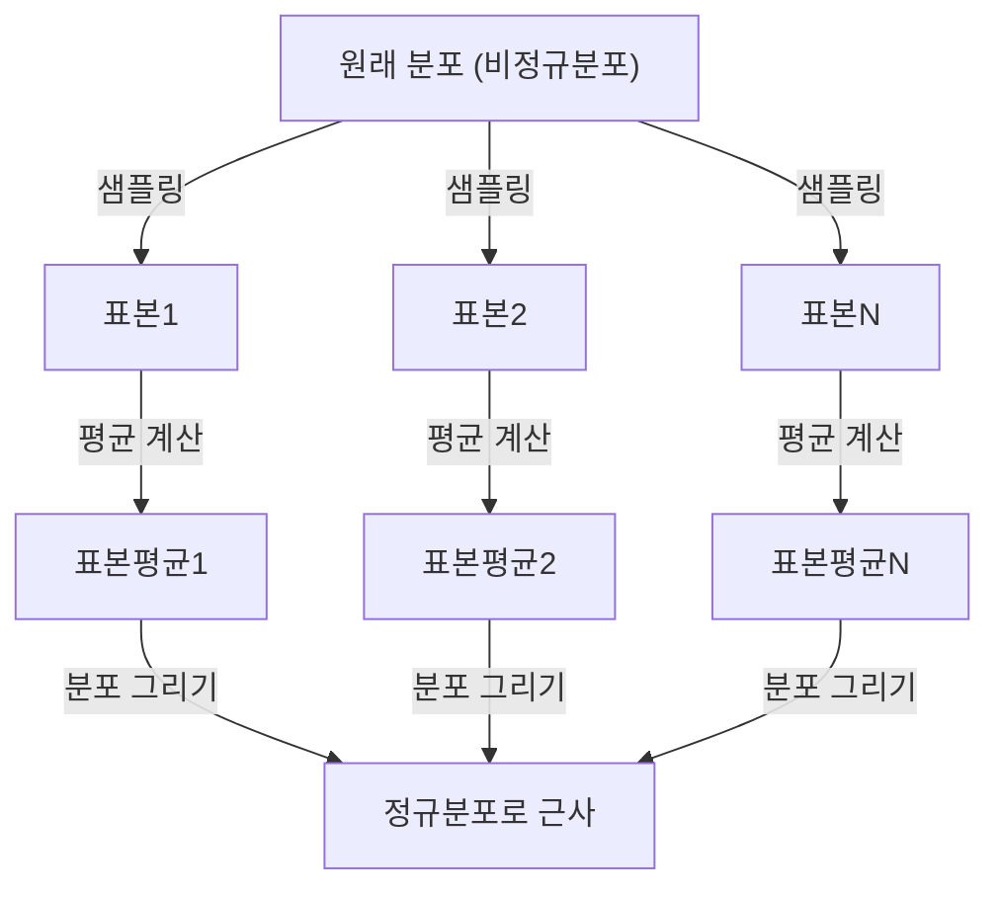

## 1. 머리말

데이터 과학이나 통계학을 배울 때 피할 수 없는 것이 바로 **중심극한정리** ([Central Limit Theorem](https://kenji.blog/p/central-limit-theorem/))입니다. 이 정리는 "어떤 분포를 가진 데이터라도, 그 표본평균의 분포는 표본 크기가 커짐에 따라 정규분포에 가까워진다"라는 마치 마법 같은 성질을 가지고 있습니다.

본 기사에서는 이 중심극한정리에 대해 직관적인 이미지부터 엄밀한 수학적 정의, 그리고 실제 응용 예까지 폭넓게 해설합니다.

## 2. 중심극한정리란 무엇인가?

중심극한정리(CLT)는 확률론 및 통계학에서 가장 강력하고 놀라운 결과 중 하나입니다. 간단히 말해, 무작위로 추출된 다수의 독립적인 확률변수의 합(또는 평균)은 원래 변수가 어떤 분포를 가졌든 상관없이 정규분포에 근사된다는 것입니다.

### 2.1 직관적인 이해

주사위를 생각해 봅시다. 하나의 주사위를 굴릴 때 나오는 눈의 분포는 균등분포입니다. 하지만 두 개의 주사위를 굴려 그 합을 구하면 분포는 중앙의 7을 정점으로 하는 삼각형 모양이 됩니다. 게다가 주사위의 수를 늘려가면 그 합의 분포는 부드러운 종 모양의 곡선, 즉 **정규분포** 에 가까워집니다.

### 2.2 수학적 정의

어떤 모집단에서 무작위로 추출된 $n$ 개의 표본 $X_1, X_2, \dots, X_n$ 이 서로 독립이고 동일한 분포를 따른다고(i.i.d.) 가정합시다. 이 모집단의 평균(기댓값)을 $\mu$, 분산을 $\sigma^2$ 이라고 합니다.

표본평균을 $\bar{X} = \frac{1}{n} \sum_{i=1}^{n} X_i$ 라고 하면, 중심극한정리에 의해 $n$ 이 충분히 클 때 다음과 같이 표준화된 변수 $Z$ 는 표준정규분포 $\mathcal{N}(0, 1)$ 로 수렴합니다.


$$
Z = \frac{\bar{X} - \mu}{\frac{\sigma}{\sqrt{n}}} \xrightarrow{d} \mathcal{N}(0, 1) \text{ as } n \to \infty
$$


여기서 $\xrightarrow{d}$ 는 분포수렴을 의미합니다. $\text{ as } n \to \infty$ 는 표본 크기가 무한대로 가까워짐을 나타냅니다.

## 3. 중심극한정리의 시각화

중심극한정리가 어떻게 작동하는지 시각적으로 이해하기 위해, Mermaid를 이용한 프로세스 다이어그램을 보여줍니다.



## 4. Python을 이용한 시뮬레이션

이론뿐만 아니라, 실제로 프로그램을 실행하여 확인해 봅시다. 균등분포에서 데이터를 추출하고 그 평균이 어떻게 분포하는지 시뮬레이션합니다.

```python
import numpy as np
import matplotlib.pyplot as plt

# 모집단의 파라미터 (균등분포 [0, 1])
mu = 0.5
sigma = np.sqrt(1/12)

# 시뮬레이션 설정
sample_sizes = [1, 5, 30, 100]
num_simulations = 10000

# 그래프 그리기 설정
fig, axes = plt.subplots(2, 2, figsize=(12, 8))
axes = axes.flatten()

for i, n in enumerate(sample_sizes):
    # 균등분포에서 n 개의 샘플을 num_simulations 번 추출
    samples = np.random.uniform(0, 1, (num_simulations, n))
    
    # 각 시도에서의 표본평균 계산
    sample_means = np.mean(samples, axis=1)
    
    # 히스토그램 플롯
    ax = axes[i]
    ax.hist(sample_means, bins=50, density=True, alpha=0.7, color='skyblue')
    ax.set_title(f"샘플 크기 n={n}")
    
    # 이론적인 정규분포 곡선 추가
    x = np.linspace(mu - 4*sigma/np.sqrt(n), mu + 4*sigma/np.sqrt(n), 100)
    y = (1 / (np.sqrt(2 * np.pi) * (sigma/np.sqrt(n)))) * np.exp(-0.5 * ((x - mu) / (sigma/np.sqrt(n)))**2)
    ax.plot(x, y, 'r-', lw=2)

plt.tight_layout()
plt.show()
```

이 코드를 실행하면 $n=1$ 일 때는 균등분포이지만, $n$ 이 커짐에 따라 히스토그램이 빨간 선의 정규분포에 가까워지는 것을 확인할 수 있습니다.

## 5. 중심극한정리의 중요성과 응용

왜 중심극한정리는 그토록 중요할까요? 그것은 현실 세계의 많은 데이터가 정확히 어떤 분포를 하고 있는지 몰라도 표본평균 등의 통계량을 이용하면 정규분포를 가정하여 가설 검정이나 신뢰구간을 구축할 수 있기 때문입니다.

### 5.1 통계적 추정의 기초
여론조사, 품질 관리, A/B 테스트 등 우리가 데이터로부터 무언가를 추정할 때, 그 근거의 대부분은 중심극한정리에 의존하고 있습니다.

### 5.2 오차의 축적
측정 오차나 자연계의 많은 노이즈도 다수의 미세한 독립적인 요인들의 합으로 모델링할 수 있기 때문에 정규분포를 따르는 경우가 많습니다. 이것이 가우스 분포라고도 불리는 이유입니다.

## 6. 더 깊은 탐구: 증명에 대한 접근

중심극한정리의 엄밀한 증명에는 특성함수나 테일러 전개가 사용됩니다. 여기서는 그 개요를 소개합니다.

특성함수 $\phi_X(t) = E[e^{itX}]$ 를 이용하면, 독립적인 확률변수 합의 특성함수는 각각의 특성함수의 곱이 됩니다. 표준화된 변수 $Z$ 의 특성함수를 계산하고 $n \to \infty$ 의 극한을 취하면 표준정규분포의 특성함수 $e^{-t^2/2}$ 로 수렴함이 나타납니다. 이로써 분포 자체가 정규분포로 수렴함이 증명됩니다.

## 7. 맺음말

중심극한정리는 혼돈스러운 데이터 이면에 숨어있는 질서를 보여주는 매우 아름다운 정리입니다. 이 정리를 이해함으로써 데이터 분석이나 통계 모델 구축에 있어 더 깊은 통찰을 얻을 수 있을 것입니다.


## 부록: 상세한 수학적 배경과 역사

### 부록 1: 확률론에서의 발전
중심극한정리의 역사는 깊으며, 아브라암 드 무아브르가 이항분포의 정규 근사를 보여준 것에서 비롯됩니다. 그 후 피에르 시몽 라플라스에 의해 확장되었고, 알렉산드르 리야프노프에 의해 더 일반적인 조건 하에서의 증명이 주어졌습니다. 현대의 확률론에서는 린데베르그 조건이나 리야프노프 조건 등 다양한 확장이 존재합니다. 이러한 조건들은 개별 확률변수가 전체 합에 지배적인 영향을 미치지 않음을 보장하는 것입니다. 이로써 자연계나 사회과학의 다양한 현상들이 왜 정규분포에 의해 근사될 수 있는지에 대한 근원적인 질문에 해답이 주어집니다.

### 부록 2: 적용 조건과 정리의 의미

본문에서 다루는 기본 형태에서는 $X_1,\ldots,X_n$ 이 독립동일분포이고, 유한한 평균 $\mu$ 와 유한하고 양수인 분산 $0<\sigma^2<\infty$ 를 가질 것이 요구됩니다. '어떤 분포든'이라는 설명은 이 조건의 범위 내에서 이해해 주십시오. 정규분포에 가까워지는 것은 표준화된 합이나 표본평균의 분포이며, 개별 관측값의 분포가 변하는 것은 아닙니다.

### 부록 3: 표준오차와 대수의 법칙

독립성에 의해 표본평균의 기댓값과 분산은 다음과 같습니다. 표준오차는 표본평균의 산포도이며 개별 데이터의 표준편차와는 다릅니다.

$$
E[\bar X_n]=\mu,\qquad \operatorname{Var}(\bar X_n)=\frac{\sigma^2}{n},\qquad \operatorname{SE}(\bar X_n)=\frac{\sigma}{\sqrt n}.
$$

표본 수를 4배로 늘리면 표준오차는 절반이 됩니다. 대수의 법칙은 표본평균이 $\mu$ 에 가까워짐을 말하고, 중심극한정리는 그 주위의 변동을 $\sqrt{n}$ 배 한 분포의 형태를 말합니다.

### 부록 4: 특성함수에 의한 증명 보충

$Y_i=(X_i-\mu)/\sigma$, $Z_n=n^{-1/2}\sum_{i=1}^nY_i$ 로 둡니다. $E[Y_i]=0$, $E[Y_i^2]=1$ 이므로 특성함수는 원점 근처에서 다음과 같이 전개할 수 있습니다.

$$
\phi_Y(t)=E[e^{itY}]=1-\frac{t^2}{2}+o(t^2)\quad(t\to0).
$$

독립성으로부터 다음 식을 얻습니다. 극한은 표준정규분포의 특성함수이므로 레비의 연속성 정리에 의해 분포수렴이 따릅니다. 특성함수와 적률[생성함수](https://kenji.blog/p/generating-functions/)는 다른 것이며, 이 증명에 적률[생성함수](https://kenji.blog/p/generating-functions/)의 존재는 필요하지 않습니다.

$$
\phi_{Z_n}(t)=\left[\phi_Y\!\left(\frac{t}{\sqrt n}\right)\right]^n
=\left[1-\frac{t^2}{2n}+o\!\left(\frac1n\right)\right]^n
\longrightarrow e^{-t^2/2}.
$$

### 부록 5: 적용할 수 없는 예와 근사 정확도

코시 분포에는 유한한 평균도 분산도 없으며, 독립적인 표준 코시 변수의 표본평균도 표준 코시 분포 그대로입니다. 또한 모든 $X_i$ 가 같은 변수와 같다면 독립성이 없고 평균을 내도 산포도는 줄어들지 않습니다. '$n\ge30$ 이면 항상 충분하다'라는 보장도 없습니다. 왜도나 꼬리의 두께에 따라 필요한 표본 수는 달라집니다. 독립이면서 동일분포가 아닌 경우로의 확장에는 린데베르그 조건이나 리야프노프 조건 등 추가적인 조건을 확인할 필요가 있습니다.
