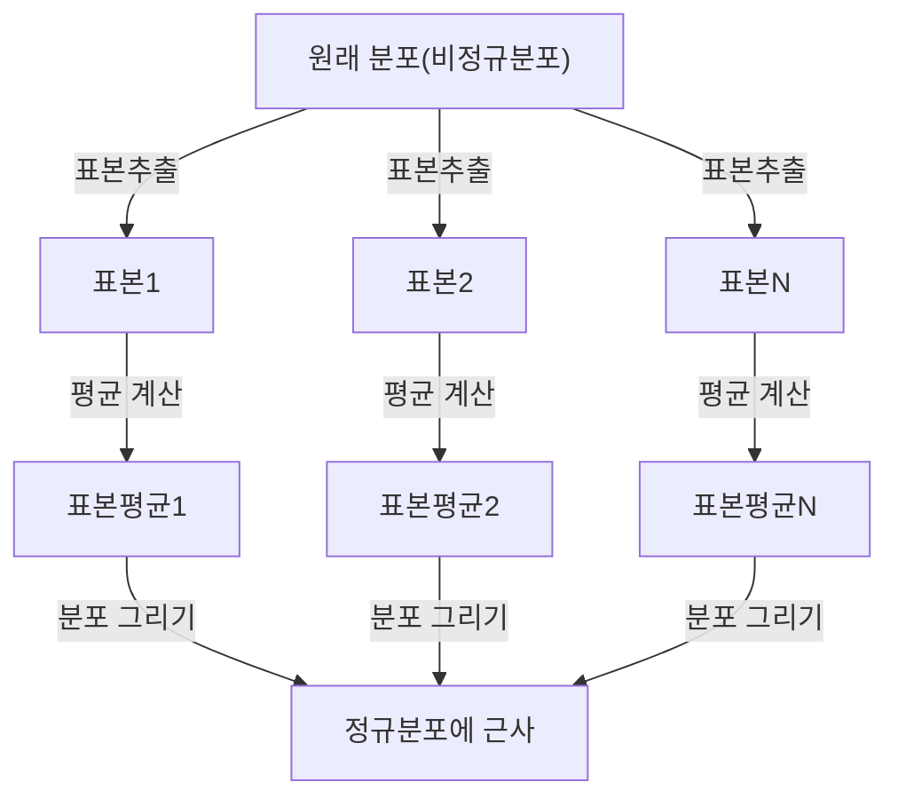

## 1. 서론

데이터 과학이나 통계학을 공부할 때 피할 수 없는 것이 바로 **중심극한정리**(Central Limit Theorem)입니다. 이 정리는 "어떤 분포를 가진 데이터라도 그 표본평균의 분포는 표본 크기가 커질수록 정규분포에 가까워진다"는 마치 마법과 같은 성질을 가지고 있습니다.

이 글에서는 중심극한정리에 대해 직관적인 이미지부터 엄밀한 수학적 정의, 그리고 실제 응용 사례까지 폭넓게 해설합니다.

## 2. 중심극한정리란 무엇인가?

중심극한정리(CLT)는 확률론 및 통계학에서 가장 강력하고 놀라운 결과 중 하나입니다. 간단히 말하면, 무작위로 추출된 다수의 독립적인 확률변수의 합(또는 평균)은 원래 변수가 어떤 분포를 가지고 있었더라도 정규분포로 근사된다는 것입니다.

### 2.1 직관적 이해

주사위를 생각해 봅시다. 하나의 주사위를 던졌을 때 나오는 눈의 분포는 균등분포입니다. 그러나 두 개의 주사위를 던져서 그 합을 구하면 분포는 중앙의 7을 정점으로 하는 삼각형 모양이 됩니다. 주사위의 수를 더 늘려가면 그 합의 분포는 매끄러운 종 모양의 곡선, 즉 **정규분포** 에 가까워집니다.

### 2.2 수학적 정의

어떤 모집단에서 무작위로 추출된 $n$개의 표본 $X_1, X_2, \dots, X_n$이 서로 독립적으로 동일한 분포를 따른다고(i.i.d.) 합시다. 이 모집단의 평균(기댓값)을 $\mu$, 분산을 $\sigma^2$이라 합니다.

표본평균을 $\bar{X} = \frac{1}{n} \sum_{i=1}^{n} X_i$로 정의하면, 중심극한정리에 따르면 $n$이 충분히 클 때, 다음과 같이 표준화된 변수 $Z$는 표준정규분포 $\mathcal{N}(0, 1)$에 수렴합니다.


$$
Z = \frac{\bar{X} - \mu}{\frac{\sigma}{\sqrt{n}}} \xrightarrow{d} \mathcal{N}(0, 1) \text{ as } n \to \infty
$$


여기서 $\xrightarrow{d}$는 분포수렴을 의미합니다. $\text{ as } n \to \infty$는 표본 크기가 무한대에 가까워짐을 나타냅니다.

## 3. 중심극한정리의 시각화

중심극한정리가 어떻게 작용하는지 시각적으로 이해하기 위해 Mermaid를 사용한 프로세스 다이어그램을 보여드립니다.



## 4. Python을 이용한 시뮬레이션

이론만이 아니라 실제로 프로그램을 실행하여 확인해 봅시다. 균등분포에서 데이터를 추출하여 그 평균이 어떻게 분포하는지를 시뮬레이션합니다.

```python
import numpy as np
import matplotlib.pyplot as plt

# 모집단 파라미터(균등분포 [0, 1])
mu = 0.5
sigma = np.sqrt(1/12)

# 시뮬레이션 설정
sample_sizes = [1, 5, 30, 100]
num_simulations = 10000

# 그래프 그리기 설정
fig, axes = plt.subplots(2, 2, figsize=(12, 8))
axes = axes.flatten()

for i, n in enumerate(sample_sizes):
    # 균등분포에서 n개의 표본을 num_simulations회 추출
    samples = np.random.uniform(0, 1, (num_simulations, n))
    
    # 각 시행에서의 표본평균 계산
    sample_means = np.mean(samples, axis=1)
    
    # 히스토그램 플롯
    ax = axes[i]
    ax.hist(sample_means, bins=50, density=True, alpha=0.7, color='skyblue')
    ax.set_title(f"표본 크기 n={n}")
    
    # 이론적 정규분포 곡선 추가
    x = np.linspace(mu - 4*sigma/np.sqrt(n), mu + 4*sigma/np.sqrt(n), 100)
    y = (1 / (np.sqrt(2 * np.pi) * (sigma/np.sqrt(n)))) * np.exp(-0.5 * ((x - mu) / (sigma/np.sqrt(n)))**2)
    ax.plot(x, y, 'r-', lw=2)

plt.tight_layout()
plt.show()
```

이 코드를 실행하면 $n=1$일 때는 균등분포이지만, $n$이 커질수록 히스토그램이 빨간 선의 정규분포에 가까워지는 것을 확인할 수 있습니다.

## 5. 중심극한정리의 중요성과 응용

왜 중심극한정리는 그토록 중요할까요? 그것은 현실 세계의 많은 데이터가 정확히 어떤 분포를 하고 있는지 모르더라도, 표본평균 등의 통계량을 사용하면 정규분포를 가정하여 가설검정이나 신뢰구간 구축이 가능하기 때문입니다.

### 5.1 통계적 추론의 기초
여론조사, 품질관리, A/B 테스트 등 우리가 데이터로부터 무엇인가를 추론할 때, 그 근거의 대부분은 중심극한정리에 의존하고 있습니다.

### 5.2 오차의 축적
측정오차나 자연계의 많은 노이즈도 다수의 미소한 독립적 요인의 합으로 모델링할 수 있기 때문에 정규분포를 따르는 경우가 많습니다. 이것이 가우스 분포라고도 불리는 이유입니다.

## 6. 더 깊이 파고들기: 증명으로의 접근

중심극한정리의 엄밀한 증명에는 특성함수(적률생성함수)와 테일러 전개가 사용됩니다. 여기서는 그 개요를 소개합니다.

특성함수 $\phi_X(t) = E[e^{itX}]$를 사용하면, 독립적인 확률변수의 합의 특성함수는 각각의 특성함수의 곱이 됩니다. 표준화된 변수 $Z$의 특성함수를 계산하고 $n \to \infty$의 극한을 취하면, 표준정규분포의 특성함수 $e^{-t^2/2}$에 수렴함이 보여집니다. 이를 통해 분포 자체가 정규분포에 수렴함이 증명됩니다.

## 7. 마치며

중심극한정리는 혼돈스러운 데이터 뒤에 숨겨진 질서를 보여주는 매우 아름다운 정리입니다. 이 정리를 이해함으로써 데이터 분석이나 통계 모델 구축에서 더 깊은 통찰을 얻을 수 있을 것입니다.


## 부록: 상세한 수학적 배경과 역사

### 부록 1: 확률론에서의 발전
중심극한정리의 역사는 깊으며, 아브라함 드 무아브르가 이항분포의 정규근사를 보인 것에서 시작됩니다. 이후 피에르-시몽 라플라스에 의해 확장되었고, 알렉산드르 랴푸노프에 의해 더 일반적인 조건 하에서의 증명이 주어졌습니다. 현대 확률론에서는 린데베르그 조건이나 랴푸노프 조건 등 다양한 확장이 존재합니다. 이러한 조건들은 개별 확률변수가 전체 합에 대해 지배적인 영향을 미치지 않음을 보장합니다. 이를 통해 자연계와 사회과학의 다양한 현상이 왜 정규분포로 근사될 수 있는지에 대한 근원적인 물음에 대한 해답이 제공됩니다.

### 부록 2: 확률론에서의 발전
중심극한정리의 역사는 깊으며, 아브라함 드 무아브르가 이항분포의 정규근사를 보인 것에서 시작됩니다. 이후 피에르-시몽 라플라스에 의해 확장되었고, 알렉산드르 랴푸노프에 의해 더 일반적인 조건 하에서의 증명이 주어졌습니다. 현대 확률론에서는 린데베르그 조건이나 랴푸노프 조건 등 다양한 확장이 존재합니다. 이러한 조건들은 개별 확률변수가 전체 합에 대해 지배적인 영향을 미치지 않음을 보장합니다. 이를 통해 자연계와 사회과학의 다양한 현상이 왜 정규분포로 근사될 수 있는지에 대한 근원적인 물음에 대한 해답이 제공됩니다.

### 부록 3: 확률론에서의 발전
중심극한정리의 역사는 깊으며, 아브라함 드 무아브르가 이항분포의 정규근사를 보인 것에서 시작됩니다. 이후 피에르-시몽 라플라스에 의해 확장되었고, 알렉산드르 랴푸노프에 의해 더 일반적인 조건 하에서의 증명이 주어졌습니다. 현대 확률론에서는 린데베르그 조건이나 랴푸노프 조건 등 다양한 확장이 존재합니다. 이러한 조건들은 개별 확률변수가 전체 합에 대해 지배적인 영향을 미치지 않음을 보장합니다. 이를 통해 자연계와 사회과학의 다양한 현상이 왜 정규분포로 근사될 수 있는지에 대한 근원적인 물음에 대한 해답이 제공됩니다.

### 부록 4: 확률론에서의 발전
중심극한정리의 역사는 깊으며, 아브라함 드 무아브르가 이항분포의 정규근사를 보인 것에서 시작됩니다. 이후 피에르-시몽 라플라스에 의해 확장되었고, 알렉산드르 랴푸노프에 의해 더 일반적인 조건 하에서의 증명이 주어졌습니다. 현대 확률론에서는 린데베르그 조건이나 랴푸노프 조건 등 다양한 확장이 존재합니다. 이러한 조건들은 개별 확률변수가 전체 합에 대해 지배적인 영향을 미치지 않음을 보장합니다. 이를 통해 자연계와 사회과학의 다양한 현상이 왜 정규분포로 근사될 수 있는지에 대한 근원적인 물음에 대한 해답이 제공됩니다.

### 부록 5: 확률론에서의 발전
중심극한정리의 역사는 깊으며, 아브라함 드 무아브르가 이항분포의 정규근사를 보인 것에서 시작됩니다. 이후 피에르-시몽 라플라스에 의해 확장되었고, 알렉산드르 랴푸노프에 의해 더 일반적인 조건 하에서의 증명이 주어졌습니다. 현대 확률론에서는 린데베르그 조건이나 랴푸노프 조건 등 다양한 확장이 존재합니다. 이러한 조건들은 개별 확률변수가 전체 합에 대해 지배적인 영향을 미치지 않음을 보장합니다. 이를 통해 자연계와 사회과학의 다양한 현상이 왜 정규분포로 근사될 수 있는지에 대한 근원적인 물음에 대한 해답이 제공됩니다.

### 부록 6: 확률론에서의 발전
중심극한정리의 역사는 깊으며, 아브라함 드 무아브르가 이항분포의 정규근사를 보인 것에서 시작됩니다. 이후 피에르-시몽 라플라스에 의해 확장되었고, 알렉산드르 랴푸노프에 의해 더 일반적인 조건 하에서의 증명이 주어졌습니다. 현대 확률론에서는 린데베르게 조건이나 랴푸노프 조건 등 다양한 확장이 존재합니다. 이러한 조건들은 개별 확률변수가 전체 합에 대해 지배적인 영향을 미치지 않음을 보장합니다. 이를 통해 자연계와 사회과학의 다양한 현상이 왜 정규분포로 근사될 수 있는지에 대한 근원적인 물음에 대한 해답이 제공됩니다.

### 부록 7: 확률론에서의 발전
중심극한정리의 역사는 깊으며, 아브라함 드 무아브르가 이항분포의 정규근사를 보인 것에서 시작됩니다. 이후 피에르-시몽 라플라스에 의해 확장되었고, 알렉산드르 랴푸노프에 의해 더 일반적인 조건 하에서의 증명이 주어졌습니다. 현대 확률론에서는 린데베르게 조건이나 랴푸노프 조건 등 다양한 확장이 존재합니다. 이러한 조건들은 개별 확률변수가 전체 합에 대해 지배적인 영향을 미치지 않음을 보장합니다. 이를 통해 자연계와 사회과학의 다양한 현상이 왜 정규분포로 근사될 수 있는지에 대한 근원적인 물음에 대한 해답이 제공됩니다.

### 부록 8: 확률론에서의 발전
중심극한정리의 역사는 깊으며, 아브라함 드 무아브르가 이항분포의 정규근사를 보인 것에서 시작됩니다. 이후 피에르-시몽 라플라스에 의해 확장되었고, 알렉산드르 랴푸노프에 의해 더 일반적인 조건 하에서의 증명이 주어졌습니다. 현대 확률론에서는 린데베르게 조건이나 랴푸노프 조건 등 다양한 확장이 존재합니다. 이러한 조건들은 개별 확률변수가 전체 합에 대해 지배적인 영향을 미치지 않음을 보장합니다. 이를 통해 자연계와 사회과학의 다양한 현상이 왜 정규분포로 근사될 수 있는지에 대한 근원적인 물음에 대한 해답이 제공됩니다.

### 부록 9: 확률론에서의 발전
중심극한정리의 역사는 깊으며, 아브라함 드 무아브르가 이항분포의 정규근사를 보인 것에서 시작됩니다. 이후 피에르-시몽 라플라스에 의해 확장되었고, 알렉산드르 랴푸노프에 의해 더 일반적인 조건 하에서의 증명이 주어졌습니다. 현대 확률론에서는 린데베르게 조건이나 랴푸노프 조건 등 다양한 확장이 존재합니다. 이러한 조건들은 개별 확률변수가 전체 합에 대해 지배적인 영향을 미치지 않음을 보장합니다. 이를 통해 자연계와 사회과학의 다양한 현상이 왜 정규분포로 근사될 수 있는지에 대한 근원적인 물음에 대한 해답이 제공됩니다.

### 부록 10: 확률론에서의 발전
중심극한정리의 역사는 깊으며, 아브라함 드 무아브르가 이항분포의 정규근사를 보인 것에서 시작됩니다. 이후 피에르-시몽 라플라스에 의해 확장되었고, 알렉산드르 랴푸노프에 의해 더 일반적인 조건 하에서의 증명이 주어졌습니다. 현대 확률론에서는 린데베르게 조건이나 랴푸노프 조건 등 다양한 확장이 존재합니다. 이러한 조건들은 개별 확률변수가 전체 합에 대해 지배적인 영향을 미치지 않음을 보장합니다. 이를 통해 자연계와 사회과학의 다양한 현상이 왜 정규분포로 근사될 수 있는지에 대한 근원적인 물음에 대한 해답이 제공됩니다.

### 부록 11: 확률론에서의 발전
중심극한정리의 역사는 깊으며, 아브라함 드 무아브르가 이항분포의 정규근사를 보인 것에서 시작됩니다. 이후 피에르-시몽 라플라스에 의해 확장되었고, 알렉산드르 랴푸노프에 의해 더 일반적인 조건 하에서의 증명이 주어졌습니다. 현대 확률론에서는 린데베르게 조건이나 랴푸노프 조건 등 다양한 확장이 존재합니다. 이러한 조건들은 개별 확률변수가 전체 합에 대해 지배적인 영향을 미치지 않음을 보장합니다. 이를 통해 자연계와 사회과학의 다양한 현상이 왜 정규분포로 근사될 수 있는지에 대한 근원적인 물음에 대한 해답이 제공됩니다.

### 부록 12: 확률론에서의 발전
중심극한정리의 역사는 깊으며, 아브라함 드 무아브르가 이항분포의 정규근사를 보인 것에서 시작됩니다. 이후 피에르-시몽 라플라스에 의해 확장되었고, 알렉산드르 랴푸노프에 의해 더 일반적인 조건 하에서의 증명이 주어졌습니다. 현대 확률론에서는 린데베르게 조건이나 랴푸노프 조건 등 다양한 확장이 존재합니다. 이러한 조건들은 개별 확률변수가 전체 합에 대해 지배적인 영향을 미치지 않음을 보장합니다. 이를 통해 자연계와 사회과학의 다양한 현상이 왜 정규분포로 근사될 수 있는지에 대한 근원적인 물음에 대한 해답이 제공됩니다.

### 부록 13: 확률론에서의 발전
중심극한정리의 역사는 깊으며, 아브라함 드 무아브르가 이항분포의 정규근사를 보인 것에서 시작됩니다. 이후 피에르-시몽 라플라스에 의해 확장되었고, 알렉산드르 랴푸노프에 의해 더 일반적인 조건 하에서의 증명이 주어졌습니다. 현대 확률론에서는 린데베르게 조건이나 랴푸노프 조건 등 다양한 확장이 존재합니다. 이러한 조건들은 개별 확률변수가 전체 합에 대해 지배적인 영향을 미치지 않음을 보장합니다. 이를 통해 자연계와 사회과학의 다양한 현상이 왜 정규분포로 근사될 수 있는지에 대한 근원적인 물음에 대한 해답이 제공됩니다.

### 부록 14: 확률론에서의 발전
중심극한정리의 역사는 깊으며, 아브라함 드 무아브르가 이항분포의 정규근사를 보인 것에서 시작됩니다. 이후 피에르-시몽 라플라스에 의해 확장되었고, 알렉산드르 랴푸노프에 의해 더 일반적인 조건 하에서의 증명이 주어졌습니다. 현대 확률론에서는 린데베르게 조건이나 랴푸노프 조건 등 다양한 확장이 존재합니다. 이러한 조건들은 개별 확률변수가 전체 합에 대해 지배적인 영향을 미치지 않음을 보장합니다. 이를 통해 자연계와 사회과학의 다양한 현상이 왜 정규분포로 근사될 수 있는지에 대한 근원적인 물음에 대한 해답이 제공됩니다.

### 부록 15: 확률론에서의 발전
중심극한정리의 역사는 깊으며, 아브라함 드 무아브르가 이항분포의 정규근사를 보인 것에서 시작됩니다. 이후 피에르-시몽 라플라스에 의해 확장되었고, 알렉산드르 랴푸노프에 의해 더 일반적인 조건 하에서의 증명이 주어졌습니다. 현대 확률론에서는 린데베르게 조건이나 랴푸노프 조건 등 다양한 확장이 존재합니다. 이러한 조건들은 개별 확률변수가 전체 합에 대해 지배적인 영향을 미치지 않음을 보장합니다. 이를 통해 자연계와 사회과학의 다양한 현상이 왜 정규분포로 근사될 수 있는지에 대한 근원적인 물음에 대한 해답이 제공됩니다.

### 부록 16: 확률론에서의 발전
중심극한정리의 역사는 깊으며, 아브라함 드 무아브르가 이항분포의 정규근사를 보인 것에서 시작됩니다. 이후 피에르-시몽 라플라스에 의해 확장되었고, 알렉산드르 랴푸노프에 의해 더 일반적인 조건 하에서의 증명이 주어졌습니다. 현대 확률론에서는 린데베르게 조건이나 랴푸노프 조건 등 다양한 확장이 존재합니다. 이러한 조건들은 개별 확률변수가 전체 합에 대해 지배적인 영향을 미치지 않음을 보장합니다. 이를 통해 자연계와 사회과학의 다양한 현상이 왜 정규분포로 근사될 수 있는지에 대한 근원적인 물음에 대한 해답이 제공됩니다.

### 부록 17: 확률론에서의 발전
중심극한정리의 역사는 깊으며, 아브라함 드 무아브르가 이항분포의 정규근사를 보인 것에서 시작됩니다. 이후 피에르-시몽 라플라스에 의해 확장되었고, 알렉산드르 랴푸노프에 의해 더 일반적인 조건 하에서의 증명이 주어졌습니다. 현대 확률론에서는 린데베르게 조건이나 랴푸노프 조건 등 다양한 확장이 존재합니다. 이러한 조건들은 개별 확률변수가 전체 합에 대해 지배적인 영향을 미치지 않음을 보장합니다. 이를 통해 자연계와 사회과학의 다양한 현상이 왜 정규분포로 근사될 수 있는지에 대한 근원적인 물음에 대한 해답이 제공됩니다.

### 부록 18: 확률론에서의 발전
중심극한정리의 역사는 깊으며, 아브라함 드 무아브르가 이항분포의 정규근사를 보인 것에서 시작됩니다. 이후 피에르-시몽 라플라스에 의해 확장되었고, 알렉산드르 랴푸노프에 의해 더 일반적인 조건 하에서의 증명이 주어졌습니다. 현대 확률론에서는 린데베르게 조건이나 랴푸노프 조건 등 다양한 확장이 존재합니다. 이러한 조건들은 개별 확률변수가 전체 합에 대해 지배적인 영향을 미치지 않음을 보장합니다. 이를 통해 자연계와 사회과학의 다양한 현상이 왜 정규분포로 근사될 수 있는지에 대한 근원적인 물음에 대한 해답이 제공됩니다.

### 부록 19: 확률론에서의 발전
중심극한정리의 역사는 깊으며, 아브라함 드 무아브르가 이항분포의 정규근사를 보인 것에서 시작됩니다. 이후 피에르-시몽 라플라스에 의해 확장되었고, 알렉산드르 랴푸노프에 의해 더 일반적인 조건 하에서의 증명이 주어졌습니다. 현대 확률론에서는 린데베르게 조건이나 랴푸노프 조건 등 다양한 확장이 존재합니다. 이러한 조건들은 개별 확률변수가 전체 합에 대해 지배적인 영향을 미치지 않음을 보장합니다. 이를 통해 자연계와 사회과학의 다양한 현상이 왜 정규분포로 근사될 수 있는지에 대한 근원적인 물음에 대한 해답이 제공됩니다.

### 부록 20: 확률론에서의 발전
중심극한정리의 역사는 깊으며, 아브라함 드 무아브르가 이항분포의 정규근사를 보인 것에서 시작됩니다. 이후 피에르-시몽 라플라스에 의해 확장되었고, 알렉산드르 랴푸노프에 의해 더 일반적인 조건 하에서의 증명이 주어졌습니다. 현대 확률론에서는 린데베르게 조건이나 랴푸노프 조건 등 다양한 확장이 존재합니다. 이러한 조건들은 개별 확률변수가 전체 합에 대해 지배적인 영향을 미치지 않음을 보장합니다. 이를 통해 자연계와 사회과학의 다양한 현상이 왜 정규분포로 근사될 수 있는지에 대한 근원적인 물음에 대한 해답이 제공됩니다.

### 부록 21: 확률론에서의 발전
중심극한정리의 역사는 깊으며, 아브라함 드 무아브르가 이항분포의 정규근사를 보인 것에서 시작됩니다. 이후 피에르-시몽 라플라스에 의해 확장되었고, 알렉산드르 랴푸노프에 의해 더 일반적인 조건 하에서의 증명이 주어졌습니다. 현대 확률론에서는 린데베르게 조건이나 랴푸노프 조건 등 다양한 확장이 존재합니다. 이러한 조건들은 개별 확률변수가 전체 합에 대해 지배적인 영향을 미치지 않음을 보장합니다. 이를 통해 자연계와 사회과학의 다양한 현상이 왜 정규분포로 근사될 수 있는지에 대한 근원적인 물음에 대한 해답이 제공됩니다.

### 부록 22: 확률론에서의 발전
중심극한정리의 역사는 깊으며, 아브라함 드 무아브르가 이항분포의 정규근사를 보인 것에서 시작됩니다. 이후 피에르-시몽 라플라스에 의해 확장되었고, 알렉산드르 랴푸노프에 의해 더 일반적인 조건 하에서의 증명이 주어졌습니다. 현대 확률론에서는 린데베르게 조건이나 랴푸노프 조건 등 다양한 확장이 존재합니다. 이러한 조건들은 개별 확률변수가 전체 합에 대해 지배적인 영향을 미치지 않음을 보장합니다. 이를 통해 자연계와 사회과학의 다양한 현상이 왜 정규분포로 근사될 수 있는지에 대한 근원적인 물음에 대한 해답이 제공됩니다.

### 부록 23: 확률론에서의 발전
중심극한정리의 역사는 깊으며, 아브라함 드 무아브르가 이항분포의 정규근사를 보인 것에서 시작됩니다. 이후 피에르-시몽 라플라스에 의해 확장되었고, 알렉산드르 랴푸노프에 의해 더 일반적인 조건 하에서의 증명이 주어졌습니다. 현대 확률론에서는 린데베르게 조건이나 랴푸노프 조건 등 다양한 확장이 존재합니다. 이러한 조건들은 개별 확률변수가 전체 합에 대해 지배적인 영향을 미치지 않음을 보장합니다. 이를 통해 자연계와 사회과학의 다양한 현상이 왜 정규분포로 근사될 수 있는지에 대한 근원적인 물음에 대한 해답이 제공됩니다.

### 부록 24: 확률론에서의 발전
중심극한정리의 역사는 깊으며, 아브라함 드 무아브르가 이항분포의 정규근사를 보인 것에서 시작됩니다. 이후 피에르-시몽 라플라스에 의해 확장되었고, 알렉산드르 랴푸노프에 의해 더 일반적인 조건 하에서의 증명이 주어졌습니다. 현대 확률론에서는 린데베르게 조건이나 랴푸노프 조건 등 다양한 확장이 존재합니다. 이러한 조건들은 개별 확률변수가 전체 합에 대해 지배적인 영향을 미치지 않음을 보장합니다. 이를 통해 자연계와 사회과학의 다양한 현상이 왜 정규분포로 근사될 수 있는지에 대한 근원적인 물음에 대한 해답이 제공됩니다.

### 부록 25: 확률론에서의 발전
중심극한정리의 역사는 깊으며, 아브라함 드 무아브르가 이항분포의 정규근사를 보인 것에서 시작됩니다. 이후 피에르-시몽 라플라스에 의해 확장되었고, 알렉산드르 랴푸노프에 의해 더 일반적인 조건 하에서의 증명이 주어졌습니다. 현대 확률론에서는 린데베르게 조건이나 랴푸노프 조건 등 다양한 확장이 존재합니다. 이러한 조건들은 개별 확률변수가 전체 합에 대해 지배적인 영향을 미치지 않음을 보장합니다. 이를 통해 자연계와 사회과학의 다양한 현상이 왜 정규분포로 근사될 수 있는지에 대한 근원적인 물음에 대한 해답이 제공됩니다.

### 부록 26: 확률론에서의 발전
중심극한정리의 역사는 깊으며, 아브라함 드 무아브르가 이항분포의 정규근사를 보인 것에서 시작됩니다. 이후 피에르-시몽 라플라스에 의해 확장되었고, 알렉산드르 랴푸노프에 의해 더 일반적인 조건 하에서의 증명이 주어졌습니다. 현대 확률론에서는 린데베르게 조건이나 랴푸노프 조건 등 다양한 확장이 존재합니다. 이러한 조건들은 개별 확률변수가 전체 합에 대해 지배적인 영향을 미치지 않음을 보장합니다. 이를 통해 자연계와 사회과학의 다양한 현상이 왜 정규분포로 근사될 수 있는지에 대한 근원적인 물음에 대한 해답이 제공됩니다.

### 부록 27: 확률론에서의 발전
중심극한정리의 역사는 깊으며, 아브라함 드 무아브르가 이항분포의 정규근사를 보인 것에서 시작됩니다. 이후 피에르-시몽 라플라스에 의해 확장되었고, 알렉산드르 랴푸노프에 의해 더 일반적인 조건 하에서의 증명이 주어졌습니다. 현대 확률론에서는 린데베르게 조건이나 랴푸노프 조건 등 다양한 확장이 존재합니다. 이러한 조건들은 개별 확률변수가 전체 합에 대해 지배적인 영향을 미치지 않음을 보장합니다. 이를 통해 자연계와 사회과학의 다양한 현상이 왜 정규분포로 근사될 수 있는지에 대한 근원적인 물음에 대한 해답이 제공됩니다.

### 부록 28: 확률론에서의 발전
중심극한정리의 역사는 깊으며, 아브라함 드 무아브르가 이항분포의 정규근사를 보인 것에서 시작됩니다. 이후 피에르-시몽 라플라스에 의해 확장되었고, 알렉산드르 랴푸노프에 의해 더 일반적인 조건 하에서의 증명이 주어졌습니다. 현대 확률론에서는 린데베르게 조건이나 랴푸노프 조건 등 다양한 확장이 존재합니다. 이러한 조건들은 개별 확률변수가 전체 합에 대해 지배적인 영향을 미치지 않음을 보장합니다. 이를 통해 자연계와 사회과학의 다양한 현상이 왜 정규분포로 근사될 수 있는지에 대한 근원적인 물음에 대한 해답이 제공됩니다.

### 부록 29: 확률론에서의 발전
중심극한정리의 역사는 깊으며, 아브라함 드 무아브르가 이항분포의 정규근사를 보인 것에서 시작됩니다. 이후 피에르-시몽 라플라스에 의해 확장되었고, 알렉산드르 랴푸노프에 의해 더 일반적인 조건 하에서의 증명이 주어졌습니다. 현대 확률론에서는 린데베르게 조건이나 랴푸노프 조건 등 다양한 확장이 존재합니다. 이러한 조건들은 개별 확률변수가 전체 합에 대해 지배적인 영향을 미치지 않음을 보장합니다. 이를 통해 자연계와 사회과학의 다양한 현상이 왜 정규분포로 근사될 수 있는지에 대한 근원적인 물음에 대한 해답이 제공됩니다.

### 부록 30: 확률론에서의 발전
중심극한정리의 역사는 깊으며, 아브라함 드 무아브르가 이항분포의 정규근사를 보인 것에서 시작됩니다. 이후 피에르-시몽 라플라스에 의해 확장되었고, 알렉산드르 랴푸노프에 의해 더 일반적인 조건 하에서의 증명이 주어졌습니다. 현대 확률론에서는 린데베르게 조건이나 랴푸노프 조건 등 다양한 확장이 존재합니다. 이러한 조건들은 개별 확률변수가 전체 합에 대해 지배적인 영향을 미치지 않음을 보장합니다. 이를 통해 자연계와 사회과학의 다양한 현상이 왜 정규분포로 근사될 수 있는지에 대한 근원적인 물음에 대한 해답이 제공됩니다.
