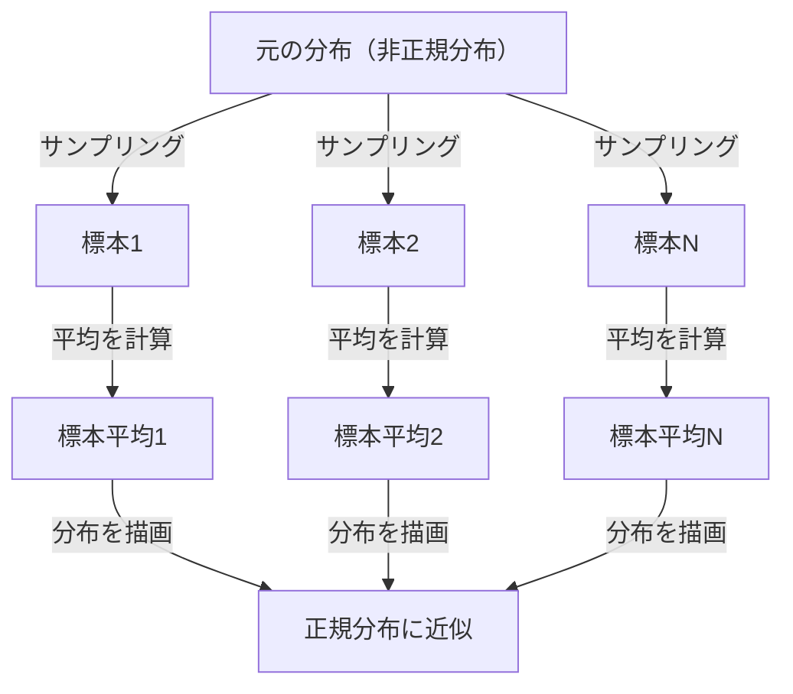

## 1. はじめに

データサイエンスや統計学を学ぶ上で、避けて通れないのが **[中心極限定理](https://kenji.blog/p/central-limit-theorem/)** ([Central Limit Theorem](https://kenji.blog/p/central-limit-theorem/)) です。この定理は、「どんな分布を持つデータであっても、その標本平均の分布は、サンプルサイズが大きくなるにつれて正規分布に近づく」という、まるで魔法のような性質を持っています。

本記事では、この[中心極限定理](https://kenji.blog/p/central-limit-theorem/)について、直感的なイメージから厳密な数学的定義、そして実際の応用例までを幅広く解説します。

## 2. [中心極限定理](https://kenji.blog/p/central-limit-theorem/)とは何か？

[中心極限定理](https://kenji.blog/p/central-limit-theorem/)（CLT）は、確率論および統計学における最も強力で驚くべき結果の一つです。簡単に言えば、無作為に抽出された多数の独立な確率変数の和（または平均）は、元の変数がどのような分布を持っていたとしても、正規分布に近似されるというものです。

### 2.1 直感的な理解

サイコロを考えてみましょう。1つのサイコロを振ったとき、出る目の分布は一様分布です。しかし、2つのサイコロを振ってその和をとると、分布は中央の7をピークとする三角形のようになります。さらにサイコロの数を増やしていくと、その和の分布は滑らかな釣鐘型の曲線、すなわち **正規分布** に近づいていきます。

### 2.2 数学的な定義

ある母集団から無作為に抽出された $n$ 個の標本 $X_1, X_2, \dots, X_n$ が互いに独立に同一の分布に従う（i.i.d.）とします。この母集団の平均（期待値）を $\mu$、分散を $\sigma^2$ とします。

標本平均を $\bar{X} = \frac{1}{n} \sum_{i=1}^{n} X_i$ とすると、[中心極限定理](https://kenji.blog/p/central-limit-theorem/)によれば、$n$ が十分に大きいとき、次のように標準化された変数 $Z$ は標準正規分布 $\mathcal{N}(0, 1)$ に収束します。


$$
Z = \frac{\bar{X} - \mu}{\frac{\sigma}{\sqrt{n}}} \xrightarrow{d} \mathcal{N}(0, 1) \text{ as } n \to \infty
$$


ここで、$\xrightarrow{d}$ は分布収束を意味します。$\text{ as } n \to \infty$ はサンプルサイズが無限大に近づくことを示しています。

## 3. [中心極限定理](https://kenji.blog/p/central-limit-theorem/)の可視化

[中心極限定理](https://kenji.blog/p/central-limit-theorem/)がどのように働くかを視覚的に理解するために、Mermaidを用いたプロセス図を示します。



## 4. Pythonによるシミュレーション

理論だけでなく、実際にプログラムを動かして確かめてみましょう。一様分布からデータを抽出し、その平均がどのように分布するかをシミュレーションします。

```python
import numpy as np
import matplotlib.pyplot as plt

# 母集団のパラメータ（一様分布 [0, 1]）
mu = 0.5
sigma = np.sqrt(1/12)

# シミュレーションの設定
sample_sizes = [1, 5, 30, 100]
num_simulations = 10000

# グラフの描画設定
fig, axes = plt.subplots(2, 2, figsize=(12, 8))
axes = axes.flatten()

for i, n in enumerate(sample_sizes):
    # 一様分布から n 個のサンプルを num_simulations 回抽出
    samples = np.random.uniform(0, 1, (num_simulations, n))
    
    # 各試行における標本平均を計算
    sample_means = np.mean(samples, axis=1)
    
    # ヒストグラムのプロット
    ax = axes[i]
    ax.hist(sample_means, bins=50, density=True, alpha=0.7, color='skyblue')
    ax.set_title(f"サンプルサイズ n={n}")
    
    # 理論的な正規分布曲線の追加
    x = np.linspace(mu - 4*sigma/np.sqrt(n), mu + 4*sigma/np.sqrt(n), 100)
    y = (1 / (np.sqrt(2 * np.pi) * (sigma/np.sqrt(n)))) * np.exp(-0.5 * ((x - mu) / (sigma/np.sqrt(n)))**2)
    ax.plot(x, y, 'r-', lw=2)

plt.tight_layout()
plt.show()
```

このコードを実行すると、$n=1$ の時は一様分布ですが、$n$ が大きくなるにつれてヒストグラムが赤線の正規分布に近づいていくことが確認できます。

## 5. [中心極限定理](https://kenji.blog/p/central-limit-theorem/)の重要性と応用

なぜ[中心極限定理](https://kenji.blog/p/central-limit-theorem/)はそれほど重要なのでしょうか？それは、現実世界の多くのデータが正確にどのような分布をしているかを知らなくても、標本平均などの統計量を用いれば正規分布を仮定して仮説検定や信頼区間の構築ができるからです。

### 5.1 統計的推測の基礎
世論調査、品質管理、A/Bテストなど、私たちがデータから何かを推測するとき、その根拠の多くは[中心極限定理](https://kenji.blog/p/central-limit-theorem/)に依存しています。

### 5.2 誤差の蓄積
測定誤差や自然界の多くのノイズも、多数の微小な独立した要因の和としてモデル化できるため、正規分布に従うことが多いです。これが[ガウス](https://kenji.blog/p/gauss/)分布とも呼ばれる理由です。

## 6. さらなる深掘り：証明へのアプローチ

[中心極限定理](https://kenji.blog/p/central-limit-theorem/)の厳密な証明には、特性関数やテイラー展開が用いられます。ここではその概略を紹介します。

特性関数 $\phi_X(t) = E[e^{itX}]$ を用いると、独立な確率変数の和の特性関数は、それぞれの特性関数の積になります。標準化された変数 $Z$ の特性関数を計算し、$n \to \infty$ の極限をとると、標準正規分布の特性関数 $e^{-t^2/2}$ に収束することが示されます。これにより、分布自体が正規分布に収束することが証明されます。

## 7. おわりに

[中心極限定理](https://kenji.blog/p/central-limit-theorem/)は、混沌としたデータの背後に潜む秩序を示す、非常に美しい定理です。この定理を理解することで、データ分析や統計モデルの構築において、より深い洞察を得ることができるでしょう。


## 付録: 詳細な数学的背景と歴史

### 付録 1: 確率論における発展
[中心極限定理](https://kenji.blog/p/central-limit-theorem/)の歴史は深く、アブラーム・ド・モアブルが二項分布の正規近似を示したことに端を発します。その後、ピエール＝シモン・ラプラスによって拡張され、アレクサンドル・リャプノフによってより一般的な条件下での証明が与えられました。現代の確率論においては、リンデベルグ条件やリャプノフ条件など、様々な拡張が存在します。これらの条件は、個々の確率変数が全体の和に対して支配的な影響を持たないことを保証するものです。これにより、自然界や社会科学の多様な現象が、なぜ正規分布によって近似できるのかという根源的な問いに対する解答が与えられます。

### 付録 2: 適用条件と定理の意味

本文で扱う基本形では、$X_1,\ldots,X_n$ が独立同分布で、有限の平均 $\mu$ と有限かつ正の分散 $0<\sigma^2<\infty$ を持つことが必要です。「どんな分布でも」という説明は、この条件の範囲で理解してください。正規分布に近づくのは標準化した和や標本平均の分布であり、個々の観測値の分布が変わるわけではありません。

### 付録 3: 標準誤差と[大数の法則](https://kenji.blog/p/law-of-large-numbers/)

独立性により、標本平均の期待値と分散は次のようになります。標準誤差は標本平均のばらつきであり、個々のデータの標準偏差とは異なります。

$$
E[\bar X_n]=\mu,\qquad \operatorname{Var}(\bar X_n)=\frac{\sigma^2}{n},\qquad \operatorname{SE}(\bar X_n)=\frac{\sigma}{\sqrt n}.
$$

標本数を4倍にすると標準誤差は半分になります。[大数の法則](https://kenji.blog/p/law-of-large-numbers/)は標本平均が $\mu$ に近づくことを述べ、[中心極限定理](https://kenji.blog/p/central-limit-theorem/)はその周囲の揺らぎを $\sqrt{n}$ 倍した分布の形を述べます。

### 付録 4: 特性関数による証明の補足

$Y_i=(X_i-\mu)/\sigma$、$Z_n=n^{-1/2}\sum_{i=1}^nY_i$ とおきます。$E[Y_i]=0$、$E[Y_i^2]=1$ なので、特性関数は原点の近くで次のように展開できます。

$$
\phi_Y(t)=E[e^{itY}]=1-\frac{t^2}{2}+o(t^2)\quad(t\to0).
$$

独立性から次式が得られます。極限は標準正規分布の特性関数なので、レヴィの連続性定理により分布収束が従います。特性関数と積率[母関数](https://kenji.blog/p/generating-functions/)は別物であり、この証明に積率[母関数](https://kenji.blog/p/generating-functions/)の存在は必要ありません。

$$
\phi_{Z_n}(t)=\left[\phi_Y\!\left(\frac{t}{\sqrt n}\right)\right]^n
=\left[1-\frac{t^2}{2n}+o\!\left(\frac1n\right)\right]^n
\longrightarrow e^{-t^2/2}.
$$

### 付録 5: 適用できない例と近似精度

[コーシー](https://kenji.blog/p/cauchy/)分布には有限の平均も分散もなく、独立な標準コーシー変数の標本平均も標準[コーシー](https://kenji.blog/p/cauchy/)分布のままです。また、すべての $X_i$ が同じ変数に等しい場合は独立性がなく、平均をとってもばらつきは減りません。「$n\ge30$ なら常に十分」という保証もありません。歪みや裾の重さによって必要な標本数は異なります。独立で同分布でない場合の拡張には、リンデベルグ条件やリャプノフ条件など、追加の条件を確認する必要があります。
