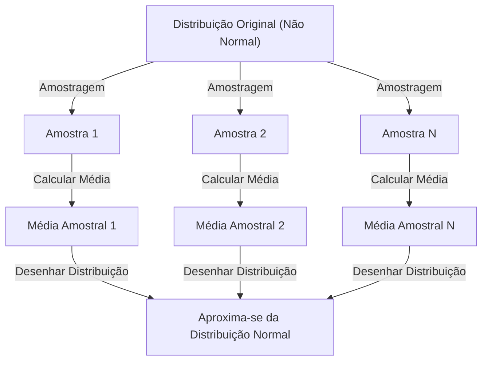

## 1. Introdução

Ao estudar ciência de dados e estatística, não podemos evitar o **[Teorema do Limite Central](https://kenji.blog/pt/p/central-limit-theorem/)** (TLC). Este teorema tem uma propriedade quase mágica: "Não importa qual seja a distribuição dos dados, a distribuição da média da amostra se aproxima de uma distribuição normal à medida que o tamanho da amostra aumenta."

Neste artigo, explicaremos amplamente o [Teorema do Limite Central](https://kenji.blog/pt/p/central-limit-theorem/), desde uma imagem intuitiva até uma rigorosa definição matemática e exemplos práticos de aplicação.

## 2. O que é o [Teorema do Limite Central](https://kenji.blog/pt/p/central-limit-theorem/)?

O [Teorema do Limite Central](https://kenji.blog/pt/p/central-limit-theorem/) (TLC) é um dos resultados mais poderosos e surpreendentes na teoria da probabilidade e estatística. Simplificando, a soma (ou média) de um grande número de variáveis aleatórias independentes amostradas aleatoriamente se aproxima de uma distribuição normal, independentemente da distribuição original das variáveis.

### 2.1 Compreensão Intuitiva

Pense nos dados. Quando você rola um dado, a distribuição dos resultados é uma distribuição uniforme. No entanto, quando você rola dois dados e soma seus valores, a distribuição se torna um triângulo com pico em 7 no centro. Conforme você aumenta ainda mais a quantidade de dados, a distribuição da soma se aproxima de uma curva suave em forma de sino, isto é, uma **distribuição normal**.

### 2.2 Definição Matemática

Suponha que $n$ amostras $X_1, X_2, \dots, X_n$ sorteadas aleatoriamente de uma população sigam distribuições idênticas e independentes (i.i.d.). Seja a média (valor esperado) desta população $\mu$ e a variância $\sigma^2$.

Seja a média amostral $\bar{X} = \frac{1}{n} \sum_{i=1}^{n} X_i$. De acordo com o [Teorema do Limite Central](https://kenji.blog/pt/p/central-limit-theorem/), quando $n$ é suficientemente grande, a variável padronizada $Z$ conforme mostrado abaixo converge para a distribuição normal padrão $\mathcal{N}(0, 1)$.


$$
Z = \frac{\bar{X} - \mu}{\frac{\sigma}{\sqrt{n}}} \xrightarrow{d} \mathcal{N}(0, 1) \text{ quando } n \to \infty
$$


Aqui, $\xrightarrow{d}$ significa convergência em distribuição. $\text{ quando } n \to \infty$ indica que o tamanho da amostra se aproxima do infinito.

## 3. Visualização do [Teorema do Limite Central](https://kenji.blog/pt/p/central-limit-theorem/)

Para entender visualmente como o [Teorema do Limite Central](https://kenji.blog/pt/p/central-limit-theorem/) funciona, aqui está um diagrama de processo usando Mermaid.



## 4. Simulação com Python

Em vez de apenas teoria, vamos realmente executar um programa para verificá-la. Simularemos a extração de dados de uma distribuição uniforme e veremos como a média se distribui.

```python
import numpy as np
import matplotlib.pyplot as plt

# Parâmetros da população (Distribuição uniforme [0, 1])
mu = 0.5
sigma = np.sqrt(1/12)

# Configurações de simulação
sample_sizes = [1, 5, 30, 100]
num_simulations = 10000

# Configurações de desenho do gráfico
fig, axes = plt.subplots(2, 2, figsize=(12, 8))
axes = axes.flatten()

for i, n in enumerate(sample_sizes):
    # Extrair n amostras da distribuição uniforme num_simulations vezes
    samples = np.random.uniform(0, 1, (num_simulations, n))
    
    # Calcular a média amostral para cada ensaio
    sample_means = np.mean(samples, axis=1)
    
    # Traçar o histograma
    ax = axes[i]
    ax.hist(sample_means, bins=50, density=True, alpha=0.7, color='skyblue')
    ax.set_title(f"Tamanho da amostra n={n}")
    
    # Adicionar curva teórica da distribuição normal
    x = np.linspace(mu - 4*sigma/np.sqrt(n), mu + 4*sigma/np.sqrt(n), 100)
    y = (1 / (np.sqrt(2 * np.pi) * (sigma/np.sqrt(n)))) * np.exp(-0.5 * ((x - mu) / (sigma/np.sqrt(n)))**2)
    ax.plot(x, y, 'r-', lw=2)

plt.tight_layout()
plt.show()
```

Ao executar este código, você pode confirmar que para $n=1$ é uma distribuição uniforme, mas à medida que $n$ aumenta, o histograma se aproxima da distribuição normal da linha vermelha.

## 5. Importância e Aplicações do [Teorema do Limite Central](https://kenji.blog/pt/p/central-limit-theorem/)

Por que o [Teorema do Limite Central](https://kenji.blog/pt/p/central-limit-theorem/) é tão importante? É porque, mesmo que não saibamos exatamente qual distribuição muitos dados do mundo real têm, podemos supor uma distribuição normal ao usar estatísticas como a média da amostra para conduzir testes de hipóteses e construir intervalos de confiança.

### 5.1 Fundamento da Inferência Estatística
Quando inferimos algo dos dados, como em pesquisas de opinião, controle de qualidade ou testes A/B, grande parte do raciocínio baseia-se no [Teorema do Limite Central](https://kenji.blog/pt/p/central-limit-theorem/).

### 5.2 Acúmulo de Erros
Os erros de medição e muitos ruídos na natureza também podem ser modelados como a soma de muitos pequenos fatores independentes, portanto, frequentemente seguem uma distribuição normal. É por isso que ela também é chamada de distribuição gaussiana.

## 6. Aprofundando: Abordagem para a Prova

Funções características e expansão de Taylor são usadas para uma prova estrita do [Teorema do Limite Central](https://kenji.blog/pt/p/central-limit-theorem/). Aqui está um breve resumo.

Usando a função característica $\phi_X(t) = E[e^{itX}]$, a função característica da soma de variáveis aleatórias independentes é o produto de suas respectivas funções características. Quando calculamos a função característica da variável padronizada $Z$ e tomamos o limite quando $n \to \infty$, pode-se provar que converge para $e^{-t^2/2}$, que é a função característica da distribuição normal padrão. Isso prova que a própria distribuição converge para uma distribuição normal.

## 7. Conclusão

O [Teorema do Limite Central](https://kenji.blog/pt/p/central-limit-theorem/) é um teorema extremamente belo que revela a ordem escondida por trás de dados caóticos. Ao compreender este teorema, você poderá obter percepções mais profundas na análise de dados e na construção de modelos estatísticos.


## Apêndice: Contexto Matemático Detalhado e História

### Apêndice 1: Desenvolvimento na Teoria da Probabilidade
A história do [Teorema do Limite Central](https://kenji.blog/pt/p/central-limit-theorem/) é profunda, originando-se de Abraham de Moivre mostrando a aproximação normal da distribuição binomial. Mais tarde foi expandida por Pierre-Simon Laplace, e Aleksandr Lyapunov forneceu uma prova sob condições mais gerais. Na moderna teoria das probabilidades, existem várias extensões, como a condição de Lindeberg e a condição de Lyapunov. Essas condições garantem que as variáveis aleatórias individuais não tenham uma influência dominante sobre a soma total. Isso fornece uma resposta à questão fundamental de por que diversos fenômenos na natureza e nas ciências sociais podem ser aproximados por uma distribuição normal.

### Apêndice 2: Condições de Aplicação e o Significado do Teorema

Na forma básica discutida neste texto, é necessário que $X_1,\ldots,X_n$ sejam independentes e identicamente distribuídas, com uma média finita $\mu$ e uma variância positiva finita $0<\sigma^2<\infty$. Por favor, compreenda a explicação "qualquer distribuição" dentro do escopo dessas condições. O que se aproxima de uma distribuição normal é a distribuição da soma padronizada ou da média amostral, e a distribuição das observações individuais não muda.

### Apêndice 3: Erro Padrão e a [Lei dos Grandes Números](https://kenji.blog/pt/p/law-of-large-numbers/)

Devido à independência, o valor esperado e a variância da média da amostra são os seguintes. O erro padrão é a dispersão da média amostral e é diferente do desvio padrão dos dados individuais.

$$
E[\bar X_n]=\mu,\qquad \operatorname{Var}(\bar X_n)=\frac{\sigma^2}{n},\qquad \operatorname{SE}(\bar X_n)=\frac{\sigma}{\sqrt n}.
$$

Quadruplicar o número de amostras reduz pela metade o erro padrão. A lei dos grandes números afirma que a média da amostra se aproxima de $\mu$, e o [Teorema do Limite Central](https://kenji.blog/pt/p/central-limit-theorem/) descreve a forma da distribuição multiplicando a flutuação ao seu redor por $\sqrt{n}$.

### Apêndice 4: Prova Suplementar Usando Funções Características

Seja $Y_i=(X_i-\mu)/\sigma$ e $Z_n=n^{-1/2}\sum_{i=1}^nY_i$. Como $E[Y_i]=0$ e $E[Y_i^2]=1$, a função característica pode ser expandida perto da origem da seguinte forma.

$$
\phi_Y(t)=E[e^{itY}]=1-\frac{t^2}{2}+o(t^2)\quad(t\to0).
$$

Da independência, obtém-se a seguinte equação. Como o limite é a função característica da distribuição normal padrão, a convergência em distribuição segue do teorema da continuidade de Lévy. Funções características e funções geradoras de momentos são diferentes, e a existência de uma função geradora de momentos não é necessária para essa prova.

$$
\phi_{Z_n}(t)=\left[\phi_Y\!\left(\frac{t}{\sqrt n}\right)\right]^n
=\left[1-\frac{t^2}{2n}+o\!\left(\frac1n\right)\right]^n
\longrightarrow e^{-t^2/2}.
$$

### Apêndice 5: Exemplos Inaplicáveis e Precisão da Aproximação

A distribuição de Cauchy não possui nem média finita nem variância finita, e a média amostral de variáveis Cauchy padrão independentes permanece uma distribuição Cauchy padrão. Além disso, se todos os $X_i$ são iguais à mesma variável, não há independência, e calcular a média não reduz a dispersão. Não há garantia de que "$n\ge30$ é sempre suficiente". O tamanho da amostra necessário varia dependendo da assimetria e de caudas pesadas. Para extensões a casos independentes, mas não identicamente distribuídos, é necessário verificar condições adicionais, como as condições de Lindeberg ou de Lyapunov.
