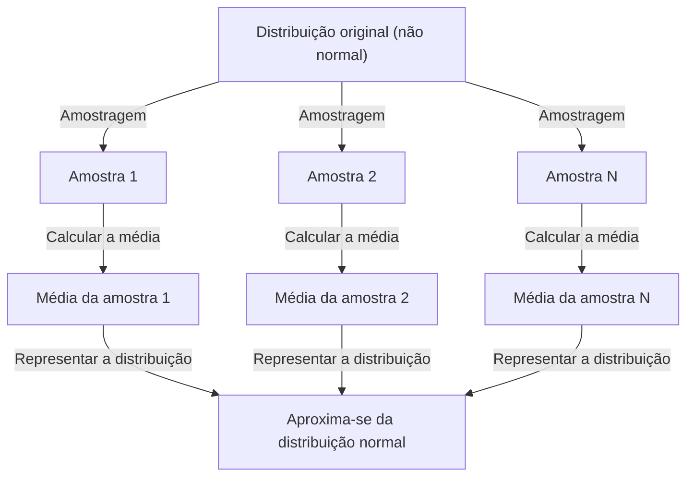

## 1. Introdução

Ao estudar ciência de dados e estatística, um conceito que você não pode evitar é o **Teorema do Limite Central** (CLT). Este teorema possui a propriedade quase mágica de que "independentemente da distribuição dos dados, a distribuição das médias amostrais se aproxima de uma distribuição normal à medida que o tamanho da amostra aumenta".

Neste artigo, fornecemos uma explicação abrangente do Teorema do Limite Central, desde imagens intuitivas até definições matemáticas rigorosas e aplicações práticas.

## 2. Qual é o Teorema do Limite Central?

O Teorema do Limite Central (CLT) é um dos resultados mais poderosos e surpreendentes da teoria das probabilidades e da estatística. Simplificando, a soma (ou média) de um grande número de variáveis ​​aleatórias independentes amostradas aleatoriamente é aproximada por uma distribuição normal, independentemente da distribuição original dessas variáveis.

### 2.1 Compreensão Intuitiva

Considere os dados. Quando você lança um único dado, a distribuição dos resultados é uniforme. No entanto, quando você lança dois dados e calcula sua soma, a distribuição se torna triangular, chegando a 7. À medida que você aumenta o número de dados, a distribuição de sua soma se aproxima de uma curva suave em forma de sino — ou seja, uma **distribuição normal**.

### 2.2 Definição Matemática

Suponha que as amostras $n$ $X_1, X_2, \dots, X_n$ sejam retiradas aleatoriamente de uma população e sejam distribuídas de forma independente e idêntica (i.i.d.). Deixe a média da população (valor esperado) ser $\mu$ e a variância ser $\sigma^2$.

Se definirmos a média amostral como $\bar{X} = \frac{1}{n} \sum_{i=1}^{n} X_i$, então de acordo com o Teorema do Limite Central, quando $n$ for suficientemente grande, a seguinte variável padronizada $Z$ converge para a distribuição normal padrão $\mathcal{N}(0, 1)$:


$$
Z = \frac{\bar{X} - \mu}{\frac{\sigma}{\sqrt{n}}} \xrightarrow{d} \mathcal{N}(0, 1) \text{ as } n \to \infty
$$


Aqui, $\xrightarrow{d}$ denota convergência na distribuição. $\text{ as } n \to \infty$ indica que o tamanho da amostra se aproxima do infinito.

## 3. Visualizando o Teorema do Limite Central

Para entender visualmente como funciona o Teorema do Limite Central, aqui está um diagrama de processo usando Mermaid.



## 4. Simulação com Python

Vamos verificar isso não apenas com a teoria, mas também executando um programa. Amostraremos dados de uma distribuição uniforme e simularemos como as médias são distribuídas.

```python
import numpy as np
import matplotlib.pyplot as plt

# Population parameters (Uniform distribution [0, 1])
mu = 0.5
sigma = np.sqrt(1/12)

# Simulation settings
sample_sizes = [1, 5, 30, 100]
num_simulations = 10000

# Graph drawing settings
fig, axes = plt.subplots(2, 2, figsize=(12, 8))
axes = axes.flatten()

for i, n in enumerate(sample_sizes):
    # Draw n samples from a uniform distribution, num_simulations times
    samples = np.random.uniform(0, 1, (num_simulations, n))
    
    # Calculate the sample mean for each trial
    sample_means = np.mean(samples, axis=1)
    
    # Plot the histogram
    ax = axes[i]
    ax.hist(sample_means, bins=50, density=True, alpha=0.7, color='skyblue')
    ax.set_title(f"Sample size n={n}")
    
    # Add the theoretical normal distribution curve
    x = np.linspace(mu - 4*sigma/np.sqrt(n), mu + 4*sigma/np.sqrt(n), 100)
    y = (1 / (np.sqrt(2 * np.pi) * (sigma/np.sqrt(n)))) * np.exp(-0.5 * ((x - mu) / (sigma/np.sqrt(n)))**2)
    ax.plot(x, y, 'r-', lw=2)

plt.tight_layout()
plt.show()
```

Ao executar este código, você pode confirmar que para $n=1$ a distribuição é uniforme, mas à medida que $n$ aumenta, o histograma se aproxima da curva de distribuição normal vermelha.

## 5. Importância e Aplicações do Teorema do Limite Central

Por que o Teorema do Limite Central é tão importante? É porque mesmo sem conhecer a distribuição exata dos dados do mundo real, podemos assumir uma distribuição normal para estatísticas como médias amostrais, permitindo testes de hipóteses e construção de intervalos de confiança.

### 5.1 Fundamentos da Inferência Estatística
Quando fazemos inferências a partir de dados – em pesquisas de opinião, controle de qualidade, testes A/B e muito mais – grande parte da lógica se baseia no Teorema do Limite Central.

### 5.2 Acumulação de Erros
Erros de medição e muitos tipos de ruído na natureza também podem ser modelados como a soma de numerosos pequenos fatores independentes, razão pela qual muitas vezes seguem uma distribuição normal. Esta é também a razão pela qual é chamada de distribuição gaussiana.

## 6. Indo mais fundo: abordagens para a prova

A prova rigorosa do Teorema do Limite Central utiliza funções características (funções geradoras de momento) e expansões de Taylor. Aqui apresentamos um esboço.

Usando a função característica $\phi_X(t) = E[e^{itX}]$, a função característica da soma de variáveis ​​aleatórias independentes torna-se o produto de suas funções características individuais. Calculando a função característica da variável padronizada $Z$ e tomando o limite como $n \to \infty$, pode-se mostrar que ela converge para a função característica da distribuição normal padrão $e^{-t^2/2}$. Isso prova que a própria distribuição converge para a distribuição normal.

## 7. Conclusão

O Teorema do Limite Central é um teorema extraordinariamente belo que revela a ordem oculta por trás dos dados caóticos. Ao compreender este teorema, você será capaz de obter insights mais profundos na análise de dados e na construção de modelos estatísticos.


## Apêndice: Antecedentes Matemáticos Detalhados e História

### Apêndice 1: Desenvolvimentos na Teoria das Probabilidades
A história do Teorema do Limite Central é profunda, originando-se da demonstração de Abraham de Moivre da aproximação normal da distribuição binomial. Posteriormente, foi ampliado por Pierre-Simon Laplace, e uma prova sob condições mais gerais foi dada por Aleksandr Lyapunov. Na moderna teoria das probabilidades, existem várias extensões, como a condição de Lindeberg e a condição de Lyapunov. Estas condições garantem que nenhuma variável aleatória individual tenha uma influência dominante na soma global. Isto fornece uma resposta à questão fundamental de por que diversos fenômenos na natureza e nas ciências sociais podem ser aproximados pela distribuição normal.

### Apêndice 2: Desenvolvimentos na Teoria das Probabilidades
A história do Teorema do Limite Central é profunda, originando-se da demonstração de Abraham de Moivre da aproximação normal da distribuição binomial. Posteriormente, foi ampliado por Pierre-Simon Laplace, e uma prova sob condições mais gerais foi dada por Aleksandr Lyapunov. Na moderna teoria das probabilidades, existem várias extensões, como a condição de Lindeberg e a condição de Lyapunov. Estas condições garantem que nenhuma variável aleatória individual tenha uma influência dominante na soma global. Isto fornece uma resposta à questão fundamental de por que diversos fenômenos na natureza e nas ciências sociais podem ser aproximados pela distribuição normal.

### Apêndice 3: Desenvolvimentos na Teoria das Probabilidades
A história do Teorema do Limite Central é profunda, originando-se da demonstração de Abraham de Moivre da aproximação normal da distribuição binomial. Posteriormente, foi ampliado por Pierre-Simon Laplace, e uma prova sob condições mais gerais foi dada por Aleksandr Lyapunov. Na moderna teoria das probabilidades, existem várias extensões, como a condição de Lindeberg e a condição de Lyapunov. Estas condições garantem que nenhuma variável aleatória individual tenha uma influência dominante na soma global. Isto fornece uma resposta à questão fundamental de por que diversos fenômenos na natureza e nas ciências sociais podem ser aproximados pela distribuição normal.

### Apêndice 4: Desenvolvimentos na Teoria das Probabilidades
A história do Teorema do Limite Central é profunda, originando-se da demonstração de Abraham de Moivre da aproximação normal da distribuição binomial. Posteriormente, foi ampliado por Pierre-Simon Laplace, e uma prova sob condições mais gerais foi dada por Aleksandr Lyapunov. Na moderna teoria das probabilidades, existem várias extensões, como a condição de Lindeberg e a condição de Lyapunov. Estas condições garantem que nenhuma variável aleatória individual tenha uma influência dominante na soma global. Isto fornece uma resposta à questão fundamental de por que diversos fenômenos na natureza e nas ciências sociais podem ser aproximados pela distribuição normal.

### Apêndice 5: Desenvolvimentos na Teoria das Probabilidades
A história do Teorema do Limite Central é profunda, originando-se da demonstração de Abraham de Moivre da aproximação normal da distribuição binomial. Posteriormente, foi ampliado por Pierre-Simon Laplace, e uma prova sob condições mais gerais foi dada por Aleksandr Lyapunov. Na moderna teoria das probabilidades, existem várias extensões, como a condição de Lindeberg e a condição de Lyapunov. Estas condições garantem que nenhuma variável aleatória individual tenha uma influência dominante na soma global. Isto fornece uma resposta à questão fundamental de por que diversos fenômenos na natureza e nas ciências sociais podem ser aproximados pela distribuição normal.

### Apêndice 6: Desenvolvimentos na Teoria das Probabilidades
A história do Teorema do Limite Central é profunda, originando-se da demonstração de Abraham de Moivre da aproximação normal da distribuição binomial. Posteriormente, foi ampliado por Pierre-Simon Laplace, e uma prova sob condições mais gerais foi dada por Aleksandr Lyapunov. Na moderna teoria das probabilidades, existem várias extensões, como a condição de Lindeberg e a condição de Lyapunov. Estas condições garantem que nenhuma variável aleatória individual tenha uma influência dominante na soma global. Isto fornece uma resposta à questão fundamental de por que diversos fenômenos na natureza e nas ciências sociais podem ser aproximados pela distribuição normal.

### Apêndice 7: Desenvolvimentos na Teoria das Probabilidades
A história do Teorema do Limite Central é profunda, originando-se da demonstração de Abraham de Moivre da aproximação normal da distribuição binomial. Posteriormente, foi ampliado por Pierre-Simon Laplace, e uma prova sob condições mais gerais foi dada por Aleksandr Lyapunov. Na moderna teoria das probabilidades, existem várias extensões, como a condição de Lindeberg e a condição de Lyapunov. Estas condições garantem que nenhuma variável aleatória individual tenha uma influência dominante na soma global. Isto fornece uma resposta à questão fundamental de por que diversos fenômenos na natureza e nas ciências sociais podem ser aproximados pela distribuição normal.

### Apêndice 8: Desenvolvimentos na Teoria das Probabilidades
A história do Teorema do Limite Central é profunda, originando-se da demonstração de Abraham de Moivre da aproximação normal da distribuição binomial. Posteriormente, foi ampliado por Pierre-Simon Laplace, e uma prova sob condições mais gerais foi dada por Aleksandr Lyapunov. Na moderna teoria das probabilidades, existem várias extensões, como a condição de Lindeberg e a condição de Lyapunov. Estas condições garantem que nenhuma variável aleatória individual tenha uma influência dominante na soma global. Isto fornece uma resposta à questão fundamental de por que diversos fenômenos na natureza e nas ciências sociais podem ser aproximados pela distribuição normal.

### Apêndice 9: Desenvolvimentos na Teoria das Probabilidades
A história do Teorema do Limite Central é profunda, originando-se da demonstração de Abraham de Moivre da aproximação normal da distribuição binomial. Posteriormente, foi ampliado por Pierre-Simon Laplace, e uma prova sob condições mais gerais foi dada por Aleksandr Lyapunov. Na moderna teoria das probabilidades, existem várias extensões, como a condição de Lindeberg e a condição de Lyapunov. Estas condições garantem que nenhuma variável aleatória individual tenha uma influência dominante na soma global. Isto fornece uma resposta à questão fundamental de por que diversos fenômenos na natureza e nas ciências sociais podem ser aproximados pela distribuição normal.

### Apêndice 10: Desenvolvimentos na Teoria das Probabilidades
A história do Teorema do Limite Central é profunda, originando-se da demonstração de Abraham de Moivre da aproximação normal da distribuição binomial. Posteriormente, foi ampliado por Pierre-Simon Laplace, e uma prova sob condições mais gerais foi dada por Aleksandr Lyapunov. Na moderna teoria das probabilidades, existem várias extensões, como a condição de Lindeberg e a condição de Lyapunov. Estas condições garantem que nenhuma variável aleatória individual tenha uma influência dominante na soma global. Isto fornece uma resposta à questão fundamental de por que diversos fenômenos na natureza e nas ciências sociais podem ser aproximados pela distribuição normal.

### Apêndice 11: Desenvolvimentos na Teoria das Probabilidades
A história do Teorema do Limite Central é profunda, originando-se da demonstração de Abraham de Moivre da aproximação normal da distribuição binomial. Posteriormente, foi ampliado por Pierre-Simon Laplace, e uma prova sob condições mais gerais foi dada por Aleksandr Lyapunov. Na moderna teoria das probabilidades, existem várias extensões, como a condição de Lindeberg e a condição de Lyapunov. Estas condições garantem que nenhuma variável aleatória individual tenha uma influência dominante na soma global. Isto fornece uma resposta à questão fundamental de por que diversos fenômenos na natureza e nas ciências sociais podem ser aproximados pela distribuição normal.

### Apêndice 12: Desenvolvimentos na Teoria das Probabilidades
A história do Teorema do Limite Central é profunda, originando-se da demonstração de Abraham de Moivre da aproximação normal da distribuição binomial. Posteriormente, foi ampliado por Pierre-Simon Laplace, e uma prova sob condições mais gerais foi dada por Aleksandr Lyapunov. Na moderna teoria das probabilidades, existem várias extensões, como a condição de Lindeberg e a condição de Lyapunov. Estas condições garantem que nenhuma variável aleatória individual tenha uma influência dominante na soma global. Isto fornece uma resposta à questão fundamental de por que diversos fenômenos na natureza e nas ciências sociais podem ser aproximados pela distribuição normal.

### Apêndice 13: Desenvolvimentos na Teoria das Probabilidades
A história do Teorema do Limite Central é profunda, originando-se da demonstração de Abraham de Moivre da aproximação normal da distribuição binomial. Posteriormente, foi ampliado por Pierre-Simon Laplace, e uma prova sob condições mais gerais foi dada por Aleksandr Lyapunov. Na moderna teoria das probabilidades, existem várias extensões, como a condição de Lindeberg e a condição de Lyapunov. Estas condições garantem que nenhuma variável aleatória individual tenha uma influência dominante na soma global. Isto fornece uma resposta à questão fundamental de por que diversos fenômenos na natureza e nas ciências sociais podem ser aproximados pela distribuição normal.

### Apêndice 14: Desenvolvimentos na Teoria das Probabilidades
A história do Teorema do Limite Central é profunda, originando-se da demonstração de Abraham de Moivre da aproximação normal da distribuição binomial. Posteriormente, foi ampliado por Pierre-Simon Laplace, e uma prova sob condições mais gerais foi dada por Aleksandr Lyapunov. Na moderna teoria das probabilidades, existem várias extensões, como a condição de Lindeberg e a condição de Lyapunov. Estas condições garantem que nenhuma variável aleatória individual tenha uma influência dominante na soma global. Isto fornece uma resposta à questão fundamental de por que diversos fenômenos na natureza e nas ciências sociais podem ser aproximados pela distribuição normal.

### Apêndice 15: Desenvolvimentos na Teoria das Probabilidades
A história do Teorema do Limite Central é profunda, originando-se da demonstração de Abraham de Moivre da aproximação normal da distribuição binomial. Posteriormente, foi ampliado por Pierre-Simon Laplace, e uma prova sob condições mais gerais foi dada por Aleksandr Lyapunov. Na moderna teoria das probabilidades, existem várias extensões, como a condição de Lindeberg e a condição de Lyapunov. Estas condições garantem que nenhuma variável aleatória individual tenha uma influência dominante na soma global. Isto fornece uma resposta à questão fundamental de por que diversos fenômenos na natureza e nas ciências sociais podem ser aproximados pela distribuição normal.

### Apêndice 16: Desenvolvimentos na Teoria das Probabilidades
A história do Teorema do Limite Central é profunda, originando-se da demonstração de Abraham de Moivre da aproximação normal da distribuição binomial. Posteriormente, foi ampliado por Pierre-Simon Laplace, e uma prova sob condições mais gerais foi dada por Aleksandr Lyapunov. Na moderna teoria das probabilidades, existem várias extensões, como a condição de Lindeberg e a condição de Lyapunov. Estas condições garantem que nenhuma variável aleatória individual tenha uma influência dominante na soma global. Isto fornece uma resposta à questão fundamental de por que diversos fenômenos na natureza e nas ciências sociais podem ser aproximados pela distribuição normal.

### Apêndice 17: Desenvolvimentos na Teoria das Probabilidades
A história do Teorema do Limite Central é profunda, originando-se da demonstração de Abraham de Moivre da aproximação normal da distribuição binomial. Posteriormente, foi ampliado por Pierre-Simon Laplace, e uma prova sob condições mais gerais foi dada por Aleksandr Lyapunov. Na moderna teoria das probabilidades, existem várias extensões, como a condição de Lindeberg e a condição de Lyapunov. Estas condições garantem que nenhuma variável aleatória individual tenha uma influência dominante na soma global. Isto fornece uma resposta à questão fundamental de por que diversos fenômenos na natureza e nas ciências sociais podem ser aproximados pela distribuição normal.

### Apêndice 18: Desenvolvimentos na Teoria das Probabilidades
A história do Teorema do Limite Central é profunda, originando-se da demonstração de Abraham de Moivre da aproximação normal da distribuição binomial. Posteriormente, foi ampliado por Pierre-Simon Laplace, e uma prova sob condições mais gerais foi dada por Aleksandr Lyapunov. Na moderna teoria das probabilidades, existem várias extensões, como a condição de Lindeberg e a condição de Lyapunov. Estas condições garantem que nenhuma variável aleatória individual tenha uma influência dominante na soma global. Isto fornece uma resposta à questão fundamental de por que diversos fenômenos na natureza e nas ciências sociais podem ser aproximados pela distribuição normal.

### Apêndice 19: Desenvolvimentos na Teoria da Probabilidade
A história do Teorema do Limite Central é profunda, originando-se da demonstração de Abraham de Moivre da aproximação normal da distribuição binomial. Posteriormente, foi ampliado por Pierre-Simon Laplace, e uma prova sob condições mais gerais foi dada por Aleksandr Lyapunov. Na moderna teoria das probabilidades, existem várias extensões, como a condição de Lindeberg e a condição de Lyapunov. Estas condições garantem que nenhuma variável aleatória individual tenha uma influência dominante na soma global. Isto fornece uma resposta à questão fundamental de por que diversos fenômenos na natureza e nas ciências sociais podem ser aproximados pela distribuição normal.

### Apêndice 20: Desenvolvimentos na Teoria das Probabilidades
A história do Teorema do Limite Central é profunda, originando-se da demonstração de Abraham de Moivre da aproximação normal da distribuição binomial. Posteriormente, foi ampliado por Pierre-Simon Laplace, e uma prova sob condições mais gerais foi dada por Aleksandr Lyapunov. Na moderna teoria das probabilidades, existem várias extensões, como a condição de Lindeberg e a condição de Lyapunov. Estas condições garantem que nenhuma variável aleatória individual tenha uma influência dominante na soma global. Isto fornece uma resposta à questão fundamental de por que diversos fenômenos na natureza e nas ciências sociais podem ser aproximados pela distribuição normal.

### Apêndice 21: Desenvolvimentos na Teoria das Probabilidades
A história do Teorema do Limite Central é profunda, originando-se da demonstração de Abraham de Moivre da aproximação normal da distribuição binomial. Posteriormente, foi ampliado por Pierre-Simon Laplace, e uma prova sob condições mais gerais foi dada por Aleksandr Lyapunov. Na moderna teoria das probabilidades, existem várias extensões, como a condição de Lindeberg e a condição de Lyapunov. Estas condições garantem que nenhuma variável aleatória individual tenha uma influência dominante na soma global. Isto fornece uma resposta à questão fundamental de por que diversos fenômenos na natureza e nas ciências sociais podem ser aproximados pela distribuição normal.

### Apêndice 22: Desenvolvimentos na Teoria das Probabilidades
A história do Teorema do Limite Central é profunda, originando-se da demonstração de Abraham de Moivre da aproximação normal da distribuição binomial. Posteriormente, foi ampliado por Pierre-Simon Laplace, e uma prova sob condições mais gerais foi dada por Aleksandr Lyapunov. Na moderna teoria das probabilidades, existem várias extensões, como a condição de Lindeberg e a condição de Lyapunov. Estas condições garantem que nenhuma variável aleatória individual tenha uma influência dominante na soma global. Isto fornece uma resposta à questão fundamental de por que diversos fenômenos na natureza e nas ciências sociais podem ser aproximados pela distribuição normal.

### Apêndice 23: Desenvolvimentos na Teoria das Probabilidades
A história do Teorema do Limite Central é profunda, originando-se da demonstração de Abraham de Moivre da aproximação normal da distribuição binomial. Posteriormente, foi ampliado por Pierre-Simon Laplace, e uma prova sob condições mais gerais foi dada por Aleksandr Lyapunov. Na moderna teoria das probabilidades, existem várias extensões, como a condição de Lindeberg e a condição de Lyapunov. Estas condições garantem que nenhuma variável aleatória individual tenha uma influência dominante na soma global. Isto fornece uma resposta à questão fundamental de por que diversos fenômenos na natureza e nas ciências sociais podem ser aproximados pela distribuição normal.

### Apêndice 24: Desenvolvimentos na Teoria das Probabilidades
A história do Teorema do Limite Central é profunda, originando-se da demonstração de Abraham de Moivre da aproximação normal da distribuição binomial. Posteriormente, foi ampliado por Pierre-Simon Laplace, e uma prova sob condições mais gerais foi dada por Aleksandr Lyapunov. Na moderna teoria das probabilidades, existem várias extensões, como a condição de Lindeberg e a condição de Lyapunov. Estas condições garantem que nenhuma variável aleatória individual tenha uma influência dominante na soma global. Isto fornece uma resposta à questão fundamental de por que diversos fenômenos na natureza e nas ciências sociais podem ser aproximados pela distribuição normal.

### Apêndice 25: Desenvolvimentos na Teoria das Probabilidades
A história do Teorema do Limite Central é profunda, originando-se da demonstração de Abraham de Moivre da aproximação normal da distribuição binomial. Posteriormente, foi ampliado por Pierre-Simon Laplace, e uma prova sob condições mais gerais foi dada por Aleksandr Lyapunov. Na moderna teoria das probabilidades, existem várias extensões, como a condição de Lindeberg e a condição de Lyapunov. Estas condições garantem que nenhuma variável aleatória individual tenha uma influência dominante na soma global. Isto fornece uma resposta à questão fundamental de por que diversos fenômenos na natureza e nas ciências sociais podem ser aproximados pela distribuição normal.

### Apêndice 26: Desenvolvimentos na Teoria das Probabilidades
A história do Teorema do Limite Central é profunda, originando-se da demonstração de Abraham de Moivre da aproximação normal da distribuição binomial. Posteriormente, foi ampliado por Pierre-Simon Laplace, e uma prova sob condições mais gerais foi dada por Aleksandr Lyapunov. Na moderna teoria das probabilidades, existem várias extensões, como a condição de Lindeberg e a condição de Lyapunov. Estas condições garantem que nenhuma variável aleatória individual tenha uma influência dominante na soma global. Isto fornece uma resposta à questão fundamental de por que diversos fenômenos na natureza e nas ciências sociais podem ser aproximados pela distribuição normal.

### Apêndice 27: Desenvolvimentos na Teoria das Probabilidades
A história do Teorema do Limite Central é profunda, originando-se da demonstração de Abraham de Moivre da aproximação normal da distribuição binomial. Posteriormente, foi ampliado por Pierre-Simon Laplace, e uma prova sob condições mais gerais foi dada por Aleksandr Lyapunov. Na moderna teoria das probabilidades, existem várias extensões, como a condição de Lindeberg e a condição de Lyapunov. Estas condições garantem que nenhuma variável aleatória individual tenha uma influência dominante na soma global. Isto fornece uma resposta à questão fundamental de por que diversos fenômenos na natureza e nas ciências sociais podem ser aproximados pela distribuição normal.

### Apêndice 28: Desenvolvimentos na Teoria das Probabilidades
A história do Teorema do Limite Central é profunda, originando-se da demonstração de Abraham de Moivre da aproximação normal da distribuição binomial. Posteriormente, foi ampliado por Pierre-Simon Laplace, e uma prova sob condições mais gerais foi dada por Aleksandr Lyapunov. Na moderna teoria das probabilidades, existem várias extensões, como a condição de Lindeberg e a condição de Lyapunov. Estas condições garantem que nenhuma variável aleatória individual tenha uma influência dominante na soma global. Isto fornece uma resposta à questão fundamental de por que diversos fenômenos na natureza e nas ciências sociais podem ser aproximados pela distribuição normal.

### Apêndice 29: Desenvolvimentos na Teoria das Probabilidades
A história do Teorema do Limite Central é profunda, originando-se da demonstração de Abraham de Moivre da aproximação normal da distribuição binomial. Posteriormente, foi ampliado por Pierre-Simon Laplace, e uma prova sob condições mais gerais foi dada por Aleksandr Lyapunov. Na moderna teoria das probabilidades, existem várias extensões, como a condição de Lindeberg e a condição de Lyapunov. Estas condições garantem que nenhuma variável aleatória individual tenha uma influência dominante na soma global. Isto fornece uma resposta à questão fundamental de por que diversos fenômenos na natureza e nas ciências sociais podem ser aproximados pela distribuição normal.

### Apêndice 30: Desenvolvimentos na Teoria das Probabilidades
A história do Teorema do Limite Central é profunda, originando-se da demonstração de Abraham de Moivre da aproximação normal da distribuição binomial. Posteriormente, foi ampliado por Pierre-Simon Laplace, e uma prova sob condições mais gerais foi dada por Aleksandr Lyapunov. Na moderna teoria das probabilidades, existem várias extensões, como a condição de Lindeberg e a condição de Lyapunov. Estas condições garantem que nenhuma variável aleatória individual tenha uma influência dominante na soma global. Isto fornece uma resposta à questão fundamental de por que diversos fenômenos na natureza e nas ciências sociais podem ser aproximados pela distribuição normal.
