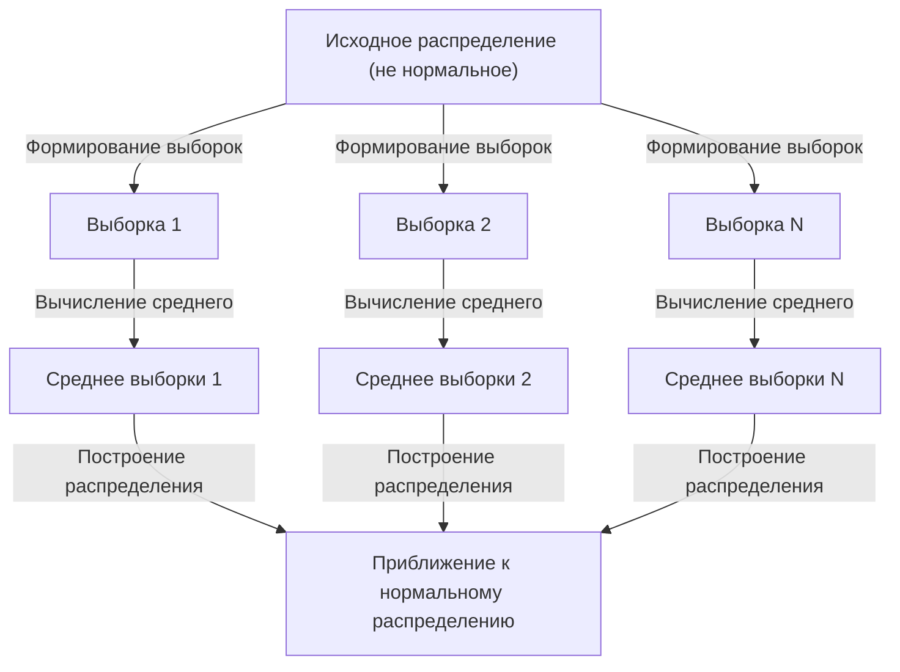

## 1. Введение

Изучая науку о данных и статистику, нельзя избежать одной концепции — **Центральной предельной теоремы** (ЦПТ). Эта теорема обладает почти волшебным свойством: «независимо от распределения данных распределение выборочных средних приближается к нормальному распределению по мере увеличения размера выборки».

В этой статье мы даем всестороннее объяснение Центральной предельной теоремы, от интуитивно понятных изображений до строгих математических определений и практических приложений.

## 2. Что такое центральная предельная теорема?

Центральная предельная теорема (ЦПТ) — один из самых мощных и удивительных результатов в теории вероятностей и статистике. Проще говоря, сумма (или среднее значение) большого количества случайно выбранных независимых случайных величин аппроксимируется нормальным распределением, независимо от исходного распределения этих переменных.

### 2.1 Интуитивное понимание

Рассмотрим игральные кости. Когда вы бросаете один кубик, результаты распределяются равномерно. Однако когда вы бросаете два кубика и берете их сумму, распределение становится треугольным с максимумом в 7. По мере увеличения количества кубиков распределение их суммы приближается к плавной колоколообразной кривой — то есть к **нормальному распределению**.

### 2.2 Математическое определение

Предположим, что выборки $n$ $X_1, X_2, \dots, X_n$ выбраны случайным образом из популяции и независимо и одинаково распределены (i.i.d.). Пусть среднее значение совокупности (ожидаемое значение) будет $\mu$, а дисперсия — $\sigma^2$.

Если мы определим выборочное среднее как $\bar{X} = \frac{1}{n} \sum_{i=1}^{n} X_i$, то согласно Центральной предельной теореме, когда $n$ достаточно велико, следующая стандартизованная переменная $Z$ сходится к стандартному нормальному распределению $\mathcal{N}(0, 1)$:


$$
Z = \frac{\bar{X} - \mu}{\frac{\sigma}{\sqrt{n}}} \xrightarrow{d} \mathcal{N}(0, 1) \text{ as } n \to \infty
$$


Здесь $\xrightarrow{d}$ обозначает сходимость распределения. $\text{ as } n \to \infty$ указывает, что размер выборки приближается к бесконечности.

## 3. Визуализация центральной предельной теоремы

Чтобы наглядно понять, как работает Центральная предельная теорема, вот диаграмма процесса с использованием Mermaid.



## 4. Моделирование с помощью Python

Давайте проверим это не только теоретически, но и запустив программу. Мы возьмем данные из равномерного распределения и смоделируем распределение средних значений.

```python
import numpy as np
import matplotlib.pyplot as plt

# Population parameters (Uniform distribution [0, 1])
mu = 0.5
sigma = np.sqrt(1/12)

# Simulation settings
sample_sizes = [1, 5, 30, 100]
num_simulations = 10000

# Graph drawing settings
fig, axes = plt.subplots(2, 2, figsize=(12, 8))
axes = axes.flatten()

for i, n in enumerate(sample_sizes):
    # Draw n samples from a uniform distribution, num_simulations times
    samples = np.random.uniform(0, 1, (num_simulations, n))
    
    # Calculate the sample mean for each trial
    sample_means = np.mean(samples, axis=1)
    
    # Plot the histogram
    ax = axes[i]
    ax.hist(sample_means, bins=50, density=True, alpha=0.7, color='skyblue')
    ax.set_title(f"Sample size n={n}")
    
    # Add the theoretical normal distribution curve
    x = np.linspace(mu - 4*sigma/np.sqrt(n), mu + 4*sigma/np.sqrt(n), 100)
    y = (1 / (np.sqrt(2 * np.pi) * (sigma/np.sqrt(n)))) * np.exp(-0.5 * ((x - mu) / (sigma/np.sqrt(n)))**2)
    ax.plot(x, y, 'r-', lw=2)

plt.tight_layout()
plt.show()
```

Запустив этот код, вы можете убедиться, что для $n=1$ распределение равномерное, но по мере увеличения $n$ гистограмма приближается к красной кривой нормального распределения.

## 5. Важность и применение центральной предельной теоремы.

Почему Центральная предельная теорема так важна? Это потому, что даже не зная точного распределения реальных данных, мы можем предположить нормальное распределение для статистики, такой как выборочные средние, что позволяет проверять гипотезы и строить доверительные интервалы.

### 5.1 Основание статистического вывода
Когда мы делаем выводы на основе данных — в опросах общественного мнения, контроле качества, A/B-тестировании и т. д. — большая часть обоснований опирается на Центральную предельную теорему.

### 5.2 Накопление ошибок
Ошибки измерений и многие виды шума в природе также можно смоделировать как сумму множества небольших независимых факторов, поэтому они часто подчиняются нормальному распределению. По этой же причине его называют распределением Гаусса.

## 6. Идем глубже: подходы к доказательству

Строгое доказательство центральной предельной теоремы использует характеристические функции и разложения Тейлора. Здесь мы представляем конспект.

Используя характеристическую функцию $\phi_X(t) = E[e^{itX}]$, характеристическая функция суммы независимых случайных величин становится произведением их отдельных характеристических функций. Вычислив характеристическую функцию стандартизованной переменной $Z$ и приняв предел как $n \to \infty$, можно показать, что она сходится к характеристической функции стандартного нормального распределения $e^{-t^2/2}$. Это доказывает, что само распределение сходится к нормальному распределению.

## 7. Заключение

Центральная предельная теорема — необычайно красивая теорема, раскрывающая порядок, скрытый за хаотическими данными. Поняв эту теорему, вы сможете получить более глубокое понимание анализа данных и построения статистических моделей.


## Приложение: Подробная математическая основа и история

### Приложение 1: Развитие теории вероятностей
История центральной предельной теоремы уходит корнями в глубокую демонстрацию Абрахамом де Муавром нормальной аппроксимации биномиального распределения. Позднее оно было расширено Пьером-Симоном Лапласом, а доказательство в более общих условиях было дано Александром Ляпуновым. В современной теории вероятностей существуют различные расширения, такие как условие Линдеберга и условие Ляпунова. Эти условия гарантируют, что ни одна отдельная случайная величина не будет иметь доминирующего влияния на общую сумму. Это дает ответ на фундаментальный вопрос: почему разнообразные явления в природе и социальных науках можно аппроксимировать нормальным распределением.

### Приложение 2: Условия и смысл теоремы

Базовая версия требует независимых одинаково распределённых $X_1,\ldots,X_n$ с конечным средним $\mu$ и конечной положительной дисперсией $0<\sigma^2<\infty$. Слова «любое распределение» следует понимать в рамках этих условий. К нормальному приближается распределение стандартизованной суммы или среднего, а не распределение отдельных наблюдений.

### Приложение 3: Стандартная ошибка и закон больших чисел

Из независимости следуют приведённые ниже математическое ожидание и дисперсия выборочного среднего. Стандартная ошибка измеряет разброс среднего, а не стандартное отклонение отдельных наблюдений.

$$
E[\bar X_n]=\mu,\qquad \operatorname{Var}(\bar X_n)=\frac{\sigma^2}{n},\qquad \operatorname{SE}(\bar X_n)=\frac{\sigma}{\sqrt n}.
$$

Увеличение объёма выборки в четыре раза уменьшает стандартную ошибку вдвое. Закон больших чисел описывает приближение среднего к $\mu$; ЦПТ описывает форму его колебаний после умножения на $\sqrt{n}$.

### Приложение 4: Подробности доказательства через характеристические функции

Положим $Y_i=(X_i-\mu)/\sigma$ и $Z_n=n^{-1/2}\sum_{i=1}^nY_i$. Поскольку $E[Y_i]=0$ и $E[Y_i^2]=1$, характеристическая функция имеет следующее разложение вблизи нуля.

$$
\phi_Y(t)=E[e^{itY}]=1-\frac{t^2}{2}+o(t^2)\quad(t\to0).
$$

Независимость даёт следующее выражение. Его предел — характеристическая функция стандартного нормального распределения; по теореме непрерывности Леви получаем сходимость по распределению. Характеристическая и производящая моменты функции различны; существование второй для этого доказательства не требуется.

$$
\phi_{Z_n}(t)=\left[\phi_Y\!\left(\frac{t}{\sqrt n}\right)\right]^n
=\left[1-\frac{t^2}{2n}+o\!\left(\frac1n\right)\right]^n
\longrightarrow e^{-t^2/2}.
$$

### Приложение 5: Контрпримеры и точность приближения

У распределения Коши нет конечных среднего и дисперсии; среднее независимых стандартных величин Коши снова имеет стандартное распределение Коши. Если все $X_i$ равны одной случайной величине, независимости нет и усреднение не уменьшает разброс. Универсальной гарантии достаточности $n\ge30$ нет: важны асимметрия и тяжесть хвостов. Для независимых, но различно распределённых величин необходимо проверять дополнительные условия, например условия Линдеберга или Ляпунова.
