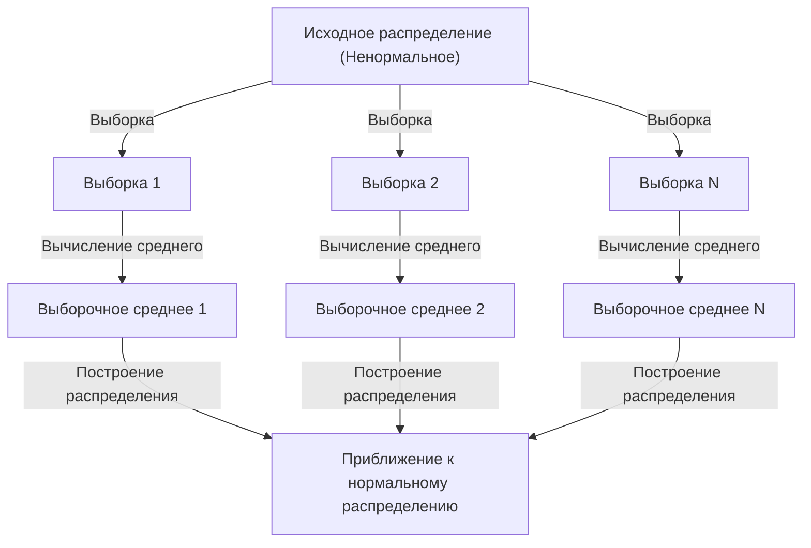

## 1. Введение

При изучении науки о данных и статистики неизбежно столкновение с **Центральной предельной теоремой** (ЦПТ). Эта теорема обладает почти магическим свойством: «Независимо от того, какое распределение имеют данные, распределение их выборочного среднего приближается к нормальному распределению по мере увеличения размера выборки».

В этой статье мы подробно объясним Центральную предельную теорему: от интуитивного представления до строгого математического определения и примеров практического применения.

## 2. Что такое [Центральная предельная теорема](https://kenji.blog/ru/p/central-limit-theorem/)?

[Центральная предельная теорема](https://kenji.blog/ru/p/central-limit-theorem/) (ЦПТ) является одним из самых мощных и удивительных результатов в теории вероятностей и статистике. Проще говоря, сумма (или среднее) большого количества случайным образом извлеченных независимых случайных величин аппроксимируется нормальным распределением, независимо от первоначального распределения переменных.

### 2.1 Интуитивное понимание

Возьмем игральные кости. При броске одной кости распределение результатов является равномерным. Однако, если бросить две кости и сложить их значения, распределение принимает форму треугольника с вершиной на 7. Если мы продолжим увеличивать количество костей, распределение их суммы будет приближаться к плавной колоколообразной кривой, то есть к **нормальному распределению**.

### 2.2 Математическое определение

Предположим, что $n$ выборок $X_1, X_2, \dots, X_n$, случайно извлеченных из генеральной совокупности, являются независимыми и одинаково распределенными (н.о.р.). Пусть среднее (математическое ожидание) этой совокупности равно $\mu$, а дисперсия — $\sigma^2$.

Пусть выборочное среднее равно $\bar{X} = \frac{1}{n} \sum_{i=1}^{n} X_i$. Согласно Центральной предельной теореме, когда $n$ достаточно велико, стандартизированная переменная $Z$, как показано ниже, сходится к стандартному нормальному распределению $\mathcal{N}(0, 1)$.


$$
Z = \frac{\bar{X} - \mu}{\frac{\sigma}{\sqrt{n}}} \xrightarrow{d} \mathcal{N}(0, 1) \text{ при } n \to \infty
$$


Здесь $\xrightarrow{d}$ означает сходимость по распределению. $\text{ при } n \to \infty$ указывает на то, что размер выборки стремится к бесконечности.

## 3. Визуализация Центральной предельной теоремы

Чтобы визуально понять, как работает [Центральная предельная теорема](https://kenji.blog/ru/p/central-limit-theorem/), ниже представлена диаграмма процесса с использованием Mermaid.



## 4. Симуляция с использованием Python

Вместо того чтобы ограничиваться теорией, давайте запустим программу, чтобы проверить это. Мы смоделируем извлечение данных из равномерного распределения и посмотрим, как распределено их среднее значение.

```python
import numpy as np
import matplotlib.pyplot as plt

# Параметры генеральной совокупности (Равномерное распределение [0, 1])
mu = 0.5
sigma = np.sqrt(1/12)

# Настройки симуляции
sample_sizes = [1, 5, 30, 100]
num_simulations = 10000

# Настройки рисования графиков
fig, axes = plt.subplots(2, 2, figsize=(12, 8))
axes = axes.flatten()

for i, n in enumerate(sample_sizes):
    # Извлекаем n выборок из равномерного распределения num_simulations раз
    samples = np.random.uniform(0, 1, (num_simulations, n))
    
    # Вычисляем выборочное среднее для каждого испытания
    sample_means = np.mean(samples, axis=1)
    
    # Строим гистограмму
    ax = axes[i]
    ax.hist(sample_means, bins=50, density=True, alpha=0.7, color='skyblue')
    ax.set_title(f"Размер выборки n={n}")
    
    # Добавляем теоретическую кривую нормального распределения
    x = np.linspace(mu - 4*sigma/np.sqrt(n), mu + 4*sigma/np.sqrt(n), 100)
    y = (1 / (np.sqrt(2 * np.pi) * (sigma/np.sqrt(n)))) * np.exp(-0.5 * ((x - mu) / (sigma/np.sqrt(n)))**2)
    ax.plot(x, y, 'r-', lw=2)

plt.tight_layout()
plt.show()
```

Запустив этот код, вы можете убедиться, что при $n=1$ мы получаем равномерное распределение, но по мере увеличения $n$ гистограмма приближается к нормальному распределению (красная линия).

## 5. Важность и применение Центральной предельной теоремы

Почему [Центральная предельная теорема](https://kenji.blog/ru/p/central-limit-theorem/) так важна? Это связано с тем, что даже если мы точно не знаем, какое распределение имеют многие реальные данные, при использовании статистик, таких как выборочное среднее, мы можем предположить нормальное распределение для проверки гипотез и построения доверительных интервалов.

### 5.1 Основа статистического вывода
Когда мы делаем выводы на основе данных, как, например, в опросах общественного мнения, контроле качества или A/B-тестировании, большая часть аргументации опирается на Центральную предельную теорему.

### 5.2 Накопление ошибок
Ошибки измерений и многие шумы в природе также можно смоделировать как сумму множества небольших независимых факторов, поэтому они часто следуют нормальному распределению. Вот почему его также называют распределением Гаусса.

## 6. Углубление: Подход к доказательству

Для строгого доказательства Центральной предельной теоремы используются характеристические функции и разложение Тейлора. Вот краткий обзор.

Используя характеристическую функцию $\phi_X(t) = E[e^{itX}]$, характеристическая функция суммы независимых случайных величин равна произведению их соответствующих характеристических функций. Если мы вычислим характеристическую функцию стандартизированной переменной $Z$ и найдем предел при $n \to \infty$, можно показать, что она сходится к характеристической функции стандартного нормального распределения $e^{-t^2/2}$. Это доказывает, что само распределение сходится к нормальному.

## 7. Заключение

[Центральная предельная теорема](https://kenji.blog/ru/p/central-limit-theorem/) — чрезвычайно красивая теорема, которая показывает порядок, скрытый за хаотичными данными. Понимание этой теоремы позволит вам получить более глубокие знания в области анализа данных и построения статистических моделей.


## Приложение: Подробный математический фон и история

### Приложение 1: Развитие в теории вероятностей
История Центральной предельной теоремы уходит корнями в прошлое: она берет начало от Абрахама де Муавра, который показал нормальное приближение биномиального распределения. Позже она была расширена Пьером-Симоном Лапласом, а Александр Ляпунов представил доказательство при более общих условиях. В современной теории вероятностей существуют различные расширения, такие как условие Линдеберга и условие Ляпунова. Эти условия гарантируют, что отдельные случайные величины не оказывают доминирующего влияния на общую сумму. Это дает ответ на фундаментальный вопрос о том, почему различные явления в природе и социальных науках можно аппроксимировать нормальным распределением.

### Приложение 2: Условия применения и смысл теоремы

В базовой форме, обсуждаемой в этом тексте, требуется, чтобы $X_1,\ldots,X_n$ были независимыми и одинаково распределенными с конечным средним $\mu$ и конечной положительной дисперсией $0<\sigma^2<\infty$. Пожалуйста, понимайте выражение «любое распределение» в рамках этих условий. К нормальному распределению приближается распределение стандартизированной суммы или выборочного среднего, а распределение отдельных наблюдений не меняется.

### Приложение 3: Стандартная ошибка и закон больших чисел

В силу независимости математическое ожидание и дисперсия выборочного среднего равны следующему. Стандартная ошибка — это дисперсия выборочного среднего, она отличается от стандартного отклонения отдельных данных.

$$
E[\bar X_n]=\mu,\qquad \operatorname{Var}(\bar X_n)=\frac{\sigma^2}{n},\qquad \operatorname{SE}(\bar X_n)=\frac{\sigma}{\sqrt n}.
$$

Увеличение количества выборок в четыре раза уменьшает стандартную ошибку вдвое. [Закон больших чисел](https://kenji.blog/ru/p/law-of-large-numbers/) утверждает, что выборочное среднее приближается к $\mu$, а [Центральная предельная теорема](https://kenji.blog/ru/p/central-limit-theorem/) описывает форму распределения, умножая колебания вокруг него на $\sqrt{n}$.

### Приложение 4: Дополнительное доказательство с использованием характеристических функций

Пусть $Y_i=(X_i-\mu)/\sigma$ и $Z_n=n^{-1/2}\sum_{i=1}^nY_i$. Поскольку $E[Y_i]=0$ и $E[Y_i^2]=1$, характеристическую функцию можно разложить вблизи начала координат следующим образом.

$$
\phi_Y(t)=E[e^{itY}]=1-\frac{t^2}{2}+o(t^2)\quad(t\to0).
$$

Из независимости получается следующее уравнение. Поскольку предел является характеристической функцией стандартного нормального распределения, сходимость по распределению следует из теоремы непрерывности Леви. Характеристические функции и производящие функции моментов — это разные вещи, и для этого доказательства наличие производящей функции моментов не требуется.

$$
\phi_{Z_n}(t)=\left[\phi_Y\!\left(\frac{t}{\sqrt n}\right)\right]^n
=\left[1-\frac{t^2}{2n}+o\!\left(\frac1n\right)\right]^n
\longrightarrow e^{-t^2/2}.
$$

### Приложение 5: Неприменимые примеры и точность аппроксимации

Распределение Коши не имеет ни конечного среднего, ни конечной дисперсии, и выборочное среднее независимых стандартных переменных Коши остается стандартным распределением Коши. Кроме того, если все $X_i$ равны одной и той же переменной, независимость отсутствует, и усреднение не уменьшит разброс. Также нет гарантии, что «$n\ge30$ всегда достаточно». Необходимый размер выборки варьируется в зависимости от асимметрии и тяжелых хвостов. Для расширений на независимые, но неодинаково распределенные величины, необходимо проверить дополнительные условия, такие как условия Линдеберга или Ляпунова.
