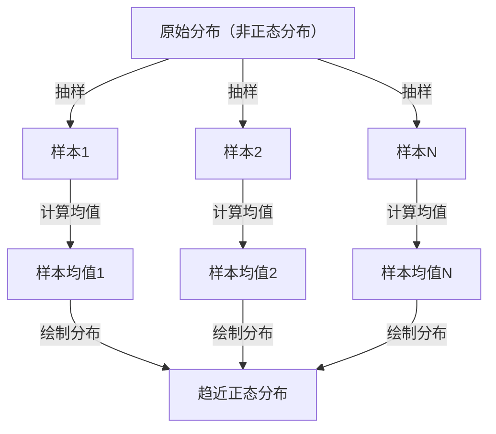

## 1. 引言

在学习数据科学和统计学时，**中心极限定理**（Central Limit Theorem）是一个无法回避的概念。该定理具有一种近乎魔法般的性质："无论数据服从何种分布，其样本均值的分布都会随着样本量的增大而趋近正态分布。"

本文将对中心极限定理进行全面讲解，从直观印象到严格的数学定义，再到实际的应用案例。

## 2. 什么是中心极限定理？

中心极限定理（CLT）是概率论和统计学中最强大、最令人惊叹的结果之一。简单来说，大量随机抽取的独立随机变量的和（或均值），无论原始变量服从何种分布，都会趋近于正态分布。

### 2.1 直观理解

以骰子为例。掷一个骰子时，点数的分布是均匀分布。然而，当掷两个骰子并取其和时，分布变成以7为峰值的三角形。随着骰子数量的增加，其和的分布逐渐接近光滑的钟形曲线，即 **正态分布**。

### 2.2 数学定义

假设从某总体中随机抽取 $n$ 个样本 $X_1, X_2, \dots, X_n$，它们相互独立且服从同一分布（i.i.d.）。设该总体的均值（期望）为 $\mu$，方差为 $\sigma^2$。

将样本均值定义为 $\bar{X} = \frac{1}{n} \sum_{i=1}^{n} X_i$，则根据中心极限定理，当 $n$ 足够大时，以下标准化变量 $Z$ 收敛于标准正态分布 $\mathcal{N}(0, 1)$：


$$
Z = \frac{\bar{X} - \mu}{\frac{\sigma}{\sqrt{n}}} \xrightarrow{d} \mathcal{N}(0, 1) \text{ as } n \to \infty
$$


其中，$\xrightarrow{d}$ 表示依分布收敛。$\text{ as } n \to \infty$ 表示样本量趋近于无穷大。

## 3. 中心极限定理的可视化

为了直观地理解中心极限定理的工作原理，下面使用 Mermaid 绘制流程图。



## 4. 使用 Python 进行模拟

让我们不仅停留在理论上，还通过实际运行程序来验证。我们将从均匀分布中抽取数据，模拟其均值的分布情况。

```python
import numpy as np
import matplotlib.pyplot as plt

# 总体参数（均匀分布 [0, 1]）
mu = 0.5
sigma = np.sqrt(1/12)

# 模拟设置
sample_sizes = [1, 5, 30, 100]
num_simulations = 10000

# 图表绘制设置
fig, axes = plt.subplots(2, 2, figsize=(12, 8))
axes = axes.flatten()

for i, n in enumerate(sample_sizes):
    # 从均匀分布中抽取 n 个样本，重复 num_simulations 次
    samples = np.random.uniform(0, 1, (num_simulations, n))
    
    # 计算每次试验的样本均值
    sample_means = np.mean(samples, axis=1)
    
    # 绘制直方图
    ax = axes[i]
    ax.hist(sample_means, bins=50, density=True, alpha=0.7, color='skyblue')
    ax.set_title(f"样本量 n={n}")
    
    # 添加理论正态分布曲线
    x = np.linspace(mu - 4*sigma/np.sqrt(n), mu + 4*sigma/np.sqrt(n), 100)
    y = (1 / (np.sqrt(2 * np.pi) * (sigma/np.sqrt(n)))) * np.exp(-0.5 * ((x - mu) / (sigma/np.sqrt(n)))**2)
    ax.plot(x, y, 'r-', lw=2)

plt.tight_layout()
plt.show()
```

运行此代码后可以确认，当 $n=1$ 时为均匀分布，但随着 $n$ 的增大，直方图逐渐趋近红线所示的正态分布。

## 5. 中心极限定理的重要性与应用

为什么中心极限定理如此重要？因为即使不知道现实世界中的数据究竟服从何种分布，我们也可以利用样本均值等统计量来假设正态分布，从而进行假设检验和构建置信区间。

### 5.1 统计推断的基础
当我们从数据中进行推断时——无论是民意调查、质量控制还是 A/B 测试——其中大部分依据都依赖于中心极限定理。

### 5.2 误差的累积
测量误差和自然界中的许多噪声也可以建模为大量微小独立因素之和，因此它们通常服从正态分布。这也是正态分布被称为高斯分布的原因。

## 6. 深入探究：证明的方法

中心极限定理的严格证明使用了特征函数（矩母函数）和泰勒展开。下面介绍其概要。

利用特征函数 $\phi_X(t) = E[e^{itX}]$，独立随机变量之和的特征函数等于各自特征函数的乘积。通过计算标准化变量 $Z$ 的特征函数并取 $n \to \infty$ 的极限，可以证明其收敛于标准正态分布的特征函数 $e^{-t^2/2}$。由此证明分布本身收敛于正态分布。

## 7. 结语

中心极限定理是一个极其优美的定理，它揭示了混沌数据背后隐藏的秩序。理解这一定理，将使你在数据分析和统计模型构建中获得更深刻的洞察。


## 附录：详细的数学背景与历史

### 附录 1：概率论的发展
中心极限定理有着悠久的历史，起源于亚伯拉罕·棣莫弗对二项分布正态近似的证明。后来被皮埃尔-西蒙·拉普拉斯加以扩展，亚历山大·李雅普诺夫在更一般的条件下给出了证明。在现代概率论中，存在多种扩展，如林德伯格条件和李雅普诺夫条件。这些条件保证了单个随机变量不会对总和产生支配性影响。这为"自然界和社会科学中的各种现象为何能用正态分布来近似"这一根本性问题提供了解答。

### 附录 2：概率论的发展
中心极限定理有着悠久的历史，起源于亚伯拉罕·棣莫弗对二项分布正态近似的证明。后来被皮埃尔-西蒙·拉普拉斯加以扩展，亚历山大·李雅普诺夫在更一般的条件下给出了证明。在现代概率论中，存在多种扩展，如林德伯格条件和李雅普诺夫条件。这些条件保证了单个随机变量不会对总和产生支配性影响。这为"自然界和社会科学中的各种现象为何能用正态分布来近似"这一根本性问题提供了解答。

### 附录 3：概率论的发展
中心极限定理有着悠久的历史，起源于亚伯拉罕·棣莫弗对二项分布正态近似的证明。后来被皮埃尔-西蒙·拉普拉斯加以扩展，亚历山大·李雅普诺夫在更一般的条件下给出了证明。在现代概率论中，存在多种扩展，如林德伯格条件和李雅普诺夫条件。这些条件保证了单个随机变量不会对总和产生支配性影响。这为"自然界和社会科学中的各种现象为何能用正态分布来近似"这一根本性问题提供了解答。

### 附录 4：概率论的发展
中心极限定理有着悠久的历史，起源于亚伯拉罕·棣莫弗对二项分布正态近似的证明。后来被皮埃尔-西蒙·拉普拉斯加以扩展，亚历山大·李雅普诺夫在更一般的条件下给出了证明。在现代概率论中，存在多种扩展，如林德伯格条件和李雅普诺夫条件。这些条件保证了单个随机变量不会对总和产生支配性影响。这为"自然界和社会科学中的各种现象为何能用正态分布来近似"这一根本性问题提供了解答。

### 附录 5：概率论的发展
中心极限定理有着悠久的历史，起源于亚伯拉罕·棣莫弗对二项分布正态近似的证明。后来被皮埃尔-西蒙·拉普拉斯加以扩展，亚历山大·李雅普诺夫在更一般的条件下给出了证明。在现代概率论中，存在多种扩展，如林德伯格条件和李雅普诺夫条件。这些条件保证了单个随机变量不会对总和产生支配性影响。这为"自然界和社会科学中的各种现象为何能用正态分布来近似"这一根本性问题提供了解答。

### 附录 6：概率论的发展
中心极限定理有着悠久的历史，起源于亚伯拉罕·棣莫弗对二项分布正态近似的证明。后来被皮埃尔-西蒙·拉普拉斯加以扩展，亚历山大·李雅普诺夫在更一般的条件下给出了证明。在现代概率论中，存在多种扩展，如林德伯格条件和李雅普诺夫条件。这些条件保证了单个随机变量不会对总和产生支配性影响。这为"自然界和社会科学中的各种现象为何能用正态分布来近似"这一根本性问题提供了解答。

### 附录 7：概率论的发展
中心极限定理有着悠久的历史，起源于亚伯拉罕·棣莫弗对二项分布正态近似的证明。后来被皮埃尔-西蒙·拉普拉斯加以扩展，亚历山大·李雅普诺夫在更一般的条件下给出了证明。在现代概率论中，存在多种扩展，如林德伯格条件和李雅普诺夫条件。这些条件保证了单个随机变量不会对总和产生支配性影响。这为"自然界和社会科学中的各种现象为何能用正态分布来近似"这一根本性问题提供了解答。

### 附录 8：概率论的发展
中心极限定理有着悠久的历史，起源于亚伯拉罕·棣莫弗对二项分布正态近似的证明。后来被皮埃尔-西蒙·拉普拉斯加以扩展，亚历山大·李雅普诺夫在更一般的条件下给出了证明。在现代概率论中，存在多种扩展，如林德伯格条件和李雅普诺夫条件。这些条件保证了单个随机变量不会对总和产生支配性影响。这为"自然界和社会科学中的各种现象为何能用正态分布来近似"这一根本性问题提供了解答。

### 附录 9：概率论的发展
中心极限定理有着悠久的历史，起源于亚伯拉罕·棣莫弗对二项分布正态近似的证明。后来被皮埃尔-西蒙·拉普拉斯加以扩展，亚历山大·李雅普诺夫在更一般的条件下给出了证明。在现代概率论中，存在多种扩展，如林德伯格条件和李雅普诺夫条件。这些条件保证了单个随机变量不会对总和产生支配性影响。这为"自然界和社会科学中的各种现象为何能用正态分布来近似"这一根本性问题提供了解答。

### 附录 10：概率论的发展
中心极限定理有着悠久的历史，起源于亚伯拉罕·棣莫弗对二项分布正态近似的证明。后来被皮埃尔-西蒙·拉普拉斯加以扩展，亚历山大·李雅普诺夫在更一般的条件下给出了证明。在现代概率论中，存在多种扩展，如林德伯格条件和李雅普诺夫条件。这些条件保证了单个随机变量不会对总和产生支配性影响。这为"自然界和社会科学中的各种现象为何能用正态分布来近似"这一根本性问题提供了解答。

### 附录 11：概率论的发展
中心极限定理有着悠久的历史，起源于亚伯拉罕·棣莫弗对二项分布正态近似的证明。后来被皮埃尔-西蒙·拉普拉斯加以扩展，亚历山大·李雅普诺夫在更一般的条件下给出了证明。在现代概率论中，存在多种扩展，如林德伯格条件和李雅普诺夫条件。这些条件保证了单个随机变量不会对总和产生支配性影响。这为"自然界和社会科学中的各种现象为何能用正态分布来近似"这一根本性问题提供了解答。

### 附录 12：概率论的发展
中心极限定理有着悠久的历史，起源于亚伯拉罕·棣莫弗对二项分布正态近似的证明。后来被皮埃尔-西蒙·拉普拉斯加以扩展，亚历山大·李雅普诺夫在更一般的条件下给出了证明。在现代概率论中，存在多种扩展，如林德伯格条件和李雅普诺夫条件。这些条件保证了单个随机变量不会对总和产生支配性影响。这为"自然界和社会科学中的各种现象为何能用正态分布来近似"这一根本性问题提供了解答。

### 附录 13：概率论的发展
中心极限定理有着悠久的历史，起源于亚伯拉罕·棣莫弗对二项分布正态近似的证明。后来被皮埃尔-西蒙·拉普拉斯加以扩展，亚历山大·李雅普诺夫在更一般的条件下给出了证明。在现代概率论中，存在多种扩展，如林德伯格条件和李雅普诺夫条件。这些条件保证了单个随机变量不会对总和产生支配性影响。这为"自然界和社会科学中的各种现象为何能用正态分布来近似"这一根本性问题提供了解答。

### 附录 14：概率论的发展
中心极限定理有着悠久的历史，起源于亚伯拉罕·棣莫弗对二项分布正态近似的证明。后来被皮埃尔-西蒙·拉普拉斯加以扩展，亚历山大·李雅普诺夫在更一般的条件下给出了证明。在现代概率论中，存在多种扩展，如林德伯格条件和李雅普诺夫条件。这些条件保证了单个随机变量不会对总和产生支配性影响。这为"自然界和社会科学中的各种现象为何能用正态分布来近似"这一根本性问题提供了解答。

### 附录 15：概率论的发展
中心极限定理有着悠久的历史，起源于亚伯拉罕·棣莫弗对二项分布正态近似的证明。后来被皮埃尔-西蒙·拉普拉斯加以扩展，亚历山大·李雅普诺夫在更一般的条件下给出了证明。在现代概率论中，存在多种扩展，如林德伯格条件和李雅普诺夫条件。这些条件保证了单个随机变量不会对总和产生支配性影响。这为"自然界和社会科学中的各种现象为何能用正态分布来近似"这一根本性问题提供了解答。

### 附录 16：概率论的发展
中心极限定理有着悠久的历史，起源于亚伯拉罕·棣莫弗对二项分布正态近似的证明。后来被皮埃尔-西蒙·拉普拉斯加以扩展，亚历山大·李雅普诺夫在更一般的条件下给出了证明。在现代概率论中，存在多种扩展，如林德伯格条件和李雅普诺夫条件。这些条件保证了单个随机变量不会对总和产生支配性影响。这为"自然界和社会科学中的各种现象为何能用正态分布来近似"这一根本性问题提供了解答。

### 附录 17：概率论的发展
中心极限定理有着悠久的历史，起源于亚伯拉罕·棣莫弗对二项分布正态近似的证明。后来被皮埃尔-西蒙·拉普拉斯加以扩展，亚历山大·李雅普诺夫在更一般的条件下给出了证明。在现代概率论中，存在多种扩展，如林德伯格条件和李雅普诺夫条件。这些条件保证了单个随机变量不会对总和产生支配性影响。这为"自然界和社会科学中的各种现象为何能用正态分布来近似"这一根本性问题提供了解答。

### 附录 18：概率论的发展
中心极限定理有着悠久的历史，起源于亚伯拉罕·棣莫弗对二项分布正态近似的证明。后来被皮埃尔-西蒙·拉普拉斯加以扩展，亚历山大·李雅普诺夫在更一般的条件下给出了证明。在现代概率论中，存在多种扩展，如林德伯格条件和李雅普诺夫条件。这些条件保证了单个随机变量不会对总和产生支配性影响。这为"自然界和社会科学中的各种现象为何能用正态分布来近似"这一根本性问题提供了解答。

### 附录 19：概率论的发展
中心极限定理有着悠久的历史，起源于亚伯拉罕·棣莫弗对二项分布正态近似的证明。后来被皮埃尔-西蒙·拉普拉斯加以扩展，亚历山大·李雅普诺夫在更一般的条件下给出了证明。在现代概率论中，存在多种扩展，如林德伯格条件和李雅普诺夫条件。这些条件保证了单个随机变量不会对总和产生支配性影响。这为"自然界和社会科学中的各种现象为何能用正态分布来近似"这一根本性问题提供了解答。

### 附录 20：概率论的发展
中心极限定理有着悠久的历史，起源于亚伯拉罕·棣莫弗对二项分布正态近似的证明。后来被皮埃尔-西蒙·拉普拉斯加以扩展，亚历山大·李雅普诺夫在更一般的条件下给出了证明。在现代概率论中，存在多种扩展，如林德伯格条件和李雅普诺夫条件。这些条件保证了单个随机变量不会对总和产生支配性影响。这为"自然界和社会科学中的各种现象为何能用正态分布来近似"这一根本性问题提供了解答。

### 附录 21：概率论的发展
中心极限定理有着悠久的历史，起源于亚伯拉罕·棣莫弗对二项分布正态近似的证明。后来被皮埃尔-西蒙·拉普拉斯加以扩展，亚历山大·李雅普诺夫在更一般的条件下给出了证明。在现代概率论中，存在多种扩展，如林德伯格条件和李雅普诺夫条件。这些条件保证了单个随机变量不会对总和产生支配性影响。这为"自然界和社会科学中的各种现象为何能用正态分布来近似"这一根本性问题提供了解答。

### 附录 22：概率论的发展
中心极限定理有着悠久的历史，起源于亚伯拉罕·棣莫弗对二项分布正态近似的证明。后来被皮埃尔-西蒙·拉普拉斯加以扩展，亚历山大·李雅普诺夫在更一般的条件下给出了证明。在现代概率论中，存在多种扩展，如林德伯格条件和李雅普诺夫条件。这些条件保证了单个随机变量不会对总和产生支配性影响。这为"自然界和社会科学中的各种现象为何能用正态分布来近似"这一根本性问题提供了解答。

### 附录 23：概率论的发展
中心极限定理有着悠久的历史，起源于亚伯拉罕·棣莫弗对二项分布正态近似的证明。后来被皮埃尔-西蒙·拉普拉斯加以扩展，亚历山大·李雅普诺夫在更一般的条件下给出了证明。在现代概率论中，存在多种扩展，如林德伯格条件和李雅普诺夫条件。这些条件保证了单个随机变量不会对总和产生支配性影响。这为"自然界和社会科学中的各种现象为何能用正态分布来近似"这一根本性问题提供了解答。

### 附录 24：概率论的发展
中心极限定理有着悠久的历史，起源于亚伯拉罕·棣莫弗对二项分布正态近似的证明。后来被皮埃尔-西蒙·拉普拉斯加以扩展，亚历山大·李雅普诺夫在更一般的条件下给出了证明。在现代概率论中，存在多种扩展，如林德伯格条件和李雅普诺夫条件。这些条件保证了单个随机变量不会对总和产生支配性影响。这为"自然界和社会科学中的各种现象为何能用正态分布来近似"这一根本性问题提供了解答。

### 附录 25：概率论的发展
中心极限定理有着悠久的历史，起源于亚伯拉罕·棣莫弗对二项分布正态近似的证明。后来被皮埃尔-西蒙·拉普拉斯加以扩展，亚历山大·李雅普诺夫在更一般的条件下给出了证明。在现代概率论中，存在多种扩展，如林德伯格条件和李雅普诺夫条件。这些条件保证了单个随机变量不会对总和产生支配性影响。这为"自然界和社会科学中的各种现象为何能用正态分布来近似"这一根本性问题提供了解答。

### 附录 26：概率论的发展
中心极限定理有着悠久的历史，起源于亚伯拉罕·棣莫弗对二项分布正态近似的证明。后来被皮埃尔-西蒙·拉普拉斯加以扩展，亚历山大·李雅普诺夫在更一般的条件下给出了证明。在现代概率论中，存在多种扩展，如林德伯格条件和李雅普诺夫条件。这些条件保证了单个随机变量不会对总和产生支配性影响。这为"自然界和社会科学中的各种现象为何能用正态分布来近似"这一根本性问题提供了解答。

### 附录 27：概率论的发展
中心极限定理有着悠久的历史，起源于亚伯拉罕·棣莫弗对二项分布正态近似的证明。后来被皮埃尔-西蒙·拉普拉斯加以扩展，亚历山大·李雅普诺夫在更一般的条件下给出了证明。在现代概率论中，存在多种扩展，如林德伯格条件和李雅普诺夫条件。这些条件保证了单个随机变量不会对总和产生支配性影响。这为"自然界和社会科学中的各种现象为何能用正态分布来近似"这一根本性问题提供了解答。

### 附录 28：概率论的发展
中心极限定理有着悠久的历史，起源于亚伯拉罕·棣莫弗对二项分布正态近似的证明。后来被皮埃尔-西蒙·拉普拉斯加以扩展，亚历山大·李雅普诺夫在更一般的条件下给出了证明。在现代概率论中，存在多种扩展，如林德伯格条件和李雅普诺夫条件。这些条件保证了单个随机变量不会对总和产生支配性影响。这为"自然界和社会科学中的各种现象为何能用正态分布来近似"这一根本性问题提供了解答。

### 附录 29：概率论的发展
中心极限定理有着悠久的历史，起源于亚伯拉罕·棣莫弗对二项分布正态近似的证明。后来被皮埃尔-西蒙·拉普拉斯加以扩展，亚历山大·李雅普诺夫在更一般的条件下给出了证明。在现代概率论中，存在多种扩展，如林德伯格条件和李雅普诺夫条件。这些条件保证了单个随机变量不会对总和产生支配性影响。这为"自然界和社会科学中的各种现象为何能用正态分布来近似"这一根本性问题提供了解答。

### 附录 30：概率论的发展
中心极限定理有着悠久的历史，起源于亚伯拉罕·棣莫弗对二项分布正态近似的证明。后来被皮埃尔-西蒙·拉普拉斯加以扩展，亚历山大·李雅普诺夫在更一般的条件下给出了证明。在现代概率论中，存在多种扩展，如林德伯格条件和李雅普诺夫条件。这些条件保证了单个随机变量不会对总和产生支配性影响。这为"自然界和社会科学中的各种现象为何能用正态分布来近似"这一根本性问题提供了解答。
