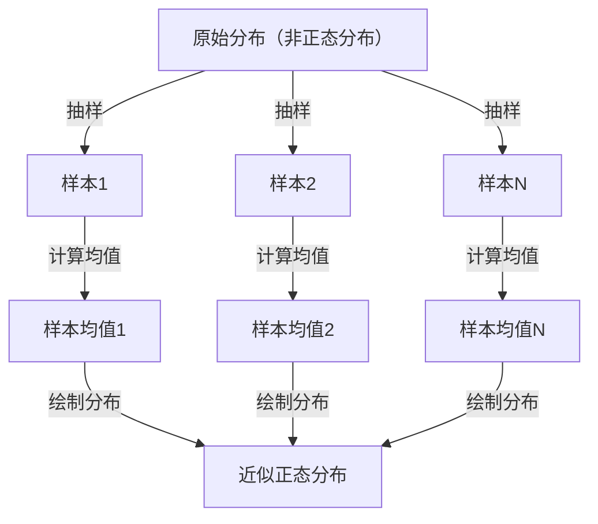

## 1. 引言

在学习数据科学和统计学时，无法避开的就是 **中心极限定理** ([Central Limit Theorem](https://kenji.blog/zh-cn/p/central-limit-theorem/))。这个定理有着如同魔法般的性质：“无论数据服从什么分布，随着样本量的增加，其样本均值的分布都会趋近于正态分布。”

本文将对中心极限定理进行广泛的讲解，从直观的印象到严谨的数学定义，再到实际的应用案例。

## 2. 什么是中心极限定理？

中心极限定理（CLT）是概率论和统计学中最强大且令人惊叹的结论之一。简单来说，大量随机抽取的独立随机变量之和（或平均值），无论原始变量服从什么分布，都可以用正态分布来近似。

### 2.1 直观理解

想象一下掷骰子。当掷一个骰子时，出现的点数分布是均匀分布。然而，如果掷两个骰子并将其点数相加，分布就会呈现出以中央的7为顶点的三角形。进一步增加骰子的数量，其总和的分布就会越来越接近平滑的钟形曲线，即 **正态分布** 。

### 2.2 数学定义

假设从某总体中随机抽取的 $n$ 个样本 $X_1, X_2, \dots, X_n$ 相互独立且服从同一分布（i.i.d.）。设该总体的均值（期望值）为 $\mu$，方差为 $\sigma^2$。

设样本均值为 $\bar{X} = \frac{1}{n} \sum_{i=1}^{n} X_i$。根据中心极限定理，当 $n$ 足够大时，如下所示标准化的变量 $Z$ 将收敛于标准正态分布 $\mathcal{N}(0, 1)$。


$$
Z = \frac{\bar{X} - \mu}{\frac{\sigma}{\sqrt{n}}} \xrightarrow{d} \mathcal{N}(0, 1) \text{ 当 } n \to \infty
$$


这里，$\xrightarrow{d}$ 表示依分布收敛。$\text{ 当 } n \to \infty$ 表示样本量趋于无穷大。

## 3. 中心极限定理的可视化

为了直观地理解中心极限定理是如何运作的，下面使用Mermaid绘制了流程图。



## 4. 使用Python进行模拟

除了理论，让我们实际运行程序来验证一下。我们将从均匀分布中抽取数据，并模拟其均值的分布情况。

```python
import numpy as np
import matplotlib.pyplot as plt

# 总体的参数（均匀分布 [0, 1]）
mu = 0.5
sigma = np.sqrt(1/12)

# 模拟设置
sample_sizes = [1, 5, 30, 100]
num_simulations = 10000

# 图表绘制设置
fig, axes = plt.subplots(2, 2, figsize=(12, 8))
axes = axes.flatten()

for i, n in enumerate(sample_sizes):
    # 从均匀分布中抽取 n 个样本，进行 num_simulations 次试验
    samples = np.random.uniform(0, 1, (num_simulations, n))
    
    # 计算每次试验的样本均值
    sample_means = np.mean(samples, axis=1)
    
    # 绘制直方图
    ax = axes[i]
    ax.hist(sample_means, bins=50, density=True, alpha=0.7, color='skyblue')
    ax.set_title(f"样本大小 n={n}")
    
    # 添加理论上的正态分布曲线
    x = np.linspace(mu - 4*sigma/np.sqrt(n), mu + 4*sigma/np.sqrt(n), 100)
    y = (1 / (np.sqrt(2 * np.pi) * (sigma/np.sqrt(n)))) * np.exp(-0.5 * ((x - mu) / (sigma/np.sqrt(n)))**2)
    ax.plot(x, y, 'r-', lw=2)

plt.tight_layout()
plt.show()
```

运行这段代码可以发现，当 $n=1$ 时是均匀分布，但随着 $n$ 的增大，直方图越来越接近红线的正态分布。

## 5. 中心极限定理的重要性与应用

为什么中心极限定理如此重要？因为在现实世界中，即使我们不知道许多数据的准确分布，只要使用样本均值等统计量，我们就可以假设其为正态分布，从而进行假设检验和构建置信区间。

### 5.1 统计推断的基础
无论是在民意调查、质量控制还是A/B测试中，当我们从数据中推断某些结论时，其依据大多依赖于中心极限定理。

### 5.2 误差的累积
测量误差和自然界中的许多噪声也可以建模为许多微小的独立因素之和，因此它们通常服从正态分布。这也是它被称为高斯分布的原因。

## 6. 深入探讨：证明的方法

中心极限定理的严格证明需要使用特征函数和泰勒展开。这里简要介绍一下。

利用特征函数 $\phi_X(t) = E[e^{itX}]$，独立随机变量之和的特征函数等于各个特征函数的乘积。通过计算标准化变量 $Z$ 的特征函数并取 $n \to \infty$ 的极限，可以证明其收敛于标准正态分布的特征函数 $e^{-t^2/2}$。由此，证明了分布本身收敛于正态分布。

## 7. 结语

中心极限定理是一个极其优美的定理，它揭示了混乱数据背后隐藏的秩序。通过理解这个定理，您将能在数据分析和统计模型构建中获得更深刻的洞察。


## 附录：详细的数学背景与历史

### 附录 1：在概率论中的发展
中心极限定理有着深厚的历史，起源于亚伯拉罕·棣莫弗证明的二项分布的正态近似。之后，皮埃尔-西蒙·拉普拉斯对其进行了推广，亚历山大·李雅普诺夫在更一般的条件下给出了证明。在现代概率论中，存在林德伯格条件和李雅普诺夫条件等各种扩展。这些条件确保了个别随机变量对总和没有决定性的影响。这就解答了一个根本性的问题：为什么自然界和社会科学中各种各样的现象都能用正态分布来近似。

### 附录 2：适用条件与定理的含义

在本文探讨的基本形式中，要求 $X_1,\ldots,X_n$ 独立同分布，且具有有限均值 $\mu$ 和有限正方差 $0<\sigma^2<\infty$。请在这一条件的范围内理解“无论什么分布”的说法。趋近于正态分布的是标准化后的和或样本均值的分布，而不是各个观测值的分布发生了改变。

### 附录 3：标准误与大数定律

由独立性可知，样本均值的期望与方差如下所示。标准误是样本均值的离散程度，与单个数据的标准差不同。

$$
E[\bar X_n]=\mu,\qquad \operatorname{Var}(\bar X_n)=\frac{\sigma^2}{n},\qquad \operatorname{SE}(\bar X_n)=\frac{\sigma}{\sqrt n}.
$$

将样本量增加至4倍，标准误将减半。大数定律阐述了样本均值趋近于 $\mu$，而中心极限定理则描述了其周围的波动放大 $\sqrt{n}$ 倍后的分布形状。

### 附录 4：基于特征函数证明的补充

设 $Y_i=(X_i-\mu)/\sigma$，$Z_n=n^{-1/2}\sum_{i=1}^nY_i$。由于 $E[Y_i]=0$，$E[Y_i^2]=1$，其特征函数在原点附近可展开为：

$$
\phi_Y(t)=E[e^{itY}]=1-\frac{t^2}{2}+o(t^2)\quad(t\to0).
$$

根据独立性可得下式。极限是标准正态分布的特征函数，因此根据莱维连续性定理可知其依分布收敛。特征函数与矩母函数不同，此证明并不需要矩母函数的存在。

$$
\phi_{Z_n}(t)=\left[\phi_Y\!\left(\frac{t}{\sqrt n}\right)\right]^n
=\left[1-\frac{t^2}{2n}+o\!\left(\frac1n\right)\right]^n
\longrightarrow e^{-t^2/2}.
$$

### 附录 5：不适用的例子与近似精度

柯西分布既没有有限的均值，也没有有限的方差，独立的标准柯西变量的样本均值仍然是标准柯西分布。此外，如果所有的 $X_i$ 都等于同一个变量，则它们是不独立的，取平均值也不会减少离散程度。也没有保证“只要 $n\ge30$ 就足够了”。所需的样本量因偏度和尾部厚度而异。对于独立但不同分布的扩展，必须确认诸如林德伯格条件或李雅普诺夫条件等附加条件。
