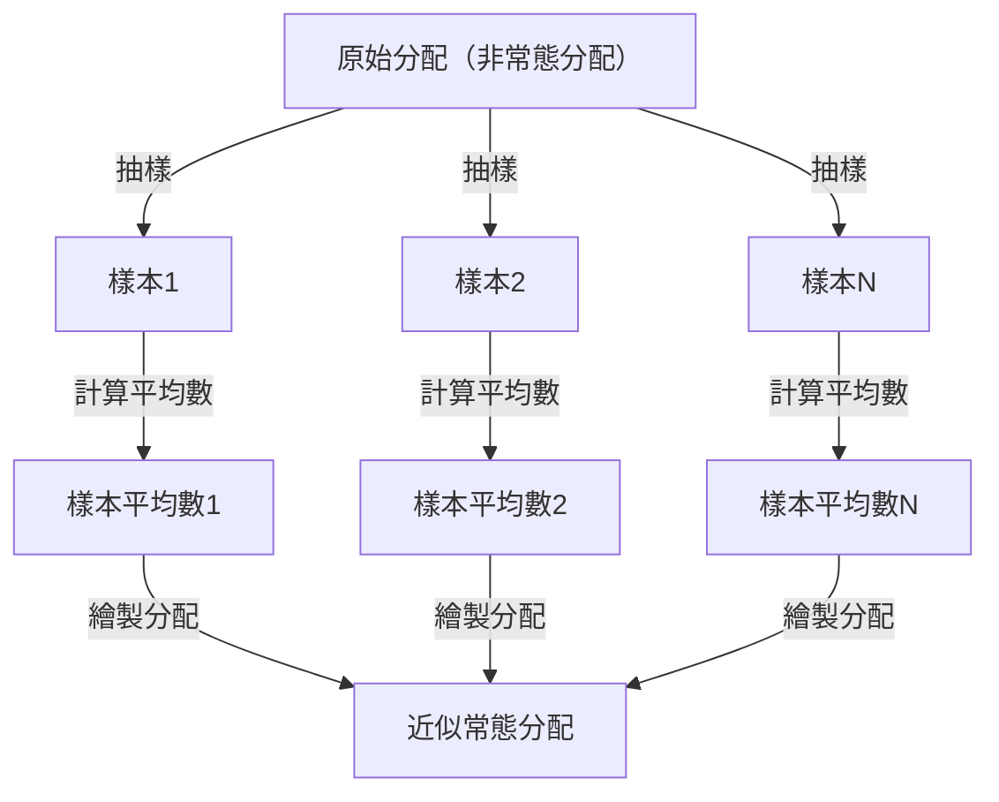

## 1. 前言

在學習資料科學與統計學時，絕對無法避開的就是 **中央極限定理** ([Central Limit Theorem](https://kenji.blog/zh-tw/p/central-limit-theorem/))。這個定理擁有如同魔法般的特性：「無論資料服從何種分配，隨著樣本數的增加，其樣本平均數的分配都會趨近於常態分配。」

本文將針對中央極限定理進行廣泛的解說，從直觀的印象到嚴謹的數學定義，再到實際的應用案例。

## 2. 什麼是中央極限定理？

中央極限定理（CLT）是機率論與統計學中最強大且令人驚嘆的結論之一。簡單來說，大量隨機抽取的獨立隨機變數之和（或平均值），無論原始變數服從何種分配，都可以用常態分配來近似。

### 2.1 直觀理解

想像一下擲骰子。當擲一顆骰子時，出現的點數分配是均勻分配。然而，如果擲兩顆骰子並將其點數相加，分配就會呈現出以中央的7為頂點的三角形。進一步增加骰子的數量，其總和的分配就會越來越接近平滑的鐘形曲線，亦即 **常態分配** 。

### 2.2 數學定義

假設從某母體中隨機抽取的 $n$ 個樣本 $X_1, X_2, \dots, X_n$ 互相獨立且服從同一分配（i.i.d.）。設該母體的平均數（期望值）為 $\mu$，變異數為 $\sigma^2$。

設樣本平均數為 $\bar{X} = \frac{1}{n} \sum_{i=1}^{n} X_i$。根據中央極限定理，當 $n$ 足夠大時，如下所示標準化後的變數 $Z$ 將收斂於標準常態分配 $\mathcal{N}(0, 1)$。


$$
Z = \frac{\bar{X} - \mu}{\frac{\sigma}{\sqrt{n}}} \xrightarrow{d} \mathcal{N}(0, 1) \text{ 當 } n \to \infty
$$


這裡，$\xrightarrow{d}$ 表示依分配收斂。$\text{ 當 } n \to \infty$ 表示樣本數趨近於無限大。

## 3. 中央極限定理的視覺化

為了直觀地理解中央極限定理的運作方式，以下使用Mermaid繪製了流程圖。



## 4. 使用Python進行模擬

除了理論之外，讓我們實際執行程式來驗證一下。我們將從均勻分配中抽取資料，並模擬其平均數的分配情況。

```python
import numpy as np
import matplotlib.pyplot as plt

# 母體的參數（均勻分配 [0, 1]）
mu = 0.5
sigma = np.sqrt(1/12)

# 模擬設定
sample_sizes = [1, 5, 30, 100]
num_simulations = 10000

# 圖表繪製設定
fig, axes = plt.subplots(2, 2, figsize=(12, 8))
axes = axes.flatten()

for i, n in enumerate(sample_sizes):
    # 從均勻分配中抽取 n 個樣本，進行 num_simulations 次試驗
    samples = np.random.uniform(0, 1, (num_simulations, n))
    
    # 計算每次試驗的樣本平均數
    sample_means = np.mean(samples, axis=1)
    
    # 繪製直方圖
    ax = axes[i]
    ax.hist(sample_means, bins=50, density=True, alpha=0.7, color='skyblue')
    ax.set_title(f"樣本大小 n={n}")
    
    # 加上理論上的常態分配曲線
    x = np.linspace(mu - 4*sigma/np.sqrt(n), mu + 4*sigma/np.sqrt(n), 100)
    y = (1 / (np.sqrt(2 * np.pi) * (sigma/np.sqrt(n)))) * np.exp(-0.5 * ((x - mu) / (sigma/np.sqrt(n)))**2)
    ax.plot(x, y, 'r-', lw=2)

plt.tight_layout()
plt.show()
```

執行這段程式碼可以發現，當 $n=1$ 時是均勻分配，但隨著 $n$ 的增大，直方圖越來越接近紅線的常態分配。

## 5. 中央極限定理的重要性與應用

為什麼中央極限定理如此重要？因為在現實世界中，即使我們不知道許多資料的準確分配，只要使用樣本平均數等統計量，我們就可以假設其為常態分配，進而進行假說檢定與建構信賴區間。

### 5.1 統計推論的基礎
無論是在民意調查、品質管制還是A/B測試中，當我們從資料中推論某些結論時，其依據大多仰賴於中央極限定理。

### 5.2 誤差的累積
測量誤差與自然界中的許多雜訊也可以建模為許多微小的獨立因素之和，因此它們通常服從常態分配。這也是它被稱為高斯分配的原因。

## 6. 深入探討：證明的方法

中央極限定理的嚴格證明需要使用特徵函數與泰勒展開式。這裡簡要介紹一下。

利用特徵函數 $\phi_X(t) = E[e^{itX}]$，獨立隨機變數之和的特徵函數等於各個特徵函數的乘積。透過計算標準化變數 $Z$ 的特徵函數並取 $n \to \infty$ 的極限，可以證明其收斂於標準常態分配的特徵函數 $e^{-t^2/2}$。由此可證明分配本身收斂於常態分配。

## 7. 結語

中央極限定理是一個極其優美的定理，它揭示了混亂資料背後隱藏的秩序。透過理解這個定理，您將能在資料分析與統計模型建構中獲得更深刻的洞察。


## 附錄：詳細的數學背景與歷史

### 附錄 1：在機率論中的發展
中央極限定理有著深厚的歷史，起源於亞伯拉罕·棣美弗證明了二項分配的常態近似。之後，皮埃爾-西蒙·拉普拉斯對其進行了推廣，亞歷山大·李亞普諾夫在更一般的條件下給出了證明。在現代機率論中，存在林德伯格條件與李亞普諾夫條件等各種擴充。這些條件確保了個別隨機變數對總和沒有決定性的影響。這就解答了一個根本性的問題：為什麼自然界與社會科學中各種各樣的現象都能用常態分配來近似。

### 附錄 2：適用條件與定理的含義

在本文探討的基本形式中，要求 $X_1,\ldots,X_n$ 獨立同分配，且具有有限平均數 $\mu$ 與有限正變異數 $0<\sigma^2<\infty$。請在這一條件的範圍內理解「無論什麼分配」的說法。趨近於常態分配的是標準化後的和或樣本平均數的分配，而不是各個觀測值的分配發生了改變。

### 附錄 3：標準誤與大數法則

由獨立性可知，樣本平均數的期望值與變異數如下所示。標準誤是樣本平均數的離散程度，與單筆資料的標準差不同。

$$
E[\bar X_n]=\mu,\qquad \operatorname{Var}(\bar X_n)=\frac{\sigma^2}{n},\qquad \operatorname{SE}(\bar X_n)=\frac{\sigma}{\sqrt n}.
$$

將樣本數增加至4倍，標準誤將減半。[大數法則](/zh-tw/p/law-of-large-numbers/)闡述了樣本平均數趨近於 $\mu$，而中央極限定理則描述了其周圍的波動放大 $\sqrt{n}$ 倍後的分配形狀。

### 附錄 4：基於特徵函數證明的補充

設 $Y_i=(X_i-\mu)/\sigma$，$Z_n=n^{-1/2}\sum_{i=1}^nY_i$。由於 $E[Y_i]=0$，$E[Y_i^2]=1$，其特徵函數在原點附近可展開為：

$$
\phi_Y(t)=E[e^{itY}]=1-\frac{t^2}{2}+o(t^2)\quad(t\to0).
$$

根據獨立性可得下式。極限是標準常態分配的特徵函數，因此根據萊維連續性定理可知其依分配收斂。特徵函數與動差[母函數](https://kenji.blog/zh-tw/p/generating-functions/)不同，此證明並不需要動差[母函數](https://kenji.blog/zh-tw/p/generating-functions/)的存在。

$$
\phi_{Z_n}(t)=\left[\phi_Y\!\left(\frac{t}{\sqrt n}\right)\right]^n
=\left[1-\frac{t^2}{2n}+o\!\left(\frac1n\right)\right]^n
\longrightarrow e^{-t^2/2}.
$$

### 附錄 5：不適用的例子與近似精確度

柯西分配既沒有有限的平均數，也沒有有限的變異數，獨立的標準柯西變數的樣本平均數仍然是標準柯西分配。此外，如果所有的 $X_i$ 都等於同一個變數，則它們是不獨立的，取平均值也不會減少離散程度。也沒有保證「只要 $n\ge30$ 就足夠了」。所需的樣本數因偏度與尾部厚度而異。對於獨立但不同分配的擴充，必須確認諸如林德伯格條件或李亞普諾夫條件等附加條件。
