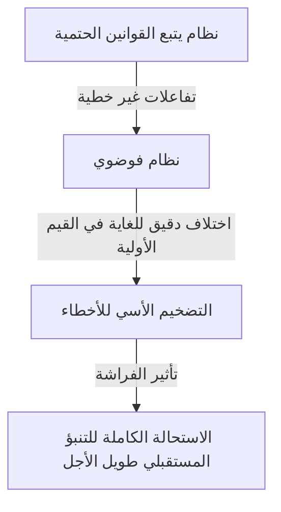
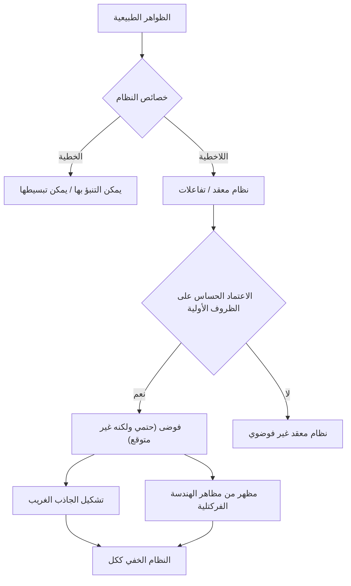

## 1. مقدمة: ما هو تأثير الفراشة؟

"هل رفرفة أجنحة فراشة في البرازيل تسبب إعصارًا في تكساس؟"

يرمز هذا السؤال الرائع والغامض إلى **تأثير الفراشة**، وهو أحد أشهر المفاهيم في العلوم الحديثة وأكثرها سوء فهم. تأثير الفراشة هو مفهوم أساسي في **نظرية الفوضى**، والتي يتم دراستها في مجالات مثل الأرصاد الجوية والفيزياء والرياضيات. يشير إلى الظاهرة التي "يتضخم فيها اختلاف ضئيل في الظروف الأولية أسيًا بمرور الوقت، مما يؤدي إلى اختلاف حاسم في الحالة المستقبلية".

في حياتنا اليومية، نميل بشكل حدسي إلى التفكير في أن الأسباب والنتائج متناسبة. بعبارة أخرى، إنها نظرة عالمية خطية حيث تجلب التغييرات الصغيرة نتائج صغيرة، والتغييرات الكبيرة تجلب نتائج كبيرة. ومع ذلك، وعلى عكس هذا الحدس، تتصرف العديد من الظواهر في الطبيعة بطريقة غير خطية للغاية. يمكن أن ينتج عن تذبذب طفيف تغييرات ضخمة. توفر نظرية الفوضى إطارًا رياضيًا لكشف النظام الخفي وراء هذه الظواهر المعقدة التي تبدو غير منظمة وغير قابلة للتنبؤ بها.

في هذه المقالة، سنشرح بالتفصيل [نظرية الفوضى وتأثير الفراشة](https://kenji.blog/p/chaos-theory/)، من خلفيتها التاريخية إلى أسسها الرياضية، والروابط العميقة مع الهندسة الكسيرية (الفركتلات)، والتطبيقات المتنوعة في المجتمع الحديث. لننطلق في رحلة لاستكشاف سبب عدم القدرة على التنبؤ بالمستقبل وما هو نوع الجمال المخفي داخل عدم القدرة على التنبؤ.

---

## 2. الخلفية التاريخية: من بوانكاريه إلى لورنتز

يمكن إرجاع بذور نظرية الفوضى إلى أبحاث عالم الرياضيات الفرنسي العظيم في القرن التاسع عشر [هنري بوانكاريه](https://kenji.blog/p/poincare/). في ذلك الوقت، كان أحد أكبر التحديات في الفيزياء هو "معضلة الأجسام الثلاثة". كانت هذه هي مشكلة التنبؤ بحركة ثلاثة أجرام سماوية، مثل الشمس والأرض والقمر، التي تمارس قوى الجاذبية على بعضها البعض بناءً على ميكانيكا نيوتن.

أثناء دراسة هذه المشكلة بعمق، اكتشف بوانكاريه أن حركة الأجرام السماوية يمكن أن تصبح معقدة للغاية. واقترح رياضيًا أن الأخطاء الصغيرة بشكل لا يقاس في المواضع أو السرعات الأولية يمكن أن تتوسع بمرور الوقت، مما يؤدي في النهاية إلى مسارات مختلفة تمامًا للأجرام السماوية. كان هذا تقريبًا أول اكتشاف للسلوك الفوضوي، حيث أظهر أنه حتى في النظام الحتمي (نظام تُعرف فيه القوانين تمامًا)، فإن التنبؤ طويل الأجل قد يصبح مستحيلاً في بعض الأحيان. ومع ذلك، نظرًا للقيود في الأساليب الرياضية والقدرة الحسابية (غياب أجهزة الكمبيوتر) في ذلك الوقت، لم يتم استكشاف هذا الاكتشاف الرائد بعمق لعقود بعد ذلك.

تغير الوضع بشكل جذري في الستينيات. كان إدوارد لورنتز، عالم الأرصاد الجوية في معهد ماساتشوستس للتكنولوجيا (MIT)، يحاكي الحمل الحراري في الغلاف الجوي باستخدام جهاز كمبيوتر مبكر. قام بإنشاء مجموعة من المعادلات التفاضلية غير الخطية البسيطة لحساب المتغيرات مثل درجة الحرارة والضغط وسرعة الرياح، وحسب القيم باستخدام جهاز كمبيوتر.

في أحد الأيام، حاول لورنتز إعادة تشغيل محاكاة من منتصف عملية تشغيل سابقة. أعاد إدخال الأرقام من نتيجة مطبوعة، لكنه كتب بالخطأ "0.506" - وهي قيمة مقربة إلى ثلاث مراتب عشرية من المطبوعات - بدلاً من القيمة الدقيقة الداخلية المكونة من ستة أرقام "0.506127" التي يحتفظ بها الكمبيوتر.

عندما عاد لورنتز من استراحة القهوة، كان في انتظاره مشهد مذهل. تطابقت نتائج المحاكاة التي تمت إعادة تشغيلها في البداية مع التشغيل السابق في الخطوات القليلة الأولى، ولكن سرعان ما بدأت في تتبع نمط طقس مختلف تمامًا. نتج عن اختلاف أولي ضئيل قدره 0.000127 فقط سيناريو طقس مستقبلي مختلف تمامًا. كانت هذه لحظة اكتشاف ظاهرة أطلق عليها لورنتز لاحقًا اسم **الاعتماد الحساس على الظروف الأولية**، والتي ستُعرف في العالم بتأثير الفراشة.

---

## 3. الأسس الرياضية: الأنظمة الديناميكية غير الخطية ومعادلات لورنتز

لفهم نظرية الفوضى رياضيًا، من الضروري استيعاب مفاهيم **الأنظمة الديناميكية** و **اللاخطية**.

النظام الديناميكي هو نموذج رياضي لنظام تتغير حالته بمرور الوقت. يتم تحديد الحالة المستقبلية للنظام بالكامل من خلال حالته الحالية والقوانين الحتمية (عادة المعادلات التفاضلية أو الفروقية) التي تحكم النظام. النقطة الرئيسية هنا هي أن القوانين نفسها لا تحتوي على الإطلاق على أي عناصر احتمالية (الصدفة، مثل رمي النرد).

تصنف الأنظمة الديناميكية على نطاق واسع إلى أنظمة خطية وغير خطية. في النظام الخطي، يكون السبب والنتيجة متناسبين، وينطبق مبدأ التراكب، حيث "مجموع الأجزاء يساوي الكل". من السهل نسبيًا حل هذه المعادلات رياضيًا، والتنبؤات مباشرة. من ناحية أخرى، في الأنظمة غير الخطية، يتم ضرب المتغيرات معًا أو توجد حلقات تغذية مرتدة، مما يكسر العلاقة التناسبية بين السبب والنتيجة. إنه يُظهر سلوكًا حيث "يختلف مجموع الأجزاء عن الكل"، مما يتسبب في ظواهر معقدة للغاية. تحدث الفوضى فقط في الأنظمة غير الخطية.

إن أشهر مجموعة من المعادلات التفاضلية غير الخطية التي تنتج الفوضى، والتي استمدها إدوارد لورنتز من نموذج الحمل الحراري في الغلاف الجوي، هي **معادلات لورنتز**. وتتكون من المتغيرات الثلاثة التالية ($x, y, z$) وثلاثة معلمات ($\sigma, \rho, \beta$).

$$
\frac{dx}{dt} = \sigma (y - x)
$$

$$
\frac{dy}{dt} = x (\rho - z) - y
$$

$$
\frac{dz}{dt} = x y - \beta z
$$

هنا، كل متغير له معنى فيزيائي:
- $x$ هو معدل الحمل الحراري (سرعة دوران السائل)
- $y$ هو تباين درجات الحرارة الأفقي بين التيارات الصاعدة والهابطة
- $z$ هو انحراف ملف تعريف درجة الحرارة العمودي عن الخطية
- $\sigma$ (رقم برانتل)، $\rho$ (رقم رايلي)، و $\beta$ (نسبة العرض إلى الارتفاع للنظام) هي معلمات.

كقيم معلمات تظهر سلوكًا فوضويًا نموذجيًا، اختار لورنتز $\sigma = 10, \rho = 28, \beta = 8/3$. في حين أن نظام المعادلات هذا حتمي، فإن الحلول لا تكرر أبدًا الحالات السابقة وتستمر في تتبع مسارات معقدة بلا حدود. تلعب المصطلحات غير الخطية في المعادلات، مثل $xz$ و $xy$، دورًا حاسمًا في توليد الفوضى.

---

## 4. فضاء الطور والجاذبات الغريبة

أداة قوية لفهم سلوك الأنظمة الديناميكية بصريًا هي **فضاء الطور**. فضاء الطور هو فضاء متعدد الأبعاد قادر على تمثيل جميع الحالات الممكنة للنظام. تُمثل الحالة الحالية للنظام كـ "نقطة واحدة" في فضاء الطور هذا. مع تقدم الوقت، يُصور التغيير في حالة النظام على أنه "مسار" تتبعه النقطة التي تتحرك عبر فضاء الطور.

في العديد من أنظمة العالم الحقيقي ذات التبديد (خاصية فقدان الطاقة، مثل الاحتكاك أو مقاومة الهواء)، بعد مرور فترة زمنية كافية، يستقر النظام أخيرًا في حالة معينة (نقطة) أو حالة دورية (حلقة مغلقة). يُطلق على مكان الاستقرار النهائي هذا اسم **الجاذب** (Attractor). على سبيل المثال، تتوقف حركة البندول في النهاية عند أدنى نقطة لها بسبب مقاومة الهواء. الجاذب في هذه الحالة هو "نقطة واحدة (نقطة ثابتة)". الجاذب لنظام يكرر الحركة الدورية، مثل نبضات القلب، هو "دورة حدية (منحنى مغلق)".

ومع ذلك، في الأنظمة الفوضوية مثل معادلات لورنتز، يظهر نوع مختلف تمامًا من الجاذبات. هذا هو **الجاذب الغريب**.

عندما يتم رسم جاذب لورنتز في فضاء طور ثلاثي الأبعاد، فإنه يكشف عن بنية جميلة ومعقدة بشكل مذهل تشبه فراشة ذات أجنحة منتشرة أو عينين. يتميز هذا الجاذب الغريب بالميزات الرائعة التالية:

1. **محدودية**: المسار لا يطير إلى ما لا نهاية؛ يبقى دائمًا داخل منطقة معينة من الجاذب.
2. **اللا دورية**: لا يتقاطع المسار أبدًا مع مساره الماضي ولا يكرر نفس المسار بالضبط. يستمر إلى الأبد في تتبع مسارات جديدة.
3. **الاعتماد الحساس على الظروف الأولية**: المسارات التي تبدأ من نقطتين أوليتين قريبتين للغاية على الجاذب سوف تتباعد كثيرًا إلى مواقع مختلفة تمامًا داخل الجاذب مع مرور الوقت.

على الرغم من أن المسارات محصورة داخل حجم محدود، إلا أنها مقيدة بألا تتقاطع أبدًا (لأن التقاطع ينتهك الفرضية الحتمية بأن "نفس الحالة تؤدي إلى نفس المستقبل"). لتحقيق ذلك، يجب "طي" الفضاء بلا حدود. هذه العملية المتكررة من "التمدد" و "الطي" (مثل عجن العجين) هي جوهر الفوضى وتؤدي إلى البنية المعقدة للجاذبات الغريبة.

---

## 5. الخريطة اللوجستية ومخطط التشعب

نموذج رياضي مهم آخر لفهم نظرية الفوضى بأبسط طريقة هو **الخريطة اللوجستية**. إنها معادلة فروقية تربيعية بسيطة تصيغ تذبذب الكثافة السكانية البيولوجية (على سبيل المثال، التغيير السنوي في عدد الأرانب على جزيرة).

$$
x_{n+1} = r x_n (1 - x_n)
$$

هنا،
- $x_n$ يمثل السكان في الجيل $n$ (يأخذ قيمة في النطاق $0 \le x_n \le 1$ كنسبة من القدرة الاستيعابية القصوى للبيئة).
- $x_{n+1}$ هو سكان الجيل القادم.
- $r$ هو معلمة تمثل معدل التكاثر (عادة $0 \le r \le 4$).

على الرغم من أن هذه المعادلة بسيطة للغاية، فإن تغيير قيمة المعلمة $r$ يتسبب في إظهار سلوكيات متنوعة ومعقدة بشكل مذهل:

- $0 < r < 1$: ينقرض السكان في النهاية، ويتقارب $x$ إلى 0.
- $1 < r < 3$: يتقارب السكان إلى قيمة ثابتة معينة (نقطة ثابتة) ويستقرون.
- حول $r = 3$: تصبح النقطة الثابتة غير مستقرة، ويبدأ السكان في التناوب بين قيمتين مختلفتين. يسمى هذا **تشعب مضاعفة الفترة**.
- مع زيادة $r$ أكثر، تحدث تشعبات حيث تتضاعف الفترة إلى 4 و 8 و 16 وما إلى ذلك بسرعة.
- وراء $r \approx 3.56995$ (نقطة فايجنباوم)، تنهار الدورية تمامًا، ويأخذ السكان قيمًا غير قابلة للتنبؤ بها تمامًا. هذه هي حالة **الفوضى**.

إن رسم الحالة النهائية للنظام (الجاذب) مقابل هذه التغييرات في $r$ يخلق ما يسمى بـ **مخطط التشعب**. يمثل المحور الأفقي المعلمة $r$، ويمثل المحور الرأسي القيم النهائية لـ $x$.

بالنظر إلى مخطط التشعب، يمكننا أن نرى أنه داخل المنطقة الفوضوية، توجد "نوافذ" حيث يتعافى النظام فجأة (على سبيل المثال، منطقة الفترة 3). والمثير للدهشة، إذا قمت بتكبير جزء من مخطط التشعب هذا، فإنه يُظهر تشابهًا ذاتيًا، حيث يظهر نفس النمط الدقيق للهيكل العام بشكل لا نهائي. حقيقة أن معادلة تربيعية بسيطة تحتوي على بنية غنية جدًا أرسلت صدمة كبيرة من خلال مجتمع الرياضيات.

---

## 6. أس ليابونوف: قياس الفوضى

المؤشر المستخدم للقياس الرياضي الصارم لـ "الاعتماد الحساس على الظروف الأولية" المتأصل في الأنظمة الفوضوية هو **أس ليابونوف**.

فكر في حالتين أوليتين متقاربتين للغاية في فضاء الطور (مع وجود مسافة يشار إليها بـ $\delta Z_0$) ولاحظ كيف تنفصل مساراتهما إلى مسافة $\delta Z(t)$ مع مرور الوقت $t$. في حالة نظام فوضوي، تتسع هذه المسافة أسيًا في المتوسط.

$$
|\delta Z(t)| \approx e^{\lambda t} |\delta Z_0|
$$

هنا، $\lambda$ (لامدا) هو أس ليابونوف.
يمثل أس ليابونوف متوسط المعدل الذي تنفصل به المسارات المتجاورة (أو تقترب من بعضها البعض).

- $\lambda < 0$: تقترب المسارات من بعضها البعض وتتقارب إلى نقطة ثابتة أو دورة حدية (ليس فوضى).
- $\lambda = 0$: تبقى المسافة بين المسارات ثابتة (مثل الأنظمة المحافظة).
- $\lambda > 0$: تبتعد المسارات عن بعضها البعض بشكل أسي. هذا هو المؤشر الحاسم لـ **الفوضى**.

في النظام الديناميكي متعدد الأبعاد، هناك عدد من أسس ليابونوف يساوي أبعاد الفضاء (طيف ليابونوف). إذا كان هناك أس ليابونوف إيجابي واحد على الأقل، يتم تعريف النظام على أنه فوضوي. كلما كان أس ليابونوف الإيجابي أكبر، زادت سرعة تضخم الأخطاء الدقيقة الأولية، مما يقصر النطاق الزمني الذي يمكن التنبؤ بالمستقبل فيه (وقت ليابونوف). هذا هو السبب الرياضي الأساسي الذي يجعل التنبؤات الجوية دقيقة بشكل معقول قبل بضعة أيام ولكنها تصبح غير قابلة للتنبؤ بها تمامًا قبل أسابيع.

---

## 7. العلاقة بين الفركتلات والفوضى

عند مناقشة نظرية الفوضى، لا يمكن للمرء أن يغفل الهندسة **الكسيرية (الفركتلية)**، التي اقترحها عالم الرياضيات بينوا ماندلبروت. الفركتل هو شكل "بغض النظر عن مدى تكبيرك له، تظهر بنية معقدة مماثلة (تشابه ذاتي) مطابقة للكل بشكل لا نهائي". تشمل الأمثلة التمثيلية مجموعة ماندلبروت وندفة ثلج كوخ.

قد يبدو الفوضى والفركتلات مفهومين مختلفين للوهلة الأولى، لكنهما في الواقع وجهان لعملة واحدة. إذا أخذت مقطعًا عرضيًا لجاذب غريب وراقبته عن كثب، فستجد بنية ذات طبقات لا حصر لها، مما يكشف أنها تمتلك بنية فركتلية.

تنتج ديناميكيات "التمدد والطي" في فضاء الطور لنظام فوضوي أشكالًا فركتلية كنتيجة هندسية. أحد الخصائص المهمة للفركتل هو أنه يحتوي على "بعد كسري (بعد فركتلي)" وهو ليس عددًا صحيحًا. على سبيل المثال، الرقم الأكثر تعقيدًا ويملأ الفضاء من خط 1D ولكنه لا يصل إلى مستوى 2D قد يكون له بُعد 1.26. الجاذب الغريب هو أيضًا بنية فركتلية ذات بُعد كسري.

إذا كانت الفوضى "ديناميكيات معقدة تظهر بمرور الوقت"، فيمكن القول إن الفركتلات هي "البصمات الهندسية التي تتركها هذه الديناميكيات في الفضاء". العديد من الظواهر الطبيعية، مثل أشكال سواحل الرياس، وتفرع الأشجار، وشبكات الأوعية الدموية، وأشكال السحب، تمتلك هياكل فركتلية، ويُعتقد أن الديناميكيات غير الخطية الفوضوية تعمل وراء عمليات تكوينها.

---

## 8. تطبيقات العالم الحقيقي: من الأرصاد الجوية إلى الاقتصاد

نظرية الفوضى ليست مجرد لعبة رياضية. جلبت الخصائص العالمية للاعتماد الحساس على الظروف الأولية والديناميكيات غير الخطية تطبيقات واسعة النطاق في كل مجال من مجالات العالم الحقيقي، متجاوزة الفيزياء.

### 8.1 الأرصاد الجوية وتغير المناخ
الأرصاد الجوية، مسرح اكتشاف لورنتز، هي واحدة من المجالات التي استفادت أكثر من نظرية الفوضى. يُحكم الغلاف الجوي بمعادلات غير خطية معقدة لديناميكا الموائع والديناميكا الحرارية، مما يجعله فوضويًا بطبيعته. اليوم، النهج السائد هو "تنبؤ المجموعة"، والذي يتضمن إدخال تقلبات طفيفة عن قصد في القيم الأولية وتشغيل محاكاة متعددة في وقت واحد، بدلاً من الاعتماد على تنبؤ واحد. يتيح ذلك لخبراء الأرصاد الجوية تقييم عدم اليقين في التنبؤات احتماليًا وفهم إلى أي مدى في المستقبل يمكن إجراء تنبؤات موثوقة.

### 8.2 الطب وعلم الأحياء
تتشابك الإيقاعات البيولوجية البشرية أيضًا بعمق مع الفوضى. على سبيل المثال، من المعروف أن فترات نبضات القلب (التقلبات) للقلب السليم ليست منتظمة تمامًا ولا عشوائية تمامًا، بل تمتلك خصائص فركتلية فوضوية. على العكس من ذلك، يمكن أن تصبح نبضات قلب مرضى القلب أو كبار السن منتظمة جدًا أو عشوائية تمامًا. تتم دراسة فقدان التقلب الفوضوي كعلامة مهمة (مؤشر حيوي) تشير إلى تدهور الصحة. الديناميكيات غير الخطية ضرورية أيضًا في تحليل موجات الدماغ ونمذجة انتشار الأمراض المعدية (مثل نموذج SIR في علم الأوبئة).

### 8.3 الاقتصاد والأسواق المالية
الأسواق المالية، مثل أسواق الأسهم والعملات الأجنبية، هي أنظمة غير خطية معقدة للغاية تتفاعل فيها سيكولوجية وأفعال عدد لا يحصى من المستثمرين. افترض الاقتصاد التقليدي أن الأسواق فعالة وأن الأسعار اتبعت مسيرة عشوائية (حركات عشوائية تتوافق مع التوزيع الطبيعي). ومع ذلك، في الأسواق الفعلية، تحدث أحداث متطرفة مثل الانهيارات والفقاعات في كثير من الأحيان أكثر مما يتوقعه التوزيع الطبيعي (ظاهرة الذيل السمين). من خلال تطبيق نظرية الفوضى والفركتلات (مثل نموذج ماندلبروت متعدد الفركتلات)، تُبذل محاولات لنمذجة الهياكل غير الخطية بدقة أكبر، والذاكرة طويلة الأجل، ومخاطر انفجار الفقاعات المخبأة داخل تقلبات أسعار السوق، وتطبيق هذه المعرفة على إدارة المخاطر.

### 8.4 الهندسة والتحكم
مفهوم الفوضى مهم أيضًا في مجال الهندسة. تُلاحظ ظواهر الفوضى في العديد من الأنظمة، مثل اهتزازات الأجنحة في الطائرات (الرفرفة)، ومزامنة المذبذبات غير الخطية في الدوائر الكهربائية، والاضطرابات في إخراج الليزر. تقليديا، كانت الفوضى تعتبر شيئا يجب "تجنبه" أو "التخلص منه كضوضاء" لأنه لا يمكن التنبؤ به ويزعزع استقرار الأنظمة. ومع ذلك، تطورت اليوم تقنية تسمى "التحكم في الفوضى"، والتي تستخدم الطاقة الدقيقة الكامنة في النظام لتوجيهه بمهارة من حالة فوضوية إلى حالة دورية مرغوبة، مما يؤدي إلى استقراره. يتم أيضًا البحث في تطبيقات الاتصال المشفر باستخدام العشوائية للإشارات الفوضوية (تشفير الفوضى).

---

## 9. التداعيات الفلسفية: الحتمية والقدرة على التنبؤ

أحدث ظهور نظرية الفوضى تحولًا أساسيًا في النموذج الفكري لفلسفة العلوم، لا سيما فيما يتعلق بنظرتنا للعالم حول "الحتمية" و "القدرة على التنبؤ".

اقترح عالم الرياضيات الفرنسي في القرن الثامن عشر بيير سيمون لابلاس التجربة الفكرية التالية: "إذا كان هناك فكر يمكنه استيعاب المواقف والزخم الحالي لجميع الذرات في الكون بالكامل وكان واسعًا بما يكفي لتحليلها، بالنسبة لمثل هذا الفكر، فإن المستقبل، تمامًا مثل الماضي، سيكون حاضرًا أمام عينيه". يُطلق على هذا العقل الافتراضي اسم **شيطان لابلاس**، وكان يرمز إلى نظرة عالمية حتمية قوية للكون بناءً على الميكانيكا الكلاسيكية.

الحتمية هي فكرة أنه "إذا كانت الحالة الحالية محددة بالكامل، فإن المستقبل يتحدد بشكل فريد وفقًا لقوانين الفيزياء". المعادلات التي يتم التعامل معها بواسطة نظرية الفوضى (مثل معادلات لورنتز) هي معادلات حتمية بحتة لا تحتوي على عناصر احتمالية. لذلك، من حيث المبدأ، يجب أن يكون شيطان لابلاس قادرًا على التنبؤ بشكل مثالي بمستقبل الأنظمة الفوضوية أيضًا.

ومع ذلك، واجهتنا نظرية الفوضى ببرود بـ **حدود القدرة على التنبؤ** في العالم الحقيقي. في الواقع، من المستحيل قياس كل حالة أولية للكون بـ "دقة لا نهائية (خطأ صفر)". حتى بدون النظر في مبدأ عدم اليقين في ميكانيكا الكم، فإن قدراتنا في المراقبة لها حدود محدودة بطبيعتها.

في النظام الفوضوي، بغض النظر عن صغر خطأ المراقبة هذا، فإنه يتضخم أسيًا بمرور الوقت، ويبتلع في النهاية النظام بأكمله. بعبارة أخرى، أصبح من الواضح أن "أن تكون حتميًا" و "أن تكون قابلاً للتنبؤ" مفهومان مختلفان تمامًا. لقد قضت نظرية الفوضى على شيطان لابلاس وعلّمت البشرية الحقيقة العميقة وهي أنه "حتى لو كانت القوانين معروفة تمامًا، فقد يكون المستقبل في الأساس غير قابل للتنبؤ".

يقدم هذا التحول في النموذج نظرة عالمية جديدة: "عالمنا معقد وغير قابل للتنبؤ به، ولكن وراءه تكمن بنية رياضية حتمية جميلة". بدلاً من التخلي عن التنبؤ المثالي، انفتح طريق لفهم "النظام الكلي" المخفي داخل الفوضى من خلال دراسة أشكال الجاذبات وفهم التوزيعات الاحتمالية.

---

## 10. الاستنتاج

في هذا المقال، استكشفنا بعمق تأثير الفراشة - حيث تؤدي الاختلافات الدقيقة في الظروف الأولية إلى نتائج هائلة - ونظرية الفوضى التي تشملها.

بدءًا من حدس بوانكاريه، مرورًا باكتشاف لورنتز العرضي عبر الكمبيوتر، نمت نظرية الفوضى لتصبح مجالًا ضخمًا يعبر الرياضيات والفيزياء. إن أسسها الرياضية راقية للغاية ومليئة بالعجائب الفكرية، كما يتضح في المسارات الجميلة للجاذبات الغريبة التي ترسمها المعادلات غير الخطية، والتشابه الذاتي اللانهائي الذي يُلاحظ في الخريطة اللوجستية، والقياس الكمي لعدم القدرة على التنبؤ من خلال أسس ليابونوف.

لا تعلمنا نظرية الفوضى حدود التنبؤ بالطقس فحسب، بل توفر أيضًا عدسة قوية لفهم الظواهر المعقدة المحيطة بنا، من التقلبات الاقتصادية ونبضات القلب إلى تطور الحياة. ويكشف أن العالم الطبيعي ليس آلة بسيطة، بل نظام ديناميكي مليء بعدم القدرة على التنبؤ والإبداع.

حتمي ولكنه غير قابل للتنبؤ. هذه الطبيعة المتناقضة على ما يبدو هي على وجه التحديد أعظم سحر لنظرية الفوضى. حقيقة أن المستقبل محدد تمامًا، ومع ذلك لا أحد (ومهما كان الكمبيوتر قويًا) يمكنه معرفة مستقبله المفصل، تجعل إدراكنا للكون أكثر تواضعًا وثراءً. إن العالم غير الخطي المنسوج من الفوضى والفركتلات سيستمر بالتأكيد في إبهار العلماء وإحداث اكتشافات جديدة في المستقبل.

