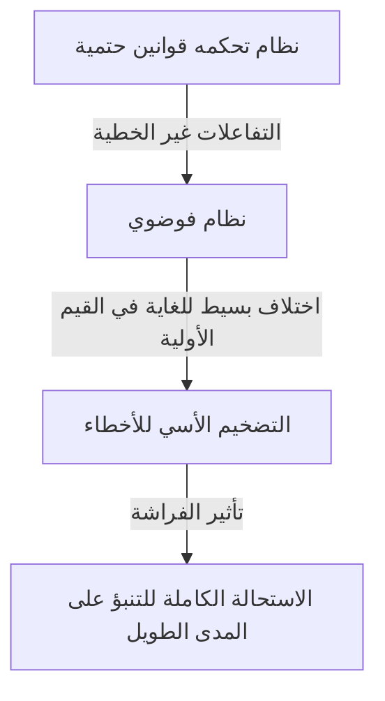
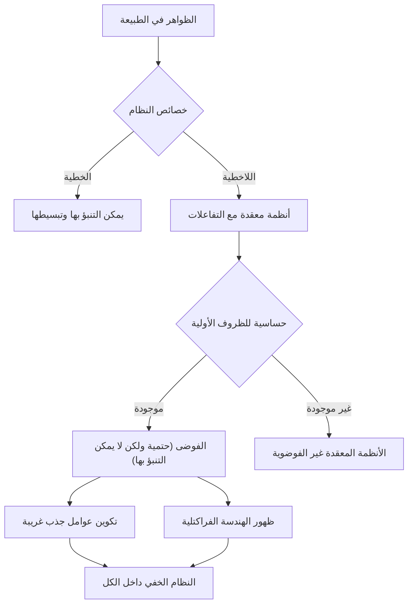

## 1. المقدمة: ما هو تأثير الفراشة؟

"هل رفرفة أجنحة الفراشة في البرازيل تؤدي إلى إعصار في تكساس؟"

يرمز هذا السؤال الجذاب والغامض إلى أحد أشهر مفاهيم العلم الحديث وأكثرها سوء فهم: **تأثير الفراشة**. يعد تأثير الفراشة مفهومًا أساسيًا في **نظرية الفوضى**، وهو مجال يدرس في الأرصاد الجوية والفيزياء والرياضيات والمزيد. ويشير إلى الظاهرة التي "تتضخم فيها الاختلافات الصغيرة في الظروف الأولية بشكل كبير بمرور الوقت، مما يؤدي في النهاية إلى إنتاج اختلافات حاسمة في الحالات المستقبلية".

في حياتنا اليومية، نميل إلى افتراض وجود علاقة متناسبة بين السبب والنتيجة - وهي رؤية خطية للعالم حيث تؤدي التغييرات الصغيرة إلى نتائج صغيرة والتغييرات الكبيرة تؤدي إلى نتائج كبيرة. ومع ذلك، فإن العديد من الظواهر في العالم الطبيعي تتصرف بطريقة غير خطية إلى حد كبير، متحدية هذا الحدس. يمكن لتقلب بسيط أن يولد تغييرات هائلة. توفر نظرية الفوضى الإطار الرياضي لكشف النظام الخفي الكامن وراء مثل هذه الظواهر المعقدة التي تبدو مضطربة وغير متوقعة.

في هذه المقالة، سنستكشف بدقة نظرية الفوضى وتأثير الفراشة - بدءًا من خلفيتهما التاريخية وأسسهما الرياضية، مرورًا بارتباطهما العميق بالهندسة الكسورية، وصولاً إلى تطبيقاتهما واسعة النطاق في المجتمع الحديث. دعونا نشرع في رحلة لنكتشف لماذا لا يمكن التنبؤ بالمستقبل، وما هو الجمال المختبئ داخل عدم القدرة على التنبؤ.

---

## 2. الخلفية التاريخية: من بوانكاريه إلى لورنز

يمكن إرجاع بذور نظرية الفوضى إلى البحث الذي أجراه عالم الرياضيات الفرنسي العظيم هنري بوانكاريه في نهاية القرن التاسع عشر. في ذلك الوقت، كان أحد أكبر التحديات في الفيزياء هو "مشكلة الأجسام الثلاثة" - التنبؤ بحركة الأجرام السماوية الثلاثة، مثل الشمس والأرض والقمر، التي تمارس جاذبية متبادلة، بناءً على الميكانيكا النيوتونية.

أثناء دراسة هذه المشكلة بعمق، اكتشف بوانكاريه أن حركة الأجرام السماوية يمكن أن تصبح معقدة للغاية. لقد اقترح رياضيًا احتمالية أن الأخطاء الصغيرة التي لا يمكن قياسها في المواضع الأولية أو السرعات يمكن أن تتضخم بمرور الوقت وتجعل المدارات النهائية مختلفة تمامًا في النهاية. كان هذا في الواقع أول اكتشاف للسلوك الفوضوي، وهو اكتشاف أنه حتى الأنظمة الحتمية (الأنظمة التي تكون قوانينها معروفة تمامًا) يمكن أن يصبح من المستحيل التنبؤ بها على المدى الطويل. ومع ذلك، نظرًا للقيود المفروضة على الأساليب الرياضية والقوة الحسابية (غياب أجهزة الكمبيوتر) في ذلك الوقت، ظل هذا الاكتشاف الرائد غير مستكشف إلى حد كبير لعدة عقود.

لقد تغير الوضع بشكل كبير في الستينيات. كان إدوارد لورينز، عالم الأرصاد الجوية في معهد ماساتشوستس للتكنولوجيا (MIT)، يحاكي الحمل الحراري للغلاف الجوي باستخدام جهاز كمبيوتر مبكر. لقد أنشأ مجموعة من المعادلات التفاضلية غير الخطية البسيطة لحساب المتغيرات مثل درجة الحرارة والضغط وسرعة الرياح، وتشغيل الحسابات على الآلة.

وفي أحد الأيام، حاول لورينز إعادة تشغيل عملية المحاكاة من نقطة متوسطة. أعاد إدخال القيم من النسخة المطبوعة، ولكن بدلاً من استخدام القيمة الدقيقة المكونة من 6 أرقام "0.506127" المخزنة داخليًا بواسطة الكمبيوتر، أدخل "0.506" - القيمة المقربة المكونة من 3 أرقام المطبوعة على الإخراج.

عندما عاد لورينز من استراحة تناول القهوة، كان ينتظره مشهد مذهل. طابقت عملية المحاكاة التي أعيد تشغيلها النتائج السابقة للخطوات القليلة الأولى، لكنها سرعان ما بدأت في تتبع أنماط طقس مختلفة تمامًا. لقد أنتج فرق ضئيل في القيمة الأولية يبلغ 0.000127 فقط مستقبلًا مختلفًا تمامًا للطقس. كانت هذه لحظة اكتشاف الظاهرة التي أطلق عليها لورينز فيما بعد اسم **الحساسية تجاه الظروف الأولية**، والتي أصبحت تُعرف عالميًا باسم تأثير الفراشة.

---

## 3. الأسس الرياضية: الأنظمة الديناميكية غير الخطية ومعادلات لورنز

لفهم نظرية الفوضى رياضيًا، يجب على المرء فهم مفهومي **الأنظمة الديناميكية** و **اللاخطية**.

النظام الديناميكي هو نموذج رياضي لنظام تتغير حالته بمرور الوقت. يتم تحديد الحالة المستقبلية للنظام بالكامل من خلال حالته الحالية والقوانين الحتمية التي تحكمه (عادةً المعادلات التفاضلية أو المعادلات التفاضلية). ومن الأهمية بمكان أن القوانين نفسها لا تحتوي على عناصر احتمالية، ولا عشوائية مثل رمي النرد.

تنقسم الأنظمة الديناميكية بشكل عام إلى أنظمة خطية وغير خطية. في الأنظمة الخطية، يكون السبب والنتيجة متناسبين، وينص مبدأ التراكب على أن "مجموع الأجزاء يساوي الكل". من السهل نسبياً حلها رياضياً والتنبؤ بها. ومع ذلك، في الأنظمة غير الخطية، تتضاعف المتغيرات معًا أو توجد حلقات ردود فعل، مما يؤدي إلى كسر العلاقة التناسبية بين السبب والنتيجة. إنهم يظهرون سلوكًا حيث "يختلف مجموع الأجزاء عن الكل"، مما يؤدي إلى ظهور ظواهر معقدة للغاية. تحدث الفوضى فقط في الأنظمة غير الخطية.

أشهر مجموعة من المعادلات التفاضلية المقترنة غير الخطية التي تنتج الفوضى، والتي اشتقها إدوارد لورينز من نموذج الحمل الحراري للغلاف الجوي، هي **معادلات لورنز**. وهي تتكون من ثلاثة متغيرات ( $x, y, z$ ) وثلاث معلمات ( $\sigma, \rho, \beta$ ):

$$
\frac{dx}{dt} = \sigma (y - x)
$$

$$
\frac{dy}{dt} = x (\rho - z) - y
$$

$$
\frac{dz}{dt} = x y - \beta z
$$

هنا، كل متغير له معنى مادي:
- يمثل $x$ شدة الحمل الحراري (سرعة دوران السائل)
- يمثل $y$ فرق درجة الحرارة بين التدفقات الصاعدة والهابطة
- يمثل $z$ انحراف ملف درجة الحرارة العمودي عن الخطي
- تعد $\sigma$ (رقم Prandtl)، و$\rho$ (رقم Rayleigh)، و$\beta$ (نسبة العرض إلى الارتفاع للنظام) معلمات.

بالنسبة لقيم المعلمات التي تظهر سلوكًا فوضويًا نموذجيًا، اختار Lorenz $\sigma = 10, \rho = 28, \beta = 8/3$. على الرغم من أن نظام المعادلات هذا حتمي، إلا أن الحل لا يكرر أبدًا حالة سابقة، ويتتبع مسارًا معقدًا لا نهائيًا. تلعب المصطلحات غير الخطية $xz$ و$xy$ في المعادلات دورًا حاسمًا في توليد الفوضى.

---

## 4. فضاء الطور والعناصر الجاذبة الغريبة

إحدى الأدوات القوية لفهم سلوك الأنظمة الديناميكية بصريًا هي **فضاء الطور**. فضاء الطور هي مساحة متعددة الأبعاد قادرة على تمثيل كل حالة يمكن تصورها للنظام. يتم تمثيل الحالة الحالية للنظام على أنها "نقطة واحدة" في فضاء الطور هذه. مع تقدم الوقت وتغير حالة النظام، فإن حركة النقطة عبر فضاء الطور ترسم "مسارًا".

في العديد من أنظمة العالم الحقيقي التي تتميز بالتبديد (الخصائص التي تسبب فقدان الطاقة، مثل الاحتكاك أو مقاومة الهواء)، بعد وقت كافٍ، يستقر النظام في النهاية في حالة معينة (نقطة) أو حالة دورية (حلقة مغلقة). تسمى هذه الوجهة النهائية **الجاذب** (الشيء الذي يجذب الأشياء). على سبيل المثال، تتوقف حركة البندول في النهاية عند أدنى نقطة لها بسبب مقاومة الهواء؛ في هذه الحالة، الجاذب هو "نقطة واحدة (نقطة ثابتة)." بالنسبة للأنظمة التي تكرر الحركة الدورية، مثل نبضات القلب، فإن الجاذب هو "دورة محدودة (منحنى مغلق)."

ومع ذلك، في الأنظمة الفوضوية مثل معادلات لورينز، يظهر نوع مختلف تمامًا من الجاذبات - **الجاذب الغريب**.

عندما يتم رسم جاذبة لورينز في مساحة طور ثلاثية الأبعاد، يظهر هيكل جميل ومعقد بشكل مذهل، يشبه الفراشة التي تنشر جناحيها أو زوجًا من العيون. يتمتع هذا الجاذب الغريب بالخصائص الرائعة التالية:

1. **الحدود**: المسار لا ينطلق أبدًا إلى ما لا نهاية؛ يبقى دائمًا ضمن منطقة معينة من الجاذب.
2. **الدورية**: لا يتقاطع المسار مطلقًا مع مساره السابق أو يكرر نفس المسار تمامًا. إنه يرسم مسارًا جديدًا إلى الأبد.
3. **الحساسية للظروف الأولية**: يتم فصل مسارين يبدأان من نقاط أولية قريبة للغاية على عنصر الجذب إلى مواقع مختلفة تمامًا داخل عنصر الجذب بمرور الوقت.

على الرغم من كونه محصورًا في حجم محدود، فإن المسار لا يتقاطع أبدًا (التقاطع من شأنه أن ينتهك الفرضية الحتمية القائلة بأن "نفس الحالة تؤدي إلى نفس المستقبل"). ولتحقيق هذا القيد، يجب "طي" الفضاء إلى ما لا نهاية. هذه العملية المتكررة من "التمدد والطي" (تشبه إلى حد كبير عجن عجينة الخبز) هي جوهر الفوضى، وتولد البنية المعقدة لجاذبات غريبة.

---

## 5. الخريطة اللوجستية ومخططات التشعب

نموذج رياضي آخر مهم لفهم نظرية الفوضى في أبسط صورها هو **الخريطة اللوجستية**. إنها معادلة فرق تربيعية بسيطة تمثل ديناميكيات السكان (على سبيل المثال، التغير السنوي في عدد الأرانب على الجزيرة).

$$
x_{n+1} = r x_n (1 - x_n)
$$

هنا:
- يمثل $x_n$ السكان في الجيل $n$ (كنسبة من القدرة الاستيعابية القصوى للبيئة، والتي تتراوح من $0 \le x_n \le 1$).
- $x_{n+1}$ هو عدد سكان الجيل القادم.
- $r$ عبارة عن معلمة تمثل معدل التكاثر (عادةً $0 \le r \le 4$).

هذه المعادلة بسيطة للغاية، ولكن من خلال تغيير المعلمة $r$، فإنها تظهر سلوكًا متنوعًا ومعقدًا بشكل مذهل.

- $0 < r < 1$: ينقرض السكان في النهاية، ويتقارب $x$ إلى 0.
- $1 < r < 3$: يتقارب السكان إلى قيمة ثابتة (نقطة ثابتة) ويستقرون.
- بالقرب من $r = 3$: تصبح النقطة الثابتة غير مستقرة، ويبدأ السكان بالتناوب بين قيمتين متميزتين. وهذا ما يسمى **تشعب مضاعفة الدورة**.
- ومع زيادة $r$ بشكل أكبر، تحدث التشعبات بسرعة مع تضاعف الدورة إلى 4، 8، 16، وهكذا.
- بعد $r \approx 3.56995$ (نقطة Feigenbaum)، تنهار الدورية تمامًا ويكتسب السكان قيمًا لا يمكن التنبؤ بها تمامًا. هذه هي حالة **الفوضى**.

يسمى الرسم البياني الذي يرسم الحالة النهائية للنظام (الجاذب) مقابل التغييرات في $r$ بـ **مخطط التشعب**. يمثل المحور الأفقي المعلمة $r$، ويمثل المحور الرأسي القيم النهائية لـ $x$.

يكشف فحص مخطط التشعب عن "النوافذ" - مناطق داخل المجال الفوضوي حيث يتعافى النظام فجأة (على سبيل المثال، منطقة الفترة 3). من اللافت للنظر أن تكبير أجزاء من مخطط التشعب يكشف عن نفس النمط العام الذي يظهر بلا حدود - التشابه الذاتي. حقيقة أن المعادلة التربيعية البسيطة تحتوي على مثل هذه البنية الغنية أرسلت موجات صادمة عبر المجتمع الرياضي.

---

## 6. أسس ليابونوف: قياس الفوضى

مقياس القياس الدقيق والرياضي لـ "الحساسية للظروف الأولية" للنظام الفوضوي هو **أس ليابونوف**.

خذ بعين الاعتبار مسارين يبدأان من الحالات الأولية القريبة للغاية في فضاء الطور (مفصولة بمسافة $\delta Z_0$) والتي تتباعد إلى مسافة $\delta Z(t)$ مع مرور الوقت $t$. وفي النظام الفوضوي، تنمو هذه المسافة بشكل كبير في المتوسط.

$$
|\delta Z(t)| \approx e^{\lambda t} |\delta Z_0|
$$

هنا، $\lambda$ (lambda) هو أس ليابونوف.
يمثل أس ليابونوف المعدل المتوسط ​​الذي تتباعد فيه (أو تتقارب) المسارات المجاورة.

- $\lambda < 0$: تتقارب المسارات تجاه بعضها البعض، وتستقر في نقطة ثابتة أو دورة حدية (ليست فوضوية).
- $\lambda = 0$: يتم الحفاظ على المسافة بين المسارات ثابتة (على سبيل المثال، الأنظمة المحافظة).
- $\lambda > 0$: تتباعد المسارات بشكل كبير. هذا هو **المؤشر النهائي للفوضى**.

في الأنظمة الديناميكية متعددة الأبعاد، يوجد عدد من أسس ليابونوف (طيف ليابونوف) بقدر وجود أبعاد. في حالة وجود أس ليابونوف إيجابي واحد على الأقل، يتم تعريف النظام على أنه فوضوي. كلما زاد أس ليابونوف الموجب، زادت سرعة تضخيم الأخطاء الصغيرة الأولية، مما أدى إلى تقصير المقياس الزمني الذي يمكن التنبؤ به (توقيت ليابونوف). هذا هو السبب الرياضي الأساسي الذي يجعل التنبؤات الجوية دقيقة إلى حد معقول بعد أيام قليلة ولكنها تصبح غير قابلة للتنبؤ بها تمامًا بعد أسابيع.

---

## 7. العلاقة بين الفركتلات والفوضى

لا غنى عن أي مناقشة لنظرية الفوضى هي الهندسة الكسيرية التي اقترحها عالم الرياضيات بينوا ماندلبروت. الفراكتل هو "شكل يظهر فيه نفس البنية المعقدة (التشابه الذاتي) بشكل لا نهائي، بغض النظر عن مدى تكبيره." وتشمل الأمثلة التمثيلية مجموعة ماندلبروت ومنحنى كوخ.

قد تبدو الفوضى والفركتلات مفهومين مختلفين للوهلة الأولى، لكنهما في الواقع وجهان لعملة واحدة. عندما تقطع مقطعًا عرضيًا لجاذب غريب وتفحصه بالتفصيل، يظهر هيكل متعدد الطبقات، مما يكشف عن الهندسة الكسورية.

تنتج ديناميكيات "التمدد والطي" في فضاء الطور للنظام الفوضوي أشكالًا كسورية كنتيجة هندسية. إحدى الخصائص المهمة للفركتلات هي أنها تمتلك "بعدًا كسريًا (بعدًا كسريًا) غير صحيح". على سبيل المثال، الشكل الأكثر تعقيدًا من الخط أحادي البعد الذي يملأ الفضاء ولكنه لا يصل إلى المستوى ثنائي الأبعاد قد يكون له بُعد 1.26. الجاذبات الغريبة هي أيضًا هياكل كسورية ذات أبعاد كسرية.

إذا كانت الفوضى عبارة عن "ديناميكيات معقدة تظهر مع مرور الوقت"، فإن الفركتلات هي "آثار الأقدام الهندسية التي تحفرها تلك الديناميكيات في الفضاء". تُظهر العديد من الظواهر الطبيعية - سواحل الريا، وتفرع الأشجار، وشبكات الأوعية الدموية، وأشكال السحب - هياكل كسرية، ويُعتقد أن الديناميكيات غير الخطية الفوضوية تكمن وراء تكوينها.

---

## 8. تطبيقات العالم الحقيقي: من الطقس إلى الاقتصاد

نظرية الفوضى هي أكثر بكثير من مجرد فضول رياضي. لقد جلبت الخصائص العالمية للحساسية للظروف الأولية والديناميكيات غير الخطية تطبيقات واسعة في كل المجالات، بما يتجاوز الفيزياء.

### 8.1 الأرصاد الجوية وتغير المناخ
يعتبر علم الأرصاد الجوية، الذي كان بمثابة مسرح اكتشاف لورنز، أحد المجالات التي استفادت أكثر من غيرها من نظرية الفوضى. يخضع الغلاف الجوي لمعادلات غير خطية معقدة من ديناميكا الموائع والديناميكا الحرارية وهو فوضوي بطبيعته. واليوم، بدلًا من توقع واحد، أصبح النهج السائد هو "التنبؤ الجماعي" - أي إجراء عمليات محاكاة متعددة في وقت واحد مع حدوث اضطرابات صغيرة عن عمد في القيم الأولية. وهذا يسمح بالتقييم الاحتمالي لعدم اليقين المتوقع وفهم مدى إمكانية التنبؤات الموثوقة في المستقبل.

### 8.2 الطب والبيولوجيا
ترتبط الإيقاعات البيولوجية البشرية أيضًا ارتباطًا وثيقًا بالفوضى. على سبيل المثال، تقلب معدل ضربات القلب للقلب السليم ليس منتظمًا تمامًا ولا عشوائيًا تمامًا؛ فإنه يظهر خصائص كسورية فوضوية. في مرضى القلب وكبار السن، يمكن أن تصبح ضربات القلب إما منتظمة جدًا أو عشوائية تمامًا. تتم دراسة فقدان التقلبات الفوضوية كعلامة مهمة (مؤشر حيوي) لتدهور الصحة. تعد الديناميكيات غير الخطية ضرورية أيضًا لتحليل موجات الدماغ ونمذجة انتشار الأمراض المعدية (مثل نموذج SIR في علم الأوبئة).

### 8.3 الاقتصاد والأسواق المالية
الأسواق المالية مثل أسواق الأوراق المالية وصرف العملات هي أنظمة غير خطية معقدة للغاية تتفاعل فيها سيكولوجية وأفعال عدد لا يحصى من المستثمرين. افترض الاقتصاد التقليدي أن الأسواق تتسم بالكفاءة وأن الأسعار تتبع مسيرة عشوائية (حركات عشوائية مع توزيع طبيعي)، ولكن في الواقع، تحدث الأحداث المتطرفة مثل الانهيارات والفقاعات بشكل متكرر أكثر بكثير مما توقعه التوزيع الطبيعي (ظاهرة الذيل السمين). ومن خلال تطبيق نظرية الفوضى والفركتلات (مثل النماذج المتعددة الفركتلات التي اقترحها ماندلبرو)، يحاول الباحثون وضع نماذج أكثر دقة للهياكل غير الخطية المخفية في تقلبات الأسعار، وتأثيرات الذاكرة طويلة المدى، وخطر انهيار الفقاعة لتحسين إدارة المخاطر.

### 8.4 الهندسة والتحكم
الفوضى هي أيضًا مفهوم مهم في الهندسة. تُلاحظ الظواهر الفوضوية في العديد من الأنظمة: اهتزازات أجنحة الطائرات (الرفرفة)، وتزامن المذبذبات غير الخطية في الدوائر الكهربائية، واضطرابات خرج الليزر، والمزيد. تقليديا، كان يُنظر إلى الفوضى على أنها شيء يجب تجنبه، أي ضجيج لا يمكن التنبؤ به يؤدي إلى زعزعة استقرار الأنظمة. ومع ذلك، فقد تم تطوير تقنيات تُعرف اليوم باسم "التحكم في الفوضى"، والتي توجه النظام بمهارة من حالة الفوضى إلى حالة دورية مرغوبة باستخدام كمية صغيرة فقط من الطاقة، وبالتالي تحقيق استقراره. تجري الأبحاث أيضًا لتطبيق الطبيعة العشوائية الزائفة للإشارات الفوضوية على الاتصالات المشفرة (التشفير القائم على الفوضى).

---

## 9. الآثار الفلسفية: الحتمية والقدرة على التنبؤ

أدى ظهور نظرية الفوضى إلى إحداث نقلة نوعية أساسية في فلسفة العلم، وخاصة فيما يتعلق بنظرتنا للعالم حول "الحتمية" و"القدرة على التنبؤ".

اقترح عالم الرياضيات الفرنسي بيير سيمون لابلاس في القرن الثامن عشر التجربة الفكرية التالية: "إذا تمكن الذكاء من معرفة الموقع الدقيق وزخم كل ذرة في الكون وكان لديه القدرة على تحليلها، فبالنسبة لهذا الذكاء، لن يكون المستقبل ولا الماضي غير مؤكدين - سيكون الجدول الزمني بأكمله مفتوحًا مثل الحاضر". يُعرف هذا الذكاء الافتراضي باسم **شيطان لابلاس**، وهو يرمز إلى النظرة الحتمية القوية للعالم المرتكزة على الميكانيكا الكلاسيكية.

ترى الحتمية أنه "إذا تم تحديد الحالة الحالية بالكامل، فإن المستقبل يتحدد بشكل فريد من خلال قوانين الفيزياء". المعادلات التي تعالجها نظرية الفوضى (مثل معادلات لورنز) هي معادلات حتمية بحتة ولا تحتوي على عناصر احتمالية على الإطلاق. من حيث المبدأ، لذلك، يجب أن يكون شيطان لابلاس قادرًا على التنبؤ تمامًا بمستقبل النظام الفوضوي.

ومع ذلك، فإن نظرية الفوضى تكشف بلا رحمة **حدود القدرة على التنبؤ** في العالم الحقيقي. في الواقع، من المستحيل قياس كل حالة أولية للكون "بدقة لا نهائية (صفر خطأ)." حتى لو وضعنا جانبًا مبدأ عدم اليقين في ميكانيكا الكم، فإن قدراتنا على المراقبة لها دائمًا حدود محدودة.

في الأنظمة الفوضوية، بغض النظر عن مدى صغر خطأ المراقبة، فإنه يتضخم بشكل كبير بمرور الوقت، ليبتلع النظام بأكمله في النهاية. وبعبارة أخرى، أصبح من الواضح أن "أن تكون حتميًا" و"أن تكون قابلاً للتنبؤ" هما مفهومان مختلفان تمامًا. لقد قضت نظرية الفوضى على شيطان لابلاس وعلمت البشرية الحقيقة العميقة المتمثلة في أنه "حتى عندما تكون القوانين معروفة بالكامل، فإن المستقبل يمكن أن يكون غير قابل للتنبؤ بطبيعته".

يقدم هذا التحول النموذجي رؤية عالمية جديدة: "إن عالمنا معقد ولا يمكن التنبؤ به، ولكن خلفه تكمن بنية رياضية حتمية جميلة". ومن خلال التخلي عن التنبؤ المثالي وبدلاً من ذلك فحص أشكال الجاذبات أو فهم التوزيعات الاحتمالية، تم فتح الطريق لفهم "النظام واسع النطاق" المختبئ داخل الفوضى.

---

## 10. الاستنتاج

في هذه المقالة، بحثنا بعمق في تأثير الفراشة - حيث تؤدي الاختلافات الصغيرة في الظروف الأولية إلى نتائج مختلفة إلى حد كبير - ونظرية الفوضى التي تشمله.

بدءًا من حدس بوانكاريه، ومن خلال اكتشاف لورينز العرضي المعتمد على الكمبيوتر، تطورت نظرية الفوضى لتصبح مجالًا واسعًا يشمل الرياضيات والفيزياء. المسارات الجميلة للجاذبات الغريبة التي تتبعها معادلات غير خطية، والتشابه الذاتي اللامتناهي الموجود في الخريطة اللوجستية، والقياس الكمي لعدم القدرة على التنبؤ من خلال أسس لابونوف - تم تحسين أسسها الرياضية بشكل غير عادي ومليئة بالعجب الفكري.

لقد قدمت نظرية الفوضى عدسة قوية لفهم الظواهر المعقدة التي تحيط بنا - بدءًا من حدود التنبؤ بالطقس إلى التقلبات الاقتصادية، ونبضات القلب، وحتى تطور الحياة. إنه يعلمنا أن العالم الطبيعي ليس بأي حال من الأحوال آلة بسيطة تعمل على مدار الساعة، بل هو نظام ديناميكي مليء بعدم القدرة على التنبؤ والإبداع.

حتمية ولكن لا يمكن التنبؤ بها – هذه الخاصية التي تبدو متناقضة هي أعظم جاذبية لنظرية الفوضى. إن حقيقة أن المستقبل محدد تمامًا ولكنه غير معروف لأي شخص (حتى أقوى أجهزة الكمبيوتر) تجعل فهمنا للكون أكثر تواضعًا وأكثر ثراءً. سيستمر العالم غير الخطي الذي نسجته الفوضى والفركتلات في أسر العلماء وإلهام الاكتشافات الجديدة لسنوات قادمة.

