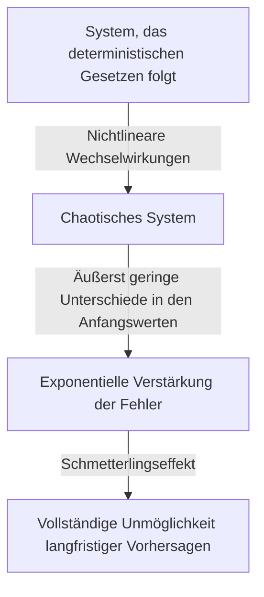

## 1. Einleitung: Was ist der Schmetterlingseffekt?

„Kann der Flügelschlag eines Schmetterlings in Brasilien einen Tornado in Texas auslösen?"

Diese fesselnde und geheimnisvolle Frage symbolisiert eines der berühmtesten – und am häufigsten missverstandenen – Konzepte der modernen Wissenschaft: den **Schmetterlingseffekt** (Butterfly Effect). Der Schmetterlingseffekt ist ein Kernkonzept der **Chaostheorie** (Chaos Theory), einem Forschungsgebiet der Meteorologie, Physik, Mathematik und anderer Disziplinen. Er beschreibt das Phänomen, dass „winzige Unterschiede in den Anfangsbedingungen sich im Laufe der Zeit exponentiell verstärken und letztendlich entscheidende Unterschiede im zukünftigen Zustand bewirken."

In unserem Alltag neigen wir intuitiv dazu, ein proportionales Verhältnis zwischen Ursache und Wirkung anzunehmen – eine lineare Weltanschauung, in der kleine Änderungen kleine Ergebnisse und große Änderungen große Ergebnisse hervorbringen. Viele Phänomene in der Natur verhalten sich jedoch entgegen dieser Intuition höchst nichtlinear. Eine winzige Schwankung kann enorme Veränderungen hervorrufen. Die Chaostheorie liefert den mathematischen Rahmen, um die verborgene Ordnung hinter solchen scheinbar ungeordneten und unvorhersagbaren komplexen Phänomenen zu enthüllen.

In diesem Artikel werden wir die Chaostheorie und den Schmetterlingseffekt umfassend erläutern – von ihrem historischen Hintergrund und den mathematischen Grundlagen über die tiefen Verbindungen zur fraktalen Geometrie bis hin zu den vielfältigen Anwendungen in der modernen Gesellschaft. Begeben wir uns auf eine Reise, um zu entdecken, warum die Zukunft unvorhersagbar ist und welche Schönheit sich in dieser Unvorhersagbarkeit verbirgt.

---

## 2. Historischer Hintergrund: Von Poincaré zu Lorenz

Die Keime der Chaostheorie lassen sich bis zu den Forschungen des großen französischen Mathematikers Henri Poincaré am Ende des 19. Jahrhunderts zurückverfolgen. Damals war eines der größten Probleme der Physik das „Dreikörperproblem" – die Vorhersage der Bewegung dreier Himmelskörper, wie Sonne, Erde und Mond, die aufeinander Gravitationskräfte ausüben, basierend auf der Newtonschen Mechanik.

Bei seiner eingehenden Untersuchung dieses Problems entdeckte Poincaré, dass die Bewegung von Himmelskörpern außerordentlich komplex werden kann. Er zeigte mathematisch die Möglichkeit auf, dass unmessbar kleine Fehler in den Anfangspositionen oder -geschwindigkeiten sich im Laufe der Zeit verstärken und die endgültigen Bahnen völlig verändern können. Dies war praktisch die erste Entdeckung chaotischen Verhaltens – die Erkenntnis, dass selbst deterministische Systeme (Systeme, deren Gesetze vollständig bekannt sind) langfristig unvorhersagbar werden können. Aufgrund der Grenzen der damaligen mathematischen Methoden und der Rechenleistung (fehlende Computer) blieb diese bahnbrechende Entdeckung jedoch über mehrere Jahrzehnte weitgehend unerforscht.

Die Situation änderte sich dramatisch in den 1960er Jahren. Edward Lorenz, Meteorologe am Massachusetts Institute of Technology (MIT), simulierte atmosphärische Konvektion mit einem frühen Computer. Er hatte einen Satz einfacher nichtlinearer Differentialgleichungen erstellt, um Variablen wie Temperatur, Druck und Windgeschwindigkeit zu berechnen, und ließ die Berechnungen auf dem Computer laufen.

Eines Tages versuchte Lorenz, eine Simulation von einem Zwischenpunkt aus neu zu starten. Er gab Werte aus einem Ausdruck erneut ein, verwendete aber statt des intern vom Computer gespeicherten 6-stelligen Präzisionswerts „0,506127" den auf dem Ausdruck gedruckten gerundeten 3-stelligen Wert „0,506."

Als Lorenz von seiner Kaffeepause zurückkehrte, erwartete ihn ein erstaunlicher Anblick. Die fortgesetzte Simulation stimmte in den ersten Schritten noch mit den früheren Ergebnissen überein, begann aber bald, völlig andere Wettermuster zu zeichnen. Ein winziger Unterschied im Anfangswert von nur 0,000127 hatte ein völlig anderes Wetterergebnis erzeugt. Dies war der Moment der Entdeckung des Phänomens, das Lorenz später als **Empfindliche Abhängigkeit von den Anfangsbedingungen** (Sensitive dependence on initial conditions) bezeichnete und das weltweit als Schmetterlingseffekt bekannt werden sollte.

---

## 3. Mathematische Grundlagen: Nichtlineare dynamische Systeme und die Lorenz-Gleichungen

Um die Chaostheorie mathematisch zu verstehen, muss man die Konzepte der **Dynamischen Systeme** und der **Nichtlinearität** erfassen.

Ein dynamisches System ist ein mathematisches Modell eines Systems, dessen Zustand sich im Laufe der Zeit ändert. Der zukünftige Zustand des Systems wird vollständig durch seinen aktuellen Zustand und die deterministischen Gesetze, die es regieren (üblicherweise Differentialgleichungen oder Differenzengleichungen), bestimmt. Entscheidend ist, dass die Gesetze selbst keinerlei stochastische Elemente enthalten – keine Zufälligkeit wie beim Würfeln.

Dynamische Systeme werden grob in lineare und nichtlineare Systeme unterteilt. In linearen Systemen sind Ursache und Wirkung proportional, und das Superpositionsprinzip gilt: „Die Summe der Teile entspricht dem Ganzen." Diese sind mathematisch vergleichsweise leicht zu lösen und vorherzusagen. In nichtlinearen Systemen hingegen werden Variablen miteinander multipliziert oder es existieren Rückkopplungsschleifen, wodurch das proportionale Verhältnis zwischen Ursache und Wirkung zusammenbricht. Sie zeigen ein Verhalten, bei dem „die Summe der Teile nicht dem Ganzen entspricht", was äußerst komplexe Phänomene hervorruft. Chaos tritt ausschließlich in nichtlinearen Systemen auf.

Die berühmtesten nichtlinearen gekoppelten Differentialgleichungen, die Chaos erzeugen und von Edward Lorenz aus einem atmosphärischen Konvektionsmodell abgeleitet wurden, sind die **Lorenz-Gleichungen**. Sie bestehen aus drei Variablen ( $x, y, z$ ) und drei Parametern ( $\sigma, \rho, \beta$ ):

$$
\frac{dx}{dt} = \sigma (y - x)
$$

$$
\frac{dy}{dt} = x (\rho - z) - y
$$

$$
\frac{dz}{dt} = x y - \beta z
$$

Dabei hat jede Variable eine physikalische Bedeutung:
- $x$ repräsentiert die Intensität der Konvektion (Rotationsgeschwindigkeit der Flüssigkeit)
- $y$ repräsentiert den Temperaturunterschied zwischen Aufströmung und Abströmung
- $z$ repräsentiert die Abweichung des vertikalen Temperaturprofils von der Linearität
- $\sigma$ (Prandtl-Zahl), $\rho$ (Rayleigh-Zahl) und $\beta$ (Seitenverhältnis des Systems) sind Parameter.

Als Parameterwerte, die typisches chaotisches Verhalten zeigen, wählte Lorenz $\sigma = 10, \rho = 28, \beta = 8/3$. Obwohl dieses Gleichungssystem deterministisch ist, wiederholt die Lösung niemals einen vergangenen Zustand und zeichnet eine unendlich komplexe Trajektorie. Die nichtlinearen Terme $xz$ und $xy$ in den Gleichungen spielen die entscheidende Rolle bei der Erzeugung von Chaos.

---

## 4. Phasenraum und Seltsame Attraktoren

Ein leistungsfähiges Werkzeug zum visuellen Verständnis des Verhaltens dynamischer Systeme ist der **Phasenraum**. Der Phasenraum ist ein mehrdimensionaler Raum, der alle denkbaren Zustände eines Systems darstellen kann. Der aktuelle Zustand des Systems wird als „ein einzelner Punkt" in diesem Phasenraum dargestellt. Wenn die Zeit fortschreitet und sich der Zustand des Systems ändert, wird die Bewegung des Punktes durch den Phasenraum als „Trajektorie" gezeichnet.

In vielen realen Systemen mit Dissipation (Eigenschaften, die zu Energieverlust führen, wie Reibung oder Luftwiderstand) pendelt sich das System nach ausreichender Zeit schließlich in einem bestimmten Zustand (einem Punkt) oder einem periodischen Zustand (einer geschlossenen Schleife) ein. Dieses endgültige Ziel wird als **Attraktor** (etwas, das anzieht) bezeichnet. Zum Beispiel kommt die Bewegung eines Pendels durch Luftwiderstand schließlich am tiefsten Punkt zur Ruhe; in diesem Fall ist der Attraktor ein „einzelner Punkt (Fixpunkt)." Für Systeme, die periodische Bewegungen wiederholen, wie der Herzschlag, ist der Attraktor ein „Grenzzyklus (geschlossene Kurve)."

In chaotischen Systemen wie den Lorenz-Gleichungen tritt jedoch eine völlig andere Art von Attraktor auf – der **Seltsame Attraktor** (Strange Attractor).

Wenn der Lorenz-Attraktor im dreidimensionalen Phasenraum dargestellt wird, entsteht eine atemberaubend schöne und komplexe Struktur, die an einen Schmetterling mit ausgebreiteten Flügeln oder ein Augenpaar erinnert. Dieser seltsame Attraktor hat die folgenden bemerkenswerten Eigenschaften:

1. **Beschränktheit**: Die Trajektorie fliegt niemals ins Unendliche; sie bleibt stets innerhalb eines bestimmten Bereichs des Attraktors.
2. **Aperiodizität**: Die Trajektorie kreuzt niemals ihren eigenen vergangenen Pfad oder wiederholt exakt denselben Weg. Sie zeichnet für immer neue Pfade.
3. **Empfindliche Abhängigkeit von den Anfangsbedingungen**: Zwei Trajektorien, die von extrem nahen Anfangspunkten auf dem Attraktor starten, werden im Laufe der Zeit an völlig verschiedene Stellen innerhalb des Attraktors gezogen.

Obwohl die Trajektorie in einem endlichen Volumen eingeschlossen ist, kreuzt sie sich niemals selbst (eine Kreuzung würde die deterministische Prämisse verletzen, dass „derselbe Zustand zur selben Zukunft führt"). Um diese Bedingung zu erfüllen, muss der Raum unendlich „gefaltet" werden. Dieser wiederholte Prozess des „Streckens und Faltens" (ähnlich dem Kneten von Brotteig) ist die Essenz des Chaos und erzeugt die komplexe Struktur seltsamer Attraktoren.

---

## 5. Die Logistische Abbildung und Bifurkationsdiagramme

Ein weiteres wichtiges mathematisches Modell zum Verständnis der Chaostheorie in ihrer einfachsten Form ist die **Logistische Abbildung** (Logistic Map). Sie ist eine einfache quadratische Differenzengleichung, die die Populationsdynamik modelliert (zum Beispiel die jährliche Veränderung der Kaninchenanzahl auf einer Insel).

$$
x_{n+1} = r x_n (1 - x_n)
$$

Dabei gilt:
- $x_n$ repräsentiert die Population in der $n$-ten Generation (als Anteil der maximalen Tragfähigkeit der Umgebung, im Bereich $0 \le x_n \le 1$).
- $x_{n+1}$ ist die Population der nächsten Generation.
- $r$ ist ein Parameter, der die Reproduktionsrate darstellt (typischerweise $0 \le r \le 4$).

Diese Gleichung ist sehr einfach, zeigt aber bei Variation des Parameters $r$ erstaunlich vielfältiges und komplexes Verhalten.

- $0 < r < 1$: Die Population stirbt letztendlich aus, und $x$ konvergiert gegen 0.
- $1 < r < 3$: Die Population konvergiert zu einem festen Wert (Fixpunkt) und stabilisiert sich.
- In der Nähe von $r = 3$: Der Fixpunkt wird instabil, und die Population beginnt, zwischen zwei verschiedenen Werten zu alternieren. Dies wird als **Periodenverdopplungsbifurkation** bezeichnet.
- Bei weiterer Erhöhung von $r$ treten rasch Bifurkationen auf, wobei sich die Periode auf 4, 8, 16 usw. verdoppelt.
- Jenseits von $r \approx 3,56995$ (dem Feigenbaum-Punkt) bricht die Periodizität vollständig zusammen, und die Population nimmt völlig unvorhersagbare Werte an. Dies ist der Zustand des **Chaos**.

Ein Diagramm, das den endgültigen Zustand (Attraktor) des Systems in Abhängigkeit von der Änderung von $r$ aufträgt, wird als **Bifurkationsdiagramm** bezeichnet. Die horizontale Achse stellt den Parameter $r$ dar, die vertikale Achse die endgültigen Werte von $x$.

Bei Betrachtung des Bifurkationsdiagramms zeigen sich „Fenster" – Bereiche innerhalb der chaotischen Domäne, in denen plötzlich Ordnung wiederkehrt (zum Beispiel ein Bereich der Periode 3). Bemerkenswert ist, dass beim Vergrößern von Teilen des Bifurkationsdiagramms dasselbe Gesamtmuster unendlich oft erscheint – Selbstähnlichkeit. Die Tatsache, dass eine einfache quadratische Gleichung eine solch reiche Struktur enthält, versetzte die mathematische Gemeinschaft in Erstaunen.

---

## 6. Ljapunow-Exponenten: Quantifizierung von Chaos

Die Kennzahl zur strengen mathematischen Quantifizierung der „Empfindlichkeit gegenüber Anfangsbedingungen" eines chaotischen Systems ist der **Ljapunow-Exponent** (Lyapunov Exponent).

Betrachten wir zwei Trajektorien, die von extrem nahen Anfangszuständen im Phasenraum starten (Abstand $\delta Z_0$) und sich im Laufe der Zeit $t$ auf einen Abstand $\delta Z(t)$ voneinander entfernen. In einem chaotischen System wächst dieser Abstand im Durchschnitt exponentiell.

$$
|\delta Z(t)| \approx e^{\lambda t} |\delta Z_0|
$$

Dabei ist $\lambda$ (Lambda) der Ljapunow-Exponent.
Der Ljapunow-Exponent gibt die durchschnittliche Rate an, mit der benachbarte Trajektorien auseinanderlaufen (oder zusammenlaufen).

- $\lambda < 0$: Trajektorien nähern sich einander an und konvergieren zu einem Fixpunkt oder Grenzzyklus (nicht chaotisch).
- $\lambda = 0$: Der Abstand zwischen den Trajektorien bleibt konstant (z. B. konservative Systeme).
- $\lambda > 0$: Trajektorien laufen exponentiell auseinander. Dies ist der **entscheidende Indikator für Chaos**.

In mehrdimensionalen dynamischen Systemen gibt es so viele Ljapunow-Exponenten (das Ljapunow-Spektrum) wie Dimensionen. Wenn mindestens ein positiver Ljapunow-Exponent existiert, wird das System als chaotisch definiert. Je größer der positive Ljapunow-Exponent, desto schneller verstärken sich anfängliche winzige Fehler, was die vorhersagbare Zeitskala (Ljapunow-Zeit) verkürzt. Dies ist der fundamentale mathematische Grund, warum Wettervorhersagen für einige Tage einigermaßen genau sind, aber Wochen im Voraus völlig unvorhersagbar werden.

---

## 7. Die Beziehung zwischen Fraktalen und Chaos

Unverzichtbar für jede Diskussion über die Chaostheorie ist die **Fraktale** Geometrie, die vom Mathematiker Benoit Mandelbrot vorgeschlagen wurde. Ein Fraktal ist „eine Form, bei der sich, egal wie weit man hineinzoomt, stets dieselbe komplexe Struktur (Selbstähnlichkeit) unendlich wiederholt." Repräsentative Beispiele sind die Mandelbrot-Menge und die Koch-Kurve.

Chaos und Fraktale mögen auf den ersten Blick unterschiedliche Konzepte zu sein, sind aber tatsächlich zwei Seiten derselben Medaille. Wenn man den Querschnitt eines seltsamen Attraktors aufschneidet und im Detail untersucht, tritt eine unendlich geschichtete Struktur zutage, die fraktale Geometrie offenbart.

Die „Streck- und Falt"-Dynamik im Phasenraum eines chaotischen Systems erzeugt als geometrisches Ergebnis fraktale Formen. Eine wichtige Eigenschaft von Fraktalen ist, dass sie eine nicht-ganzzahlige „fraktale Dimension" besitzen. Zum Beispiel kann eine Form, die komplexer als eine 1-dimensionale Linie ist und den Raum füllt, aber eine 2-dimensionale Ebene nicht erreicht, eine Dimension von 1,26 haben. Seltsame Attraktoren sind ebenfalls fraktale Strukturen mit fraktionalen Dimensionen.

Wenn Chaos die „komplexe Dynamik, die sich im Laufe der Zeit entfaltet" ist, dann sind Fraktale die „geometrischen Fußabdrücke, die diese Dynamik im Raum hinterlässt." Viele Naturphänomene – Riaküsten, Baumverzweigungen, Blutgefäßnetze, Wolkenformen – weisen fraktale Strukturen auf, und es wird angenommen, dass chaotische nichtlineare Dynamik ihren Entstehungsprozessen zugrunde liegt.

---

## 8. Anwendungen in der realen Welt: Von der Meteorologie bis zur Ökonomie

Die Chaostheorie ist weit mehr als eine mathematische Spielerei. Die universellen Eigenschaften der Empfindlichkeit gegenüber Anfangsbedingungen und nichtlinearer Dynamik haben weitreichende Anwendungen in allen Bereichen jenseits der Physik hervorgebracht.

### 8.1 Meteorologie und Klimawandel
Die Meteorologie, Schauplatz von Lorenz' Entdeckung, ist eines der Gebiete, die am meisten von der Chaostheorie profitiert haben. Die Atmosphäre wird von komplexen nichtlinearen Gleichungen der Strömungsmechanik und Thermodynamik beherrscht und ist von Natur aus chaotisch. Heutzutage ist statt einer einzelnen Vorhersage die „Ensemblevorhersage" die Standardmethode – dabei werden mehrere Simulationen gleichzeitig mit absichtlich kleinen Störungen der Anfangswerte durchgeführt. Dies ermöglicht eine probabilistische Bewertung der Vorhersageunsicherheit und ein Verständnis dafür, wie weit in die Zukunft zuverlässige Vorhersagen möglich sind.

### 8.2 Medizin und Biologie
Auch menschliche biologische Rhythmen stehen in engem Zusammenhang mit Chaos. So ist beispielsweise die Herzfrequenzvariabilität eines gesunden Herzens weder vollkommen regelmäßig noch vollkommen zufällig; sie weist chaotische fraktale Eigenschaften auf. Bei Herzpatienten und älteren Menschen kann der Herzschlag entweder zu regelmäßig oder vollkommen zufällig werden. Der Verlust chaotischer Variabilität wird als wichtiges Zeichen (Biomarker) für einen sich verschlechternden Gesundheitszustand untersucht. Nichtlineare Dynamik ist auch für die Analyse von Hirnströmen und die Modellierung der Ausbreitung von Infektionskrankheiten (wie das SIR-Modell in der Epidemiologie) unverzichtbar.

### 8.3 Ökonomie und Finanzmärkte
Finanzmärkte wie Aktien- und Devisenmärkte sind äußerst komplexe nichtlineare Systeme, in denen Psychologie und Handlungen unzähliger Investoren miteinander interagieren. Die traditionelle Ökonomie nahm an, dass Märkte effizient sind und Preise einem Random Walk folgen (zufällige Bewegungen mit Normalverteilung), aber in der Realität treten extreme Ereignisse wie Crashs und Blasen weitaus häufiger auf als von der Normalverteilung vorhergesagt (das Fat-Tail-Phänomen). Durch die Anwendung von Chaostheorie und Fraktalen (wie die von Mandelbrot vorgeschlagenen Multifraktal-Modelle) versuchen Forscher, die nichtlinearen Strukturen in Preisschwankungen, Langzeitgedächtniseffekte und das Risiko von Blasenkollapsen genauer zu modellieren, um das Risikomanagement zu verbessern.

### 8.4 Ingenieurwesen und Steuerung
Chaos ist auch ein wichtiges Konzept im Ingenieurwesen. Chaotische Phänomene werden in vielen Systemen beobachtet: Schwingungen von Flugzeugtragflächen (Flattern), Synchronisation nichtlinearer Oszillatoren in elektrischen Schaltkreisen, Störungen der Laserausgabe und mehr. Traditionell wurde Chaos als etwas angesehen, das es zu vermeiden galt – unvorhersagbares Rauschen, das Systeme destabilisiert. Heute jedoch wurden Techniken entwickelt, die als „Chaoskontrolle" bekannt sind und ein System mit nur geringem Energieaufwand geschickt von einem chaotischen Zustand in einen gewünschten periodischen Zustand überführen und stabilisieren. Auch die Anwendung der pseudozufälligen Natur chaotischer Signale für verschlüsselte Kommunikation (chaosbasierte Kryptographie) wird erforscht.

---

## 9. Philosophische Implikationen: Determinismus und Vorhersagbarkeit

Das Aufkommen der Chaostheorie brachte einen fundamentalen Paradigmenwechsel in der Wissenschaftsphilosophie – insbesondere hinsichtlich unserer Weltanschauung über „Determinismus" und „Vorhersagbarkeit".

Der französische Mathematiker Pierre-Simon Laplace des 18. Jahrhunderts schlug folgendes Gedankenexperiment vor: „Wenn eine Intelligenz die genaue Position und den Impuls jedes Atoms im Universum kennen und die Fähigkeit besäße, sie zu analysieren, dann wäre für diese Intelligenz weder die Zukunft noch die Vergangenheit ungewiss – die gesamte Zeitlinie läge offen wie die Gegenwart." Diese hypothetische Intelligenz ist als **Laplacescher Dämon** bekannt und symbolisierte das robuste deterministische Weltbild der klassischen Mechanik.

Der Determinismus besagt, dass „wenn der aktuelle Zustand vollständig bestimmt ist, die Zukunft durch die physikalischen Gesetze eindeutig festgelegt wird." Die von der Chaostheorie behandelten Gleichungen (wie die Lorenz-Gleichungen) sind rein deterministische Gleichungen ohne jegliche probabilistischen Elemente. Im Prinzip sollte daher der Laplacesche Dämon die Zukunft eines chaotischen Systems perfekt vorhersagen können.

Die Chaostheorie legt jedoch gnadenlos die **Grenzen der Vorhersagbarkeit** in der realen Welt offen. In Wirklichkeit ist es unmöglich, jeden Anfangszustand des Universums mit „unendlicher Präzision (Fehler gleich Null)" zu messen. Selbst ohne Berücksichtigung der Unschärferelation der Quantenmechanik haben unsere Beobachtungsfähigkeiten stets endliche Grenzen.

In chaotischen Systemen verstärkt sich selbst der kleinste Beobachtungsfehler im Laufe der Zeit exponentiell und verschlingt schließlich das gesamte System. Mit anderen Worten wurde klar, dass „deterministisch sein" und „vorhersagbar sein" völlig verschiedene Konzepte sind. Die Chaostheorie hat den Laplaceschen Dämon begraben und der Menschheit die tiefgreifende Wahrheit gelehrt, dass „selbst wenn die Gesetze vollständig bekannt sind, die Zukunft von Natur aus unvorhersagbar sein kann."

Dieser Paradigmenwechsel präsentiert eine neue Weltanschauung: „Unsere Welt ist komplex und unvorhersagbar, doch dahinter verbirgt sich eine schöne deterministische mathematische Struktur." Indem wir auf perfekte Vorhersagen verzichten und stattdessen die Formen von Attraktoren untersuchen oder probabilistische Verteilungen verstehen, wurde ein Weg eröffnet, die „großräumige Ordnung" zu begreifen, die im Chaos verborgen liegt.

---

## 10. Fazit

In diesem Artikel haben wir uns eingehend mit dem Schmetterlingseffekt befasst – bei dem winzige Unterschiede in den Anfangsbedingungen zu völlig unterschiedlichen Ergebnissen führen – und der Chaostheorie, die ihn umfasst.

Von Poincarés Intuition über Lorenz' zufällige computergestützte Entdeckung hat sich die Chaostheorie zu einem gewaltigen Gebiet entwickelt, das Mathematik und Physik umspannt. Die wunderschönen Trajektorien seltsamer Attraktoren, die von nichtlinearen Gleichungen gezeichnet werden, die unendliche Selbstähnlichkeit der logistischen Abbildung und die Quantifizierung der Unvorhersagbarkeit durch Ljapunow-Exponenten – ihre mathematischen Grundlagen sind außerordentlich verfeinert und voller intellektueller Überraschungen.

Die Chaostheorie hat uns ein leistungsfähiges Werkzeug zum Verständnis der komplexen Phänomene geliefert, die uns umgeben – von den Grenzen der Wettervorhersage über wirtschaftliche Schwankungen und den Herzschlag bis hin zur Evolution des Lebens. Sie lehrt uns, dass die Natur keineswegs eine einfache Uhrwerkmechanik ist, sondern ein dynamisches System voller Unvorhersagbarkeit und Kreativität.

Deterministisch und doch unvorhersagbar – diese scheinbar widersprüchliche Eigenschaft ist die größte Faszination der Chaostheorie. Die Tatsache, dass die Zukunft vollständig festgelegt und dennoch für niemanden (nicht einmal die leistungsfähigsten Computer) erkennbar ist, macht unser Verständnis des Universums bescheidener und zugleich reicher. Die nichtlineare Welt, die von Chaos und Fraktalen gewoben wird, wird Wissenschaftler weiterhin faszinieren und zu neuen Entdeckungen inspirieren.

