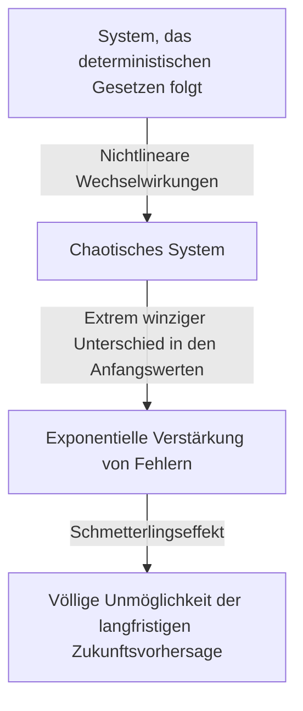

## 1. Einführung: Was ist der Schmetterlingseffekt?

"Kann der Flügelschlag eines Schmetterlings in Brasilien einen Tornado in Texas auslösen?"

Diese faszinierende und mysteriöse Frage symbolisiert den **Schmetterlingseffekt**, eines der berühmtesten und am meisten missverstandenen Konzepte der modernen Wissenschaft. Der Schmetterlingseffekt ist ein Kernkonzept der **Chaostheorie**, die in Bereichen wie Meteorologie, Physik und Mathematik untersucht wird. Er bezieht sich auf das Phänomen, dass „sich ein winziger Unterschied in den Anfangsbedingungen im Laufe der Zeit exponentiell verstärkt, was zu einem entscheidenden Unterschied im zukünftigen [Zustand](https://kenji.blog/de/p/state-management-history-redux-context-recoil-zustand/) führt“.

In unserem täglichen Leben neigen wir intuitiv zu der Annahme, dass Ursachen und Wirkungen proportional sind. Mit anderen Worten, es ist ein lineares Weltbild, in dem kleine Veränderungen kleine Ergebnisse bringen und große Veränderungen große Ergebnisse bringen. Entgegen dieser Intuition verhalten sich jedoch viele Phänomene in der Natur höchst nichtlinear. Eine leichte Schwankung kann gewaltige Veränderungen hervorrufen. Die Chaostheorie bietet einen mathematischen Rahmen, um die verborgene Ordnung hinter diesen scheinbar ungeordneten und unvorhersehbaren komplexen Phänomenen zu entschlüsseln.

In diesem Artikel werden wir die Chaostheorie und den Schmetterlingseffekt von ihrem historischen Hintergrund über ihre mathematischen Grundlagen, tiefe Verbindungen zur fraktalen Geometrie bis hin zu ihren vielfältigen Anwendungen in der modernen Gesellschaft ausführlich erläutern. Begeben wir uns auf eine Reise, um zu erforschen, warum die Zukunft unvorhersehbar ist und welche Art von Schönheit sich in dieser Unvorhersehbarkeit verbirgt.

---

## 2. Historischer Hintergrund: Von [Poincaré](https://kenji.blog/de/p/poincare/) zu Lorenz

Die Keime der Chaostheorie lassen sich bis zu den Forschungen des großen französischen Mathematikers [Henri Poincaré](https://kenji.blog/de/p/poincare/) aus dem 19. Jahrhundert zurückverfolgen. Zu dieser Zeit war eine der größten Herausforderungen in der Physik das "Dreikörperproblem". Dies war das Problem, die Bewegung von drei Himmelskörpern, wie Sonne, Erde und Mond, vorherzusagen, die auf der Grundlage der Newtonschen Mechanik Gravitationskräfte aufeinander ausüben.

Als [Poincaré](https://kenji.blog/de/p/poincare/) dieses Problem eingehend untersuchte, entdeckte er, dass die Bewegung von Himmelskörpern extrem komplex werden konnte. Er schlug mathematisch vor, dass unermesslich kleine Fehler in den Anfangspositionen oder Geschwindigkeiten im Laufe der Zeit wachsen könnten, was letztendlich zu völlig unterschiedlichen Trajektorien der Himmelskörper führen würde. Dies war praktisch die erste Entdeckung von chaotischem Verhalten und zeigte, dass selbst in einem deterministischen System (einem System, in dem die Gesetze vollständig bekannt sind) eine langfristige Vorhersage manchmal unmöglich werden könnte. Aufgrund der Einschränkungen der mathematischen Methoden und der Rechenleistung (das Fehlen von Computern) zu dieser Zeit wurde diese bahnbrechende Entdeckung jedoch jahrzehntelang nicht eingehend untersucht.

Die Situation änderte sich in den 1960er Jahren dramatisch. Edward Lorenz, ein Meteorologe am Massachusetts Institute of Technology (MIT), simulierte die atmosphärische Konvektion mit einem frühen Computer. Er erstellte eine Reihe einfacher nichtlinearer Differentialgleichungen, um Variablen wie Temperatur, Druck und Windgeschwindigkeit zu berechnen, und berechnete die Werte mit einem Computer.

Eines Tages versuchte Lorenz, eine Simulation aus der Mitte eines vorherigen Laufs neu zu starten. Er gab die Zahlen von einem Ausdruck erneut ein, tippte aber fälschlicherweise "0.506" – ein auf drei Dezimalstellen gerundeter Wert aus dem Ausdruck – anstelle des internen sechsstelligen Präzisionswerts von "0.506127" ein, der vom Computer gehalten wurde.

Als Lorenz von seiner Kaffeepause zurückkehrte, erwartete ihn ein erstaunlicher Anblick. Die Ergebnisse der neu gestarteten Simulation stimmten in den ersten Schritten zunächst mit dem vorherigen Lauf überein, begannen dann aber bald, ein völlig anderes Wettermuster zu zeichnen. Ein winziger anfänglicher Unterschied von nur 0,000127 führte zu einem völlig anderen zukünftigen Wetterszenario. Dies war der Moment der Entdeckung eines Phänomens, das Lorenz später **Sensible Abhängigkeit von den Anfangsbedingungen** nannte und das der Welt als Schmetterlingseffekt bekannt werden sollte.

---

## 3. Mathematische Grundlagen: Nichtlineare dynamische Systeme und Lorenz-Gleichungen

Um die Chaostheorie mathematisch zu verstehen, ist es notwendig, die Konzepte von **Dynamischen Systemen** und **Nichtlinearität** zu erfassen.

Ein dynamisches System ist ein mathematisches Modell eines Systems, dessen [Zustand](https://kenji.blog/de/p/state-management-history-redux-context-recoil-zustand/) sich im Laufe der Zeit ändert. Der zukünftige Zustand des Systems wird vollständig durch seinen aktuellen Zustand und die deterministischen Gesetze (normalerweise Differential- oder Differenzengleichungen), die das System regeln, bestimmt. Der entscheidende Punkt hierbei ist, dass die Gesetze selbst absolut keine probabilistischen Elemente enthalten (Zufall, wie das Werfen eines Würfels).

Dynamische Systeme werden grob in lineare und nichtlineare Systeme eingeteilt. In einem linearen System sind Ursache und Wirkung proportional, und das Superpositionsprinzip gilt, wonach "die Summe der Teile gleich dem Ganzen ist". Diese sind mathematisch relativ einfach zu lösen und Vorhersagen sind unkompliziert. Andererseits werden in nichtlinearen Systemen Variablen miteinander multipliziert oder es existieren Rückkopplungsschleifen, was die proportionale Beziehung zwischen Ursache und Wirkung bricht. Es weist ein Verhalten auf, bei dem "die Summe der Teile vom Ganzen abweicht", was extrem komplexe Phänomene verursacht. Chaos tritt nur in nichtlinearen Systemen auf.

Die berühmteste Menge von nichtlinearen Differentialgleichungen, die Chaos erzeugen und von Edward Lorenz aus einem atmosphärischen Konvektionsmodell abgeleitet wurden, sind die **Lorenz-Gleichungen**. Sie bestehen aus den folgenden drei Variablen ($x, y, z$) und drei Parametern ($\sigma, \rho, \beta$).

$$
\frac{dx}{dt} = \sigma (y - x)
$$

$$
\frac{dy}{dt} = x (\rho - z) - y
$$

$$
\frac{dz}{dt} = x y - \beta z
$$

Hierbei hat jede Variable eine physikalische Bedeutung:
- $x$ ist die Konvektionsrate (Rotationsgeschwindigkeit der Flüssigkeit)
- $y$ ist die horizontale Temperaturschwankung zwischen aufsteigenden und absteigenden Strömungen
- $z$ ist die Abweichung des vertikalen Temperaturprofils von der Linearität
- $\sigma$ (Prandtl-Zahl), $\rho$ (Rayleigh-Zahl) und $\beta$ (Seitenverhältnis des Systems) sind Parameter.

Als Parameterwerte, die ein typisches chaotisches Verhalten zeigen, wählte Lorenz $\sigma = 10, \rho = 28, \beta = 8/3$. Obwohl dieses Gleichungssystem deterministisch ist, wiederholen die Lösungen niemals vergangene Zustände und zeichnen weiterhin unendlich komplexe Trajektorien. Die nichtlinearen Terme in den Gleichungen, wie $xz$ und $xy$, spielen eine entscheidende Rolle bei der Erzeugung von Chaos.

---

## 4. Phasenraum und seltsame Attraktoren

Ein mächtiges Werkzeug, um das Verhalten dynamischer Systeme visuell zu verstehen, ist der **Phasenraum**. Der Phasenraum ist ein mehrdimensionaler Raum, der in der Lage ist, alle möglichen Zustände eines Systems darzustellen. Der aktuelle Zustand des Systems wird als "einzelner Punkt" in diesem Phasenraum dargestellt. Im Verlauf der Zeit wird der sich ändernde Zustand des Systems als eine "Trajektorie" dargestellt, die von dem Punkt gezeichnet wird, der sich durch den Phasenraum bewegt.

In vielen realen Systemen mit Dissipation (die Eigenschaft, Energie zu verlieren, wie Reibung oder Luftwiderstand) wird sich das System nach einer ausreichenden Zeitspanne schließlich in einem bestimmten Zustand (einem Punkt) oder einem periodischen Zustand (einer geschlossenen Schleife) niederlassen. Dieser endgültige Ort der Niederlassung wird als **Attraktor** bezeichnet. Beispielsweise kommt die Bewegung eines Pendels aufgrund des Luftwiderstands schließlich an seinem tiefsten Punkt zur Ruhe. Der Attraktor in diesem Fall ist ein "einzelner Punkt (Fixpunkt)". Der Attraktor für ein System, das periodische Bewegungen wiederholt, wie ein Herzschlag, ist ein "Grenzzyklus (geschlossene Kurve)".

In chaotischen Systemen wie den Lorenz-Gleichungen entsteht jedoch eine völlig andere Art von Attraktor. Dies ist der **Seltsame Attraktor**.

Wenn der Lorenz-Attraktor in einem 3D-Phasenraum dargestellt wird, offenbart er eine atemberaubend schöne und komplexe Struktur, die einem Schmetterling mit ausgebreiteten Flügeln oder zwei Augen ähnelt. Dieser seltsame Attraktor weist die folgenden bemerkenswerten Merkmale auf:

1. **Beschränktheit**: Die Trajektorie fliegt nicht ins Unendliche ab; sie verbleibt immer in einem bestimmten Bereich des Attraktors.
2. **Aperiodizität**: Die Trajektorie kreuzt niemals ihren eigenen vergangenen Weg oder wiederholt genau dieselbe Route. Sie zeichnet ewig weiter neue Wege nach.
3. **Sensible Abhängigkeit von den Anfangsbedingungen**: Trajektorien, die von zwei extrem nahen Anfangspunkten auf dem Attraktor ausgehen, werden im Laufe der Zeit weit voneinander an völlig unterschiedliche Orte innerhalb des Attraktors gezogen.

Obwohl die Trajektorien in einem endlichen Volumen eingeschlossen sind, sind sie so eingeschränkt, dass sie sich niemals kreuzen (denn eine Kreuzung würde die deterministische Prämisse verletzen, dass "derselbe Zustand in dieselbe Zukunft führt"). Um dies zu erreichen, muss der Raum unendlich "gefaltet" werden. Dieser wiederholte Prozess des "Dehnens" und "Faltens" (wie beim Kneten von Teig) ist das eigentliche Wesen des Chaos und bringt die komplexe Struktur von seltsamen Attraktoren hervor.

---

## 5. Logistische Gleichung und Bifurkationsdiagramm

Ein weiteres wichtiges mathematisches Modell, um die Chaostheorie auf einfachste Weise zu verstehen, ist die **Logistische Gleichung**. Dies ist eine einfache quadratische Differenzengleichung, die die Fluktuation einer biologischen Population modelliert (beispielsweise die jährliche Veränderung der Anzahl von Kaninchen auf einer Insel).

$$
x_{n+1} = r x_n (1 - x_n)
$$

Hierbei ist,
- $x_n$ die Population in der $n$-ten Generation (wobei ein Wert im Bereich von $0 \le x_n \le 1$ als Verhältnis der maximalen Tragfähigkeit der Umgebung angenommen wird).
- $x_{n+1}$ die Population der nächsten Generation.
- $r$ ein Parameter, der die Reproduktionsrate darstellt (normalerweise $0 \le r \le 4$).

Obwohl diese Gleichung extrem einfach ist, bewirkt eine Änderung des Wertes des Parameters $r$, dass sie ein erstaunlich vielfältiges und komplexes Verhalten zeigt:

- $0 < r < 1$: Die Population stirbt schließlich aus und $x$ konvergiert gegen 0.
- $1 < r < 3$: Die Population konvergiert gegen einen bestimmten konstanten Wert (Fixpunkt) und stabilisiert sich.
- Um $r = 3$: Der Fixpunkt wird instabil und die Population beginnt, zwischen zwei verschiedenen Werten zu wechseln. Dies wird als **Periodenverdopplungs-Bifurkation** bezeichnet.
- Wenn $r$ weiter zunimmt, treten Bifurkationen, bei denen sich die Periode auf 4, 8, 16 usw. verdoppelt, schnell auf.
- Jenseits von $r \approx 3.56995$ (dem Feigenbaum-Punkt) bricht die Periodizität vollständig zusammen und die Population nimmt völlig unvorhersehbare Werte an. Dies ist der Zustand des **Chaos**.

Das Auftragen des Endzustands (Attraktor) des Systems gegen diese Änderungen von $r$ erzeugt das, was als **Bifurkationsdiagramm** bezeichnet wird. Die horizontale Achse stellt den Parameter $r$ dar und die vertikale Achse repräsentiert die Endwerte von $x$.

Bei Betrachtung des Bifurkationsdiagramms können wir sehen, dass es innerhalb der chaotischen Region "Fenster" gibt, in denen sich die Ordnung plötzlich wiederherstellt (beispielsweise eine Region mit Periode 3). Erstaunlicherweise weist ein Teil dieses Bifurkationsdiagramms, wenn man ihn vergrößert, eine Selbstähnlichkeit auf, bei der genau dasselbe Muster wie die Gesamtstruktur unendlich oft auftritt. Die Tatsache, dass eine einfache quadratische Gleichung eine so reiche Struktur enthält, sandte einen Schock durch die mathematische Gemeinschaft.

---

## 6. Ljapunow-Exponent: Quantifizierung des Chaos

Der Indikator, der zur strikten mathematischen Quantifizierung der in chaotischen Systemen innewohnenden "sensiblen Abhängigkeit von den Anfangsbedingungen" verwendet wird, ist der **Ljapunow-Exponent**.

Betrachten Sie zwei extrem nahe Anfangszustände im Phasenraum (mit einem Abstand, der als $\delta Z_0$ bezeichnet wird) und beobachten Sie, wie sich ihre Trajektorien im Laufe der Zeit $t$ auf einen Abstand $\delta Z(t)$ trennen. Im Falle eines chaotischen Systems dehnt sich dieser Abstand im Durchschnitt exponentiell aus.

$$
|\delta Z(t)| \approx e^{\lambda t} |\delta Z_0|
$$

Hierbei ist $\lambda$ ([Lambda](https://kenji.blog/de/p/serverless-architecture-aws-lambda-cold-start/)) der Ljapunow-Exponent.
Der Ljapunow-Exponent repräsentiert die durchschnittliche Rate, mit der benachbarte Trajektorien sich voneinander trennen (oder sich einander annähern).

- $\lambda < 0$: Trajektorien nähern sich einander an und konvergieren zu einem Fixpunkt oder Grenzzyklus (kein Chaos).
- $\lambda = 0$: Der Abstand zwischen den Trajektorien bleibt konstant (z.B. konservative Systeme).
- $\lambda > 0$: Trajektorien werden exponentiell auseinandergezogen. Dies ist der entscheidende Indikator für **Chaos**.

In einem mehrdimensionalen dynamischen System gibt es so viele Ljapunow-Exponenten wie die Dimensionen des Raumes (das Ljapunow-Spektrum). Wenn mindestens ein positiver Ljapunow-Exponent existiert, ist das System als chaotisch definiert. Je größer der positive Ljapunow-Exponent ist, desto schneller verstärken sich winzige Anfangsfehler, was die Zeitskala verkürzt, über die die Zukunft vorhersehbar ist (Ljapunow-Zeit). Dies ist der fundamentale mathematische Grund, warum Wettervorhersagen einige Tage im Voraus einigermaßen genau sein können, Wochen im Voraus jedoch völlig unvorhersehbar werden.

---

## 7. Die Beziehung zwischen Fraktalen und Chaos

Bei der Erörterung der Chaostheorie darf man die **Fraktale** Geometrie nicht auslassen, die von dem Mathematiker Benoit Mandelbrot vorgeschlagen wurde. Ein Fraktal ist eine Figur, in der "egal wie stark Sie sie vergrößern, eine ähnliche komplexe Struktur (Selbstähnlichkeit), die identisch mit dem Ganzen ist, unendlich oft erscheint". Repräsentative Beispiele sind die Mandelbrot-Menge und die Koch-Schneeflocke.

Chaos und Fraktale mögen auf den ersten Blick wie unterschiedliche Konzepte erscheinen, aber sie sind eigentlich zwei Seiten derselben Medaille. Wenn Sie einen Querschnitt eines seltsamen Attraktors betrachten und ihn genau beobachten, werden Sie eine unendlich geschichtete Struktur vorfinden, was offenbart, dass er eine fraktale Struktur besitzt.

Die Dynamik des "Dehnens und Faltens" im Phasenraum eines chaotischen Systems bringt als geometrisches Ergebnis fraktale Figuren hervor. Eines der wichtigen Merkmale eines Fraktals ist, dass es eine "gebrochene Dimension (fraktale Dimension)" aufweist, die keine ganze Zahl ist. Beispielsweise könnte eine Figur, die komplexer und raumfüllender als eine 1D-Linie ist, aber nicht an eine 2D-Ebene heranreicht, eine Dimension von 1,26 haben. Ein seltsamer Attraktor ist ebenfalls eine fraktale Struktur mit einer gebrochenen Dimension.

Wenn Chaos "komplexe Dynamiken, die im Laufe der Zeit entstehen" ist, dann kann man Fraktale als "die geometrischen Fußabdrücke, die diese Dynamiken im Raum hinterlassen" bezeichnen. Viele Naturphänomene, wie die Formen von Rias-Küsten, die Verzweigung von Bäumen, die Netzwerke von Blutgefäßen und die Formen von Wolken, besitzen fraktale Strukturen, und es wird angenommen, dass chaotische nichtlineare Dynamiken hinter ihren Entstehungsprozessen am Werk sind.

---

## 8. Reale Anwendungen: Von der Meteorologie zur Wirtschaft

Die Chaostheorie ist keine reine mathematische Spielerei. Die universellen Eigenschaften der sensiblen Abhängigkeit von Anfangsbedingungen und der nichtlinearen Dynamik haben vielfältige Anwendungen in allen Bereichen der realen Welt, über die Physik hinaus, mit sich gebracht.

### 8.1 Meteorologie und Klimawandel
Die Meteorologie, die Bühne für Lorenz' Entdeckung, ist eines der Gebiete, das am meisten von der Chaostheorie profitiert hat. Die Atmosphäre wird durch komplexe nichtlineare Gleichungen der Fluiddynamik und Thermodynamik geregelt, was sie von Natur aus chaotisch macht. Heute ist der Mainstream-Ansatz die "Ensemble-Vorhersage", bei der absichtlich leichte Schwankungen in die Anfangswerte eingeführt werden und mehrere Simulationen gleichzeitig ausgeführt werden, anstatt sich auf eine einzige Vorhersage zu verlassen. Dies ermöglicht es Meteorologen, die Vorhersageunsicherheit probabilistisch zu bewerten und zu verstehen, wie weit in die Zukunft zuverlässige Vorhersagen möglich sind.

### 8.2 Medizin und Biologie
Auch die menschlichen Biorhythmen sind tief mit dem Chaos verflochten. Es ist zum Beispiel bekannt, dass die Herzschlagintervalle (Schwankungen) eines gesunden Herzens weder völlig regelmäßig noch völlig zufällig sind, sondern vielmehr chaotische fraktale Eigenschaften besitzen. Umgekehrt kann der Herzschlag von Herzkranken oder älteren Menschen zu regelmäßig oder völlig zufällig werden. Der Verlust chaotischer Schwankungen wird als wichtiges Zeichen (Biomarker) für eine Verschlechterung der Gesundheit untersucht. Die nichtlineare Dynamik ist auch bei der Analyse von Gehirnwellen und der Modellierung der Ausbreitung von Infektionskrankheiten (wie dem SIR-Modell in der Epidemiologie) unerlässlich.

### 8.3 Wirtschaft und Finanzmärkte
Finanzmärkte wie Aktien- und Devisenmärkte sind hochkomplexe nichtlineare Systeme, in denen die Psychologie und die Handlungen unzähliger Anleger interagieren. Die traditionelle Wirtschaftswissenschaft ging davon aus, dass die Märkte effizient seien und die Preise einem [Random Walk](https://kenji.blog/de/p/random-walk/) folgen (zufällige Bewegungen, die einer Normalverteilung entsprechen). In den tatsächlichen Märkten treten extreme Ereignisse wie Abstürze und Blasen jedoch weitaus häufiger auf, als es eine Normalverteilung vorhersagt (das Fat-Tail-Phänomen). Durch die Anwendung von Chaostheorie und Fraktalen (wie Mandelbrots Multifraktalmodell) wird versucht, die nichtlinearen Strukturen, das Langzeitgedächtnis und die in Marktschwankungen verborgenen Risiken des Platzens von Blasen genauer zu modellieren und dieses Wissen im Risikomanagement anzuwenden.

### 8.4 Technik und Steuerung
Das Konzept des Chaos ist auch im Bereich der Technik wichtig. Chaos-Phänomene werden in vielen Systemen beobachtet, wie bei Flügelschwingungen in Flugzeugen (Flattern), der Synchronisation von nichtlinearen Oszillatoren in elektrischen Schaltkreisen und Störungen in der Laserausgabe. Traditionell galt Chaos als etwas, das "vermieden" oder "als Rauschen beseitigt" werden sollte, da es unvorhersehbar ist und Systeme destabilisiert. Heute hat sich jedoch eine Technologie namens "Chaos Control" (Chaossteuerung) entwickelt, die die dem System innewohnende winzige Energie nutzt, um es geschickt von einem chaotischen [Zustand](https://kenji.blog/de/p/state-management-history-redux-context-recoil-zustand/) in einen gewünschten periodischen Zustand zu führen und es so zu stabilisieren. Auch Anwendungen für die kryptografische Kommunikation unter Nutzung der Zufälligkeit chaotischer Signale (Chaos-Kryptografie) werden erforscht.

---

## 9. Philosophische Implikationen: Determinismus und Vorhersehbarkeit

Das Aufkommen der Chaostheorie hat einen grundlegenden Paradigmenwechsel in die Wissenschaftsphilosophie gebracht, insbesondere in Bezug auf unsere Weltanschauung von "Determinismus" und "Vorhersehbarkeit".

Der französische Mathematiker Pierre-Simon Laplace aus dem 18. Jahrhundert schlug folgendes Gedankenexperiment vor: "Wenn es einen Intellekt gäbe, der die aktuellen Positionen und Impulse aller Atome im Universum vollständig erfassen könnte und der groß genug wäre, sie zu analysieren, dann läge für einen solchen Intellekt die Zukunft genauso wie die Vergangenheit klar vor Augen." Dieser hypothetische Intellekt wird als **Laplacescher Dämon** bezeichnet und symbolisierte eine starke deterministische Weltanschauung des Universums, die auf der klassischen Mechanik beruhte.

Determinismus ist die Idee, dass "wenn der aktuelle Zustand vollständig bestimmt ist, die Zukunft gemäß den Gesetzen der Physik eindeutig bestimmt wird". Die Gleichungen, die von der Chaostheorie behandelt werden (wie die Lorenz-Gleichungen), sind rein deterministische Gleichungen, die keine probabilistischen Elemente enthalten. Daher sollte der Laplacesche Dämon im Prinzip auch die Zukunft chaotischer Systeme perfekt vorhersagen können.

Die Chaostheorie konfrontierte uns jedoch kalt mit den **Grenzen der Vorhersehbarkeit** in der realen Welt. In Wirklichkeit ist es unmöglich, jeden Anfangszustand des Universums mit "unendlicher Präzision (Nullfehler)" zu messen. Selbst ohne Berücksichtigung der Unschärferelation der Quantenmechanik haben unsere Beobachtungsmöglichkeiten von Natur aus endliche Grenzen.

In einem chaotischen System verstärkt sich dieser Beobachtungsfehler, egal wie klein er ist, im Laufe der Zeit exponentiell und erfasst schließlich das gesamte System. Mit anderen Worten, es wurde klar, dass "deterministisch zu sein" und "vorhersehbar zu sein" zwei völlig unterschiedliche Konzepte sind. Die Chaostheorie legte den Laplaceschen Dämon zur Ruhe und lehrte die Menschheit die tiefe Wahrheit, dass "selbst wenn die Gesetze perfekt bekannt sind, die Zukunft grundlegend unvorhersehbar sein kann".

Dieser Paradigmenwechsel präsentiert eine neue Weltanschauung: "Unsere Welt ist komplex und unvorhersehbar, aber dahinter liegt eine schöne, deterministische mathematische Struktur." Anstatt die perfekte Vorhersage aufzugeben, hat sich ein Weg geöffnet, die im Chaos verborgene "Ordnung auf Makroebene" zu verstehen, indem man die Formen von Attraktoren studiert und Wahrscheinlichkeitsverteilungen versteht.

---

## 10. Fazit

In diesem Artikel haben wir den Schmetterlingseffekt – bei dem winzige Unterschiede in den Anfangsbedingungen massive Ergebnisse liefern – und die ihn umfassende Chaostheorie eingehend untersucht.

Ausgehend von [Poincaré](https://kenji.blog/de/p/poincare/)s Intuition über Lorenz' zufällige Entdeckung am Computer hat sich die Chaostheorie zu einem riesigen Bereich entwickelt, der Mathematik und Physik durchquert. Ihre mathematischen Grundlagen sind hochgradig verfeinert und voller intellektueller Wunder, wie man an den wunderschönen Trajektorien seltsamer Attraktoren, die durch nichtlineare Gleichungen gezeichnet werden, der unendlichen Selbstähnlichkeit, die in der logistischen Gleichung beobachtet wird, und der Quantifizierung von Unvorhersehbarkeit durch Ljapunow-Exponenten sehen kann.

Die Chaostheorie lehrt uns nicht nur die Grenzen der Wettervorhersage, sondern bietet auch eine leistungsstarke Linse zum Verständnis der komplexen Phänomene, die uns umgeben, von wirtschaftlichen Schwankungen und Herzschlägen bis hin zur Evolution des Lebens. Sie offenbart, dass die natürliche Welt keine einfache Uhrwerksmaschine ist, sondern ein dynamisches System voller Unvorhersehbarkeit und Kreativität.

Deterministisch und doch unvorhersehbar. Diese scheinbar widersprüchliche Natur ist genau der größte Reiz der Chaostheorie. Die Tatsache, dass die Zukunft vollständig vorherbestimmt ist, jedoch niemand (und egal wie leistungsfähig ein Computer ist) ihre detaillierte Zukunft kennen kann, macht unsere Wahrnehmung des Universums bescheidener und reicher. Die nichtlineare Welt, die von Chaos und Fraktalen gewebt wird, wird Wissenschaftler sicherlich auch in Zukunft faszinieren und neue Entdeckungen hervorbringen.

