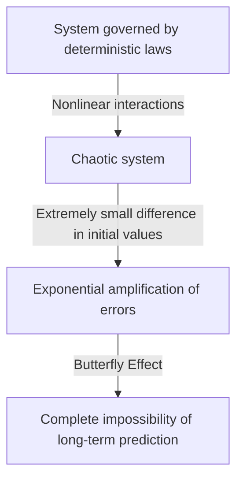
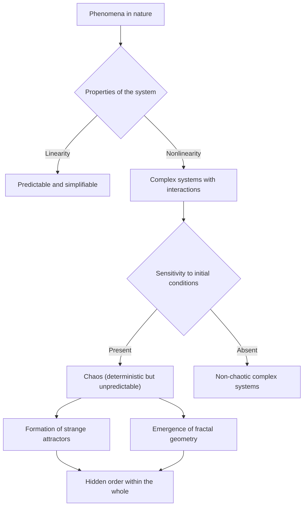

## 1. Introduction: What Is the Butterfly Effect?

"Does the flap of a butterfly's wings in Brazil set off a tornado in Texas?"

This captivating and mysterious question symbolizes one of modern science's most famous — and most misunderstood — concepts: the **Butterfly Effect**. The Butterfly Effect is a core concept within **Chaos Theory**, a field studied in meteorology, physics, mathematics, and more. It refers to the phenomenon in which "tiny differences in initial conditions amplify exponentially over time, ultimately producing decisive differences in future states."

In our everyday lives, we tend to intuitively assume a proportional relationship between cause and effect — a linear worldview in which small changes produce small results and large changes produce large results. However, many phenomena in the natural world behave in a highly nonlinear fashion, defying this intuition. A tiny fluctuation can generate enormous changes. Chaos theory provides the mathematical framework for unraveling the hidden order lurking behind such seemingly disordered and unpredictable complex phenomena.

In this article, we will thoroughly explore chaos theory and the Butterfly Effect — from their historical background and mathematical foundations, through their deep connections with fractal geometry, to their wide-ranging applications in modern society. Let us embark on a journey to discover why the future is unpredictable, and what beauty lies hidden within that unpredictability.

---

## 2. Historical Background: From Poincaré to Lorenz

The seeds of chaos theory can be traced back to the research of the great French mathematician Henri Poincaré at the end of the 19th century. At the time, one of the greatest challenges in physics was the "Three-Body Problem" — predicting the motion of three celestial bodies, such as the Sun, Earth, and Moon, that exert mutual gravitational attraction, based on Newtonian mechanics.

While studying this problem in depth, Poincaré discovered that the motion of celestial bodies could become extraordinarily complex. He mathematically suggested the possibility that immeasurably small errors in initial positions or velocities could amplify over time and ultimately make the final orbits completely different. This was, in effect, the first discovery of chaotic behavior — the finding that even deterministic systems (systems whose laws are completely known) can become impossible to predict in the long term. However, due to the limitations of the mathematical methods and computational power (the absence of computers) of the time, this groundbreaking discovery remained largely unexplored for several decades.

The situation changed dramatically in the 1960s. Edward Lorenz, a meteorologist at the Massachusetts Institute of Technology (MIT), was simulating atmospheric convection using an early computer. He had created a set of simple nonlinear differential equations to calculate variables such as temperature, pressure, and wind speed, running the computations on the machine.

One day, Lorenz attempted to restart a simulation from an intermediate point. He re-entered values from a printout, but instead of using the 6-digit precision value "0.506127" stored internally by the computer, he entered "0.506" — the 3-digit rounded value printed on the output.

When Lorenz returned from his coffee break, an astonishing sight awaited him. The restarted simulation matched the previous results for the first few steps, but soon began tracing entirely different weather patterns. A minuscule initial-value difference of just 0.000127 had produced a completely different weather future. This was the moment of discovery of the phenomenon Lorenz would later call **Sensitivity to Initial Conditions**, which would come to be known worldwide as the Butterfly Effect.

---

## 3. Mathematical Foundations: Nonlinear Dynamical Systems and the Lorenz Equations

To understand chaos theory mathematically, one must grasp the concepts of **Dynamical Systems** and **Nonlinearity**.

A dynamical system is a mathematical model of a system whose state changes over time. The future state of the system is completely determined by its current state and the deterministic laws governing it (usually differential equations or difference equations). Crucially, the laws themselves contain no probabilistic elements — no randomness like rolling dice.

Dynamical systems are broadly divided into linear and nonlinear systems. In linear systems, cause and effect are proportional, and the principle of superposition holds: "the sum of the parts equals the whole." These are relatively easy to solve mathematically and to predict. In nonlinear systems, however, variables multiply together or feedback loops exist, breaking the proportional relationship between cause and effect. They exhibit behavior where "the sum of the parts differs from the whole," giving rise to extremely complex phenomena. Chaos occurs only in nonlinear systems.

The most famous set of nonlinear coupled differential equations that produce chaos, derived by Edward Lorenz from an atmospheric convection model, are the **Lorenz Equations**. They consist of three variables ( $x, y, z$ ) and three parameters ( $\sigma, \rho, \beta$ ):

$$
\frac{dx}{dt} = \sigma (y - x)
$$

$$
\frac{dy}{dt} = x (\rho - z) - y
$$

$$
\frac{dz}{dt} = x y - \beta z
$$

Here, each variable has a physical meaning:
- $x$ represents the intensity of convection (rotational speed of the fluid)
- $y$ represents the temperature difference between ascending and descending flows
- $z$ represents the deviation of the vertical temperature profile from linearity
- $\sigma$ (Prandtl number), $\rho$ (Rayleigh number), and $\beta$ (aspect ratio of the system) are parameters.

For parameter values that exhibit typical chaotic behavior, Lorenz chose $\sigma = 10, \rho = 28, \beta = 8/3$. Although this system of equations is deterministic, the solution never repeats a past state, tracing an infinitely complex trajectory. The nonlinear terms $xz$ and $xy$ in the equations play the decisive role in generating chaos.

---

## 4. Phase Space and Strange Attractors

A powerful tool for visually understanding the behavior of dynamical systems is **Phase Space**. Phase space is a multi-dimensional space capable of representing every conceivable state of a system. The current state of the system is represented as "a single point" in this phase space. As time progresses and the system's state changes, the point's movement through phase space traces out a "trajectory."

In many real-world systems with dissipation (properties that cause energy loss, such as friction or air resistance), after sufficient time the system eventually settles into a specific state (a point) or a periodic state (a closed loop). This final destination is called an **Attractor** (something that draws things in). For example, a pendulum's motion eventually comes to rest at its lowest point due to air resistance; in this case, the attractor is a "single point (fixed point)." For systems that repeat periodic motion, like a heartbeat, the attractor is a "limit cycle (closed curve)."

In chaotic systems like the Lorenz equations, however, an entirely different kind of attractor appears — the **Strange Attractor**.

When the Lorenz attractor is plotted in three-dimensional phase space, a breathtakingly beautiful and complex structure emerges, resembling a butterfly spreading its wings or a pair of eyes. This strange attractor has the following remarkable properties:

1. **Boundedness**: The trajectory never flies off to infinity; it always remains within a specific region of the attractor.
2. **Aperiodicity**: The trajectory never crosses its own past path or repeats exactly the same route. It traces a new path forever.
3. **Sensitivity to Initial Conditions**: Two trajectories starting from extremely close initial points on the attractor are pulled apart to entirely different locations within the attractor over time.

Despite being confined within a finite volume, the trajectory never crosses itself (crossing would violate the deterministic premise that "the same state leads to the same future"). To satisfy this constraint, space must be "folded" infinitely. This repeated process of "stretching and folding" (much like kneading bread dough) is the essence of chaos, and it generates the complex structure of strange attractors.

---

## 5. The Logistic Map and Bifurcation Diagrams

Another important mathematical model for understanding chaos theory in its simplest form is the **Logistic Map**. It is a simple quadratic difference equation that models population dynamics (for example, the annual change in the number of rabbits on an island).

$$
x_{n+1} = r x_n (1 - x_n)
$$

Here:
- $x_n$ represents the population at generation $n$ (as a proportion of the environment's maximum carrying capacity, ranging from $0 \le x_n \le 1$).
- $x_{n+1}$ is the population of the next generation.
- $r$ is a parameter representing the reproduction rate (typically $0 \le r \le 4$).

This equation is very simple, yet by varying the parameter $r$, it exhibits astonishingly diverse and complex behavior.

- $0 < r < 1$: The population ultimately goes extinct, and $x$ converges to 0.
- $1 < r < 3$: The population converges to a fixed value (fixed point) and stabilizes.
- Near $r = 3$: The fixed point becomes unstable, and the population begins alternating between two distinct values. This is called **Period-Doubling Bifurcation**.
- As $r$ increases further, bifurcations rapidly occur with the period doubling to 4, 8, 16, and so on.
- Beyond $r \approx 3.56995$ (the Feigenbaum point), periodicity breaks down entirely and the population takes on completely unpredictable values. This is the state of **chaos**.

A graph plotting the system's final state (attractor) against changes in $r$ is called a **Bifurcation Diagram**. The horizontal axis represents the parameter $r$, and the vertical axis represents the final values of $x$.

Examining the bifurcation diagram reveals "windows" — regions within the chaotic domain where order suddenly recovers (for example, a period-3 region). Remarkably, zooming into portions of the bifurcation diagram reveals the same overall pattern appearing infinitely — self-similarity. The fact that a simple quadratic equation contains such rich structure sent shockwaves through the mathematical community.

---

## 6. Lyapunov Exponents: Quantifying Chaos

The metric for rigorously and mathematically quantifying the "sensitivity to initial conditions" of a chaotic system is the **Lyapunov Exponent**.

Consider two trajectories starting from extremely close initial states in phase space (separated by a distance $\delta Z_0$) that diverge to a distance $\delta Z(t)$ over time $t$. In a chaotic system, this distance grows exponentially on average.

$$
|\delta Z(t)| \approx e^{\lambda t} |\delta Z_0|
$$

Here, $\lambda$ (lambda) is the Lyapunov exponent.
The Lyapunov exponent represents the average rate at which neighboring trajectories diverge (or converge).

- $\lambda < 0$: Trajectories converge toward each other, settling into a fixed point or limit cycle (not chaotic).
- $\lambda = 0$: The distance between trajectories is maintained constant (e.g., conservative systems).
- $\lambda > 0$: Trajectories diverge exponentially. This is the **definitive indicator of chaos**.

In multi-dimensional dynamical systems, there are as many Lyapunov exponents (the Lyapunov spectrum) as there are dimensions. If at least one positive Lyapunov exponent exists, the system is defined as chaotic. The larger the positive Lyapunov exponent, the more rapidly initial tiny errors amplify, shortening the predictable time scale (Lyapunov time). This is the fundamental mathematical reason why weather forecasts are reasonably accurate a few days out but become completely unpredictable weeks ahead.

---

## 7. The Relationship Between Fractals and Chaos

Indispensable to any discussion of chaos theory is the **Fractal** geometry proposed by mathematician Benoit Mandelbrot. A fractal is "a shape in which, no matter how far you zoom in, the same complex structure (self-similarity) appears infinitely." Representative examples include the Mandelbrot set and the Koch curve.

Chaos and fractals may appear to be different concepts at first glance, but they are in fact two sides of the same coin. When you slice through a strange attractor's cross-section and examine it in detail, an infinitely layered structure emerges, revealing fractal geometry.

The "stretching and folding" dynamics in a chaotic system's phase space produce fractal shapes as a geometric consequence. One important property of fractals is that they possess a non-integer "fractional dimension (fractal dimension)." For example, a shape more complex than a 1-dimensional line that fills space but falls short of a 2-dimensional plane might have a dimension of 1.26. Strange attractors are also fractal structures with fractional dimensions.

If chaos is "complex dynamics emerging over time," then fractals are "the geometric footprints that those dynamics etch into space." Many natural phenomena — ria coastlines, tree branching, blood vessel networks, cloud shapes — exhibit fractal structures, and it is believed that chaotic nonlinear dynamics underlie their formation.

---

## 8. Real-World Applications: From Weather to Economics

Chaos theory is far more than a mathematical curiosity. The universal properties of sensitivity to initial conditions and nonlinear dynamics have brought broad applications across every field, well beyond physics.

### 8.1 Meteorology and Climate Change
Meteorology, the stage for Lorenz's discovery, is one of the fields that has benefited most from chaos theory. The atmosphere is governed by complex nonlinear equations from fluid dynamics and thermodynamics and is inherently chaotic. Today, instead of a single forecast, the mainstream approach is "ensemble forecasting" — running multiple simulations simultaneously with intentionally small perturbations to the initial values. This allows probabilistic evaluation of forecast uncertainty and an understanding of how far into the future reliable predictions are possible.

### 8.2 Medicine and Biology
Human biological rhythms are also deeply connected to chaos. For example, the heart rate variability of a healthy heart is neither perfectly regular nor perfectly random; it exhibits chaotic fractal characteristics. In heart disease patients and the elderly, the heartbeat can become either too regular or completely random. The loss of chaotic variability is being studied as an important sign (biomarker) of deteriorating health. Nonlinear dynamics is also essential for analyzing brain waves and modeling the spread of infectious diseases (such as the SIR model in epidemiology).

### 8.3 Economics and Financial Markets
Financial markets such as stock and currency exchange markets are extremely complex nonlinear systems in which the psychology and actions of countless investors interact. Traditional economics assumed that markets are efficient and prices follow a random walk (random movements with a normal distribution), but in reality, extreme events like crashes and bubbles occur far more frequently than predicted by a normal distribution (the fat-tail phenomenon). By applying chaos theory and fractals (such as the multifractal models proposed by Mandelbrot), researchers are attempting to more accurately model the nonlinear structures hidden in price fluctuations, long-term memory effects, and the risk of bubble collapses to improve risk management.

### 8.4 Engineering and Control
Chaos is also an important concept in engineering. Chaotic phenomena are observed in many systems: vibrations of aircraft wings (flutter), synchronization of nonlinear oscillators in electrical circuits, disturbances in laser output, and more. Traditionally, chaos was seen as something to be avoided — unpredictable noise that destabilized systems. Today, however, techniques known as "Chaos Control" have been developed, which skillfully guide a system from a chaotic state to a desirable periodic state using only a small amount of energy, thereby stabilizing it. Research is also underway into applying the pseudo-random nature of chaotic signals to encrypted communications (chaos-based cryptography).

---

## 9. Philosophical Implications: Determinism and Predictability

The advent of chaos theory brought a fundamental paradigm shift to the philosophy of science — particularly regarding our worldview on "Determinism" and "Predictability."

The 18th-century French mathematician Pierre-Simon Laplace proposed the following thought experiment: "If an intelligence could know the exact position and momentum of every atom in the universe and had the ability to analyze them, then for that intelligence, neither the future nor the past would be uncertain — the entire timeline would lie open like the present." This hypothetical intelligence is known as **Laplace's Demon**, and it symbolized the robust deterministic worldview grounded in classical mechanics.

Determinism holds that "if the current state is completely determined, the future is uniquely determined by the laws of physics." The equations handled by chaos theory (such as the Lorenz equations) are purely deterministic equations containing no probabilistic elements whatsoever. In principle, therefore, Laplace's Demon should be able to perfectly predict the future of a chaotic system.

However, chaos theory ruthlessly exposes the **limits of predictability** in the real world. In reality, it is impossible to measure every initial state of the universe with "infinite precision (zero error)." Even setting aside the uncertainty principle of quantum mechanics, our observational capabilities always have finite limits.

In chaotic systems, no matter how small the observational error, it amplifies exponentially over time, eventually engulfing the entire system. In other words, it became clear that "being deterministic" and "being predictable" are entirely different concepts. Chaos theory laid Laplace's Demon to rest and taught humanity the profound truth that "even when the laws are completely known, the future can be inherently unpredictable."

This paradigm shift presents a new worldview: "Our world is complex and unpredictable, yet behind it lies beautiful deterministic mathematical structure." By giving up on perfect prediction and instead examining the shapes of attractors or understanding probabilistic distributions, a path has been opened to comprehend the "large-scale order" hidden within chaos.

---

## 10. Conclusion

In this article, we have delved deeply into the Butterfly Effect — whereby tiny differences in initial conditions lead to vastly different outcomes — and the chaos theory that encompasses it.

From Poincaré's intuition, through Lorenz's accidental computer-based discovery, chaos theory has grown into a vast field spanning mathematics and physics. The beautiful trajectories of strange attractors traced by nonlinear equations, the infinite self-similarity found in the logistic map, and the quantification of unpredictability through Lyapunov exponents — its mathematical foundations are extraordinarily refined and brimming with intellectual wonder.

Chaos theory has provided a powerful lens for understanding the complex phenomena that surround us — from the limits of weather prediction to economic fluctuations, heartbeats, and even the evolution of life. It teaches us that the natural world is by no means a simple clockwork machine, but rather a dynamic system filled with unpredictability and creativity.

Deterministic yet unpredictable — this seemingly paradoxical property is the greatest allure of chaos theory. The fact that the future is completely determined yet unknowable to anyone (even the most powerful computers) makes our understanding of the universe more humble and more rich. The nonlinear world woven by chaos and fractals will continue to captivate scientists and inspire new discoveries for years to come.

