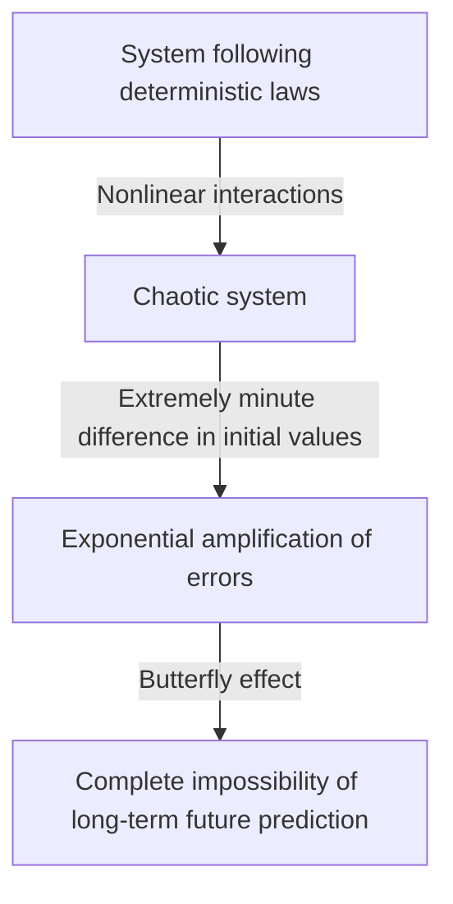
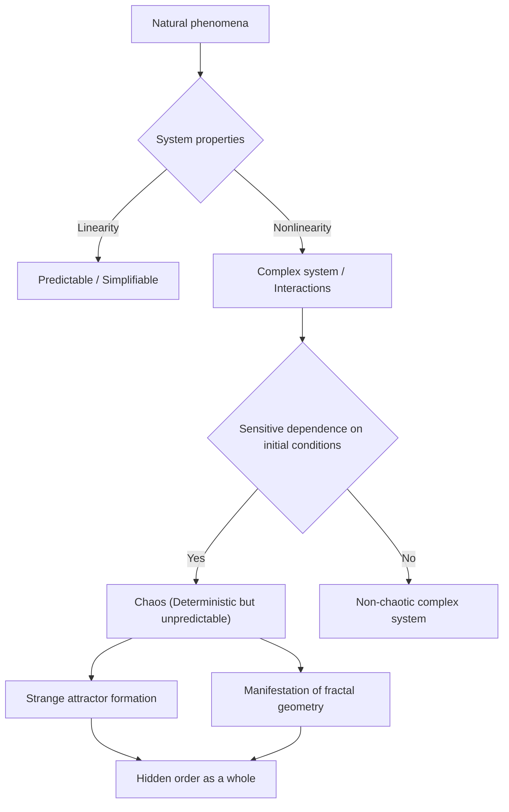

## 1. Introduction: What is the Butterfly Effect?

"Does the flap of a butterfly's wings in Brazil set off a tornado in Texas?"

This fascinating and mysterious question symbolizes the **Butterfly Effect**, one of the most famous and most misunderstood concepts in modern science. The butterfly effect is a core concept of **Chaos Theory**, which is studied in fields such as meteorology, physics, and mathematics. It refers to the phenomenon where "a minute difference in initial conditions amplifies exponentially over time, resulting in a decisive difference in the future state."

In our daily lives, we intuitively tend to think that causes and effects are proportional. In other words, it is a linear worldview where small changes bring small results, and large changes bring large results. However, contrary to this intuition, many phenomena in nature behave in a highly nonlinear manner. A slight fluctuation can produce huge changes. Chaos theory provides a mathematical framework for unraveling the hidden order behind these seemingly disordered and unpredictable complex phenomena.

In this article, we will thoroughly explain chaos theory and the butterfly effect, from their historical background to mathematical foundations, deep connections with fractal geometry, and diverse applications in modern society. Let's embark on a journey to explore why the future is unpredictable and what kind of beauty is hidden within that unpredictability.

---

## 2. Historical Background: From [Poincaré](https://kenji.blog/en/p/poincare/) to Lorenz

The seeds of chaos theory can be traced back to the research of the great 19th-century French mathematician [Henri Poincaré](https://kenji.blog/en/p/poincare/). At the time, one of the greatest challenges in physics was the "three-body problem." This was the problem of predicting the motion of three celestial bodies, such as the Sun, Earth, and Moon, exerting gravitational forces on each other based on Newtonian mechanics.

While studying this problem deeply, [Poincaré](https://kenji.blog/en/p/poincare/) discovered that the motion of celestial bodies could become extremely complex. He mathematically suggested that immeasurably small errors in initial positions or velocities could expand over time, ultimately leading to completely different trajectories of celestial bodies. This was virtually the first discovery of chaotic behavior, showing that even in a deterministic system (a system where the laws are completely known), long-term prediction could sometimes become impossible. However, due to the limitations of mathematical methods and computational power (the absence of computers) at the time, this groundbreaking discovery was not deeply explored for decades afterward.

The situation changed dramatically in the 1960s. Edward Lorenz, a meteorologist at the Massachusetts Institute of Technology (MIT), was simulating atmospheric convection using an early computer. He created a set of simple nonlinear differential equations to calculate variables such as temperature, pressure, and wind speed, and computed the values using a computer.

One day, Lorenz attempted to restart a simulation from the middle of a previous run. He re-entered the numbers from a printed output, but he mistakenly typed in "0.506"—a value rounded to three decimal places from the printout—instead of the internal six-digit precision value of "0.506127" held by the computer.

When Lorenz returned from his coffee break, an astonishing sight awaited him. The results of the restarted simulation initially matched the previous run for the first few steps, but soon began to trace a completely different weather pattern. A minuscule initial difference of just 0.000127 resulted in an entirely different future weather scenario. This was the moment of discovery of a phenomenon that Lorenz later called **Sensitive dependence on initial conditions**, which would become known to the world as the butterfly effect.

---

## 3. Mathematical Foundations: Nonlinear Dynamical Systems and Lorenz Equations

To understand chaos theory mathematically, it is necessary to grasp the concepts of **Dynamical Systems** and **Non-linearity**.

A dynamical system is a mathematical model of a system whose state changes over time. The future state of the system is completely determined by its current state and the deterministic laws (usually differential or difference equations) governing the system. The key point here is that the laws themselves contain absolutely no probabilistic elements (chance, like rolling a die).

Dynamical systems are broadly classified into linear and nonlinear systems. In a linear system, cause and effect are proportional, and the principle of superposition applies, where "the sum of the parts equals the whole." These are relatively easy to solve mathematically, and predictions are straightforward. On the other hand, in nonlinear systems, variables are multiplied together or feedback loops exist, breaking the proportional relationship between cause and effect. It exhibits a behavior where "the sum of the parts differs from the whole," causing extremely complex phenomena. Chaos occurs only in nonlinear systems.

The most famous set of nonlinear differential equations that produce chaos, derived by Edward Lorenz from an atmospheric convection model, are the **Lorenz equations**. They consist of the following three variables ($x, y, z$) and three parameters ($\sigma, \rho, \beta$).

$$
\frac{dx}{dt} = \sigma (y - x)
$$

$$
\frac{dy}{dt} = x (\rho - z) - y
$$

$$
\frac{dz}{dt} = x y - \beta z
$$

Here, each variable has a physical meaning:
- $x$ is the rate of convection (fluid rotational speed)
- $y$ is the horizontal temperature variation between ascending and descending currents
- $z$ is the deviation of the vertical temperature profile from linearity
- $\sigma$ (Prandtl number), $\rho$ (Rayleigh number), and $\beta$ (aspect ratio of the system) are parameters.

As parameter values showing typical chaotic behavior, Lorenz chose $\sigma = 10, \rho = 28, \beta = 8/3$. While this system of equations is deterministic, the solutions never repeat past states and continue to trace infinitely complex trajectories. The nonlinear terms in the equations, such as $xz$ and $xy$, play a decisive role in generating chaos.

---

## 4. Phase Space and Strange Attractors

A powerful tool for visually understanding the behavior of dynamic systems is **Phase space**. Phase space is a multidimensional space capable of representing all possible states of a system. The current state of the system is represented as a "single point" in this phase space. As time progresses, the changing state of the system is depicted as a "trajectory" traced by the point moving through the phase space.

In many real-world systems with dissipation (the property of losing energy, like friction or air resistance), after a sufficient amount of time passes, the system eventually settles into a specific state (a point) or a periodic state (a closed loop). This final settling place is called an **Attractor**. For example, the motion of a pendulum eventually comes to rest at its lowest point due to air resistance. The attractor in this case is a "single point (fixed point)." The attractor for a system that repeats periodic motion, like a heartbeat, is a "limit cycle (closed curve)."

However, in chaotic systems like the Lorenz equations, a completely different kind of attractor emerges. This is the **Strange Attractor**.

When the Lorenz attractor is plotted in a 3D phase space, it reveals a breathtakingly beautiful and complex structure resembling a butterfly with spread wings or two eyes. This strange attractor has the following remarkable features:

1. **Boundedness**: The trajectory does not fly off to infinity; it always remains within a specific region of the attractor.
2. **Aperiodicity**: The trajectory never crosses its own past path or repeats exactly the same route. It eternally continues to trace new paths.
3. **Sensitive dependence on initial conditions**: Trajectories starting from two extremely close initial points on the attractor will be pulled far apart to completely different locations within the attractor as time passes.

Even though the trajectories are confined within a finite volume, they are constrained to never cross (because crossing would violate the deterministic premise that "the same state leads to the same future"). To achieve this, space must be "folded" infinitely. This repeated process of "stretching" and "folding" (like kneading dough) is the very essence of chaos and gives rise to the complex structure of strange attractors.

---

## 5. Logistic Map and Bifurcation Diagram

Another important mathematical model for understanding chaos theory in the simplest way is the **Logistic map**. This is a simple quadratic difference equation modeling the fluctuation of a biological population (for example, the annual change in the number of rabbits on an island).

$$
x_{n+1} = r x_n (1 - x_n)
$$

Here,
- $x_n$ represents the population at the $n$-th generation (taking a value in the range $0 \le x_n \le 1$ as a ratio of the environment's maximum carrying capacity).
- $x_{n+1}$ is the population of the next generation.
- $r$ is a parameter representing the reproduction rate (usually $0 \le r \le 4$).

Although this equation is extremely simple, changing the value of the parameter $r$ causes it to exhibit astonishingly diverse and complex behaviors:

- $0 < r < 1$: The population eventually goes extinct, and $x$ converges to 0.
- $1 < r < 3$: The population converges to a certain constant value (fixed point) and stabilizes.
- Around $r = 3$: The fixed point becomes unstable, and the population starts alternating between two different values. This is called **Period-doubling bifurcation**.
- As $r$ increases further, bifurcations where the period doubles to 4, 8, 16, etc., occur rapidly.
- Beyond $r \approx 3.56995$ (the Feigenbaum point), periodicity completely breaks down, and the population takes on completely unpredictable values. This is the state of **Chaos**.

Plotting the system's final state (attractor) against these changes in $r$ creates what is called a **Bifurcation diagram**. The horizontal axis represents the parameter $r$, and the vertical axis represents the final values of $x$.

Looking at the bifurcation diagram, we can see that within the chaotic region, there are "Windows" where order suddenly recovers (for example, a period-3 region). Astonishingly, if you magnify a portion of this bifurcation diagram, it exhibits self-similarity, where the exact same pattern as the overall structure appears infinitely. The fact that a simple quadratic equation contains such rich structure sent a major shock through the mathematical community.

---

## 6. Lyapunov Exponent: Quantifying Chaos

The indicator used to strictly mathematically quantify the "sensitive dependence on initial conditions" inherent in chaotic systems is the **Lyapunov Exponent**.

Consider two extremely close initial states in phase space (with a distance denoted as $\delta Z_0$) and observe how their trajectories separate to a distance $\delta Z(t)$ as time $t$ passes. In the case of a chaotic system, this distance expands exponentially on average.

$$
|\delta Z(t)| \approx e^{\lambda t} |\delta Z_0|
$$

Here, $\lambda$ (lambda) is the Lyapunov exponent.
The Lyapunov exponent represents the average rate at which adjacent trajectories separate (or approach each other).

- $\lambda < 0$: Trajectories approach each other and converge to a fixed point or limit cycle (not chaos).
- $\lambda = 0$: The distance between trajectories remains constant (e.g., conservative systems).
- $\lambda > 0$: Trajectories are pulled apart exponentially. This is the decisive indicator of **Chaos**.

In a multidimensional dynamical system, there are as many Lyapunov exponents as the dimensions of the space (the Lyapunov spectrum). If at least one positive Lyapunov exponent exists, the system is defined as chaotic. The larger the positive Lyapunov exponent, the more rapidly initial minuscule errors amplify, shortening the timescale over which the future is predictable (Lyapunov time). This is the fundamental mathematical reason why weather forecasts can be reasonably accurate a few days out but become completely unpredictable weeks in advance.

---

## 7. The Relationship Between Fractals and Chaos

When discussing chaos theory, one cannot omit **Fractal** geometry, proposed by the mathematician Benoit Mandelbrot. A fractal is a figure in which "no matter how much you magnify it, a similar complex structure (self-similarity) identical to the whole appears infinitely." Representative examples include the Mandelbrot set and the Koch snowflake.

Chaos and fractals may seem like different concepts at first glance, but they are actually two sides of the same coin. If you take a cross-section of a strange attractor and observe it closely, you will find an infinitely layered structure, revealing that it possesses a fractal structure.

The dynamics of "stretching and folding" in the phase space of a chaotic system produces fractal figures as a geometric result. One of the important characteristics of a fractal is that it has a "fractional dimension (fractal dimension)" that is not an integer. For instance, a figure that is more complex and space-filling than a 1D line but falls short of a 2D plane might have a dimension of 1.26. A strange attractor is also a fractal structure with a fractional dimension.

If chaos is "complex dynamics emerging over time," then fractals can be said to be "the geometric footprints left by those dynamics in space." Many natural phenomena, such as the shapes of ria coastlines, the branching of trees, the networks of blood vessels, and the shapes of clouds, possess fractal structures, and it is believed that chaotic nonlinear dynamics are at work behind their formation processes.

---

## 8. Real-world Applications: From Meteorology to Economics

Chaos theory is not mere mathematical play. The universal properties of sensitive dependence on initial conditions and nonlinear dynamics have brought wide-ranging applications to every field of the real world, transcending physics.

### 8.1 Meteorology and Climate Change
Meteorology, the stage for Lorenz's discovery, is one of the fields that has benefited most from chaos theory. The atmosphere is governed by complex nonlinear equations of fluid dynamics and thermodynamics, making it inherently chaotic. Today, the mainstream approach is "ensemble forecasting," which involves intentionally introducing slight fluctuations into initial values and running multiple simulations simultaneously, rather than relying on a single forecast. This allows meteorologists to probabilistically evaluate forecast uncertainty and understand how far into the future reliable predictions are possible.

### 8.2 Medicine and Biology
Human biological rhythms are also deeply intertwined with chaos. For example, it is known that the heartbeat intervals (fluctuations) of a healthy heart are neither completely regular nor completely random, but rather possess chaotic fractal properties. Conversely, the heartbeats of heart disease patients or the elderly can become too regular or completely random. The loss of chaotic fluctuation is being studied as an important sign (biomarker) indicating deteriorating health. Nonlinear dynamics are also essential in analyzing brainwaves and modeling the spread of infectious diseases (such as the SIR model in epidemiology).

### 8.3 Economics and Financial Markets
Financial markets, such as stock and foreign exchange markets, are highly complex nonlinear systems where the psychology and actions of countless investors interact. Traditional economics assumed that markets were efficient and prices followed a random walk (random movements conforming to a normal distribution). However, in actual markets, extreme events like crashes and bubbles occur far more frequently than a normal distribution predicts (the fat-tail phenomenon). By applying chaos theory and fractals (such as Mandelbrot's multifractal model), attempts are being made to more accurately model the nonlinear structures, long-term memory, and risks of bubble bursts hidden within market price fluctuations, applying this knowledge to risk management.

### 8.4 Engineering and Control
The concept of chaos is also important in the field of engineering. Chaos phenomena are observed in many systems, such as wing vibrations in aircraft (flutter), synchronization of nonlinear oscillators in electrical circuits, and disturbances in laser output. Traditionally, chaos was considered something to be "avoided" or "eliminated as noise" because it is unpredictable and destabilizes systems. Today, however, a technology called "Chaos Control" has developed, which utilizes the minute energy inherent in a system to skillfully guide it from a chaotic state to a desired periodic state, stabilizing it. Applications for cryptographic communication using the randomness of chaotic signals (chaos cryptography) are also being researched.

---

## 9. Philosophical Implications: Determinism and Predictability

The emergence of chaos theory has brought a fundamental paradigm shift to the philosophy of science, particularly regarding our worldview on "Determinism" and "Predictability."

The 18th-century French mathematician Pierre-Simon Laplace proposed the following thought experiment: "If there were an intellect that could completely grasp the current positions and momenta of all the atoms in the universe and was vast enough to analyze them, to such an intellect, the future, just like the past, would be present before its eyes." This hypothetical intellect is called **Laplace's demon**, and it symbolized a strong deterministic worldview of the universe based on classical mechanics.

Determinism is the idea that "if the current state is completely determined, the future is uniquely determined according to the laws of physics." The equations handled by chaos theory (such as the Lorenz equations) are purely deterministic equations that contain no probabilistic elements. Therefore, in principle, Laplace's demon should be able to perfectly predict the future of chaotic systems as well.

However, chaos theory coldly confronted us with the **Limits of predictability** in the real world. In reality, it is impossible to measure every initial state of the universe with "infinite precision (zero error)." Even without considering the uncertainty principle of quantum mechanics, our observational capabilities inherently have finite limits.

In a chaotic system, no matter how small this observation error is, it amplifies exponentially over time, eventually engulfing the entire system. In other words, it became clear that "being deterministic" and "being predictable" are two entirely different concepts. Chaos theory laid Laplace's demon to rest and taught humanity the profound truth that "even if the laws are perfectly known, the future can be fundamentally unpredictable."

This paradigm shift presents a new worldview: "Our world is complex and unpredictable, but behind it lies a beautiful, deterministic mathematical structure." Instead of giving up on perfect prediction, a path has opened to understand the "macro-level order" hidden within chaos by studying the shapes of attractors and understanding probabilistic distributions.

---

## 10. Conclusion

In this article, we have deeply explored the butterfly effect—where minuscule differences in initial conditions yield massive results—and the chaos theory that encompasses it.

Starting from [Poincaré](https://kenji.blog/en/p/poincare/)'s intuition, passing through Lorenz's accidental discovery via computer, chaos theory has grown into a massive field traversing mathematics and physics. Its mathematical foundations are highly refined and full of intellectual wonder, as seen in the beautiful trajectories of strange attractors drawn by nonlinear equations, the infinite self-similarity observed in the logistic map, and the quantification of unpredictability through Lyapunov exponents.

Chaos theory not only teaches us the limits of weather forecasting but also provides a powerful lens for understanding the complex phenomena surrounding us, from economic fluctuations and heartbeats to the evolution of life. It reveals that the natural world is not a simple clockwork machine, but a dynamic system filled with unpredictability and creativity.

Deterministic yet unpredictable. This seemingly contradictory nature is precisely the greatest charm of chaos theory. The fact that the future is completely determined, yet no one (and no matter how powerful a computer) can know its detailed future, makes our perception of the universe humbler and richer. The nonlinear world woven by chaos and fractals will surely continue to fascinate scientists and bring about new discoveries in the future.

