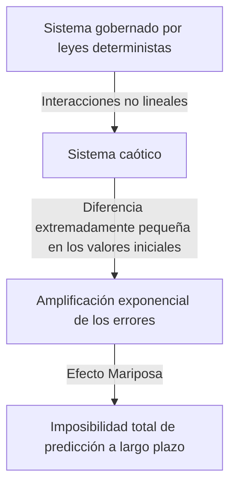

## 1. Introducción: ¿Qué es el Efecto Mariposa?

"¿Puede el aleteo de una mariposa en Brasil provocar un tornado en Texas?"

Esta cautivadora y misteriosa pregunta simboliza uno de los conceptos más famosos —y más malinterpretados— de la ciencia moderna: el **Efecto Mariposa** (Butterfly Effect). El Efecto Mariposa es un concepto central de la **Teoría del Caos** (Chaos Theory), un campo estudiado en meteorología, física, matemáticas y otras disciplinas. Se refiere al fenómeno por el cual "pequeñas diferencias en las condiciones iniciales se amplifican exponencialmente con el tiempo, produciendo en última instancia diferencias decisivas en los estados futuros."

En nuestra vida cotidiana, tendemos a asumir intuitivamente una relación proporcional entre causa y efecto — una visión lineal del mundo en la que pequeños cambios producen pequeños resultados y grandes cambios producen grandes resultados. Sin embargo, muchos fenómenos del mundo natural se comportan de manera altamente no lineal, desafiando esta intuición. Una diminuta fluctuación puede generar cambios enormes. La teoría del caos proporciona el marco matemático para desentrañar el orden oculto detrás de estos fenómenos complejos, aparentemente desordenados e impredecibles.

En este artículo, exploraremos a fondo la teoría del caos y el Efecto Mariposa — desde sus antecedentes históricos y fundamentos matemáticos, pasando por sus profundas conexiones con la geometría fractal, hasta sus amplias aplicaciones en la sociedad moderna. Emprendamos un viaje para descubrir por qué el futuro es impredecible y qué belleza se esconde dentro de esa impredecibilidad.

---

## 2. Antecedentes históricos: De Poincaré a Lorenz

Las semillas de la teoría del caos se remontan a las investigaciones del gran matemático francés Henri Poincaré a finales del siglo XIX. En aquella época, uno de los mayores desafíos de la física era el "Problema de los Tres Cuerpos" — predecir el movimiento de tres cuerpos celestes, como el Sol, la Tierra y la Luna, que ejercen atracción gravitatoria mutua, basándose en la mecánica newtoniana.

Al estudiar este problema en profundidad, Poincaré descubrió que el movimiento de los cuerpos celestes podía volverse extraordinariamente complejo. Sugirió matemáticamente la posibilidad de que errores inmensurablemente pequeños en las posiciones o velocidades iniciales pudieran amplificarse con el tiempo y hacer que las órbitas finales fueran completamente diferentes. Esto fue, en efecto, el primer descubrimiento del comportamiento caótico — el hallazgo de que incluso los sistemas deterministas (sistemas cuyas leyes son completamente conocidas) pueden volverse imposibles de predecir a largo plazo. Sin embargo, debido a las limitaciones de los métodos matemáticos y la capacidad de cálculo (la ausencia de ordenadores) de la época, este descubrimiento revolucionario permaneció en gran medida inexplorado durante varias décadas.

La situación cambió drásticamente en la década de 1960. Edward Lorenz, meteorólogo del Instituto Tecnológico de Massachusetts (MIT), estaba simulando la convección atmosférica utilizando un ordenador temprano. Había creado un conjunto de ecuaciones diferenciales no lineales simples para calcular variables como la temperatura, la presión y la velocidad del viento, ejecutando los cálculos en la máquina.

Un día, Lorenz intentó reiniciar una simulación desde un punto intermedio. Reintrodujo valores de una impresión, pero en lugar de utilizar el valor con 6 dígitos de precisión "0,506127" almacenado internamente por el ordenador, introdujo "0,506" — el valor redondeado a 3 dígitos impreso en la salida.

Cuando Lorenz regresó de su pausa para el café, le esperaba un espectáculo asombroso. La simulación reiniciada coincidía con los resultados anteriores durante los primeros pasos, pero pronto comenzó a trazar patrones meteorológicos completamente diferentes. Una diferencia minúscula en el valor inicial de solo 0,000127 había producido un futuro meteorológico completamente distinto. Este fue el momento del descubrimiento del fenómeno que Lorenz llamaría más tarde **Sensibilidad a las Condiciones Iniciales** (Sensitive dependence on initial conditions), que llegaría a ser conocido mundialmente como el Efecto Mariposa.

---

## 3. Fundamentos matemáticos: Sistemas dinámicos no lineales y las ecuaciones de Lorenz

Para comprender la teoría del caos matemáticamente, es necesario dominar los conceptos de **Sistemas Dinámicos** y **No Linealidad**.

Un sistema dinámico es un modelo matemático de un sistema cuyo estado cambia con el tiempo. El estado futuro del sistema está completamente determinado por su estado actual y las leyes deterministas que lo gobiernan (normalmente ecuaciones diferenciales o ecuaciones en diferencias). Es crucial que las leyes en sí mismas no contengan elementos probabilísticos — ninguna aleatoriedad como lanzar un dado.

Los sistemas dinámicos se dividen ampliamente en sistemas lineales y no lineales. En los sistemas lineales, causa y efecto son proporcionales, y se cumple el principio de superposición: "la suma de las partes es igual al todo." Estos son relativamente fáciles de resolver matemáticamente y de predecir. En los sistemas no lineales, sin embargo, las variables se multiplican entre sí o existen bucles de retroalimentación, rompiendo la relación proporcional entre causa y efecto. Exhiben un comportamiento donde "la suma de las partes difiere del todo", dando lugar a fenómenos extremadamente complejos. El caos solo ocurre en sistemas no lineales.

El conjunto más famoso de ecuaciones diferenciales no lineales acopladas que producen caos, derivadas por Edward Lorenz de un modelo de convección atmosférica, son las **Ecuaciones de Lorenz**. Consisten en tres variables ( $x, y, z$ ) y tres parámetros ( $\sigma, \rho, \beta$ ):

$$
\frac{dx}{dt} = \sigma (y - x)
$$

$$
\frac{dy}{dt} = x (\rho - z) - y
$$

$$
\frac{dz}{dt} = x y - \beta z
$$

Aquí, cada variable tiene un significado físico:
- $x$ representa la intensidad de la convección (velocidad de rotación del fluido)
- $y$ representa la diferencia de temperatura entre las corrientes ascendentes y descendentes
- $z$ representa la desviación del perfil vertical de temperatura respecto a la linealidad
- $\sigma$ (número de Prandtl), $\rho$ (número de Rayleigh) y $\beta$ (relación de aspecto del sistema) son parámetros.

Para valores de parámetros que exhiben comportamiento caótico típico, Lorenz eligió $\sigma = 10, \rho = 28, \beta = 8/3$. Aunque este sistema de ecuaciones es determinista, la solución nunca repite un estado pasado, trazando una trayectoria infinitamente compleja. Los términos no lineales $xz$ y $xy$ en las ecuaciones desempeñan el papel decisivo en la generación del caos.

---

## 4. Espacio de fases y atractores extraños

Una herramienta poderosa para comprender visualmente el comportamiento de los sistemas dinámicos es el **Espacio de Fases**. El espacio de fases es un espacio multidimensional capaz de representar todos los estados concebibles de un sistema. El estado actual del sistema se representa como "un único punto" en este espacio de fases. A medida que el tiempo avanza y el estado del sistema cambia, el movimiento del punto a través del espacio de fases traza una "trayectoria."

En muchos sistemas del mundo real con disipación (propiedades que causan pérdida de energía, como la fricción o la resistencia del aire), tras un tiempo suficiente, el sistema termina estabilizándose en un estado específico (un punto) o un estado periódico (un bucle cerrado). Este destino final se denomina **Atractor** (algo que atrae). Por ejemplo, el movimiento de un péndulo eventualmente se detiene en su punto más bajo debido a la resistencia del aire; en este caso, el atractor es un "punto único (punto fijo)." Para sistemas que repiten movimientos periódicos, como el latido del corazón, el atractor es un "ciclo límite (curva cerrada)."

En los sistemas caóticos como las ecuaciones de Lorenz, sin embargo, aparece un tipo de atractor completamente diferente — el **Atractor Extraño** (Strange Attractor).

Cuando el atractor de Lorenz se representa en el espacio de fases tridimensional, emerge una estructura asombrosamente bella y compleja, similar a una mariposa con las alas extendidas o un par de ojos. Este atractor extraño posee las siguientes propiedades notables:

1. **Acotamiento**: La trayectoria nunca se escapa al infinito; siempre permanece dentro de una región específica del atractor.
2. **Aperiodicidad**: La trayectoria nunca cruza su propio camino pasado ni repite exactamente la misma ruta. Traza un camino nuevo eternamente.
3. **Sensibilidad a las condiciones iniciales**: Dos trayectorias que parten de puntos iniciales extremadamente cercanos en el atractor son separadas hacia ubicaciones completamente diferentes dentro del atractor a lo largo del tiempo.

A pesar de estar confinada dentro de un volumen finito, la trayectoria nunca se cruza consigo misma (cruzarse violaría la premisa determinista de que "el mismo estado conduce al mismo futuro"). Para satisfacer esta restricción, el espacio debe "plegarse" infinitamente. Este proceso repetido de "estiramiento y plegamiento" (muy similar a amasar masa de pan) es la esencia del caos y genera la estructura compleja de los atractores extraños.

---

## 5. El mapa logístico y los diagramas de bifurcación

Otro modelo matemático importante para comprender la teoría del caos en su forma más simple es el **Mapa Logístico** (Logistic Map). Es una ecuación en diferencias cuadrática simple que modela la dinámica de poblaciones (por ejemplo, el cambio anual en el número de conejos en una isla).

$$
x_{n+1} = r x_n (1 - x_n)
$$

Donde:
- $x_n$ representa la población en la generación $n$ (como proporción de la capacidad de carga máxima del ambiente, en el rango $0 \le x_n \le 1$).
- $x_{n+1}$ es la población de la siguiente generación.
- $r$ es un parámetro que representa la tasa de reproducción (típicamente $0 \le r \le 4$).

Esta ecuación es muy simple, pero al variar el parámetro $r$, exhibe un comportamiento asombrosamente diverso y complejo.

- $0 < r < 1$: La población finalmente se extingue y $x$ converge a 0.
- $1 < r < 3$: La población converge a un valor fijo (punto fijo) y se estabiliza.
- Cerca de $r = 3$: El punto fijo se vuelve inestable y la población comienza a alternar entre dos valores distintos. Esto se denomina **Bifurcación de Duplicación de Período**.
- A medida que $r$ aumenta, las bifurcaciones ocurren rápidamente con el período duplicándose a 4, 8, 16, etc.
- Más allá de $r \approx 3,56995$ (el punto de Feigenbaum), la periodicidad se desmorona por completo y la población toma valores completamente impredecibles. Este es el estado del **caos**.

Un gráfico que representa el estado final (atractor) del sistema en función de los cambios en $r$ se denomina **Diagrama de Bifurcación**. El eje horizontal representa el parámetro $r$ y el eje vertical los valores finales de $x$.

Al examinar el diagrama de bifurcación, se revelan "ventanas" — regiones dentro del dominio caótico donde el orden se recupera repentinamente (por ejemplo, una región de período 3). Notablemente, al ampliar porciones del diagrama de bifurcación, aparece el mismo patrón general infinitamente — autosimilitud. El hecho de que una ecuación cuadrática simple contenga una estructura tan rica causó un gran impacto en la comunidad matemática.

---

## 6. Exponentes de Lyapunov: Cuantificación del caos

La métrica para cuantificar matemáticamente de forma rigurosa la "sensibilidad a las condiciones iniciales" de un sistema caótico es el **Exponente de Lyapunov**.

Consideremos dos trayectorias que parten de estados iniciales extremadamente cercanos en el espacio de fases (separados por una distancia $\delta Z_0$) que divergen hasta una distancia $\delta Z(t)$ a lo largo del tiempo $t$. En un sistema caótico, esta distancia crece exponencialmente en promedio.

$$
|\delta Z(t)| \approx e^{\lambda t} |\delta Z_0|
$$

Aquí, $\lambda$ (lambda) es el exponente de Lyapunov.
El exponente de Lyapunov representa la tasa promedio a la que las trayectorias vecinas divergen (o convergen).

- $\lambda < 0$: Las trayectorias convergen entre sí, estabilizándose en un punto fijo o ciclo límite (no caótico).
- $\lambda = 0$: La distancia entre las trayectorias se mantiene constante (p. ej., sistemas conservativos).
- $\lambda > 0$: Las trayectorias divergen exponencialmente. Este es el **indicador definitivo del caos**.

En sistemas dinámicos multidimensionales, existen tantos exponentes de Lyapunov (el espectro de Lyapunov) como dimensiones. Si existe al menos un exponente de Lyapunov positivo, el sistema se define como caótico. Cuanto mayor sea el exponente de Lyapunov positivo, más rápidamente se amplifican los errores iniciales diminutos, acortando la escala temporal predecible (tiempo de Lyapunov). Esta es la razón matemática fundamental por la que los pronósticos meteorológicos son razonablemente precisos a unos pocos días, pero se vuelven completamente impredecibles semanas después.

---

## 7. La relación entre fractales y caos

Indispensable en cualquier discusión sobre la teoría del caos es la geometría **Fractal** propuesta por el matemático Benoit Mandelbrot. Un fractal es "una forma en la que, sin importar cuánto se amplíe, la misma estructura compleja (autosimilitud) aparece infinitamente." Ejemplos representativos incluyen el conjunto de Mandelbrot y la curva de Koch.

El caos y los fractales pueden parecer conceptos diferentes a primera vista, pero en realidad son dos caras de la misma moneda. Cuando se corta la sección transversal de un atractor extraño y se examina en detalle, emerge una estructura infinitamente estratificada que revela geometría fractal.

La dinámica de "estiramiento y plegamiento" en el espacio de fases de un sistema caótico produce formas fractales como consecuencia geométrica. Una propiedad importante de los fractales es que poseen una "dimensión fraccionaria (dimensión fractal)" no entera. Por ejemplo, una forma más compleja que una línea unidimensional que llena el espacio pero no llega a un plano bidimensional podría tener una dimensión de 1,26. Los atractores extraños también son estructuras fractales con dimensiones fraccionarias.

Si el caos es "la dinámica compleja que emerge con el tiempo," entonces los fractales son "las huellas geométricas que esa dinámica graba en el espacio." Muchos fenómenos naturales — costas de rías, ramificaciones de árboles, redes de vasos sanguíneos, formas de nubes — exhiben estructuras fractales, y se cree que la dinámica no lineal caótica subyace a su formación.

---

## 8. Aplicaciones en el mundo real: De la meteorología a la economía

La teoría del caos es mucho más que una curiosidad matemática. Las propiedades universales de la sensibilidad a las condiciones iniciales y la dinámica no lineal han generado amplias aplicaciones en todos los campos, más allá de la física.

### 8.1 Meteorología y cambio climático
La meteorología, escenario del descubrimiento de Lorenz, es uno de los campos que más se ha beneficiado de la teoría del caos. La atmósfera está gobernada por ecuaciones no lineales complejas de la dinámica de fluidos y la termodinámica, y es inherentemente caótica. Hoy en día, en lugar de un pronóstico único, el enfoque predominante es la "predicción por conjuntos" — ejecutar múltiples simulaciones simultáneamente con perturbaciones intencionalmente pequeñas en los valores iniciales. Esto permite una evaluación probabilística de la incertidumbre del pronóstico y una comprensión de hasta qué punto en el futuro son posibles predicciones fiables.

### 8.2 Medicina y biología
Los ritmos biológicos humanos también están profundamente relacionados con el caos. Por ejemplo, la variabilidad de la frecuencia cardíaca de un corazón sano no es ni perfectamente regular ni perfectamente aleatoria; exhibe características fractales caóticas. En pacientes con enfermedades cardíacas y personas mayores, los latidos del corazón pueden volverse demasiado regulares o completamente aleatorios. La pérdida de variabilidad caótica se estudia como un signo importante (biomarcador) del deterioro de la salud. La dinámica no lineal también es esencial para analizar ondas cerebrales y modelar la propagación de enfermedades infecciosas (como el modelo SIR en epidemiología).

### 8.3 Economía y mercados financieros
Los mercados financieros como los de acciones y divisas son sistemas no lineales extremadamente complejos en los que la psicología y las acciones de innumerables inversores interactúan. La economía tradicional asumía que los mercados son eficientes y los precios siguen un paseo aleatorio (movimientos aleatorios con distribución normal), pero en realidad, eventos extremos como desplomes y burbujas ocurren con mucha más frecuencia de lo que predice la distribución normal (el fenómeno de colas pesadas). Al aplicar la teoría del caos y los fractales (como los modelos multifractales propuestos por Mandelbrot), los investigadores intentan modelar con mayor precisión las estructuras no lineales ocultas en las fluctuaciones de precios, los efectos de memoria a largo plazo y el riesgo de colapso de burbujas para mejorar la gestión del riesgo.

### 8.4 Ingeniería y control
El caos también es un concepto importante en la ingeniería. Se observan fenómenos caóticos en muchos sistemas: vibraciones de las alas de aviones (flameo), sincronización de osciladores no lineales en circuitos eléctricos, perturbaciones en la salida de láseres y más. Tradicionalmente, el caos se consideraba algo que debía evitarse — ruido impredecible que desestabilizaba los sistemas. Hoy, sin embargo, se han desarrollado técnicas conocidas como "Control del Caos," que guían hábilmente un sistema desde un estado caótico hacia un estado periódico deseable utilizando solo una pequeña cantidad de energía, estabilizándolo. También se investiga la aplicación de la naturaleza pseudoaleatoria de las señales caóticas a las comunicaciones cifradas (criptografía basada en caos).

---

## 9. Implicaciones filosóficas: Determinismo y predictibilidad

La aparición de la teoría del caos provocó un cambio de paradigma fundamental en la filosofía de la ciencia, particularmente en lo que respecta a nuestra visión del mundo sobre el "Determinismo" y la "Predictibilidad."

El matemático francés del siglo XVIII Pierre-Simon Laplace propuso el siguiente experimento mental: "Si una inteligencia pudiera conocer la posición exacta y el momento de cada átomo del universo y tuviera la capacidad de analizarlos, entonces para esa inteligencia ni el futuro ni el pasado serían inciertos — toda la línea temporal se abriría como el presente." Esta inteligencia hipotética se conoce como el **Demonio de Laplace**, y simbolizaba la robusta visión determinista del mundo fundamentada en la mecánica clásica.

El determinismo sostiene que "si el estado actual está completamente determinado, el futuro queda unívocamente determinado por las leyes de la física." Las ecuaciones manejadas por la teoría del caos (como las ecuaciones de Lorenz) son ecuaciones puramente deterministas que no contienen ningún elemento probabilístico. En principio, por tanto, el Demonio de Laplace debería poder predecir perfectamente el futuro de un sistema caótico.

Sin embargo, la teoría del caos expone despiadadamente los **límites de la predictibilidad** en el mundo real. En la realidad, es imposible medir cada estado inicial del universo con "precisión infinita (error cero)." Incluso dejando de lado el principio de incertidumbre de la mecánica cuántica, nuestras capacidades de observación siempre tienen límites finitos.

En los sistemas caóticos, por mínimo que sea el error de observación, se amplifica exponencialmente con el tiempo, acabando por engullir todo el sistema. En otras palabras, quedó claro que "ser determinista" y "ser predecible" son conceptos completamente diferentes. La teoría del caos sepultó al Demonio de Laplace y enseñó a la humanidad la profunda verdad de que "incluso cuando las leyes son completamente conocidas, el futuro puede ser inherentemente impredecible."

Este cambio de paradigma presenta una nueva visión del mundo: "Nuestro mundo es complejo e impredecible, pero detrás de él subyace una hermosa estructura matemática determinista." Al renunciar a la predicción perfecta y en su lugar examinar las formas de los atractores o comprender las distribuciones probabilísticas, se ha abierto un camino para comprender el "orden a gran escala" oculto dentro del caos.

---

## 10. Conclusión

En este artículo, hemos profundizado en el Efecto Mariposa — mediante el cual pequeñas diferencias en las condiciones iniciales conducen a resultados radicalmente diferentes — y la teoría del caos que lo engloba.

Desde la intuición de Poincaré, pasando por el descubrimiento accidental de Lorenz basado en ordenadores, la teoría del caos ha crecido hasta convertirse en un vasto campo que abarca las matemáticas y la física. Las hermosas trayectorias de los atractores extraños trazadas por ecuaciones no lineales, la infinita autosimilitud del mapa logístico y la cuantificación de la impredecibilidad mediante exponentes de Lyapunov — sus fundamentos matemáticos son extraordinariamente refinados y están repletos de asombro intelectual.

La teoría del caos nos ha proporcionado una lente poderosa para comprender los fenómenos complejos que nos rodean — desde los límites de la predicción meteorológica hasta las fluctuaciones económicas, los latidos del corazón e incluso la evolución de la vida. Nos enseña que el mundo natural no es en absoluto una simple máquina de relojería, sino un sistema dinámico lleno de impredecibilidad y creatividad.

Determinista y sin embargo impredecible — esta propiedad aparentemente paradójica es el mayor atractivo de la teoría del caos. El hecho de que el futuro esté completamente determinado y, sin embargo, sea incognoscible para cualquiera (incluso los ordenadores más potentes) hace que nuestra comprensión del universo sea más humilde y más rica. El mundo no lineal tejido por el caos y los fractales continuará cautivando a los científicos e inspirando nuevos descubrimientos en los años venideros.

