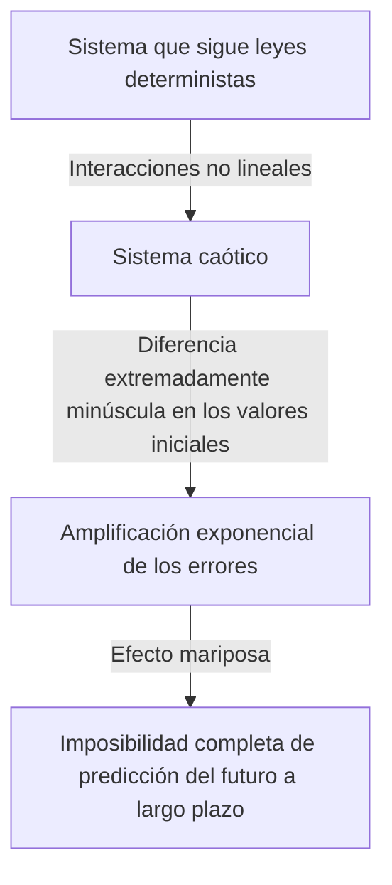

## 1. Introducción: ¿Qué es el Efecto Mariposa?

"¿El aleteo de las alas de una mariposa en Brasil puede provocar un tornado en Texas?"

Esta pregunta fascinante y misteriosa simboliza el **Efecto Mariposa**, uno de los conceptos más famosos y peor entendidos de la ciencia moderna. El efecto mariposa es un concepto central de la **Teoría del Caos**, estudiada en campos como la meteorología, la física y las matemáticas. Se refiere al fenómeno en el que "una minúscula diferencia en las condiciones iniciales se amplifica exponencialmente con el tiempo, resultando en una diferencia decisiva en el estado futuro".

En nuestra vida cotidiana, tendemos a pensar intuitivamente que las causas y los efectos son proporcionales. En otras palabras, es una visión lineal del mundo donde pequeños cambios traen pequeños resultados y grandes cambios traen grandes resultados. Sin embargo, contrariamente a esta intuición, muchos fenómenos en la naturaleza se comportan de una manera altamente no lineal. Una ligera fluctuación puede producir cambios enormes. La teoría del caos proporciona un marco matemático para desentrañar el orden oculto detrás de estos fenómenos complejos que parecen desordenados e impredecibles.

En este artículo, explicaremos a fondo la teoría del caos y el efecto mariposa, desde sus antecedentes históricos hasta sus fundamentos matemáticos, sus profundas conexiones con la geometría fractal y sus diversas aplicaciones en la sociedad moderna. Embarquémonos en un viaje para explorar por qué el futuro es impredecible y qué tipo de belleza se esconde dentro de esa imprevisibilidad.

---

## 2. Antecedentes Históricos: De [Poincaré](https://kenji.blog/es/p/poincare/) a Lorenz

Las semillas de la teoría del caos se remontan a la investigación del gran matemático francés del siglo XIX [Henri Poincaré](https://kenji.blog/es/p/poincare/). En ese momento, uno de los mayores desafíos de la física era el "problema de los tres cuerpos". Este era el problema de predecir el movimiento de tres cuerpos celestes, como el Sol, la Tierra y la Luna, ejerciendo fuerzas gravitacionales entre sí basándose en la mecánica newtoniana.

Al estudiar este problema profundamente, [Poincaré](https://kenji.blog/es/p/poincare/) descubrió que el movimiento de los cuerpos celestes podía volverse extremadamente complejo. Sugirió matemáticamente que errores inmensurablemente pequeños en las posiciones o velocidades iniciales podrían expandirse con el tiempo, llevando finalmente a trayectorias completamente diferentes de los cuerpos celestes. Este fue prácticamente el primer descubrimiento de un comportamiento caótico, mostrando que incluso en un sistema determinista (un sistema donde las leyes son completamente conocidas), la predicción a largo plazo a veces podría volverse imposible. Sin embargo, debido a las limitaciones de los métodos matemáticos y la potencia computacional (la ausencia de computadoras) en ese momento, este descubrimiento revolucionario no fue explorado profundamente durante décadas.

La situación cambió drásticamente en la década de 1960. Edward Lorenz, un meteorólogo del Instituto Tecnológico de Massachusetts (MIT), estaba simulando la convección atmosférica usando una de las primeras computadoras. Creó un conjunto de ecuaciones diferenciales no lineales simples para calcular variables como temperatura, presión y velocidad del viento, y computó los valores usando una computadora.

Un día, Lorenz intentó reiniciar una simulación desde la mitad de una ejecución anterior. Volvió a ingresar los números de un resultado impreso, pero ingresó por error "0.506"—un valor redondeado a tres decimales de la impresión—en lugar del valor interno de precisión de seis dígitos de "0.506127" que tenía la computadora.

Cuando Lorenz regresó de su descanso para tomar café, le esperaba una vista asombrosa. Los resultados de la simulación reiniciada coincidieron inicialmente con la ejecución anterior durante los primeros pasos, pero pronto comenzaron a trazar un patrón climático completamente diferente. Una diferencia inicial minúscula de solo 0.000127 resultó en un escenario climático futuro totalmente diferente. Este fue el momento del descubrimiento de un fenómeno que Lorenz llamó más tarde **Dependencia sensible a las condiciones iniciales**, que se conocería en el mundo como el efecto mariposa.

---

## 3. Fundamentos Matemáticos: Sistemas Dinámicos No Lineales y Ecuaciones de Lorenz

Para comprender matemáticamente la teoría del caos, es necesario captar los conceptos de **Sistemas Dinámicos** y **No linealidad**.

Un sistema dinámico es un modelo matemático de un sistema cuyo estado cambia con el tiempo. El estado futuro del sistema está completamente determinado por su estado actual y las leyes deterministas (generalmente ecuaciones diferenciales o en diferencias) que rigen el sistema. El punto clave aquí es que las leyes en sí mismas no contienen absolutamente ningún elemento probabilístico (azar, como tirar un dado).

Los sistemas dinámicos se clasifican a grandes rasgos en sistemas lineales y no lineales. En un sistema lineal, la causa y el efecto son proporcionales, y se aplica el principio de superposición, donde "la suma de las partes es igual al todo". Estos son relativamente fáciles de resolver matemáticamente y las predicciones son sencillas. Por otro lado, en los sistemas no lineales, las variables se multiplican entre sí o existen bucles de retroalimentación, rompiendo la relación proporcional entre causa y efecto. Exhibe un comportamiento donde "la suma de las partes difiere del todo", causando fenómenos extremadamente complejos. El caos ocurre solo en sistemas no lineales.

El conjunto más famoso de ecuaciones diferenciales no lineales que producen caos, derivado por Edward Lorenz a partir de un modelo de convección atmosférica, son las **Ecuaciones de Lorenz**. Consisten en las siguientes tres variables ($x, y, z$) y tres parámetros ($\sigma, \rho, \beta$).

$$
\frac{dx}{dt} = \sigma (y - x)
$$

$$
\frac{dy}{dt} = x (\rho - z) - y
$$

$$
\frac{dz}{dt} = x y - \beta z
$$

Aquí, cada variable tiene un significado físico:
- $x$ es la tasa de convección (velocidad de rotación del fluido)
- $y$ es la variación horizontal de la temperatura entre las corrientes ascendentes y descendentes
- $z$ es la desviación del perfil de temperatura vertical de la linealidad
- $\sigma$ (número de Prandtl), $\rho$ (número de Rayleigh) y $\beta$ (relación de aspecto del sistema) son parámetros.

Como valores de parámetros que muestran un comportamiento caótico típico, Lorenz eligió $\sigma = 10, \rho = 28, \beta = 8/3$. Si bien este sistema de ecuaciones es determinista, las soluciones nunca repiten estados pasados y continúan trazando trayectorias infinitamente complejas. Los términos no lineales en las ecuaciones, como $xz$ y $xy$, juegan un papel decisivo en la generación del caos.

---

## 4. Espacio de Fase y Atractores Extraños

Una herramienta poderosa para comprender visualmente el comportamiento de los sistemas dinámicos es el **Espacio de fase**. El espacio de fase es un espacio multidimensional capaz de representar todos los estados posibles de un sistema. El estado actual del sistema se representa como un "único punto" en este espacio de fase. A medida que avanza el tiempo, el estado cambiante del sistema se representa como una "trayectoria" trazada por el punto que se mueve a través del espacio de fase.

En muchos sistemas del mundo real con disipación (la propiedad de perder energía, como la fricción o la resistencia del aire), después de que pasa una cantidad suficiente de tiempo, el sistema finalmente se asienta en un estado específico (un punto) o un estado periódico (un bucle cerrado). Este lugar de asentamiento final se llama **Atractor**. Por ejemplo, el movimiento de un péndulo finalmente se detiene en su punto más bajo debido a la resistencia del aire. El atractor en este caso es un "punto único (punto fijo)". El atractor para un sistema que repite un movimiento periódico, como los latidos del corazón, es un "ciclo límite (curva cerrada)".

Sin embargo, en sistemas caóticos como las ecuaciones de Lorenz, surge un tipo de atractor completamente diferente. Este es el **Atractor Extraño**.

Cuando el atractor de Lorenz se traza en un espacio de fase 3D, revela una estructura asombrosamente hermosa y compleja que se asemeja a una mariposa con las alas extendidas o a dos ojos. Este atractor extraño tiene las siguientes características notables:

1. **Acotamiento**: La trayectoria no vuela hacia el infinito; siempre permanece dentro de una región específica del atractor.
2. **Aperiodicidad**: La trayectoria nunca cruza su propio camino pasado ni repite exactamente la misma ruta. Eternamente continúa trazando nuevos caminos.
3. **Dependencia sensible a las condiciones iniciales**: Las trayectorias que comienzan desde dos puntos iniciales extremadamente cercanos en el atractor se separarán mucho a lugares completamente diferentes dentro del atractor a medida que pasa el tiempo.

Aunque las trayectorias están confinadas dentro de un volumen finito, están restringidas a no cruzarse nunca (porque cruzarse violaría la premisa determinista de que "el mismo estado conduce al mismo futuro"). Para lograr esto, el espacio debe estar "plegado" infinitamente. Este proceso repetido de "estirar" y "plegar" (como amasar masa) es la esencia misma del caos y da lugar a la compleja estructura de los atractores extraños.

---

## 5. Mapa Logístico y Diagrama de Bifurcación

Otro modelo matemático importante para entender la teoría del caos de la manera más sencilla es el **Mapa logístico**. Se trata de una simple ecuación en diferencias cuadrática que modela la fluctuación de una población biológica (por ejemplo, el cambio anual en el número de conejos en una isla).

$$
x_{n+1} = r x_n (1 - x_n)
$$

Aquí,
- $x_n$ representa la población en la $n$-ésima generación (tomando un valor en el rango $0 \le x_n \le 1$ como una proporción de la capacidad de carga máxima del entorno).
- $x_{n+1}$ es la población de la próxima generación.
- $r$ es un parámetro que representa la tasa de reproducción (generalmente $0 \le r \le 4$).

Aunque esta ecuación es extremadamente simple, cambiar el valor del parámetro $r$ hace que exhiba comportamientos asombrosamente diversos y complejos:

- $0 < r < 1$: La población finalmente se extingue y $x$ converge a 0.
- $1 < r < 3$: La población converge a un cierto valor constante (punto fijo) y se estabiliza.
- Alrededor de $r = 3$: El punto fijo se vuelve inestable y la población comienza a alternar entre dos valores diferentes. Esto se llama **Bifurcación de duplicación de período**.
- A medida que $r$ aumenta aún más, las bifurcaciones donde el período se duplica a 4, 8, 16, etc., ocurren rápidamente.
- Más allá de $r \approx 3.56995$ (el punto de Feigenbaum), la periodicidad se rompe por completo y la población toma valores completamente impredecibles. Este es el estado del **Caos**.

Trazar el estado final del sistema (atractor) contra estos cambios en $r$ crea lo que se llama un **Diagrama de bifurcación**. El eje horizontal representa el parámetro $r$ y el eje vertical representa los valores finales de $x$.

Al observar el diagrama de bifurcación, podemos ver que dentro de la región caótica, hay "Ventanas" donde el orden se recupera repentinamente (por ejemplo, una región de período 3). Asombrosamente, si se amplía una parte de este diagrama de bifurcación, exhibe autosimilitud, donde exactamente el mismo patrón que la estructura general aparece infinitamente. El hecho de que una simple ecuación cuadrática contenga una estructura tan rica envió una gran conmoción a la comunidad matemática.

---

## 6. Exponente de Lyapunov: Cuantificando el Caos

El indicador utilizado para cuantificar matemática y estrictamente la "dependencia sensible a las condiciones iniciales" inherente a los sistemas caóticos es el **Exponente de Lyapunov**.

Considere dos estados iniciales extremadamente cercanos en el espacio de fase (con una distancia denotada como $\delta Z_0$) y observe cómo sus trayectorias se separan a una distancia $\delta Z(t)$ a medida que pasa el tiempo $t$. En el caso de un sistema caótico, esta distancia se expande exponencialmente en promedio.

$$
|\delta Z(t)| \approx e^{\lambda t} |\delta Z_0|
$$

Aquí, $\lambda$ (lambda) es el exponente de Lyapunov.
El exponente de Lyapunov representa la tasa promedio a la que las trayectorias adyacentes se separan (o se acercan entre sí).

- $\lambda < 0$: Las trayectorias se acercan entre sí y convergen a un punto fijo o ciclo límite (no es caos).
- $\lambda = 0$: La distancia entre las trayectorias permanece constante (por ejemplo, sistemas conservativos).
- $\lambda > 0$: Las trayectorias se separan exponencialmente. Este es el indicador decisivo del **Caos**.

En un sistema dinámico multidimensional, hay tantos exponentes de Lyapunov como dimensiones del espacio (el espectro de Lyapunov). Si existe al menos un exponente de Lyapunov positivo, el sistema se define como caótico. Cuanto mayor sea el exponente de Lyapunov positivo, más rápidamente se amplifican los errores minúsculos iniciales, acortando la escala de tiempo durante la cual el futuro es predecible (tiempo de Lyapunov). Esta es la razón matemática fundamental por la que los pronósticos meteorológicos pueden ser razonablemente precisos con unos días de anticipación, pero se vuelven completamente impredecibles con semanas de anticipación.

---

## 7. La Relación Entre Fractales y Caos

Al discutir la teoría del caos, no se puede omitir la geometría **Fractal**, propuesta por el matemático Benoit Mandelbrot. Un fractal es una figura en la que "no importa cuánto la amplíes, una estructura compleja similar (autosimilitud) idéntica a la totalidad aparece infinitamente". Ejemplos representativos incluyen el conjunto de Mandelbrot y el copo de nieve de Koch.

El caos y los fractales pueden parecer conceptos diferentes a primera vista, pero en realidad son dos caras de la misma moneda. Si tomas una sección transversal de un atractor extraño y la observas de cerca, encontrarás una estructura infinitamente estratificada, revelando que posee una estructura fractal.

La dinámica de "estirar y plegar" en el espacio de fase de un sistema caótico produce figuras fractales como resultado geométrico. Una de las características importantes de un fractal es que tiene una "dimensión fraccionaria (dimensión fractal)" que no es un número entero. Por ejemplo, una figura que es más compleja y llena el espacio que una línea 1D pero se queda corta de un plano 2D podría tener una dimensión de 1.26. Un atractor extraño es también una estructura fractal con una dimensión fraccionaria.

Si el caos es "dinámica compleja que emerge con el tiempo", entonces se puede decir que los fractales son "las huellas geométricas dejadas por esas dinámicas en el espacio". Muchos fenómenos naturales, como las formas de las rías, la ramificación de los árboles, las redes de vasos sanguíneos y las formas de las nubes, poseen estructuras fractales, y se cree que las dinámicas no lineales caóticas actúan detrás de sus procesos de formación.

---

## 8. Aplicaciones en el Mundo Real: De la Meteorología a la Economía

La teoría del caos no es un mero juego matemático. Las propiedades universales de la dependencia sensible a las condiciones iniciales y la dinámica no lineal han traído aplicaciones de amplio alcance a todos los campos del mundo real, trascendiendo la física.

### 8.1 Meteorología y Cambio Climático
La meteorología, el escenario del descubrimiento de Lorenz, es uno de los campos que más se ha beneficiado de la teoría del caos. La atmósfera está gobernada por complejas ecuaciones no lineales de dinámica de fluidos y termodinámica, lo que la hace inherentemente caótica. Hoy en día, el enfoque principal es la "predicción por conjuntos", que implica introducir intencionalmente ligeras fluctuaciones en los valores iniciales y ejecutar múltiples simulaciones simultáneamente, en lugar de depender de un solo pronóstico. Esto permite a los meteorólogos evaluar probabilísticamente la incertidumbre del pronóstico y comprender qué tan lejos en el futuro son posibles predicciones confiables.

### 8.2 Medicina y Biología
Los ritmos biológicos humanos también están profundamente entrelazados con el caos. Por ejemplo, se sabe que los intervalos de los latidos del corazón (fluctuaciones) de un corazón sano no son ni completamente regulares ni completamente aleatorios, sino que poseen propiedades fractales caóticas. Por el contrario, los latidos del corazón de pacientes con enfermedades cardíacas o ancianos pueden volverse demasiado regulares o completamente aleatorios. La pérdida de fluctuación caótica se está estudiando como un signo importante (biomarcador) que indica un deterioro de la salud. La dinámica no lineal también es esencial en el análisis de ondas cerebrales y en el modelado de la propagación de enfermedades infecciosas (como el modelo SIR en epidemiología).

### 8.3 Economía y Mercados Financieros
Los mercados financieros, como los mercados de valores y de divisas, son sistemas no lineales altamente complejos donde interactúan la psicología y las acciones de innumerables inversores. La economía tradicional asumía que los mercados eran eficientes y los precios seguían un paseo aleatorio (movimientos aleatorios que se ajustan a una distribución normal). Sin embargo, en los mercados reales, eventos extremos como colapsos y burbujas ocurren con mucha más frecuencia de lo que predice una distribución normal (el fenómeno de cola pesada). Al aplicar la teoría del caos y los fractales (como el modelo multifractal de Mandelbrot), se intenta modelar con mayor precisión las estructuras no lineales, la memoria a largo plazo y los riesgos de estallido de burbujas ocultos dentro de las fluctuaciones de los precios del mercado, aplicando este conocimiento a la gestión de riesgos.

### 8.4 Ingeniería y Control
El concepto de caos también es importante en el campo de la ingeniería. Los fenómenos caóticos se observan en muchos sistemas, como las vibraciones de las alas en los aviones (aleteo), la sincronización de osciladores no lineales en circuitos eléctricos y las perturbaciones en la salida de los láseres. Tradicionalmente, el caos se consideraba algo que debía "evitarse" o "eliminarse como ruido" porque es impredecible y desestabiliza los sistemas. Hoy en día, sin embargo, se ha desarrollado una tecnología llamada "Control del Caos", que utiliza la minúscula energía inherente a un sistema para guiarlo hábilmente de un estado caótico a un estado periódico deseado, estabilizándolo. También se están investigando aplicaciones para la comunicación criptográfica utilizando la aleatoriedad de las señales caóticas (criptografía del caos).

---

## 9. Implicaciones Filosóficas: Determinismo y Previsibilidad

El surgimiento de la teoría del caos ha traído un cambio de paradigma fundamental a la filosofía de la ciencia, particularmente con respecto a nuestra visión del mundo sobre el "Determinismo" y la "Previsibilidad".

El matemático francés del siglo XVIII Pierre-Simon Laplace propuso el siguiente experimento mental: "Si hubiera un intelecto que pudiera comprender completamente las posiciones y los momentos actuales de todos los átomos del universo y fuera lo suficientemente vasto como para analizarlos, para tal intelecto, el futuro, al igual que el pasado, estaría presente ante sus ojos". A este intelecto hipotético se le llama **Demonio de Laplace**, y simbolizaba una fuerte cosmovisión determinista del universo basada en la mecánica clásica.

El determinismo es la idea de que "si el estado actual está completamente determinado, el futuro se determina de manera única de acuerdo con las leyes de la física". Las ecuaciones manejadas por la teoría del caos (como las ecuaciones de Lorenz) son ecuaciones puramente deterministas que no contienen elementos probabilísticos. Por lo tanto, en principio, el demonio de Laplace debería poder predecir perfectamente el futuro de los sistemas caóticos también.

Sin embargo, la teoría del caos nos confrontó fríamente con los **Límites de la previsibilidad** en el mundo real. En realidad, es imposible medir cada estado inicial del universo con "precisión infinita (error cero)". Incluso sin considerar el principio de incertidumbre de la mecánica cuántica, nuestras capacidades de observación inherentemente tienen límites finitos.

En un sistema caótico, no importa cuán pequeño sea este error de observación, se amplifica exponencialmente con el tiempo, engullendo finalmente todo el sistema. En otras palabras, quedó claro que "ser determinista" y "ser predecible" son dos conceptos completamente diferentes. La teoría del caos sepultó al demonio de Laplace y enseñó a la humanidad la profunda verdad de que "incluso si las leyes se conocen perfectamente, el futuro puede ser fundamentalmente impredecible".

Este cambio de paradigma presenta una nueva visión del mundo: "Nuestro mundo es complejo e impredecible, pero detrás de él hay una hermosa estructura matemática determinista". En lugar de renunciar a la predicción perfecta, se ha abierto un camino para comprender el "orden a nivel macro" oculto dentro del caos estudiando las formas de los atractores y comprendiendo las distribuciones probabilísticas.

---

## 10. Conclusión

En este artículo, hemos explorado profundamente el efecto mariposa —donde minúsculas diferencias en las condiciones iniciales producen resultados masivos— y la teoría del caos que lo engloba.

Comenzando con la intuición de [Poincaré](https://kenji.blog/es/p/poincare/), pasando por el descubrimiento accidental de Lorenz a través de la computadora, la teoría del caos se ha convertido en un campo masivo que atraviesa las matemáticas y la física. Sus fundamentos matemáticos son altamente refinados y están llenos de asombro intelectual, como se ve en las hermosas trayectorias de los atractores extraños dibujadas por ecuaciones no lineales, la infinita autosimilitud observada en el mapa logístico y la cuantificación de la imprevisibilidad a través de los exponentes de Lyapunov.

La teoría del caos no solo nos enseña los límites del pronóstico del tiempo, sino que también proporciona una lente poderosa para comprender los fenómenos complejos que nos rodean, desde las fluctuaciones económicas y los latidos del corazón hasta la evolución de la vida. Revela que el mundo natural no es una simple máquina de relojería, sino un sistema dinámico lleno de imprevisibilidad y creatividad.

Determinista pero impredecible. Esta naturaleza aparentemente contradictoria es precisamente el mayor encanto de la teoría del caos. El hecho de que el futuro esté completamente determinado, pero nadie (y por muy potente que sea un ordenador) pueda conocer su futuro detallado, hace que nuestra percepción del universo sea más humilde y más rica. El mundo no lineal tejido por el caos y los fractales seguramente continuará fascinando a los científicos y produciendo nuevos descubrimientos en el futuro.

