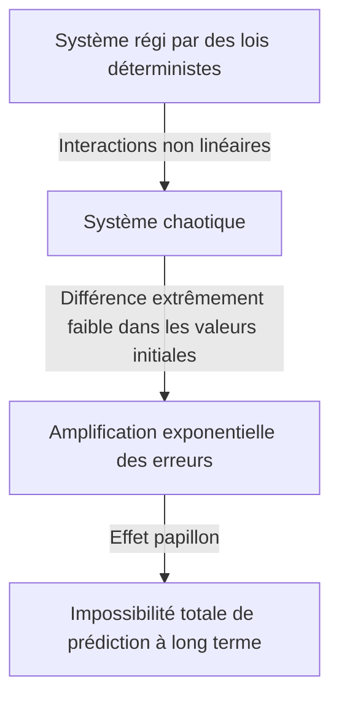

## 1. Introduction : Qu'est-ce que l'effet papillon ?

"Est-ce que le battement d'ailes d'un papillon au Brésil déclenche une tornade au Texas ?"

Cette question captivante et mystérieuse symbolise l’un des concepts les plus célèbres – et les plus mal compris – de la science moderne : l’**effet papillon**. L'effet papillon est un concept central de la **théorie du chaos**, un domaine étudié en météorologie, physique, mathématiques et bien plus encore. Il fait référence au phénomène dans lequel « de minuscules différences dans les conditions initiales s’amplifient de façon exponentielle au fil du temps, produisant finalement des différences décisives dans les états futurs ».

Dans notre vie quotidienne, nous avons tendance à supposer intuitivement une relation proportionnelle entre cause et effet – une vision du monde linéaire dans laquelle de petits changements produisent de petits résultats et de grands changements produisent de grands résultats. Cependant, de nombreux phénomènes naturels se comportent de manière hautement non linéaire, défiant cette intuition. Une infime fluctuation peut générer d’énormes changements. La théorie du chaos fournit le cadre mathématique permettant de démêler l’ordre caché qui se cache derrière des phénomènes complexes apparemment désordonnés et imprévisibles.

Dans cet article, nous explorerons en profondeur la théorie du chaos et l’effet papillon – depuis leur contexte historique et leurs fondements mathématiques, en passant par leurs liens profonds avec la géométrie fractale, jusqu’à leurs vastes applications dans la société moderne. Embarquons pour un voyage pour découvrir pourquoi l’avenir est imprévisible et quelle beauté se cache dans cette imprévisibilité.

---

## 2. Contexte historique : de Poincaré à Lorenz

Les germes de la théorie du chaos remontent aux recherches du grand mathématicien français Henri Poincaré à la fin du XIXe siècle. À l’époque, l’un des plus grands défis de la physique était le « problème des trois corps » : prédire le mouvement de trois corps célestes, tels que le Soleil, la Terre et la Lune, qui exercent une attraction gravitationnelle mutuelle, sur la base de la mécanique newtonienne.

En étudiant ce problème en profondeur, Poincaré a découvert que le mouvement des corps célestes pouvait devenir extraordinairement complexe. Il a suggéré mathématiquement la possibilité que des erreurs incommensurables dans les positions ou vitesses initiales puissent s'amplifier avec le temps et finalement rendre les orbites finales complètement différentes. Il s’agissait en fait de la première découverte d’un comportement chaotique – la découverte que même les systèmes déterministes (les systèmes dont les lois sont parfaitement connues) peuvent devenir impossibles à prédire à long terme. Cependant, en raison des limites des méthodes mathématiques et de la puissance de calcul (absence d’ordinateurs) de l’époque, cette découverte révolutionnaire est restée largement inexplorée pendant plusieurs décennies.

La situation a radicalement changé dans les années 1960. Edward Lorenz, météorologue au Massachusetts Institute of Technology (MIT), simulait la convection atmosphérique à l'aide d'un premier ordinateur. Il avait créé un ensemble d'équations différentielles non linéaires simples pour calculer des variables telles que la température, la pression et la vitesse du vent, en exécutant les calculs sur la machine.

Un jour, Lorenz tenta de relancer une simulation à partir d'un point intermédiaire. Il a saisi à nouveau les valeurs d'un imprimé, mais au lieu d'utiliser la valeur de précision à 6 chiffres « 0,506127 » stockée en interne par l'ordinateur, il a saisi « 0,506 » — la valeur arrondie à 3 chiffres imprimée sur le résultat.

Lorsque Lorenz revint de sa pause-café, un spectacle étonnant l'attendait. La simulation redémarrée correspondait aux résultats précédents pour les premières étapes, mais a rapidement commencé à tracer des conditions météorologiques complètement différentes. Une minuscule différence de valeur initiale de seulement 0,000127 avait produit un avenir météorologique complètement différent. Ce fut le moment de la découverte du phénomène que Lorenz appellera plus tard **Sensibilité aux conditions initiales**, qui deviendra mondialement connu sous le nom d'effet papillon.

---

## 3. Fondements mathématiques : systèmes dynamiques non linéaires et équations de Lorenz

Pour comprendre mathématiquement la théorie du chaos, il faut saisir les concepts de **Systèmes dynamiques** et de **Non-linéarité**.

Un système dynamique est un modèle mathématique d'un système dont l'état change avec le temps. L'état futur du système est entièrement déterminé par son état actuel et les lois déterministes qui le régissent (généralement des équations différentielles ou des équations aux différences). Fondamentalement, les lois elles-mêmes ne contiennent aucun élément probabiliste – pas de hasard comme un lancer de dés.

Les systèmes dynamiques sont largement divisés en systèmes linéaires et non linéaires. Dans les systèmes linéaires, la cause et l'effet sont proportionnels et le principe de superposition est valable : « la somme des parties est égale au tout ». Ces problèmes sont relativement faciles à résoudre mathématiquement et à prédire. Cependant, dans les systèmes non linéaires, les variables se multiplient ou des boucles de rétroaction existent, rompant la relation proportionnelle entre cause et effet. Ils présentent un comportement où « la somme des parties diffère du tout », donnant lieu à des phénomènes extrêmement complexes. Le chaos ne se produit que dans les systèmes non linéaires.

L'ensemble le plus célèbre d'équations différentielles couplées non linéaires qui produisent le chaos, dérivées par Edward Lorenz à partir d'un modèle de convection atmosphérique, sont les **équations de Lorenz**. Ils se composent de trois variables ( $x, y, z$ ) et de trois paramètres ( $\sigma, \rho, \beta$ ) :

$$
\frac{dx}{dt} = \sigma (y - x)
$$

$$
\frac{dy}{dt} = x (\rho - z) - y
$$

$$
\frac{dz}{dt} = x y - \beta z
$$

Ici, chaque variable a une signification physique :
- $x$ représente l'intensité de la convection (vitesse de rotation du fluide)
- $y$ représente la différence de température entre les flux ascendants et descendants
- $z$ représente l'écart du profil de température vertical par rapport à la linéarité
- $\sigma$ (numéro de Prandtl), $\rho$ (numéro de Rayleigh) et $\beta$ (rapport hauteur/largeur du système) sont des paramètres.

Pour les valeurs de paramètres présentant un comportement chaotique typique, Lorenz a choisi $\sigma = 10, \rho = 28, \beta = 8/3$. Bien que ce système d’équations soit déterministe, la solution ne répète jamais un état passé, traçant une trajectoire infiniment complexe. Les termes non linéaires $xz$ et $xy$ dans les équations jouent un rôle décisif dans la génération du chaos.

---

## 4. Espace de phase et attracteurs étranges

**Phase Space** est un outil puissant pour comprendre visuellement le comportement des systèmes dynamiques. L'espace des phases est un espace multidimensionnel capable de représenter tous les états imaginables d'un système. L'état actuel du système est représenté comme « un point unique » dans cet espace des phases. À mesure que le temps passe et que l'état du système change, le mouvement du point dans l'espace des phases trace une « trajectoire ».

Dans de nombreux systèmes du monde réel avec dissipation (propriétés qui provoquent une perte d'énergie, telles que le frottement ou la résistance de l'air), après un temps suffisant, le système finit par se stabiliser dans un état spécifique (un point) ou un état périodique (une boucle fermée). Cette destination finale est appelée un **Attracteur** (quelque chose qui attire les choses). Par exemple, le mouvement d'un pendule finit par s'arrêter à son point le plus bas en raison de la résistance de l'air ; dans ce cas, l'attracteur est un « point unique (point fixe) ». Pour les systèmes qui répètent un mouvement périodique, comme un battement de cœur, l'attracteur est un « cycle limite (courbe fermée) ».

Cependant, dans les systèmes chaotiques comme les équations de Lorenz, un type d’attracteur totalement différent apparaît : l’**Attracteur étrange**.

Lorsque l'attracteur de Lorenz est tracé dans l'espace des phases tridimensionnel, une structure complexe et d'une beauté à couper le souffle apparaît, ressemblant à un papillon déployant ses ailes ou à une paire d'yeux. Cet étrange attracteur possède les propriétés remarquables suivantes :

1. **Limites** : La trajectoire ne s'envole jamais vers l'infini ; il reste toujours dans une région spécifique de l'attracteur.
2. **Apériodicité** : La trajectoire ne croise jamais son propre chemin passé ni ne répète exactement le même itinéraire. Il trace à jamais un nouveau chemin.
3. **Sensibilité aux conditions initiales** : Deux trajectoires partant de points initiaux extrêmement proches sur l'attracteur sont séparées vers des emplacements entièrement différents au sein de l'attracteur au fil du temps.

Bien qu’elle soit confinée dans un volume fini, la trajectoire ne se croise jamais (le croisement violerait le postulat déterministe selon lequel « le même état mène au même futur »). Pour satisfaire cette contrainte, l'espace doit être « plié » à l'infini. Ce processus répété « d’étirement et de pliage » (un peu comme pétrir la pâte à pain) est l’essence du chaos et génère la structure complexe d’attracteurs étranges.

---

## 5. La carte logistique et les diagrammes de bifurcation

Un autre modèle mathématique important pour comprendre la théorie du chaos dans sa forme la plus simple est la **Carte logistique**. Il s’agit d’une simple équation quadratique qui modélise la dynamique des populations (par exemple, la variation annuelle du nombre de lapins sur une île).

$$
x_{n+1} = r x_n (1 - x_n)
$$

Ici:
- $x_n$ représente la population à la génération $n$ (en proportion de la capacité de charge maximale de l'environnement, allant de $0 \le x_n \le 1$).
- $x_{n+1}$ est la population de la prochaine génération.
- $r$ est un paramètre représentant le taux de reproduction (généralement $0 \le r \le 4$).

Cette équation est très simple, mais en faisant varier le paramètre $r$, elle présente un comportement étonnamment diversifié et complexe.

- $0 < r < 1$ : la population finit par disparaître et $x$ converge vers 0.
- $1 < r < 3$ : La population converge vers une valeur fixe (point fixe) et se stabilise.
- Près de $r = 3$ : le point fixe devient instable et la population commence à alterner entre deux valeurs distinctes. C'est ce qu'on appelle la **bifurcation par doublement des périodes**.
- À mesure que $r$ augmente encore, des bifurcations se produisent rapidement, la période doublant pour atteindre 4, 8, 16, et ainsi de suite.
- Au-delà de $r \approx 3.56995$ (le point Feigenbaum), la périodicité s'effondre complètement et la population prend des valeurs complètement imprévisibles. C'est l'état de **chaos**.

Un graphique traçant l'état final du système (attracteur) par rapport aux modifications de $r$ est appelé **Diagramme de bifurcation**. L'axe horizontal représente le paramètre $r$ et l'axe vertical représente les valeurs finales de $x$.

L'examen du diagramme de bifurcation révèle des « fenêtres » – des régions au sein du domaine chaotique où l'ordre rétablit soudainement (par exemple, une région de période 3). Remarquablement, zoomer sur des parties du diagramme de bifurcation révèle le même modèle global apparaissant à l’infini : l’autosimilarité. Le fait qu’une simple équation quadratique contienne une structure aussi riche a provoqué une onde de choc dans la communauté mathématique.

---

## 6. Exposants de Lyapunov : quantifier le chaos

La métrique permettant de quantifier rigoureusement et mathématiquement la « sensibilité aux conditions initiales » d'un système chaotique est l'**Exposant de Lyapunov**.

Considérons deux trajectoires partant d'états initiaux extrêmement proches dans l'espace des phases (séparés par une distance $\delta Z_0$) qui divergent jusqu'à une distance $\delta Z(t)$ au fil du temps $t$. Dans un système chaotique, cette distance augmente en moyenne de façon exponentielle.

$$
|\delta Z(t)| \approx e^{\lambda t} |\delta Z_0|
$$

Ici, $\lambda$ (lambda) est l'exposant de Lyapunov.
L'exposant de Lyapunov représente la vitesse moyenne à laquelle les trajectoires voisines divergent (ou convergent).

- $\lambda < 0$ : Les trajectoires convergent les unes vers les autres, s'installant dans un point fixe ou un cycle limite (non chaotique).
- $\lambda = 0$ : la distance entre les trajectoires est maintenue constante (par exemple, systèmes conservateurs).
- $\lambda > 0$ : les trajectoires divergent de façon exponentielle. C'est l'**indicateur définitif du chaos**.

Dans les systèmes dynamiques multidimensionnels, il y a autant d’exposants de Lyapunov (le spectre de Lyapunov) que de dimensions. S’il existe au moins un exposant de Lyapunov positif, le système est défini comme chaotique. Plus l'exposant de Lyapunov positif est grand, plus les petites erreurs initiales s'amplifient rapidement, raccourcissant l'échelle de temps prévisible (temps de Lyapunov). C’est la raison mathématique fondamentale pour laquelle les prévisions météorologiques sont raisonnablement précises quelques jours à l’avance mais deviennent complètement imprévisibles plusieurs semaines à l’avance.

---

## 7. La relation entre les fractales et le chaos

La géométrie **Fractale** proposée par le mathématicien Benoit Mandelbrot est indispensable à toute discussion sur la théorie du chaos. Une fractale est « une forme dans laquelle, quel que soit le degré de zoom, la même structure complexe (autosimilarité) apparaît à l'infini ». Des exemples représentatifs incluent l'ensemble de Mandelbrot et la courbe de Koch.

Le chaos et les fractales peuvent sembler être des concepts différents à première vue, mais ce sont en fait les deux faces d’une même médaille. Lorsque vous coupez la section transversale d'un attracteur étrange et que vous l'examinez en détail, une structure à couches infinies émerge, révélant une géométrie fractale.

La dynamique « d’étirement et de pliage » dans l’espace des phases d’un système chaotique produit des formes fractales comme conséquence géométrique. Une propriété importante des fractales est qu’elles possèdent une « dimension fractionnaire (dimension fractale) » non entière. Par exemple, une forme plus complexe qu’une ligne à une dimension qui remplit l’espace mais ne correspond pas à un plan à deux dimensions peut avoir une dimension de 1,26. Les attracteurs étranges sont également des structures fractales aux dimensions fractionnaires.

Si le chaos est « une dynamique complexe émergeant au fil du temps », alors les fractales sont « les empreintes géométriques que ces dynamiques gravent dans l'espace ». De nombreux phénomènes naturels – le littoral des rias, les branches d’arbres, les réseaux de vaisseaux sanguins, la forme des nuages ​​– présentent des structures fractales et on pense que leur formation est due à une dynamique non linéaire chaotique.

---

## 8. Applications concrètes : de la météo à l'économie

La théorie du chaos est bien plus qu’une curiosité mathématique. Les propriétés universelles de sensibilité aux conditions initiales et à la dynamique non linéaire ont apporté de nombreuses applications dans tous les domaines, bien au-delà de la physique.

### 8.1 Météorologie et changement climatique
La météorologie, théâtre de la découverte de Lorenz, est l'un des domaines qui a le plus bénéficié de la théorie du chaos. L'atmosphère est régie par des équations non linéaires complexes issues de la dynamique des fluides et de la thermodynamique et est intrinsèquement chaotique. Aujourd'hui, au lieu d'une prévision unique, l'approche dominante est la « prévision d'ensemble », c'est-à-dire l'exécution simultanée de plusieurs simulations avec de légères perturbations intentionnelles des valeurs initiales. Cela permet une évaluation probabiliste de l’incertitude des prévisions et une compréhension de la distance dans laquelle des prévisions fiables sont possibles.

### 8.2 Médecine et biologie
Les rythmes biologiques humains sont également profondément liés au chaos. Par exemple, la variabilité de la fréquence cardiaque d’un cœur sain n’est ni parfaitement régulière ni parfaitement aléatoire ; il présente des caractéristiques fractales chaotiques. Chez les patients cardiaques et les personnes âgées, le rythme cardiaque peut devenir soit trop régulier, soit complètement aléatoire. La perte de variabilité chaotique est étudiée comme un signe important (biomarqueur) de détérioration de la santé. La dynamique non linéaire est également essentielle pour analyser les ondes cérébrales et modéliser la propagation des maladies infectieuses (comme le modèle SIR en épidémiologie).

### 8.3 Économie et marchés financiers
Les marchés financiers tels que les marchés boursiers et les marchés des changes sont des systèmes non linéaires extrêmement complexes dans lesquels interagissent la psychologie et les actions d’innombrables investisseurs. L’économie traditionnelle supposait que les marchés sont efficaces et que les prix suivent une marche aléatoire (mouvements aléatoires avec une distribution normale), mais en réalité, les événements extrêmes comme les krachs et les bulles se produisent beaucoup plus fréquemment que ne le prédit une distribution normale (le phénomène de la grosse queue). En appliquant la théorie du chaos et les fractales (comme les modèles multifractaux proposés par Mandelbrot), les chercheurs tentent de modéliser avec plus de précision les structures non linéaires cachées dans les fluctuations de prix, les effets de mémoire à long terme et le risque d'effondrement de bulles afin d'améliorer la gestion des risques.

### 8.4 Ingénierie et contrôle
Le chaos est également un concept important en ingénierie. Des phénomènes chaotiques sont observés dans de nombreux systèmes : vibrations des ailes d'avion (flottement), synchronisation d'oscillateurs non linéaires dans les circuits électriques, perturbations de la sortie laser, etc. Traditionnellement, le chaos était considéré comme quelque chose à éviter : un bruit imprévisible qui déstabilisait les systèmes. Aujourd'hui, cependant, des techniques connues sous le nom de « Contrôle du chaos » ont été développées, qui guident habilement un système d'un état chaotique à un état périodique souhaitable en utilisant seulement une petite quantité d'énergie, le stabilisant ainsi. Des recherches sont également en cours pour appliquer la nature pseudo-aléatoire des signaux chaotiques aux communications cryptées (cryptographie basée sur le chaos).

---

## 9. Implications philosophiques : déterminisme et prévisibilité

L'avènement de la théorie du chaos a apporté un changement de paradigme fondamental dans la philosophie des sciences, en particulier en ce qui concerne notre vision du monde sur le « déterminisme » et la « prévisibilité ».

Le mathématicien français du XVIIIe siècle Pierre-Simon Laplace a proposé l'expérience de pensée suivante : « Si une intelligence pouvait connaître la position exacte et l'impulsion de chaque atome de l'univers et avait la capacité de les analyser, alors pour cette intelligence, ni le futur ni le passé ne seraient incertains – la chronologie entière resterait ouverte comme le présent. » Cette intelligence hypothétique est connue sous le nom de **Démon de Laplace** et symbolise la vision du monde déterministe robuste fondée sur la mécanique classique.

Le déterminisme soutient que « si l’état actuel est complètement déterminé, l’avenir est uniquement déterminé par les lois de la physique ». Les équations traitées par la théorie du chaos (telles que les équations de Lorenz) sont des équations purement déterministes ne contenant aucun élément probabiliste. En principe, le Démon de Laplace devrait donc être capable de prédire parfaitement l'avenir d'un système chaotique.

Cependant, la théorie du chaos expose impitoyablement les **limites de la prévisibilité** dans le monde réel. En réalité, il est impossible de mesurer chaque état initial de l’univers avec « une précision infinie (erreur zéro) ». Même en mettant de côté le principe d’incertitude de la mécanique quantique, nos capacités d’observation ont toujours des limites.

Dans les systèmes chaotiques, aussi petite que soit l’erreur d’observation, elle s’amplifie de façon exponentielle au fil du temps, finissant par engloutir le système tout entier. En d’autres termes, il est devenu clair que « être déterministe » et « être prévisible » sont des concepts totalement différents. La théorie du chaos a mis le démon de Laplace au repos et a enseigné à l’humanité la vérité profonde selon laquelle « même lorsque les lois sont parfaitement connues, l’avenir peut être intrinsèquement imprévisible ».

Ce changement de paradigme présente une nouvelle vision du monde : « Notre monde est complexe et imprévisible, mais derrière lui se cache une belle structure mathématique déterministe. » En abandonnant la prédiction parfaite et en examinant plutôt la forme des attracteurs ou en comprenant les distributions probabilistes, une voie a été ouverte pour comprendre « l’ordre à grande échelle » caché dans le chaos.

---

## 10. Conclusion

Dans cet article, nous avons approfondi l’effet papillon – dans lequel d’infimes différences dans les conditions initiales conduisent à des résultats très différents – et la théorie du chaos qui l’entoure.

Depuis l'intuition de Poincaré jusqu'à la découverte accidentelle par ordinateur de Lorenz, la théorie du chaos est devenue un vaste domaine couvrant les mathématiques et la physique. Les belles trajectoires d’attracteurs étranges tracées par des équations non linéaires, l’autosimilarité infinie trouvée dans la carte logistique et la quantification de l’imprévisibilité à travers les exposants de Lyapunov – ses fondements mathématiques sont extraordinairement raffinés et débordants d’émerveillement intellectuel.

La théorie du chaos a fourni un outil puissant pour comprendre les phénomènes complexes qui nous entourent – ​​depuis les limites de la prévision météorologique jusqu’aux fluctuations économiques, en passant par les battements de cœur et même l’évolution de la vie. Il nous enseigne que le monde naturel n’est en aucun cas une simple machine d’horlogerie, mais plutôt un système dynamique rempli d’imprévisibilité et de créativité.

Déterministe mais imprévisible – cette propriété apparemment paradoxale est le plus grand attrait de la théorie du chaos. Le fait que l’avenir soit complètement déterminé mais inconnaissable pour quiconque (même les ordinateurs les plus puissants) rend notre compréhension de l’univers plus humble et plus riche. Le monde non linéaire tissé de chaos et de fractales continuera de captiver les scientifiques et d’inspirer de nouvelles découvertes dans les années à venir.

