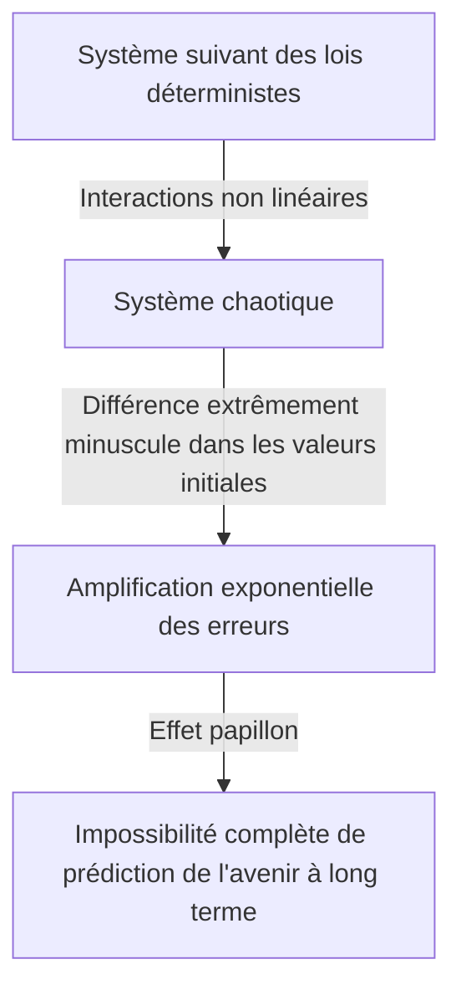

## 1. Introduction : Qu'est-ce que l'effet papillon ?

« Le battement d'ailes d'un papillon au Brésil peut-il provoquer une tornade au Texas ? »

Cette question fascinante et mystérieuse symbolise l'**Effet papillon**, l'un des concepts les plus célèbres et les plus mal compris de la science moderne. L'effet papillon est un concept central de la **Théorie du chaos**, étudiée dans des domaines tels que la météorologie, la physique et les mathématiques. Il fait référence au phénomène où « une différence minuscule dans les conditions initiales s'amplifie de manière exponentielle avec le temps, entraînant une différence décisive dans l'état futur ».

Dans notre vie quotidienne, nous avons intuitivement tendance à penser que les causes et les effets sont proportionnels. En d'autres termes, c'est une vision linéaire du monde où de petits changements apportent de petits résultats, et de grands changements apportent de grands résultats. Cependant, contrairement à cette intuition, de nombreux phénomènes dans la nature se comportent de manière hautement non linéaire. Une légère fluctuation peut produire d'énormes changements. La théorie du chaos fournit un cadre mathématique pour démêler l'ordre caché derrière ces phénomènes complexes apparemment désordonnés et imprévisibles.

Dans cet article, nous expliquerons en profondeur la théorie du chaos et l'effet papillon, de leur contexte historique à leurs fondements mathématiques, leurs liens profonds avec la géométrie fractale et leurs diverses applications dans la société moderne. Embarquons pour un voyage afin d'explorer pourquoi l'avenir est imprévisible et quel type de beauté se cache dans cette imprévisibilité.

---

## 2. Contexte historique : De [Poincaré](https://kenji.blog/fr/p/poincare/) à Lorenz

Les germes de la théorie du chaos remontent aux recherches du grand mathématicien français du 19ème siècle, [Henri Poincaré](https://kenji.blog/fr/p/poincare/). À l'époque, l'un des plus grands défis de la physique était le « problème des trois corps ». Il s'agissait du problème de la prédiction du mouvement de trois corps célestes, tels que le Soleil, la Terre et la Lune, exerçant des forces gravitationnelles les uns sur les autres sur la base de la mécanique newtonienne.

En étudiant ce problème en profondeur, [Poincaré](https://kenji.blog/fr/p/poincare/) a découvert que le mouvement des corps célestes pouvait devenir extrêmement complexe. Il a suggéré mathématiquement que des erreurs incommensurablement petites dans les positions ou les vitesses initiales pourraient s'étendre avec le temps, conduisant finalement à des trajectoires complètement différentes des corps célestes. Ce fut pratiquement la première découverte d'un comportement chaotique, montrant que même dans un système déterministe (un système où les lois sont complètement connues), la prédiction à long terme pouvait parfois devenir impossible. Cependant, en raison des limites des méthodes mathématiques et de la puissance de calcul (l'absence d'ordinateurs) de l'époque, cette découverte révolutionnaire n'a pas été explorée en profondeur pendant des décennies.

La situation a changé de manière spectaculaire dans les années 1960. Edward Lorenz, météorologue au Massachusetts Institute of Technology (MIT), simulait la convection atmosphérique à l'aide d'un des premiers ordinateurs. Il a créé un ensemble d'équations différentielles non linéaires simples pour calculer des variables telles que la température, la pression et la vitesse du vent, et a calculé les valeurs à l'aide d'un ordinateur.

Un jour, Lorenz a tenté de relancer une simulation à partir du milieu d'une exécution précédente. Il a rentré les nombres à partir d'un résultat imprimé, mais il a tapé par erreur "0.506" — une valeur arrondie à trois décimales à partir de l'impression — au lieu de la valeur de précision interne à six chiffres de "0.506127" détenue par l'ordinateur.

Lorsque Lorenz est revenu de sa pause café, un spectacle étonnant l'attendait. Les résultats de la simulation redémarrée correspondaient initialement à l'exécution précédente pour les premières étapes, mais ont rapidement commencé à tracer un modèle météorologique complètement différent. Une différence initiale minuscule de seulement 0.000127 a abouti à un scénario météorologique futur totalement différent. Ce fut le moment de la découverte d'un phénomène que Lorenz a appelé plus tard **Dépendance sensible aux conditions initiales**, qui sera connu dans le monde sous le nom d'effet papillon.

---

## 3. Fondements mathématiques : Systèmes dynamiques non linéaires et équations de Lorenz

Pour comprendre mathématiquement la théorie du chaos, il est nécessaire de saisir les concepts de **Systèmes dynamiques** et de **Non-linéarité**.

Un système dynamique est un modèle mathématique d'un système dont l'état change avec le temps. L'état futur du système est complètement déterminé par son état actuel et les lois déterministes (généralement des équations différentielles ou aux différences) qui régissent le système. Le point clé ici est que les lois elles-mêmes ne contiennent absolument aucun élément probabiliste (le hasard, comme lancer un dé).

Les systèmes dynamiques sont globalement classés en systèmes linéaires et non linéaires. Dans un système linéaire, la cause et l'effet sont proportionnels, et le principe de superposition s'applique, où « la somme des parties est égale au tout ». Ceux-ci sont relativement faciles à résoudre mathématiquement, et les prédictions sont simples. D'autre part, dans les systèmes non linéaires, les variables sont multipliées entre elles ou des boucles de rétroaction existent, brisant la relation proportionnelle entre la cause et l'effet. Il présente un comportement où « la somme des parties diffère du tout », provoquant des phénomènes extrêmement complexes. Le chaos ne se produit que dans les systèmes non linéaires.

L'ensemble le plus célèbre d'équations différentielles non linéaires qui produisent le chaos, dérivé par Edward Lorenz à partir d'un modèle de convection atmosphérique, sont les **Équations de Lorenz**. Elles se composent des trois variables suivantes ($x, y, z$) et de trois paramètres ($\sigma, \rho, \beta$).

$$
\frac{dx}{dt} = \sigma (y - x)
$$

$$
\frac{dy}{dt} = x (\rho - z) - y
$$

$$
\frac{dz}{dt} = x y - \beta z
$$

Ici, chaque variable a une signification physique :
- $x$ est le taux de convection (vitesse de rotation du fluide)
- $y$ est la variation horizontale de température entre les courants ascendants et descendants
- $z$ est l'écart du profil de température vertical par rapport à la linéarité
- $\sigma$ (nombre de Prandtl), $\rho$ (nombre de Rayleigh) et $\beta$ (rapport d'aspect du système) sont des paramètres.

Comme valeurs de paramètres montrant un comportement chaotique typique, Lorenz a choisi $\sigma = 10, \rho = 28, \beta = 8/3$. Bien que ce système d'équations soit déterministe, les solutions ne répètent jamais les états passés et continuent de tracer des trajectoires infiniment complexes. Les termes non linéaires dans les équations, tels que $xz$ et $xy$, jouent un rôle décisif dans la génération du chaos.

---

## 4. Espace des phases et attracteurs étranges

Un outil puissant pour comprendre visuellement le comportement des systèmes dynamiques est l'**Espace des phases**. L'espace des phases est un espace multidimensionnel capable de représenter tous les états possibles d'un système. L'état actuel du système est représenté comme un « point unique » dans cet espace des phases. Au fur et à mesure que le temps avance, l'état changeant du système est décrit comme une « trajectoire » tracée par le point se déplaçant à travers l'espace des phases.

Dans de nombreux systèmes du monde réel avec dissipation (la propriété de perdre de l'énergie, comme le frottement ou la résistance de l'air), après qu'un laps de temps suffisant s'est écoulé, le système finit par se stabiliser dans un état spécifique (un point) ou un état périodique (une boucle fermée). Ce lieu d'installation final est appelé un **Attracteur**. Par exemple, le mouvement d'un pendule finit par s'arrêter à son point le plus bas en raison de la résistance de l'air. L'attracteur dans ce cas est un « point unique (point fixe) ». L'attracteur pour un système qui répète un mouvement périodique, comme un battement de cœur, est un « cycle limite (courbe fermée) ».

Cependant, dans les systèmes chaotiques comme les équations de Lorenz, un type d'attracteur complètement différent émerge. Il s'agit de l'**Attracteur étrange**.

Lorsque l'attracteur de Lorenz est tracé dans un espace des phases 3D, il révèle une structure d'une beauté à couper le souffle et complexe ressemblant à un papillon aux ailes déployées ou à deux yeux. Cet attracteur étrange présente les caractéristiques remarquables suivantes :

1. **Caractère borné** : La trajectoire ne s'envole pas vers l'infini ; elle reste toujours dans une région spécifique de l'attracteur.
2. **Apériodicité** : La trajectoire ne croise jamais son propre chemin passé ni ne répète exactement le même itinéraire. Elle continue éternellement à tracer de nouveaux chemins.
3. **Dépendance sensible aux conditions initiales** : Les trajectoires partant de deux points initiaux extrêmement proches sur l'attracteur seront séparées loin l'une de l'autre vers des endroits complètement différents au sein de l'attracteur au fil du temps.

Même si les trajectoires sont confinées dans un volume fini, elles sont contraintes de ne jamais se croiser (car se croiser violerait la prémisse déterministe selon laquelle « le même état conduit au même avenir »). Pour y parvenir, l'espace doit être « plié » à l'infini. Ce processus répété d'« étirement » et de « pliage » (comme pétrir de la pâte) est l'essence même du chaos et donne naissance à la structure complexe des attracteurs étranges.

---

## 5. Suite logistique et diagramme de bifurcation

Un autre modèle mathématique important pour comprendre la théorie du chaos de la manière la plus simple est la **Suite logistique**. Il s'agit d'une simple équation aux différences quadratique modélisant la fluctuation d'une population biologique (par exemple, le changement annuel du nombre de lapins sur une île).

$$
x_{n+1} = r x_n (1 - x_n)
$$

Ici,
- $x_n$ représente la population à la $n$-ième génération (prenant une valeur dans la plage $0 \le x_n \le 1$ en tant que ratio de la capacité de charge maximale de l'environnement).
- $x_{n+1}$ est la population de la génération suivante.
- $r$ est un paramètre représentant le taux de reproduction (généralement $0 \le r \le 4$).

Bien que cette équation soit extrêmement simple, modifier la valeur du paramètre $r$ la fait présenter des comportements étonnamment divers et complexes :

- $0 < r < 1$ : La population finit par s'éteindre, et $x$ converge vers 0.
- $1 < r < 3$ : La population converge vers une certaine valeur constante (point fixe) et se stabilise.
- Autour de $r = 3$ : Le point fixe devient instable, et la population commence à alterner entre deux valeurs différentes. C'est ce qu'on appelle la **Bifurcation par doublement de période**.
- À mesure que $r$ augmente encore, les bifurcations où la période double à 4, 8, 16, etc., se produisent rapidement.
- Au-delà de $r \approx 3.56995$ (le point de Feigenbaum), la périodicité s'effondre complètement et la population prend des valeurs complètement imprévisibles. C'est l'état de **Chaos**.

Tracer l'état final du système (attracteur) par rapport à ces changements de $r$ crée ce que l'on appelle un **Diagramme de bifurcation**. L'axe horizontal représente le paramètre $r$, et l'axe vertical représente les valeurs finales de $x$.

En regardant le diagramme de bifurcation, nous pouvons voir qu'au sein de la région chaotique, il y a des « Fenêtres » où l'ordre se rétablit soudainement (par exemple, une région de période 3). Étonnamment, si vous agrandissez une partie de ce diagramme de bifurcation, il présente une autosimilarité, où le modèle exact de la structure globale apparaît à l'infini. Le fait qu'une simple équation quadratique contienne une structure aussi riche a provoqué une onde de choc au sein de la communauté mathématique.

---

## 6. Exposant de Lyapunov : Quantifier le chaos

L'indicateur utilisé pour quantifier strictement mathématiquement la « dépendance sensible aux conditions initiales » inhérente aux systèmes chaotiques est l'**Exposant de Lyapunov**.

Considérez deux états initiaux extrêmement proches dans l'espace des phases (avec une distance notée $\delta Z_0$) et observez comment leurs trajectoires se séparent jusqu'à une distance $\delta Z(t)$ à mesure que le temps $t$ passe. Dans le cas d'un système chaotique, cette distance augmente de manière exponentielle en moyenne.

$$
|\delta Z(t)| \approx e^{\lambda t} |\delta Z_0|
$$

Ici, $\lambda$ (lambda) est l'exposant de Lyapunov.
L'exposant de Lyapunov représente le taux moyen auquel les trajectoires adjacentes se séparent (ou se rapprochent).

- $\lambda < 0$ : Les trajectoires se rapprochent et convergent vers un point fixe ou un cycle limite (pas de chaos).
- $\lambda = 0$ : La distance entre les trajectoires reste constante (par exemple, systèmes conservatifs).
- $\lambda > 0$ : Les trajectoires sont séparées de manière exponentielle. C'est l'indicateur décisif du **Chaos**.

Dans un système dynamique multidimensionnel, il y a autant d'exposants de Lyapunov que de dimensions de l'espace (le spectre de Lyapunov). Si au moins un exposant de Lyapunov positif existe, le système est défini comme chaotique. Plus l'exposant de Lyapunov positif est grand, plus les erreurs minuscules initiales s'amplifient rapidement, raccourcissant l'échelle de temps sur laquelle l'avenir est prévisible (temps de Lyapunov). C'est la raison mathématique fondamentale pour laquelle les prévisions météorologiques peuvent être raisonnablement précises quelques jours à l'avance, mais deviennent complètement imprévisibles des semaines à l'avance.

---

## 7. La relation entre les fractales et le chaos

En discutant de la théorie du chaos, on ne peut omettre la géométrie **Fractale**, proposée par le mathématicien Benoît Mandelbrot. Une fractale est une figure dans laquelle « peu importe combien vous l'agrandissez, une structure complexe similaire (autosimilarité) identique à l'ensemble apparaît à l'infini ». Des exemples représentatifs incluent l'ensemble de Mandelbrot et le flocon de Koch.

Le chaos et les fractales peuvent sembler être des concepts différents au premier abord, mais ils sont en fait les deux faces d'une même médaille. Si vous prenez une coupe transversale d'un attracteur étrange et que vous l'observez attentivement, vous trouverez une structure infiniment stratifiée, révélant qu'il possède une structure fractale.

La dynamique d'« étirement et de pliage » dans l'espace des phases d'un système chaotique produit des figures fractales comme résultat géométrique. L'une des caractéristiques importantes d'une fractale est qu'elle a une « dimension fractionnaire (dimension fractale) » qui n'est pas un nombre entier. Par exemple, une figure qui est plus complexe et qui remplit l'espace qu'une ligne 1D mais n'atteint pas un plan 2D pourrait avoir une dimension de 1.26. Un attracteur étrange est également une structure fractale avec une dimension fractionnaire.

Si le chaos est « des dynamiques complexes émergeant au fil du temps », alors on peut dire que les fractales sont « les empreintes géométriques laissées par ces dynamiques dans l'espace ». De nombreux phénomènes naturels, tels que les formes des côtes à rias, la ramification des arbres, les réseaux de vaisseaux sanguins et les formes des nuages, possèdent des structures fractales, et on pense que des dynamiques non linéaires chaotiques sont à l'œuvre derrière leurs processus de formation.

---

## 8. Applications dans le monde réel : De la météorologie à l'économie

La théorie du chaos n'est pas qu'un simple jeu mathématique. Les propriétés universelles de la dépendance sensible aux conditions initiales et de la dynamique non linéaire ont apporté des applications très variées dans tous les domaines du monde réel, transcendant la physique.

### 8.1 Météorologie et changement climatique
La météorologie, théâtre de la découverte de Lorenz, est l'un des domaines qui a le plus bénéficié de la théorie du chaos. L'atmosphère est régie par des équations non linéaires complexes de la dynamique des fluides et de la thermodynamique, ce qui la rend intrinsèquement chaotique. Aujourd'hui, l'approche dominante est la « prévision d'ensemble », qui consiste à introduire intentionnellement de légères fluctuations dans les valeurs initiales et à exécuter de multiples simulations simultanément, plutôt que de s'appuyer sur une seule prévision. Cela permet aux météorologues d'évaluer de manière probabiliste l'incertitude des prévisions et de comprendre jusqu'à quand des prédictions fiables sont possibles dans le futur.

### 8.2 Médecine et biologie
Les rythmes biologiques humains sont également profondément liés au chaos. Par exemple, il est connu que les intervalles de battement de cœur (fluctuations) d'un cœur sain ne sont ni complètement réguliers ni complètement aléatoires, mais possèdent plutôt des propriétés fractales chaotiques. Inversement, les battements de cœur des patients atteints de maladies cardiaques ou des personnes âgées peuvent devenir trop réguliers ou complètement aléatoires. La perte de fluctuation chaotique est étudiée comme un signe important (biomarqueur) indiquant une détérioration de la santé. La dynamique non linéaire est également essentielle dans l'analyse des ondes cérébrales et la modélisation de la propagation des maladies infectieuses (comme le modèle SIR en épidémiologie).

### 8.3 Économie et marchés financiers
Les marchés financiers, tels que les marchés boursiers et des changes, sont des systèmes non linéaires très complexes où la psychologie et les actions d'innombrables investisseurs interagissent. L'économie traditionnelle supposait que les marchés étaient efficaces et que les prix suivaient une marche aléatoire (des mouvements aléatoires conformes à une distribution normale). Cependant, sur les marchés réels, des événements extrêmes comme les krachs et les bulles se produisent beaucoup plus fréquemment qu'une distribution normale ne le prévoit (le phénomène des queues épaisses). En appliquant la théorie du chaos et les fractales (comme le modèle multifractal de Mandelbrot), des tentatives sont faites pour modéliser plus précisément les structures non linéaires, la mémoire à long terme et les risques d'éclatement de bulles cachés dans les fluctuations des prix du marché, appliquant ces connaissances à la gestion des risques.

### 8.4 Ingénierie et contrôle
Le concept de chaos est également important dans le domaine de l'ingénierie. Des phénomènes chaotiques sont observés dans de nombreux systèmes, tels que les vibrations des ailes des avions (flottement), la synchronisation des oscillateurs non linéaires dans les circuits électriques et les perturbations de la sortie des lasers. Traditionnellement, le chaos était considéré comme quelque chose à « éviter » ou à « éliminer comme bruit » car il est imprévisible et déstabilise les systèmes. Aujourd'hui, cependant, une technologie appelée « Contrôle du chaos » s'est développée, qui utilise la minuscule énergie inhérente à un système pour le guider habilement d'un état chaotique vers un état périodique souhaité, le stabilisant. Des applications pour la communication cryptographique utilisant le caractère aléatoire des signaux chaotiques (cryptographie du chaos) sont également à l'étude.

---

## 9. Implications philosophiques : Déterminisme et prévisibilité

L'émergence de la théorie du chaos a apporté un changement de paradigme fondamental à la philosophie des sciences, en particulier en ce qui concerne notre vision du monde sur le « Déterminisme » et la « Prévisibilité ».

Le mathématicien français du 18ème siècle, Pierre-Simon Laplace, a proposé l'expérience de pensée suivante : « Si un intellect pouvait saisir complètement les positions et les quantités de mouvement actuelles de tous les atomes de l'univers et était suffisamment vaste pour les analyser, pour un tel intellect, l'avenir, tout comme le passé, serait présent devant ses yeux. » Cet intellect hypothétique est appelé le **Démon de Laplace**, et il symbolisait une vision du monde fortement déterministe de l'univers basée sur la mécanique classique.

Le déterminisme est l'idée que « si l'état actuel est complètement déterminé, l'avenir est déterminé de manière unique selon les lois de la physique ». Les équations manipulées par la théorie du chaos (telles que les équations de Lorenz) sont des équations purement déterministes qui ne contiennent aucun élément probabiliste. Par conséquent, en principe, le démon de Laplace devrait être capable de prédire parfaitement l'avenir des systèmes chaotiques également.

Cependant, la théorie du chaos nous a froidement confrontés aux **Limites de la prévisibilité** dans le monde réel. En réalité, il est impossible de mesurer chaque état initial de l'univers avec une « précision infinie (zéro erreur) ». Même sans considérer le principe d'incertitude de la mécanique quantique, nos capacités d'observation ont intrinsèquement des limites finies.

Dans un système chaotique, peu importe la taille de cette erreur d'observation, elle s'amplifie de manière exponentielle avec le temps, finissant par engloutir l'ensemble du système. En d'autres termes, il est devenu clair qu'« être déterministe » et « être prévisible » sont deux concepts entièrement différents. La théorie du chaos a mis le démon de Laplace au repos et a enseigné à l'humanité la profonde vérité que « même si les lois sont parfaitement connues, l'avenir peut être fondamentalement imprévisible ».

Ce changement de paradigme présente une nouvelle vision du monde : « Notre monde est complexe et imprévisible, mais derrière lui se cache une belle structure mathématique déterministe. » Au lieu de renoncer à une prédiction parfaite, une voie s'est ouverte pour comprendre l'« ordre à un niveau macro » caché dans le chaos en étudiant les formes des attracteurs et en comprenant les distributions probabilistes.

---

## 10. Conclusion

Dans cet article, nous avons exploré en profondeur l'effet papillon — où des différences minuscules dans les conditions initiales produisent des résultats massifs — et la théorie du chaos qui l'englobe.

Partant de l'intuition de [Poincaré](https://kenji.blog/fr/p/poincare/), passant par la découverte accidentelle de Lorenz via l'ordinateur, la théorie du chaos est devenue un vaste domaine traversant les mathématiques et la physique. Ses fondements mathématiques sont très raffinés et pleins d'émerveillement intellectuel, comme on le voit dans les belles trajectoires d'attracteurs étranges dessinées par des équations non linéaires, l'infinie autosimilarité observée dans la suite logistique et la quantification de l'imprévisibilité à travers les exposants de Lyapunov.

La théorie du chaos nous enseigne non seulement les limites de la prévision météorologique, mais fournit également une lentille puissante pour comprendre les phénomènes complexes qui nous entourent, des fluctuations économiques et des battements cardiaques à l'évolution de la vie. Elle révèle que le monde naturel n'est pas une simple machine à mouvement d'horlogerie, mais un système dynamique rempli d'imprévisibilité et de créativité.

Déterministe mais imprévisible. Cette nature apparemment contradictoire est précisément le plus grand charme de la théorie du chaos. Le fait que l'avenir soit complètement déterminé, et pourtant personne (et peu importe la puissance d'un ordinateur) ne puisse connaître son avenir détaillé, rend notre perception de l'univers plus humble et plus riche. Le monde non linéaire tissé par le chaos et les fractales continuera sûrement à fasciner les scientifiques et à apporter de nouvelles découvertes à l'avenir.

