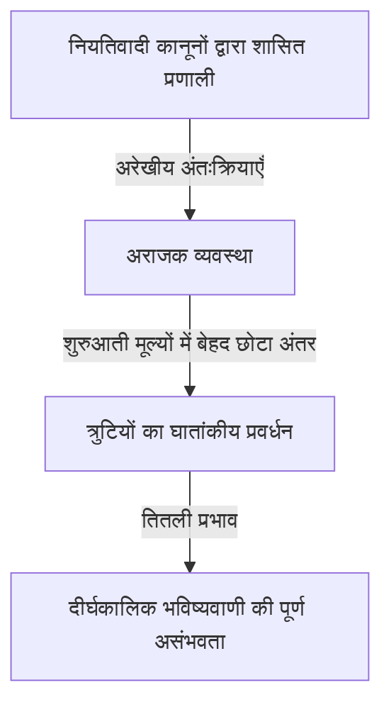
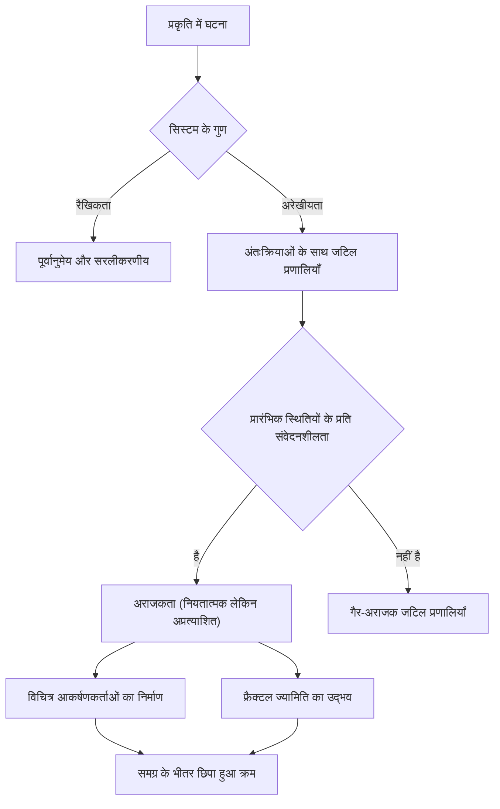

## 1. परिचय: तितली प्रभाव क्या है?

"क्या ब्राज़ील में तितली के पंखों के फड़फड़ाने से टेक्सास में बवंडर आ जाता है?"

यह लुभावना और रहस्यमय प्रश्न आधुनिक विज्ञान की सबसे प्रसिद्ध - और सबसे गलत समझी जाने वाली - अवधारणाओं में से एक का प्रतीक है: **तितली प्रभाव**। तितली प्रभाव **अराजकता सिद्धांत** के भीतर एक मुख्य अवधारणा है, जो मौसम विज्ञान, भौतिकी, गणित और बहुत कुछ में अध्ययन किया जाने वाला क्षेत्र है। यह उस घटना को संदर्भित करता है जिसमें "प्रारंभिक स्थितियों में छोटे अंतर समय के साथ तेजी से बढ़ते हैं, अंततः भविष्य की स्थितियों में निर्णायक अंतर पैदा करते हैं।"

हमारे रोजमर्रा के जीवन में, हम सहज रूप से कारण और प्रभाव के बीच एक आनुपातिक संबंध मान लेते हैं - एक रैखिक विश्वदृष्टि जिसमें छोटे परिवर्तन छोटे परिणाम उत्पन्न करते हैं और बड़े परिवर्तन बड़े परिणाम उत्पन्न करते हैं। हालाँकि, प्राकृतिक दुनिया में कई घटनाएँ इस अंतर्ज्ञान को धता बताते हुए अत्यधिक अरेखीय तरीके से व्यवहार करती हैं। एक छोटा सा उतार-चढ़ाव भारी परिवर्तन उत्पन्न कर सकता है। अराजकता सिद्धांत ऐसी प्रतीत होने वाली अव्यवस्थित और अप्रत्याशित जटिल घटनाओं के पीछे छिपी छिपी व्यवस्था को उजागर करने के लिए गणितीय ढांचा प्रदान करता है।

इस लेख में, हम अराजकता सिद्धांत और तितली प्रभाव का पूरी तरह से पता लगाएंगे - उनकी ऐतिहासिक पृष्ठभूमि और गणितीय नींव से, फ्रैक्टल ज्यामिति के साथ उनके गहरे संबंधों के माध्यम से, आधुनिक समाज में उनके व्यापक अनुप्रयोगों तक। आइए हम यह जानने के लिए एक यात्रा पर निकलें कि भविष्य अप्रत्याशित क्यों है, और उस अप्रत्याशितता के भीतर क्या सुंदरता छिपी है।

---

## 2. ऐतिहासिक पृष्ठभूमि: पोंकारे से लोरेंज तक

अराजकता सिद्धांत के बीज 19वीं शताब्दी के अंत में महान फ्रांसीसी गणितज्ञ हेनरी पोंकारे के शोध में खोजे जा सकते हैं। उस समय, भौतिकी में सबसे बड़ी चुनौतियों में से एक "थ्री-बॉडी प्रॉब्लम" थी - न्यूटोनियन यांत्रिकी के आधार पर, सूर्य, पृथ्वी और चंद्रमा जैसे तीन खगोलीय पिंडों की गति की भविष्यवाणी करना, जो परस्पर गुरुत्वाकर्षण आकर्षण पैदा करते हैं।

इस समस्या का गहराई से अध्ययन करते हुए, पोंकारे ने पाया कि आकाशीय पिंडों की गति असाधारण रूप से जटिल हो सकती है। उन्होंने गणितीय रूप से इस संभावना का सुझाव दिया कि प्रारंभिक स्थिति या वेग में बेहद छोटी त्रुटियां समय के साथ बढ़ सकती हैं और अंततः अंतिम कक्षाओं को पूरी तरह से अलग बना सकती हैं। वास्तव में, यह अराजक व्यवहार की पहली खोज थी - यह खोज कि नियतात्मक प्रणालियाँ (ऐसी प्रणालियाँ जिनके नियम पूरी तरह से ज्ञात हैं) भी लंबी अवधि में भविष्यवाणी करना असंभव हो सकता है। हालाँकि, उस समय की गणितीय विधियों और कम्प्यूटेशनल शक्ति (कंप्यूटर की अनुपस्थिति) की सीमाओं के कारण, यह अभूतपूर्व खोज कई दशकों तक काफी हद तक अज्ञात रही।

1960 के दशक में स्थिति नाटकीय रूप से बदल गई। मैसाचुसेट्स इंस्टीट्यूट ऑफ टेक्नोलॉजी (एमआईटी) के मौसम विज्ञानी एडवर्ड लोरेंज एक प्रारंभिक कंप्यूटर का उपयोग करके वायुमंडलीय संवहन का अनुकरण कर रहे थे। उन्होंने मशीन पर गणना चलाकर तापमान, दबाव और हवा की गति जैसे चर की गणना करने के लिए सरल गैर-रेखीय अंतर समीकरणों का एक सेट बनाया था।

एक दिन, लॉरेन्ज़ ने एक मध्यवर्ती बिंदु से सिमुलेशन को फिर से शुरू करने का प्रयास किया। उन्होंने एक प्रिंटआउट से मूल्यों को फिर से दर्ज किया, लेकिन कंप्यूटर द्वारा आंतरिक रूप से संग्रहीत 6-अंकीय सटीक मान "0.506127" का उपयोग करने के बजाय, उन्होंने "0.506" दर्ज किया - आउटपुट पर मुद्रित 3-अंकीय गोल मान।

जब लोरेन्ज़ अपने कॉफ़ी ब्रेक से लौटे, तो एक आश्चर्यजनक दृश्य उनका इंतजार कर रहा था। पुनः आरंभ किए गए सिमुलेशन ने पहले कुछ चरणों के लिए पिछले परिणामों का मिलान किया, लेकिन जल्द ही पूरी तरह से अलग मौसम पैटर्न का पता लगाना शुरू कर दिया। केवल 0.000127 के एक मामूली प्रारंभिक-मूल्य अंतर ने एक पूरी तरह से अलग मौसम भविष्य का निर्माण किया था। यह उस घटना की खोज का क्षण था जिसे लोरेन्ज़ ने बाद में **प्रारंभिक स्थितियों के प्रति संवेदनशीलता** कहा, जिसे दुनिया भर में तितली प्रभाव के रूप में जाना जाने लगा।

---

## 3. गणितीय आधार: नॉनलीनियर डायनामिकल सिस्टम और लॉरेंज समीकरण

अराजकता सिद्धांत को गणितीय रूप से समझने के लिए, किसी को **डायनामिकल सिस्टम** और **नॉनलाइनरिटी** की अवधारणाओं को समझना होगा।

एक गतिशील प्रणाली एक प्रणाली का गणितीय मॉडल है जिसकी स्थिति समय के साथ बदलती रहती है। सिस्टम की भविष्य की स्थिति पूरी तरह से इसकी वर्तमान स्थिति और इसे नियंत्रित करने वाले नियतात्मक कानूनों (आमतौर पर अंतर समीकरण या अंतर समीकरण) द्वारा निर्धारित होती है। महत्वपूर्ण रूप से, कानूनों में स्वयं कोई संभाव्य तत्व नहीं होते हैं - पासा पलटने जैसी कोई यादृच्छिकता नहीं होती है।

गतिशील प्रणालियों को मोटे तौर पर रैखिक और गैर-रेखीय प्रणालियों में विभाजित किया गया है। रैखिक प्रणालियों में, कारण और प्रभाव आनुपातिक होते हैं, और सुपरपोज़िशन का सिद्धांत मानता है: "भागों का योग पूरे के बराबर होता है।" इन्हें गणितीय रूप से हल करना और भविष्यवाणी करना अपेक्षाकृत आसान है। हालाँकि, नॉनलाइनियर सिस्टम में, चर एक साथ गुणा होते हैं या फीडबैक लूप मौजूद होते हैं, जिससे कारण और प्रभाव के बीच आनुपातिक संबंध टूट जाता है। वे ऐसे व्यवहार का प्रदर्शन करते हैं जहां "भागों का योग संपूर्ण से भिन्न होता है", जिससे अत्यंत जटिल घटनाएं उत्पन्न होती हैं। अराजकता केवल अरेखीय प्रणालियों में होती है।

वायुमंडलीय संवहन मॉडल से एडवर्ड लोरेंज द्वारा प्राप्त अराजकता उत्पन्न करने वाले गैर-रेखीय युग्मित अंतर समीकरणों का सबसे प्रसिद्ध सेट **लोरेंज समीकरण** हैं। इनमें तीन चर ($x, y, z$) और तीन पैरामीटर ($\sigma, \rho, \beta$) शामिल हैं:

$$
\frac{dx}{dt} = \sigma (y - x)
$$

$$
\frac{dy}{dt} = x (\rho - z) - y
$$

$$
\frac{dz}{dt} = x y - \beta z
$$

यहां, प्रत्येक चर का एक भौतिक अर्थ है:
- $x$ संवहन की तीव्रता (द्रव की घूर्णी गति) का प्रतिनिधित्व करता है
- $y$ आरोही और अवरोही प्रवाह के बीच तापमान अंतर का प्रतिनिधित्व करता है
- $z$ रैखिकता से ऊर्ध्वाधर तापमान प्रोफ़ाइल के विचलन का प्रतिनिधित्व करता है
- $\sigma$ (Prandtl संख्या), $\rho$ (रेले संख्या), और $\beta$ (सिस्टम का पहलू अनुपात) पैरामीटर हैं।

विशिष्ट अराजक व्यवहार प्रदर्शित करने वाले पैरामीटर मानों के लिए, लोरेंज ने $\sigma = 10, \rho = 28, \beta = 8/3$ को चुना। यद्यपि समीकरणों की यह प्रणाली नियतात्मक है, समाधान कभी भी पिछली स्थिति को दोहराता नहीं है, एक असीम रूप से जटिल प्रक्षेपवक्र का पता लगाता है। समीकरणों में अरेखीय शब्द $xz$ और $xy$ अराजकता पैदा करने में निर्णायक भूमिका निभाते हैं।

---

## 4. फेज़ स्पेस और विचित्र आकर्षक

गतिशील प्रणालियों के व्यवहार को दृष्टिगत रूप से समझने के लिए एक शक्तिशाली उपकरण **फेज़ स्पेस** है। फेज़ स्पेस एक बहुआयामी स्थान है जो किसी प्रणाली की हर कल्पनीय स्थिति का प्रतिनिधित्व करने में सक्षम है। सिस्टम की वर्तमान स्थिति को इस फेज़ स्पेस में "एकल बिंदु" के रूप में दर्शाया गया है। जैसे-जैसे समय बढ़ता है और सिस्टम की स्थिति बदलती है, फेज़ स्पेस के माध्यम से बिंदु की गति एक "प्रक्षेपवक्र" का पता लगाती है।

कई वास्तविक दुनिया प्रणालियों में अपव्यय (ऐसे गुण जो ऊर्जा हानि का कारण बनते हैं, जैसे घर्षण या वायु प्रतिरोध) के साथ, पर्याप्त समय के बाद सिस्टम अंततः एक विशिष्ट स्थिति (एक बिंदु) या एक आवधिक स्थिति (एक बंद लूप) में बस जाता है। इस अंतिम गंतव्य को **आकर्षक** (कुछ ऐसा जो चीजों को अपनी ओर खींचता है) कहा जाता है। उदाहरण के लिए, हवा के प्रतिरोध के कारण पेंडुलम की गति अंततः अपने निम्नतम बिंदु पर रुक जाती है; इस मामले में, आकर्षित करने वाला एक "एकल बिंदु (निश्चित बिंदु)" है। उन प्रणालियों के लिए जो दिल की धड़कन की तरह आवधिक गति को दोहराते हैं, आकर्षित करने वाला एक "सीमा चक्र (बंद वक्र)" है।

हालाँकि, लॉरेंज समीकरण जैसी अराजक प्रणालियों में, एक पूरी तरह से अलग प्रकार का आकर्षण दिखाई देता है - **विचित्र आकर्षक**।

जब लोरेंज अट्रैक्टर को त्रि-आयामी फेज़ स्पेस में प्लॉट किया जाता है, तो एक लुभावनी सुंदर और जटिल संरचना उभरती है, जो अपने पंख फैलाए हुए तितली या आंखों की एक जोड़ी के समान होती है। इस विचित्र आकर्षणकर्ता में निम्नलिखित उल्लेखनीय गुण हैं:

1. **सीमा**: प्रक्षेप पथ कभी अनंत तक नहीं उड़ता; यह हमेशा आकर्षणकर्ता के एक विशिष्ट क्षेत्र के भीतर रहता है।
2. **आवधिकता**: प्रक्षेपवक्र कभी भी अपने पिछले पथ को पार नहीं करता है या बिल्कुल उसी मार्ग को दोहराता नहीं है। यह हमेशा के लिए एक नया रास्ता तलाशता है।
3. **प्रारंभिक स्थितियों के प्रति संवेदनशीलता**: आकर्षणकर्ता पर बेहद करीबी शुरुआती बिंदुओं से शुरू होने वाले दो प्रक्षेपवक्र समय के साथ आकर्षणकर्ता के भीतर पूरी तरह से अलग-अलग स्थानों पर अलग हो जाते हैं।

एक सीमित मात्रा के भीतर सीमित होने के बावजूद, प्रक्षेपवक्र कभी भी खुद को पार नहीं करता है (क्रॉसिंग नियतात्मक आधार का उल्लंघन करेगा कि "समान स्थिति एक ही भविष्य की ओर ले जाती है")। इस बाधा को पूरा करने के लिए, स्थान को असीमित रूप से "फोल्ड" किया जाना चाहिए। "खींचने और मोड़ने" की यह दोहराई जाने वाली प्रक्रिया (काफी हद तक ब्रेड का आटा गूंथने की तरह) अराजकता का सार है, और यह विचित्र आकर्षककर्ताओं की जटिल संरचना उत्पन्न करती है।

---

## 5. लॉजिस्टिक मानचित्र और द्विभाजन आरेख

अराजकता सिद्धांत को उसके सरलतम रूप में समझने के लिए एक अन्य महत्वपूर्ण गणितीय मॉडल **लॉजिस्टिक मैप** है। यह एक सरल द्विघात अंतर समीकरण है जो जनसंख्या की गतिशीलता को दर्शाता है (उदाहरण के लिए, एक द्वीप पर खरगोशों की संख्या में वार्षिक परिवर्तन)।

$$
x_{n+1} = r x_n (1 - x_n)
$$

यहाँ:
- $x_n$ पीढ़ी $n$ पर जनसंख्या का प्रतिनिधित्व करता है (पर्यावरण की अधिकतम वहन क्षमता के अनुपात के रूप में, $0 \le x_n \le 1$ से लेकर)।
- $x_{n+1}$ अगली पीढ़ी की जनसंख्या है।
- $r$ प्रजनन दर (आमतौर पर $0 \le r \le 4$) का प्रतिनिधित्व करने वाला एक पैरामीटर है।

यह समीकरण बहुत सरल है, फिर भी पैरामीटर $r$ को अलग-अलग करके, यह आश्चर्यजनक रूप से विविध और जटिल व्यवहार प्रदर्शित करता है।

- $0 < r < 1$: जनसंख्या अंततः विलुप्त हो जाती है, और $x$ 0 में परिवर्तित हो जाती है।
- $1 < r < 3$: जनसंख्या एक निश्चित मान (निश्चित बिंदु) पर एकत्रित होती है और स्थिर हो जाती है।
- $r = 3$ के पास: निश्चित बिंदु अस्थिर हो जाता है, और जनसंख्या दो अलग-अलग मानों के बीच वैकल्पिक होने लगती है। इसे **अवधि-दोहरीकरण द्विभाजन** कहा जाता है।
- जैसे-जैसे $r$ बढ़ता है, द्विभाजन तेजी से होता है और अवधि दोगुनी होकर 4, 8, 16 और इसी तरह हो जाती है।
- $r \approx 3.56995$ (फीजेनबाम बिंदु) से परे, आवधिकता पूरी तरह से टूट जाती है और जनसंख्या पूरी तरह से अप्रत्याशित मूल्यों पर ले जाती है। यह **अराजकता** की स्थिति है।

$r$ में परिवर्तनों के विरुद्ध सिस्टम की अंतिम स्थिति (आकर्षक) को प्लॉट करने वाले ग्राफ को **द्विभाजन आरेख** कहा जाता है। क्षैतिज अक्ष पैरामीटर $r$ का प्रतिनिधित्व करता है, और ऊर्ध्वाधर अक्ष $x$ के अंतिम मानों का प्रतिनिधित्व करता है।

द्विभाजन आरेख की जांच करने से "विंडोज़" का पता चलता है - अराजक डोमेन के भीतर के क्षेत्र जहां ऑर्डर अचानक ठीक हो जाता है (उदाहरण के लिए, एक अवधि -3 क्षेत्र)। उल्लेखनीय रूप से, द्विभाजन आरेख के कुछ हिस्सों को ज़ूम करने से एक ही समग्र पैटर्न अनंत रूप से दिखाई देता है - आत्म-समानता। तथ्य यह है कि एक साधारण द्विघात समीकरण में ऐसी समृद्ध संरचना होती है जिससे गणितीय समुदाय में हड़कंप मच गया।

---

## 6. ल्यापुनोव घातांक: अराजकता की मात्रा निर्धारित करना

एक अराजक प्रणाली की "प्रारंभिक स्थितियों के प्रति संवेदनशीलता" को कठोरता से और गणितीय रूप से मापने के लिए मीट्रिक **ल्यापुनोव घातांक** है।

फेज़ स्पेस ($\delta Z_0$ दूरी से अलग) में बेहद करीबी प्रारंभिक अवस्था से शुरू होने वाले दो प्रक्षेप पथों पर विचार करें जो समय के साथ $t$ दूरी $\delta Z(t)$ तक विचरण करते हैं। एक अराजक व्यवस्था में यह दूरी औसतन तेजी से बढ़ती है।

$$
|\delta Z(t)| \approx e^{\lambda t} |\delta Z_0|
$$

यहाँ, $\lambda$ (लैम्ब्डा) ल्यापुनोव घातांक है।
ल्यापुनोव घातांक उस औसत दर का प्रतिनिधित्व करता है जिस पर पड़ोसी प्रक्षेपवक्र विचलन (या अभिसरण) करते हैं।

- $\lambda < 0$: प्रक्षेप पथ एक दूसरे की ओर एकत्रित होते हैं, एक निश्चित बिंदु या सीमा चक्र में व्यवस्थित होते हैं (अराजक नहीं)।
- $\lambda = 0$: प्रक्षेप पथों के बीच की दूरी स्थिर रखी जाती है (उदाहरण के लिए, रूढ़िवादी सिस्टम)।
- $\lambda > 0$: प्रक्षेप पथ तेजी से भिन्न होते हैं। यह **अराजकता का निश्चित संकेतक** है।

बहु-आयामी गतिशील प्रणालियों में, उतने ही ल्यापुनोव घातांक (ल्यापुनोव स्पेक्ट्रम) होते हैं जितने आयाम होते हैं। यदि कम से कम एक सकारात्मक ल्यापुनोव घातांक मौजूद है, तो सिस्टम को अराजक के रूप में परिभाषित किया गया है। सकारात्मक ल्यापुनोव घातांक जितना बड़ा होगा, प्रारंभिक छोटी त्रुटियां उतनी ही तेजी से बढ़ेंगी, जिससे अनुमानित समय पैमाने (ल्यपुनोव समय) छोटा हो जाएगा। यही मौलिक गणितीय कारण है कि मौसम के पूर्वानुमान कुछ दिनों के लिए तो काफी सटीक होते हैं, लेकिन कुछ सप्ताह बाद पूरी तरह से अप्रत्याशित हो जाते हैं।

---

## 7. भग्न और अराजकता के बीच संबंध

अराजकता सिद्धांत की किसी भी चर्चा के लिए अपरिहार्य गणितज्ञ बेनोइट मैंडेलब्रॉट द्वारा प्रस्तावित **फ्रैक्टल** ज्यामिति है। फ्रैक्टल "एक ऐसी आकृति है जिसमें, चाहे आप कितनी भी दूर तक ज़ूम करें, एक ही जटिल संरचना (आत्म-समानता) अनंत रूप से दिखाई देती है।" प्रतिनिधि उदाहरणों में मैंडेलब्रॉट सेट और कोच वक्र शामिल हैं।

अराजकता और भग्नता पहली नज़र में अलग-अलग अवधारणाएँ प्रतीत हो सकती हैं, लेकिन वास्तव में वे एक ही सिक्के के दो पहलू हैं। जब आप एक अजीब आकर्षितकर्ता के क्रॉस-सेक्शन को काटते हैं और इसकी विस्तार से जांच करते हैं, तो एक अनंत स्तरित संरचना उभरती है, जो फ्रैक्टल ज्यामिति को प्रकट करती है।

एक अराजक प्रणाली के फेज़ स्पेस में "खींचने और मोड़ने" की गतिशीलता एक ज्यामितीय परिणाम के रूप में भग्न आकृतियाँ उत्पन्न करती है। फ्रैक्टल्स का एक महत्वपूर्ण गुण यह है कि उनमें एक गैर-पूर्णांक "फ्रैक्शनल आयाम (फ्रैक्टल आयाम)" होता है। उदाहरण के लिए, 1-आयामी रेखा से अधिक जटिल कोई आकृति जो स्थान भरती है लेकिन 2-आयामी विमान से कम होती है, उसका आयाम 1.26 हो सकता है। विचित्र आकर्षक भिन्नात्मक आयामों वाली भग्न संरचनाएं भी हैं।

यदि अराजकता "समय के साथ उभरने वाली जटिल गतिशीलता है," तो फ्रैक्टल "ज्यामितीय पदचिह्न हैं जो गतिशीलता अंतरिक्ष में खोदती है।" कई प्राकृतिक घटनाएं - रिया तटरेखाएं, वृक्ष शाखाएं, रक्त वाहिका नेटवर्क, बादल आकार - भग्न संरचनाओं को प्रदर्शित करती हैं, और यह माना जाता है कि अराजक गैर-रैखिक गतिशीलता उनके गठन का आधार है।

---

## 8. वास्तविक दुनिया के अनुप्रयोग: मौसम से अर्थशास्त्र तक

अराजकता सिद्धांत गणितीय जिज्ञासा से कहीं अधिक है। प्रारंभिक स्थितियों और गैर-रेखीय गतिशीलता के प्रति संवेदनशीलता के सार्वभौमिक गुणों ने भौतिकी से परे, हर क्षेत्र में व्यापक अनुप्रयोग लाए हैं।

### 8.1 मौसम विज्ञान और जलवायु परिवर्तन
मौसम विज्ञान, लॉरेन्ज़ की खोज का चरण, उन क्षेत्रों में से एक है जिसने अराजकता सिद्धांत से सबसे अधिक लाभ उठाया है। वातावरण द्रव गतिकी और ऊष्मागतिकी से जटिल अरेखीय समीकरणों द्वारा शासित होता है और स्वाभाविक रूप से अराजक होता है। आज, एकल पूर्वानुमान के बजाय, मुख्य धारा का दृष्टिकोण "एसेम्बल फोरकास्टिंग" है - प्रारंभिक मूल्यों में जानबूझकर छोटे गड़बड़ी के साथ एक साथ कई सिमुलेशन चलाना। यह पूर्वानुमान अनिश्चितता के संभाव्य मूल्यांकन और यह समझने की अनुमति देता है कि भविष्य में कितनी दूर तक विश्वसनीय भविष्यवाणियाँ संभव हैं।

### 8.2 चिकित्सा एवं जीव विज्ञान
मानव जैविक लय का भी अराजकता से गहरा संबंध है। उदाहरण के लिए, एक स्वस्थ हृदय की हृदय गति परिवर्तनशीलता न तो पूरी तरह से नियमित है और न ही पूरी तरह से यादृच्छिक है; यह अराजक भग्न विशेषताओं को प्रदर्शित करता है। हृदय रोग के रोगियों और बुजुर्गों में, दिल की धड़कन या तो बहुत नियमित या पूरी तरह से यादृच्छिक हो सकती है। अराजक परिवर्तनशीलता के नुकसान का अध्ययन बिगड़ते स्वास्थ्य के एक महत्वपूर्ण संकेत (बायोमार्कर) के रूप में किया जा रहा है। मस्तिष्क तरंगों का विश्लेषण करने और संक्रामक रोगों के प्रसार को मॉडलिंग करने (जैसे महामारी विज्ञान में एसआईआर मॉडल) के लिए नॉनलाइनियर गतिशीलता भी आवश्यक है।

### 8.3 अर्थशास्त्र और वित्तीय बाजार
स्टॉक और मुद्रा विनिमय बाज़ार जैसे वित्तीय बाज़ार अत्यंत जटिल अरेखीय प्रणालियाँ हैं जिनमें अनगिनत निवेशकों के मनोविज्ञान और कार्य परस्पर क्रिया करते हैं। पारंपरिक अर्थशास्त्र मानता है कि बाजार कुशल हैं और कीमतें एक यादृच्छिक चाल (सामान्य वितरण के साथ यादृच्छिक उतार-चढ़ाव) का पालन करती हैं, लेकिन वास्तव में, दुर्घटनाओं और बुलबुले जैसी चरम घटनाएं सामान्य वितरण (वसा-पूंछ घटना) की भविष्यवाणी की तुलना में कहीं अधिक बार होती हैं। अराजकता सिद्धांत और फ्रैक्टल्स (जैसे मैंडलब्रॉट द्वारा प्रस्तावित मल्टीफ्रैक्टल मॉडल) को लागू करके, शोधकर्ता जोखिम प्रबंधन में सुधार के लिए मूल्य में उतार-चढ़ाव, दीर्घकालिक स्मृति प्रभावों और बुलबुले के ढहने के जोखिम में छिपी नॉनलाइनियर संरचनाओं को अधिक सटीक रूप से मॉडल करने का प्रयास कर रहे हैं।

### 8.4 इंजीनियरिंग और नियंत्रण
इंजीनियरिंग में अराजकता भी एक महत्वपूर्ण अवधारणा है। कई प्रणालियों में अराजक घटनाएं देखी जाती हैं: विमान के पंखों का कंपन (फड़फड़ाना), विद्युत सर्किट में नॉनलाइनियर ऑसिलेटर का सिंक्रनाइज़ेशन, लेजर आउटपुट में गड़बड़ी, और बहुत कुछ। परंपरागत रूप से, अराजकता को ऐसी चीज़ के रूप में देखा जाता था जिससे बचा जाना चाहिए - अप्रत्याशित शोर जो सिस्टम को अस्थिर कर देता है। हालाँकि, आज "अराजकता नियंत्रण" के रूप में जानी जाने वाली तकनीकें विकसित की गई हैं, जो केवल थोड़ी मात्रा में ऊर्जा का उपयोग करके एक प्रणाली को अराजक स्थिति से वांछनीय आवधिक स्थिति में कुशलतापूर्वक निर्देशित करती हैं, जिससे यह स्थिर हो जाती है। एन्क्रिप्टेड संचार (अराजकता-आधारित क्रिप्टोग्राफी) में अराजक संकेतों की छद्म-यादृच्छिक प्रकृति को लागू करने पर भी अनुसंधान चल रहा है।

---

## 9. दार्शनिक निहितार्थ: नियतिवाद और पूर्वानुमेयता

अराजकता सिद्धांत के आगमन ने विज्ञान के दर्शन में एक मौलिक बदलाव लाया - विशेष रूप से "नियतिवाद" और "पूर्वानुमेयता" पर हमारे विश्वदृष्टिकोण के संबंध में।

18वीं सदी के फ्रांसीसी गणितज्ञ पियरे-साइमन लाप्लास ने निम्नलिखित विचार प्रयोग का प्रस्ताव रखा: "यदि कोई बुद्धि ब्रह्मांड में प्रत्येक परमाणु की सटीक स्थिति और गति को जान सकती है और उनका विश्लेषण करने की क्षमता रखती है, तो उस बुद्धि के लिए, न तो भविष्य और न ही अतीत अनिश्चित होगा - संपूर्ण समयरेखा वर्तमान की तरह खुली रहेगी।" इस काल्पनिक बुद्धिमत्ता को **लाप्लास के दानव** के रूप में जाना जाता है, और यह शास्त्रीय यांत्रिकी पर आधारित मजबूत नियतिवादी विश्वदृष्टि का प्रतीक है।

नियतिवाद का मानना ​​है कि "यदि वर्तमान स्थिति पूरी तरह से निर्धारित है, तो भविष्य विशिष्ट रूप से भौतिकी के नियमों द्वारा निर्धारित होता है।" अराजकता सिद्धांत द्वारा संभाले गए समीकरण (जैसे लोरेंज समीकरण) पूरी तरह से नियतात्मक समीकरण हैं जिनमें कोई भी संभाव्य तत्व नहीं है। सिद्धांत रूप में, इसलिए, लाप्लास का दानव एक अराजक प्रणाली के भविष्य की पूरी तरह से भविष्यवाणी करने में सक्षम होना चाहिए।

हालाँकि, अराजकता सिद्धांत वास्तविक दुनिया में **पूर्वानुमेयता की सीमाओं** को बेरहमी से उजागर करता है। वास्तव में, ब्रह्मांड की प्रत्येक प्रारंभिक अवस्था को "अनंत परिशुद्धता (शून्य त्रुटि)" से मापना असंभव है। क्वांटम यांत्रिकी के अनिश्चितता सिद्धांत को अलग रखते हुए भी, हमारी अवलोकन क्षमताओं की हमेशा सीमित सीमाएँ होती हैं।

अराजक प्रणालियों में, अवलोकन संबंधी त्रुटि चाहे कितनी भी छोटी क्यों न हो, समय के साथ यह तेजी से बढ़ती है और अंततः पूरे सिस्टम को अपनी चपेट में ले लेती है। दूसरे शब्दों में, यह स्पष्ट हो गया कि "नियतिवादी होना" और "अनुमानित होना" पूरी तरह से अलग अवधारणाएँ हैं। अराजकता सिद्धांत ने लाप्लास के दानव को शांत कर दिया और मानवता को गहन सत्य सिखाया कि "भले ही कानून पूरी तरह से ज्ञात हों, भविष्य स्वाभाविक रूप से अप्रत्याशित हो सकता है।"

यह प्रतिमान बदलाव एक नया विश्वदृष्टिकोण प्रस्तुत करता है: "हमारी दुनिया जटिल और अप्रत्याशित है, फिर भी इसके पीछे सुंदर नियतिवादी गणितीय संरचना छिपी हुई है।" सही भविष्यवाणी को छोड़कर और इसके बजाय आकर्षित करने वालों के आकार की जांच करने या संभाव्य वितरण को समझने से, अराजकता के भीतर छिपे "बड़े पैमाने के आदेश" को समझने का एक रास्ता खुल गया है।

---

## 10. निष्कर्ष

इस लेख में, हमने तितली प्रभाव पर गहराई से चर्चा की है - जिससे प्रारंभिक स्थितियों में छोटे अंतर से काफी भिन्न परिणाम सामने आते हैं - और अराजकता सिद्धांत जो इसमें शामिल है।

पोंकारे के अंतर्ज्ञान से, लोरेंज की आकस्मिक कंप्यूटर-आधारित खोज के माध्यम से, अराजकता सिद्धांत गणित और भौतिकी तक फैले एक विशाल क्षेत्र में विकसित हो गया है। गैर-रेखीय समीकरणों द्वारा पता लगाए गए विचित्र आकर्षकों के सुंदर प्रक्षेप पथ, लॉजिस्टिक मानचित्र में पाई जाने वाली अनंत आत्म-समानता, और ल्यापुनोव घातांकों के माध्यम से अप्रत्याशितता की मात्रा का निर्धारण - इसकी गणितीय नींव असाधारण रूप से परिष्कृत और बौद्धिक आश्चर्य से भरी हुई है।

अराजकता सिद्धांत ने हमें घेरने वाली जटिल घटनाओं को समझने के लिए एक शक्तिशाली लेंस प्रदान किया है - मौसम की भविष्यवाणी की सीमा से लेकर आर्थिक उतार-चढ़ाव, दिल की धड़कन और यहां तक ​​कि जीवन के विकास तक। यह हमें सिखाता है कि प्राकृतिक दुनिया किसी भी तरह से एक साधारण घड़ी की मशीन नहीं है, बल्कि अप्रत्याशितता और रचनात्मकता से भरी एक गतिशील प्रणाली है।

नियतिवादी फिर भी अप्रत्याशित - यह प्रतीत होता है कि विरोधाभासी गुण अराजकता सिद्धांत का सबसे बड़ा आकर्षण है। यह तथ्य कि भविष्य पूरी तरह से निर्धारित है फिर भी किसी के लिए भी अज्ञात है (यहां तक ​​कि सबसे शक्तिशाली कंप्यूटर भी) ब्रह्मांड के बारे में हमारी समझ को अधिक विनम्र और अधिक समृद्ध बनाता है। अराजकता और भग्नता से बुनी गई अरेखीय दुनिया आने वाले वर्षों तक वैज्ञानिकों को मोहित करती रहेगी और नई खोजों को प्रेरित करती रहेगी।

