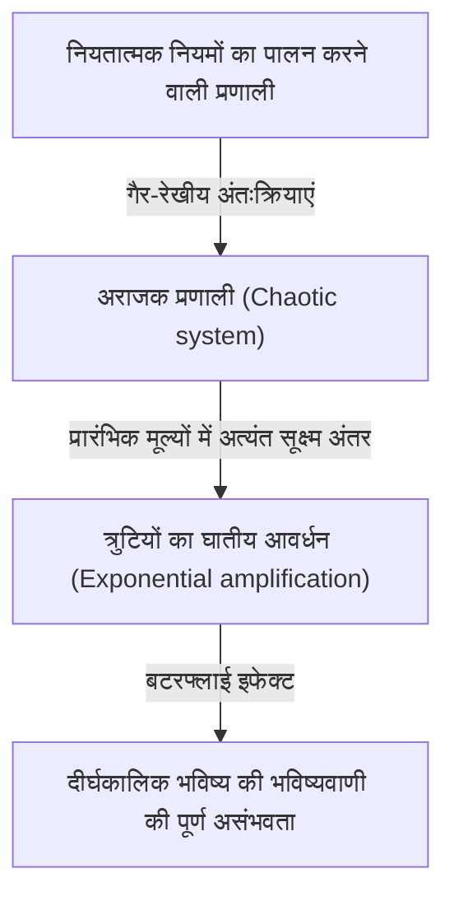
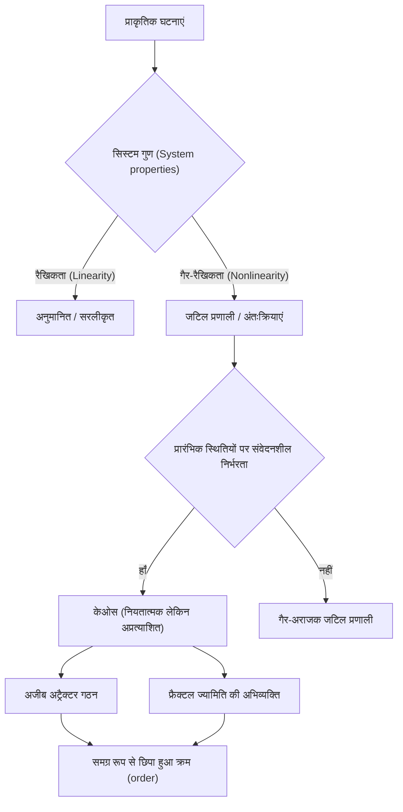

## 1. परिचय: बटरफ्लाई इफेक्ट क्या है?

"क्या ब्राज़ील में एक तितली के पंख फड़फड़ाने से टेक्सास में बवंडर आ सकता है?"

यह आकर्षक और रहस्यमय प्रश्न **बटरफ्लाई इफेक्ट (Butterfly Effect)** का प्रतीक है, जो आधुनिक विज्ञान में सबसे प्रसिद्ध और सबसे गलत समझे जाने वाले कॉन्सेप्ट्स में से एक है। बटरफ्लाई इफेक्ट **केओस थ्योरी (Chaos Theory)** की एक मुख्य अवधारणा है, जिसका अध्ययन मौसम विज्ञान, भौतिकी और गणित जैसे क्षेत्रों में किया जाता है। यह उस घटना को संदर्भित करता है जहां "प्रारंभिक स्थितियों में एक मिनट का अंतर समय के साथ तेजी से (exponentially) बढ़ता है, जिसके परिणामस्वरूप भविष्य की स्थिति में एक निर्णायक अंतर आता है।"

हमारे दैनिक जीवन में, हम सहज रूप से यह सोचते हैं कि कारण और प्रभाव आनुपातिक हैं। दूसरे शब्दों में, यह एक रैखिक (linear) विश्वदृष्टि है जहां छोटे बदलाव छोटे परिणाम लाते हैं, और बड़े बदलाव बड़े परिणाम लाते हैं। हालाँकि, इस अंतर्ज्ञान के विपरीत, प्रकृति में कई घटनाएँ अत्यधिक गैर-रेखीय (nonlinear) तरीके से व्यवहार करती हैं। एक मामूली उतार-चढ़ाव भारी बदलाव ला सकता है। केओस थ्योरी इन प्रतीत होने वाली अव्यवस्थित और अप्रत्याशित जटिल घटनाओं के पीछे छिपे क्रम (order) को सुलझाने के लिए एक गणितीय ढांचा प्रदान करती है।

इस लेख में, हम केओस थ्योरी और बटरफ्लाई इफेक्ट को उनकी ऐतिहासिक पृष्ठभूमि से लेकर गणितीय नींव, फ्रैक्टल ज्यामिति के साथ गहरे संबंध और आधुनिक समाज में विविध अनुप्रयोगों तक विस्तार से समझाएंगे। आइए यह पता लगाने के लिए एक यात्रा शुरू करें कि भविष्य अप्रत्याशित क्यों है और उस अप्रत्याशितता के भीतर किस तरह की सुंदरता छिपी है।

---

## 2. ऐतिहासिक पृष्ठभूमि: पोंकारे से लोरेंज तक

केओस थ्योरी के बीज का पता महान 19वीं सदी के फ्रांसीसी गणितज्ञ हेनरी पोंकारे के शोध से लगाया जा सकता है। उस समय, भौतिकी में सबसे बड़ी चुनौतियों में से एक "तीन-पिंड समस्या (three-body problem)" थी। यह तीन खगोलीय पिंडों, जैसे कि सूर्य, पृथ्वी और चंद्रमा की गति की भविष्यवाणी करने की समस्या थी, जो न्यूटोनियन यांत्रिकी के आधार पर एक-दूसरे पर गुरुत्वाकर्षण बल लगाते हैं।

इस समस्या का गहराई से अध्ययन करते हुए, पोंकारे ने पाया कि खगोलीय पिंडों की गति अत्यंत जटिल हो सकती है। उन्होंने गणितीय रूप से सुझाव दिया कि प्रारंभिक स्थिति या वेग में असीमित रूप से छोटी त्रुटियां समय के साथ बढ़ सकती हैं, जिससे अंततः खगोलीय पिंडों की पूरी तरह से अलग प्रक्षेपवक्र (trajectories) हो सकती है। यह वस्तुतः अराजक (chaotic) व्यवहार की पहली खोज थी, जिसमें दिखाया गया था कि एक नियतात्मक प्रणाली (deterministic system) (एक प्रणाली जहां कानून पूरी तरह से ज्ञात हैं) में भी, दीर्घकालिक भविष्यवाणी कभी-कभी असंभव हो सकती है। हालाँकि, उस समय गणितीय विधियों और कम्प्यूटेशनल शक्ति (कंप्यूटर की अनुपस्थिति) की सीमाओं के कारण, इस अभूतपूर्व खोज का दशकों बाद तक गहराई से अन्वेषण नहीं किया गया था।

1960 के दशक में स्थिति नाटकीय रूप से बदल गई। मैसाचुसेट्स इंस्टीट्यूट ऑफ टेक्नोलॉजी (MIT) के एक मौसम विज्ञानी एडवर्ड लोरेंज, एक प्रारंभिक कंप्यूटर का उपयोग करके वायुमंडलीय संवहन (atmospheric convection) का अनुकरण कर रहे थे। उन्होंने तापमान, दबाव और हवा की गति जैसे चर (variables) की गणना करने के लिए सरल गैर-रेखीय अंतर समीकरणों (nonlinear differential equations) का एक सेट बनाया, और कंप्यूटर का उपयोग करके मानों की गणना की।

एक दिन, लोरेंज ने पिछले रन के बीच से एक सिमुलेशन को फिर से शुरू करने का प्रयास किया। उन्होंने एक मुद्रित आउटपुट से संख्याओं को फिर से दर्ज किया, लेकिन उन्होंने गलती से "0.506" टाइप किया — प्रिंटआउट से दशमलव के तीन स्थानों तक पूर्णांकित एक मान — कंप्यूटर द्वारा रखे गए "0.506127" के आंतरिक छह-अंकीय सटीक मान के बजाय।

जब लोरेंज अपने कॉफी ब्रेक से लौटे, तो एक आश्चर्यजनक दृश्य उनकी प्रतीक्षा कर रहा था। पुनः आरंभ किए गए सिमुलेशन के परिणाम शुरू में पहले कुछ चरणों के लिए पिछले रन से मेल खाते थे, लेकिन जल्द ही एक पूरी तरह से अलग मौसम पैटर्न को ट्रेस करना शुरू कर दिया। केवल 0.000127 के मामूली प्रारंभिक अंतर के परिणामस्वरूप पूरी तरह से अलग भविष्य का मौसम परिदृश्य हुआ। यह एक ऐसी घटना की खोज का क्षण था जिसे लोरेंज ने बाद में **प्रारंभिक स्थितियों पर संवेदनशील निर्भरता (Sensitive dependence on initial conditions)** कहा, जिसे दुनिया भर में बटरफ्लाई इफेक्ट के रूप में जाना जाएगा।

---

## 3. गणितीय नींव: गैर-रेखीय गतिशील प्रणालियाँ और लोरेंज समीकरण

केओस थ्योरी को गणितीय रूप से समझने के लिए, **गतिशील प्रणालियों (Dynamical Systems)** और **गैर-रैखिकता (Non-linearity)** की अवधारणाओं को समझना आवश्यक है।

एक गतिशील प्रणाली एक प्रणाली का एक गणितीय मॉडल है जिसकी स्थिति समय के साथ बदलती है। प्रणाली की भविष्य की स्थिति पूरी तरह से उसकी वर्तमान स्थिति और प्रणाली को नियंत्रित करने वाले नियतात्मक नियमों (आमतौर पर अंतर या अंतर समीकरणों) द्वारा निर्धारित होती है। यहां मुख्य बिंदु यह है कि नियमों में स्वयं कोई संभाव्य तत्व (probabilistic elements) (अवसर, जैसे पासा पलटना) नहीं होता है।

गतिशील प्रणालियों को मोटे तौर पर रेखीय (linear) और गैर-रेखीय (nonlinear) प्रणालियों में वर्गीकृत किया गया है। एक रैखिक प्रणाली में, कारण और प्रभाव आनुपातिक होते हैं, और सुपरपोजिशन का सिद्धांत लागू होता है, जहां "भागों का योग पूर्ण के बराबर होता है।" इन्हें गणितीय रूप से हल करना अपेक्षाकृत आसान है, और भविष्यवाणियां सीधी हैं। दूसरी ओर, गैर-रेखीय प्रणालियों में, चर एक साथ गुणा किए जाते हैं या फीडबैक लूप मौजूद होते हैं, जिससे कारण और प्रभाव के बीच आनुपातिक संबंध टूट जाता है। यह एक ऐसा व्यवहार प्रदर्शित करता है जहां "भागों का योग पूर्ण से भिन्न होता है," अत्यंत जटिल घटनाओं का कारण बनता है। केओस (Chaos) केवल गैर-रेखीय प्रणालियों में होता है।

अराजकता उत्पन्न करने वाले गैर-रेखीय अंतर समीकरणों का सबसे प्रसिद्ध सेट, जिसे एडवर्ड लोरेंज ने एक वायुमंडलीय संवहन मॉडल से प्राप्त किया है, **लोरेंज समीकरण (Lorenz equations)** हैं। इनमें निम्नलिखित तीन चर ($x, y, z$) और तीन पैरामीटर ($\sigma, \rho, \beta$) होते हैं।

$$
\frac{dx}{dt} = \sigma (y - x)
$$

$$
\frac{dy}{dt} = x (\rho - z) - y
$$

$$
\frac{dz}{dt} = x y - \beta z
$$

यहाँ, प्रत्येक चर का एक भौतिक अर्थ है:
- $x$ संवहन की दर (द्रव घूर्णी गति) है
- $y$ आरोही और अवरोही धाराओं के बीच क्षैतिज तापमान भिन्नता है
- $z$ रैखिकता से ऊर्ध्वाधर तापमान प्रोफ़ाइल का विचलन है
- $\sigma$ (प्रांटल संख्या), $\rho$ (रेले संख्या), और $\beta$ (सिस्टम का पहलू अनुपात) पैरामीटर हैं।

विशिष्ट अराजक व्यवहार दिखाने वाले पैरामीटर मानों के रूप में, लोरेंज ने $\sigma = 10, \rho = 28, \beta = 8/3$ चुना। जबकि समीकरणों की यह प्रणाली नियतात्मक है, समाधान कभी भी पिछली स्थितियों को नहीं दोहराते हैं और असीम रूप से जटिल प्रक्षेपवक्र (trajectories) का पता लगाना जारी रखते हैं। समीकरणों में गैर-रेखीय पद, जैसे $xz$ और $xy$, अराजकता पैदा करने में निर्णायक भूमिका निभाते हैं।

---

## 4. चरण स्थान (Phase Space) और अजीब अट्रैक्टर्स (Strange Attractors)

गतिशील प्रणालियों के व्यवहार को दृष्टिगत रूप से समझने के लिए एक शक्तिशाली उपकरण **चरण स्थान (Phase space)** है। चरण स्थान एक बहुआयामी स्थान है जो एक प्रणाली के सभी संभावित राज्यों का प्रतिनिधित्व करने में सक्षम है। सिस्टम की वर्तमान स्थिति को इस चरण स्थान में "एक बिंदु" के रूप में दर्शाया गया है। जैसे-जैसे समय आगे बढ़ता है, प्रणाली की बदलती स्थिति को चरण अंतरिक्ष के माध्यम से चलने वाले बिंदु द्वारा अनुरेखित "प्रक्षेपवक्र (trajectory)" के रूप में दर्शाया जाता है।

अपव्यय (ऊर्जा खोने की संपत्ति, जैसे घर्षण या वायु प्रतिरोध) के साथ कई वास्तविक दुनिया प्रणालियों में, पर्याप्त समय बीत जाने के बाद, प्रणाली अंततः एक विशिष्ट स्थिति (एक बिंदु) या आवधिक स्थिति (एक बंद लूप) में बस जाती है। इस अंतिम बसने की जगह को **अट्रैक्टर (Attractor)** कहा जाता है। उदाहरण के लिए, वायु प्रतिरोध के कारण एक पेंडुलम की गति अंततः अपने सबसे निचले बिंदु पर आ जाती है। इस मामले में अट्रैक्टर एक "एकल बिंदु (निश्चित बिंदु)" है। दिल की धड़कन की तरह आवधिक गति दोहराने वाली प्रणाली का अट्रैक्टर एक "लिमिट साइकिल (बंद वक्र)" है।

हालाँकि, लोरेंज समीकरण जैसी अराजक प्रणालियों में, एक बिल्कुल अलग तरह का अट्रैक्टर उभरता है। यह **अजीब अट्रैक्टर (Strange Attractor)** है।

जब लोरेंज अट्रैक्टर को 3D चरण स्थान में प्लॉट किया जाता है, तो यह एक लुभावनी रूप से सुंदर और जटिल संरचना को प्रकट करता है जो फैले हुए पंखों या दो आँखों वाली तितली जैसा दिखता है। इस अजीब अट्रैक्टर में निम्नलिखित उल्लेखनीय विशेषताएं हैं:

1. **सीमितता (Boundedness)**: प्रक्षेपवक्र अनंत तक नहीं उड़ता है; यह हमेशा अट्रैक्टर के एक विशिष्ट क्षेत्र के भीतर रहता है।
2. **अपेरियोडिसिटी (Aperiodicity)**: प्रक्षेपवक्र कभी भी अपने स्वयं के अतीत के मार्ग को पार नहीं करता है या ठीक उसी मार्ग को नहीं दोहराता है। यह हमेशा नए रास्तों का पता लगाना जारी रखता है।
3. **प्रारंभिक स्थितियों पर संवेदनशील निर्भरता**: अट्रैक्टर पर दो अत्यंत करीबी प्रारंभिक बिंदुओं से शुरू होने वाले प्रक्षेपवक्र समय बीतने के साथ अट्रैक्टर के भीतर पूरी तरह से अलग-अलग स्थानों पर दूर खींच लिए जाएंगे।

भले ही प्रक्षेपवक्र एक परिमित आयतन (finite volume) के भीतर ही सीमित हों, वे कभी पार न करने के लिए विवश हैं (क्योंकि पार करने से इस नियतात्मक आधार का उल्लंघन होगा कि "समान अवस्था समान भविष्य की ओर ले जाती है")। इसे प्राप्त करने के लिए, अंतरिक्ष को असीम रूप से "मुड़ा हुआ (folded)" होना चाहिए। "खींचने (stretching)" और "मोड़ने (folding)" (जैसे आटा गूंथना) की यह बार-बार की प्रक्रिया ही केओस का सार है और अजीब अट्रैक्टर्स की जटिल संरचना को जन्म देती है।

---

## 5. लॉजिस्टिक मैप और द्विभाजन आरेख (Bifurcation Diagram)

सबसे सरल तरीके से केओस थ्योरी को समझने के लिए एक और महत्वपूर्ण गणितीय मॉडल **लॉजिस्टिक मैप (Logistic map)** है। यह एक जैविक आबादी के उतार-चढ़ाव (उदाहरण के लिए, एक द्वीप पर खरगोशों की संख्या में वार्षिक परिवर्तन) को मॉडल करने वाला एक सरल द्विघात अंतर समीकरण (quadratic difference equation) है।

$$
x_{n+1} = r x_n (1 - x_n)
$$

यहाँ,
- $x_n$ $n$-वीं पीढ़ी की आबादी का प्रतिनिधित्व करता है (पर्यावरण की अधिकतम वहन क्षमता के अनुपात के रूप में $0 \le x_n \le 1$ सीमा में एक मान लेना)।
- $x_{n+1}$ अगली पीढ़ी की जनसंख्या है।
- $r$ प्रजनन दर का प्रतिनिधित्व करने वाला एक पैरामीटर है (आमतौर पर $0 \le r \le 4$)।

हालांकि यह समीकरण अत्यंत सरल है, पैरामीटर $r$ के मूल्य को बदलने से यह आश्चर्यजनक रूप से विविध और जटिल व्यवहार प्रदर्शित करता है:

- $0 < r < 1$: आबादी अंततः विलुप्त हो जाती है, और $x$ 0 पर अभिसरण (converge) हो जाता है।
- $1 < r < 3$: जनसंख्या एक निश्चित स्थिर मूल्य (निश्चित बिंदु) में परिवर्तित हो जाती है और स्थिर हो जाती है।
- $r = 3$ के आसपास: निश्चित बिंदु अस्थिर हो जाता है, और जनसंख्या दो अलग-अलग मानों के बीच बारी-बारी से शुरू हो जाती है। इसे **अवधि-दोहरीकरण द्विभाजन (Period-doubling bifurcation)** कहा जाता है।
- जैसे-जैसे $r$ आगे बढ़ता है, द्विभाजन जहां अवधि दोगुनी होकर 4, 8, 16 आदि हो जाती है, तेजी से होते हैं।
- $r \approx 3.56995$ (फ़िगेनबाम बिंदु) से परे, आवधिकता पूरी तरह से टूट जाती है, और जनसंख्या पूरी तरह से अप्रत्याशित मूल्य लेती है। यह **केओस (Chaos)** की अवस्था है।

$r$ में इन परिवर्तनों के खिलाफ सिस्टम की अंतिम स्थिति (अट्रैक्टर) को प्लॉट करना एक **द्विभाजन आरेख (Bifurcation diagram)** कहलाता है। क्षैतिज अक्ष पैरामीटर $r$ का प्रतिनिधित्व करता है, और ऊर्ध्वाधर अक्ष $x$ के अंतिम मूल्यों का प्रतिनिधित्व करता है।

द्विभाजन आरेख को देखते हुए, हम देख सकते हैं कि अराजक क्षेत्र के भीतर, ऐसी "खिड़कियां (Windows)" हैं जहां अचानक आदेश फिर से प्राप्त हो जाता है (उदाहरण के लिए, एक अवधि -3 क्षेत्र)। आश्चर्यजनक रूप से, यदि आप इस द्विभाजन आरेख के एक हिस्से को बड़ा करते हैं, तो यह आत्म-समानता प्रदर्शित करता है, जहां समग्र संरचना का सटीक समान पैटर्न असीम रूप से प्रकट होता है। यह तथ्य कि एक साधारण द्विघात समीकरण में इतनी समृद्ध संरचना होती है, ने गणितीय समुदाय के माध्यम से एक बड़ा झटका भेजा।

---

## 6. लियापुनोव घातांक (Lyapunov Exponent): केओस की मात्रा का ठहराव

अराजक प्रणालियों में निहित "प्रारंभिक स्थितियों पर संवेदनशील निर्भरता" को कड़ाई से गणितीय रूप से मापने के लिए उपयोग किया जाने वाला संकेतक **लियापुनोव घातांक** है।

चरण स्थान (दूरी को $\delta Z_0$ के रूप में दर्शाया गया है) में दो बेहद करीब प्रारंभिक अवस्थाओं पर विचार करें और देखें कि समय $t$ बीतने के साथ उनकी प्रक्षेपवक्र $\delta Z(t)$ दूरी पर कैसे अलग हो जाती है। अराजक प्रणाली के मामले में, यह दूरी औसतन तेजी से (exponentially) फैलती है।

$$
|\delta Z(t)| \approx e^{\lambda t} |\delta Z_0|
$$

यहाँ, $\lambda$ (लैम्ब्डा) लियापुनोव घातांक है।
लियापुनोव घातांक उस औसत दर का प्रतिनिधित्व करता है जिस पर आसन्न प्रक्षेपवक्र अलग हो जाते हैं (या एक दूसरे के पास आते हैं)।

- $\lambda < 0$: प्रक्षेपवक्र एक-दूसरे के पास आते हैं और एक निश्चित बिंदु या सीमा चक्र में परिवर्तित हो जाते हैं (अराजकता नहीं)।
- $\lambda = 0$: प्रक्षेपवक्र के बीच की दूरी स्थिर रहती है (उदा. रूढ़िवादी प्रणालियाँ)।
- $\lambda > 0$: प्रक्षेपवक्र घातीय रूप से अलग हो जाते हैं। यह **केओस** का निर्णायक सूचक है।

एक बहुआयामी गतिशील प्रणाली में, स्थान (लियापुनोव स्पेक्ट्रम) के आयामों के रूप में कई लियापुनोव घातांक हैं। यदि कम से कम एक सकारात्मक लियापुनोव घातांक मौजूद है, तो सिस्टम को अराजक के रूप में परिभाषित किया गया है। सकारात्मक लियापुनोव घातांक जितना बड़ा होगा, उतनी ही तेज़ी से प्रारंभिक सूक्ष्म त्रुटियां बढ़ेंगी, जिससे उस समय के पैमाने को छोटा किया जा सकेगा जिस पर भविष्य की भविष्यवाणी (लियापुनोव समय) की जा सकती है। यह मूल गणितीय कारण है कि मौसम के पूर्वानुमान कुछ दिन बाहर काफी सटीक हो सकते हैं लेकिन अग्रिम सप्ताहों में पूरी तरह से अप्रत्याशित हो जाते हैं।

---

## 7. फ्रैक्टल्स और केओस के बीच संबंध

केओस थ्योरी पर चर्चा करते समय, कोई गणितज्ञ बेनोइट मैंडेलब्रॉट द्वारा प्रस्तावित **फ्रैक्टल (Fractal)** ज्यामिति को नहीं छोड़ सकता है। फ्रैक्टल एक आकृति है जिसमें "चाहे आप इसे कितना भी बड़ा कर लें, पूरे के समान एक समान जटिल संरचना (स्व-समानता) असीम रूप से प्रकट होती है।" प्रतिनिधि उदाहरणों में मैंडेलब्रॉट सेट और कोच स्नोफ्लेक शामिल हैं।

केओस और फ्रैक्टल पहली नज़र में अलग-अलग अवधारणाएँ लग सकते हैं, लेकिन वे वास्तव में एक ही सिक्के के दो पहलू हैं। यदि आप एक अजीब अट्रैक्टर का क्रॉस-सेक्शन लेते हैं और इसे ध्यान से देखते हैं, तो आपको असीम रूप से स्तरित संरचना मिलेगी, जिससे पता चलता है कि इसमें फ्रैक्टल संरचना है।

अराजक प्रणाली के चरण स्थान में "खींचने और मोड़ने" की गतिशीलता ज्यामितीय परिणाम के रूप में फ्रैक्टल आंकड़े पैदा करती है। फ्रैक्टल की महत्वपूर्ण विशेषताओं में से एक यह है कि इसका "भिन्नात्मक आयाम (fractional dimension) (फ्रैक्टल आयाम)" है जो एक पूर्णांक नहीं है। उदाहरण के लिए, एक आंकड़ा जो अधिक जटिल और अंतरिक्ष-भरने वाला है, एक 1D लाइन की तुलना में है लेकिन एक 2D विमान से कम है, जिसका आयाम 1.26 हो सकता है। एक अजीब अट्रैक्टर भिन्नात्मक आयाम के साथ एक फ्रैक्टल संरचना भी है।

यदि केओस "समय के साथ उभरने वाली जटिल गतिशीलता" है, तो फ्रैक्टल को "अंतरिक्ष में उन गतिशीलता द्वारा छोड़े गए ज्यामितीय पैरों के निशान" कहा जा सकता है। कई प्राकृतिक घटनाएं, जैसे कि रिया तटरेखाओं के आकार, पेड़ों की शाखाएं, रक्त वाहिकाओं के नेटवर्क और बादलों के आकार, में फ्रैक्टल संरचनाएं होती हैं, और यह माना जाता है कि अराजक गैर-रेखीय गतिशीलता उनके गठन प्रक्रियाओं के पीछे काम कर रही है।

---

## 8. वास्तविक दुनिया के अनुप्रयोग: मौसम विज्ञान से लेकर अर्थशास्त्र तक

केओस थ्योरी केवल गणितीय खेल नहीं है। प्रारंभिक स्थितियों और गैर-रेखीय गतिशीलता पर संवेदनशील निर्भरता के सार्वभौमिक गुणों ने भौतिकी से परे, वास्तविक दुनिया के हर क्षेत्र में व्यापक अनुप्रयोग लाए हैं।

### 8.1 मौसम विज्ञान और जलवायु परिवर्तन
मौसम विज्ञान, लोरेंज की खोज का मंच, उन क्षेत्रों में से एक है जिन्हें केओस थ्योरी से सबसे अधिक लाभ हुआ है। वातावरण द्रव गतिशीलता और ऊष्मप्रवैगिकी के जटिल गैर-रेखीय समीकरणों द्वारा शासित होता है, जिससे यह स्वाभाविक रूप से अराजक हो जाता है। आज, मुख्यधारा का दृष्टिकोण "पहनावा पूर्वानुमान (ensemble forecasting)" है, जिसमें जानबूझकर प्रारंभिक मूल्यों में मामूली उतार-चढ़ाव लाना और एक ही पूर्वानुमान पर भरोसा करने के बजाय एक साथ कई सिमुलेशन चलाना शामिल है। यह मौसम विज्ञानियों को पूर्वानुमान की अनिश्चितता का संभावित रूप से मूल्यांकन करने और यह समझने की अनुमति देता है कि भविष्य में कितनी दूर तक विश्वसनीय भविष्यवाणियां संभव हैं।

### 8.2 चिकित्सा और जीव विज्ञान
मानव जैविक लय भी गहराई से केओस के साथ गुंथी हुई हैं। उदाहरण के लिए, यह ज्ञात है कि एक स्वस्थ हृदय के धड़कन अंतराल (उतार-चढ़ाव) न तो पूरी तरह से नियमित होते हैं और न ही पूरी तरह से यादृच्छिक, बल्कि अराजक फ्रैक्टल गुण होते हैं। इसके विपरीत, हृदय रोग के रोगियों या बुजुर्गों के दिल की धड़कन बहुत नियमित या पूरी तरह से यादृच्छिक हो सकती है। अराजक उतार-चढ़ाव के नुकसान का अध्ययन एक महत्वपूर्ण संकेत (बायोमार्कर) के रूप में किया जा रहा है जो बिगड़ते स्वास्थ्य का संकेत देता है। गैर-रेखीय गतिशीलता मस्तिष्क की तरंगों का विश्लेषण करने और संक्रामक रोगों के प्रसार (जैसे महामारी विज्ञान में SIR मॉडल) के मॉडलिंग में भी आवश्यक है।

### 8.3 अर्थशास्त्र और वित्तीय बाजार
वित्तीय बाजार, जैसे कि स्टॉक और विदेशी मुद्रा बाजार, अत्यधिक जटिल गैर-रेखीय प्रणालियां हैं जहां अनगिनत निवेशकों का मनोविज्ञान और कार्य बातचीत करते हैं। पारंपरिक अर्थशास्त्र ने माना कि बाजार कुशल थे और कीमतों में एक यादृच्छिक चाल (सामान्य वितरण के अनुरूप यादृच्छिक चाल) का पालन किया गया। हालाँकि, वास्तविक बाज़ारों में, क्रैश और बुलबुले जैसी चरम घटनाएँ सामान्य वितरण की भविष्यवाणी की तुलना में बहुत अधिक बार होती हैं (मोटे पूंछ वाली घटना (fat-tail phenomenon))। केओस थ्योरी और फ्रैक्टल्स (जैसे मैंडेलब्रॉट के मल्टीफ्रैक्टल मॉडल) को लागू करके, बाजार के मूल्य में उतार-चढ़ाव के भीतर छिपे गैर-रेखीय संरचनाओं, दीर्घकालिक स्मृति और बुलबुले फटने के जोखिमों को अधिक सटीक रूप से मॉडल करने का प्रयास किया जा रहा है, जिससे इस ज्ञान को जोखिम प्रबंधन में लागू किया जा सके।

### 8.4 इंजीनियरिंग और नियंत्रण
इंजीनियरिंग के क्षेत्र में केओस की अवधारणा भी महत्वपूर्ण है। कई प्रणालियों में केओस की घटनाएं देखी जाती हैं, जैसे विमानों में पंखों के कंपन (फ्लटर), विद्युत परिपथों में गैर-रेखीय ऑसिलेटरों का सिंक्रनाइज़ेशन, और लेज़र आउटपुट में गड़बड़ी। परंपरागत रूप से, केओस को "बचने" या "शोर के रूप में समाप्त" करने के लिए कुछ माना जाता था क्योंकि यह अप्रत्याशित है और सिस्टम को अस्थिर करता है। आज, हालांकि, "केओस कंट्रोल (Chaos Control)" नामक एक तकनीक विकसित हुई है, जो सिस्टम को एक अराजक स्थिति से वांछित आवधिक स्थिति में कुशलता से मार्गदर्शन करने के लिए एक प्रणाली में निहित मिनट ऊर्जा का उपयोग करती है, इसे स्थिर करती है। अराजक संकेतों (अराजकता क्रिप्टोग्राफी) की यादृच्छिकता का उपयोग करके क्रिप्टोग्राफिक संचार के लिए अनुप्रयोगों पर भी शोध किया जा रहा है।

---

## 9. दार्शनिक निहितार्थ: नियतत्ववाद (Determinism) और पूर्वानुमेयता (Predictability)

केओस थ्योरी के उद्भव ने विज्ञान के दर्शन में, विशेष रूप से "नियतत्ववाद" और "पूर्वानुमेयता" पर हमारे विश्वदृष्टि के संबंध में एक मौलिक प्रतिमान बदलाव लाया है।

18 वीं शताब्दी के फ्रांसीसी गणितज्ञ पियरे-साइमन लैपलेस ने निम्नलिखित विचार प्रयोग का प्रस्ताव रखा: "यदि कोई ऐसी बुद्धि (intellect) होती जो ब्रह्मांड में सभी परमाणुओं की वर्तमान स्थितियों और गति को पूरी तरह से समझ सकती है और उनका विश्लेषण करने के लिए पर्याप्त विशाल है, तो ऐसी बुद्धि के लिए, भविष्य, अतीत की तरह ही, उसकी आँखों के सामने मौजूद होगा।" इस काल्पनिक बुद्धि को **लाप्लास का दानव (Laplace's demon)** कहा जाता है, और यह शास्त्रीय यांत्रिकी के आधार पर ब्रह्मांड के एक मजबूत नियतात्मक विश्वदृष्टि का प्रतीक था।

नियतत्ववाद यह विचार है कि "यदि वर्तमान स्थिति पूरी तरह से निर्धारित है, तो भौतिकी के नियमों के अनुसार भविष्य विशिष्ट रूप से निर्धारित होता है।" केओस थ्योरी (जैसे लोरेंज समीकरण) द्वारा नियंत्रित समीकरण विशुद्ध रूप से नियतात्मक समीकरण हैं जिनमें कोई संभाव्य तत्व नहीं है। इसलिए, सिद्धांत रूप में, लाप्लास का दानव अराजक प्रणालियों के भविष्य की भी पूरी तरह से भविष्यवाणी करने में सक्षम होना चाहिए।

हालाँकि, केओस थ्योरी ने वास्तविक दुनिया में हमें ठंडे दिमाग से **भविष्यवाणी की सीमा (Limits of predictability)** का सामना कराया। वास्तव में, "अनंत परिशुद्धता (शून्य त्रुटि)" के साथ ब्रह्मांड की हर प्रारंभिक स्थिति को मापना असंभव है। क्वांटम यांत्रिकी के अनिश्चितता सिद्धांत पर विचार किए बिना भी, हमारी अवलोकन क्षमताओं की स्वाभाविक रूप से परिमित सीमाएँ हैं।

अराजक प्रणाली में, यह अवलोकन त्रुटि चाहे कितनी भी छोटी हो, समय के साथ तेजी से बढ़ती है, अंततः पूरे सिस्टम को घेर लेती है। दूसरे शब्दों में, यह स्पष्ट हो गया कि "नियतात्मक होना" और "अनुमानित होना" दो पूरी तरह से अलग अवधारणाएँ हैं। केओस थ्योरी ने लाप्लास के दानव को शांत कर दिया और मानवता को गहरा सच सिखाया कि "भले ही कानून पूरी तरह से ज्ञात हों, भविष्य मौलिक रूप से अप्रत्याशित हो सकता है।"

यह प्रतिमान बदलाव एक नया विश्वदृष्टि प्रस्तुत करता है: "हमारी दुनिया जटिल और अप्रत्याशित है, लेकिन इसके पीछे एक सुंदर, नियतात्मक गणितीय संरचना निहित है।" पूर्ण भविष्यवाणी को छोड़ने के बजाय, अट्रैक्टर्स के आकार का अध्ययन करके और संभाव्य वितरणों को समझकर अराजकता के भीतर छिपे "मैक्रो-लेवल ऑर्डर" को समझने का एक मार्ग खुल गया है।

---

## 10. निष्कर्ष

इस लेख में, हमने बटरफ्लाई इफेक्ट की गहराई से खोज की है—जहाँ प्रारंभिक परिस्थितियों में सूक्ष्म अंतर बड़े पैमाने पर परिणाम देते हैं—और केओस थ्योरी जो इसे शामिल करती है।

पोंकारे के अंतर्ज्ञान से शुरू होकर, कंप्यूटर के माध्यम से लोरेंज की आकस्मिक खोज से गुजरते हुए, केओस थ्योरी गणित और भौतिकी को पार करते हुए एक विशाल क्षेत्र में विकसित हो गई है। इसकी गणितीय नींव अत्यधिक परिष्कृत और बौद्धिक आश्चर्य से भरी है, जैसा कि गैर-रेखीय समीकरणों द्वारा खींचे गए अजीब अट्रैक्टर्स के सुंदर प्रक्षेपवक्र, लॉजिस्टिक मैप में देखी गई असीम स्व-समानता, और लियापुनोव घातांक के माध्यम से अप्रत्याशितता की मात्रा का ठहराव में देखा गया है।

केओस थ्योरी हमें न केवल मौसम की भविष्यवाणी की सीमाएं सिखाती है, बल्कि आर्थिक उतार-चढ़ाव और दिल की धड़कन से लेकर जीवन के विकास तक, हमारे आस-पास की जटिल घटनाओं को समझने के लिए एक शक्तिशाली लेंस भी प्रदान करती है। यह प्रकट करता है कि प्राकृतिक दुनिया एक साधारण क्लॉकवर्क मशीन नहीं है, बल्कि अप्रत्याशितता और रचनात्मकता से भरी एक गतिशील प्रणाली है।

नियतात्मक अभी तक अप्रत्याशित। यह प्रतीत होने वाली विरोधाभासी प्रकृति ठीक केओस थ्योरी का सबसे बड़ा आकर्षण है। यह तथ्य कि भविष्य पूरी तरह से निर्धारित है, फिर भी कोई भी (और कंप्यूटर कितना भी शक्तिशाली क्यों न हो) अपने विस्तृत भविष्य को नहीं जान सकता है, हमारे ब्रह्मांड की धारणा को और अधिक विनम्र और समृद्ध बनाता है। अराजकता और फ्रैक्टल द्वारा बुनी गई गैर-रेखीय दुनिया निश्चित रूप से वैज्ञानिकों को आकर्षित करना जारी रखेगी और भविष्य में नई खोजों को सामने लाएगी।

