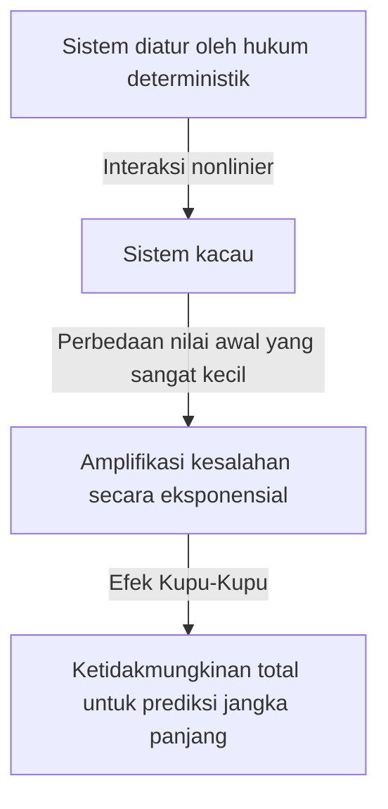
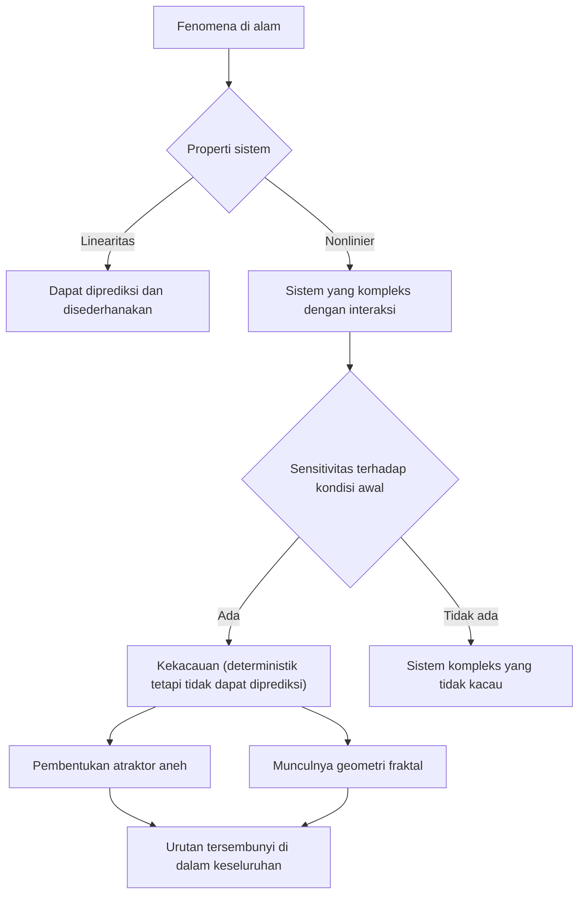

## 1. Pendahuluan: Apa yang dimaksud dengan Efek Kupu-Kupu?

“Apakah kepakan sayap kupu-kupu di Brazil memicu tornado di Texas?”

Pertanyaan menawan dan misterius ini melambangkan salah satu konsep sains modern yang paling terkenal — dan paling disalahpahami —: **Efek Kupu-Kupu**. Efek Kupu-Kupu adalah konsep inti dalam **Teori Kekacauan**, bidang yang dipelajari dalam bidang meteorologi, fisika, matematika, dan banyak lagi. Hal ini mengacu pada fenomena di mana “perbedaan kecil dalam kondisi awal semakin besar secara eksponensial seiring berjalannya waktu, yang pada akhirnya menghasilkan perbedaan yang menentukan dalam keadaan di masa depan.”

Dalam kehidupan kita sehari-hari, kita cenderung secara intuitif mengasumsikan hubungan proporsional antara sebab dan akibat — suatu pandangan dunia linier yang menyatakan bahwa perubahan kecil menghasilkan hasil yang kecil dan perubahan besar menghasilkan hasil yang besar. Namun, banyak fenomena di alam berperilaku sangat nonlinier, sehingga bertentangan dengan intuisi ini. Fluktuasi kecil dapat menghasilkan perubahan yang sangat besar. Teori chaos memberikan kerangka matematis untuk mengungkap tatanan tersembunyi yang bersembunyi di balik fenomena kompleks yang tampaknya tidak teratur dan tidak dapat diprediksi.

Dalam artikel ini, kita akan mengeksplorasi teori chaos dan Efek Kupu-Kupu secara menyeluruh — mulai dari latar belakang sejarah dan dasar matematikanya, melalui hubungannya yang mendalam dengan geometri fraktal, hingga penerapannya yang luas dalam masyarakat modern. Mari kita memulai perjalanan untuk mengetahui mengapa masa depan tidak dapat diprediksi, dan keindahan apa yang tersembunyi di balik ketidakpastian tersebut.

---

## 2. Latar Belakang Sejarah: Dari Poincaré hingga Lorenz

Benih-benih teori chaos dapat ditelusuri kembali ke penelitian matematikawan besar Perancis Henri Poincaré pada akhir abad ke-19. Pada saat itu, salah satu tantangan terbesar dalam fisika adalah "Masalah Tiga Benda" - memprediksi gerak tiga benda langit, seperti Matahari, Bumi, dan Bulan, yang saling tarik menarik gravitasi, berdasarkan mekanika Newton.

Saat mempelajari masalah ini secara mendalam, Poincaré menemukan bahwa pergerakan benda langit bisa menjadi sangat kompleks. Dia secara matematis menyarankan kemungkinan bahwa kesalahan kecil yang sangat kecil pada posisi atau kecepatan awal dapat bertambah seiring waktu dan pada akhirnya membuat orbit akhir menjadi sangat berbeda. Hal ini sebenarnya merupakan penemuan pertama mengenai perilaku chaos — temuan bahwa bahkan sistem deterministik (sistem yang hukumnya diketahui sepenuhnya) menjadi mustahil untuk diprediksi dalam jangka panjang. Namun, karena keterbatasan metode matematika dan daya komputasi (tidak adanya komputer) pada saat itu, penemuan inovatif ini masih belum tereksplorasi selama beberapa dekade.

Situasi berubah secara dramatis pada tahun 1960an. Edward Lorenz, ahli meteorologi di Massachusetts Institute of Technology (MIT), melakukan simulasi konveksi atmosfer menggunakan komputer awal. Dia telah menciptakan serangkaian persamaan diferensial nonlinier sederhana untuk menghitung variabel seperti suhu, tekanan, dan kecepatan angin, dan menjalankan penghitungan pada mesin.

Suatu hari, Lorenz mencoba memulai kembali simulasi dari titik tengah. Dia memasukkan kembali nilai dari cetakan, namun alih-alih menggunakan nilai presisi 6 digit "0,506127" yang disimpan secara internal oleh komputer, dia memasukkan "0,506" — nilai bulat 3 digit yang dicetak pada keluaran.

Ketika Lorenz kembali dari rehat kopinya, pemandangan menakjubkan menantinya. Simulasi yang dimulai kembali cocok dengan hasil sebelumnya untuk beberapa langkah pertama, namun segera mulai menelusuri pola cuaca yang sepenuhnya berbeda. Perbedaan nilai awal yang sangat kecil, hanya 0,000127, telah menghasilkan masa depan cuaca yang sangat berbeda. Inilah momen ditemukannya fenomena yang kemudian disebut Lorenz sebagai **Sensitivitas terhadap Kondisi Awal**, yang kemudian dikenal di seluruh dunia sebagai Efek Kupu-Kupu.

---

## 3. Landasan Matematika: Sistem Dinamis Nonlinier dan Persamaan Lorenz

Untuk memahami teori chaos secara matematis, seseorang harus memahami konsep **Sistem Dinamis** dan **Nonlinieritas**.

Sistem dinamis adalah model matematika dari suatu sistem yang keadaannya berubah seiring waktu. Keadaan sistem di masa depan sepenuhnya ditentukan oleh keadaannya saat ini dan hukum deterministik yang mengaturnya (biasanya persamaan diferensial atau persamaan perbedaan). Yang terpenting, undang-undang itu sendiri tidak mengandung unsur probabilistik — tidak ada keacakan seperti pelemparan dadu.

Sistem dinamis secara garis besar dibagi menjadi sistem linier dan nonlinier. Dalam sistem linier, sebab dan akibat adalah proporsional, dan prinsip superposisi berlaku: "jumlah bagian-bagian sama dengan keseluruhan". Ini relatif mudah untuk diselesaikan secara matematis dan diprediksi. Namun, dalam sistem nonlinier, variabel-variabel berlipat ganda atau terjadi putaran umpan balik, sehingga memutus hubungan proporsional antara sebab dan akibat. Mereka menunjukkan perilaku di mana "jumlah bagian-bagian berbeda dari keseluruhan", sehingga menimbulkan fenomena yang sangat kompleks. Kekacauan hanya terjadi pada sistem nonlinier.

Kumpulan persamaan diferensial berpasangan nonlinier paling terkenal yang menghasilkan kekacauan, yang diturunkan oleh Edward Lorenz dari model konveksi atmosfer, adalah **Persamaan Lorenz**. Mereka terdiri dari tiga variabel ( $x, y, z$ ) dan tiga parameter ( $\sigma, \rho, \beta$ ):

$$
\frac{dx}{dt} = \sigma (y - x)
$$

$$
\frac{dy}{dt} = x (\rho - z) - y
$$

$$
\frac{dz}{dt} = x y - \beta z
$$

Di sini, setiap variabel memiliki arti fisik:
- $x$ mewakili intensitas konveksi (kecepatan putaran fluida)
- $y$ mewakili perbedaan suhu antara aliran naik dan turun
- $z$ mewakili deviasi profil suhu vertikal dari linearitas
- $\sigma$ (nomor Prandtl), $\rho$ (nomor Rayleigh), dan $\beta$ (rasio aspek sistem) adalah parameter.

Untuk nilai parameter yang menunjukkan perilaku kacau, Lorenz memilih $\sigma = 10, \rho = 28, \beta = 8/3$. Meskipun sistem persamaan ini bersifat deterministik, penyelesaiannya tidak pernah mengulangi keadaan sebelumnya, menelusuri lintasan yang sangat kompleks. Suku nonlinier $xz$ dan $xy$ dalam persamaan memainkan peran yang menentukan dalam menghasilkan kekacauan.

---

## 4. Ruang Fase dan Atraktor Aneh

Alat canggih untuk memahami secara visual perilaku sistem dinamis adalah **Phase Space**. Ruang fase adalah ruang multidimensi yang mampu mewakili setiap keadaan suatu sistem. Keadaan sistem saat ini direpresentasikan sebagai "satu titik" dalam ruang fase ini. Seiring berjalannya waktu dan keadaan sistem berubah, pergerakan titik melalui ruang fase menelusuri sebuah "lintasan".

Dalam banyak sistem dunia nyata dengan disipasi (sifat yang menyebabkan hilangnya energi, seperti gesekan atau hambatan udara), setelah waktu yang cukup, sistem akhirnya akan berada pada keadaan tertentu (titik) atau keadaan periodik (lingkaran tertutup). Tujuan akhir ini disebut **Penarik** (sesuatu yang menarik sesuatu). Misalnya, gerakan pendulum pada akhirnya terhenti pada titik terendahnya karena adanya hambatan udara; dalam hal ini penariknya adalah “titik tunggal (titik tetap)”. Untuk sistem yang mengulangi gerakan periodik, seperti detak jantung, penariknya adalah "siklus batas (kurva tertutup)".

Namun, dalam sistem chaos seperti persamaan Lorenz, muncul jenis penarik yang sama sekali berbeda — **Atraktor Aneh**.

Ketika penarik Lorenz diplot dalam ruang fase tiga dimensi, muncullah struktur yang sangat indah dan kompleks, menyerupai kupu-kupu yang melebarkan sayapnya atau sepasang mata. Penarik aneh ini memiliki sifat luar biasa berikut:

1. **Keterbatasan**: Lintasannya tidak pernah terbang hingga tak terbatas; ia selalu berada dalam wilayah tertentu dari penariknya.
2. **Aperiodisitas**: Lintasan tidak pernah melintasi jalur sebelumnya atau mengulangi rute yang persis sama. Ini menelusuri jalan baru selamanya.
3. **Sensitivitas terhadap Kondisi Awal**: Dua lintasan yang dimulai dari titik awal yang sangat dekat pada penarik akan ditarik terpisah ke lokasi yang sama sekali berbeda dalam penarik seiring berjalannya waktu.

Meskipun dibatasi dalam volume yang terbatas, lintasannya tidak pernah bersilangan (penyeberangan akan melanggar premis deterministik bahwa "keadaan yang sama mengarah ke masa depan yang sama"). Untuk memenuhi batasan ini, ruang harus “dilipat” tanpa batas. Proses "meregangkan dan melipat" yang berulang-ulang ini (seperti menguleni adonan roti) adalah inti dari kekacauan, dan ini menghasilkan struktur kompleks dari penarik-atraktor aneh.

---

## 5. Peta Logistik dan Diagram Bifurkasi

Model matematika penting lainnya untuk memahami teori chaos dalam bentuk paling sederhana adalah **Peta Logistik**. Ini adalah persamaan perbedaan kuadrat sederhana yang memodelkan dinamika populasi (misalnya, perubahan tahunan jumlah kelinci di sebuah pulau).

$$
x_{n+1} = r x_n (1 - x_n)
$$

Di Sini:
- $x_n$ mewakili populasi pada generasi $n$ (sebagai proporsi daya dukung maksimum lingkungan, mulai dari $0 \le x_n \le 1$).
- $x_{n+1}$ adalah populasi generasi berikutnya.
- $r$ adalah parameter yang mewakili laju reproduksi (biasanya $0 \le r \le 4$).

Persamaan ini sangat sederhana, namun dengan memvariasikan parameter $r$, persamaan ini menunjukkan perilaku yang sangat beragam dan kompleks.

- $0 < r < 1$: Populasi akhirnya punah, dan $x$ menyatu ke 0.
- $1 < r < 3$: Populasi menyatu ke nilai tetap (titik tetap) dan stabil.
- Dekat $r = 3$: Titik tetap menjadi tidak stabil, dan populasi mulai berganti-ganti antara dua nilai yang berbeda. Ini disebut **Bifurkasi Penggandaan Periode**.
- Ketika $r$ semakin meningkat, percabangan terjadi dengan cepat dengan periode berlipat ganda menjadi 4, 8, 16, dan seterusnya.
- Di luar $r \approx 3.56995$ (titik Feigenbaum), periodisitas menjadi rusak seluruhnya dan populasi mencapai nilai yang benar-benar tidak dapat diprediksi. Ini adalah keadaan **kekacauan**.

Grafik yang menggambarkan keadaan akhir sistem (penarik) terhadap perubahan $r$ disebut **Diagram Bifurkasi**. Sumbu horizontal mewakili parameter $r$, dan sumbu vertikal mewakili nilai akhir $x$.

Memeriksa diagram bifurkasi menunjukkan "jendela" — wilayah dalam domain kacau tempat keteraturan tiba-tiba pulih (misalnya, wilayah periode-3). Hebatnya, memperbesar bagian-bagian diagram bifurkasi menunjukkan pola keseluruhan yang sama dan muncul tanpa batas — kesamaan diri. Fakta bahwa persamaan kuadrat sederhana mengandung struktur yang begitu kaya mengirimkan gelombang kejutan ke seluruh komunitas matematika.

---

## 6. Eksponen Lyapunov: Mengukur Kekacauan

Metrik untuk mengukur "sensitivitas terhadap kondisi awal" sistem chaos secara ketat dan matematis adalah **Eksponen Lyapunov**.

Pertimbangkan dua lintasan yang dimulai dari keadaan awal yang sangat dekat dalam ruang fase (dipisahkan oleh jarak $\delta Z_0$) yang menyimpang ke jarak $\delta Z(t)$ seiring waktu $t$. Dalam sistem chaos, jarak ini rata-rata bertambah secara eksponensial.

$$
|\delta Z(t)| \approx e^{\lambda t} |\delta Z_0|
$$

Di sini, $\lambda$ (lambda) adalah eksponen Lyapunov.
Eksponen Lyapunov mewakili tingkat rata-rata di mana lintasan-lintasan yang berdekatan menyimpang (atau bertemu).

- $\lambda < 0$: Lintasan bertemu satu sama lain, menetap pada titik tetap atau siklus batas (tidak kacau).
- $\lambda = 0$: Jarak antar lintasan dijaga konstan (misalnya, sistem konservatif).
- $\lambda > 0$: Lintasannya berbeda secara eksponensial. Ini adalah **indikator pasti kekacauan**.

Dalam sistem dinamika multidimensi, jumlah eksponen Lyapunov (spektrum Lyapunov) sama banyaknya dengan jumlah dimensi. Jika setidaknya ada satu eksponen Lyapunov positif, sistem tersebut didefinisikan sebagai sistem kacau. Semakin besar eksponen Lyapunov positif, semakin cepat kesalahan kecil awal bertambah, memperpendek skala waktu yang dapat diprediksi (waktu Lyapunov). Inilah alasan matematis mendasar mengapa prakiraan cuaca cukup akurat untuk beberapa hari ke depan, namun menjadi sangat tidak dapat diprediksi pada beberapa minggu ke depan.

---

## 7. Hubungan Antara Fraktal dan Chaos

Yang sangat diperlukan dalam diskusi apa pun tentang teori chaos adalah geometri **Fraktal** yang dikemukakan oleh ahli matematika Benoit Mandelbrot. Fraktal adalah "suatu bentuk yang, tidak peduli seberapa jauh Anda memperbesarnya, struktur kompleks yang sama (kesamaan diri) muncul tanpa batas." Contoh yang representatif termasuk himpunan Mandelbrot dan kurva Koch.

Sekilas chaos dan fraktal mungkin tampak sebagai konsep yang berbeda, namun sebenarnya keduanya adalah dua sisi dari mata uang yang sama. Saat Anda mengiris penampang atraktor aneh dan memeriksanya secara mendetail, struktur berlapis tak terhingga akan muncul, memperlihatkan geometri fraktal.

Dinamika "peregangan dan pelipatan" dalam ruang fase sistem yang kacau menghasilkan bentuk fraktal sebagai konsekuensi geometris. Salah satu sifat penting fraktal adalah bahwa ia memiliki "dimensi pecahan (dimensi fraktal)" non-integer. Misalnya, bangun yang lebih kompleks daripada garis 1 dimensi yang mengisi ruang tetapi tidak mencapai bidang 2 dimensi mungkin mempunyai dimensi 1,26. Penarik aneh juga merupakan struktur fraktal dengan dimensi pecahan.

Jika chaos adalah "dinamika kompleks yang muncul seiring berjalannya waktu", maka fraktal adalah "jejak geometris yang diukir oleh dinamika tersebut ke dalam ruang". Banyak fenomena alam – garis pantai, percabangan pohon, jaringan pembuluh darah, bentuk awan – menunjukkan struktur fraktal, dan diyakini bahwa dinamika nonlinier yang kacau mendasari pembentukannya.

---

## 8. Penerapan di Dunia Nyata: Dari Cuaca hingga Ekonomi

Teori chaos lebih dari sekadar keingintahuan matematis. Sifat universal dari kepekaan terhadap kondisi awal dan dinamika nonlinier telah membawa penerapan luas di setiap bidang, jauh melampaui fisika.

### 8.1 Meteorologi dan Perubahan Iklim
Meteorologi, landasan penemuan Lorenz, adalah salah satu bidang yang paling mendapat manfaat dari teori chaos. Atmosfer diatur oleh persamaan nonlinier kompleks dari dinamika fluida dan termodinamika dan pada dasarnya bersifat kacau. Saat ini, dibandingkan dengan perkiraan tunggal, pendekatan umum yang digunakan adalah "perkiraan gabungan" - menjalankan beberapa simulasi secara bersamaan dengan gangguan kecil yang disengaja terhadap nilai awal. Hal ini memungkinkan evaluasi probabilistik terhadap ketidakpastian prakiraan dan pemahaman tentang seberapa jauh prediksi yang andal dapat dilakukan di masa depan.

### 8.2 Kedokteran dan Biologi
Ritme biologis manusia juga sangat terkait dengan kekacauan. Misalnya, variabilitas detak jantung pada jantung yang sehat tidak sepenuhnya teratur atau acak; itu menunjukkan karakteristik fraktal yang kacau. Pada pasien penyakit jantung dan orang lanjut usia, detak jantung bisa menjadi terlalu teratur atau acak-acakan. Hilangnya variabilitas chaos sedang dipelajari sebagai tanda penting (biomarker) dari memburuknya kesehatan. Dinamika nonlinier juga penting untuk menganalisis gelombang otak dan memodelkan penyebaran penyakit menular (seperti model SIR dalam epidemiologi).

### 8.3 Ekonomi dan Pasar Keuangan
Pasar keuangan seperti pasar saham dan bursa mata uang adalah sistem nonlinier yang sangat kompleks di mana psikologi dan tindakan investor yang tak terhitung jumlahnya berinteraksi. Perekonomian tradisional berasumsi bahwa pasar efisien dan harga mengikuti pergerakan acak (pergerakan acak dengan distribusi normal), namun kenyataannya, kejadian ekstrem seperti crash dan bubble terjadi jauh lebih sering daripada yang diperkirakan oleh distribusi normal (fenomena ekor gemuk). Dengan menerapkan teori chaos dan fraktal (seperti model multifraktal yang diusulkan oleh Mandelbrot), para peneliti mencoba memodelkan struktur nonlinier yang tersembunyi dalam fluktuasi harga, efek memori jangka panjang, dan risiko runtuhnya gelembung dengan lebih akurat untuk meningkatkan manajemen risiko.

### 8.4 Rekayasa dan Pengendalian
Kekacauan juga merupakan konsep penting dalam bidang teknik. Fenomena chaos diamati di banyak sistem: getaran sayap pesawat (flutter), sinkronisasi osilator nonlinier pada rangkaian listrik, gangguan pada keluaran laser, dan banyak lagi. Secara tradisional, kekacauan dipandang sebagai sesuatu yang harus dihindari – kebisingan tak terduga yang dapat mengganggu stabilitas sistem. Namun saat ini, teknik yang dikenal sebagai "Kontrol Kekacauan" telah dikembangkan, yang dengan terampil memandu suatu sistem dari keadaan kacau ke keadaan periodik yang diinginkan dengan hanya menggunakan sedikit energi, sehingga menstabilkannya. Penelitian juga sedang dilakukan untuk menerapkan sifat pseudo-acak dari sinyal chaos pada komunikasi terenkripsi (kriptografi berbasis chaos).

---

## 9. Implikasi Filosofis: determinisme dan prediktabilitas

Munculnya teori chaos membawa perubahan paradigma mendasar pada filsafat ilmu pengetahuan — khususnya mengenai pandangan dunia kita tentang “Determinisme” dan “Prediktabilitas.”

Matematikawan Prancis abad ke-18, Pierre-Simon Laplace, mengusulkan eksperimen pemikiran berikut: "Jika suatu kecerdasan dapat mengetahui posisi dan momentum yang tepat dari setiap atom di alam semesta dan memiliki kemampuan untuk menganalisisnya, maka bagi kecerdasan tersebut, baik masa depan maupun masa lalu tidak akan mengandung ketidakpastian — seluruh garis waktu akan terbuka seperti saat ini." Kecerdasan hipotetis ini dikenal sebagai **Iblis Laplace**, dan melambangkan pandangan dunia deterministik kuat yang didasarkan pada mekanika klasik.

Determinisme berpendapat bahwa "jika keadaan saat ini sepenuhnya ditentukan, maka masa depan ditentukan secara unik oleh hukum fisika." Persamaan yang ditangani oleh teori chaos (seperti persamaan Lorenz) adalah persamaan deterministik murni yang tidak mengandung unsur probabilistik apa pun. Oleh karena itu, pada prinsipnya, Iblis Laplace harus mampu memprediksi dengan sempurna masa depan sistem yang kacau.

Namun, teori chaos dengan kejam mengungkap **batas prediktabilitas** di dunia nyata. Pada kenyataannya, mustahil mengukur setiap keadaan awal alam semesta dengan "presisi tak terbatas (kesalahan nol)". Sekalipun prinsip ketidakpastian mekanika kuantum dikesampingkan, kemampuan pengamatan kita selalu mempunyai batas yang terbatas.

Dalam sistem yang kacau, tidak peduli seberapa kecil kesalahan pengamatannya, kesalahan tersebut akan semakin besar secara eksponensial seiring berjalannya waktu, dan pada akhirnya akan mencakup keseluruhan sistem. Dengan kata lain, menjadi jelas bahwa “menjadi deterministik” dan “dapat diprediksi” adalah konsep yang sama sekali berbeda. Teori Chaos membuat Iblis Laplace beristirahat dan mengajarkan umat manusia kebenaran mendalam bahwa "bahkan ketika hukum diketahui sepenuhnya, masa depan pada dasarnya tidak dapat diprediksi."

Pergeseran paradigma ini menghadirkan pandangan dunia baru: "Dunia kita rumit dan tidak dapat diprediksi, namun di baliknya terdapat struktur matematika deterministik yang indah." Dengan menyerah pada prediksi yang sempurna dan alih-alih memeriksa bentuk-bentuk penarik atau memahami distribusi probabilistik, sebuah jalan telah terbuka untuk memahami “tatanan berskala besar” yang tersembunyi di dalam kekacauan.

---

## 10. Kesimpulan

Dalam artikel ini, kita telah mempelajari secara mendalam tentang Efek Kupu-Kupu (Butterfly Effect) – dimana perbedaan kecil dalam kondisi awal menghasilkan hasil yang sangat berbeda – dan teori chaos yang mencakup hal tersebut.

Dari intuisi Poincaré, melalui penemuan berbasis komputer Lorenz yang tidak disengaja, teori chaos telah berkembang menjadi bidang luas yang mencakup matematika dan fisika. Lintasan indah dari atraktor aneh yang dilacak oleh persamaan nonlinier, kemiripan diri tak terbatas yang ditemukan dalam peta logistik, dan kuantifikasi ketidakpastian melalui eksponen Lyapunov — landasan matematikanya luar biasa halus dan penuh dengan keajaiban intelektual.

Teori chaos telah memberikan lensa yang kuat untuk memahami fenomena kompleks yang ada di sekitar kita — mulai dari batasan prediksi cuaca hingga fluktuasi ekonomi, detak jantung, dan bahkan evolusi kehidupan. Hal ini mengajarkan kita bahwa alam bukanlah mesin jam yang sederhana, melainkan sebuah sistem dinamis yang penuh dengan ketidakpastian dan kreativitas.

Sifat deterministik namun tidak dapat diprediksi — sifat yang tampaknya paradoks ini adalah daya tarik terbesar dari teori chaos. Fakta bahwa masa depan sepenuhnya ditentukan namun tidak dapat diketahui oleh siapa pun (bahkan komputer paling canggih sekalipun) membuat pemahaman kita tentang alam semesta menjadi lebih sederhana dan kaya. Dunia nonlinier yang dijalin oleh kekacauan dan fraktal akan terus memikat para ilmuwan dan menginspirasi penemuan-penemuan baru di tahun-tahun mendatang.

