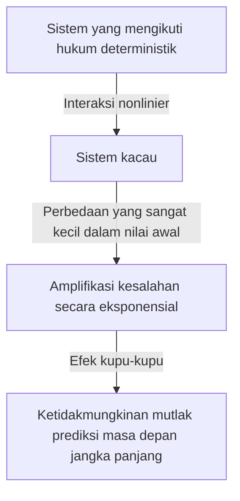
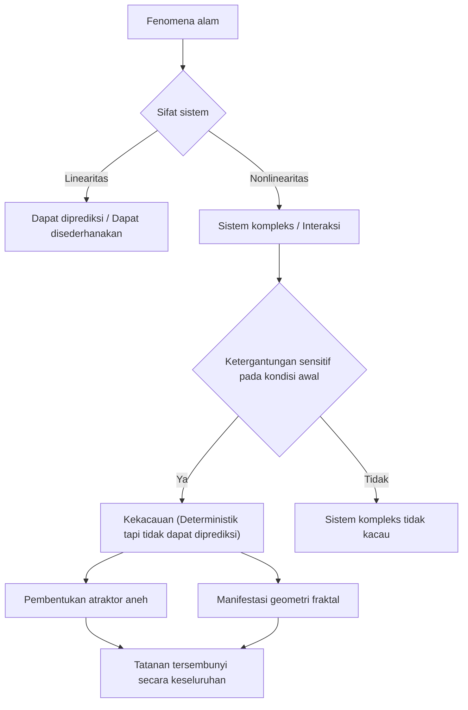

## 1. Pengantar: Apa itu Efek Kupu-kupu?

"Apakah kepakan sayap kupu-kupu di Brasil memicu tornado di Texas?"

Pertanyaan menarik dan misterius ini melambangkan **Efek Kupu-kupu**, salah satu konsep paling terkenal dan paling disalahpahami dalam sains modern. Efek kupu-kupu adalah konsep inti dari **Teori Kekacauan**, yang dipelajari dalam bidang seperti meteorologi, fisika, dan matematika. Ini mengacu pada fenomena di mana "perbedaan kecil pada kondisi awal berlipat ganda secara eksponensial seiring waktu, menghasilkan perbedaan yang menentukan pada keadaan masa depan."

Dalam kehidupan kita sehari-hari, kita secara intuitif cenderung berpikir bahwa sebab dan akibat itu proporsional. Dengan kata lain, ini adalah pandangan dunia linier di mana perubahan kecil membawa hasil kecil, dan perubahan besar membawa hasil besar. Namun, bertentangan dengan intuisi ini, banyak fenomena di alam berperilaku dengan cara yang sangat nonlinier. Fluktuasi kecil dapat menghasilkan perubahan besar. Teori kekacauan memberikan kerangka matematika untuk mengungkap tatanan tersembunyi di balik fenomena kompleks yang tampaknya tidak teratur dan tidak dapat diprediksi ini.

Dalam artikel ini, kita akan menjelaskan secara mendalam teori kekacauan dan efek kupu-kupu, mulai dari latar belakang sejarahnya hingga dasar matematika, hubungan yang mendalam dengan geometri fraktal, dan beragam aplikasinya dalam masyarakat modern. Mari kita memulai perjalanan untuk menjelajahi mengapa masa depan tidak dapat diprediksi dan jenis keindahan apa yang tersembunyi di balik ketidakpastian itu.

---

## 2. Latar Belakang Sejarah: Dari [Poincaré](https://kenji.blog/id/p/poincare/) hingga Lorenz

Benih-benih teori kekacauan dapat ditelusuri kembali ke penelitian matematikawan besar Prancis abad ke-19, [Henri Poincaré](https://kenji.blog/id/p/poincare/). Pada saat itu, salah satu tantangan terbesar dalam fisika adalah "masalah tiga benda." Ini adalah masalah memprediksi pergerakan tiga benda langit, seperti Matahari, Bumi, dan Bulan, yang saling memberikan gaya gravitasi berdasarkan mekanika Newton.

Sambil mempelajari masalah ini secara mendalam, [Poincaré](https://kenji.blog/id/p/poincare/) menemukan bahwa pergerakan benda langit bisa menjadi sangat kompleks. Ia secara matematis menyarankan bahwa kesalahan yang sangat kecil pada posisi atau kecepatan awal dapat meluas seiring waktu, pada akhirnya mengarah pada lintasan benda langit yang sama sekali berbeda. Ini secara virtual merupakan penemuan pertama dari perilaku kacau, menunjukkan bahwa bahkan dalam sistem deterministik (sistem di mana hukum-hukumnya diketahui sepenuhnya), prediksi jangka panjang kadang-kadang bisa menjadi tidak mungkin. Namun, karena keterbatasan metode matematika dan daya komputasi (ketiadaan komputer) pada saat itu, penemuan inovatif ini tidak dieksplorasi secara mendalam selama beberapa dekade sesudahnya.

Situasinya berubah secara dramatis pada tahun 1960-an. Edward Lorenz, seorang ahli meteorologi di Massachusetts Institute of Technology (MIT), sedang mensimulasikan konveksi atmosfer menggunakan komputer awal. Ia menciptakan serangkaian persamaan diferensial nonlinier sederhana untuk menghitung variabel-variabel seperti suhu, tekanan, dan kecepatan angin, serta menghitung nilai-nilainya menggunakan komputer.

Suatu hari, Lorenz mencoba memulai kembali simulasi dari tengah pengoperasian sebelumnya. Ia memasukkan kembali angka-angka dari hasil cetakan, tetapi ia secara tidak sengaja mengetikkan "0.506"—nilai yang dibulatkan menjadi tiga tempat desimal dari cetakan—alih-alih nilai presisi enam digit internal "0.506127" yang disimpan oleh komputer.

Ketika Lorenz kembali dari rehat kopinya, pemandangan yang menakjubkan menantinya. Hasil simulasi yang dimulai kembali pada awalnya cocok dengan pengoperasian sebelumnya untuk beberapa langkah pertama, tetapi segera mulai melacak pola cuaca yang sama sekali berbeda. Perbedaan awal yang sangat kecil hanya 0,000127 menghasilkan skenario cuaca masa depan yang sama sekali berbeda. Inilah momen penemuan fenomena yang kemudian disebut Lorenz sebagai **Ketergantungan sensitif pada kondisi awal**, yang akan dikenal dunia sebagai efek kupu-kupu.

---

## 3. Dasar Matematika: Sistem Dinamis Nonlinier dan Persamaan Lorenz

Untuk memahami teori kekacauan secara matematis, penting untuk memahami konsep **Sistem Dinamis** dan **Non-linearitas**.

Sistem dinamis adalah model matematika dari suatu sistem yang keadaannya berubah seiring waktu. Keadaan sistem di masa depan sepenuhnya ditentukan oleh keadaannya saat ini dan hukum deterministik (biasanya persamaan diferensial atau selisih) yang mengatur sistem tersebut. Poin utamanya di sini adalah bahwa hukum itu sendiri sama sekali tidak mengandung elemen probabilistik (peluang, seperti melempar dadu).

Sistem dinamis secara umum diklasifikasikan menjadi sistem linier dan nonlinier. Dalam sistem linier, sebab dan akibat itu proporsional, dan prinsip superposisi berlaku, di mana "jumlah bagian sama dengan keseluruhan." Ini relatif mudah dipecahkan secara matematis, dan prediksinya mudah. Di sisi lain, dalam sistem nonlinier, variabel dikalikan bersama atau ada putaran umpan balik, melanggar hubungan proporsional antara sebab dan akibat. Ini menunjukkan perilaku di mana "jumlah bagian berbeda dari keseluruhan," yang menyebabkan fenomena yang sangat kompleks. Kekacauan hanya terjadi dalam sistem nonlinier.

Kumpulan persamaan diferensial nonlinier paling terkenal yang menghasilkan kekacauan, yang diturunkan oleh Edward Lorenz dari model konveksi atmosfer, adalah **Persamaan Lorenz**. Persamaan ini terdiri dari tiga variabel berikut ($x, y, z$) dan tiga parameter ($\sigma, \rho, \beta$).

$$
\frac{dx}{dt} = \sigma (y - x)
$$

$$
\frac{dy}{dt} = x (\rho - z) - y
$$

$$
\frac{dz}{dt} = x y - \beta z
$$

Di sini, setiap variabel memiliki arti fisik:
- $x$ adalah tingkat konveksi (kecepatan rotasi fluida)
- $y$ adalah variasi suhu horizontal antara arus naik dan turun
- $z$ adalah penyimpangan profil suhu vertikal dari linearitas
- $\sigma$ (bilangan Prandtl), $\rho$ (bilangan Rayleigh), dan $\beta$ (rasio aspek sistem) adalah parameter.

Sebagai nilai parameter yang menunjukkan perilaku kacau yang khas, Lorenz memilih $\sigma = 10, \rho = 28, \beta = 8/3$. Meskipun sistem persamaan ini deterministik, solusinya tidak pernah mengulangi keadaan masa lalu dan terus melacak lintasan yang sangat kompleks. Istilah nonlinier dalam persamaan, seperti $xz$ dan $xy$, memainkan peran yang menentukan dalam menghasilkan kekacauan.

---

## 4. Ruang Fase dan Atraktor Aneh

Alat yang kuat untuk memahami perilaku sistem dinamis secara visual adalah **Ruang fase**. Ruang fase adalah ruang multidimensi yang mampu mewakili semua kemungkinan keadaan dari sebuah sistem. Keadaan sistem saat ini direpresentasikan sebagai "satu titik" di ruang fase ini. Seiring berjalannya waktu, perubahan keadaan sistem digambarkan sebagai "lintasan" yang dilacak oleh titik yang bergerak melalui ruang fase.

Dalam banyak sistem dunia nyata dengan disipasi (sifat kehilangan energi, seperti gesekan atau hambatan udara), setelah waktu yang cukup berlalu, sistem akhirnya menetap pada keadaan tertentu (suatu titik) atau keadaan berkala (putaran tertutup). Tempat penyelesaian akhir ini disebut **Atraktor**. Misalnya, gerakan pendulum pada akhirnya akan berhenti di titik terendahnya akibat hambatan udara. Atraktor dalam kasus ini adalah "titik tunggal (titik tetap)". Atraktor untuk sistem yang mengulangi gerakan berkala, seperti detak jantung, adalah "siklus batas (kurva tertutup)".

Namun, dalam sistem kacau seperti persamaan Lorenz, muncul jenis atraktor yang sama sekali berbeda. Inilah **Atraktor Aneh**.

Ketika atraktor Lorenz diplot dalam ruang fase 3D, itu mengungkapkan struktur yang sangat indah dan kompleks menyerupai kupu-kupu dengan sayap terentang atau dua mata. Atraktor aneh ini memiliki fitur-fitur luar biasa berikut:

1. **Terikat**: Lintasan tidak terbang ke tak terhingga; lintasan selalu berada di dalam wilayah tertentu dari atraktor.
2. **Aperiodisitas**: Lintasan tidak pernah melintasi jalurnya sendiri di masa lalu atau mengulangi rute yang persis sama. Secara abadi, lintasan terus melacak jalur baru.
3. **Ketergantungan sensitif pada kondisi awal**: Lintasan yang mulai dari dua titik awal yang sangat dekat pada atraktor akan ditarik saling menjauh ke lokasi yang sama sekali berbeda di dalam atraktor seiring berjalannya waktu.

Meskipun lintasan dibatasi dalam volume terbatas, lintasan tersebut dibatasi untuk tidak pernah bersilangan (karena persilangan akan melanggar premis deterministik bahwa "keadaan yang sama mengarah ke masa depan yang sama"). Untuk mencapai ini, ruang harus "dilipat" tanpa batas. Proses berulang "peregangan" dan "pelipatan" (seperti menguleni adonan) inilah esensi dari kekacauan dan melahirkan struktur kompleks atraktor aneh.

---

## 5. Peta Logistik dan Diagram Bifurkasi

Model matematika penting lainnya untuk memahami teori kekacauan dengan cara yang paling sederhana adalah **Peta logistik**. Ini adalah persamaan selisih kuadrat sederhana yang memodelkan fluktuasi populasi biologis (misalnya, perubahan tahunan pada jumlah kelinci di sebuah pulau).

$$
x_{n+1} = r x_n (1 - x_n)
$$

Di sini,
- $x_n$ mewakili populasi pada generasi ke-$n$ (mengambil nilai dalam kisaran $0 \le x_n \le 1$ sebagai rasio dari daya dukung maksimum lingkungan).
- $x_{n+1}$ adalah populasi generasi berikutnya.
- $r$ adalah parameter yang mewakili tingkat reproduksi (biasanya $0 \le r \le 4$).

Meskipun persamaan ini sangat sederhana, mengubah nilai parameter $r$ menyebabkannya menunjukkan perilaku yang sangat beragam dan kompleks:

- $0 < r < 1$: Populasi pada akhirnya punah, dan $x$ menyatu ke 0.
- $1 < r < 3$: Populasi menyatu pada nilai konstan tertentu (titik tetap) dan stabil.
- Di sekitar $r = 3$: Titik tetap menjadi tidak stabil, dan populasi mulai berganti-ganti di antara dua nilai yang berbeda. Ini disebut **Bifurkasi penggandaan periode**.
- Saat $r$ semakin meningkat, bifurkasi di mana periode berlipat ganda menjadi 4, 8, 16, dst., terjadi dengan cepat.
- Di luar $r \approx 3.56995$ (titik Feigenbaum), periodisitas benar-benar rusak, dan populasi mengambil nilai yang sama sekali tidak dapat diprediksi. Ini adalah keadaan **Kekacauan**.

Memplot keadaan akhir sistem (atraktor) terhadap perubahan $r$ ini menciptakan apa yang disebut **Diagram bifurkasi**. Sumbu horizontal mewakili parameter $r$, dan sumbu vertikal mewakili nilai akhir dari $x$.

Dengan melihat diagram bifurkasi, kita dapat melihat bahwa di dalam daerah kacau, terdapat "Jendela" tempat keteraturan tiba-tiba pulih (misalnya, area periode-3). Yang mengherankan, jika Anda memperbesar sebagian dari diagram bifurkasi ini, itu menunjukkan keserupaan diri, di mana pola yang sama persis dari struktur keseluruhan muncul tanpa batas. Fakta bahwa persamaan kuadrat sederhana mengandung struktur yang begitu kaya memberikan kejutan besar bagi komunitas matematika.

---

## 6. Eksponen Lyapunov: Mengukur Kekacauan

Indikator yang digunakan untuk secara matematis mengukur dengan ketat "ketergantungan sensitif pada kondisi awal" yang melekat pada sistem kacau adalah **Eksponen Lyapunov**.

Pertimbangkan dua keadaan awal yang sangat berdekatan di ruang fase (dengan jarak dilambangkan sebagai $\delta Z_0$) dan amati bagaimana lintasan mereka terpisah sejauh $\delta Z(t)$ saat waktu $t$ berlalu. Dalam kasus sistem kacau, jarak ini meluas secara eksponensial rata-rata.

$$
|\delta Z(t)| \approx e^{\lambda t} |\delta Z_0|
$$

Di sini, $\lambda$ (lambda) adalah eksponen Lyapunov.
Eksponen Lyapunov mewakili tingkat rata-rata di mana lintasan yang berdekatan terpisah (atau saling mendekati).

- $\lambda < 0$: Lintasan saling mendekati dan menyatu ke titik tetap atau siklus batas (bukan kekacauan).
- $\lambda = 0$: Jarak antar lintasan tetap konstan (mis., sistem konservatif).
- $\lambda > 0$: Lintasan ditarik terpisah secara eksponensial. Ini adalah indikator penentu dari **Kekacauan**.

Dalam sistem dinamis multidimensi, terdapat eksponen Lyapunov sebanyak dimensi ruang tersebut (spektrum Lyapunov). Jika setidaknya ada satu eksponen Lyapunov positif, sistem tersebut didefinisikan sebagai kacau. Semakin besar eksponen Lyapunov positif, semakin cepat kesalahan kecil di awal berlipat ganda, sehingga mempersingkat skala waktu di mana masa depan dapat diprediksi (waktu Lyapunov). Inilah alasan matematis fundamental mengapa prakiraan cuaca dapat cukup akurat untuk beberapa hari ke depan namun menjadi sama sekali tidak dapat diprediksi berminggu-minggu sebelumnya.

---

## 7. Hubungan Antara Fraktal dan Kekacauan

Ketika membahas teori kekacauan, orang tidak dapat menghilangkan geometri **Fraktal**, yang diusulkan oleh matematikawan Benoit Mandelbrot. Fraktal adalah bentuk di mana "tidak peduli seberapa banyak Anda memperbesarnya, struktur kompleks serupa (keserupaan diri) yang identik dengan keseluruhannya muncul tanpa batas." Contoh perwakilannya meliputi himpunan Mandelbrot dan kepingan salju Koch.

Kekacauan dan fraktal mungkin tampak seperti konsep yang berbeda pada pandangan pertama, tetapi sebenarnya keduanya adalah dua sisi dari koin yang sama. Jika Anda mengambil penampang atraktor aneh dan mengamatinya dengan cermat, Anda akan menemukan struktur berlapis tanpa batas, mengungkapkan bahwa atraktor tersebut memiliki struktur fraktal.

Dinamika "peregangan dan pelipatan" dalam ruang fase sistem kacau menghasilkan figur fraktal sebagai hasil geometris. Salah satu karakteristik penting dari fraktal adalah bahwa fraktal memiliki "dimensi pecahan (dimensi fraktal)" yang bukan merupakan bilangan bulat. Misalnya, figur yang lebih kompleks dan mengisi ruang daripada garis 1D namun kurang dari bidang 2D mungkin memiliki dimensi 1,26. Atraktor aneh juga merupakan struktur fraktal dengan dimensi pecahan.

Jika kekacauan adalah "dinamika kompleks yang muncul seiring berjalannya waktu," maka fraktal dapat dikatakan sebagai "jejak geometris yang ditinggalkan oleh dinamika tersebut di luar angkasa." Banyak fenomena alam, seperti bentuk garis pantai ria, percabangan pohon, jaringan pembuluh darah, dan bentuk awan, memiliki struktur fraktal, dan diyakini bahwa dinamika nonlinier yang kacau sedang bekerja di balik proses pembentukannya.

---

## 8. Aplikasi di Dunia Nyata: Dari Meteorologi hingga Ekonomi

Teori kekacauan bukan sekadar permainan matematika. Sifat universal dari ketergantungan sensitif pada kondisi awal dan dinamika nonlinier telah membawa penerapan yang luas pada setiap bidang di dunia nyata, melampaui fisika.

### 8.1 Meteorologi dan Perubahan Iklim
Meteorologi, panggung penemuan Lorenz, adalah salah satu bidang yang paling diuntungkan dari teori kekacauan. Atmosfer diatur oleh persamaan nonlinier kompleks tentang dinamika fluida dan termodinamika, sehingga secara inheren menjadi kacau. Saat ini, pendekatan arus utamanya adalah "perkiraan ansambel," yang melibatkan pengenalan fluktuasi kecil secara sengaja ke dalam nilai awal dan menjalankan beberapa simulasi secara bersamaan, bukan mengandalkan prakiraan tunggal. Ini memungkinkan ahli meteorologi untuk secara probabilistik mengevaluasi ketidakpastian prakiraan dan memahami sejauh mana ke masa depan prediksi andal dimungkinkan.

### 8.2 Kedokteran dan Biologi
Ritme biologis manusia juga sangat berkaitan dengan kekacauan. Misalnya, diketahui bahwa interval detak jantung (fluktuasi) dari jantung yang sehat tidak sepenuhnya teratur atau sepenuhnya acak, melainkan memiliki sifat fraktal yang kacau. Sebaliknya, detak jantung penderita penyakit jantung atau lansia bisa menjadi terlalu teratur atau sepenuhnya acak. Hilangnya fluktuasi kacau sedang dipelajari sebagai tanda (biomarker) penting yang mengindikasikan memburuknya kesehatan. Dinamika nonlinier juga sangat penting dalam menganalisis gelombang otak dan memodelkan penyebaran penyakit menular (seperti model SIR dalam epidemiologi).

### 8.3 Ekonomi dan Pasar Keuangan
Pasar keuangan, seperti pasar saham dan valuta asing, merupakan sistem nonlinier yang sangat kompleks di mana psikologi dan tindakan para investor yang tak terhitung jumlahnya saling berinteraksi. Ekonomi tradisional mengasumsikan bahwa pasar efisien dan harga mengikuti gerak acak (pergerakan acak yang sesuai dengan distribusi normal). Namun, di pasar sebenarnya, kejadian ekstrem seperti keruntuhan dan gelembung ekonomi terjadi lebih sering daripada yang diprediksi oleh distribusi normal (fenomena ekor gemuk/fat-tail). Dengan menerapkan teori kekacauan dan fraktal (seperti model multifraktal Mandelbrot), berbagai upaya dilakukan untuk memodelkan struktur nonlinier dengan lebih akurat, memori jangka panjang, dan risiko pecahnya gelembung yang tersembunyi di dalam fluktuasi harga pasar, menerapkan pengetahuan ini ke dalam manajemen risiko.

### 8.4 Rekayasa dan Kontrol
Konsep kekacauan juga penting di bidang teknik (rekayasa). Fenomena kekacauan terpantau di banyak sistem, seperti getaran sayap pada pesawat terbang (flutter), sinkronisasi osilator nonlinier dalam sirkuit listrik, dan gangguan pada keluaran laser. Secara tradisional, kekacauan dianggap sebagai sesuatu yang harus "dihindari" atau "dihilangkan sebagai kebisingan" karena tidak dapat diprediksi dan membuat sistem menjadi tidak stabil. Namun, hari ini teknologi yang disebut "Kontrol Kekacauan" telah berkembang, yang memanfaatkan energi kecil yang melekat pada sistem untuk memandunya secara terampil dari keadaan kacau ke keadaan berkala yang diinginkan, sehingga menstabilkannya. Aplikasi untuk komunikasi kriptografi menggunakan keacakan sinyal kacau (kriptografi kekacauan) juga sedang diteliti.

---

## 9. Implikasi Filosofis: Determinisme dan Prediktabilitas

Munculnya teori kekacauan telah membawa pergeseran paradigma mendasar ke dalam filosofi sains, khususnya mengenai pandangan dunia kita tentang "Determinisme" dan "Prediktabilitas".

Matematikawan Prancis abad ke-18 Pierre-Simon Laplace mengusulkan eksperimen pikiran berikut: "Jika ada kecerdasan yang dapat sepenuhnya menangkap posisi dan momentum semua atom di alam semesta saat ini dan cukup luas untuk menganalisisnya, untuk kecerdasan semacam itu, masa depan, sama seperti masa lalu, akan hadir di depan matanya." Kecerdasan hipotetis ini disebut **Iblis Laplace**, dan melambangkan pandangan dunia deterministik yang kuat tentang alam semesta berdasarkan mekanika klasik.

Determinisme adalah gagasan bahwa "jika keadaan saat ini sepenuhnya ditentukan, masa depan ditentukan secara unik menurut hukum fisika." Persamaan yang ditangani oleh teori kekacauan (seperti persamaan Lorenz) adalah persamaan deterministik murni yang tidak mengandung elemen probabilistik. Oleh karena itu, pada prinsipnya, iblis Laplace harus dapat dengan sempurna memprediksi masa depan sistem yang kacau juga.

Namun, teori kekacauan secara dingin menghadapkan kita dengan **Batas prediktabilitas** di dunia nyata. Kenyataannya, mustahil untuk mengukur setiap keadaan awal alam semesta dengan "presisi tak terhingga (tanpa kesalahan)." Bahkan tanpa memperhitungkan prinsip ketidakpastian mekanika kuantum, kemampuan pengamatan kita secara inheren memiliki batas yang terbatas.

Dalam sistem yang kacau, betapapun kecilnya kesalahan pengamatan ini, hal itu berkembang secara eksponensial dari waktu ke waktu, dan pada akhirnya melanda seluruh sistem. Dengan kata lain, menjadi jelas bahwa "menjadi deterministik" dan "menjadi terprediksi" adalah dua konsep yang sama sekali berbeda. Teori kekacauan mengistirahatkan iblis Laplace dan mengajarkan umat manusia kebenaran mendalam bahwa "bahkan jika hukumnya diketahui dengan sempurna, masa depan secara fundamental tidak dapat diprediksi."

Pergeseran paradigma ini menyajikan pandangan dunia baru: "Dunia kita kompleks dan tidak dapat diprediksi, tetapi di baliknya terdapat struktur matematika deterministik yang indah." Alih-alih menyerah pada prediksi sempurna, sebuah jalan telah terbuka untuk memahami "keteraturan tingkat makro" yang tersembunyi di dalam kekacauan dengan mempelajari bentuk atraktor dan memahami distribusi probabilistik.

---

## 10. Kesimpulan

Dalam artikel ini, kita telah mengeksplorasi secara mendalam efek kupu-kupu—di mana perbedaan mikroskopis dalam kondisi awal menghasilkan hasil yang sangat besar—dan teori kekacauan yang melingkupinya.

Mulai dari intuisi [Poincaré](https://kenji.blog/id/p/poincare/), melewati penemuan tidak sengaja Lorenz melalui komputer, teori kekacauan telah berkembang menjadi bidang luas yang melintasi matematika dan fisika. Dasar-dasar matematikanya sangat disempurnakan dan penuh keajaiban intelektual, sebagaimana terlihat dalam lintasan atraktor aneh yang indah yang digambar oleh persamaan nonlinier, keserupaan diri tak terhingga yang diamati dalam peta logistik, dan kuantifikasi ketidakpastian melalui eksponen Lyapunov.

Teori kekacauan tidak hanya mengajarkan kita tentang keterbatasan prakiraan cuaca tetapi juga menyediakan lensa yang kuat untuk memahami fenomena kompleks di sekitar kita, dari fluktuasi ekonomi dan detak jantung hingga evolusi kehidupan. Ini mengungkapkan bahwa alam bukanlah mesin jam sederhana, melainkan sistem dinamis yang dipenuhi dengan ketidakpastian dan kreativitas.

Deterministik namun tak terduga. Sifat yang tampaknya saling bertentangan ini justru merupakan pesona terbesar dari teori kekacauan. Fakta bahwa masa depan sepenuhnya ditentukan, namun tidak ada seorang pun (dan tidak peduli seberapa kuatnya komputer) yang dapat mengetahui masa depannya yang mendetail, membuat persepsi kita terhadap alam semesta menjadi lebih rendah hati dan lebih kaya. Dunia nonlinier yang ditenun oleh kekacauan dan fraktal tentu akan terus mempesona para ilmuwan dan membawa penemuan baru di masa depan.

