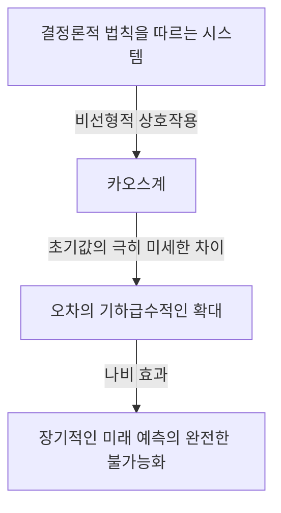
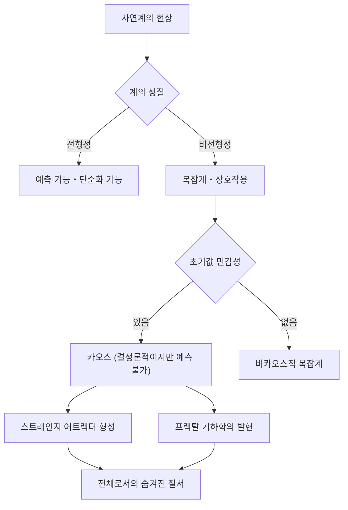

## 1. 서론: 나비 효과란 무엇인가

"브라질에 있는 한 마리 나비의 날갯짓이 텍사스에 토네이도를 일으킬 수 있을까?"

이 매혹적이고 미스터리한 질문은 현대 과학에서 가장 유명하고 동시에 가장 오해받기 쉬운 개념 중 하나인 **나비 효과** (Butterfly Effect)를 상징합니다. 나비 효과란 기상학, 물리학, 수학 등의 분야에서 연구되는 **카오스 이론** (Chaos Theory)의 핵심을 이루는 개념으로, "초기 조건의 아주 작은 차이가 시간이 지남에 따라 기하급수적으로 확대되어, 결과적으로 미래 상태에 결정적인 차이를 가져오는" 현상을 가리킵니다.

우리의 일상생활에서 원인과 결과는 비례 관계에 있다고 직관적으로 생각하기 쉽습니다. 즉, 작은 변화는 작은 결과를 가져오고, 큰 변화는 큰 결과를 가져온다는 선형적인 세계관입니다. 하지만 자연계의 많은 현상은 이러한 직관과 반대로 극히 비선형적인 움직임을 보입니다. 아주 작은 요동이 거대한 변화를 만들어낼 수 있는 것입니다. 카오스 이론은 이렇게 언뜻 보기에 무질서하고 예측 불가능해 보이는 복잡한 현상 이면에 숨어 있는 질서를 밝혀내기 위한 수학적 틀을 제공합니다.

본 기사에서는 이 [카오스 이론과 나비 효과](https://kenji.blog/p/chaos-theory/)에 대해 그 역사적 배경부터 수학적 기초, 프랙탈 기하학과의 깊은 연관성, 그리고 현대 사회의 다양한 응용까지 철저하게 해설해 나가겠습니다. 미래가 왜 예측 불가능한지, 그리고 그 예측 불가능성 속에 어떤 아름다움이 숨겨져 있는지 탐구하는 여행을 떠나봅시다.

---

## 2. 역사적 배경: 푸앵카레에서 로렌츠로

카오스 이론의 싹은 19세기 말 프랑스의 위대한 수학자 [앙리 푸앵카레](https://kenji.blog/p/poincare/)([Henri Poincaré](https://kenji.blog/p/poincare/))의 연구까지 거슬러 올라갈 수 있습니다. 당시 물리학의 최대 난제 중 하나로 '삼체문제'가 있었습니다. 이는 태양, 지구, 달처럼 서로 중력을 미치는 세 천체의 운동을 뉴턴 역학에 기초하여 예측하는 문제입니다.

푸앵카레는 이 문제를 깊이 연구하던 중 천체의 운동이 극히 복잡해질 수 있음을 발견했습니다. 그는 초기 위치나 속도에서 측정 불가능할 정도로 미세한 오차가 시간이 지남에 따라 확대되어, 최종적인 천체의 궤도를 완전히 다른 것으로 만들어 버릴 가능성을 수학적으로 시사한 것입니다. 이는 사실상 결정론적인 계(법칙이 완전히 알려진 계)라 하더라도 장기적인 예측이 불가능해질 수 있다는 카오스적 움직임의 최초의 발견이었습니다. 하지만 당시의 수학적 기법과 계산 능력(컴퓨터의 부재)의 한계로 인해, 이 획기적인 발견은 그 후 수십 년 동안 깊이 탐구되지 못했습니다.

상황이 극적으로 변한 것은 1960년대에 들어서면서부터입니다. 매사추세츠 공과대학(MIT)의 기상학자 에드워드 로렌츠(Edward Lorenz)는 초기의 컴퓨터를 사용하여 대기의 대류를 시뮬레이션하고 있었습니다. 그는 기온, 기압, 풍속 등의 변수를 계산하기 위해 단순한 비선형 미분방정식 세트를 만들고, 컴퓨터로 수치를 계산하고 있었습니다.

어느 날, 로렌츠는 이전 시뮬레이션의 중간부터 계산을 다시 시작하려고 했습니다. 그는 출력된 계산 결과에서 수치를 다시 입력했는데, 컴퓨터가 내부에 유지하고 있던 '0.506127'이라는 6자리 정밀도의 수치 대신 프린트아웃에 찍혀 있던 반올림된 3자리 수치인 '0.506'을 입력해 버렸습니다.

로렌츠가 커피 휴식에서 돌아왔을 때, 놀라운 광경이 펼쳐져 있었습니다. 재개된 시뮬레이션의 결과는 처음 몇 단계는 이전 결과와 일치했지만, 이내 완전히 다른 기상 패턴을 그리기 시작한 것입니다. 불과 0.000127이라는 극히 미세한 초기값의 차이가 결과적으로 완전히 다른 미래의 기상을 가져왔습니다. 이것이 로렌츠가 훗날 **초기값 민감성** (Sensitive dependence on initial conditions)이라고 부르며 나비 효과로서 세계에 알려지게 될 현상을 발견한 순간이었습니다.

---

## 3. 수학적 기초: 비선형 동역학계와 로렌츠 방정식

카오스 이론을 수학적으로 이해하기 위해서는 **동역학계** (Dynamical Systems)와 **비선형성** (Non-linearity)의 개념을 파악해야 합니다.

동역학계란 시간이 지남에 따라 상태가 변화해 가는 시스템의 수학적 모델입니다. 계의 미래 상태는 현재 상태와 계를 지배하는 결정론적인 법칙(일반적으로 미분방정식이나 차분방정식)에 의해 완전히 결정됩니다. 여기서 중요한 것은 법칙 자체에는 확률적인 요소(주사위를 굴리는 것과 같은 우연성)가 전혀 포함되어 있지 않다는 점입니다.

동역학계는 크게 선형계와 비선형계로 분류됩니다. 선형계에서는 원인과 결과가 비례하며, "부분의 합은 전체와 같다"는 중첩의 원리가 성립합니다. 이들은 수학적으로 풀기 비교적 쉽고, 예측도 용이합니다. 반면, 비선형계에서는 변수끼리 곱해지거나 피드백 루프가 존재하기 때문에 원인과 결과의 비례 관계가 깨집니다. "부분의 합이 전체와 다른" 움직임을 보이며, 극히 복잡한 현상을 일으키는 원인이 됩니다. 카오스는 비선형계에서만 발생합니다.

에드워드 로렌츠가 대기의 대류 모델에서 도출해낸, 카오스를 만들어내는 가장 유명한 비선형 연립미분방정식이 **로렌츠 방정식** (Lorenz equations)입니다. 이는 다음의 세 가지 변수($x, y, z$)와 세 가지 파라미터($\sigma, \rho, \beta$)로 구성됩니다.

$$
\frac{dx}{dt} = \sigma (y - x)
$$

$$
\frac{dy}{dt} = x (\rho - z) - y
$$

$$
\frac{dz}{dt} = x y - \beta z
$$

여기서 각 변수는 물리적인 의미를 갖습니다.
- $x$ 는 대류의 강도 (유체의 회전 속도)
- $y$ 는 상승 기류와 하강 기류의 온도 차이
- $z$ 는 수직 방향의 온도 분포의 선형성으로부터의 벗어남
- $\sigma$ (프란틀 수), $\rho$ (레이리 수), $\beta$ (계의 종횡비)는 파라미터입니다.

전형적인 카오스적 움직임을 보여주는 파라미터 값으로서 로렌츠는 $\sigma = 10, \rho = 28, \beta = 8/3$ 을 선택했습니다. 이 방정식계는 결정론적이면서도 해는 결코 과거와 같은 상태를 반복하지 않고 끝없이 복잡한 궤적을 계속 그립니다. 방정식 안에 있는 $xz$ 나 $xy$ 같은 비선형 항이 카오스를 만들어내는 결정적인 역할을 하고 있습니다.

---

## 4. 위상 공간과 스트레인지 어트랙터

동역학계의 움직임을 시각적으로 이해하기 위한 강력한 도구가 **위상 공간** (Phase space)입니다. 위상 공간이란 시스템이 가질 수 있는 모든 상태를 표현할 수 있는 다차원 공간입니다. 계의 현재 상태는 이 위상 공간 안의 '하나의 점'으로 표시됩니다. 시간이 지남에 따라 계의 상태가 변화해 가는 모습은 위상 공간 안을 점이 이동해 가는 '궤도(트라젝토리)'로서 그려집니다.

마찰이나 공기 저항과 같은 소산(에너지를 잃는 성질)을 가진 현실의 많은 시스템에서는 시간이 충분히 지나면 계는 최종적으로 어떤 특정 상태(점)나 주기적인 상태(닫힌 루프)로 가라앉습니다. 이 최종적인 안착지를 **어트랙터** (Attractor: 끌어당기는 것)라고 부릅니다. 예를 들어 진자의 운동은 공기 저항에 의해 최종적으로 최하점에서 정지합니다. 이 경우의 어트랙터는 '한 점(고정점)'입니다. 심장 박동처럼 주기적인 운동을 반복하는 계의 어트랙터는 '리미트 사이클(폐곡선)'이 됩니다.

하지만 로렌츠 방정식과 같은 카오스계에서는 전혀 다른 종류의 어트랙터가 출현합니다. 그것이 바로 **스트레인지 어트랙터** (Strange Attractor)입니다.

로렌츠 어트랙터를 3차원 위상 공간에 그리면, 나비가 날개를 편 듯한, 혹은 두 개의 눈알을 가진 듯한 숨 막히게 아름답고 복잡한 구조가 나타납니다. 이 스트레인지 어트랙터는 다음과 같은 놀라운 특징을 가지고 있습니다.

1. **유계성** : 궤도는 무한의 저편으로 날아가지 않고 어트랙터의 특정 영역 안에 항상 머무릅니다.
2. **비주기성** : 궤도는 결코 자신의 과거 궤도와 교차하거나 완전히 같은 경로를 반복하지 않습니다. 영원히 새로운 경로를 계속 따라갑니다.
3. **초기값 민감성** : 어트랙터 상의 극히 가까운 두 초기점에서 출발한 궤도는 시간이 지남에 따라 어트랙터 안에서 전혀 다른 장소로 멀어집니다.

궤도는 유한한 부피 속에 갇혀 있음에도 불구하고 결코 교차하지 않는다는(교차하면 결정론의 전제인 '같은 상태에서는 같은 미래가 도출된다'에 위배되므로) 제약이 있습니다. 이를 실현하기 위해서는 공간을 무한히 '접어야' 합니다. 이 '늘리기'와 '접기'의 반복 과정(마치 빵 반죽을 반죽하는 듯한 과정)이야말로 카오스의 본질이며, 스트레인지 어트랙터의 복잡한 구조를 만들어내고 있는 것입니다.

---

## 5. 로지스틱 사상과 분기도

카오스 이론을 가장 심플하게 이해하기 위한 또 하나의 중요한 수학적 모델이 **로지스틱 사상** (Logistic map)입니다. 이는 생물의 개체 수 변동(예를 들어, 어느 섬에 있는 토끼 수의 매년 변화)을 모델화한 단순한 2차 차분방정식입니다.

$$
x_{n+1} = r x_n (1 - x_n)
$$

여기서,
- $x_n$ 은 $n$ 세대째의 개체 수를 나타냅니다(환경의 최대 수용 수에 대한 비율로서 $0 \le x_n \le 1$ 의 범위를 갖습니다).
- $x_{n+1}$ 은 다음 세대의 개체 수입니다.
- $r$ 은 번식률을 나타내는 파라미터입니다(보통 $0 \le r \le 4$).

이 방정식은 매우 단순하지만, 파라미터 $r$ 의 값을 변화시킴으로써 놀랍도록 다양하고 복잡한 움직임을 보입니다.

- $0 < r < 1$ : 개체군은 최종적으로 멸종하고, $x$ 는 0으로 수렴합니다.
- $1 < r < 3$ : 개체 수는 어느 일정한 값(고정점)에 수렴하여 안정됩니다.
- $r = 3$ 부근 : 고정점이 불안정해지고, 개체 수는 두 개의 다른 값 사이를 번갈아 오가게 됩니다. 이를 **주기배가분기** (Period-doubling bifurcation)라고 부릅니다.
- $r$ 을 더욱 증가시키면, 주기가 4, 8, 16으로 차례차례 배가되는 분기가 급속하게 일어납니다.
- $r \approx 3.56995$ (파이겐바움 점)을 넘어서면, 주기성은 완전히 붕괴되고 개체 수는 전혀 예측 불가능한 값을 취하게 됩니다. 이것이 **카오스** 의 상태입니다.

이 $r$ 의 변화에 대한 시스템의 최종적인 상태(어트랙터)를 그래프로 그린 것을 **분기도** (Bifurcation diagram)라고 부릅니다. 가로축에 파라미터 $r$ , 세로축에 $x$ 의 최종적인 값을 취합니다.

분기도를 보면, 카오스의 영역 안에 갑자기 질서가 회복되는 '창(Window)'이라고 불리는 영역(예를 들어 주기 3의 영역)이 존재함을 알 수 있습니다. 그리고 놀랍게도 이 분기도의 일부분을 확대해 나가면 전체의 구조와 똑같은 패턴이 무한히 나타나는 자기유사성을 가지고 있습니다. 단순한 2차 방정식이 이토록 풍부한 구조를 내포하고 있다는 사실은 수학계에 큰 충격을 주었습니다.

---

## 6. 리아프노프 지수: 카오스의 정량화

카오스계가 갖는 '초기값 민감성'을 수학적으로 엄밀하게 정량화하기 위한 지표가 **리아프노프 지수** (Lyapunov Exponent)입니다.

위상 공간에서 극히 가까운 두 초기 상태(거리를 $\delta Z_0$ 로 함)에서 출발한 궤도가 시간 $t$ 의 경과와 함께 거리 $\delta Z(t)$ 까지 멀어져 가는 모습을 생각해 봅니다. 카오스계의 경우, 이 거리는 평균적으로 기하급수적으로 확대되어 갑니다.

$$
|\delta Z(t)| \approx e^{\lambda t} |\delta Z_0|
$$

여기서 $\lambda$ (람다)가 리아프노프 지수입니다.
리아프노프 지수는 인접한 궤도가 어느 정도의 속도로 멀어져 가는지(또는 가까워져 가는지)의 평균적인 비율을 나타냅니다.

- $\lambda < 0$ : 궤도는 서로 가까워져 가고, 고정점이나 리미트 사이클에 수렴합니다(카오스가 아님).
- $\lambda = 0$ : 궤도 간의 거리는 일정한 채 유지됩니다(보존계 등).
- $\lambda > 0$ : 궤도는 기하급수적으로 멀어집니다. 이것이 **카오스** 의 결정적인 지표입니다.

다차원 동역학계에서는 공간의 차원과 같은 수의 리아프노프 지수(리아프노프 스펙트럼)가 존재합니다. 적어도 하나의 양의 리아프노프 지수가 존재할 경우, 그 계는 카오스적이라고 정의됩니다. 양의 리아프노프 지수가 클수록 초기의 미세한 오차가 급속히 확대되기 때문에, 미래의 예측 가능한 시간 척도(리아프노프 시간)가 짧아집니다. 이는 일기예보가 며칠 앞까지는 어느 정도 정확해도, 몇 주 앞이 되면 전혀 예측 불가능해지는 근본적인 수학적 이유입니다.

---

## 7. 프랙탈과 카오스의 관계

카오스 이론을 이야기하는 데 있어 빼놓을 수 없는 것이 수학자 브누아 망델브로(Benoit Mandelbrot)가 제창한 **프랙탈** (Fractal) 기하학입니다. 프랙탈이란 "아무리 확대해도 항상 전체와 같은 복잡한 구조(자기유사성)가 무한히 나타나는 도형"을 말합니다. 대표적인 것으로 망델브로 집합이나 코흐 곡선 등이 있습니다.

카오스와 프랙탈은 언뜻 다른 개념처럼 보이지만, 사실 표리일체의 관계에 있습니다. 스트레인지 어트랙터의 단면도를 잘라내어 상세히 관찰하면, 그곳에는 무한히 겹쳐진 층상 구조가 나타나며, 그것이 프랙탈 구조를 가지고 있음을 알 수 있습니다.

카오스계의 위상 공간에서의 '늘리기와 접기'라는 역학이 기하학적인 결과로서 프랙탈 도형을 만들어내고 있는 것입니다. 프랙탈의 중요한 특징 중 하나로 정수가 아닌 '분수 차원(프랙탈 차원)'을 갖는다는 점이 있습니다. 예를 들어, 1차원의 선보다는 복잡하게 공간을 채우지만 2차원의 평면에는 미치지 못하는 도형은 1.26차원이라는 값을 갖습니다. 스트레인지 어트랙터 또한 분수 차원을 갖는 프랙탈 구조체입니다.

카오스가 '시간의 경과와 함께 나타나는 복잡한 역학'이라면, 프랙탈은 '그 역학이 공간에 새겨놓은 기하학적인 발자취'라고 할 수 있을 것입니다. 자연계에서의 리아스식 해안의 형태, 수목의 가지 갈라짐, 혈관의 네트워크, 구름의 형태 등 많은 자연 현상이 프랙탈 구조를 가지고 있으며, 그 형성 과정의 이면에는 카오스적인 비선형 역학이 작용하고 있다고 생각되고 있습니다.

---

## 8. 현실 세계로의 응용: 기상에서 경제학까지

카오스 이론은 단순한 수학적 유희가 아닙니다. 초기값 민감성과 비선형 역학이라는 보편적인 성질은 물리학의 틀을 넘어 현실 세계의 모든 분야에 광범위한 응용을 가져오고 있습니다.

### 8.1 기상학과 기후 변화
로렌츠 발견의 무대인 기상학은 카오스 이론의 혜택을 가장 많이 받고 있는 분야 중 하나입니다. 대기는 유체역학과 열역학의 복잡한 비선형 방정식으로 지배되고 있어 본질적으로 카오스입니다. 현재는 단일 예측이 아니라, 초기값에 의도적으로 미세한 요동을 주어 여러 시뮬레이션을 동시에 실행하는 '앙상블 예보'라는 기법이 주류가 되어 있습니다. 이를 통해 예측의 불확실성을 확률적으로 평가하고, 어느 정도의 기간까지라면 신뢰할 수 있는 예측이 가능한지를 파악할 수 있게 되었습니다.

### 8.2 의학과 생물학
인간의 생체 리듬도 카오스와 깊이 관련되어 있습니다. 예를 들어, 건강한 심장의 심박 간격(요동)은 완전히 규칙적이지도 완전히 무작위적이지도 않으며, 카오스적인 프랙탈 특성을 가지고 있음이 밝혀져 있습니다. 심장병 환자나 고령자의 심박은 반대로 너무 규칙적이게 되거나 완전히 무작위적이게 되는 경우가 있어, 카오스적 요동의 상실은 건강 상태의 악화를 나타내는 중요한 사인(바이오마커)으로서 연구되고 있습니다. 또한 뇌파의 해석이나 감염병 유행의 모델링(역학에서의 SIR 모델 등)에도 비선형 역학은 필수적입니다.

### 8.3 경제학과 금융 시장
주식 시장이나 환율 시세 등의 금융 시장은 무수한 투자자들의 심리와 행동이 상호작용하는 극히 복잡한 비선형 시스템입니다. 전통적인 경제학에서는 시장은 효율적이고 가격은 [랜덤 워크](https://kenji.blog/p/random-walk/)(정규 분포를 따르는 무작위적인 움직임)를 한다고 가정되어 왔지만, 실제 시장에서는 폭락이나 버블 같은 극단적인 사상이 정규 분포의 예측보다 훨씬 높은 빈도로 발생합니다(팻 테일 현상). 카오스 이론이나 프랙탈(망델브로가 제창한 멀티프랙탈 모델 등)을 응용함으로써, 시장의 가격 변동에 잠재된 비선형적 구조나 장기 기억성, 버블 붕괴의 리스크를 보다 정확하게 모델화하고 리스크 관리에 활용하려는 시도가 이루어지고 있습니다.

### 8.4 공학과 제어
공학 분야에서도 카오스의 개념은 중요합니다. 항공기 날개의 진동(플러터 현상), 전기 회로에서의 비선형 진동자의 동기화, 레이저 출력의 흐트러짐 등 많은 시스템에서 카오스 현상이 관찰됩니다. 종래 카오스는 예측 불가능하고 시스템을 불안정하게 만들기 때문에 "피해야 할 것", "배제해야 할 노이즈"로 여겨져 왔습니다. 하지만 현재는 **카오스 제어** (Chaos Control)라고 불리는 기술이 발전하여, 시스템이 가진 아주 작은 에너지를 이용하여 카오스 상태에서 바람직한 주기적인 상태로 시스템을 솜씨 좋게 유도하고 안정화시키는 기술이 개발되고 있습니다. 또한 카오스 신호의 난수성을 이용한 암호 통신(카오스 암호)으로의 응용도 연구되고 있습니다.

---

## 9. 철학적 의미: 결정론과 예측 가능성

카오스 이론의 등장은 과학 철학, 특히 **결정론** (Determinism)과 **예측 가능성** (Predictability)에 관한 우리의 세계관에 근본적인 패러다임 전환을 가져왔습니다.

18세기 프랑스의 수학자 피에르 시몽 라플라스는 다음과 같은 사고 실험을 제시했습니다. "만약 우주의 모든 원자의 현재 위치와 운동량을 완전히 파악하고 그것들을 해석하기에 족한 지성이 존재한다면, 그 지성에게 있어 미래도 과거와 마찬가지로 현재로서 꿰뚫어 볼 수 있을 것이다." 이 가상의 지성은 **라플라스의 악마** (Laplace's demon)라고 불리며, 고전 역학에 기초한 견고한 결정론적 우주관을 상징하고 있었습니다.

결정론이란 "현재의 상태가 완전히 정해져 있다면, 물리 법칙에 따라 미래는 유일하게 결정된다"는 사고방식입니다. 카오스 이론이 다루는 방정식(로렌츠 방정식 등)은 확률론적인 요소를 전혀 포함하지 않는 순수한 결정론적 방정식입니다. 따라서 원리적으로는 라플라스의 악마라면 카오스계의 미래도 완벽하게 예측할 수 있어야 합니다.

하지만 카오스 이론은 현실 세계에서의 **예측 가능성의 한계** 를 냉혹하게 들이밀었습니다. 현실 세계에 있어서 우주의 모든 초기 상태를 '무한한 정밀도로(오차 제로로)' 측정하는 것은 불가능합니다. 양자역학적인 불확정성 원리를 고려하지 않더라도, 우리의 관측 능력에는 반드시 유한한 한계가 있습니다.

카오스계에서는 이 관측 오차가 아무리 작더라도 시간의 흐름과 함께 기하급수적으로 확대되어 최종적으로는 시스템 전체를 뒤덮어 버립니다. 즉, '결정론적이라는 것'과 '예측 가능하다는 것'은 전혀 다른 개념임이 밝혀진 것입니다. 카오스 이론은 라플라스의 악마를 매장하고, "법칙이 완전히 알려져 있더라도 미래는 본질적으로 예측 불가능할 수 있다"는 심오한 사실을 인류에게 가르쳐 주었습니다.

이 패러다임 전환은 "우리의 세계는 복잡하고 예측 불가능하지만, 그 이면에는 아름다운 결정론적인 수학적 구조가 숨어 있다"는 새로운 세계관을 제시하고 있습니다. 완전한 예측을 포기하는 대신, 어트랙터의 모양을 조사하거나 확률적인 분포를 이해함으로써 카오스 속에 숨겨진 '대국적인 질서'를 이해하는 길이 열린 것입니다.

---

## 10. 결론

본 기사에서는 초기 조건의 아주 작은 차이가 큰 결과를 가져오는 나비 효과와 그것을 내포하는 카오스 이론에 대해 깊이 파고들어 보았습니다.

푸앵카레의 직관에서 시작되어 로렌츠의 컴퓨터에 의한 우연한 발견을 거쳐 수학과 물리학을 넘나드는 거대한 분야로 성장한 카오스 이론. 비선형 방정식이 그려내는 스트레인지 어트랙터의 아름다운 궤적, 로지스틱 사상에서 볼 수 있는 무한한 자기유사성, 그리고 리아프노프 지수에 의한 예측 불가능성의 정량화 등 그 수학적 기초는 매우 세련되어 있으며 지적인 놀라움으로 가득 차 있습니다.

카오스 이론은 기상 예측의 한계를 가르쳐 줄 뿐만 아니라 경제의 변동, 심장의 박동, 그리고 생명의 진화에 이르기까지 우리 주변을 둘러싼 복잡한 현상을 이해하기 위한 강력한 렌즈를 제공해 주었습니다. 그것은 자연계가 결코 단순한 시계 장치와 같은 기계가 아니라, 예측 불가능성과 창조성으로 가득 찬 다이내믹한 시스템임을 가르쳐 줍니다.

결정론적이면서도 예측 불가능하다. 이 언뜻 모순되어 보이는 성질이야말로 카오스 이론의 가장 큰 매력입니다. 미래가 완전히 정해져 있으면서도 누구도(그리고 아무리 강력한 컴퓨터라도) 그 상세한 미래를 알 수 없다는 사실은, 우리의 우주에 대한 인식을 보다 겸허하고 또 풍요로운 것으로 만들어 줍니다. 카오스와 프랙탈이 엮어내는 비선형의 세계는 앞으로도 과학자들을 매료시키고 새로운 발견을 계속해서 가져올 것입니다.

