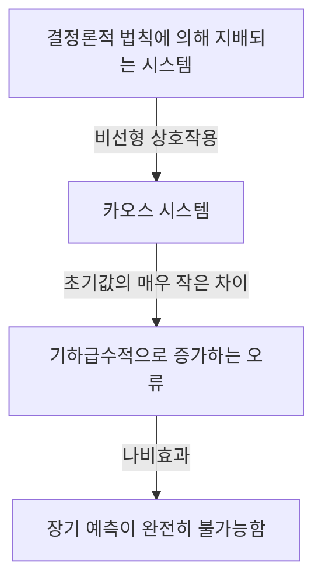
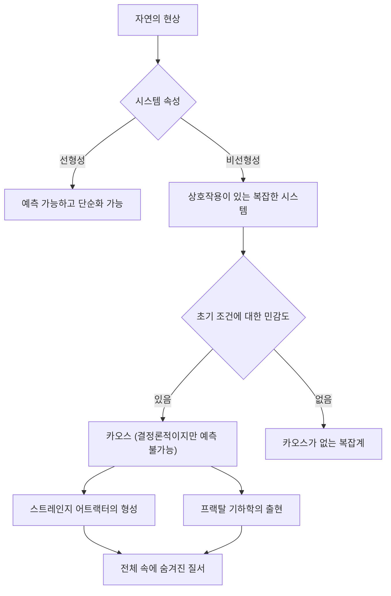

## 1. 서론: 나비효과란 무엇인가?

"브라질에서 나비의 날개짓이 텍사스에서 토네이도를 일으켰나요?"

이 매력적이고 신비로운 질문은 현대 과학에서 가장 유명하면서도 가장 오해가 많은 개념 중 하나인 **나비 효과**를 상징합니다. 나비 효과는 기상학, 물리학, 수학 등을 연구하는 분야인 **카오스 이론**의 핵심 개념입니다. "초기 조건의 작은 차이가 시간이 지나면서 기하급수적으로 증폭되어 궁극적으로 미래 상태에 결정적인 차이가 발생하는" 현상을 말합니다.

일상 생활에서 우리는 원인과 결과 사이의 비례 관계를 직관적으로 가정하는 경향이 있습니다. 작은 변화는 작은 결과를 낳고 큰 변화는 큰 결과를 낳는 선형 세계관입니다. 그러나 자연계의 많은 현상은 매우 비선형적인 방식으로 행동하여 이러한 직관을 거스릅니다. 작은 변화가 엄청난 변화를 가져올 수 있습니다. 카오스 이론은 겉보기에 무질서하고 예측할 수 없는 복잡한 현상 뒤에 숨어 있는 숨겨진 질서를 풀기 위한 수학적 틀을 제공합니다.

이 기사에서 우리는 혼돈 이론과 나비 효과의 역사적 배경과 수학적 기초부터 프랙탈 기하학과의 깊은 연관성을 통해 현대 사회에서의 광범위한 적용에 이르기까지 철저하게 탐구할 것입니다. 미래는 왜 예측할 수 없는지, 그 예측 불가능성 속에는 어떤 아름다움이 숨어 있는지 찾아 떠나는 여행을 떠나보자.

---

## 2. 역사적 배경: 푸앵카레에서 로렌츠까지

혼돈 이론의 씨앗은 19세기 말 프랑스의 위대한 수학자 앙리 푸앵카레의 연구로 거슬러 올라갑니다. 당시 물리학의 가장 큰 난관 중 하나는 뉴턴 역학을 바탕으로 상호 중력 인력을 발휘하는 태양, 지구, 달 등 세 천체의 운동을 예측하는 '삼체 문제'였습니다.

푸앵카레는 이 문제를 심층적으로 연구하면서 천체의 움직임이 엄청나게 복잡해질 수 있다는 사실을 발견했습니다. 그는 초기 위치나 속도의 헤아릴 수 없을 정도로 작은 오류가 시간이 지남에 따라 증폭되어 궁극적으로 최종 궤도를 완전히 다르게 만들 수 있다는 가능성을 수학적으로 제안했습니다. 이는 사실상 혼돈 행동의 첫 번째 발견이었습니다. 결정론적 시스템(법칙이 완전히 알려진 시스템)조차 장기적으로 예측이 불가능해질 수 있다는 발견이었습니다. 그러나 당시의 수학적 방법과 계산 능력(컴퓨터의 부재)의 한계로 인해 이 획기적인 발견은 수십 년 동안 거의 탐구되지 않은 채로 남아 있었습니다.

상황은 1960년대에 극적으로 변했다. 매사추세츠 공과대학(MIT)의 기상학자인 에드워드 로렌츠(Edward Lorenz)는 초기 컴퓨터를 사용하여 대기 대류를 시뮬레이션하고 있었습니다. 그는 온도, 압력, 풍속과 같은 변수를 계산하기 위해 간단한 비선형 미분 방정식 세트를 만들어 기계에서 계산을 실행했습니다.

어느 날 로렌츠는 중간 지점에서 시뮬레이션을 다시 시작하려고 했습니다. 그는 인쇄물의 값을 다시 입력했지만 컴퓨터 내부에 저장된 6자리 정밀도 값 "0.506127"을 사용하는 대신 출력에 인쇄된 3자리 반올림 값인 "0.506"을 입력했습니다.

로렌츠가 커피를 마시고 돌아왔을 때 놀라운 광경이 그를 기다리고 있었습니다. 다시 시작된 시뮬레이션은 처음 몇 단계에서는 이전 결과와 일치했지만 곧 완전히 다른 날씨 패턴을 추적하기 시작했습니다. 단지 0.000127의 아주 작은 초기값 차이가 완전히 다른 날씨 미래를 만들어낸 것입니다. 이것은 나중에 로렌츠가 **초기 조건에 대한 민감도**라고 부른 현상이 발견된 순간이었습니다. 이 현상은 전 세계적으로 나비 효과로 알려지게 되었습니다.

---

## 3. 수학적 기초: 비선형 역학 시스템과 로렌츠 방정식

카오스 이론을 수학적으로 이해하려면 **동적 시스템**과 **비선형성**의 개념을 이해해야 합니다.

동적 시스템은 시간이 지남에 따라 상태가 변하는 시스템의 수학적 모델입니다. 시스템의 미래 상태는 현재 상태와 시스템을 지배하는 결정론적 법칙(보통 미분 방정식 또는 차이 방정식)에 의해 완전히 결정됩니다. 결정적으로, 법칙 자체에는 확률적 요소가 포함되어 있지 않습니다. 주사위를 굴리는 것과 같은 무작위성이 없습니다.

동적 시스템은 크게 선형 시스템과 비선형 시스템으로 구분됩니다. 선형 시스템에서는 원인과 결과가 비례하며 "부분의 합은 전체와 같다"는 중첩 원리가 적용됩니다. 이러한 문제는 수학적으로 풀고 예측하기가 상대적으로 쉽습니다. 그러나 비선형 시스템에서는 변수가 함께 곱해지거나 피드백 루프가 존재하여 원인과 결과 사이의 비례 관계가 깨집니다. 그들은 "부분의 합이 전체와 다르다"는 행동을 보여 극도로 복잡한 현상을 일으킨다. 혼돈은 비선형 시스템에서만 발생합니다.

Edward Lorenz가 대기 대류 모델에서 파생한 혼돈을 생성하는 가장 유명한 비선형 결합 미분 방정식 세트는 **로렌츠 방정식**입니다. 이는 3개의 변수( $x, y, z$ )와 3개의 매개변수( $\sigma, \rho, \beta$ )로 구성됩니다.

$$
\frac{dx}{dt} = \sigma (y - x)
$$

$$
\frac{dy}{dt} = x (\rho - z) - y
$$

$$
\frac{dz}{dt} = x y - \beta z
$$

여기서 각 변수는 물리적인 의미를 갖습니다.
- $x$는 대류의 강도(유체의 회전 속도)를 나타냅니다.
- $y$는 상승 흐름과 하강 흐름 간의 온도 차이를 나타냅니다.
- $z$는 선형성에서 수직 온도 프로파일의 편차를 나타냅니다.
- $\sigma$(Prandtl 번호), $\rho$(Rayleigh 번호) 및 $\beta$(시스템의 종횡비)는 매개변수입니다.

전형적인 혼란스러운 동작을 나타내는 매개변수 값의 경우 Lorenz는 $\sigma = 10, \rho = 28, \beta = 8/3$를 선택했습니다. 이 방정식 시스템은 결정론적이지만 솔루션은 무한히 복잡한 궤적을 추적하면서 과거 상태를 반복하지 않습니다. 방정식의 비선형 항 $xz$ 및 $xy$는 혼란을 일으키는 데 결정적인 역할을 합니다.

---

## 4. 위상공간과 스트레인지 어트랙터

동적 시스템의 동작을 시각적으로 이해하기 위한 강력한 도구는 **위상 공간**입니다. 위상 공간은 시스템의 생각할 수 있는 모든 상태를 표현할 수 있는 다차원 공간입니다. 시스템의 현재 상태는 이 위상 공간에서 "단일 지점"으로 표시됩니다. 시간이 흐르고 시스템의 상태가 변경됨에 따라 위상 공간을 통한 지점의 이동은 "궤적"을 추적합니다.

소산(마찰이나 공기 저항과 같이 에너지 손실을 유발하는 특성)이 있는 많은 실제 시스템에서 시스템은 충분한 시간이 지나면 결국 특정 상태(점) 또는 주기 상태(폐쇄 루프)에 정착됩니다. 이 최종 목적지를 **어트랙터**(사물을 끌어당기는 것)라고 합니다. 예를 들어, 진자의 운동은 결국 공기 저항으로 인해 가장 낮은 지점에서 정지하게 됩니다. 이 경우 어트랙터는 "단일점(고정점)"입니다. 심장 박동과 같이 주기적인 운동을 반복하는 시스템의 경우 어트랙터는 "한계 사이클(폐쇄 곡선)"입니다.

그러나 로렌츠 방정식과 같은 혼돈계에서는 완전히 다른 종류의 어트랙터, 즉 **이상한 어트랙터**가 나타납니다.

로렌츠 어트랙터를 3차원 위상공간에 플롯하면 나비가 날개를 펼친 모습이나 한 쌍의 눈을 닮은 숨막힐 정도로 아름답고 복잡한 구조가 나타난다. 이 스트레인지 어트랙터는 다음과 같은 놀라운 특성을 가지고 있습니다.

1. **경계**: 궤적은 결코 무한대로 날아가지 않습니다. 그것은 항상 어트랙터의 특정 영역 내에 남아 있습니다.
2. **비주기성**: 궤적은 결코 자신의 과거 경로를 교차하지 않거나 정확히 동일한 경로를 반복하지 않습니다. 그것은 영원히 새로운 길을 따라갑니다.
3. **초기 조건에 대한 민감도**: 어트랙터의 매우 가까운 초기 지점에서 시작하는 두 개의 궤적은 시간이 지남에 따라 어트랙터 내에서 완전히 다른 위치로 분리됩니다.

유한한 부피 내에 제한되어 있음에도 불구하고 궤도는 결코 스스로 교차하지 않습니다(교차는 "동일한 상태가 동일한 미래로 이어진다"는 결정론적 전제를 위반하게 됩니다). 이 제약 조건을 충족하려면 공간을 무한히 "접혀"야 합니다. (빵 반죽을 반죽하는 것과 매우 유사) "늘리고 접는" 반복적인 과정은 혼돈의 본질이며, 스트레인지 어트랙터의 복잡한 구조를 생성합니다.

---

## 5. 로지스틱 사상 및 분기 다이어그램

가장 간단한 형태로 혼돈 이론을 이해하기 위한 또 다른 중요한 수학적 모델은 **로지스틱 맵**입니다. 이는 인구 역학(예: 섬에 있는 토끼 수의 연간 변화)을 모델링하는 간단한 2차 차분 방정식입니다.

$$
x_{n+1} = r x_n (1 - x_n)
$$

여기:
- $x_n$는 $n$ 세대의 인구를 나타냅니다($0 \le x_n \le 1$ 범위에서 환경의 최대 수용 능력에 대한 비율).
- $x_{n+1}$는 차세대 인구입니다.
- $r$는 재생률을 나타내는 매개변수입니다(일반적으로 $0 \le r \le 4$).

이 방정식은 매우 간단하지만 매개변수 $r$를 변경하면 놀라울 정도로 다양하고 복잡한 동작을 나타냅니다.

- $0 < r < 1$: 개체군은 궁극적으로 멸종되고, $x$는 0으로 수렴합니다.
- $1 < r < 3$: 인구는 고정된 값(고정점)으로 수렴하고 안정화됩니다.
- $r = 3$ 근처: 고정점이 불안정해지고 인구가 두 개의 고유한 값 사이에서 교대로 시작됩니다. 이를 **주기 배가 분기**라고 합니다.
- $r$가 더 증가하면 주기가 4, 8, 16 등으로 두 배로 늘어나 분기가 빠르게 발생합니다.
- $r \approx 3.56995$(Feigenbaum 지점)를 넘어서면 주기성은 완전히 무너지고 인구는 완전히 예측할 수 없는 값을 갖습니다. 이것이 바로 **혼돈**의 상태입니다.

$r$의 변화에 ​​대한 시스템의 최종 상태(어트랙터)를 나타내는 그래프를 **분기 다이어그램**이라고 합니다. 가로축은 파라미터 $r$를 나타내고, 세로축은 $x$의 최종값을 나타냅니다.

분기 다이어그램을 조사하면 질서가 갑자기 회복되는 혼돈 영역 내의 영역(예: 3주기 영역)인 "창"이 드러납니다. 놀랍게도 분기 다이어그램의 일부를 확대하면 무한히 나타나는 동일한 전체 패턴, 즉 자기 유사성이 드러납니다. 간단한 2차 방정식에 이렇게 풍부한 구조가 포함되어 있다는 사실은 수학계에 충격파를 보냈습니다.

---

## 6. 리아푸노프 지수: 혼돈의 정량화

혼돈계의 "초기 조건에 대한 민감도"를 엄격하고 수학적으로 정량화하는 척도는 **리아푸노프 지수**입니다.

시간 $t$에 따라 거리 $\delta Z(t)$로 분기되는 위상 공간(거리 $\delta Z_0$로 분리됨)의 매우 가까운 초기 상태에서 시작하는 두 개의 궤적을 고려합니다. 혼란스러운 시스템에서 이 거리는 평균적으로 기하급수적으로 증가합니다.

$$
|\delta Z(t)| \approx e^{\lambda t} |\delta Z_0|
$$

여기서 $\lambda$(lambda)는 Lyapunov 지수입니다.
리아푸노프 지수는 인접한 궤적이 갈라지는(또는 수렴하는) 평균 속도를 나타냅니다.

- $\lambda < 0$: 궤적은 서로를 향해 수렴되어 고정점 또는 한계 주기(혼돈이 아님)로 정착됩니다.
- $\lambda = 0$: 궤적 사이의 거리가 일정하게 유지됩니다(예: 보수적 시스템).
- $\lambda > 0$: 궤적이 기하급수적으로 갈라집니다. 이것이 **혼돈의 결정적인 지표**입니다.

다차원 동적 시스템에는 차원 수만큼 많은 Lyapunov 지수(Lyapunov 스펙트럼)가 있습니다. 적어도 하나의 양의 Lyapunov 지수가 존재하면 시스템은 혼란스러운 것으로 정의됩니다. 양의 리아푸노프 지수가 클수록 초기 작은 오류가 더 빠르게 증폭되어 예측 가능한 시간 척도(Lyapunov 시간)가 단축됩니다. 이것이 일기 예보가 며칠 동안은 합리적으로 정확하지만 앞으로는 완전히 예측할 수 없게 되는 근본적인 수학적 이유입니다.

---

## 7. 프랙탈과 카오스의 관계

혼돈 이론을 논의할 때 반드시 필요한 것은 수학자 베누아 만델브로(Benoit Mandelbrot)가 제안한 **프랙탈** 기하학입니다. 프랙탈이란 "아무리 확대해도 동일한 복잡한 구조(자기 유사성)가 무한히 나타나는 모양"입니다. 대표적인 예로는 Mandelbrot 집합과 Koch 곡선이 있습니다.

카오스와 프랙탈은 언뜻 보면 서로 다른 개념처럼 보이지만 사실은 동전의 양면입니다. 스트레인지 어트랙터의 단면을 쪼개어 자세히 살펴보면 무한히 겹겹이 쌓인 구조가 드러나 프랙탈 기하학이 드러납니다.

혼돈계의 위상 공간에서 "늘이기 및 접기" 역학은 기하학적 결과로 프랙탈 모양을 생성합니다. 프랙탈의 중요한 특성 중 하나는 정수가 아닌 "분수 차원(프랙탈 차원)"을 갖는다는 것입니다. 예를 들어, 공간을 채우지만 2차원 평면에는 미치지 못하는 1차원 선보다 복잡한 모양의 치수는 1.26일 수 있습니다. 스트레인지 어트랙터는 분수 차원을 갖는 프랙탈 구조이기도 합니다.

혼돈이 "시간이 지남에 따라 나타나는 복잡한 역학"이라면 프랙탈은 "해당 역학이 공간에 새기는 기하학적 발자국"입니다. 리아스식 해안선, 나뭇가지, 혈관 네트워크, 구름 모양 등 많은 자연 현상은 프랙탈 구조를 나타내며 혼란스러운 비선형 역학이 그 형성의 기초가 된다고 믿어집니다.

---

## 8. 실제 응용: 날씨에서 경제까지

카오스 이론은 수학적 호기심 그 이상입니다. 초기 조건에 대한 감도와 비선형 동역학이라는 보편적인 특성은 물리학을 넘어 모든 분야에 걸쳐 광범위한 응용을 가져왔습니다.

### 8.1 기상학과 기후변화
로렌츠의 발견이 이루어진 무대인 기상학은 혼돈이론으로부터 가장 많은 혜택을 받은 분야 중 하나이다. 대기는 유체역학과 열역학의 복잡한 비선형 방정식에 의해 지배되며 본질적으로 혼란스럽습니다. 오늘날 단일 예측 대신에 주류 접근 방식은 "앙상블 예측"입니다. 즉, 의도적으로 초기 값을 약간 변경하면서 여러 시뮬레이션을 동시에 실행하는 것입니다. 이를 통해 예측 불확실성에 대한 확률론적 평가를 수행하고 미래까지 신뢰할 수 있는 예측이 얼마나 가능한지 이해할 수 있습니다.

### 8.2 의학과 생물학
인간의 생물학적 리듬도 혼돈과 깊은 관련이 있습니다. 예를 들어, 건강한 심장의 심박수 변동성은 완벽하게 규칙적이지도 않고 완벽하게 무작위적이지도 않습니다. 혼란스러운 프랙탈 특성을 나타냅니다. 심장병 환자와 노인의 경우 심장 박동이 너무 규칙적이거나 완전히 불규칙해질 수 있습니다. 혼란스러운 변동성의 상실은 건강 악화의 중요한 징후(바이오마커)로 연구되고 있습니다. 비선형 역학은 뇌파를 분석하고 전염병 확산을 모델링하는 데에도 필수적입니다(예: 전염병학의 SIR 모델).

### 8.3 경제와 금융시장
주식, 외환시장 등 금융시장은 수많은 투자자의 심리와 행동이 상호작용하는 극도로 복잡한 비선형 시스템이다. 전통적인 경제학에서는 시장이 효율적이고 가격이 무작위 보행(정규 분포를 따르는 무작위 움직임)을 따른다고 가정했지만 실제로는 붕괴나 거품과 같은 극단적인 사건이 정규 분포(팻테일 현상)에서 예측한 것보다 훨씬 더 자주 발생합니다. 연구자들은 카오스 이론과 프랙탈(예: 만델브로가 제안한 다중 프랙탈 모델)을 적용하여 가격 변동, 장기 기억 효과 및 거품 붕괴 위험에 숨겨진 비선형 구조를 보다 정확하게 모델링하여 위험 관리를 개선하려고 시도하고 있습니다.

### 8.4 엔지니어링 및 제어
혼돈은 공학에서도 중요한 개념이다. 항공기 날개의 진동(플러터), 전기 회로의 비선형 발진기 동기화, 레이저 출력 교란 등 많은 시스템에서 혼란스러운 현상이 관찰됩니다. 전통적으로 혼돈은 피해야 할 것으로 여겨졌습니다. 즉, 시스템을 불안정하게 만드는 예측할 수 없는 소음이었습니다. 그러나 오늘날에는 적은 양의 에너지만으로 시스템을 혼돈 상태에서 원하는 주기 상태로 능숙하게 유도하여 안정화시키는 "카오스 제어"라는 기술이 개발되었습니다. 혼돈 신호의 의사 무작위 특성을 암호화된 통신(혼돈 기반 암호화)에 적용하는 연구도 진행 중입니다.

---

## 9. 철학적 함의: 결정론과 예측가능성

혼돈 이론의 출현은 과학 철학, 특히 "결정론"과 "예측 가능성"에 대한 우리의 세계관과 관련하여 근본적인 패러다임 전환을 가져왔습니다.

18세기 프랑스 수학자 피에르 시몽 라플라스는 다음과 같은 사고 실험을 제안했습니다. "만약 지능이 우주의 모든 원자의 정확한 위치와 운동량을 알고 이를 분석할 수 있다면, 그 지능에 대해서는 미래도 과거도 불확실하지 않을 것입니다. 전체 타임라인은 현재처럼 열려 있을 것입니다." 이 가상 지능은 **라플라스의 악마**로 알려져 있으며 고전 역학에 기반을 둔 강력한 결정론적 세계관을 상징합니다.

결정론은 "현재 상태가 완전히 결정되어 있다면 미래는 물리학 법칙에 의해 유일하게 결정된다"고 주장합니다. 카오스 이론에서 다루는 방정식(예: 로렌츠 방정식)은 확률적 요소가 전혀 포함되지 않은 순전히 결정론적 방정식입니다. 따라서 원칙적으로 라플라스의 악마는 혼돈계의 미래를 완벽하게 예측할 수 있어야 한다.

그러나 혼돈 이론은 현실 세계의 **예측 가능성의 한계**를 가차없이 폭로합니다. 현실적으로 우주의 모든 초기 상태를 '무한한 정밀도(오차 제로)'로 측정하는 것은 불가능합니다. 양자역학의 불확정성 원리를 제쳐두더라도 우리의 관찰 능력에는 항상 유한한 한계가 있습니다.

혼란스러운 시스템에서는 관측 오류가 아무리 작더라도 시간이 지남에 따라 기하급수적으로 증폭되어 결국 전체 시스템을 삼켜버립니다. 즉, "결정적이다"와 "예측 가능하다"는 것은 전혀 다른 개념이라는 것이 분명해졌습니다. 카오스 이론은 라플라스의 악마를 잠재우고 인류에게 "법칙이 완전히 알려졌더라도 미래는 본질적으로 예측할 수 없다"는 심오한 진리를 가르쳤습니다.

이러한 패러다임 전환은 새로운 세계관을 제시합니다. "우리의 세계는 복잡하고 예측할 수 없지만 그 뒤에는 아름다운 결정론적 수학적 구조가 있습니다." 완벽한 예측을 포기하고 어트랙터의 형태를 조사하거나 확률적 분포를 이해함으로써 혼돈 속에 숨겨진 '대규모 질서'를 이해할 수 있는 길이 열렸다.

---

## 10. 결론

이 글에서 우리는 초기 조건의 작은 차이가 엄청나게 다른 결과를 가져오는 나비 효과와 이를 둘러싼 혼돈 이론에 대해 깊이 탐구했습니다.

푸앵카레의 직관에서 로렌츠의 우연한 컴퓨터 기반 발견을 통해 혼돈 이론은 수학과 물리학을 아우르는 광범위한 분야로 성장했습니다. 비선형 방정식으로 추적되는 스트레인지 어트랙터의 아름다운 궤적, 로지스틱 맵에서 발견되는 무한한 자기 유사성, 리아푸노프 지수를 통한 예측 불가능성의 정량화 등 그 수학적 기초는 놀랍도록 세련되고 지적 경이로움으로 가득 차 있습니다.

혼돈 이론은 날씨 예측의 한계부터 경제 변동, 심장 박동, 심지어 생명의 진화까지 우리를 둘러싼 복잡한 현상을 이해하는 데 강력한 렌즈를 제공했습니다. 이는 자연계가 결코 단순한 시계 기계가 아니라 예측 불가능성과 창의성으로 가득 찬 역동적인 시스템임을 가르쳐줍니다.

결정론적이지만 예측할 수 없는 이 겉보기에 역설적인 속성은 혼돈 이론의 가장 큰 매력입니다. 미래는 완전히 결정되어 있지만 누구에게도(심지어 가장 강력한 컴퓨터라도) 알 수 없다는 사실은 우주에 대한 우리의 이해를 더욱 겸손하고 풍부하게 만듭니다. 혼돈과 프랙탈로 엮인 비선형 세계는 앞으로도 계속해서 과학자들을 매료시키고 새로운 발견에 영감을 줄 것입니다.

