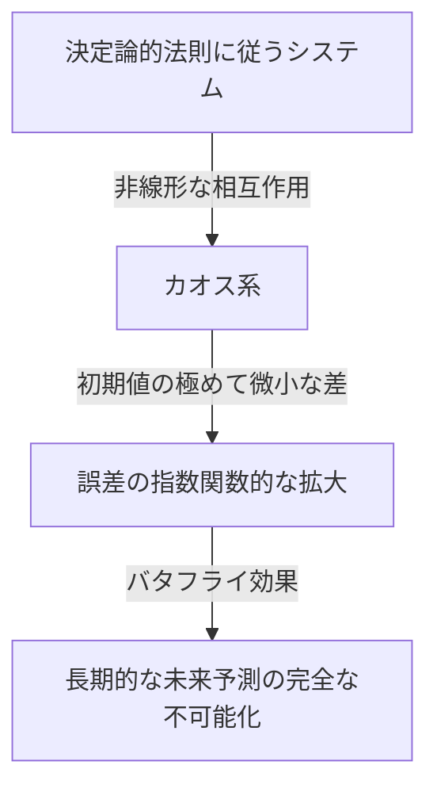
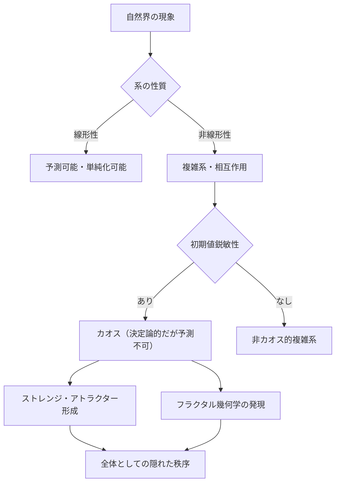

## 1. はじめに：バタフライ効果とは何か

「ブラジルの1匹の蝶の羽ばたきが、テキサスで竜巻を引き起こすか？」

この魅惑的でミステリアスな問いかけは、現代科学において最も有名で、かつ最も誤解されやすい概念の一つである **バタフライ効果** （Butterfly Effect）を象徴しています。バタフライ効果とは、気象学や物理学、数学などの分野で研究される **[カオス理論](https://kenji.blog/p/chaos-theory/)** （Chaos Theory）の中核をなす概念であり、「初期条件のわずかな違いが、時間とともに指数関数的に拡大し、結果として未来の状態に決定的な違いをもたらす」という現象を指します。

私たちの日常生活において、原因と結果は比例関係にあると直感的に考えられがちです。つまり、小さな変化は小さな結果をもたらし、大きな変化は大きな結果をもたらすという線形的な世界観です。しかし、自然界の多くの現象はこの直感に反して、極めて非線形な振る舞いをします。わずかな揺らぎが巨大な変化を生み出すことがあるのです。[カオス理論](https://kenji.blog/p/chaos-theory/)は、こうした一見すると無秩序で予測不可能に見える複雑な現象の背後に潜む、隠された秩序を解き明かすための数学的枠組みを提供します。

本記事では、この[カオス理論](https://kenji.blog/p/chaos-theory/)とバタフライ効果について、その歴史的背景から数学的基礎、フラクタル幾何学との深い関わり、そして現代社会における多岐にわたる応用まで、徹底的に解説していきます。未来がなぜ予測不能なのか、そしてその予測不能性の中にどのような美しさが隠されているのかを探求する旅に出かけましょう。

---

## 2. 歴史的背景：[ポアンカレ](https://kenji.blog/p/poincare/)からローレンツへ

[カオス理論](https://kenji.blog/p/chaos-theory/)の萌芽は、19世紀末のフランスの偉大な数学者[アンリ・ポアンカレ](/p/poincare/)（Henri Poincaré）の研究にまで遡ることができます。当時、物理学の最大の難問の一つに「三体問題」がありました。これは、太陽、地球、月のように、互いに重力を及ぼし合う3つの天体の運動を[ニュートン](https://kenji.blog/p/newton/)力学に基づいて予測する問題です。

[ポアンカレ](https://kenji.blog/p/poincare/)はこの問題を深く研究する中で、天体の運動が極めて複雑になり得ることを発見しました。彼は、初期位置や速度における測定不可能なほどの微小な誤差が、時間の経過とともに拡大し、最終的な天体の軌道を全く異なるものにしてしまう可能性を数学的に示唆したのです。これは事実上、決定論的な系（法則が完全に分かっている系）であっても、長期的な予測が不可能になる場合があるという、カオス的振る舞いの最初の発見でした。しかし、当時の数学的手法と計算能力（コンピューターの不在）の限界により、この画期的な発見はその後数十年にわたり、深く探求されることはありませんでした。

状況が劇的に変わったのは、1960年代に入ってからです。マサチューセッツ工科大学（MIT）の気象学者エドワード・ローレンツ（Edward Lorenz）は、初期のコンピューターを用いて大気の対流をシミュレーションしていました。彼は気温、気圧、風速などの変数を計算するための単純な非線形微分方程式のセットを作成し、コンピューターで数値を計算していました。

ある日、ローレンツは以前のシミュレーションの途中から計算を再開しようとしました。彼はプリントアウトされた計算結果から数値を再入力しましたが、コンピューターが内部で保持していた「0.506127」という6桁の精度の数値を、プリントアウトに印字されていた「0.506」という3桁に丸められた数値で入力してしまったのです。

ローレンツがコーヒーブレイクから戻ると、驚くべき光景が広がっていました。再開されたシミュレーションの結果は、最初の数ステップこそ以前の結果と一致していたものの、すぐに全く異なる気象パターンを描き始めたのです。わずか0.000127という極めて微小な初期値の違いが、結果として全く異なる未来の気象をもたらしました。これが、ローレンツが後に **初期値鋭敏性** （Sensitive dependence on initial conditions）と呼び、バタフライ効果として世界に知られることになる現象の発見の瞬間でした。

---

## 3. 数学的基礎：非線形力学系とローレンツ方程式

[カオス理論](https://kenji.blog/p/chaos-theory/)を数学的に理解するためには、 **力学系** （Dynamical Systems）と **非線形性** （Non-linearity）の概念を把握する必要があります。

力学系とは、時間が経過するにつれて状態が変化していくシステムの数学的モデルです。系の未来の状態は、現在の状態と、系を支配する決定論的な法則（通常は微分方程式や差分方程式）によって完全に決定されます。ここで重要なのは、法則そのものには確率的な要素（サイコロを振るような偶然性）は一切含まれていないということです。

力学系は大きく分けて、線形系と非線形系に分類されます。線形系では、原因と結果が比例し、「部分の和は全体に等しい」という重ね合わせの理が成り立ちます。これらは数学的に解くことが比較的容易であり、予測も容易です。一方、非線形系では、変数同士が掛け合わされたり、フィードバックループが存在したりするため、原因と結果の比例関係が崩れます。「部分の和が全体とは異なる」振る舞いを示し、極めて複雑な現象を引き起こす原因となります。カオスは、非線形系においてのみ発生します。

エドワード・ローレンツが大気の対流モデルから導き出した、カオスを生み出す最も有名な非線形連立微分方程式が **ローレンツ方程式** （Lorenz equations）です。これは以下の3つの変数（ $x, y, z$ ）と3つのパラメータ（ $\sigma, \rho, \beta$ ）から構成されます。

$$
\frac{dx}{dt} = \sigma (y - x)
$$

$$
\frac{dy}{dt} = x (\rho - z) - y
$$

$$
\frac{dz}{dt} = x y - \beta z
$$

ここで、各変数は物理的な意味を持っています。
- $x$ は対流の強さ（流体の回転速度）
- $y$ は上昇流と下降流の温度差
- $z$ は垂直方向の温度分布の線形性からのズレ
- $\sigma$ （プラントル数）、 $\rho$ （レイリー数）、 $\beta$ （系のアスペクト比）はパラメータです。

典型的なカオス的振る舞いを示すパラメータ値として、ローレンツは $\sigma = 10, \rho = 28, \beta = 8/3$ を選びました。この方程式系は決定論的でありながら、解は決して過去と同じ状態を繰り返すことなく、無限に複雑な軌跡を描き続けます。方程式の中にある $xz$ や $xy$ といった非線形項が、カオスを生み出す決定的な役割を果たしています。

---

## 4. 位相空間とストレンジ・アトラクター

力学系の振る舞いを視覚的に理解するための強力なツールが **位相空間** （Phase space）です。位相空間とは、システムの考え得るすべての状態を表現できる多次元の空間です。系の現在の状態は、この位相空間内の「1つの点」として表されます。時間が進むにつれて、系の状態が変化していく様子は、位相空間内を点が移動していく「軌道（トラジェクトリ）」として描かれます。

摩擦や空気抵抗などの散逸（エネルギーを失う性質）を持つ現実の多くのシステムでは、時間が十分に経過すると、系は最終的にある特定の状態（点）や、周期的な状態（閉じたループ）に落ち着きます。この最終的な落ち着き先を **アトラクター** （Attractor：引き寄せるもの）と呼びます。例えば、振り子の運動は、空気抵抗によって最終的に最下点で静止します。この場合のアトラクターは「一点（固定点）」です。心臓の鼓動のように周期的な運動を繰り返す系のアトラクターは「リミットサイクル（閉曲線）」となります。

しかし、ローレンツ方程式のようなカオス系では、全く異なる種類のアトラクターが出現します。それが **ストレンジ・アトラクター** （Strange Attractor）です。

ローレンツ・アトラクターを3次元の位相空間に描画すると、蝶が羽を広げたような、あるいは2つの目玉を持つような、息を呑むほど美しい複雑な構造が現れます。このストレンジ・アトラクターには以下のような驚くべき特徴があります。

1. **有界性** ：軌道は無限の彼方へ飛んでいくことはなく、アトラクターの特定の領域内に常に留まり続けます。
2. **非周期性** ：軌道は決して自分自身の過去の軌道と交差したり、完全に同じ経路を繰り返したりすることはありません。永遠に新しい経路を辿り続けます。
3. **初期値鋭敏性** ：アトラクター上の極めて近い2つの初期点から出発した軌道は、時間が経つにつれてアトラクター内で全く別の場所に引き離されていきます。

軌道は有限の体積の中に閉じ込められているにもかかわらず、決して交差しない（交差すると決定論の前提である「同じ状態からは同じ未来が導かれる」に反するため）という制約があります。これを実現するためには、空間を無限に「折りたたむ」必要があります。この「引き伸ばし」と「折りたたみ」の繰り返しプロセス（まるでパン生地をこねるようなプロセス）こそが、カオスの本質であり、ストレンジ・アトラクターの複雑な構造を生み出しているのです。

---

## 5. ロジスティック写像と分岐図

[カオス理論](https://kenji.blog/p/chaos-theory/)を最もシンプルに理解するためのもう一つの重要な数学的モデルが **ロジスティック写像** （Logistic map）です。これは生物の個体数変動（例えば、ある島におけるウサギの数の毎年の変化）をモデル化した単純な二次差分方程式です。

$$
x_{n+1} = r x_n (1 - x_n)
$$

ここで、
- $x_n$ は $n$ 世代目の個体数を表します（環境の最大収容数に対する割合として $0 \le x_n \le 1$ の範囲をとります）。
- $x_{n+1}$ は次の世代の個体数です。
- $r$ は繁殖率を表すパラメータです（通常 $0 \le r \le 4$ ）。

この方程式は非常にシンプルですが、パラメータ $r$ の値を変化させることで、驚くほど多様で複雑な振る舞いを示します。

- $0 < r < 1$ ：個体群は最終的に絶滅し、 $x$ は0に収束します。
- $1 < r < 3$ ：個体数はある一定の値（固定点）に収束し、安定します。
- $r = 3$ 付近：固定点が不安定になり、個体数は2つの異なる値の間を交互に行き来するようになります。これを **周期倍分岐** （Period-doubling bifurcation）と呼びます。
- $r$ をさらに増加させると、周期が4、8、16と次々に倍加する分岐が急速に起こります。
- $r \approx 3.56995$ （ファイゲンバウム点）を超えると、周期性は完全に崩壊し、個体数は全く予測不可能な値をとるようになります。これが **カオス** の状態です。

この $r$ の変化に対するシステムの最終的な状態（アトラクター）を[グラフ](https://kenji.blog/p/tree-graph-data-structures-search-dfs-bfs-dijkstra/)にプロットしたものを **分岐図** （Bifurcation diagram）と呼びます。横軸にパラメータ $r$ 、縦軸に $x$ の最終的な値をとります。

分岐図を見ると、カオスの領域の中に、突然秩序が回復する「窓（Window）」と呼ばれる領域（例えば周期3の領域）が存在することが分かります。そして驚くべきことに、この分岐図の一部分を拡大していくと、全体の構造と全く同じパターンが無限に現れる自己相似性を持っています。単純な二次方程式が、これほどまでに豊かな構造を内包していることは、数学界に大きな衝撃を与えました。

---

## 6. リアプノフ指数：カオスの定量化

カオス系が持つ「初期値鋭敏性」を数学的に厳密に定量化するための指標が **リアプノフ指数** （Lyapunov Exponent）です。

位相空間において、極めて近い2つの初期状態（距離を $\delta Z_0$ とする）から出発した軌道が、時間 $t$ の経過とともに距離 $\delta Z(t)$ まで離れていく様子を考えます。カオス系の場合、この距離は平均して指数関数的に拡大していきます。

$$
|\delta Z(t)| \approx e^{\lambda t} |\delta Z_0|
$$

ここで、 $\lambda$ （ラムダ）がリアプノフ指数です。
リアプノフ指数は、隣り合う軌道がどれくらいの速さで離れていくか（または近づいていくか）の平均的な割合を表します。

- $\lambda < 0$ ：軌道は互いに近づいていき、固定点やリミットサイクルに収束します（カオスではない）。
- $\lambda = 0$ ：軌道間の距離は一定のまま維持されます（保守系など）。
- $\lambda > 0$ ：軌道は指数関数的に引き離されていきます。これが **カオス** の決定的な指標です。

多次元の力学系では、空間の次元と同じ数のリアプノフ指数（リアプノフスペクトル）が存在します。少なくとも1つの正のリアプノフ指数が存在する場合、その系はカオス的であると定義されます。正のリアプノフ指数が大きいほど、初期の微小な誤差が急速に拡大するため、未来の予測可能な時間スケール（リアプノフ時間）が短くなります。これは、天気予報が数日先まではある程度正確でも、数週間先になると全く予測不可能になる根本的な数学的理由です。

---

## 7. フラクタルとカオスの関係

[カオス理論](https://kenji.blog/p/chaos-theory/)を語る上で欠かせないのが、数学者ブノワ・マンデルブロ（Benoit Mandelbrot）が提唱した **フラクタル** （Fractal）幾何学です。フラクタルとは、「どんなに拡大しても、常に全体と同じような複雑な構造（自己相似性）が無限に現れる図形」のことです。代表的なものに、マンデルブロ集合やコッホ曲線などがあります。

カオスとフラクタルは、一見異なる概念のように見えますが、実は表裏一体の関係にあります。ストレンジ・アトラクターの断面図を切り取って詳細に観察すると、そこには無限に重なり合う層状の構造が現れ、それがフラクタル構造を持っていることがわかります。

カオス系の位相空間における「引き伸ばしと折りたたみ」というダイナミクスが、幾何学的な結果としてフラクタル図形を生み出しているのです。フラクタルの重要な特徴の一つに、整数ではない「分数次元（フラクタル次元）」を持つという点があります。例えば、1次元の線よりは複雑で空間を埋め尽くすが、2次元の平面には満たない図形は、1.26次元といった値をとります。ストレンジ・アトラクターもまた、分数次元を持つフラクタル構造体です。

カオスが「時間の経過とともに現れる複雑なダイナミクス」であるならば、フラクタルは「そのダイナミクスが空間に刻み込んだ幾何学的な足跡」であると言えるでしょう。自然界におけるリアス式海岸の形、樹木の枝分かれ、血管のネットワーク、雲の形など、多くの自然現象がフラクタル構造を持っており、それらの形成過程の背後にはカオス的な非線形ダイナミクスが働いていると考えられています。

---

## 8. 現実世界への応用：気象から経済学まで

[カオス理論](https://kenji.blog/p/chaos-theory/)は、単なる数学的遊戯ではありません。初期値鋭敏性と非線形ダイナミクスという普遍的な性質は、物理学の枠を超えて、現実世界のあらゆる分野に広範な応用をもたらしています。

### 8.1 気象学と気候変動
ローレンツの発見の舞台である気象学は、[カオス理論](https://kenji.blog/p/chaos-theory/)の恩恵を最も受けている分野の一つです。大気は流体力学と熱力学の複雑な非線形方程式で支配されており、本質的にカオスです。現在では、単一の予測ではなく、初期値に意図的に微小な揺らぎを与えて複数のシミュレーションを同時に走らせる「アンサンブル予報」という手法が主流となっています。これにより、予測の不確実性を確率的に評価し、どの程度の期間までなら信頼できる予測が可能かを把握できるようになりました。

### 8.2 医学と生物学
人間の生体リズムもカオスと深く関わっています。例えば、健康な心臓の心拍間隔（ゆらぎ）は、完全に規則的でも完全にランダムでもなく、カオス的なフラクタル特性を持っていることが分かっています。心臓病の患者や高齢者の心拍は、逆に規則的になりすぎたり、完全にランダムになったりすることがあり、カオス的ゆらぎの喪失は健康状態の悪化を示す重要なサイン（バイオマーカー）として研究されています。また、脳波の解析や、感染症の流行のモデリング（疫学におけるSIRモデルなど）にも非線形力学が不可欠です。

### 8.3 経済学と金融市場
株式市場や為替相場などの金融市場は、無数の投資家の心理と行動が相互に作用し合う極めて複雑な非線形システムです。伝統的な経済学では、市場は効率的で価格は[ランダムウォーク](https://kenji.blog/p/random-walk/)（正規分布に従うランダムな動き）をすると仮定されてきましたが、実際の市場では暴落やバブルのような極端な事象が正規分布の予測よりもはるかに高い頻度で発生します（ファットテール現象）。[カオス理論](https://kenji.blog/p/chaos-theory/)やフラクタル（マンデルブロが提唱したマルチフラクタルモデルなど）を応用することで、市場の価格変動に潜む非線形な構造や、長期記憶性、バブル崩壊のリスクをより正確にモデル化し、リスク管理に役立てる試みが行われています。

### 8.4 工学と制御
工学の分野でも、カオスの概念は重要です。航空機の翼の振動（フラッター現象）、電気回路における非線形振動子の同期、レーザーの出力の乱れなど、多くのシステムでカオス現象が観察されます。従来、カオスは予測不可能でシステムを不安定にするため「避けるべきもの」「排除すべきノイズ」と考えられてきました。しかし現在では、「カオス制御（Chaos Control）」と呼ばれる技術が発展し、システムが持つわずかなエネルギーを利用して、カオス状態から望ましい周期的な状態へとシステムを巧みに誘導し、安定化させる技術が開発されています。また、カオス信号の乱数性を利用した暗号通信（カオス暗号）への応用も研究されています。

---

## 9. 哲学的な意味合い：決定論と予測可能性

[カオス理論](https://kenji.blog/p/chaos-theory/)の登場は、科学哲学、特に「決定論（Determinism）」と「予測可能性（Predictability）」に関する私たちの世界観に根本的なパラダイムシフトをもたらしました。

18世紀のフランスの数学者ピエール＝シモン・ラプラスは、次のような思考実験を提示しました。「もし、宇宙のすべての原子の現在の位置と運動量を完全に把握し、それらを解析するに足る知性が存在したならば、その知性にとって未来も過去も同じように現在として見通すことができるだろう」。この架空の知性は **ラプラスの悪魔** （Laplace's demon）と呼ばれ、古典力学に基づく強固な決定論的宇宙観を象徴していました。

決定論とは、「現在の状態が完全に定まっていれば、物理法則に従って未来は一意に決定される」という考え方です。[カオス理論](https://kenji.blog/p/chaos-theory/)が扱う方程式（ローレンツ方程式など）は、確率論的な要素を一切含まない純粋な決定論的方程式です。したがって、原理的にはラプラスの悪魔であれば、カオス系の未来も完璧に予測できるはずです。

しかし、[カオス理論](https://kenji.blog/p/chaos-theory/)は、現実の世界における **予測可能性の限界** を冷酷に突きつけました。現実世界において、宇宙のあらゆる初期状態を「無限の精度で（誤差ゼロで）」測定することは不可能です。量子力学的な不確定性原理を考慮しなくても、私たちの観測能力には必ず有限の限界があります。

カオス系においては、この観測誤差がいかに小さくとも、時間の経過とともに指数関数的に拡大し、最終的にはシステム全体を覆い尽くしてしまいます。つまり、「決定論的であること」と「予測可能であること」は、全く別の概念であることが明らかになったのです。[カオス理論](https://kenji.blog/p/chaos-theory/)は、ラプラスの悪魔を葬り去り、「法則が完全に分かっていても、未来は本質的に予測不可能になり得る」という深遠な事実を人類に教えました。

このパラダイムシフトは、「私たちの世界は複雑で予測不能であるが、その背後には美しい決定論的な数学的構造が潜んでいる」という、新たな世界観を提示しています。完全な予測を諦める代わりに、アトラクターの形状を調べたり、確率的な分布を理解したりすることで、カオスの中に潜む「大局的な秩序」を理解する道が開かれたのです。

---

## 10. 結論

本記事では、初期条件のわずかな違いが大きな結果をもたらすバタフライ効果と、それを内包する[カオス理論](https://kenji.blog/p/chaos-theory/)について深く掘り下げてきました。

[ポアンカレ](https://kenji.blog/p/poincare/)の直感から始まり、ローレンツのコンピューターによる偶然の発見を経て、数学と物理学を横断する巨大な分野へと成長した[カオス理論](https://kenji.blog/p/chaos-theory/)。非線形方程式が描き出すストレンジ・アトラクターの美しい軌跡、ロジスティック写像に見られる無限の自己相似性、そしてリアプノフ指数による予測不可能性の定量化など、その数学的基礎は非常に洗練されており、知的な驚きに満ちています。

[カオス理論](https://kenji.blog/p/chaos-theory/)は、気象予測の限界を教えるだけでなく、経済の変動、心臓の鼓動、そして生命の進化に至るまで、私たちの身の回りを取り巻く複雑な現象を理解するための強力なレンズを提供してくれました。それは、自然界が決して単純な時計仕掛けの機械ではなく、予測不可能性と創造性に満ちたダイナミックなシステムであることを教えてくれます。

決定論的でありながら予測不可能。この一見矛盾する性質こそが、[カオス理論](https://kenji.blog/p/chaos-theory/)の最大の魅力です。未来が完全に決まっていながら、誰にも（そしてどれほど強力なコンピューターにも）その詳細な未来を知り得ないという事実は、私たちの宇宙に対する認識をより謙虚で、かつ豊かなものにしてくれます。カオスとフラクタルの織りなす非線形の世界は、これからも科学者たちを魅了し、新たな発見をもたらし続けることでしょう。

