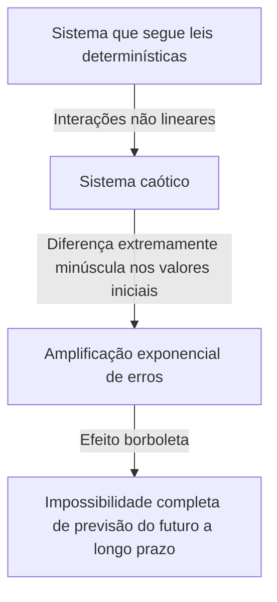

## 1. Introdução: O que é o Efeito Borboleta?

"O bater das asas de uma borboleta no Brasil pode desencadear um tornado no Texas?"

Esta pergunta fascinante e misteriosa simboliza o **Efeito Borboleta**, um dos conceitos mais famosos e mais mal compreendidos da ciência moderna. O efeito borboleta é um conceito central da **Teoria do Caos**, que é estudada em campos como a meteorologia, a física e a matemática. Refere-se ao fenômeno onde "uma diferença minúscula nas condições iniciais se amplifica exponencialmente ao longo do tempo, resultando em uma diferença decisiva no estado futuro."

No nosso dia a dia, tendemos a pensar intuitivamente que causas e efeitos são proporcionais. Em outras palavras, é uma visão de mundo linear onde pequenas mudanças trazem pequenos resultados, e grandes mudanças trazem grandes resultados. No entanto, contrariando esta intuição, muitos fenômenos na natureza comportam-se de forma altamente não linear. Uma ligeira flutuação pode produzir mudanças enormes. A teoria do caos fornece uma estrutura matemática para desvendar a ordem oculta por trás desses fenômenos complexos aparentemente desordenados e imprevisíveis.

Neste artigo, explicaremos detalhadamente a teoria do caos e o efeito borboleta, desde o seu contexto histórico até aos fundamentos matemáticos, profundas conexões com a geometria fractal e diversas aplicações na sociedade moderna. Vamos embarcar em uma jornada para explorar por que o futuro é imprevisível e que tipo de beleza está escondida dentro dessa imprevisibilidade.

---

## 2. Contexto Histórico: De Poincaré a Lorenz

As sementes da teoria do caos podem ser rastreadas até a pesquisa do grande matemático francês do século XIX, Henri Poincaré. Na época, um dos maiores desafios da física era o "problema dos três corpos". Este era o problema de prever o movimento de três corpos celestes, como o Sol, a Terra e a Lua, exercendo forças gravitacionais uns sobre os outros com base na mecânica newtoniana.

Ao estudar este problema profundamente, Poincaré descobriu que o movimento dos corpos celestes poderia se tornar extremamente complexo. Ele sugeriu matematicamente que erros imensuravelmente pequenos nas posições ou velocidades iniciais poderiam se expandir ao longo do tempo, levando a trajetórias completamente diferentes dos corpos celestes. Esta foi virtualmente a primeira descoberta do comportamento caótico, mostrando que mesmo em um sistema determinístico (um sistema onde as leis são completamente conhecidas), a previsão a longo prazo poderia às vezes se tornar impossível. No entanto, devido às limitações dos métodos matemáticos e poder computacional (a ausência de computadores) na época, esta descoberta inovadora não foi explorada profundamente por décadas.

A situação mudou drasticamente na década de 1960. Edward Lorenz, um meteorologista do Instituto de Tecnologia de Massachusetts (MIT), estava simulando a convecção atmosférica usando um dos primeiros computadores. Ele criou um conjunto de equações diferenciais não lineares simples para calcular variáveis como temperatura, pressão e velocidade do vento, e computou os valores usando um computador.

Um dia, Lorenz tentou reiniciar uma simulação a partir do meio de uma execução anterior. Ele reintroduziu os números a partir de um resultado impresso, mas digitou por engano "0.506" — um valor arredondado para três casas decimais a partir da impressão — em vez do valor de precisão interno de seis dígitos de "0.506127" mantido pelo computador.

Quando Lorenz voltou de sua pausa para o café, uma visão surpreendente o aguardava. Os resultados da simulação reiniciada inicialmente correspondiam à execução anterior durante os primeiros passos, mas logo começaram a traçar um padrão climático completamente diferente. Uma minúscula diferença inicial de apenas 0,000127 resultou em um cenário climático futuro totalmente diferente. Este foi o momento da descoberta de um fenômeno que Lorenz chamou mais tarde de **Dependência sensível às condições iniciais**, que se tornaria conhecido pelo mundo como o efeito borboleta.

---

## 3. Fundamentos Matemáticos: Sistemas Dinâmicos Não Lineares e Equações de Lorenz

Para compreender a teoria do caos matematicamente, é necessário entender os conceitos de **Sistemas Dinâmicos** e **Não-linearidade**.

Um sistema dinâmico é um modelo matemático de um sistema cujo estado muda com o tempo. O estado futuro do sistema é completamente determinado por seu estado atual e as leis determinísticas (geralmente equações diferenciais ou de diferença) que governam o sistema. O ponto chave aqui é que as próprias leis não contêm absolutamente nenhum elemento probabilístico (acaso, como lançar um dado).

Sistemas dinâmicos são amplamente classificados em sistemas lineares e não lineares. Em um sistema linear, a causa e o efeito são proporcionais, e aplica-se o princípio da superposição, onde "a soma das partes é igual ao todo". Estes são relativamente fáceis de resolver matematicamente, e as previsões são diretas. Por outro lado, em sistemas não lineares, as variáveis são multiplicadas umas pelas outras ou existem ciclos de feedback, quebrando a relação proporcional entre causa e efeito. Exibe um comportamento onde "a soma das partes difere do todo", causando fenômenos extremamente complexos. O caos ocorre apenas em sistemas não lineares.

O conjunto mais famoso de equações diferenciais não lineares que produzem caos, derivadas por Edward Lorenz de um modelo de convecção atmosférica, são as **Equações de Lorenz**. Elas consistem nas seguintes três variáveis ($x, y, z$) e três parâmetros ($\sigma, \rho, \beta$).

$$
\frac{dx}{dt} = \sigma (y - x)
$$

$$
\frac{dy}{dt} = x (\rho - z) - y
$$

$$
\frac{dz}{dt} = x y - \beta z
$$

Aqui, cada variável tem um significado físico:
- $x$ é a taxa de convecção (velocidade rotacional do fluido)
- $y$ é a variação horizontal da temperatura entre as correntes ascendentes e descendentes
- $z$ é o desvio do perfil vertical de temperatura da linearidade
- $\sigma$ (número de Prandtl), $\rho$ (número de Rayleigh) e $\beta$ (razão de aspecto do sistema) são parâmetros.

Como valores de parâmetros que mostram o comportamento caótico típico, Lorenz escolheu $\sigma = 10, \rho = 28, \beta = 8/3$. Embora este sistema de equações seja determinístico, as soluções nunca repetem estados passados e continuam a traçar trajetórias infinitamente complexas. Os termos não lineares nas equações, como $xz$ e $xy$, desempenham um papel decisivo na geração de caos.

---

## 4. Espaço de Fase e Atratores Estranhos

Uma ferramenta poderosa para compreender visualmente o comportamento dos sistemas dinâmicos é o **Espaço de fase**. O espaço de fase é um espaço multidimensional capaz de representar todos os estados possíveis de um sistema. O estado atual do sistema é representado como um "único ponto" neste espaço de fase. À medida que o tempo avança, a mudança de estado do sistema é retratada como uma "trajetória" traçada pelo ponto que se move através do espaço de fase.

Em muitos sistemas do mundo real com dissipação (a propriedade de perder energia, como atrito ou resistência do ar), depois que uma quantidade suficiente de tempo passa, o sistema eventualmente se estabelece em um estado específico (um ponto) ou em um estado periódico (um loop fechado). Este lugar de assentamento final é chamado de **Atrator**. Por exemplo, o movimento de um pêndulo acaba por repousar em seu ponto mais baixo devido à resistência do ar. O atrator, neste caso, é um "único ponto (ponto fixo)". O atrator para um sistema que repete movimentos periódicos, como um batimento cardíaco, é um "ciclo limite (curva fechada)".

No entanto, em sistemas caóticos como as equações de Lorenz, surge um tipo de atrator completamente diferente. Este é o **Atrator Estranho**.

Quando o atrator de Lorenz é traçado em um espaço de fase 3D, revela uma estrutura de tirar o fôlego, bela e complexa que se assemelha a uma borboleta de asas abertas ou dois olhos. Este atrator estranho tem as seguintes características notáveis:

1. **Limitação**: A trajetória não voa para o infinito; ela permanece sempre dentro de uma região específica do atrator.
2. **Aperiodicidade**: A trajetória nunca cruza seu próprio caminho passado ou repete exatamente a mesma rota. Eternamente, ela continua a traçar novos caminhos.
3. **Dependência sensível às condições iniciais**: Trajetórias que partem de dois pontos iniciais extremamente próximos no atrator serão afastadas uma da outra para locais completamente diferentes dentro do atrator com o passar do tempo.

Mesmo que as trajetórias estejam confinadas dentro de um volume finito, elas são obrigadas a nunca se cruzar (porque se cruzar violaria a premissa determinística de que "o mesmo estado leva ao mesmo futuro"). Para conseguir isso, o espaço deve ser "dobrado" infinitamente. Esse processo repetido de "esticar" e "dobrar" (como amassar massa) é a própria essência do caos e dá origem à complexa estrutura de atratores estranhos.

---

## 5. Mapa Logístico e Diagrama de Bifurcação

Outro importante modelo matemático para compreender a teoria do caos da forma mais simples é o **Mapa logístico**. Esta é uma equação de diferença quadrática simples modelando a flutuação de uma população biológica (por exemplo, a mudança anual no número de coelhos numa ilha).

$$
x_{n+1} = r x_n (1 - x_n)
$$

Aqui,
- $x_n$ representa a população na $n$-ésima geração (assumindo um valor no intervalo $0 \le x_n \le 1$ como proporção da capacidade de carga máxima do ambiente).
- $x_{n+1}$ é a população da próxima geração.
- $r$ é um parâmetro que representa a taxa de reprodução (geralmente $0 \le r \le 4$).

Embora esta equação seja extremamente simples, alterar o valor do parâmetro $r$ faz com que exiba comportamentos surpreendentemente diversos e complexos:

- $0 < r < 1$: A população finalmente se extingue, e $x$ converge para 0.
- $1 < r < 3$: A população converge para um certo valor constante (ponto fixo) e estabiliza.
- Por volta de $r = 3$: O ponto fixo torna-se instável e a população começa a alternar entre dois valores diferentes. Isso é chamado de **Bifurcação de duplicação de período**.
- À medida que $r$ aumenta ainda mais, ocorrem rapidamente bifurcações em que o período duplica para 4, 8, 16, etc.
- Além de $r \approx 3.56995$ (o ponto de Feigenbaum), a periodicidade é totalmente destruída e a população assume valores completamente imprevisíveis. Este é o estado do **Caos**.

O traçado do estado final do sistema (atrator) contra estas mudanças em $r$ cria o que se chama de **Diagrama de bifurcação**. O eixo horizontal representa o parâmetro $r$, e o eixo vertical representa os valores finais de $x$.

Ao olhar para o diagrama de bifurcação, podemos ver que dentro da região caótica, há "Janelas" onde a ordem de repente se recupera (por exemplo, uma região de período 3). Surpreendentemente, se ampliarmos uma parte deste diagrama de bifurcação, exibe uma auto-similaridade, onde exatamente o mesmo padrão de estrutura global aparece infinitamente. O fato de uma simples equação quadrática conter uma estrutura tão rica causou um grande choque na comunidade matemática.

---

## 6. Expoente de Lyapunov: Quantificando o Caos

O indicador utilizado para quantificar de forma estritamente matemática a "dependência sensível às condições iniciais" inerente aos sistemas caóticos é o **Expoente de Lyapunov**.

Considere dois estados iniciais extremamente próximos no espaço de fase (com uma distância denotada como $\delta Z_0$) e observe como suas trajetórias se separam a uma distância $\delta Z(t)$ com o passar do tempo $t$. No caso de um sistema caótico, esta distância expande-se exponencialmente, em média.

$$
|\delta Z(t)| \approx e^{\lambda t} |\delta Z_0|
$$

Aqui, $\lambda$ (lambda) é o expoente de Lyapunov.
O expoente de Lyapunov representa a taxa média com que as trajetórias adjacentes se separam (ou se aproximam).

- $\lambda < 0$: As trajetórias aproximam-se umas das outras e convergem para um ponto fixo ou ciclo limite (não é caos).
- $\lambda = 0$: A distância entre as trajetórias permanece constante (por exemplo, sistemas conservativos).
- $\lambda > 0$: As trajetórias são separadas exponencialmente. Este é o indicador decisivo do **Caos**.

Num sistema dinâmico multidimensional, existem tantos expoentes de Lyapunov quanto as dimensões do espaço (o espectro de Lyapunov). Se existir pelo menos um expoente de Lyapunov positivo, o sistema é definido como caótico. Quanto maior o expoente de Lyapunov positivo, mais rapidamente os erros minúsculos iniciais se amplificam, encurtando a escala de tempo em que o futuro é previsível (tempo de Lyapunov). Esta é a razão matemática fundamental pela qual as previsões meteorológicas podem ser razoavelmente precisas com alguns dias de antecedência, mas tornam-se completamente imprevisíveis com semanas de antecedência.

---

## 7. A Relação Entre Fractais e Caos

Ao debater a teoria do caos, não se pode omitir a geometria **Fractal**, proposta pelo matemático Benoit Mandelbrot. Um fractal é uma figura na qual "não importa o quanto você o amplie, uma estrutura complexa semelhante (auto-similaridade) idêntica ao todo aparece infinitamente." Exemplos representativos incluem o conjunto de Mandelbrot e o floco de neve de Koch.

O caos e os fractais podem parecer conceitos diferentes à primeira vista, mas na verdade são os dois lados da mesma moeda. Se pegar em uma secção transversal de um atrator estranho e o observar atentamente, encontrará uma estrutura infinitamente em camadas, revelando que possui uma estrutura fractal.

A dinâmica de "esticar e dobrar" no espaço de fase de um sistema caótico produz figuras fractais como um resultado geométrico. Uma das características importantes de um fractal é que ele tem uma "dimensão fracionária (dimensão fractal)" que não é um número inteiro. Por exemplo, uma figura que é mais complexa e que preenche o espaço que uma linha 1D, mas fica aquém de um plano 2D, pode ter uma dimensão de 1,26. Um atrator estranho é também uma estrutura fractal com uma dimensão fracionária.

Se o caos é uma "dinâmica complexa que surge ao longo do tempo", então pode-se dizer que os fractais são "as pegadas geométricas deixadas por essa dinâmica no espaço". Muitos fenômenos naturais, como as formas das costas de rias, a ramificação de árvores, as redes de vasos sanguíneos e as formas de nuvens, possuem estruturas fractais, e acredita-se que a dinâmica não linear caótica esteja em ação por trás de seus processos de formação.

---

## 8. Aplicações no Mundo Real: Da Meteorologia à Economia

A teoria do caos não é um mero jogo matemático. As propriedades universais de dependência sensível às condições iniciais e dinâmica não linear trouxeram amplas aplicações para todos os campos do mundo real, transcendendo a física.

### 8.1 Meteorologia e Mudança Climática
A meteorologia, cenário da descoberta de Lorenz, é um dos campos que mais tem beneficiado com a teoria do caos. A atmosfera é governada por complexas equações não lineares de dinâmica de fluidos e termodinâmica, tornando-a inerentemente caótica. Hoje, a abordagem principal é a "previsão por conjunto", que envolve a introdução intencional de ligeiras flutuações nos valores iniciais e a execução simultânea de múltiplas simulações, em vez de depender de uma única previsão. Isto permite que os meteorologistas avaliem probabilisticamente a incerteza das previsões e compreendam a que distância no futuro são possíveis previsões confiáveis.

### 8.2 Medicina e Biologia
Os ritmos biológicos humanos também estão profundamente interligados com o caos. Por exemplo, sabe-se que os intervalos dos batimentos cardíacos (flutuações) de um coração saudável não são nem completamente regulares nem completamente aleatórios, mas possuem propriedades fractais caóticas. Por outro lado, os batimentos cardíacos de pacientes com doenças cardíacas ou dos idosos podem tornar-se demasiado regulares ou completamente aleatórios. A perda de flutuação caótica tem sido estudada como um sinal importante (biomarcador) que indica a deterioração da saúde. A dinâmica não linear também é essencial na análise de ondas cerebrais e na modelização da propagação de doenças infecciosas (como o modelo SIR em epidemiologia).

### 8.3 Economia e Mercados Financeiros
Os mercados financeiros, como os mercados de ações e de câmbio, são sistemas não lineares altamente complexos onde a psicologia e as ações de inúmeros investidores interagem. A economia tradicional presumiu que os mercados eram eficientes e que os preços seguiam um passeio aleatório (movimentos aleatórios conformes a uma distribuição normal). Contudo, nos mercados reais, eventos extremos, como quebras e bolhas, ocorrem com muito maior frequência do que uma distribuição normal prevê (o fenômeno de cauda pesada). Ao aplicar a teoria do caos e fractais (como o modelo multifractal de Mandelbrot), estão a ser feitas tentativas para modelar de forma mais precisa as estruturas não lineares, a memória a longo prazo e os riscos de rebentamento de bolhas escondidos nas flutuações de preços de mercado, aplicando esse conhecimento na gestão de riscos.

### 8.4 Engenharia e Controle
O conceito de caos também é importante na área de engenharia. Os fenômenos caóticos são observados em muitos sistemas, como vibrações de asas em aviões (flutter), sincronização de osciladores não lineares em circuitos elétricos e distúrbios na emissão de laser. Tradicionalmente, o caos era considerado algo a ser "evitado" ou "eliminado como ruído" porque é imprevisível e desestabiliza os sistemas. Atualmente, no entanto, desenvolveu-se uma tecnologia chamada "Controle do Caos", que utiliza a minúscula energia inerente a um sistema para guiar habilmente de um estado caótico a um estado periódico desejado, estabilizando-o. Também estão a ser pesquisadas aplicações para comunicação criptográfica usando a aleatoriedade de sinais caóticos (criptografia do caos).

---

## 9. Implicações Filosóficas: Determinismo e Previsibilidade

O surgimento da teoria do caos trouxe uma mudança de paradigma fundamental para a filosofia da ciência, particularmente no que diz respeito à nossa visão de mundo sobre "Determinismo" e "Previsibilidade".

O matemático francês do século XVIII Pierre-Simon Laplace propôs a seguinte experiência de pensamento: "Se houvesse um intelecto que pudesse compreender completamente as posições e os momentos atuais de todos os átomos do universo e fosse vasto o suficiente para analisá-los, para tal intelecto, o futuro, assim como o passado, estaria presente diante de seus olhos." Este hipotético intelecto é chamado de **Demônio de Laplace**, e simbolizava uma forte visão de mundo determinística do universo, baseada na mecânica clássica.

Determinismo é a ideia de que "se o estado atual está completamente determinado, o futuro é singularmente determinado de acordo com as leis da física". As equações tratadas pela teoria do caos (tais como as equações de Lorenz) são equações puramente determinísticas que não contêm elementos probabilísticos. Portanto, em princípio, o demônio de Laplace também deve ser capaz de prever perfeitamente o futuro dos sistemas caóticos.

No entanto, a teoria do caos confrontou-nos friamente com os **Limites da previsibilidade** no mundo real. Na realidade, é impossível medir todos os estados iniciais do universo com "precisão infinita (zero erro)". Mesmo sem considerar o princípio de incerteza da mecânica quântica, nossas capacidades de observação inerentemente têm limites finitos.

Num sistema caótico, não importa quão pequeno seja este erro de observação, ele amplifica-se exponencialmente ao longo do tempo, engolindo por fim todo o sistema. Em outras palavras, ficou claro que "ser determinístico" e "ser previsível" são dois conceitos totalmente diferentes. A teoria do caos acabou com o demônio de Laplace e ensinou à humanidade a profunda verdade de que "mesmo que as leis sejam perfeitamente conhecidas, o futuro pode ser fundamentalmente imprevisível".

Esta mudança de paradigma apresenta uma nova visão do mundo: "O nosso mundo é complexo e imprevisível, mas por trás dele existe uma bela estrutura matemática determinística". Em vez de desistir da previsão perfeita, abriu-se um caminho para compreender a "ordem a nível macro" oculta no caos, ao estudar as formas dos atratores e compreender as distribuições probabilísticas.

---

## 10. Conclusão

Neste artigo, exploramos profundamente o efeito borboleta — onde diferenças minúsculas nas condições iniciais produzem resultados massivos — e a teoria do caos que o engloba.

A partir da intuição de Poincaré, passando pela descoberta acidental de Lorenz pelo computador, a teoria do caos transformou-se num vasto campo que atravessa a matemática e a física. Os seus fundamentos matemáticos são altamente refinados e cheios de maravilha intelectual, como pode ser visto nas belas trajetórias de atratores estranhos desenhados por equações não lineares, na infinita auto-similaridade observada no mapa logístico e na quantificação da imprevisibilidade pelos expoentes de Lyapunov.

A teoria do caos não apenas nos ensina os limites da previsão do tempo, mas também fornece uma lente poderosa para a compreensão dos fenômenos complexos que nos rodeiam, desde as flutuações econômicas e os batimentos cardíacos até à evolução da vida. Ela revela que o mundo natural não é uma simples máquina mecânica, mas um sistema dinâmico cheio de imprevisibilidade e criatividade.

Determinístico, contudo imprevisível. Esta natureza aparentemente contraditória é precisamente o maior encanto da teoria do caos. O fato de o futuro ser totalmente determinado e ainda assim ninguém (e por mais potente que seja o computador) poder saber de forma detalhada o seu futuro, torna a nossa percepção do universo mais humilde e rica. O mundo não linear tecido pelo caos e fractais certamente continuará a fascinar os cientistas e a trazer novas descobertas no futuro.

