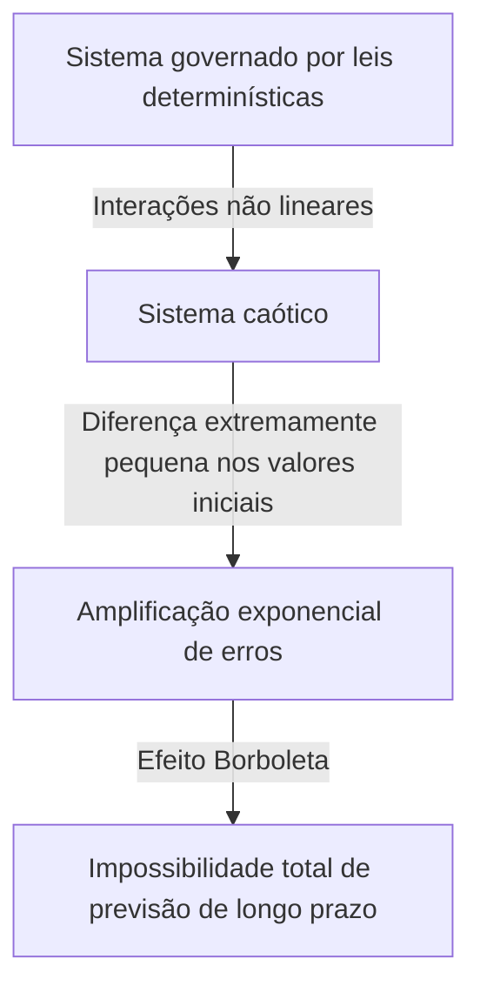

## 1. Introdução: O que é o efeito borboleta?

“O bater das asas de uma borboleta no Brasil desencadeia um tornado no Texas?”

Esta pergunta cativante e misteriosa simboliza um dos conceitos mais famosos — e mais incompreendidos — da ciência moderna: o **Efeito Borboleta**. O Efeito Borboleta é um conceito central da **Teoria do Caos**, um campo estudado em meteorologia, física, matemática e muito mais. Refere-se ao fenómeno em que “pequenas diferenças nas condições iniciais amplificam-se exponencialmente ao longo do tempo, produzindo em última análise diferenças decisivas em estados futuros”.

Na nossa vida quotidiana, tendemos a assumir intuitivamente uma relação proporcional entre causa e efeito – uma visão de mundo linear em que pequenas mudanças produzem pequenos resultados e grandes mudanças produzem grandes resultados. Contudo, muitos fenómenos no mundo natural comportam-se de uma forma altamente não linear, desafiando esta intuição. Uma pequena flutuação pode gerar mudanças enormes. A teoria do caos fornece a estrutura matemática para desvendar a ordem oculta que se esconde por trás de fenômenos complexos aparentemente desordenados e imprevisíveis.

Neste artigo, exploraremos minuciosamente a teoria do caos e o Efeito Borboleta - desde o seu contexto histórico e fundamentos matemáticos, passando pelas suas profundas conexões com a geometria fractal, até às suas amplas aplicações na sociedade moderna. Vamos embarcar numa viagem para descobrir porque é que o futuro é imprevisível e que beleza se esconde nessa imprevisibilidade.

---

## 2. Antecedentes Históricos: De Poincaré a Lorenz

As sementes da teoria do caos remontam à pesquisa do grande matemático francês Henri Poincaré no final do século XIX. Na época, um dos maiores desafios da física era o “Problema dos Três Corpos” – prever o movimento de três corpos celestes, como o Sol, a Terra e a Lua, que exercem atração gravitacional mútua, com base na mecânica newtoniana.

Ao estudar este problema em profundidade, Poincaré descobriu que o movimento dos corpos celestes poderia tornar-se extraordinariamente complexo. Ele sugeriu matematicamente a possibilidade de que erros incomensuravelmente pequenos nas posições ou velocidades iniciais poderiam se amplificar ao longo do tempo e, em última análise, tornar as órbitas finais completamente diferentes. Esta foi, com efeito, a primeira descoberta do comportamento caótico – a conclusão de que mesmo sistemas determinísticos (sistemas cujas leis são completamente conhecidas) podem tornar-se impossíveis de prever a longo prazo. No entanto, devido às limitações dos métodos matemáticos e do poder computacional (ausência de computadores) da época, esta descoberta inovadora permaneceu em grande parte inexplorada durante várias décadas.

A situação mudou dramaticamente na década de 1960. Edward Lorenz, meteorologista do Instituto de Tecnologia de Massachusetts (MIT), estava simulando a convecção atmosférica usando um computador antigo. Ele criou um conjunto de equações diferenciais não lineares simples para calcular variáveis ​​como temperatura, pressão e velocidade do vento, executando os cálculos na máquina.

Um dia, Lorenz tentou reiniciar uma simulação a partir de um ponto intermediário. Ele digitou novamente os valores de uma impressão, mas em vez de usar o valor de precisão de 6 dígitos “0,506127” armazenado internamente pelo computador, ele digitou “0,506” – o valor arredondado de 3 dígitos impresso na saída.

Quando Lorenz voltou do intervalo para o café, uma visão surpreendente o aguardava. A simulação reiniciada correspondeu aos resultados anteriores nas primeiras etapas, mas logo começou a traçar padrões climáticos totalmente diferentes. Uma minúscula diferença no valor inicial de apenas 0,000127 produziu um futuro climático completamente diferente. Este foi o momento da descoberta do fenômeno que Lorenz mais tarde chamaria de **Sensibilidade às Condições Iniciais**, que viria a ser conhecido mundialmente como Efeito Borboleta.

---

## 3. Fundamentos Matemáticos: Sistemas Dinâmicos Não Lineares e as Equações de Lorenz

Para entender matematicamente a teoria do caos, é preciso compreender os conceitos de **Sistemas Dinâmicos** e **Não Linearidade**.

Um sistema dinâmico é um modelo matemático de um sistema cujo estado muda ao longo do tempo. O estado futuro do sistema é completamente determinado pelo seu estado atual e pelas leis determinísticas que o governam (geralmente equações diferenciais ou equações de diferença). Crucialmente, as próprias leis não contêm elementos probabilísticos – nenhuma aleatoriedade como o lançamento de dados.

Os sistemas dinâmicos são amplamente divididos em sistemas lineares e não lineares. Em sistemas lineares, causa e efeito são proporcionais e o princípio da superposição é válido: “a soma das partes é igual ao todo”. Estes são relativamente fáceis de resolver matematicamente e de prever. Em sistemas não lineares, entretanto, as variáveis ​​se multiplicam ou existem ciclos de feedback, quebrando a relação proporcional entre causa e efeito. Apresentam comportamento onde “a soma das partes difere do todo”, dando origem a fenômenos extremamente complexos. O caos ocorre apenas em sistemas não lineares.

O conjunto mais famoso de equações diferenciais acopladas não lineares que produzem o caos, derivado por Edward Lorenz a partir de um modelo de convecção atmosférica, são as **Equações de Lorenz**. Eles consistem em três variáveis ​​( $x, y, z$ ) e três parâmetros ( $\sigma, \rho, \beta$ ):

$$
\frac{dx}{dt} = \sigma (y - x)
$$

$$
\frac{dy}{dt} = x (\rho - z) - y
$$

$$
\frac{dz}{dt} = x y - \beta z
$$

Aqui, cada variável tem um significado físico:
- $x$ representa a intensidade da convecção (velocidade de rotação do fluido)
- $y$ representa a diferença de temperatura entre fluxos ascendentes e descendentes
- $z$ representa o desvio do perfil vertical de temperatura da linearidade
- $\sigma$ (número Prandtl), $\rho$ (número Rayleigh) e $\beta$ (proporção do sistema) são parâmetros.

Para valores de parâmetros que exibem comportamento caótico típico, Lorenz escolheu $\sigma = 10, \rho = 28, \beta = 8/3$. Embora este sistema de equações seja determinístico, a solução nunca repete um estado passado, traçando uma trajetória infinitamente complexa. Os termos não lineares $xz$ e $xy$ nas equações desempenham o papel decisivo na geração do caos.

---

## 4. Espaço de Fase e Atratores Estranhos

Uma ferramenta poderosa para compreender visualmente o comportamento de sistemas dinâmicos é o **Phase Space**. O espaço de fase é um espaço multidimensional capaz de representar todos os estados concebíveis de um sistema. O estado atual do sistema é representado como “um único ponto” neste espaço de fase. À medida que o tempo avança e o estado do sistema muda, o movimento do ponto através do espaço de fase traça uma “trajetória”.

Em muitos sistemas do mundo real com dissipação (propriedades que causam perda de energia, como atrito ou resistência do ar), após um tempo suficiente, o sistema eventualmente se estabelece em um estado específico (um ponto) ou em um estado periódico (um circuito fechado). Este destino final é chamado de **Atrator** (algo que atrai as coisas). Por exemplo, o movimento de um pêndulo eventualmente pára no seu ponto mais baixo devido à resistência do ar; neste caso, o atrator é um “ponto único (ponto fixo)”. Para sistemas que repetem movimentos periódicos, como um batimento cardíaco, o atrator é um “ciclo limite (curva fechada)”.

Em sistemas caóticos como as equações de Lorenz, entretanto, aparece um tipo de atrator totalmente diferente – o **Atrator Estranho**.

Quando o atrator de Lorenz é plotado no espaço de fase tridimensional, emerge uma estrutura incrivelmente bela e complexa, semelhante a uma borboleta abrindo suas asas ou um par de olhos. Este estranho atrator tem as seguintes propriedades notáveis:

1. **Limites**: A trajetória nunca voa para o infinito; permanece sempre dentro de uma região específica do atrator.
2. **Aperiodicidade**: a trajetória nunca cruza seu próprio caminho passado ou repete exatamente a mesma rota. Ele traça um novo caminho para sempre.
3. **Sensibilidade às condições iniciais**: Duas trajetórias começando em pontos iniciais extremamente próximos no atrator são separadas para locais totalmente diferentes dentro do atrator ao longo do tempo.

Apesar de estar confinada num volume finito, a trajetória nunca se cruza (o cruzamento violaria a premissa determinista de que “o mesmo estado leva ao mesmo futuro”). Para satisfazer esta restrição, o espaço deve ser “dobrado” infinitamente. Este processo repetido de “esticar e dobrar” (muito parecido com amassar massa de pão) é a essência do caos e gera a estrutura complexa de atratores estranhos.

---

## 5. O Mapa Logístico e Diagramas de Bifurcação

Outro modelo matemático importante para a compreensão da teoria do caos em sua forma mais simples é o **Mapa Logístico**. É uma equação de diferença quadrática simples que modela a dinâmica populacional (por exemplo, a variação anual no número de coelhos numa ilha).

$$
x_{n+1} = r x_n (1 - x_n)
$$

Aqui:
- $x_n$ representa a população na geração $n$ (como proporção da capacidade máxima de suporte do ambiente, variando de $0 \le x_n \le 1$).
- $x_{n+1}$ é a população da próxima geração.
- $r$ é um parâmetro que representa a taxa de reprodução (normalmente $0 \le r \le 4$).

Esta equação é muito simples, mas ao variar o parâmetro $r$, ela exibe um comportamento surpreendentemente diverso e complexo.

- $0 < r < 1$: A população acaba sendo extinta e $x$ converge para 0.
- $1 < r < 3$: A população converge para um valor fixo (ponto fixo) e se estabiliza.
- Perto de $r = 3$: O ponto fixo torna-se instável e a população começa a alternar entre dois valores distintos. Isso é chamado de **Bifurcação de Duplicação de Período**.
- À medida que $r$ aumenta ainda mais, ocorrem bifurcações rapidamente com o período dobrando para 4, 8, 16 e assim por diante.
- Além de $r \approx 3.56995$ (o ponto Feigenbaum), a periodicidade se rompe totalmente e a população assume valores completamente imprevisíveis. Este é o estado de **caos**.

Um gráfico que representa o estado final do sistema (atrator) em relação às mudanças em $r$ é chamado de **Diagrama de Bifurcação**. O eixo horizontal representa o parâmetro $r$ e o eixo vertical representa os valores finais de $x$.

O exame do diagrama de bifurcação revela “janelas” – regiões dentro do domínio caótico onde a ordem se recupera repentinamente (por exemplo, uma região do período 3). Notavelmente, ampliar partes do diagrama de bifurcação revela o mesmo padrão geral aparecendo infinitamente – auto-semelhança. O fato de uma equação quadrática simples conter uma estrutura tão rica enviou ondas de choque pela comunidade matemática.

---

## 6. Expoentes de Lyapunov: Quantificando o Caos

A métrica para quantificar rigorosa e matematicamente a "sensibilidade às condições iniciais" de um sistema caótico é o **Expoente de Lyapunov**.

Considere duas trajetórias partindo de estados iniciais extremamente próximos no espaço de fase (separados por uma distância $\delta Z_0$) que divergem para uma distância $\delta Z(t)$ ao longo do tempo $t$. Num sistema caótico, esta distância cresce exponencialmente, em média.

$$
|\delta Z(t)| \approx e^{\lambda t} |\delta Z_0|
$$

Aqui, $\lambda$ (lambda) é o expoente de Lyapunov.
O expoente de Lyapunov representa a taxa média na qual as trajetórias vizinhas divergem (ou convergem).

- $\lambda < 0$: As trajetórias convergem entre si, estabelecendo-se em um ponto fixo ou ciclo limite (não caótico).
- $\lambda = 0$: A distância entre as trajetórias é mantida constante (por exemplo, sistemas conservadores).
- $\lambda > 0$: As trajetórias divergem exponencialmente. Este é o **indicador definitivo do caos**.

Em sistemas dinâmicos multidimensionais, existem tantos expoentes de Lyapunov (o espectro de Lyapunov) quantas dimensões. Se existir pelo menos um expoente positivo de Lyapunov, o sistema é definido como caótico. Quanto maior o expoente positivo de Lyapunov, mais rapidamente os pequenos erros iniciais se amplificam, encurtando a escala de tempo previsível (tempo de Lyapunov). Esta é a razão matemática fundamental pela qual as previsões meteorológicas são razoavelmente precisas alguns dias antes, mas se tornam completamente imprevisíveis nas semanas seguintes.

---

## 7. A relação entre fractais e caos

Indispensável para qualquer discussão da teoria do caos é a geometria **Fractal** proposta pelo matemático Benoit Mandelbrot. Um fractal é "uma forma na qual, não importa o quão longe você aumente o zoom, a mesma estrutura complexa (auto-similaridade) aparece infinitamente". Exemplos representativos incluem o conjunto de Mandelbrot e a curva de Koch.

Caos e fractais podem parecer conceitos diferentes à primeira vista, mas na verdade são duas faces da mesma moeda. Quando você corta a seção transversal de um atrator estranho e o examina detalhadamente, surge uma estrutura em camadas infinitas, revelando a geometria fractal.

A dinâmica de "alongamento e dobramento" no espaço de fases de um sistema caótico produz formas fractais como consequência geométrica. Uma propriedade importante dos fractais é que eles possuem uma "dimensão fracionária (dimensão fractal)" não inteira. Por exemplo, uma forma mais complexa do que uma linha unidimensional que preenche o espaço, mas fica aquém de um plano bidimensional, pode ter uma dimensão de 1,26. Atratores estranhos também são estruturas fractais com dimensões fracionárias.

Se o caos é “dinâmica complexa emergindo ao longo do tempo”, então os fractais são “as pegadas geométricas que essas dinâmicas gravam no espaço”. Muitos fenómenos naturais - linhas costeiras de rias, ramificações de árvores, redes de vasos sanguíneos, formas de nuvens - exibem estruturas fractais, e acredita-se que a dinâmica não linear caótica está subjacente à sua formação.

---

## 8. Aplicações no mundo real: do clima à economia

A teoria do caos é muito mais do que uma curiosidade matemática. As propriedades universais de sensibilidade às condições iniciais e dinâmica não linear trouxeram amplas aplicações em todos os campos, muito além da física.

### 8.1 Meteorologia e Mudanças Climáticas
A meteorologia, palco da descoberta de Lorenz, é um dos campos que mais se beneficiou da teoria do caos. A atmosfera é governada por equações não lineares complexas da dinâmica dos fluidos e da termodinâmica e é inerentemente caótica. Hoje, em vez de uma única previsão, a abordagem dominante é a “previsão por conjunto” – executando múltiplas simulações simultaneamente com perturbações intencionalmente pequenas nos valores iniciais. Isto permite uma avaliação probabilística da incerteza das previsões e uma compreensão de até que ponto no futuro são possíveis previsões fiáveis.

### 8.2 Medicina e Biologia
Os ritmos biológicos humanos também estão profundamente ligados ao caos. Por exemplo, a variabilidade da frequência cardíaca de um coração saudável não é nem perfeitamente regular nem perfeitamente aleatória; exibe características fractais caóticas. Em pacientes com doenças cardíacas e idosos, os batimentos cardíacos podem tornar-se muito regulares ou completamente aleatórios. A perda da variabilidade caótica está sendo estudada como um importante sinal (biomarcador) de deterioração da saúde. A dinâmica não linear também é essencial para analisar ondas cerebrais e modelar a propagação de doenças infecciosas (como o modelo SIR em epidemiologia).

### 8.3 Economia e Mercados Financeiros
Os mercados financeiros, como os mercados de ações e de câmbio, são sistemas não lineares extremamente complexos nos quais interagem a psicologia e as ações de inúmeros investidores. A economia tradicional pressupunha que os mercados são eficientes e que os preços seguem um passeio aleatório (movimentos aleatórios com uma distribuição normal), mas, na realidade, eventos extremos como quebras e bolhas ocorrem com muito mais frequência do que o previsto por uma distribuição normal (o fenómeno da cauda gorda). Ao aplicar a teoria do caos e os fractais (tais como os modelos multifractais propostos por Mandelbrot), os investigadores estão a tentar modelar com mais precisão as estruturas não lineares escondidas nas flutuações de preços, nos efeitos de memória de longo prazo e no risco de colapsos de bolhas para melhorar a gestão do risco.

### 8.4 Engenharia e Controle
O caos também é um conceito importante na engenharia. Fenômenos caóticos são observados em muitos sistemas: vibrações de asas de aeronaves (flutter), sincronização de osciladores não lineares em circuitos elétricos, distúrbios na saída do laser e muito mais. Tradicionalmente, o caos era visto como algo a ser evitado – ruído imprevisível que desestabilizava os sistemas. Hoje, no entanto, foram desenvolvidas técnicas conhecidas como "Controle do Caos", que guiam habilmente um sistema de um estado caótico para um estado periódico desejável usando apenas uma pequena quantidade de energia, estabilizando-o assim. Também estão em andamento pesquisas para aplicar a natureza pseudo-aleatória dos sinais caóticos às comunicações criptografadas (criptografia baseada no caos).

---

## 9. Implicações Filosóficas: Determinismo e Previsibilidade

O advento da teoria do caos trouxe uma mudança de paradigma fundamental para a filosofia da ciência – particularmente no que diz respeito à nossa visão de mundo sobre “Determinismo” e “Previsibilidade”.

O matemático francês do século XVIII, Pierre-Simon Laplace, propôs a seguinte experiência mental: "Se uma inteligência pudesse conhecer a posição e o momento exactos de cada átomo no universo e tivesse a capacidade de os analisar, então, para essa inteligência, nem o futuro nem o passado seriam incertos - toda a linha do tempo permaneceria aberta como o presente." Essa inteligência hipotética é conhecida como **Demônio de Laplace** e simbolizava a robusta visão de mundo determinística baseada na mecânica clássica.

O determinismo sustenta que “se o estado atual for completamente determinado, o futuro será determinado exclusivamente pelas leis da física”. As equações tratadas pela teoria do caos (como as equações de Lorenz) são equações puramente determinísticas que não contêm nenhum elemento probabilístico. Em princípio, portanto, o Demônio de Laplace deveria ser capaz de prever perfeitamente o futuro de um sistema caótico.

No entanto, a teoria do caos expõe impiedosamente os **limites da previsibilidade** no mundo real. Na realidade, é impossível medir cada estado inicial do universo com “precisão infinita (erro zero)”. Mesmo deixando de lado o princípio da incerteza da mecânica quântica, as nossas capacidades observacionais têm sempre limites finitos.

Em sistemas caóticos, não importa quão pequeno seja o erro de observação, ele se amplifica exponencialmente ao longo do tempo, eventualmente engolindo todo o sistema. Em outras palavras, ficou claro que “ser determinista” e “ser previsível” são conceitos totalmente diferentes. A teoria do caos colocou o Demônio de Laplace para descansar e ensinou à humanidade a profunda verdade de que “mesmo quando as leis são completamente conhecidas, o futuro pode ser inerentemente imprevisível”.

Esta mudança de paradigma apresenta uma nova visão de mundo: “Nosso mundo é complexo e imprevisível, mas por trás dele está uma bela estrutura matemática determinística”. Ao desistir da previsão perfeita e, em vez disso, examinar as formas dos atratores ou compreender as distribuições probabilísticas, abriu-se um caminho para compreender a “ordem em grande escala” escondida no caos.

---

## 10. Conclusão

Neste artigo, nos aprofundamos no Efeito Borboleta — pelo qual pequenas diferenças nas condições iniciais levam a resultados muito diferentes — e na teoria do caos que o engloba.

Da intuição de Poincaré à descoberta acidental de Lorenz baseada em computador, a teoria do caos tornou-se um vasto campo que abrange a matemática e a física. As belas trajetórias de atratores estranhos traçadas por equações não lineares, a infinita autossimilaridade encontrada no mapa logístico e a quantificação da imprevisibilidade através dos expoentes de Lyapunov — seus fundamentos matemáticos são extraordinariamente refinados e repletos de admiração intelectual.

A teoria do caos forneceu uma lente poderosa para a compreensão dos fenómenos complexos que nos rodeiam – desde os limites da previsão do tempo até às flutuações económicas, aos batimentos cardíacos e até à evolução da vida. Ensina-nos que o mundo natural não é de forma alguma uma simples máquina mecânica, mas sim um sistema dinâmico cheio de imprevisibilidade e criatividade.

Determinista, mas imprevisível – esta propriedade aparentemente paradoxal é o maior fascínio da teoria do caos. O facto de o futuro ser completamente determinado, mas incognoscível para qualquer pessoa (mesmo para os computadores mais poderosos), torna a nossa compreensão do universo mais humilde e mais rica. O mundo não linear tecido pelo caos e pelos fractais continuará a cativar os cientistas e a inspirar novas descobertas nos próximos anos.

