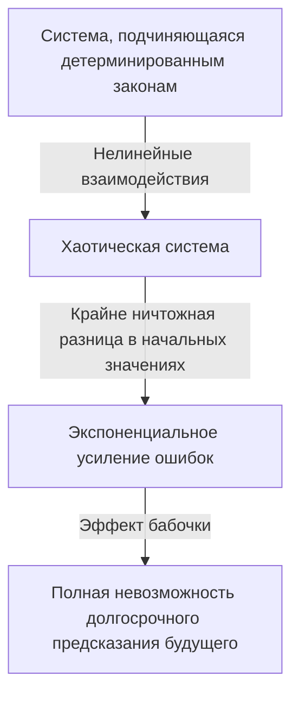

## 1. Введение: Что такое эффект бабочки?

«Может ли взмах крыльев бабочки в Бразилии вызвать торнадо в Техасе?»

Этот захватывающий и загадочный вопрос символизирует **Эффект бабочки**, одну из самых известных и самых неправильно понимаемых концепций в современной науке. Эффект бабочки — это ключевая концепция **Теории хаоса**, которая изучается в таких областях, как метеорология, физика и математика. Это относится к явлению, когда «мельчайшая разница в начальных условиях экспоненциально увеличивается со временем, что приводит к решающей разнице в будущем состоянии».

В нашей повседневной жизни мы интуитивно склонны думать, что причины и следствия пропорциональны. Другими словами, это линейное мировоззрение, в котором небольшие изменения приносят небольшие результаты, а большие изменения приносят большие результаты. Однако вопреки этой интуиции многие явления в природе ведут себя в высшей степени нелинейно. Небольшое колебание может привести к огромным изменениям. Теория хаоса обеспечивает математическую основу для разгадки скрытого порядка, лежащего в основе этих, казалось бы, беспорядочных и непредсказуемых сложных явлений.

В этой статье мы подробно объясним теорию хаоса и эффект бабочки, начиная с их исторического фона и математических основ до их глубокой связи с фрактальной геометрией и разнообразных применений в современном обществе. Давайте отправимся в путешествие, чтобы исследовать, почему будущее непредсказуемо и какая красота скрыта в этой непредсказуемости.

---

## 2. Исторический фон: от Пуанкаре до Лоренца

Зарождение теории хаоса можно проследить до исследований великого французского математика 19 века [Анри Пуанкаре](https://kenji.blog/p/poincare/). В то время одной из величайших проблем физики была «задача трех тел». Это была проблема предсказания движения трех небесных тел, таких как Солнце, Земля и Луна, оказывающих гравитационное воздействие друг на друга на основе ньютоновской механики.

Глубоко изучая эту проблему, Пуанкаре обнаружил, что движение небесных тел может стать чрезвычайно сложным. Он математически предположил, что неизмеримо малые ошибки в начальных положениях или скоростях могут со временем увеличиваться, что в конечном итоге приведет к совершенно другим траекториям небесных тел. Это было, по сути, первое открытие хаотического поведения, показавшее, что даже в детерминированной системе (системе, где законы полностью известны) долгосрочное прогнозирование иногда может стать невозможным. Однако из-за ограниченности математических методов и вычислительной мощности (отсутствие компьютеров) того времени это новаторское открытие не изучалось глубоко на протяжении десятилетий.

Ситуация кардинально изменилась в 1960-х годах. Эдвард Лоренц, метеоролог из Массачусетского технологического института (MIT), моделировал атмосферную конвекцию с помощью одного из первых компьютеров. Он создал набор простых нелинейных дифференциальных уравнений для расчета таких переменных, как температура, давление и скорость ветра, и вычислял значения с помощью компьютера.

Однажды Лоренц попытался возобновить симуляцию с середины предыдущего запуска. Он повторно ввел числа из распечатанного результата, но по ошибке ввел «0.506» — значение, округленное до трех десятичных знаков из распечатки, — вместо внутреннего значения с шестизначной точностью «0.506127», хранимого компьютером.

Когда Лоренц вернулся с перерыва на кофе, его ждало удивительное зрелище. Результаты возобновленного моделирования первоначально совпали с предыдущим запуском на первых нескольких шагах, но вскоре начали описывать совершенно другую погодную модель. Микроскопическая начальная разница всего в 0,000127 привела к совершенно иному сценарию будущей погоды. Это был момент открытия явления, которое Лоренц позже назвал **Чувствительной зависимостью от начальных условий** и которое стало известно миру как эффект бабочки.

---

## 3. Математические основы: нелинейные динамические системы и уравнения Лоренца

Чтобы математически понять теорию хаоса, необходимо усвоить концепции **Динамических систем** и **Нелинейности**.

Динамическая система — это математическая модель системы, состояние которой изменяется во времени. Будущее состояние системы полностью определяется ее текущим состоянием и детерминированными законами (обычно дифференциальными или разностными уравнениями), управляющими системой. Ключевым моментом здесь является то, что сами законы не содержат абсолютно никаких вероятностных элементов (случайности, как бросание костей).

Динамические системы в общих чертах подразделяются на линейные и нелинейные. В линейной системе причина и следствие пропорциональны, и применяется принцип суперпозиции, когда «сумма частей равна целому». Их относительно легко решить математически, а предсказания просты. С другой стороны, в нелинейных системах переменные перемножаются друг на друга или существуют петли обратной связи, разрушающие пропорциональную связь между причиной и следствием. Такая система демонстрирует поведение, при котором «сумма частей отличается от целого», вызывая чрезвычайно сложные явления. Хаос возникает только в нелинейных системах.

Самый известный набор нелинейных дифференциальных уравнений, порождающих хаос, выведенный Эдвардом Лоренцем из модели атмосферной конвекции, — это **Уравнения Лоренца**. Они состоят из следующих трех переменных ($x, y, z$) и трех параметров ($\sigma, \rho, \beta$).

$$
\frac{dx}{dt} = \sigma (y - x)
$$

$$
\frac{dy}{dt} = x (\rho - z) - y
$$

$$
\frac{dz}{dt} = x y - \beta z
$$

Здесь каждая переменная имеет физический смысл:
- $x$ — скорость конвекции (скорость вращения жидкости)
- $y$ — горизонтальная разница температур между восходящим и нисходящим потоками
- $z$ — отклонение вертикального профиля температуры от линейности
- $\sigma$ (число Прандтля), $\rho$ (число Рэлея) и $\beta$ (соотношение сторон системы) — параметры.

В качестве значений параметров, демонстрирующих типичное хаотическое поведение, Лоренц выбрал $\sigma = 10, \rho = 28, \beta = 8/3$. Хотя эта система уравнений детерминирована, решения никогда не повторяют прошлых состояний и продолжают описывать бесконечно сложные траектории. Нелинейные члены в уравнениях, такие как $xz$ и $xy$, играют решающую роль в генерации хаоса.

---

## 4. Фазовое пространство и странные аттракторы

Мощным инструментом для визуального понимания поведения динамических систем является **Фазовое пространство**. Фазовое пространство — это многомерное пространство, способное представить все возможные состояния системы. Текущее состояние системы представлено как «одна точка» в этом фазовом пространстве. С течением времени изменяющееся состояние системы изображается как «траектория», описываемая точкой, движущейся через фазовое пространство.

Во многих реальных системах с диссипацией (свойством терять энергию, например, из-за трения или сопротивления воздуха), по прошествии достаточного времени система в конечном итоге переходит в определенное состояние (точку) или периодическое состояние (замкнутый цикл). Это место окончательного успокоения называется **Аттрактор**. Например, движение маятника в конечном итоге останавливается в своей нижней точке из-за сопротивления воздуха. Аттрактор в данном случае — «одна точка (неподвижная точка)». Аттрактором для системы, повторяющей периодическое движение, например сердцебиения, является «предельный цикл (замкнутая кривая)».

Однако в хаотических системах, таких как уравнения Лоренца, возникает совершенно другой тип аттрактора. Это **Странный аттрактор**.

Когда аттрактор Лоренца строится в трехмерном фазовом пространстве, он раскрывает потрясающе красивую и сложную структуру, напоминающую бабочку с расправленными крыльями или два глаза. Этот странный аттрактор обладает следующими замечательными особенностями:

1. **Ограниченность**: Траектория не улетает в бесконечность; она всегда остается в пределах определенной области аттрактора.
2. **Апериодичность**: Траектория никогда не пересекает свой собственный прошлый путь и не повторяет точно тот же маршрут. Она вечно продолжает описывать новые пути.
3. **Чувствительная зависимость от начальных условий**: Траектории, начинающиеся с двух очень близких начальных точек на аттракторе, с течением времени будут разведены далеко друг от друга в совершенно разные места внутри аттрактора.

Даже если траектории ограничены конечным объемом, они никогда не могут пересекаться (потому что пересечение нарушило бы детерминированную предпосылку о том, что «одно и то же состояние ведет к одному и тому же будущему»). Чтобы добиться этого, пространство должно быть «свернуто» бесконечно. Этот повторяющийся процесс «растяжения» и «свертывания» (как замешивание теста) и есть сама суть хаоса и порождает сложную структуру странных аттракторов.

---

## 5. Логистическое отображение и бифуркационная диаграмма

Другой важной математической моделью для понимания теории хаоса самым простым способом является **Логистическое отображение**. Это простое квадратное разностное уравнение, моделирующее колебания биологической популяции (например, ежегодное изменение числа кроликов на острове).

$$
x_{n+1} = r x_n (1 - x_n)
$$

Здесь
- $x_n$ представляет популяцию в $n$-м поколении (принимая значение в диапазоне $0 \le x_n \le 1$ как отношение к максимальной вместимости среды).
- $x_{n+1}$ — популяция следующего поколения.
- $r$ — параметр, представляющий скорость воспроизводства (обычно $0 \le r \le 4$).

Несмотря на то, что это уравнение чрезвычайно просто, изменение значения параметра $r$ приводит к поразительно разнообразному и сложному поведению:

- $0 < r < 1$: Популяция в конечном итоге вымирает, и $x$ сходится к 0.
- $1 < r < 3$: Популяция сходится к определенному постоянному значению (неподвижной точке) и стабилизируется.
- Около $r = 3$: Неподвижная точка становится нестабильной, и популяция начинает чередоваться между двумя разными значениями. Это называется **Бифуркацией удвоения периода**.
- По мере дальнейшего увеличения $r$ бифуркации, при которых период удваивается до 4, 8, 16 и т.д., происходят быстро.
- За пределами $r \approx 3.56995$ (точка Фейгенбаума) периодичность полностью разрушается, и популяция принимает совершенно непредсказуемые значения. Это состояние **Хаоса**.

Построение графика конечного состояния системы (аттрактора) в зависимости от этих изменений $r$ создает то, что называется **Бифуркационная диаграмма**. Горизонтальная ось представляет параметр $r$, а вертикальная ось представляет конечные значения $x$.

Глядя на бифуркационную диаграмму, мы можем видеть, что внутри хаотической области существуют «Окна», где порядок внезапно восстанавливается (например, область периода 3). Удивительно, но если вы увеличите часть этой бифуркационной диаграммы, она продемонстрирует самоподобие, когда точно такой же паттерн, как и общая структура, появляется бесконечно. Тот факт, что простое квадратное уравнение содержит такую богатую структуру, вызвал шок в математическом сообществе.

---

## 6. Показатель Ляпунова: Количественная оценка хаоса

Показатель, используемый для строго математического количественного определения «чувствительной зависимости от начальных условий», присущей хаотическим системам, — это **Показатель Ляпунова**.

Рассмотрим два очень близких начальных состояния в фазовом пространстве (с расстоянием, обозначаемым $\delta Z_0$) и понаблюдаем, как их траектории расходятся на расстояние $\delta Z(t)$ с течением времени $t$. В случае хаотической системы это расстояние в среднем расширяется экспоненциально.

$$
|\delta Z(t)| \approx e^{\lambda t} |\delta Z_0|
$$

Здесь $\lambda$ (лямбда) — показатель Ляпунова.
Показатель Ляпунова представляет собой среднюю скорость, с которой соседние траектории расходятся (или сближаются).

- $\lambda < 0$: Траектории сближаются и сходятся к неподвижной точке или предельному циклу (это не хаос).
- $\lambda = 0$: Расстояние между траекториями остается постоянным (например, консервативные системы).
- $\lambda > 0$: Траектории раздвигаются экспоненциально. Это решающий показатель **Хаоса**.

В многомерной динамической системе существует столько показателей Ляпунова, сколько измерений пространства (спектр Ляпунова). Если существует хотя бы один положительный показатель Ляпунова, система определяется как хаотическая. Чем больше положительный показатель Ляпунова, тем быстрее усиливаются первоначальные микроскопические ошибки, сокращая временной масштаб, в течение которого будущее предсказуемо (время Ляпунова). В этом заключается фундаментальная математическая причина, по которой прогнозы погоды могут быть достаточно точными на несколько дней вперед, но становятся совершенно непредсказуемыми на несколько недель вперед.

---

## 7. Связь между фракталами и хаосом

При обсуждении теории хаоса нельзя не упомянуть геометрию **Фракталов**, предложенную математиком Бенуа Мандельбротом. Фрактал — это фигура, в которой «как бы вы ее ни увеличивали, подобная сложная структура (самоподобие), идентичная целому, появляется бесконечно». Яркие примеры включают множество Мандельброта и снежинку Коха.

Хаос и фракталы на первый взгляд могут показаться разными концепциями, но на самом деле это две стороны одной медали. Если вы возьмете поперечный срез странного аттрактора и внимательно рассмотрите его, вы обнаружите бесконечно слоистую структуру, что свидетельствует о том, что он обладает фрактальной структурой.

Динамика «растяжения и сворачивания» в фазовом пространстве хаотической системы создает фрактальные фигуры в качестве геометрического результата. Одной из важных характеристик фрактала является то, что он имеет «дробную размерность (фрактальную размерность)», которая не является целым числом. Например, фигура, которая сложнее и заполняет пространство больше, чем одномерная линия, но не достигает двухмерной плоскости, может иметь размерность 1,26. Странный аттрактор также является фрактальной структурой с дробной размерностью.

Если хаос — это «сложная динамика, возникающая во времени», то можно сказать, что фракталы — это «геометрические следы, оставленные этой динамикой в пространстве». Многие природные явления, такие как формы риасовых побережий, ветвление деревьев, сети кровеносных сосудов и формы облаков, обладают фрактальными структурами, и считается, что хаотическая нелинейная динамика стоит за процессами их формирования.

---

## 8. Применение в реальном мире: от метеорологии до экономики

Теория хаоса — это не просто математическая игра. Универсальные свойства чувствительной зависимости от начальных условий и нелинейной динамики нашли широкое применение во всех областях реального мира, выходя за рамки физики.

### 8.1 Метеорология и изменение климата
Метеорология, арена открытия Лоренца, является одной из областей, которая больше всего выиграла от теории хаоса. Атмосфера управляется сложными нелинейными уравнениями гидродинамики и термодинамики, что делает ее по своей сути хаотичной. Сегодня основным подходом является «ансамблевое прогнозирование», которое включает намеренное внесение небольших колебаний в начальные значения и одновременный запуск множества симуляций, а не зависимость от одного прогноза. Это позволяет метеорологам вероятностно оценивать неопределенность прогноза и понимать, насколько далеко в будущее возможны надежные прогнозы.

### 8.2 Медицина и биология
Биологические ритмы человека также тесно связаны с хаосом. Например, известно, что интервалы сердцебиения (колебания) здорового сердца не являются ни полностью регулярными, ни полностью случайными, а скорее обладают хаотическими фрактальными свойствами. И наоборот, сердцебиение пациентов с сердечными заболеваниями или пожилых людей может стать слишком регулярным или совершенно случайным. Потеря хаотических колебаний изучается как важный признак (биомаркер), указывающий на ухудшение здоровья. Нелинейная динамика также важна при анализе мозговых волн и моделировании распространения инфекционных заболеваний (например, модель SIR в эпидемиологии).

### 8.3 Экономика и финансовые рынки
Финансовые рынки, такие как фондовые и валютные рынки, представляют собой чрезвычайно сложные нелинейные системы, в которых взаимодействуют психология и действия бесчисленного числа инвесторов. Традиционная экономика исходила из того, что рынки эффективны, а цены следуют случайному блужданию (случайные движения, соответствующие нормальному распределению). Однако на реальных рынках экстремальные явления, такие как крахи и пузыри, происходят гораздо чаще, чем предсказывает нормальное распределение (явление «толстых хвостов»). Применяя теорию хаоса и фракталы (такие как мультифрактальная модель Мандельброта), предпринимаются попытки более точно смоделировать нелинейные структуры, долгосрочную память и риски лопания пузырей, скрытые в колебаниях рыночных цен, применяя эти знания для управления рисками.

### 8.4 Инженерия и управление
Концепция хаоса также важна в области инженерии. Явления хаоса наблюдаются во многих системах, таких как вибрация крыльев самолета (флаттер), синхронизация нелинейных осцилляторов в электрических цепях и возмущения мощности лазера. Традиционно хаос считался чем-то, чего следует «избегать» или «устранять как шум», потому что он непредсказуем и дестабилизирует системы. Однако сегодня была разработана технология под названием «Управление хаосом», которая использует ничтожную энергию, присущую системе, чтобы умело направлять ее из хаотического состояния в желаемое периодическое состояние, стабилизируя его. Также исследуются приложения для криптографической связи с использованием случайности хаотических сигналов (хаотическая криптография).

---

## 9. Философский смысл: детерминизм и предсказуемость

Появление теории хаоса привело к фундаментальному сдвигу парадигмы в философии науки, особенно в отношении нашего мировоззрения на «Детерминизм» и «Предсказуемость».

Французский математик 18-го века Пьер-Симон Лаплас предложил следующий мысленный эксперимент: «Если бы существовал интеллект, который мог бы полностью понять текущие положения и импульсы всех атомов во Вселенной и был бы достаточно обширным, чтобы проанализировать их, для такого интеллекта будущее, как и прошлое, предстало бы перед его глазами». Этот гипотетический интеллект называется **Демоном Лапласа**, и он символизировал сильное детерминистское мировоззрение Вселенной, основанное на классической механике.

Детерминизм — это идея о том, что «если текущее состояние полностью детерминировано, будущее однозначно определяется в соответствии с законами физики». Уравнения, с которыми работает теория хаоса (например, уравнения Лоренца), являются чисто детерминированными уравнениями, которые не содержат вероятностных элементов. Следовательно, в принципе демон Лапласа должен уметь идеально предсказывать будущее хаотических систем.

Однако теория хаоса хладнокровно столкнула нас с **Пределами предсказуемости** в реальном мире. В реальности невозможно измерить каждое начальное состояние Вселенной с «бесконечной точностью (нулевой ошибкой)». Даже не принимая во внимание принцип неопределенности квантовой механики, наши возможности наблюдения по своей природе имеют конечные пределы.

В хаотической системе, какой бы маленькой ни была эта ошибка наблюдения, она со временем экспоненциально увеличивается, в конечном итоге поглощая всю систему. Другими словами, стало ясно, что «быть детерминированным» и «быть предсказуемым» — это два совершенно разных понятия. Теория хаоса похоронила демона Лапласа и научила человечество глубокой истине: «даже если законы прекрасно известны, будущее может быть принципиально непредсказуемым».

Сдвиг парадигмы представляет собой новое мировоззрение: «Наш мир сложен и непредсказуем, но за ним скрывается прекрасная детерминированная математическая структура». Вместо того, чтобы отказываться от идеального предсказания, открылся путь к пониманию «порядка макроуровня», скрытого внутри хаоса, путем изучения форм аттракторов и понимания вероятностных распределений.

---

## 10. Заключение

В этой статье мы глубоко изучили эффект бабочки — когда микроскопические различия в начальных условиях приводят к огромным результатам — и теорию хаоса, которая его охватывает.

Начиная с интуиции Пуанкаре и заканчивая случайным открытием Лоренца с помощью компьютера, теория хаоса превратилась в обширную область, пересекающую математику и физику. Ее математические основы в высшей степени отточены и полны интеллектуального чуда, что видно по красивым траекториям странных аттракторов, описываемым нелинейными уравнениями, бесконечному самоподобию, наблюдаемому в логистическом отображении, и количественной оценке непредсказуемости с помощью показателей Ляпунова.

Теория хаоса не только учит нас ограничениям прогнозирования погоды, но также дает мощную линзу для понимания сложных явлений, окружающих нас, от экономических колебаний и сердцебиения до эволюции жизни. Это показывает, что мир природы — это не простой часовой механизм, а динамичная система, полная непредсказуемости и творчества.

Детерминированный, но непредсказуемый. Эта, казалось бы, противоречивая природа является величайшим очарованием теории хаоса. Тот факт, что будущее полностью определено, и тем не менее никто (и независимо от того, насколько мощен компьютер) не может знать его в деталях, делает наше восприятие Вселенной более смиренным и богатым. Нелинейный мир, сотканный хаосом и фракталами, несомненно, будет продолжать очаровывать ученых и приносить новые открытия в будущем.

