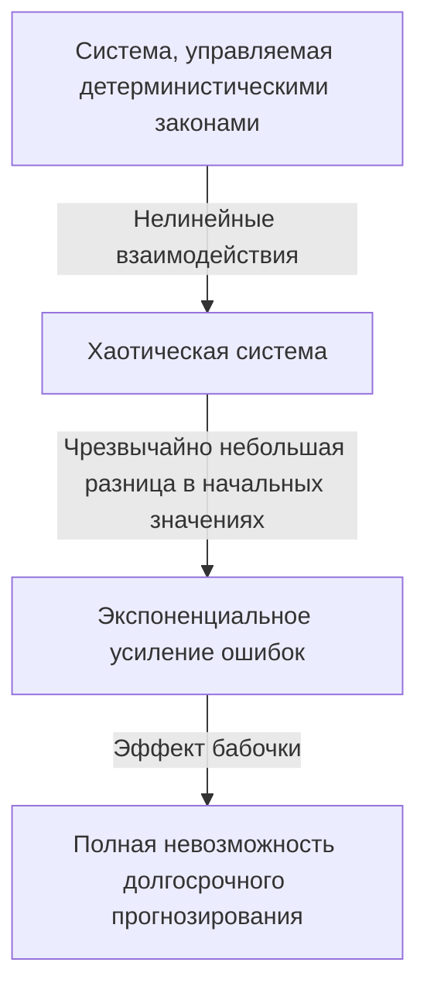

## 1. Введение: что такое эффект бабочки?

«Вызывает ли взмах крыльев бабочки в Бразилии торнадо в Техасе?»

Этот увлекательный и загадочный вопрос символизирует одну из самых известных — и наиболее неправильно понимаемых — концепций современной науки: **эффект бабочки**. Эффект бабочки — это основная концепция **Теории Хаоса**, области, изучаемой в метеорологии, физике, математике и других областях. Это относится к явлению, при котором «небольшие различия в начальных условиях со временем усиливаются в геометрической прогрессии, в конечном итоге создавая решающие различия в будущих состояниях».

В нашей повседневной жизни мы склонны интуитивно предполагать пропорциональную связь между причиной и следствием — линейное мировоззрение, в котором небольшие изменения приводят к небольшим результатам, а большие изменения приводят к большим результатам. Однако многие явления в мире природы ведут себя крайне нелинейно, вопреки этой интуиции. Малейшее колебание может привести к огромным изменениям. Теория хаоса обеспечивает математическую основу для разгадки скрытого порядка, скрывающегося за такими, казалось бы, беспорядочными и непредсказуемыми сложными явлениями.

В этой статье мы подробно изучим теорию хаоса и эффект бабочки — от их исторического фона и математических основ, через их глубокую связь с фрактальной геометрией до их широкого применения в современном обществе. Давайте отправимся в путешествие, чтобы выяснить, почему будущее непредсказуемо и какая красота скрыта в этой непредсказуемости.

---

## 2. Историческая справка: от Пуанкаре до Лоренца

Истоки теории хаоса восходят к исследованиям великого французского математика Анри Пуанкаре в конце XIX века. В то время одной из величайших задач в физике была «Задача трех тел» — предсказание движения трех небесных тел, таких как Солнце, Земля и Луна, которые оказывают взаимное гравитационное притяжение, на основе механики Ньютона.

Углубленно изучая эту проблему, Пуанкаре обнаружил, что движение небесных тел может стать чрезвычайно сложным. Он математически предположил возможность того, что неизмеримо малые ошибки в начальных положениях или скоростях могут со временем усиливаться и в конечном итоге привести к совершенно иным конечным орбитам. По сути, это было первое открытие хаотического поведения — открытие того, что даже детерминированные системы (системы, законы которых полностью известны) могут стать невозможными для предсказания в долгосрочной перспективе. Однако из-за ограничений математических методов и вычислительной мощности (отсутствия компьютеров) того времени это революционное открытие оставалось практически неисследованным в течение нескольких десятилетий.

Ситуация резко изменилась в 1960-е годы. Эдвард Лоренц, метеоролог из Массачусетского технологического института (MIT), моделировал атмосферную конвекцию с помощью одного из первых компьютеров. Он создал набор простых нелинейных дифференциальных уравнений для расчета таких переменных, как температура, давление и скорость ветра, и запустил вычисления на машине.

Однажды Лоренц попытался перезапустить симуляцию с промежуточной точки. Он повторно ввел значения из распечатки, но вместо использования шестизначного значения точности «0,506127», хранящегося внутри компьютера, он ввел «0,506» — трехзначное округленное значение, напечатанное на выходе.

Когда Лоренц вернулся после перерыва на кофе, его ожидало поразительное зрелище. Перезапущенное моделирование на первых нескольких шагах соответствовало предыдущим результатам, но вскоре начало отслеживать совершенно другие погодные условия. Незначительная разница в начальных значениях всего в 0,000127 привела к совершенно иному погодному будущему. Это был момент открытия явления, которое Лоренц позже назовет **Чувствительность к начальным условиям**, которое впоследствии стало известно во всем мире как Эффект бабочки.

---

## 3. Математические основы: нелинейные динамические системы и уравнения Лоренца.

Чтобы понять теорию хаоса математически, необходимо усвоить концепции **Динамических систем** и **Нелинейности**.

Динамическая система – это математическая модель системы, состояние которой меняется с течением времени. Будущее состояние системы полностью определяется ее текущим состоянием и управляющими ею детерминистическими законами (обычно дифференциальными уравнениями или разностными уравнениями). Важно отметить, что сами законы не содержат вероятностных элементов — никакой случайности, такой как бросок игральных костей.

Динамические системы в целом делятся на линейные и нелинейные системы. В линейных системах причина и следствие пропорциональны, и действует принцип суперпозиции: «сумма частей равна целому». Их относительно легко решить математически и предсказать. Однако в нелинейных системах переменные перемножаются или существуют петли обратной связи, нарушающие пропорциональную связь между причиной и следствием. Они демонстрируют поведение, при котором «сумма частей отличается от целого», что приводит к чрезвычайно сложным явлениям. Хаос возникает только в нелинейных системах.

Самый известный набор нелинейных связанных дифференциальных уравнений, порождающих хаос, выведенный Эдвардом Лоренцем на основе модели атмосферной конвекции, — это **уравнения Лоренца**. Они состоят из трех переменных ( $x, y, z$ ) и трех параметров ( $\sigma, \rho, \beta$ ):

$$
\frac{dx}{dt} = \sigma (y - x)
$$

$$
\frac{dy}{dt} = x (\rho - z) - y
$$

$$
\frac{dz}{dt} = x y - \beta z
$$

Здесь каждая переменная имеет физический смысл:
- $x$ представляет интенсивность конвекции (скорость вращения жидкости).
- $y$ представляет разницу температур между восходящим и нисходящим потоками.
- $z$ представляет собой отклонение вертикального профиля температуры от линейности.
- $\sigma$ (число Прандтля), $\rho$ (число Рэлея) и $\beta$ (соотношение сторон системы) являются параметрами.

Для значений параметров, демонстрирующих типичное хаотическое поведение, Лоренц выбрал $\sigma = 10, \rho = 28, \beta = 8/3$. Хотя эта система уравнений является детерминированной, решение никогда не повторяет прошлое состояние, прослеживая бесконечно сложную траекторию. Нелинейные члены $xz$ и $xy$ в уравнениях играют решающую роль в создании хаоса.

---

## 4. Фазовое пространство и странные аттракторы

Мощным инструментом для визуального понимания поведения динамических систем является **Фазовое пространство**. Фазовое пространство — это многомерное пространство, способное представлять все мыслимые состояния системы. Текущее состояние системы представляется как «одна точка» в этом фазовом пространстве. С течением времени и изменением состояния системы движение точки в фазовом пространстве прослеживает «траекторию».

Во многих реальных системах с диссипацией (свойствами, вызывающими потерю энергии, такими как трение или сопротивление воздуха) по прошествии достаточного времени система в конечном итоге переходит в определенное состояние (точку) или периодическое состояние (замкнутый контур). Этот конечный пункт назначения называется **Аттрактор** (то, что притягивает предметы). Например, движение маятника в конечном итоге останавливается в самой нижней точке из-за сопротивления воздуха; в данном случае аттрактором является «одна точка (неподвижная точка)». Для систем, повторяющих периодическое движение, например сердцебиение, аттрактором является «предельный цикл (замкнутая кривая)».

Однако в хаотических системах, подобных уравнениям Лоренца, появляется аттрактор совершенно другого типа — **Странный аттрактор**.

Когда аттрактор Лоренца отображается в трехмерном фазовом пространстве, возникает потрясающе красивая и сложная структура, напоминающая бабочку, расправляющую крылья, или пару глаз. Этот странный аттрактор обладает следующими замечательными свойствами:

1. **Ограниченность**: траектория никогда не уходит в бесконечность; он всегда остается в определенной области аттрактора.
2. **Апериодичность**: траектория никогда не пересекает свой прошлый путь и не повторяет один и тот же маршрут. Он навсегда прокладывает новый путь.
3. **Чувствительность к начальным условиям**: две траектории, начинающиеся из чрезвычайно близких начальных точек аттрактора, со временем расходятся в совершенно разные места внутри аттрактора.

Несмотря на то, что траектория ограничена конечным объемом, она никогда не пересекает сама себя (пересечение нарушило бы детерминистскую предпосылку о том, что «одно и то же состояние ведет к одному и тому же будущему»). Чтобы удовлетворить этому ограничению, пространство должно быть «свернуто» бесконечно. Этот повторяющийся процесс «растягивания и складывания» (во многом похожий на замешивание теста для хлеба) является сутью хаоса и порождает сложную структуру странных аттракторов.

---

## 5. Логистическое отображение и бифуркационные диаграммы.

Еще одна важная математическая модель для понимания теории хаоса в ее простейшей форме — это **Логистическое отображение**. Это простое квадратично-разностное уравнение, которое моделирует динамику популяции (например, ежегодное изменение количества кроликов на острове).

$$
x_{n+1} = r x_n (1 - x_n)
$$

Здесь:
- $x_n$ представляет популяцию поколения $n$ (как пропорцию максимальной пропускной способности окружающей среды в диапазоне от $0 \le x_n \le 1$).
- $x_{n+1}$ — популяция следующего поколения.
- $r$ — параметр, представляющий скорость воспроизведения (обычно $0 \le r \le 4$).

Это уравнение очень простое, но при изменении параметра $r$ оно демонстрирует удивительно разнообразное и сложное поведение.

- $0 < r < 1$: Популяция в конечном итоге вымирает, а $x$ стремится к 0.
- $1 < r < 3$: популяция сходится к фиксированному значению (фиксированной точке) и стабилизируется.
- Рядом с $r = 3$: фиксированная точка становится нестабильной, и популяция начинает чередоваться между двумя разными значениями. Это называется **Бифуркацией удвоения периода**.
- По мере дальнейшего увеличения $r$ быстро происходят бифуркации с периодом, удваивающимся до 4, 8, 16 и так далее.
- За пределами $r \approx 3.56995$ (точка Фейгенбаума) периодичность полностью нарушается, и популяция принимает совершенно непредсказуемые значения. Это состояние **хаоса**.

График, отображающий конечное состояние системы (аттрактор) в зависимости от изменений в $r$, называется **Бифуркационной диаграммой**. Горизонтальная ось представляет параметр $r$, а вертикальная ось представляет окончательные значения $x$.

Изучение бифуркационной диаграммы обнаруживает «окна» — области внутри хаотической области, где порядок внезапно восстанавливается (например, область периода 3). Примечательно, что увеличение частей бифуркационной диаграммы показывает одну и ту же общую картину, проявляющуюся бесконечно — самоподобие. Тот факт, что простое квадратное уравнение содержит такую ​​богатую структуру, вызвал шок в математическом сообществе.

---

## 6. Показатели Ляпунова: количественная оценка хаоса

Метрикой для строгого и математического количественного определения «чувствительности к начальным условиям» хаотической системы является **Показатель Ляпунова**.

Рассмотрим две траектории, стартовающие из предельно близких начальных состояний в фазовом пространстве (разделенных расстоянием $\delta Z_0$), которые расходятся на расстояние $\delta Z(t)$ со временем $t$. В хаотической системе это расстояние в среднем растет экспоненциально.

$$
|\delta Z(t)| \approx e^{\lambda t} |\delta Z_0|
$$

Здесь $\lambda$ (лямбда) — показатель Ляпунова.
Показатель Ляпунова представляет собой среднюю скорость, с которой соседние траектории расходятся (или сходятся).

- $\lambda < 0$: Траектории сходятся друг к другу, образуя фиксированную точку или предельный цикл (не хаотичный).
- $\lambda = 0$: Расстояние между траекториями поддерживается постоянным (например, консервативные системы).
- $\lambda > 0$: Траектории расходятся экспоненциально. Это **окончательный показатель хаоса**.

В многомерных динамических системах показателей Ляпунова (спектра Ляпунова) столько, сколько размерностей. Если существует хотя бы один положительный показатель Ляпунова, система определяется как хаотичная. Чем больше положительный показатель Ляпунова, тем быстрее усиливаются начальные крошечные ошибки, сокращая предсказуемый временной масштаб (время Ляпунова). Это фундаментальная математическая причина, почему прогнозы погоды достаточно точны на несколько дней, но становятся совершенно непредсказуемыми на несколько недель вперед.

---

## 7. Связь между фракталами и хаосом

Незаменимой для любого обсуждения теории хаоса является **фрактальная** геометрия, предложенная математиком Бенуа Мандельбротом. Фрактал — это «форма, в которой, как бы сильно вы ни увеличивали масштаб, одна и та же сложная структура (самоподобие) проявляется бесконечно». Репрезентативные примеры включают множество Мандельброта и кривую Коха.

На первый взгляд хаос и фракталы могут показаться разными понятиями, но на самом деле это две стороны одной медали. Когда вы разрезаете странный аттрактор на поперечное сечение и детально его изучаете, возникает бесконечно многослойная структура, раскрывающая фрактальную геометрию.

Динамика «растяжения и складывания» в фазовом пространстве хаотической системы порождает фрактальные формы как геометрическое следствие. Одним из важных свойств фракталов является то, что они обладают нецелочисленной «дробной размерностью (фрактальной размерностью)». Например, форма, более сложная, чем одномерная линия, которая заполняет пространство, но не соответствует двухмерной плоскости, может иметь размерность 1,26. Странные аттракторы также представляют собой фрактальные структуры дробных размерностей.

Если хаос — это «сложная динамика, возникающая с течением времени», то фракталы — это «геометрические следы, которые эта динамика оставляет в пространстве». Многие природные явления — береговые линии, ветвление деревьев, сети кровеносных сосудов, формы облаков — демонстрируют фрактальные структуры, и считается, что в основе их формирования лежит хаотическая нелинейная динамика.

---

## 8. Реальные приложения: от погоды до экономики

Теория хаоса — это гораздо больше, чем математическая диковинка. Универсальные свойства чувствительности к начальным условиям и нелинейной динамике нашли широкое применение во всех областях, далеко за пределами физики.

### 8.1 Метеорология и изменение климата
Метеорология, ставшая основой открытия Лоренца, является одной из областей, которая больше всего выиграла от теории хаоса. Атмосфера управляется сложными нелинейными уравнениями гидродинамики и термодинамики и по своей сути хаотична. Сегодня вместо единого прогноза основным подходом является «ансамблевое прогнозирование» — одновременное выполнение нескольких симуляций с намеренно небольшими отклонениями от начальных значений. Это позволяет провести вероятностную оценку неопределенности прогноза и понять, насколько далеко в будущее возможны надежные прогнозы.

### 8.2 Медицина и биология
Биологические ритмы человека также глубоко связаны с хаосом. Например, вариабельность сердечного ритма здорового сердца не является ни совершенно регулярной, ни совершенно случайной; он демонстрирует хаотические фрактальные характеристики. У пациентов с сердечно-сосудистыми заболеваниями и пожилых людей сердцебиение может стать либо слишком регулярным, либо совершенно случайным. Утрата хаотической изменчивости изучается как важный признак (биомаркер) ухудшения здоровья. Нелинейная динамика также важна для анализа мозговых волн и моделирования распространения инфекционных заболеваний (например, модели SIR в эпидемиологии).

### 8.3 Экономика и финансовые рынки
Финансовые рынки, такие как фондовые и валютные рынки, представляют собой чрезвычайно сложные нелинейные системы, в которых взаимодействуют психология и действия бесчисленного множества инвесторов. Традиционная экономика предполагала, что рынки эффективны, а цены следуют случайному блужданию (случайные движения с нормальным распределением), но в действительности экстремальные события, такие как крахи и пузыри, происходят гораздо чаще, чем предсказывает нормальное распределение (феномен «толстого хвоста»). Применяя теорию хаоса и фракталы (например, мультифрактальные модели, предложенные Мандельбротом), исследователи пытаются более точно смоделировать нелинейные структуры, скрытые в колебаниях цен, эффектах долговременной памяти и риске коллапса пузыря, чтобы улучшить управление рисками.

### 8.4 Проектирование и контроль
Хаос также является важной концепцией в технике. Хаотические явления наблюдаются во многих системах: вибрации крыльев самолетов (флаттер), синхронизация нелинейных генераторов в электрических цепях, нарушения выходной мощности лазеров и многое другое. Традиционно хаос считался чем-то, чего следует избегать — непредсказуемым шумом, который дестабилизирует системы. Однако сегодня были разработаны методы, известные как «Контроль Хаоса», которые умело переводят систему из хаотического состояния в желательное периодическое состояние, используя лишь небольшое количество энергии, тем самым стабилизируя ее. Также ведутся исследования по применению псевдослучайной природы хаотических сигналов к зашифрованным сообщениям (криптография на основе хаоса).

---

## 9. Философские выводы: детерминизм и предсказуемость

Появление теории хаоса привело к фундаментальному сдвигу парадигмы в философии науки, особенно в отношении нашего мировоззрения на «детерминизм» и «предсказуемость».

Французский математик XVIII века Пьер-Симон Лаплас предложил следующий мысленный эксперимент: «Если бы разум мог знать точное положение и импульс каждого атома во Вселенной и иметь возможность анализировать их, то для этого разума ни будущее, ни прошлое не были бы неопределенными — вся временная шкала была бы открытой, как настоящее». Этот гипотетический разум известен как **Демон Лапласа** и символизирует устойчивое детерминистское мировоззрение, основанное на классической механике.

Детерминизм утверждает, что «если текущее состояние полностью определено, будущее однозначно определяется законами физики». Уравнения, рассматриваемые теорией хаоса (такие как уравнения Лоренца), представляют собой чисто детерминированные уравнения, не содержащие вообще никаких вероятностных элементов. Таким образом, в принципе, Демон Лапласа должен быть способен прекрасно предсказывать будущее хаотической системы.

Однако теория хаоса безжалостно обнажает **пределы предсказуемости** в реальном мире. В действительности невозможно измерить каждое начальное состояние Вселенной с «бесконечной точностью (нулевой ошибкой)». Даже если оставить в стороне принцип неопределенности квантовой механики, наши наблюдательные возможности всегда имеют конечные пределы.

В хаотических системах, независимо от того, насколько мала ошибка наблюдения, она со временем усиливается экспоненциально, в конечном итоге охватывая всю систему. Другими словами, стало ясно, что «быть детерминированным» и «быть предсказуемым» — это совершенно разные понятия. Теория хаоса положила конец Демону Лапласа и преподала человечеству глубокую истину о том, что «даже когда законы полностью известны, будущее может быть по своей сути непредсказуемым».

Этот сдвиг парадигмы представляет собой новое мировоззрение: «Наш мир сложен и непредсказуем, но за ним скрывается прекрасная детерминированная математическая структура». Отказ от идеального предсказания и вместо этого изучение формы аттракторов или понимание вероятностных распределений открыли путь к пониманию «крупномасштабного порядка», скрытого внутри хаоса.

---

## 10. Заключение

В этой статье мы глубоко углубились в эффект бабочки (когда небольшие различия в начальных условиях приводят к совершенно разным результатам) и теорию хаоса, которая его охватывает.

Благодаря интуиции Пуанкаре и случайному компьютерному открытию Лоренца теория хаоса превратилась в обширную область, охватывающую математику и физику. Красивые траектории странных аттракторов, прослеживаемые с помощью нелинейных уравнений, бесконечное самоподобие, обнаруженное в логистической карте, и количественная оценка непредсказуемости с помощью показателей Ляпунова — ее математические основы чрезвычайно усовершенствованы и полны интеллектуальных чудес.

Теория хаоса предоставила мощную призму для понимания сложных явлений, которые нас окружают — от пределов прогнозирования погоды до экономических колебаний, сердцебиения и даже эволюции жизни. Оно учит нас тому, что мир природы ни в коем случае не является простой часовой машиной, а скорее динамической системой, наполненной непредсказуемостью и творчеством.

Детерминистичность, но непредсказуемость — это, казалось бы, парадоксальное свойство является величайшей привлекательностью теории хаоса. Тот факт, что будущее полностью предопределено, но неизвестно никому (даже самым мощным компьютерам), делает наше понимание Вселенной более скромным и более богатым. Нелинейный мир, сотканный из хаоса и фракталов, будет продолжать увлекать ученых и вдохновлять на новые открытия еще долгие годы.

