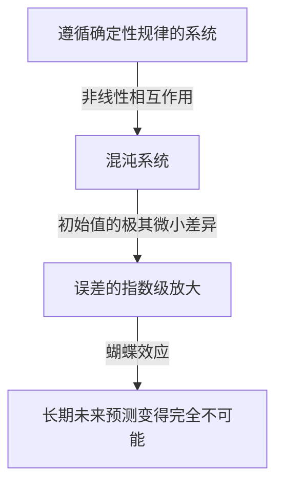
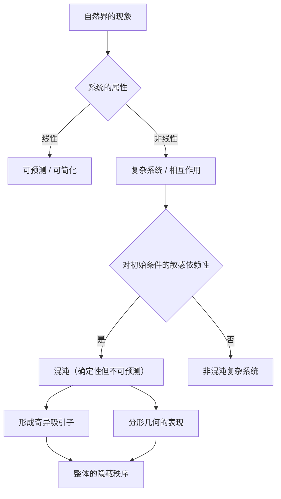

## 1. 引言：什么是蝴蝶效应？

“巴西一只蝴蝶拍打翅膀，能在德克萨斯州引起一场龙卷风吗？”

这个迷人而神秘的疑问象征着现代科学中最著名同时也最容易被误解的概念之一—— **蝴蝶效应** (Butterfly Effect)。蝴蝶效应是气象学、物理学、数学等领域所研究的 **混沌理论** (Chaos Theory) 的核心概念，它指的是“初始条件的微小差异会随着时间呈指数级放大，最终导致未来状态发生决定性改变”的现象。

在我们的日常生活中，人们常常直观地认为因果关系是成正比的。也就是说，微小的改变带来微小的结果，巨大的改变带来巨大的结果，这是一种线性的世界观。然而，与这种直觉相反，自然界中的许多现象表现出极度的非线性。一点微小的波动就可能产生巨大的变化。混沌理论提供了一个数学框架，用于揭示这些看似无序且不可预测的复杂现象背后隐藏的秩序。

在本文中，我们将深入探讨混沌理论和蝴蝶效应，从其历史背景到数学基础、与分形几何的深刻联系，以及在现代社会中丰富多样的应用。让我们踏上一段旅程，去探索为什么未来是不可预测的，以及这种不可预测性中隐藏着怎样的美。

---

## 2. 历史背景：从庞加莱到洛伦兹

混沌理论的萌芽可以追溯到19世纪末法国伟大数学家[亨利·庞加莱](https://kenji.blog/p/poincare/)（[Henri Poincaré](https://kenji.blog/p/poincare/)）的研究。当时，物理学面临的最大难题之一是“三体问题”。这个问题旨在基于牛顿力学预测太阳、地球、月球这样三个相互施加引力的天体的运动。

庞加莱在深入研究这个问题的过程中，发现天体的运动可能会变得极其复杂。他在数学上提出，初始位置或速度上无法测量的微小误差可能会随着时间推移而不断扩大，最终导致天体轨道变得截然不同。这实际上是人类首次发现混沌行为，它表明即使在一个确定性系统（规律完全已知的系统）中，长期的预测有时也会变得不可能。然而，受限于当时的数学方法和计算能力（没有计算机），这一突破性的发现在随后的几十年里并没有得到深入的探索。

情况在20世纪60年代发生了戏剧性的转变。麻省理工学院（MIT）的气象学家爱德华·洛伦兹（Edward Lorenz）当时正在使用早期的计算机模拟大气对流。他创建了一组简单的非线性微分方程来计算温度、气压和风速等变量，并通过计算机进行数值求解。

有一天，洛伦兹试图从之前一次模拟的中途重新开始计算。他从打印出来的计算结果中重新输入了数值，但他错误地输入了“0.506”——一个在打印纸上四舍五入到三位小数的数值，而没有使用计算机内部保存的六位精度数值“0.506127”。

当洛伦兹喝完咖啡回来时，一幅令人震惊的景象出现在他面前。重新开始的模拟结果在最初的几步与之前的计算完全一致，但很快就开始描绘出完全不同的气象模式。仅仅是0.000127这样极其微小的初始值差异，最终却导致了完全不同的未来天气。这正是洛伦兹后来称之为 **对初始条件的敏感依赖性** (Sensitive dependence on initial conditions)，并在全世界以蝴蝶效应闻名的现象的发现瞬间。

---

## 3. 数学基础：非线性动力系统与洛伦兹方程

为了从数学上理解混沌理论，我们需要掌握 **动力系统** (Dynamical Systems) 和 **非线性** (Non-linearity) 的概念。

动力系统是描述系统状态随时间变化的数学模型。系统的未来状态完全由其当前状态以及支配该系统的确定性规律（通常是微分方程或差分方程）所决定。这里的关键在于，规律本身不包含任何概率因素（比如掷骰子那样的偶然性）。

动力系统大致可分为线性系统和非线性系统。在线性系统中，因果成比例，“部分之和等于整体”的叠加原理成立。这类系统在数学上相对容易求解，预测也很简单。而在非线性系统中，变量之间会相乘或存在反馈循环，从而打破了因果之间的比例关系。它表现出“部分之和不等于整体”的行为，是引发极其复杂现象的原因。混沌只发生在非线性系统中。

爱德华·洛伦兹从大气对流模型中推导出来的，能够产生混沌的最著名的非线性联立微分方程组就是 **洛伦兹方程** (Lorenz equations)。它由以下三个变量（ $x, y, z$ ）和三个参数（ $\sigma, \rho, \beta$ ）组成。

$$
\frac{dx}{dt} = \sigma (y - x)
$$

$$
\frac{dy}{dt} = x (\rho - z) - y
$$

$$
\frac{dz}{dt} = x y - \beta z
$$

在这里，每个变量都有其物理意义：
- $x$ 表示对流的强度（流体的旋转速度）
- $y$ 表示上升气流与下降气流之间的水平温差
- $z$ 表示垂直温度分布偏离线性的程度
- $\sigma$ （普朗特数）、 $\rho$ （瑞利数）、 $\beta$ （系统的长宽比）为参数。

作为能够展示典型混沌行为的参数值，洛伦兹选择了 $\sigma = 10, \rho = 28, \beta = 8/3$ 。虽然这个方程组是确定性的，但其解永远不会重复过去的状态，而是不断描绘出无限复杂的轨迹。方程中的 $xz$ 和 $xy$ 等非线性项在产生混沌中起着决定性的作用。

---

## 4. 相空间与奇异吸引子

用来直观理解动力系统行为的强大工具是 **相空间** (Phase space)。相空间是一个能够表示系统所有可能状态的多维空间。系统的当前状态被表示为这个相空间中的“一个点”。随着时间的推移，系统状态变化的过程就被描绘为该点在相空间中移动所形成的“轨迹”。

在现实世界中许多带有耗散（会损失能量的属性，如摩擦或空气阻力）的系统里，经过足够长的时间后，系统最终会稳定在一个特定的状态（一个点）或周期性的状态（一个闭环）。这个最终的落脚点被称为 **吸引子** (Attractor)。例如，由于空气阻力，钟摆的运动最终会停在最低点，此时的吸引子就是一个“点（不动点）”。而像心脏跳动那样重复周期性运动的系统，其吸引子则是一个“极限环（闭合曲线）”。

然而，在洛伦兹方程这样的混沌系统中，出现了一种完全不同的吸引子。这就是 **奇异吸引子** (Strange Attractor)。

如果在三维相空间中绘制洛伦兹吸引子，会呈现出一个像张开翅膀的蝴蝶，或是两只眼睛一般，令人屏息的复杂美丽结构。这个奇异吸引子具有以下惊人的特征：

1. **有界性** ：轨迹不会飞向无限远，而是始终停留在吸引子的特定区域内。
2. **非周期性** ：轨迹绝不会与自己过去的轨迹相交，也绝不会完全重复同一条路径。它永远在描绘新的路径。
3. **对初始条件的敏感依赖性** ：在吸引子上极度靠近的两个初始点出发的轨迹，随着时间推移，会在吸引子内部被拉扯到完全不同的地方。

尽管轨迹被限制在有限的体积内，但它受到绝不相交的约束（因为一旦相交，就违背了决定论“相同状态必将导致相同未来”的前提）。为了实现这一点，空间必须被无限地“折叠”。这种反复的“拉伸”和“折叠”过程（就像揉面团一样）正是混沌的本质，它造就了奇异吸引子复杂的结构。

---

## 5. 逻辑斯谛映射与分岔图

为了最简单地理解混沌理论，另一个重要的数学模型是 **逻辑斯谛映射** (Logistic map)。这是一个模拟生物种群数量波动（例如，某座岛上兔子数量每年的变化）的简单的二次差分方程。

$$
x_{n+1} = r x_n (1 - x_n)
$$

在这里，
- $x_n$ 代表第 $n$ 代的种群数量（作为一个相对于环境最大承载力的比例，取值范围为 $0 \le x_n \le 1$ ）。
- $x_{n+1}$ 是下一代的种群数量。
- $r$ 是代表繁殖率的参数（通常 $0 \le r \le 4$ ）。

这个方程虽然极其简单，但通过改变参数 $r$ 的值，它会展现出惊人的多样化和复杂的行为：

- $0 < r < 1$ ：种群最终灭绝， $x$ 收敛于0。
- $1 < r < 3$ ：种群数量收敛于某个特定的固定值（不动点）并稳定下来。
- $r = 3$ 附近：不动点变得不稳定，种群数量开始在两个不同的值之间交替变化。这被称为 **倍周期分岔** (Period-doubling bifurcation)。
- 随着 $r$ 进一步增加，周期会迅速倍增为4、8、16等分岔现象。
- 当超过 $r \approx 3.56995$ （费根鲍姆常数点）时，周期性完全崩溃，种群数量将呈现完全不可预测的值。这就是 **混沌** 状态。

将系统针对 $r$ 变化的最终状态（吸引子）绘制成图表，就得到了所谓的 **分岔图** (Bifurcation diagram)。横轴表示参数 $r$ ，纵轴表示 $x$ 的最终值。

观察分岔图，我们可以看到在混沌区域中，存在着突然恢复秩序的被称为“窗口（Window）”的区域（例如周期3的区域）。令人惊叹的是，如果你不断放大这个分岔图的某个局部，它会展现出与整体结构完全相同模式无限重复的自相似性。一个简单的二次方程竟然内含如此丰富的结构，这一事实给数学界带来了极大的震撼。

---

## 6. 李雅普诺夫指数：混沌的量化

用来在数学上严格量化混沌系统所具有的“对初始条件敏感依赖性”的指标是 **李雅普诺夫指数** (Lyapunov Exponent)。

考虑在相空间中极度靠近的两个初始状态（它们之间的距离记为 $\delta Z_0$ ），观察从它们出发的轨迹随着时间 $t$ 的推移，分离到距离 $\delta Z(t)$ 的过程。在混沌系统的情况下，这个距离平均呈指数级放大。

$$
|\delta Z(t)| \approx e^{\lambda t} |\delta Z_0|
$$

在这里， $\lambda$ （lambda）就是李雅普诺夫指数。
李雅普诺夫指数表示相邻轨迹分离（或相互靠近）的平均速率。

- $\lambda < 0$ ：轨迹相互靠近，收敛于不动点或极限环（不是混沌）。
- $\lambda = 0$ ：轨迹之间的距离保持不变（如保守系统）。
- $\lambda > 0$ ：轨迹呈指数级分离。这是 **混沌** 的决定性指标。

在多维动力系统中，存在与空间维度相同数量的李雅普诺夫指数（李雅普诺夫谱）。如果存在至少一个正的李雅普诺夫指数，那么该系统就被定义为混沌的。正的李雅普诺夫指数越大，最初的微小误差放大的速度就越快，能够预测未来的时间尺度（李雅普诺夫时间）就越短。这就是为什么天气预报在几天内比较准确，但在几周之后就变得完全不可预测的根本数学原因。

---

## 7. 分形与混沌的关系

在探讨混沌理论时，不可或缺的是数学家本华·曼德博（Benoit Mandelbrot）提出的 **分形** (Fractal) 几何学。分形是指“无论放大多少倍，始终无限出现与整体相似的复杂结构（自相似性）的图形”。代表性的例子包括曼德博集合和科赫曲线等。

混沌和分形乍看之下似乎是不同的概念，但它们实际上是一体两面的关系。如果你切下奇异吸引子的横截面并仔细观察，你会发现那里呈现出无限重叠的层状结构，从而证明它具有分形结构。

混沌系统相空间中“拉伸与折叠”的动力学过程，在几何上的结果就是产生了分形图形。分形的一个重要特征是它拥有非整数的“分数维（分形维数）”。例如，一个比一维线更复杂、更能填满空间，但又达不到二维平面的图形，其维度可能是1.26维。奇异吸引子同样也是一个具有分数维的分形结构体。

如果说混沌是“随着时间推移展现出来的复杂动力学”，那么分形就可以被视为“这种动力学在空间中刻下的几何足迹”。自然界中海岸线的形状、树木的枝丫、血管网络、云朵的形状等，许多自然现象都具有分形结构，人们认为在它们形成过程的背后，正起作用的是混沌非线性动力学。

---

## 8. 现实世界的应用：从气象学到经济学

混沌理论绝不仅仅是数学上的游戏。对初始条件的敏感依赖性和非线性动力学这些普遍属性，已经跨越了物理学的边界，在现实世界的各个领域产生了广泛的应用。

### 8.1 气象学与气候变化
作为洛伦兹发现混沌的舞台，气象学是受混沌理论恩惠最多的领域之一。大气受到流体力学和热力学复杂的非线性方程所支配，其本质就是混沌的。目前，主流的方法不再是单一预测，而是“集合预报”——即故意在初始值中引入微小扰动，同时运行多个模拟。通过这种方法，气象学家可以概率性地评估预测的不确定性，并掌握究竟多长时间内的预测是可靠的。

### 8.2 医学与生物学
人类的生物节律也与混沌有着深厚的联系。例如，我们知道健康心脏的心跳间隔（波动）既不是完全规律的，也不是完全随机的，而是具有混沌的分形特性。相反，心脏病患者或老年人的心跳可能会变得过于规律或完全随机，因此混沌波动的丧失正被作为表明健康状况恶化的重要标志（生物标志物）进行研究。此外，在脑电波的分析以及传染病流行的建模（如流行病学中的SIR模型）中，非线性动力学也是必不可少的。

### 8.3 经济学与金融市场
股票市场和外汇市场等金融市场是无数投资者的心理和行为相互作用的极其复杂的非线性系统。传统的经济学假设市场是有效的，价格遵循[随机漫步](https://kenji.blog/p/random-walk/)（服从正态分布的随机运动）。然而，在实际市场中，像暴跌或泡沫这样极端事件的发生频率远远高于正态分布的预测（肥尾现象）。通过应用混沌理论和分形（如曼德博提出的多重分形模型），人们正在尝试更准确地对市场价格波动中隐藏的非线性结构、长期记忆性以及泡沫破裂的风险进行建模，并将其应用于风险管理。

### 8.4 工程与控制
在工程领域，混沌的概念同样重要。在飞机机翼的振动（颤振现象）、电路中非线性振荡器的同步、激光输出的紊乱等许多系统中都可以观察到混沌现象。过去，因为混沌是不可预测的且会使系统变得不稳定，人们一直认为它是“应该避免的”或“需要排除的噪音”。但如今，被称为“混沌控制（Chaos Control）”的技术得到了发展，利用系统本身带有的微小能量，巧妙地引导系统从混沌状态过渡到期望的周期性状态并使其稳定。此外，利用混沌信号随机性进行加密通信（混沌密码）的应用也在研究之中。

---

## 9. 哲学启示：决定论与可预测性

混沌理论的出现，给科学哲学，尤其是关于“决定论（Determinism）”和“可预测性（Predictability）”的世界观带来了根本性的范式转变。

18世纪的法国数学家皮埃尔-西蒙·拉普拉斯提出了这样一个思想实验：“如果存在某种智能，能够完全掌握宇宙中所有原子此刻的位置和动量，并且具有足够庞大的计算能力去分析它们，那么对于这种智能来说，未来就像过去一样，将清晰地呈现在它的眼前。”这种假想的智能被称为 **拉普拉斯妖** (Laplace's demon)，它象征着基于经典力学的强烈的决定论宇宙观。

决定论的观点认为，“如果当前状态完全确定，那么未来将根据物理定律被唯一地决定”。混沌理论所处理的方程（如洛伦兹方程）是不包含任何概率因素的纯粹的决定性方程。因此，从原理上讲，如果是拉普拉斯妖，也应该能够完美地预测混沌系统的未来。

然而，混沌理论冷酷地向我们指出了在现实世界中 **可预测性的极限** 。在现实世界中，要以“无限的精度（零误差）”来测量宇宙的所有初始状态是不可能的。即便不考虑量子力学的不确定性原理，我们的观测能力也必然有其有限的极限。

在混沌系统中，无论这个观测误差多么微小，它都会随着时间的推移呈指数级放大，并最终吞噬整个系统。换句话说，“决定论”和“可预测”被证明是完全不同的概念。混沌理论终结了拉普拉斯妖，并教导了人类一个深奥的真理：“即使规律完全已知，未来本质上仍然可能是不可预测的。”

这种范式转变提出了一种新的世界观：“我们的世界是复杂且不可预测的，但在其背后潜藏着美丽的确定性数学结构。”人们不再追求完美的预测，而是通过研究吸引子的形状和理解概率分布，开辟出了一条理解隐藏在混沌之中的“宏观秩序”的道路。

---

## 10. 结论

在本文中，我们深入探讨了微小的初始条件差异带来巨大结果的蝴蝶效应，以及包含这一效应的混沌理论。

从庞加莱的直觉开始，经过洛伦兹借助计算机的偶然发现，混沌理论已经成长为一个横跨数学和物理学的庞大领域。非线性方程描绘出的奇异吸引子美丽的轨迹、逻辑斯谛映射中展现出的无限自相似性，以及通过李雅普诺夫指数对不可预测性进行的量化，其数学基础非常精致，充满了智慧的惊奇。

混沌理论不仅告诉我们天气预报的极限，还为我们提供了一个强大的视角，去理解围绕在我们身边的复杂现象——从经济的波动、心脏的跳动，到生命的进化。它向我们揭示了自然界绝不是一台简单的钟表般的机器，而是一个充满了不可预测性和创造力的动态系统。

既是确定性的，又是不可预测的。这种看似矛盾的性质，正是混沌理论最大的魅力所在。未来已经完全注定，却没有任何人（无论计算机多么强大）能够知晓其详细的未来，这一事实让我们对宇宙的认知变得更加谦卑和丰富。由混沌和分形交织而成的非线性世界，在未来也必定会继续让科学家们着迷，并不断带来新的发现。

