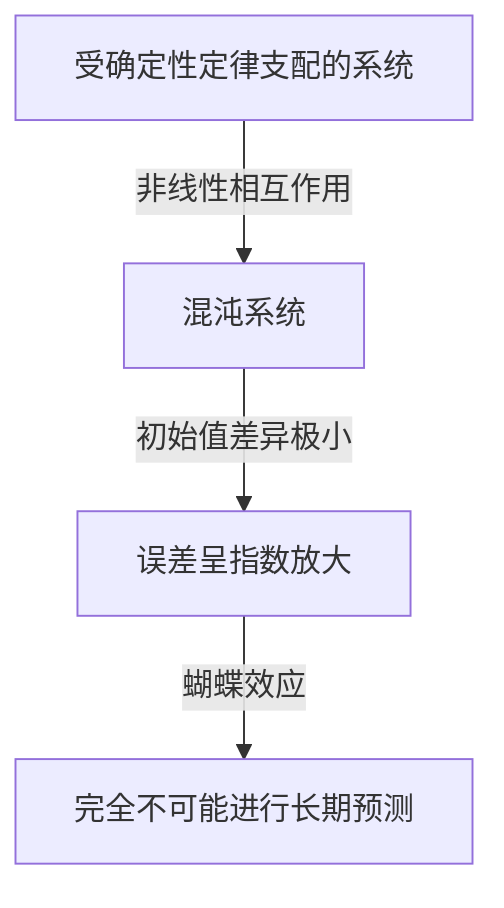
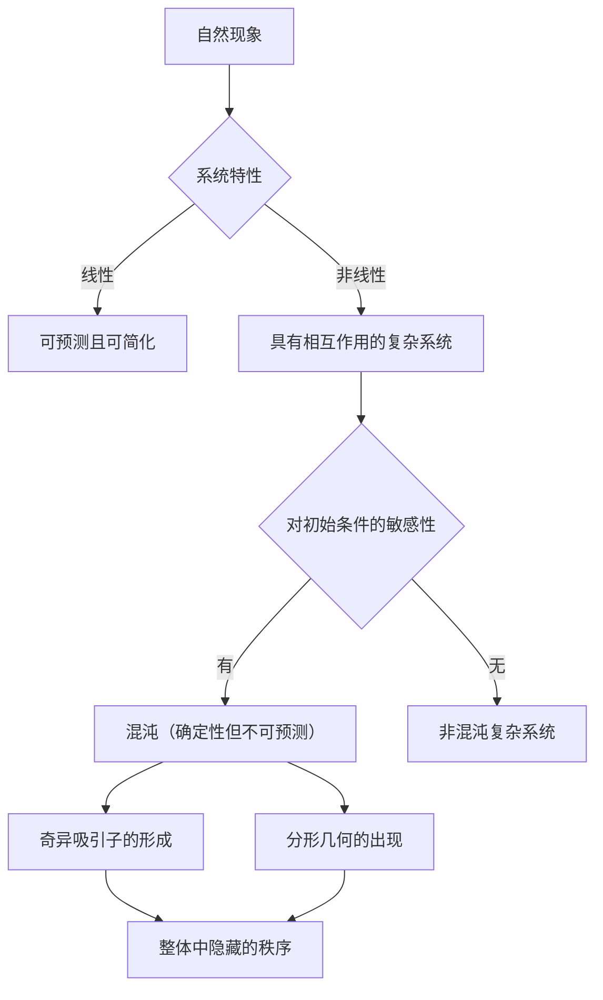

## 1. 简介：什么是蝴蝶效应？

“巴西蝴蝶扇动翅膀是否会在德克萨斯州引发龙卷风？”

这个迷人而神秘的问题象征着现代科学最著名且最容易被误解的概念之一：**蝴蝶效应**。蝴蝶效应是**混沌理论**的核心概念，混沌理论是气象学、物理学、数学等领域的研究领域。它指的是“初始条件的微小差异随着时间的推移呈指数级放大，最终在未来状态中产生决定性差异”的现象。

在我们的日常生活中，我们倾向于直观地假设因果关系之间存在比例关系——一种线性世界观，其中小变化产生小结果，大变化产生大结果。然而，自然界中的许多现象都以高度非线性的方式表现，违背了这种直觉。微小的波动可以产生巨大的变化。混沌理论提供了数学框架，用于揭示隐藏在这些看似无序且不可预测的复杂现象背后的隐藏秩序。

在本文中，我们将深入探讨混沌理论和蝴蝶效应——从它们的历史背景和数学基础，到它们与分形几何的深厚联系，再到它们在现代社会的广泛应用。让我们踏上一段旅程，去发现为什么未来是不可预测的，以及在不可预测的背后隐藏着什么美丽。

---

## 2. 历史背景：从庞加莱到洛伦兹

混沌理论的萌芽可以追溯到19世纪末法国伟大数学家亨利·庞加莱的研究。当时，物理学最大的挑战之一是“三体问题”——根据牛顿力学预测太阳、地球和月球等三个相互引力的天体的运动。

在深入研究这个问题时，庞加莱发现天体的运动可能变得异常复杂。他从数学上提出了一种可能性，即初始位置或速度中不可估量的小误差可能会随着时间的推移而放大，最终使最终轨道完全不同。实际上，这是对混沌行为的首次发现，即即使是确定性系统（其定律完全已知的系统）从长远来看也可能变得无法预测。然而，由于当时数学方法和计算能力（没有计算机）的限制，这一突破性的发现在几十年内基本上未被探索。

到了 20 世纪 60 年代，情况发生了巨大变化。麻省理工学院 (MIT) 的气象学家爱德华·洛伦茨 (Edward Lorenz) 正在使用早期计算机模拟大气对流。他创建了一组简单的非线性微分方程来计算温度、压力和风速等变量，并在机器上运行计算。

有一天，洛伦兹试图从中间点重新开始模拟。他重新输入了打印输出中的值，但他没有使用计算机内部存储的 6 位精度值“0.506127”，而是输入了“0.506”——打印在输出上的 3 位舍入值。

当洛伦兹喝完咖啡休息回来时，令人惊讶的景象等待着他。重新启动的模拟与前几个步骤的结果相匹配，但很快就开始追踪完全不同的天气模式。仅仅 0.000127 的微小初始值差异就产生了完全不同的天气未来。洛伦兹后来将这种现象称为“对初始条件的敏感性”，也就是在此时发现的，这种现象后来被全世界称为“蝴蝶效应”。

---

## 3. 数学基础：非线性动力系统和洛伦兹方程

要从数学上理解混沌理论，必须掌握**动态系统**和**非线性**的概念。

动态系统是状态随时间变化的系统的数学模型。系统的未来状态完全由其当前状态和控制它的确定性定律（通常是微分方程或差分方程）决定。至关重要的是，这些法则本身不包含概率元素——不存在像掷骰子那样的随机性。

动力系统大致分为线性系统和非线性系统。在线性系统中，因果是成正比的，叠加原理成立：“部分之和等于整体”。这些相对容易用数学方法解决和预测。然而，在非线性系统中，变量相乘或存在反馈回路，破坏了因果之间的比例关系。它们表现出“部分之和与整体不同”的行为，从而产生极其复杂的现象。混沌仅发生在非线性系统中。

最著名的一组产生混沌的非线性耦合微分方程是爱德华·洛伦兹 (Edward Lorenz) 根据大气对流模型导出的，即**洛伦兹方程**。它们由三个变量 ( $x, y, z$ ) 和三个参数 ( $\sigma, \rho, \beta$ ) 组成：

$$
\frac{dx}{dt} = \sigma (y - x)
$$

$$
\frac{dy}{dt} = x (\rho - z) - y
$$

$$
\frac{dz}{dt} = x y - \beta z
$$

这里，每个变量都有一个物理意义：
- $x$ 表示对流强度（流体的转速）
- $y$表示上升流和下降流的温差
- $z$表示垂直温度分布与线性的偏差
- $\sigma$（普朗特数）、$\rho$（瑞利数）和$\beta$（系统的纵横比）是参数。

对于表现出典型混沌行为的参数值，Lorenz 选择了 $\sigma = 10, \rho = 28, \beta = 8/3$。尽管这个方程组是确定性的，但解永远不会重复过去的状态，而是追踪无限复杂的轨迹。方程中的非线性项$xz$和$xy$对混沌的产生起决定性作用。

---

## 4.相空间和奇异吸引子

**相空间**是直观地理解动力系统行为的强大工具。相空间是一个多维空间，能够表示系统的每种可想象的状态。系统的当前状态表示为该相空间中的“单点”。随着时间的推移和系统状态的变化，点在相空间中的运动会描绘出一条“轨迹”。

在许多具有耗散的现实系统中（导致能量损失的属性，例如摩擦或空气阻力），经过足够的时间后，系统最终会进入特定状态（一个点）或周期性状态（闭环）。这个最终目的地称为**吸引子**（吸引事物的东西）。例如，由于空气阻力，钟摆的运动最终会停在最低点；在这种情况下，吸引子是“单个点（固定点）”。对于重复周期性运动（例如心跳）的系统，吸引子是“极限环（闭合曲线）”。

然而，在像洛伦兹方程这样的混沌系统中，会出现一种完全不同类型的吸引子——**奇异吸引子**。

当洛伦兹吸引子被绘制在三维相空间中时，一个令人惊叹的美丽和复杂的结构出现了，就像一只展开翅膀的蝴蝶或一双眼睛。这个奇异吸引子具有以下显着的特性：

1. **有界性**：轨迹永远不会飞向无穷远；它始终保持在吸引子的特定区域内。
2. **非周期性**：轨迹永远不会与自己过去的路径交叉或重复完全相同的路线。它永远追寻着一条新的道路。
3. **对初始条件的敏感性**：从吸引子上极其接近的初始点开始的两条轨迹随着时间的推移被拉开到吸引子内完全不同的位置。

尽管被限制在有限的体积内，但轨迹永远不会与自身交叉（交叉将违反“相同的状态导致相同的未来”的确定性前提）。为了满足这个约束，空间必须被无限地“折叠”。这种“拉伸和折叠”的重复过程（很像揉面包面团）是混沌的本质，它产生了奇异吸引子的复杂结构。

---

## 5.逻辑斯蒂映射和分叉图

以最简单的形式理解混沌理论的另一个重要数学模型是**逻辑斯蒂映射**。它是一个简单的二次差分方程，用于模拟种群动态（例如，岛上兔子数量的年度变化）。

$$
x_{n+1} = r x_n (1 - x_n)
$$

这里：
- $x_n$代表$n$代的人口（占环境最大承载能力的比例，范围从$0 \le x_n \le 1$）。
- $x_{n+1}$ 是下一代的人口。
- $r$是表示再现率的参数（通常为$0 \le r \le 4$）。

这个方程非常简单，但通过改变参数 $r$，它表现出惊人的多样化和复杂的行为。

- $0 < r < 1$：种群最终灭绝，$x$收敛于0。
- $1 < r < 3$：种群收敛到固定值（不动点）并趋于稳定。
- 在 $r = 3$ 附近：固定点变得不稳定，总体开始在两个不同值之间交替。这称为**倍周期分岔**。
- 随着 $r$ 进一步增加，分岔迅速发生，周期加倍至 4、8、16 等。
- 超过 $r \approx 3.56995$（费根鲍姆点），周期性完全崩溃，总体呈现完全不可预测的值。这是**混沌**的状态。

根据 $r$ 的变化绘制系统最终状态（吸引子）的图称为 **分岔图**。横轴代表参数$r$，纵轴代表$x$的最终值。

检查分叉图可以发现“窗口”——混沌域内秩序突然恢复的区域（例如，周期为 3 的区域）。值得注意的是，放大分叉图的某些部分会发现无限出现的相同整体模式——自相似性。一个简单的二次方程包含如此丰富的结构，这一事实在数学界引起了轩然大波。

---

## 6. 李亚普诺夫指数：量化混沌

严格和数学地量化混沌系统“对初始条件的敏感性”的度量是**李亚普诺夫指数**。

考虑相空间中从极其接近的初始状态出发的两条轨迹，初始距离为 $\delta Z_0$。经过时间 $t$ 后，它们之间的距离变为 $\delta Z(t)$。在混沌系统中，这个距离平均呈指数增长。

$$
|\delta Z(t)| \approx e^{\lambda t} |\delta Z_0|
$$

这里，$\lambda$ (lambda) 是李亚普诺夫指数。
李亚普诺夫指数表示相邻轨迹发散（或收敛）的平均速率。

- $\lambda < 0$：轨迹相互收敛，趋于固定点或极限环（非混沌）。
- $\lambda = 0$：轨迹之间的距离保持恒定（例如，保守系统）。
- $\lambda > 0$：轨迹呈指数级分散。这是**混沌的最终指标**。

在多维动力系统中，有多少维就有多少个李亚普诺夫指数（李亚普诺夫谱）。如果至少存在一个正李亚普诺夫指数，则系统被定义为混沌系统。正李亚普诺夫指数越大，初始微小误差放大得越快，从而缩短可预测的时间尺度（李亚普诺夫时间）。这就是为什么天气预报在几天后相当准确，但在未来几周却变得完全不可预测的根本数学原因。

---

## 7. 分形与混沌的关系

对于混沌理论的任何讨论都不可或缺的是数学家伯努瓦·曼德尔布罗特提出的**分形**几何。分形是“一种形状，无论放大多远，都会无限地出现相同的复杂结构（自相似性）”。代表性的例子包括曼德尔布罗特集和科赫曲线。

混沌和分形乍一看似乎是不同的概念，但实际上它们是同一枚硬币的两面。当你切开一个奇异吸引子的横截面并仔细检查它时，就会出现一个无限分层的结构，揭示分形几何。

混沌系统相空间中的“拉伸和折叠”动力学产生分形形状作为几何结果。分形的一个重要属性是它们具有非整数的“分数维数（分形维数）”。例如，比填充空间但未达到二维平面的一维线更复杂的形状的尺寸可能为 1.26。奇异吸引子也是具有分数维数的分形结构。

如果混沌是“随着时间的推移而出现的复杂动态”，那么分形就是“这些动态蚀刻到空间中的几何足迹”。许多自然现象——里亚海岸线、树枝、血管网络、云形状——都表现出分形结构，人们相信混沌非线性动力学是它们形成的基础。

---

## 8. 现实世界的应用：从天气到经济

混沌理论不仅仅是一种数学好奇心。对初始条件和非线性动力学敏感的普遍特性已经在各个领域带来了广泛的应用，远远超出了物理学的范畴。

### 8.1 气象与气候变化
气象学是洛伦兹发现的舞台，也是从混沌理论中受益最多的领域之一。大气受流体动力学和热力学的复杂非线性方程控制，本质上是混沌的。如今，主流方法不再是单一预测，而是“集合预测”——同时运行多个模拟，并有意对初始值进行小扰动。这允许对预测不确定性进行概率评估，并了解未来可靠预测的可能性。

### 8.2 医学和生物学
人类的生物节律也与混沌密切相关。例如，健康心脏的心率变异性既不是完全规则的，也不是完全随机的；它表现出混沌分形特征。心脏病患者和老年人的心跳可能变得过于规律或完全随机。混沌变异性的丧失正在被研究为健康状况恶化的一个重要标志（生物标志物）。非线性动力学对于分析脑电波和建模传染病的传播也至关重要（例如流行病学中的 SIR 模型）。

### 8.3 经济和金融市场
股票和货币交易市场等金融市场是极其复杂的非线性系统，无数投资者的心理和行为相互作用。传统经济学假设市场是有效的，并且价格遵循随机游走（正态分布的随机运动），但实际上，崩盘和泡沫等极端事件的发生频率远远高于正态分布预测的频率（厚尾现象）。通过应用混沌理论和分形（例如Mandelbrot提出的多重分形模型），研究人员正在尝试更准确地对隐藏在价格波动、长期记忆效应和泡沫破裂风险中的非线性结构进行建模，以改善风险管理。

### 8.4 工程与控制
混沌也是工程学中的一个重要概念。在许多系统中都可以观察到混沌现象：飞机机翼的振动（颤振）、电路中非线性振荡器的同步、激光输出的干扰等等。传统上，混沌被视为需要避免的事情——不可预测的噪音会破坏系统的稳定。然而，如今，被称为“混沌控制”的技术已经开发出来，它仅使用少量能量就可以巧妙地将系统从混沌状态引导到理想的周期状态，从而使其稳定。将混沌信号的伪随机特性应用于加密通信（基于混沌的密码学）的研究也在进行中。

---

## 9. 哲学含义：决定论和可预测性

混沌理论的出现给科学哲学带来了根本性的范式转变——特别是关于我们关于“决定论”和“可预测性”的世界观。

18世纪的法国数学家皮埃尔-西蒙·拉普拉斯提出了如下思想实验：“如果一个智能体能够知道宇宙中每个原子的准确位置和动量，并有能力分析它们，那么对它而言，未来和过去都不存在不确定性——整个时间线将像现在一样清晰。”这个假设的智能体被称为**拉普拉斯妖**，象征着建立在经典力学基础上的坚定的决定论世界观。

决定论认为“如果当前状态完全确定，那么未来就由物理定律唯一决定”。混沌理论处理的方程（例如洛伦兹方程）是纯粹的确定性方程，不包含任何概率元素。因此，原则上，拉普拉斯恶魔应该能够完美地预测混沌系统的未来。

然而，混沌理论无情地暴露了现实世界中**可预测性的局限性**。事实上，不可能以“无限精度（零误差）”测量宇宙的每一个初始状态。即使抛开量子力学的不确定性原理，我们的观测能力也总是有限的。

在混沌系统中，无论观测误差有多小，它都会随着时间的推移呈指数级放大，最终吞噬整个系统。换句话说，很明显“确定性”和“可预测性”是完全不同的概念。混沌理论安息了拉普拉斯恶魔，并教导人类“即使完全了解规律，未来也可能是不可预测的”这一深刻真理。

这种范式转变提出了一种新的世界观：“我们的世界是复杂且不可预测的，但其背后隐藏着美丽的确定性数学结构。”通过放弃完美预测，转而检查吸引子的形状或理解概率分布，开辟了一条理解隐藏在混沌中的“大规模秩序”的道路。

---

## 10. 结论

在本文中，我们深入研究了蝴蝶效应（初始条件的微小差异会导致截然不同的结果）以及包含它的混沌理论。

从庞加莱的直觉，到洛伦兹基于计算机的偶然发现，混沌理论已经发展成为一个跨越数学和物理学的广阔领域。由非线性方程追踪的奇异吸引子的美丽轨迹，逻辑斯蒂映射中发现的无限自相似性，以及通过李亚普诺夫指数对不可预测性的量化——其数学基础异常精致，充满了智力奇迹。

混沌理论为理解我们周围的复杂现象提供了一个强大的视角——从天气预报的局限性到经济波动、心跳，甚至生命的进化。它告诉我们，自然世界绝不是一个简单的发条机器，而是一个充满不可预测性和创造力的动态系统。

确定性但却不可预测——这种看似矛盾的特性是混沌理论的最大吸引力。未来是完全确定的，但任何人（即使是最强大的计算机）都不可知，这一事实使我们对宇宙的理解更加谦虚和丰富。由混沌和分形编织而成的非线性世界将在未来几年继续吸引科学家并激发新的发现。

