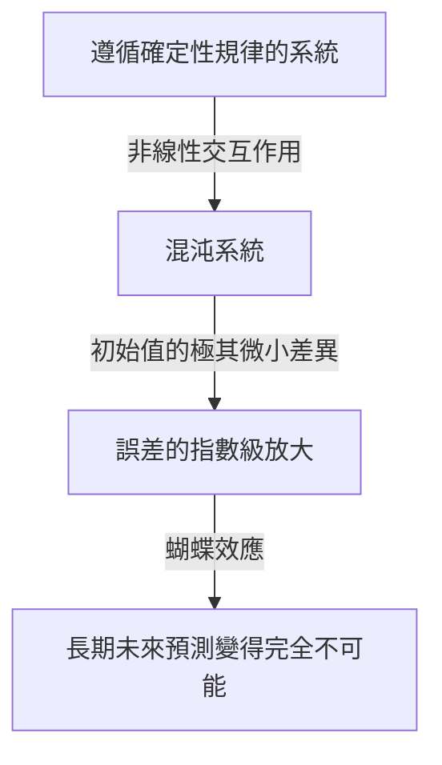
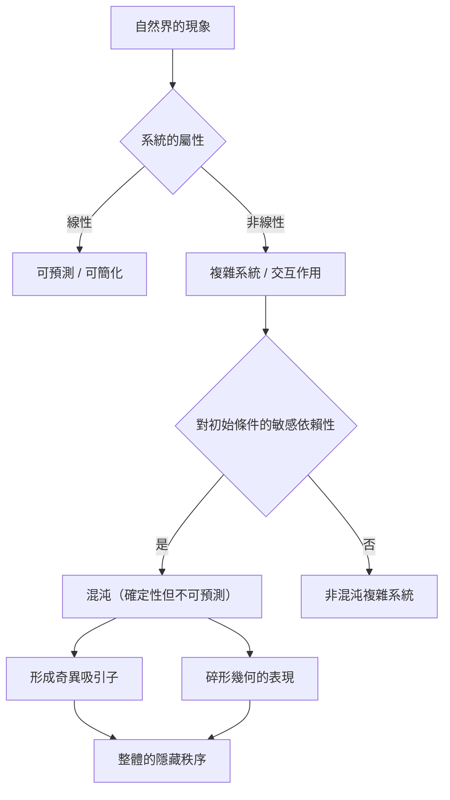

## 1. 引言：什麼是蝴蝶效應？

「巴西一隻蝴蝶拍打翅膀，能在德克薩斯州引起一場龍捲風嗎？」

這個迷人而神秘的疑問象徵著現代科學中最著名同時也最容易被誤解的概念之一—— **蝴蝶效應** (Butterfly Effect)。蝴蝶效應是氣象學、物理學、數學等領域所研究的 **混沌理論** (Chaos Theory) 的核心概念，它指的是「初始條件的微小差異會隨著時間呈指數級放大，最終導致未來狀態發生決定性改變」的現象。

在我們的日常生活中，人們常常直觀地認為因果關係是成正比的。也就是說，微小的改變帶來微小的結果，巨大的改變帶來巨大的結果，這是一種線性的世界觀。然而，與這種直覺相反，自然界中的許多現象表現出極度的非線性。一點微小的波動就可能產生巨大的變化。混沌理論提供了一個數學框架，用於揭示這些看似無序且不可預測的複雜現象背後隱藏的秩序。

在本文中，我們將深入探討混沌理論和蝴蝶效應，從其歷史背景到數學基礎、與碎形幾何的深刻聯繫，以及在現代社會中豐富多樣的應用。讓我們踏上一段旅程，去探索為什麼未來是不可預測的，以及這種不可預測性中隱藏著怎樣的美。

---

## 2. 歷史背景：從龐加萊到洛倫茲

混沌理論的萌芽可以追溯到19世紀末法國偉大數學家[亨利·龐加萊](https://kenji.blog/p/poincare/)（[Henri Poincaré](https://kenji.blog/p/poincare/)）的研究。當時，物理學面臨的最大難題之一是「三體問題」。這個問題旨在基於牛頓力學預測太陽、地球、月球這樣三個相互施加引力的天體的運動。

龐加萊在深入研究這個問題的過程中，發現天體的運動可能會變得極其複雜。他在數學上提出，初始位置或速度上無法測量的微小誤差可能會隨著時間推移而不斷擴大，最終導致天體軌道變得截然不同。這實際上是人類首次發現混沌行為，它表明即使在一個確定性系統（規律完全已知的系統）中，長期的預測有時也會變得不可能。然而，受限於當時的數學方法和計算能力（沒有電腦），這一突破性的發現在隨後的幾十年裡並沒有得到深入的探索。

情況在20世紀60年代發生了戲劇性的轉變。麻省理工學院（MIT）的氣象學家愛德華·洛倫茲（Edward Lorenz）當時正在使用早期的電腦模擬大氣對流。他創建了一組簡單的非線性微分方程來計算溫度、氣壓和風速等變量，並透過電腦進行數值求解。

有一天，洛倫茲試圖從之前一次模擬的中途重新開始計算。他從列印出來的計算結果中重新輸入了數值，但他錯誤地輸入了「0.506」——一個在列印紙上四捨五入到三位小數的數值，而沒有使用電腦內部保存的六位精確度數值「0.506127」。

當洛倫茲喝完咖啡回來時，一幅令人震驚的景象出現在他面前。重新開始的模擬結果在最初的幾步與之前的計算完全一致，但很快就開始描繪出完全不同的氣象模式。僅僅是0.000127這樣極其微小的初始值差異，最終卻導致了完全不同的未來天氣。這正是洛倫茲後來稱之為 **對初始條件的敏感依賴性** (Sensitive dependence on initial conditions)，並在全世界以蝴蝶效應聞名的現象的發現瞬間。

---

## 3. 數學基礎：非線性動力系統與洛倫茲方程

為了從數學上理解混沌理論，我們需要掌握 **動力系統** (Dynamical Systems) 和 **非線性** (Non-linearity) 的概念。

動力系統是描述系統狀態隨時間變化的數學模型。系統的未來狀態完全由其當前狀態以及支配該系統的確定性規律（通常是微分方程或差分方程）所決定。這裡的關鍵在於，規律本身不包含任何機率因素（比如擲骰子那樣的偶然性）。

動力系統大致可分為線性系統和非線性系統。在線性系統中，因果成比例，「部分之和等於整體」的疊加原理成立。這類系統在數學上相對容易求解，預測也很簡單。而在非線性系統中，變量之間會相乘或存在反饋循環，從而打破了因果之間的比例關係。它表現出「部分之和不等於整體」的行為，是引發極其複雜現象的原因。混沌只發生在非線性系統中。

愛德華·洛倫茲從大氣對流模型中推導出來的，能夠產生混沌的最著名的非線性聯立微分方程組就是 **洛倫茲方程** (Lorenz equations)。它由以下三個變量（ $x, y, z$ ）和三個參數（ $\sigma, \rho, \beta$ ）組成。

$$
\frac{dx}{dt} = \sigma (y - x)
$$

$$
\frac{dy}{dt} = x (\rho - z) - y
$$

$$
\frac{dz}{dt} = x y - \beta z
$$

在這裡，每個變量都有其物理意義：
- $x$ 表示對流的強度（流體的旋轉速度）
- $y$ 表示上升氣流與下降氣流之間的水平溫差
- $z$ 表示垂直溫度分布偏離線性的程度
- $\sigma$ （普朗特數）、 $\rho$ （瑞利數）、 $\beta$ （系統的長寬比）為參數。

作為能夠展示典型混沌行為的參數值，洛倫茲選擇了 $\sigma = 10, \rho = 28, \beta = 8/3$ 。雖然這個方程組是確定性的，但其解永遠不會重複過去的狀態，而是不斷描繪出無限複雜的軌跡。方程中的 $xz$ 和 $xy$ 等非線性項在產生混沌中起著決定性的作用。

---

## 4. 相空間與奇異吸引子

用來直觀理解動力系統行為的強大工具是 **相空間** (Phase space)。相空間是一個能夠表示系統所有可能狀態的多維空間。系統的當前狀態被表示為這個相空間中的「一個點」。隨著時間的推移，系統狀態變化的過程就被描繪為該點在相空間中移動所形成的「軌跡」。

在現實世界中許多帶有耗散（會損失能量的屬性，如摩擦或空氣阻力）的系統裡，經過足夠長的時間後，系統最終會穩定在一個特定的狀態（一個點）或週期性的狀態（一個閉環）。這個最終的落腳點被稱為 **吸引子** (Attractor)。例如，由於空氣阻力，鐘擺的運動最終會停在最低點，此時的吸引子就是一個「點（不動點）」。而像心臟跳動那樣重複週期性運動的系統，其吸引子則是一個「極限環（閉合曲線）」。

然而，在洛倫茲方程這樣的混沌系統中，出現了一種完全不同的吸引子。這就是 **奇異吸引子** (Strange Attractor)。

如果在三維相空間中繪製洛倫茲吸引子，會呈現出一個像張開翅膀的蝴蝶，或是兩隻眼睛一般，令人屏息的複雜美麗結構。這個奇異吸引子具有以下驚人的特徵：

1. **有界性** ：軌跡不會飛向無限遠，而是始終停留在吸引子的特定區域內。
2. **非週期性** ：軌跡絕不會與自己過去的軌跡相交，也絕不會完全重複同一條路徑。它永遠在描繪新的路徑。
3. **對初始條件的敏感依賴性** ：在吸引子上極度靠近的兩個初始點出發的軌跡，隨著時間推移，會在吸引子內部被拉扯到完全不同的地方。

儘管軌跡被限制在有限的體積內，但它受到絕不相交的約束（因為一旦相交，就違背了決定論「相同狀態必將導致相同未來」的前提）。為了實現這一點，空間必須被無限地「摺疊」。這種反覆的「拉伸」和「摺疊」過程（就像揉麵團一樣）正是混沌的本質，它造就了奇異吸引子複雜的結構。

---

## 5. 邏輯斯諦映射與分岔圖

為了最簡單地理解混沌理論，另一個重要的數學模型是 **邏輯斯諦映射** (Logistic map)。這是一個模擬生物族群數量波動（例如，某座島上兔子數量每年的變化）的簡單的二次差分方程。

$$
x_{n+1} = r x_n (1 - x_n)
$$

在這裡，
- $x_n$ 代表第 $n$ 代的族群數量（作為一個相對於環境最大承載力的比例，取值範圍為 $0 \le x_n \le 1$ ）。
- $x_{n+1}$ 是下一代的族群數量。
- $r$ 是代表繁殖率的參數（通常 $0 \le r \le 4$ ）。

這個方程雖然極其簡單，但透過改變參數 $r$ 的值，它會展現出驚人的多樣化和複雜的行為：

- $0 < r < 1$ ：族群最終滅絕， $x$ 收斂於0。
- $1 < r < 3$ ：族群數量收斂於某個特定的固定值（不動點）並穩定下來。
- $r = 3$ 附近：不動點變得不穩定，族群數量開始在兩個不同的值之間交替變化。這被稱為 **倍週期分岔** (Period-doubling bifurcation)。
- 隨著 $r$ 進一步增加，週期會迅速倍增為4、8、16等分岔現象。
- 當超過 $r \approx 3.56995$ （費根鮑姆常數點）時，週期性完全崩潰，族群數量將呈現完全不可預測的值。這就是 **混沌** 狀態。

將系統針對 $r$ 變化的最終狀態（吸引子）繪製成圖表，就得到了所謂的 **分岔圖** (Bifurcation diagram)。橫軸表示參數 $r$ ，縱軸表示 $x$ 的最終值。

觀察分岔圖，我們可以看到在混沌區域中，存在著突然恢復秩序的被稱為「窗口（Window）」的區域（例如週期3的區域）。令人驚嘆的是，如果你不斷放大這個分岔圖的某個局部，它會展現出與整體結構完全相同模式無限重複的自相似性。一個簡單的二次方程竟然內含如此豐富的結構，這一事實給數學界帶來了極大的震撼。

---

## 6. 李雅普諾夫指數：混沌的量化

用來在數學上嚴格量化混沌系統所具有的「對初始條件敏感依賴性」的指標是 **李雅普諾夫指數** (Lyapunov Exponent)。

考慮在相空間中極度靠近的兩個初始狀態（它們之間的距離記為 $\delta Z_0$ ），觀察從它們出發的軌跡隨著時間 $t$ 的推移，分離到距離 $\delta Z(t)$ 的過程。在混沌系統的情況下，這個距離平均呈指數級放大。

$$
|\delta Z(t)| \approx e^{\lambda t} |\delta Z_0|
$$

在這裡， $\lambda$ （lambda）就是李雅普諾夫指數。
李雅普諾夫指數表示相鄰軌跡分離（或相互靠近）的平均速率。

- $\lambda < 0$ ：軌跡相互靠近，收斂於不動點或極限環（不是混沌）。
- $\lambda = 0$ ：軌跡之間的距離保持不變（如保守系統）。
- $\lambda > 0$ ：軌跡呈指數級分離。這是 **混沌** 的決定性指標。

在多維動力系統中，存在與空間維度相同數量的李雅普諾夫指數（李雅普諾夫譜）。如果存在至少一個正的李雅普諾夫指數，那麼該系統就被定義為混沌的。正的李雅普諾夫指數越大，最初的微小誤差放大的速度就越快，能夠預測未來的時間尺度（李雅普諾夫時間）就越短。這就是為什麼天氣預報在幾天內比較準確，但在幾週之後就變得完全不可預測的根本數學原因。

---

## 7. 碎形與混沌的關係

在探討混沌理論時，不可或缺的是數學家本華·曼德博（Benoit Mandelbrot）提出的 **碎形** (Fractal) 幾何學。碎形是指「無論放大多少倍，始終無限出現與整體相似的複雜結構（自相似性）的圖形」。代表性的例子包括曼德博集合和科赫曲線等。

混沌和碎形乍看之下似乎是不同的概念，但它們實際上是一體兩面的關係。如果你切下奇異吸引子的橫截面並仔細觀察，你會發現那裡呈現出無限重疊的層狀結構，從而證明它具有碎形結構。

混沌系統相空間中「拉伸與摺疊」的動力學過程，在幾何上的結果就是產生了碎形圖形。碎形的一個重要特徵是它擁有非整數的「分數維（碎形維數）」。例如，一個比一維線更複雜、更能填滿空間，但又達不到二維平面的圖形，其維度可能是1.26維。奇異吸引子同樣也是一個具有分數維的碎形結構體。

如果說混沌是「隨著時間推移展現出來的複雜動力學」，那麼碎形就可以被視為「這種動力學在空間中刻下的幾何足跡」。自然界中海岸線的形狀、樹木的枝枒、血管網絡、雲朵的形狀等，許多自然現象都具有碎形結構，人們認為在它們形成過程的背後，正起作用的是混沌非線性動力學。

---

## 8. 現實世界的應用：從氣象學到經濟學

混沌理論絕不僅僅是數學上的遊戲。對初始條件的敏感依賴性和非線性動力學這些普遍屬性，已經跨越了物理學的邊界，在現實世界的各個領域產生了廣泛的應用。

### 8.1 氣象學與氣候變化
作為洛倫茲發現混沌的舞台，氣象學是受混沌理論恩惠最多的領域之一。大氣受到流體力學和熱力學複雜的非線性方程所支配，其本質就是混沌的。目前，主流的方法不再是單一預測，而是「系集預報」——即故意在初始值中引入微小擾動，同時運行多個模擬。透過這種方法，氣象學家可以機率性地評估預測的不確定性，並掌握究竟多長時間內的預測是可靠的。

### 8.2 醫學與生物學
人類的生物節律也與混沌有著深厚的聯繫。例如，我們知道健康心臟的心跳間隔（波動）既不是完全規律的，也不是完全隨機的，而是具有混沌的碎形特性。相反，心臟病患者或老年人的心跳可能會變得過於規律或完全隨機，因此混沌波動的喪失正被作為表明健康狀況惡化的重要標誌（生物標記）進行研究。此外，在腦電波的分析以及傳染病流行的建模（如流行病學中的SIR模型）中，非線性動力學也是必不可少的。

### 8.3 經濟學與金融市場
股票市場和外匯市場等金融市場是無數投資者的心理和行為相互作用的極其複雜的非線性系統。傳統的經濟學假設市場是有效的，價格遵循[隨機漫步](https://kenji.blog/p/random-walk/)（服從常態分布的隨機運動）。然而，在實際市場中，像暴跌或泡沫這樣極端事件的發生頻率遠遠高於常態分布的預測（肥尾現象）。透過應用混沌理論和碎形（如曼德博提出的多重碎形模型），人們正在嘗試更準確地對市場價格波動中隱藏的非線性結構、長期記憶性以及泡沫破裂的風險進行建模，並將其應用於風險管理。

### 8.4 工程與控制
在工程領域，混沌的概念同樣重要。在飛機機翼的振動（顫振現象）、電路中非線性振盪器的同步、雷射輸出的紊亂等許多系統中都可以觀察到混沌現象。過去，因為混沌是不可預測的且會使系統變得不穩定，人們一直認為它是「應該避免的」或「需要排除的噪音」。但如今，被稱為「混沌控制（Chaos Control）」的技術得到了發展，利用系統本身帶有的微小能量，巧妙地引導系統從混沌狀態過渡到期望的週期性狀態並使其穩定。此外，利用混沌信號隨機性進行加密通信（混沌密碼）的應用也在研究之中。

---

## 9. 哲學啟示：決定論與可預測性

混沌理論的出現，給科學哲學，尤其是關於「決定論（Determinism）」和「可預測性（Predictability）」的世界觀帶來了根本性的典範轉移。

18世紀的法國數學家皮埃爾-西蒙·拉普拉斯提出了這樣一個思想實驗：「如果存在某種智慧，能夠完全掌握宇宙中所有原子此刻的位置和動量，並且具有足夠龐大的計算能力去分析它們，那麼對於這種智慧來說，未來就像過去一樣，將清晰地呈現在它的眼前。」這種假想的智慧被稱為 **拉普拉斯妖** (Laplace's demon)，它象徵著基於古典力學的強烈的決定論宇宙觀。

決定論的觀點認為，「如果當前狀態完全確定，那麼未來將根據物理定律被唯一地決定」。混沌理論所處理的方程（如洛倫茲方程）是不包含任何機率因素的純粹的決定性方程。因此，從原理上講，如果是拉普拉斯妖，也應該能夠完美地預測混沌系統的未來。

然而，混沌理論冷酷地向我們指出了在現實世界中 **可預測性的極限** 。在現實世界中，要以「無限的精度（零誤差）」來測量宇宙的所有初始狀態是不可能的。即便不考慮量子力學的不確定性原理，我們的觀測能力也必然有其有限的極限。

在混沌系統中，無論這個觀測誤差多麼微小，它都會隨著時間的推移呈指數級放大，並最終吞噬整個系統。換句話說，「決定論」和「可預測」被證明是完全不同的概念。混沌理論終結了拉普拉斯妖，並教導了人類一個深奧的真理：「即使規律完全已知，未來本質上仍然可能是不可預測的。」

這種典範轉移提出了一種新的世界觀：「我們的世界是複雜且不可預測的，但在其背後潛藏著美麗的確定性數學結構。」人們不再追求完美的預測，而是透過研究吸引子的形狀和理解機率分布，開闢出了一條理解隱藏在混沌之中的「巨觀秩序」的道路。

---

## 10. 結論

在本文中，我們深入探討了微小的初始條件差異帶來巨大結果的蝴蝶效應，以及包含這一效應的混沌理論。

從龐加萊的直覺開始，經過洛倫茲藉助電腦的偶然發現，混沌理論已經成長為一個橫跨數學和物理學的龐大領域。非線性方程描繪出的奇異吸引子美麗的軌跡、邏輯斯諦映射中展現出的無限自相似性，以及透過李雅普諾夫指數對不可預測性進行的量化，其數學基礎非常精緻，充滿了智慧的驚奇。

混沌理論不僅告訴我們天氣預報的極限，還為我們提供了一個強大的視角，去理解圍繞在我們身邊的複雜現象——從經濟的波動、心臟的跳動，到生命的進化。它向我們揭示了自然界絕不是一台簡單的鐘錶般的機器，而是一個充滿了不可預測性和創造力的動態系統。

既是確定性的，又是不可預測的。這種看似矛盾的性質，正是混沌理論最大的魅力所在。未來已經完全注定，卻沒有任何人（無論電腦多麼強大）能夠知曉其詳細的未來，這一事實讓我們對宇宙的認知變得更加謙卑和豐富。由混沌和碎形交織而成的非線性世界，在未來也必定會繼續讓科學家們著迷，並不斷帶來新的發現。

