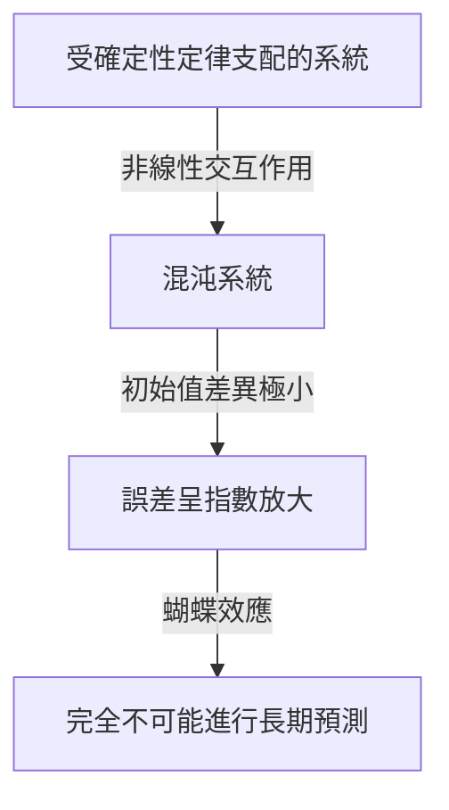
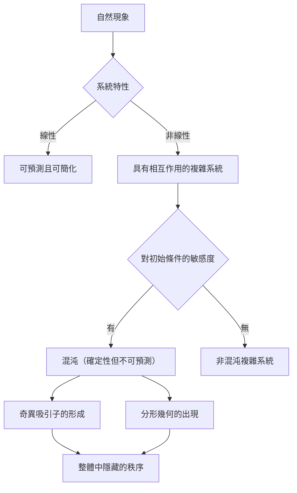

## 1. 簡介：什麼是蝴蝶效應？

“巴西蝴蝶扇動翅膀是否會在德克薩斯州引發龍捲風？”

這個迷人而神秘的問題象徵著現代科學最著名且最容易被誤解的概念之一：**蝴蝶效應**。蝴蝶效應是**混沌理論**的核心概念，混沌理論是氣象、物理、數學等領域的研究領域。它指的是「初始條件的微小差異隨著時間的推移呈指數級放大，最終在未來狀態中產生決定性差異」的現象。

在我們的日常生活中，我們傾向於直觀地假設因果關係之間存在比例關係——一種線性世界觀，其中小變化產生小結果，大變化產生大結果。然而，自然界中的許多現像都以高度非線性的方式表現，違背了這種直覺。微小的波動可以產生巨大的變化。混沌理論提供了數學框架，用於揭示隱藏在這些看似無序且不可預測的複雜現象背後的隱藏秩序。

在本文中，我們將深入探討混沌理論和蝴蝶效應——從它們的歷史背景和數學基礎，到它們與分形幾何的深厚聯繫，再到它們在現代社會的廣泛應用。讓我們踏上一段旅程，去發現為什麼未來是不可預測的，以及在不可預測的背後隱藏著什麼美麗。

---

## 2. 歷史背景：從龐加萊到洛倫茲

混沌理論的萌芽可以追溯到19世紀末法國偉大數學家亨利·龐加萊的研究。當時，物理學最大的挑戰之一是「三體問題」——根據牛頓力學預測太陽、地球和月球等三個相互引力的天體的運動。

在深入研究這個問題時，龐加萊發現天體的運動可能變得異常複雜。他從數學上提出了一種可能性，即初始位置或速度中不可估量的小誤差可能會隨著時間的推移而放大，最終使最終軌道完全不同。實際上，這是對混沌行為的首次發現，即即使是確定性系統（其定律完全已知的系統）從長遠來看也可能變得無法預測。然而，由於當時數學方法和計算能力（沒有計算機）的限制，這項突破性的發現在幾十年內基本上未被探索。

到了 20 世紀 60 年代，情況發生了巨大變化。麻省理工學院 (MIT) 的氣象學家愛德華·洛倫茨 (Edward Lorenz) 正在使用早期電腦模擬大氣對流。他創建了一組簡單的非線性微分方程式來計算溫度、壓力和風速等變量，並在機器上運行計算。

有一天，洛倫茲試著從中間點重新開始模擬。他重新輸入了列印輸出中的值，但他沒有使用電腦內部儲存的 6 位元精度值“0.506127”，而是輸入了“0.506”——列印在輸出上的 3 位元舍入值。

當洛倫茲喝完咖啡休息回來時，令人驚訝的景像等待著他。重新啟動的模擬與前幾個步驟的結果相匹配，但很快就開始追蹤完全不同的天氣模式。僅 0.000127 的微小初始值差異就產生了完全不同的天氣未來。洛倫茲後來將這種現象稱為“對初始條件的敏感性”，也就是在此時發現的，這種現象後來被全世界稱為“蝴蝶效應”。

---

## 3. 數學基礎：非線性動力系統與洛倫茲方程

要從數學上理解混沌理論，必須掌握**動態系統**和**非線性**的概念。

動態系統是狀態隨時間變化的系統的數學模型。系統的未來狀態完全由其當前狀態和控制它的確定性定律（通常是微分方程或差分方程）決定。至關重要的是，這些法則本身不包含機率元素——不存在像擲骰子那樣的隨機性。

動力系統大致分為線性系統和非線性系統。在線性系統中，因果是成正比的，疊加原理成立：「部分總和等於整體」。這些相對容易用數學方法解決和預測。然而，在非線性系統中，變數相乘或存在回饋迴路，破壞了因果之間的比例關係。它們表現出「部分之和與整體不同」的行為，從而產生極其複雜的現象。混沌僅發生在非線性系統。

最著名的一組產生混沌的非線性耦合微分方程式是愛德華·洛倫茲 (Edward Lorenz) 根據大氣對流模型導出的，即**洛倫茲方程式**。它們由三個變數 ( $x, y, z$ ) 和三個參數 ( $\sigma, \rho, \beta$ ) 組成：

$$
\frac{dx}{dt} = \sigma (y - x)
$$

$$
\frac{dy}{dt} = x (\rho - z) - y
$$

$$
\frac{dz}{dt} = x y - \beta z
$$

這裡，每個變數都有一個物理意義：
- $x$ 表示對流強度（流體的轉速）
- $y$表示上升流和下降流的溫差
- $z$表示垂直溫度分佈與線性的偏差
- $\sigma$（普朗特數）、$\rho$（瑞利數）和$\beta$（系統的縱橫比）是參數。

對於表現出典型混沌行為的參數值，Lorenz 選擇了 $\sigma = 10, \rho = 28, \beta = 8/3$。儘管這個方程組是確定性的，但解永遠不會重複過去的狀態，而是追蹤無限複雜的軌跡。方程式中的非線性項$xz$和$xy$對混沌的產生起決定性作用。

---

## 4.相空間和奇異吸引子

**相空間**是直觀地理解動力系統行為的強大工具。相空間是一個多維空間，能夠表示系統的每個可想的狀態。系統的目前狀態表示為該相空間中的「單點」。隨著時間的推移和系統狀態的變化，點在相空間中的運動會描繪出一條「軌跡」。

在許多具有耗散的現實系統中（導致能量損失的屬性，例如摩擦或空氣阻力），經過足夠的時間後，系統最終會進入特定狀態（一個點）或週期性狀態（閉環）。這個最終目的地稱為**吸引子**（吸引事物的東西）。例如，由於空氣阻力，鐘擺的運動最終會停在最低點；在這種情況下，吸引子是「單點（固定點）」。對於重複週期性運動（例如心跳）的系統，吸引子是「極限環（閉合曲線）」。

然而，在像洛倫茲方程式這樣的混沌系統中，會出現一種完全不同類型的吸引子——**奇異吸引子**。

當洛倫茲吸引子被繪製在三維相空間中時，一個令人驚嘆的美麗和複雜的結構出現了，就像一隻展開翅膀的蝴蝶或一雙眼睛。這個奇異吸引子具有以下顯著的特性：

1. **有界性**：軌跡永遠不會飛向無窮遠；它總是保持在吸引子的特定區域內。
2. **非週期性**：軌跡永遠不會與自己過去的路徑交叉或重複完全相同的路線。它永遠追尋一條新的道路。
3. **對初始條件的敏感度**：從吸引子上極其接近的初始點開始的兩條軌跡隨著時間的推移被拉開到吸引子內完全不同的位置。

儘管被限制在有限的體積內，但軌跡永遠不會與自身交叉（交叉將違反「相同的狀態導致相同的未來」的確定性前提）。為了滿足這個約束，空間必須被無限地「折疊」。這種「拉伸和折疊」的重複過程（很像揉麵包麵團）是混沌的本質，它產生了奇異吸引子的複雜結構。

---

## 5.邏輯斯蒂映射和分叉圖

以最簡單的形式來理解混沌理論的另一個重要數學模型是**邏輯斯蒂映射**。它是一個簡單的二次差分方程，用於模擬族群動態（例如，島上兔子數量的年度變化）。

$$
x_{n+1} = r x_n (1 - x_n)
$$

這裡：
- $x_n$代表$n$代的人口（佔環境最大承載量的比例，範圍從$0 \le x_n \le 1$）。
- $x_{n+1}$ 是下一代的人口。
- $r$是表示再現率的參數（通常為$0 \le r \le 4$）。

這個方程式非常簡單，但透過改變參數 $r$，它表現出驚人的多樣化和複雜的行為。

- $0 < r < 1$：族群最終滅絕，$x$收斂於0。
- $1 < r < 3$：族群收斂到固定值（不動點）並趨於穩定。
- 在 $r = 3$ 附近：固定點變得不穩定，整體開始在兩個不同值之間交替。這稱為**倍週期分岔**。
- 隨著 $r$ 進一步增加，分岔迅速發生，週期加倍至 4、8、16 等。
- 超過 $r \approx 3.56995$（費根鮑姆點），週期性完全崩潰，整體呈現完全不可預測的值。這是**混沌**的狀態。

根據 $r$ 的變化繪製系統最終狀態（吸引子）的圖稱為 **分岔圖**。橫軸代表參數$r$，縱軸代表$x$的最終值。

檢查分叉圖可以發現「視窗」－混沌域內秩序突然恢復的區域（例如，週期為 3 的區域）。值得注意的是，放大分叉圖的某些部分會發現無限出現的相同整體模式—自相似性。一個簡單的二次方程式包含如此豐富的結構，這一事實在數學界引起了軒然大波。

---

## 6. 李雅普諾夫指數：量化混沌

嚴格和數學地量化混沌系統「對初始條件的敏感性」的度量是**李雅普諾夫指數**。

考慮相空間中從極其接近的初始狀態出發的兩條軌跡，初始距離為 $\delta Z_0$。經過時間 $t$ 後，它們之間的距離變為 $\delta Z(t)$。在混沌系統中，這個距離平均呈指數增長。

$$
|\delta Z(t)| \approx e^{\lambda t} |\delta Z_0|
$$

這裡，$\lambda$ (lambda) 是李雅普諾夫指數。
李雅普諾夫指數表示相鄰軌跡發散（或收斂）的平均速率。

- $\lambda < 0$：軌跡相互收斂，趨於固定點或極限環（非混沌）。
- $\lambda = 0$：軌跡之間的距離保持恆定（例如，保守系統）。
- $\lambda > 0$：軌跡呈指數級分散。這是**混沌的最終指標**。

在多維動力系統中，有多少維度就有多少個李雅普諾夫指數（李雅普諾夫譜）。如果至少存在一個正李雅普諾夫指數，則系統被定義為混沌系統。正李雅普諾夫指數越大，初始微小誤差放大得越快，從而縮短可預測的時間尺度（李雅普諾夫時間）。這就是為什麼天氣預報在幾天後相當準確，但在未來幾週卻變得完全不可預測的根本數學原因。

---

## 7. 分形與混沌的關係

對於混沌理論的任何討論都不可或缺的是數學家伯努瓦·曼德爾布羅特提出的**分形**幾何。分形是「一種形狀，無論放大多遠，都會無限地出現相同的複雜結構（自相似性）」。代表性的例子包括曼德布羅特集和科赫曲線。

混沌和分形乍看之下似乎是不同的概念，但實際上它們是同一枚硬幣的兩面。當你切開一個奇異吸引子的橫截面並仔細檢查它時，就會出現一個無限分層的結構，揭示分形幾何。

混沌系統相空間中的「拉伸和折疊」動力學產生分形形狀作為幾何結果。分形的一個重要屬性是它們具有非整數的「分數維數（分形維數）」。例如，比填滿空間但未達到二維平面的一維線更複雜的形狀的尺寸可能為 1.26。奇異吸引子也是具有分數維度的分形結構。

如果混沌是“隨著時間的推移而出現的複雜動態”，那麼分形就是“這些動態蝕刻到空間中的幾何足跡”。許多自然現象——裡亞海岸線、樹枝、血管網絡、雲形狀——都表現出分形結構，人們相信混沌非線性動力學是它們形成的基礎。

---

## 8. 現實世界的應用：從天氣到經濟

混沌理論不僅僅是一種數學好奇心。對初始條件和非線性動力學敏感的普遍特性已經在各個領域帶來了廣泛的應用，遠遠超出了物理學的範疇。

### 8.1 氣象與氣候變化
氣象學是洛倫茲發現的舞台，也是從混沌理論中受益最多的領域之一。大氣受流體動力學和熱力學的複雜非線性方程式控制，本質上是混沌的。如今，主流方法不再是單一預測，而是「集合預測」——同時運行多個模擬，並有意對初始值進行小擾動。這允許對預測不確定性進行機率評估，並了解未來可靠預測的可能性。

### 8.2 醫學和生物學
人類的生物節律也與混沌密切相關。例如，健康心臟的心率變異性既不是完全規則的，也不是完全隨機的；它表現出混沌分形特徵。心臟病患者和老年人的心跳可能變得過於規律或完全隨機。混沌變異性的喪失正在被研究為健康狀況惡化的一個重要標誌（生物標記）。非線性動力學對於分析腦電波和建模傳染病的傳播也至關重要（例如流行病學中的 SIR 模型）。

### 8.3 經濟和金融市場
股票和貨幣交易市場等金融市場是極其複雜的非線性系統，無數投資者的心理和行為相互作用。傳統經濟學假設市場是有效的，價格遵循隨機遊走（常態分佈的隨機運動），但實際上，崩盤和泡沫等極端事件的發生頻率遠高於常態分佈預測的頻率（厚尾現象）。透過應用混沌理論和分形（例如Mandelbrot提出的多重分形模型），研究人員正在嘗試更準確地對隱藏在價格波動、長期記憶效應和泡沫破裂風險中的非線性結構進行建模，以改善風險管理。

### 8.4 工程與控制
混沌也是工程學中的重要概念。在許多系統中都可以觀察到混沌現象：飛機機翼的振動（顫振）、電路中非線性振盪器的同步、雷射輸出的干擾等等。傳統上，混沌被視為需要避免的事情——不可預測的噪音會破壞系統的穩定性。然而，如今，被稱為「混沌控制」的技術已經開發出來，它僅使用少量能量就可以巧妙地將系統從混沌狀態引導到理想的週期狀態，從而使其穩定。將混沌訊號的偽隨機特性應用於加密通訊（基於混沌的密碼學）的研究也在進行中。

---

## 9. 哲學意義：決定論與可預測性

混沌理論的出現為科學哲學帶來了根本性的典範轉移——特別是關於我們關於「決定論」和「可預測性」的世界觀。

18世紀的法國數學家皮埃爾-西蒙·拉普拉斯提出了如下思想實驗：「如果一個智能體能夠知道宇宙中每個原子的準確位置和動量，並有能力分析它們，那麼對它而言，未來和過去都不存在不確定性——整個時間線將像現在一樣清晰。」這個假設的智能體被稱為**拉普拉斯妖**，象徵著建立在經典力學基礎上的堅定的決定論世界觀。

決定論認為「如果當前狀態完全確定，那麼未來就由物理定律唯一決定」。混沌理論處理的方程（例如洛倫茲方程）是純粹的確定性方程，不包含任何機率元素。因此，原則上，拉普拉斯惡魔應該能夠完美地預測混沌系統的未來。

然而，混沌理論無情地暴露了現實世界中**可預測性的局限性**。事實上，不可能以「無限精度（零誤差）」來測量宇宙的每一個初始狀態。即使拋開量子力學的不確定性原理，我們的觀測能力總是有限的。

在混沌系統中，無論觀測誤差有多小，它都會隨著時間的推移呈指數級放大，最終吞噬整個系統。換句話說，很明顯「確定性」和「可預測性」是完全不同的概念。混沌理論安息了拉普拉斯惡魔，並教導人類「即使完全了解規律，未來也可能是不可預測的」這一深刻真理。

這種範式轉變提出了一種新的世界觀：「我們的世界是複雜且不可預測的，但背後隱藏著美麗的確定性數學結構。」透過放棄完美預測，轉而檢視吸引子的形狀或理解機率分佈，開闢了一條理解隱藏在混沌中的「大規模秩序」的道路。

---

## 10. 結論

在本文中，我們深入研究了蝴蝶效應（初始條件的微小差異會導致截然不同的結果）以及包含它的混沌理論。

從龐加萊的直覺，到洛倫茲基於電腦的偶然發現，混沌理論已經發展成為一個跨越數學和物理學的廣泛領域。由非線性方程式追蹤的奇異吸引子的美麗軌跡，邏輯斯蒂映射中發現的無限自相似性，以及透過李雅普諾夫指數對不可預測性的量化——其數學基礎異常精緻，充滿了智力奇蹟。

混沌理論為理解我們周圍的複雜現象提供了一個強大的視角——從天氣預報的限製到經濟波動、心跳，甚至生命的進化。它告訴我們，自然世界絕對不是一個簡單的發條機器，而是一個充滿不可預測性和創造力的動態系統。

確定性但卻不可預測──這種看似矛盾的特性是混沌理論的最大吸引力。未來是完全確定的，但任何人（即使是最強大的電腦）都不可知，這一事實使我們對宇宙的理解更加謙虛和豐富。由混沌和分形編織而成的非線性世界將在未來幾年繼續吸引科學家並激發新的發現。

