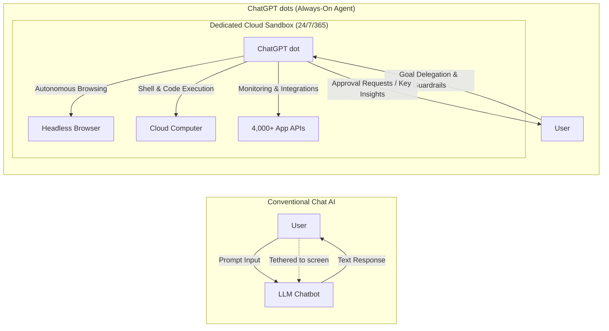
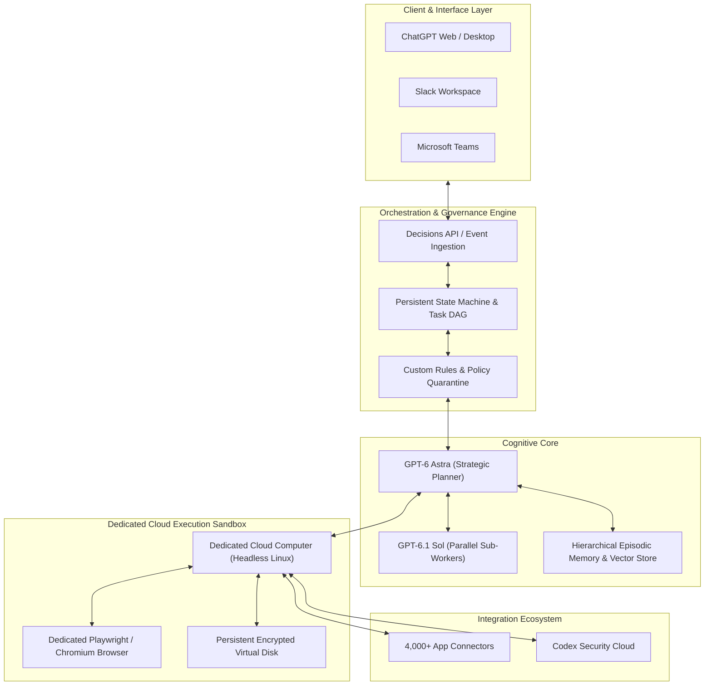
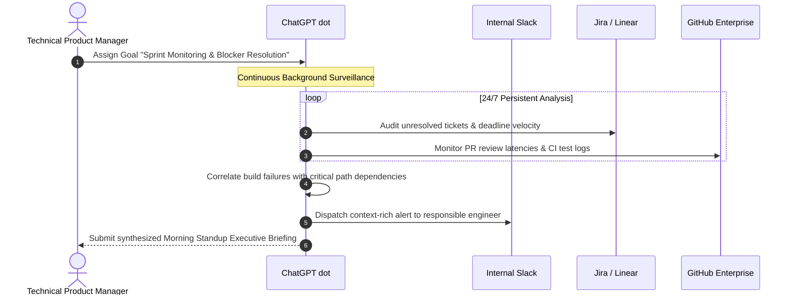
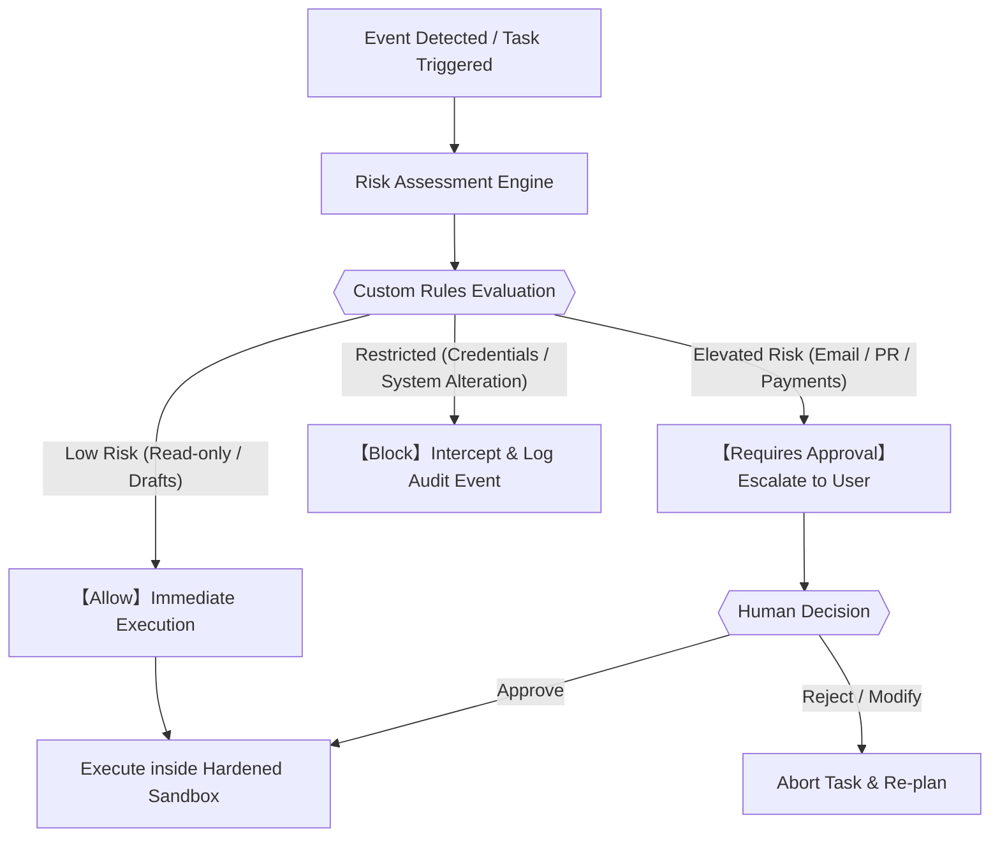

## Introduction: From Conversational Tools to Autonomous Coworkers

On September 29, 2026, at OpenAI DevDay in San Francisco, OpenAI unveiled a monumental leap in the evolution of artificial intelligence: **ChatGPT dots (OpenAI dots)**.

Since the launch of ChatGPT in late 2022, generative AI has been predominantly mediated through a conversational chat interface. While prompt-response dialogues revolutionized individual productivity, they remained fundamentally tethered to human presence: a user had to frame a prompt, wait for output, and keep the browser tab alive. The moment the user disconnected or turned off their device, the AI ceased to think.

ChatGPT dots systematically dismantles this paradigm. Dots are not conversational chatbots; they are **always-on, autonomous AI agents** engineered to function as persistent personal coworkers. Even when you are offline, asleep, or in back-to-back meetings, your designated dot operates continuously inside its own cloud-hosted virtual environment, navigating web applications, executing code, and driving assigned business goals to completion.

This treatise provides an exhaustive exploration of ChatGPT dots—spanning its foundational model GPT-6 Astra, dedicated cloud sandboxes, multi-platform orchestration across Slack and Microsoft Teams, pricing and unit economics, enterprise workflows, and Human-in-the-Loop governance.

---

## 1. The Architectural Paradigm Shift: From Chat to Always-On Persistence

### 1.1 The Three Structural Limits of Conversational AI

While conversational AI democratized large language models (LLMs), enterprise adoption revealed three fundamental bottlenecks:

1. **Passivity (Prompt Dependency)**:
   Traditional chat interfaces are strictly reactive. If a human does not formulate an input prompt, the model consumes zero compute. In modern business, however, the primary challenge is identifying what needs to be asked amid dynamic operational shifts.
2. **Context Volatility Across Sessions**:
   Once a chat session closes or exceeds context compaction limits, historical nuance, intermediate hypotheses, and multi-week project progress evaporate. Long-term memory implementations mitigated this, but could not retain active, evolving operational state.
3. **Temporal Binding to Human Attention**:
   Execution time was directly bound to human cognitive time. Conducting extensive market surveys across hundreds of regulatory filings required constant user oversight, iterative prompting, and active tab management.

### 1.2 The Personal Coworker: Goal-Driven Delegation

The defining philosophy of dots is the transition from **micro-prompting to goal delegation**. When delegating to an experienced colleague, one does not dictate every keystroke. Instead, one specifies the high-level objective, boundary constraints, and escalation triggers.

Dots mirrors this dynamic. By defining an overarching goal—such as "continuously monitor competitor product releases, synthesize pricing shifts, and deliver executive briefings every Monday"—the agent autonomously decomposes the mission into directed acyclic graphs (DAGs), schedules background polling, executes synthetic tests, and escalates only when strategic decisions are required.

### 1.3 Historical Analogy: Continuous Motive Power in Knowledge Work

In the First Industrial Revolution, the decisive economic inflection point was not merely mechanical power, but **continuous operation**. Steam engines operated day and night, independent of muscle fatigue or weather. 

Dots introduces continuous motive power to cognitive labor. When specialized digital intelligence runs persistently in the background, knowledge workflows transition from batch-processed human tasks to uninterrupted, autonomous pipelines.

---

## 2. Fundamentals of ChatGPT dots: An Operational Overview

### 2.1 The Concept Behind the "Dot"

The name "dots" embodies OpenAI's systems philosophy. Modern knowledge workers are submerged under disconnected data points—unread Slack threads, Jira tickets, GitHub Pull Requests, Notion documentation, and live market feeds. A "dot" acts as an active nexus, connecting these isolated points into coherent, actionable constellations.

Unlike Custom GPTs—which are customized prompt templates running transiently inside chat sessions—each dot represents a **persistent, stateful cloud instance** equipped with dedicated compute, storage, and an independent operational identity.

### 2.2 Structural Comparison: ChatGPT Plus vs. ChatGPT dots

| Feature Dimension | Traditional ChatGPT (Plus / GPTs) | ChatGPT dots (OpenAI dots) |
| :--- | :--- | :--- |
| **Execution Model** | Reactive (per-turn session) | **Always-On Autonomous Persistence** |
| **Operational Unit** | Prompt / Turn | **Goal / Mission Objective** |
| **Runtime Environment**| Ephemeral shared container | **Dedicated Cloud PC & Browser Sandbox** |
| **External Interaction**| Synchronous on user prompt | **Autonomous Polling & Webhook Event-Driven** |
| **Workplace Interfaces**| ChatGPT Web / App | **Seamless Slack, Teams, and ChatGPT Sync** |
| **Memory Persistence**| Conversation context window | **Hierarchical Episodic Graph & Long-Term State** |
| **Human Supervision** | Continuous co-presence | **Human-in-the-Loop (Exception Escalation)** |

### 2.3 DevDay 2026 Ecosystem Synergy

Dots does not exist in a vacuum. At DevDay 2026, OpenAI unveiled an integrated suite of agentic technologies designed to work symbiotically:
- **GPT-6.1 Sol**: A high-efficiency, cost-optimized reasoning and coding model that handles delegated subroutines spawned by dots.
- **ChatGPT Space**: A shared real-time canvas where humans and multiple autonomous dots collaborate on codebases, data models, and documentation.
- **Agents API**: The developer-facing infrastructure that exposes computer use, browser automation, and stateful sandboxes to external applications.
- **Decisions API**: An ultra-low-latency classification engine that filters streaming events, enabling dots to evaluate thousands of incoming signals per second without saturating reasoning compute.

---

## 3. System Architecture and Technical Deep Dive

The architectural topology of ChatGPT dots represents an intricate distributed system orchestrating frontier reasoning, sandboxed execution, and multi-tenant security.

### 3.1 The Cognitive Core: GPT-6 Astra

The primary reasoning engine driving dots is **GPT-6 Astra**. Engineered specifically for agentic autonomy, Astra exhibits three critical breakthroughs:
1. **Long-Horizon Task Decomposition**: Astra structures multi-week business objectives into hierarchical directed graphs, managing state transitions, dependency chains, and failure fallbacks without goal drift.
2. **Autonomous Reflection and Dynamic Recovery**: When a script encounters an unexpected schema or a web page fails to load, Astra analyzes the execution trace, isolates the anomaly, and synthesizes alternative retrieval strategies autonomously.
3. **High-Fidelity Visual DOM Parsing**: Astra couples structural DOM inspection with vision-based screenshot processing, allowing it to navigate complex canvas elements, dynamic SPAs, and non-standard web UIs.

### 3.2 The Dedicated Cloud Computer & Headless Browser

The defining physical innovation of dots is that **every active agent is assigned its own dedicated, persistent Linux sandbox and Chromium browser**.
- **Isolated Compute**: Scripts execute inside a hardened container equipped with Python, Node.js, CLI utilities, and secure persistent disk storage.
- **Stateful Browsing**: Authentication tokens, session cookies, and navigation cache remain persistent within the agent's environment, allowing it to maintain authenticated sessions across enterprise portals.

### 3.3 Proactive Research Mechanics

Dots does not remain dormant between scheduled tasks. Through **Proactive Research**, agents execute continuous environmental scans:
- **Dual-Mode Sensing**: Combining periodic API polling with real-time webhook listeners, the agent monitors external shifts without lagging behind critical events.
- **Semantic Noise Pruning**: Leveraging the Decisions API, raw data streams are filtered against the user's defined priorities, discarding superficial revisions and distilling only high-conviction signals.

### 3.4 Cross-Platform Unified Context

A dot lives simultaneously inside ChatGPT, Slack, and Microsoft Teams. It functions as an active participant in team channels:
- A user can delegate an engineering triage mission via Slack, review intermediate data plots on the ChatGPT mobile app during a commute, and approve a production pull request from the desktop portal.

---

## 4. Pricing, Tier Availability, and Deployment Economics

### 4.1 Plan Availability Matrix

Because dots requires dedicated, persistent virtual infrastructure and sustained compute, access is restricted to professional and enterprise tiers.

| Subscription Tier | Monthly Pricing | Dots Availability | Included Units | Resource Limits & Privileges |
| :--- | :--- | :---: | :---: | :--- |
| **Free Tier** | $0 | No | 0 | Ineligible |
| **ChatGPT Plus** | $20 / month | No | 0 | Restricted to standard conversational chat and Custom GPTs |
| **ChatGPT Pro** | $100 – $500 / month | **Full Access** | 1 Dedicated Dot | Full GPT-6 Astra reasoning, dedicated sandbox, proactive research |
| **Business Premium** | Enterprise Quote | **Full Access** | Tier-Dependent | Shared team dots, admin console, workspace governance |
| **Enterprise** | Custom SLA | **Beta Access** | Admin Provisioned | Private tenant isolation, ZDR, SLA guarantees, audit trails |

### 4.2 Economic Analysis: Why Dots Is Not Offered on Plus ($20/month)

The exclusion of dots from the standard $20/month Plus plan is an inevitable consequence of unit economics:
1. **Infrastructure Baseline**: Provisioning a dedicated cloud container with persistent SSD storage and headless browser capability incurs continuous infrastructure costs.
2. **Autonomous Token Velocity**: A single background Proactive Research cycle can consume hundreds of thousands to millions of tokens as Astra browses documentation, parses tables, and verifies code.
3. At $20/month, heavy autonomous usage would generate severe negative gross margins. The $100–$500/month Pro tier provides the necessary economic headroom for sustained agentic compute.

### 4.3 Launch Incentives and Scaling Trajectory

To accelerate professional onboarding, OpenAI introduced strategic launch provisions:
- **First Dot Included**: Eligible Pro and Business Premium accounts receive their initial agent without supplementary seat surcharges.
- **Grace Period**: During the initial 30 days post-launch, autonomous background token consumption does not deduct from standard interactive usage caps.
- **Multi-Dot Roadmaps**: Future releases will support multi-agent orchestration pools with metered billing based on active compute hours and token throughput.

### 4.4 Regulatory Restrictions: The EEA, UK, and Swiss Landscape

At launch, personal Pro access to dots is deferred across the European Economic Area (EEA), the United Kingdom, and Switzerland. This restriction stems from regulatory alignment with the **EU AI Act** regarding autonomous general-purpose AI systems, alongside GDPR mandates governing automated data scraping, profiling, and persistent user-agent consent frameworks. Enterprise agreements with verified audit trails are progressing via beta onboarding while consumer compliance pathways are formalized.

---

## 5. Enterprise Workflows: Five Practical Production Scenarios

### Scenario 1: Autonomous Technical Project Management

#### Delegation Goal Prompt
> "Act as a technical project manager for our core platform sprint. Continuously monitor Linear, GitHub repository `org/core-service`, and the Slack channel `#dev-sprint`. Detect any pull requests with failing CI runs exceeding 4 hours, tickets within 48 hours of sprint completion with no active commits, and blocked dependencies. Provide a prioritized blocker resolution briefing every morning at 09:00."

#### Agent Actions
- Queries Linear GraphQL APIs periodically to track issue completion burn-down rates.
- Evaluates GitHub webhook feeds to diagnose build timeouts and merge conflicts.
- Parses Slack engineering chatter to map dependency bottlenecks and unassigned blockers.

#### Executive Briefing Output
> **[dot Morning Standup Briefing]**
> - **Critical Blocker**: PR #342 (Auth Refactor) has failed CI test suites due to an out-of-memory error, stalling review for 18 hours. Dependent task #104 is blocked.
> - **Autonomous Remediation**: Drafted memory limit configuration fix in branch `fix/ci-memory-leak`. Awaiting human review to open PR.

---

### Scenario 2: 24/7 Strategic Market Intelligence & Regulatory Tracking

#### Delegation Goal Prompt
> "Maintain 24/7 competitive and regulatory surveillance across our 5 primary global rivals and relevant trade commissions. Continuously monitor SEC filings (10-K/10-Q), patent registries, and tech news outlets. When a competitor announces significant product updates, executive leadership changes, or pricing restructurings, draft a strategic impact assessment and post it to `#strategy-intel` on Slack."

#### Agent Actions
- Uses its dedicated headless browser to crawl corporate portals, gazettes, and regulatory filings during international trading hours.
- Evaluates document diffs, filtering out superficial styling modifications and isolating structural announcements.
- Generates strategic risk-reward matrices cross-referenced with internal product roadmaps.

---

### Scenario 3: Automated Engineering Triage & Patch Synthesis

#### Delegation Goal Prompt
> "Monitor Sentry error streams and new incoming GitHub Issues on `repo/payment-gateway`. When an uncaught exception of High severity occurs, isolate the stack trace, clone the codebase in your cloud sandbox, create a minimal reproducible test case, and draft a pull request with the fix. All external git pushes require explicit human approval."

#### Agent Actions
- Ingests Sentry telemetry alerts and pulls corresponding source files.
- Spins up a local test environment in its cloud sandbox to verify bug reproduction.
- Synthesizes a patch, executes the unit test suite to confirm regression-free resolution, and formats a comprehensive PR description with reproduction benchmarks.

---

### Scenario 4: Complex Executive Travel & Logistics Orchestration

#### Delegation Goal Prompt
> "Coordinate end-to-end logistics for my upcoming executive tour in Tokyo. Adhere strictly to corporate travel expenditure policies ($600/night lodging, refundable business travel). Monitor flight fare volatility and hotel inventory. Prepare two optimized itinerary options and request human confirmation before final payment execution."

#### Agent Actions
- Tracks airline pricing algorithms across multiple aggregators.
- Cross-references flight arrival times with executive calendar commitments to minimize transit stress.
- Prepares reserved booking holds and deposits calendar placeholders, prompting the user for one-click payment sign-off.

---

### Scenario 5: Real-Time Voice of Customer (VoC) & Support Triage

#### Delegation Goal Prompt
> "Ingest all incoming Zendesk tickets, App Store feedback, and social sentiment mentions. Cluster customer inquiries into bugs, feature requests, and usability issues. If negative sentiment spikes by more than 25% or multiple users report identical critical bugs, trigger an immediate incident alert in `#incident-response`. Deliver a weekly VoC priority matrix every Friday."

#### Agent Actions
- Employs semantic clustering to categorize thousands of incoming customer feedback lines.
- Identifies emerging bugs before support ticket volume escalates to crisis levels.
- Prepares prioritized feature matrices correlating user impact scores with engineering complexity estimates.

---

## 6. Human-in-the-Loop Governance and Enterprise Security

Deploying autonomous agents at scale introduces critical operational and legal considerations. Without stringent guardrails, autonomous systems risk prompt injection, rogue execution, or unauthorized data exfiltration. ChatGPT dots mitigates these hazards through a defense-in-depth framework.

### 6.1 Custom Rules: The Tri-Tier Permission Matrix

Enterprise administrators and individual operators govern agent permissions via three discrete operational tiers:

1. **Allow (Autonomous Execution)**:
   - Read-only data queries, public web research, scratchpad script execution within the virtual container, and internal draft generation. Because these actions generate no external side effects, they execute with low latency and zero human friction.
2. **Requires Approval (Human Escalation)**:
   - Sending external emails, committing code to production branches, modifying cloud infrastructure states, or initiating financial transactions. The agent pauses its execution graph and presents a diff with a clear confirmation dialog.
3. **Block (Hard Boundary Enforcement)**:
   - Printing sensitive credentials, accessing unapproved domains, or attempting privilege escalation. These actions are terminated at the infrastructure boundary regardless of prompt injection framing.

### 6.2 Codex Security Cloud Integration

For engineering and infrastructure workflows, dots integrates directly with **Codex Security Cloud**:
- Every synthesized script, dependency update, and code patch is submitted to automated static and dynamic vulnerability scanning.
- Vulnerabilities such as SQL injection, insecure deserialization, or outdated package dependencies are caught and refactored before the human reviewer ever sees the pull request.

### 6.3 Enterprise Data Sovereignty: Private Intelligence & ZDR

For regulated organizations, OpenAI dots adheres to enterprise privacy standards:
- **Zero Data Retention (ZDR)**: Enterprise customer data processed by dots is isolated and explicitly excluded from model training corpora.
- **Confidential Computing Roadmap**: Future releases will incorporate Private Inference executing within hardware-enforced Trusted Execution Environments (TEEs), ensuring that runtime memory remains mathematically inaccessible even to host cloud providers.

---

## 7. Competitive Landscape: Comparing the Four Frontier Agent Frameworks

The race toward persistent agentic systems has become the defining technological frontier among hyperscalers.

| Evaluation Metric | OpenAI dots | Anthropic Computer Use | Google Project Astra / Gemini | Microsoft Copilot Actions |
| :--- | :--- | :--- | :--- | :--- |
| **Architectural Model**| **Always-On Cloud Coworker** | Local OS GUI Interaction | Multimodal Ambient Assistant | Workspace Automator |
| **Execution Environment**| **Dedicated Cloud Linux & Browser**| User's Local Machine / Container| Google Cloud Infrastructure | Microsoft 365 Cloud |
| **Persistence** | **Continuous 24/7 Always-On** | Suspended when PC Sleeps | Background Assistant Routines | Scheduled & Rule-Triggered |
| **Primary Interface** | ChatGPT / Slack / Teams | API / Developer Desktop | Mobile / Smart Glasses | Teams / Office Suite |
| **Ecosystem Depth** | **4,000+ Connectors & Plugins** | Custom Developer Scripts | Google Workspace Native | Microsoft Graph & Power Automate|
| **Governance** | **Custom Rules & Private Intel**| OS-Level Container Limits | Workspace Admin Policies | Microsoft Purview Security |
| **Target Audience** | Knowledge Workers, PMs, Devs | Software Engineers & QA | General Consumers & Field | Enterprise Knowledge Workers |

### 7.1 Key Differentiators for OpenAI dots

1. **True Disconnected Independence**:
   Unlike Anthropic's Computer Use—which simulates mouse and keyboard actions on an active display and halts if the machine sleeps—dots runs inside an independent cloud VM. Users can assign a mission, shut their laptop, and return to completed artifacts.
2. **Native Workplace Integration**:
   By integrating natively into Slack and Teams, dots avoids the friction of siloed enterprise software. It engages in existing communication channels where teams already collaborate.

---

## 8. Conclusion: The Emergence of Agent-Orchestrated Organizations

### 8.1 From Individual Contributor to Autonomous Squad Leader

The introduction of ChatGPT dots marks a structural inflection point in organizational design. Historically, scaling cognitive leverage required hiring, onboarding, and managing human personnel.

In the emerging agentic economy, the baseline unit of productivity shifts from the isolated individual to the **agent-orchestrated micro-squad**. A single professional can deploy, supervise, and coordinate a fleet of specialized dots—one managing code quality, another tracking market dynamics, and a third orchestrating client deliverables.

Human professionals will increasingly transition from executing manual workflows to functioning as **Directors and Decision-Makers**—formulating strategic goals, auditing high-stakes deliverables, and assuming moral and legal accountability.

### 8.2 Mastering Agent Orchestration

To thrive in this paradigm, knowledge workers must cultivate **Agent Orchestration**:
- The capability to translate ambiguous business objectives into decomposed, machine-executable sub-goals.
- The architectural discipline to establish robust governance matrices, identifying precisely where autonomy should be unrestricted and where human judgment must intervene.
- The strategic vision to interpret distilled intelligence and make high-conviction decisions in a world of continuous cognitive compute.

OpenAI dots heralds the dawn of persistent agentic intelligence. The tools of cognitive labor are no longer waiting for our keystrokes—they are already at work.
