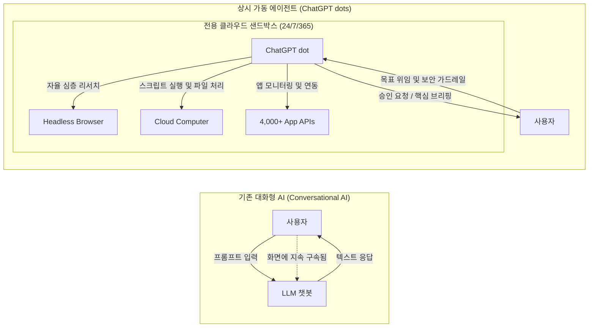

## 서론: 도구로서의 챗봇에서 24시간 자율 협업하는 '디지털 동료'로의 도약

2026년 9월 29일 미국 샌프란시스코에서 개최된 'OpenAI DevDay 2026'에서 인공지능 역사에 한 획을 긋는 혁신적인 플랫폼이 전격 공개되었다. 바로 상시 가동형 자율 AI 에이전트인 **'ChatGPT dots(OpenAI dots)'** 이다.

2022년 말 ChatGPT가 첫선을 보인 이래 생성형 AI의 기본 상호작용은 프롬프트 기반의 대화(Chat UI)에 머물러 있었다. 그러나 이러한 대화형 패러다임은 인간 사용자가 화면 앞에서 지속적으로 명령을 입력해야 하고, 브라우저 탭을 닫으면 연산이 즉시 중단되는 구조적 한계를 안고 있었다.

ChatGPT dots는 이러한 **'인간의 시간적 구속과 수동적 질의응답'** 구조를 근본적으로 해체한다. 각 dot에는 클라우드 상에 격리된 전용 가상 컴퓨터와 브라우저 환경이 상시 할당되어 사용자가 오프라인 상태이거나 수면 중일 때에도 24시간 365일 목표(Goal)를 향해 자율적으로 탐색하고 도구를 실행한다.

---

## 1. 아키텍처 패러다임 전환: 챗봇에서 상시 가동 에이전트로

### 1.1 기존 대화형 AI가 지닌 세 가지 근본적 병목

1. **수동적 반응성(Passivity)**: 사용자의 명시적인 입력 없이는 단 1밀리초도 연산하지 않는 한계.
2. **세션 단절에 따른 컨텍스트 휘발(Context Volatility)**: 대화 종료 시 장기적인 프로젝트 이력과 중간 가설이 소실되는 문제.
3. **인간 물리적 시간에의 구속(Human Time Bound)**: 대규모 자료 조사를 위해 인간이 전 과정을 실시간으로 모니터링해야 하는 비효율.

### 1.2 퍼스널 동료: 고차원 목표 위임 아키텍처

dots의 핵심 철학은 **미세 지시(Prompting)에서 목표 위임(Goal Delegation)으로의 전환** 이다. 팀원에게 업무를 위임하듯 고수준 목표와 제약 조건을 부여하면, dot은 이를 유향 비순환 그래프(DAG)로 분해하여 백그라운드에서 자율 완수한다.

---

## 2. ChatGPT dots 시스템 개요 및 특장점 비교

| 비교 항목 | 기존 ChatGPT Plus (GPTs 포함) | ChatGPT dots (OpenAI dots) |
| :--- | :--- | :--- |
| **동작 메커니즘** | 수동적 질의응답 (단일 세션) | **상시 가동형 (Always-On / 백그라운드 자율 실행)** |
| **작업 단위** | 프롬프트 (Prompt) | **포괄적 목표 및 미션 (Goal / Objective)** |
| **실행 환경** | 세션 종료 시 소멸하는 임시 컨테이너 | **전용 클라우드 Linux PC 및 헤드리스 브라우저** |
| **외부 통신** | 사용자 요청 시 동기적 API 호출 | **자율적 정주기 폴링 및 Webhook 이벤트 수신** |
| **협업 인터페이스**| ChatGPT 웹 및 앱 내부 | **Slack, Microsoft Teams, ChatGPT 완벽 동기화** |
| **메모리 지속성**| 대화 컨텍스트 윈도우 한계 내 | **계층형 에피소딕 메모리 및 장기 지식 그래프** |
| **인간의 개입** | 전 과정 실시간 동석 필요 | **Human-in-the-Loop (핵심 의사결정 및 예외 시만 개입)** |

---

## 3. 핵심 기술 구조 및 아키텍처 분석

### 3.1 인텔리전스 코어: GPT-6 Astra

dots의 두뇌를 담당하는 플래그십 파운데이션 모델 **GPT-6 Astra** 는 장기적 작업 계획 수립, 도구 실행 실패 시의 자율 복구 루프(Self-Correction), 그리고 시각적 스크린샷과 DOM 트리를 결합한 고정밀 웹 내비게이션 역량을 완벽히 통합했다.

### 3.2 전용 가상 PC 및 지속성 브라우저

모든 dot은 사용자별로 격리된 독립 Linux 컨테이너 환경에서 구동된다. 인증 세션 및 쿠키가 안전하게 유지되므로 사내 사설망 및 엔터프라이즈 SaaS 솔루션을 오가며 지속적인 업무 자동화를 구현한다.

---

## 4. 요금 체계 및 배포 가이드

- **ChatGPT Pro ($100 ~ $500/월)**: 기본 1개의 dot 무상 포함, 완전한 GPT-6 Astra 추론 권한 및 Proactive Research 무제한 접근.
- **Business Premium & Enterprise**: 워크스페이스 공유 dot, 중앙 관리자 보안 콘솔, Zero Data Retention(ZDR) 및 감사 로그 완비.
- **Plus 플랜 미지원 사유**: 전용 가상 머신 상시 유지 비용 및 자율 리서치 과정에서 폭증하는 토큰 소비량으로 인해 고가 티어로 한정.

---

## 5. 엔터프라이즈 5대 실무 적용 시나리오

1. **스프린트 진행 현황 자율 감시 및 병목 해결**: Linear와 GitHub PR을 교차 검증하여 리뷰 지연 및 CI 실패를 감지, 매일 아침 해결 권고안 제출.
2. **경쟁사 및 글로벌 규제 동향 24시간 인텔리전스**: 야간 공시 및 특허 출원을 모니터링하여 즉시 전략적 영향도 분석 리포트 배포.
3. **장애 로그 자동 분석 및 수정 패치 PR 초안 생성**: Sentry 예외를 감지하여 전용 샌드박스에서 재현 코드를 검증하고 GitHub PR 생성.
4. **글로벌 출장 여정 및 일정 조율 완전 대행**: 항공권 가격 변동과 숙소 공실을 추적하여 최적의 일정 확정 전 최종 결제 승인 요청.
5. **고객 피드백(VoC) 실시간 클러스터링**: 앱스토어 리뷰 및 젠데스크 티켓의 이상 징후를 감지하여 우선순위 개선 매트릭스 도출.

---

## 6. 결론: 인간과 에이전트가 공존하는 오케스트레이션 시대

ChatGPT dots의 등장은 지식 노동의 패러다임을 '직접 작업자'에서 **'에이전트 오케스트레이터(Agent Orchestrator)'** 로 이동시킨다. 모호한 목표를 기계가 실행 가능한 정밀한 과제로 구조화하고, 자율성과 승인의 경계를 설계하는 역량이 미래 비즈니스의 가장 결정적인 무기가 될 것이다.
