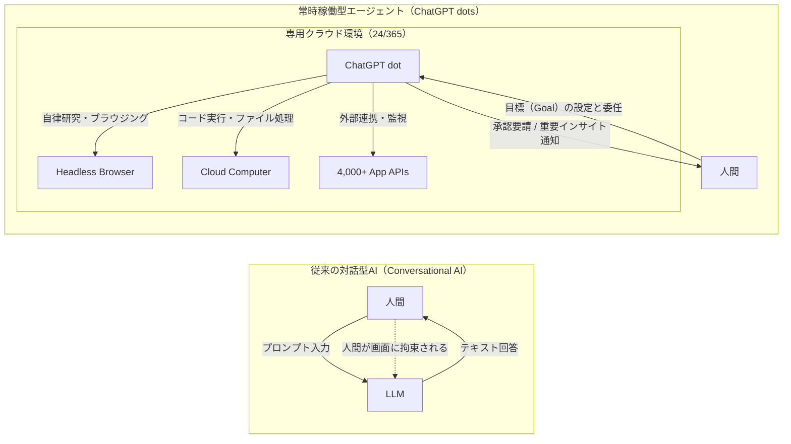
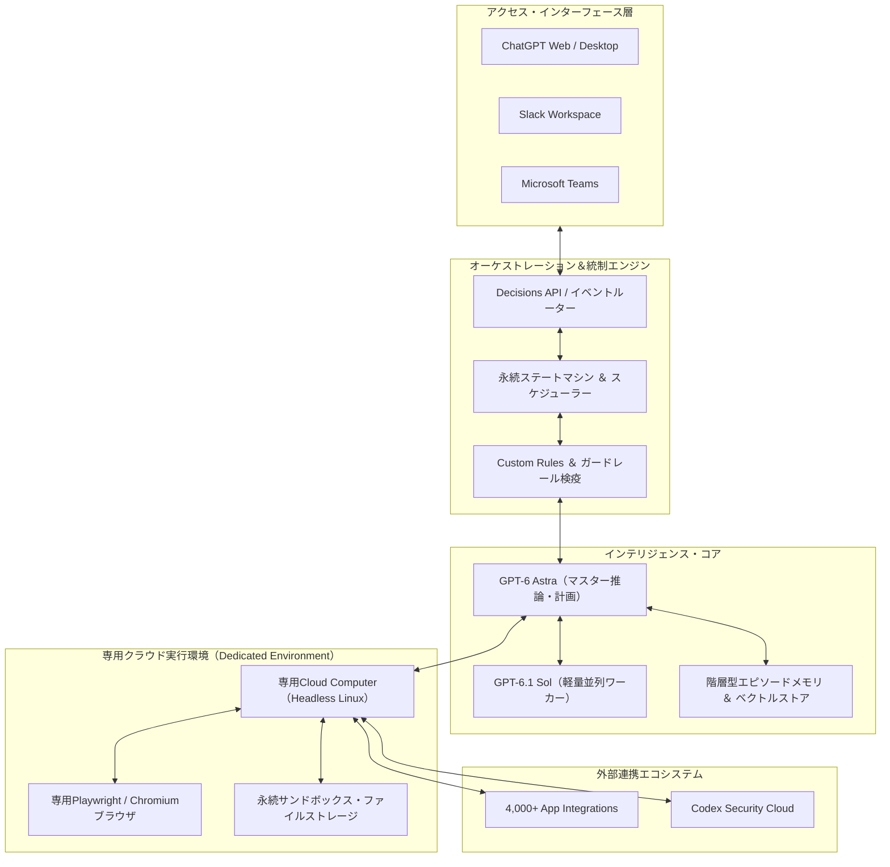
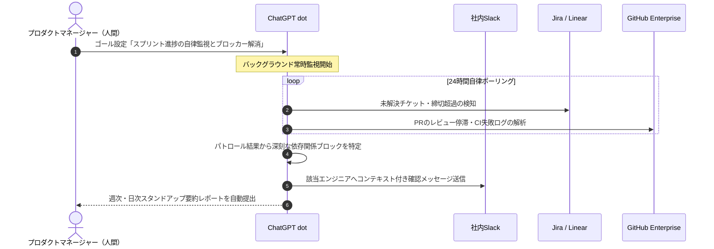
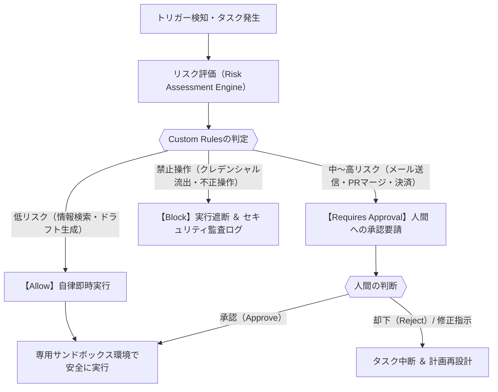

## はじめに：AIは「話しかける道具」から「自律して働く同僚」へ

2026年9月29日、米サンフランシスコで開催された「OpenAI DevDay 2026」の壇上において、AIの歴史を不可逆的に塗り替える決定的なプロダクトが発表された。それが、常時稼働型自律AIエージェント **「ChatGPT dots（OpenAI dots）」** である。

2022年後半のChatGPT登場以来、世界を席巻してきた生成AIの基本インターフェースは一貫して「チャット（Conversational UI）」であった。人間がプロンプトを入力し、AIが数秒から数十秒で回答を返す。この対話型パラダイムは確かに知的生産の効率を劇的に引き上げたが、同時に「人間が画面の前に座って指示を出し続けなければならない」「ブラウザのタブを閉じれば思考が停止する」という本質的な制約を抱え続けていた。

OpenAI dotsがもたらした革命の本質は、まさにこの **「人間の時間的拘束と受動的チャットの限界」** を根底から破壊した点にある。dotsは、ユーザーが眠っている間も、移動中も、他の会議に出席している間も、クラウド上に割り当てられた専用の仮想環境で24時間365日自律的に思考し、情報収集を行い、ツールを操作して目標（Goal）の達成に向けて作業を継続する。

本稿では、世界トップクラスのAIアーキテクトおよびテックジャーナリストの視点から、ChatGPT dotsの誕生背景、基盤モデル「GPT-6 Astra」や専用クラウドPCによる技術アーキテクチャ、価格体系、Slack/Microsoft Teamsを巻き込んだ実務ユースケース、そしてHuman-in-the-Loopによる安全統制まで、その全貌を1万字を超える圧倒的な密度で徹底解剖する。

---

## 第1章：AI史のパラダイムシフト——「チャット」から「常時稼働エージェント（Always-On）」へ

### 1.1 対話型AI（Conversational AI）が抱えていた3つの構造的限界

大規模言語モデル（LLM）の進化において、対話型インターフェースは普及の起爆剤となったが、プロフェッショナルな業務ワークフローに組み込む上では、以下の3つの巨大な構造的限界が顕在化していた。

1. **プロンプト待ちという受動性（Passivity）**:
   従来のChatGPTや各種アシスタントは、人間からの入力トリガーがなければ1ミリ秒たりとも思考しない。業務における真の課題は「何を尋ねるべきか自体が刻々と変化する」点にあるにもかかわらず、人間側が常にアンテナを張り、課題を言語化して問い続けなければ価値を生み出せなかった。
2. **セッション切断によるコンテキストの揮発（Context Volatility）**:
   対話セッションが終了するか、あるいはコンテキストウィンドウの長大化によって圧縮・要約が行われるたびに、暗黙知や長期的なプロジェクトの経緯が失われていく。メモリ機能の追加などの改善は行われたものの、「過去数週間にわたる試行錯誤の軌跡」を動的に保持し続けることは困難であった。
3. **人間の物理的時間への従属（Human Time Bound）**:
   AIの実行時間は人間の操作時間と1対1で結びついていた。たとえば、100社におよぶ競合企業の最新プレスリリースとIR資料を横断調査して示唆を導き出す作業をAIに依頼する場合、人間が何度もプロンプトを重ね、出力結果を確認し、追加指示を出すという「人間の同席」が必須であった。

### 1.2 「パーソナルな同僚（Personal Coworker）」への進化：委任型アーキテクチャ

ChatGPT dotsが標榜するのは、単なる「便利なソフトウェア」ではなく **「自律したパーソナルな同僚（Personal Coworker）」** である。

人間が部下やチームメンバーに仕事を依頼するとき、「毎分ごとに指示を出す」ことはしない。プロジェクトの最終目標（Goal）、遵守すべき制約条件（Constraints）、そして途中で判断に迷ったときの報告ライン（Escalation Path）を定義してタスクを「委任（Delegate）」するはずだ。

dotsはこの委任型アーキテクチャを完全にソフトウェアとして実装した。ユーザーが「今四半期の競合X社の動向を監視し、毎週月曜の朝までに戦略的示唆をレポートせよ」「リポジトリ内の未トリアージIssueを定期精査し、再現コードを作成してPRドラフトを準備せよ」といったゴールを与えるだけで、dotは自らの判断でタスクをサブステップに分解し、スケジューリングを行い、実行へと移る。

### 1.3 産業革命における動力機関と、知的労働における常時稼働の歴史的符合

歴史を振り返れば、第1次産業革命の本質は「人間の筋肉労働の代替」以上に **「動力機関の連続運転」** にあった。水車や蒸気機関が夜間も天候に左右されず稼働し続けることで、工場の稼働率は飛躍的に向上した。

現在の知的労働（ナレッジワーク）において、dotsがもたらす変化はまさにこの歴史的符合をなぞっている。人間の知的能力の断片を模倣したアルゴリズムが、人間の睡眠中や不在時にもバックグラウンドで無休で情報空間を巡回し、データの整理と分析を推し進める。「知性の連続稼働」が日常化する世界への第一歩が、ここに刻まれたのである。

---

## 第2章：ChatGPT dotsの基本概要とコペルニクス的転換

### 2.1 dotsとは何か：「点」を繋ぎ合わせて星座を作る設計思想

**「dots（ドット）」** というネーミングには、OpenAIの深いプロダクト哲学が込められている。

現代のビジネスパーソンは、無数の「点（Dots）」に囲まれて忙殺されている。Slackの未読メッセージ、Jiraのチケット、Notionの仕様書、GitHubのPull Request、散在するGoogleスプレッドシート、そしてWeb上の膨大なニュース。これら孤立した情報とタスクの「点」を繋ぎ合わせ、意味のある線や星座（Constellation）へと統合する役割を果たすのが、各ユーザーに専属で配備されるAIエージェント「dot」である。

従来のカスタムGPTs（GPT Storeで配布されるGPTs）が「特定のプロンプトとナレッジを付与された対話テンプレート」に過ぎなかったのに対し、dotsは **「専用のコンピュートリソースとファイルシステム、永続的なアイデンティティを持つ自立インスタンス」** であるという決定的な違いがある。

### 2.2 従来のChatGPT Plusとの根本的相違点

| 比較項目 | 従来のChatGPT（Plus / GPTs） | ChatGPT dots（OpenAI dots） |
| :--- | :--- | :--- |
| **動作形態** | 対話トリガー型（セッション単位） | 常時稼働型（Always-On / バックグラウンド自律実行） |
| **タスク単位** | プロンプト（Prompt） | 目標・ミッション（Goal / Objective） |
| **実行環境** | 一時的な共有コンテナ（セッション破棄） | 各dot専用の **独立クラウド仮想PC ＆ ブラウザ** |
| **外部通信** | ユーザーのプロンプト実行時のみAPI呼出 | 自律的な定期ポーリングおよびWebhookイベント駆動 |
| **インターフェース**| ChatGPT Web / アプリ画面内 | ChatGPT、Slack、Microsoft Teamsを統合横断 |
| **記憶保持性** | 会話履歴（コンテキスト長上限あり） | 階層型永続エピソードメモリ ＆ ナレッジグラフ |
| **人間の関与** | 全ステップに人間が同席 | 例外時や重要意思決定時のみ介入（Human-in-the-Loop） |

### 2.3 DevDay 2026での発表の衝撃と、同時発表技術群との有機的連動

DevDay 2026において、サム・アルトマンをはじめとするOpenAI経営陣が強調したのは、dotsが単独の飛び道具ではなく、 **「OpenAIが長年構築してきたエージェントエコシステムの頂点」** として設計されている点である。同カンファレンスで同時発表された以下の新技術群は、すべてdotsを支える基盤として有機的に噛み合っている。

- **GPT-6.1 Sol**: 高速・低コストに特化したコーディング＆サブタスク処理モデル。dotsが複雑な目標を細分化した際、軽量タスクを並列処理するワーカーとして動的に呼び出される。
- **ChatGPT Space**: 人間と複数のAIエージェント（dots）がリアルタイムにドキュメントやコード、プロジェクトボードを共同編集するワークスペース。
- **Agents API**: 外部の開発者が自社システムにdotsと同等のコンピュータ操作（Computer Use）や自律ワークフローを組み込むための開発者向け基盤。
- **Decisions API**: 毎秒数千回の超低レイテンシで判断・ルーティングを行う軽量API。dotsが外部ストリームを常時監視する際のフィルターとして機能。

---

## 第3章：技術構造とアーキテクチャの全貌

ChatGPT dotsの内部は、近年のAI工学における最先端のコンポーネントが緻密に統合された巨大な分散システムである。

### 3.1 基盤モデル「GPT-6 Astra」の役割：長期推論と自己修復ループ

dotsの中枢頭脳を担うのが、OpenAIのフロンティアモデル **「GPT-6 Astra」** である。Astraは、前世代のモデルと比較して以下の3つの決定的な強みを持つ。

1. **長期計画能力（Long-Horizon Planning）**:
   数十ステップから数百ステップに及ぶ複雑なタスクにおいて、初期の前提条件やゴールを見失わずにタスクグラフ（DAG）を展開・維持できる。
2. **動的自己修復ループ（Self-Correction ＆ Reflection）**:
   Webページの読み込み失敗、APIエラー、想定外のデータ形式に遭遇した際、パニックに陥ることなく「なぜ失敗したのか」を自己分析し、別のアプローチ（セレクタの変更、検索クエリの再定義、APIパラメータの調整）を自律的に試行する。
3. **高解像度マルチモーダル認識**:
   ブラウザのDOMツリー解析だけでなく、レンダリングされた画面のスクリーンショットを直接視覚的に認識し、人間の操作と同様にボタンの位置やポップアップの挙動を正確に把握する。

### 3.2 専用Cloud Computer ＆ Headless Browser：完全独立したサンドボックス

dotsの最大の技術的ブレークスルーは、 **「すべてのdotに専用のクラウド仮想マシン（Linuxコンテナ）とブラウザが24時間割り当てられている」** 点にある。

従来のWebブラウジング機能は、ユーザーのリクエストに応じて一時的なスクレイパーが動くだけであった。しかしdotsでは、独立したファイルシステム、Python/Node.js実行環境、Bashシェル、そしてHeadless Chromiumブラウザが常時スタンバイしている。
- データのダウンロード、加工、スクリプト実行、PDFの生成、CSVの分析などがすべて専用マシン内で完結する。
- ログインセッションやCookieも安全に暗号化保持されるため、認証が必要なSaaS間を跨いだ定常業務を安定して遂行できる。

### 3.3 Proactive Research（自律研究）のメカニズム

dotsが持つ **「Proactive Research（自律研究）」** 機能は、ユーザーからの命令をただ待つのではなく、自発的に探索を行う機能である。
- **定期ポーリングとイベント駆動の協調**: 指定したRSS、APIエンドポイント、Webサイトの更新を定期監視しつつ、SlackやWebhookからの即時通知にも即座に反応する。
- **ノイズ情報フィルタリング**: 大量の生データから、ユーザーが関心を持つ本質的な差分情報のみを「Decisions API」を用いて瞬時に選別し、無駄なコンテキスト消費と誤検知通知を防止する。

### 3.4 クロスプラットフォーム同期：Slack・Teams・ChatGPTの文脈融合

dotsは、ChatGPTのUIだけに閉じこもってはいない。
SlackやMicrosoft Teamsのボット/アプリとしてワークスペースに常駐させることが可能であり、どのチャネルからメンションされても同一のコンテキストと長期記憶を共有している。
- 「Slackで指示を出し、外出先のスマートフォンアプリ版ChatGPTで途中経過を確認し、オフィスのデスクトップ版で生成された成果物ファイルをレビューする」といったシームレスな作業動線が完全に確立されている。

---

## 第4章：価格体系・提供プラン・導入ハードルの完全整理

### 4.1 プラン別対応状況の完全比較

ChatGPT dotsは、極めて高度な専用コンピュートリソースを常時消費するため、一般の無料ユーザーや月額20ドルのChatGPT Plusには開放されていない。

| プラン区分 | 月額料金（目安） | dotsの利用可否 | 付帯dot数 | 利用制限・特徴 |
| :--- | :--- | :---: | :---: | :--- |
| **Free（無料版）** | 無料 | × 不可 | 0 | 利用不可 |
| **ChatGPT Plus** | $20 / 月 | × 不可 | 0 | 従来のチャット・カスタムGPTsのみ利用可能 |
| **ChatGPT Pro** | $100 〜 $500 / 月 | **○ 完全対応** | 1体標準付属 | 最上位推論・Proactive Research無制限アクセス |
| **Business Premium** | 組織見積（要契約） | **○ 完全対応** | 契約規模に応じる | チーム共有dot、管理者コンソール、権限管理 |
| **Enterprise** | カスタム契約 | **○ ベータ提供** | 要管理者申請 | 専用インスタンス、ZDR、SLA保証、監査ログ |

### 4.2 なぜPlus（$20/月）では提供されず、Pro以上なのか？ コスト構造の冷徹な分析

多くのユーザーが「なぜPlusで使えないのか」と疑問を抱くが、インフラコストの観点から見れば理由は明白である。
1. **専用仮想マシンの常時維持コスト**: 24時間365日、専用のメモリとCPU、ストレージを確保し続けるクラウドインフラ費用。
2. **GPT-6 Astraのトークン消費量**: バックグラウンドで自律的にWebを巡回し、DOM解析や試行錯誤を繰り返すProactive Researchは、1回の調査で数十万から数百万トークンを消費することが珍しくない。
3. 月額20ドルの定額料金モデルでは到底採算が合わず、持続可能なサービス提供のために月額100ドル以上のProプランおよび法人契約に限定された。

### 4.3 初期プロモーション特典と今後の従量課金の見通し

OpenAIは、ローンチ戦略として以下の施策を展開している。
- **1体目のdotが標準付帯**: 対象のProおよびBusiness Premiumユーザーは、追加料金なしで最初の1体を稼働させることができる。
- **初月消費免除（Grace Period）**: ローンチ後最初の1ヶ月間は、dotによるバックグラウンドトークン消費が標準プランのレートリミット枠にカウントされない特別プロモーションが適用される。
- **今後の展開**: 2体目以降の「複数dotの並列運用（Multi-dot Orchestration）」については、従量課金制（トークン＋コンピュート時間）または追加シート課金の導入が予告されている。

### 4.4 地政学的・法規制の壁：EU（EEA）・英国・スイスにおける提供制限の真相

ローンチ時点で最も大きな波紋を呼んだのが、 **欧州経済領域（EEA）、英国、スイスにおける個人のChatGPT Proアカウントへの提供制限** である。

この背景には、欧州の包括的AI規制法「EU AI Act」における「汎用目的AI（GPAI）および自律型高リスクシステム」に対する厳格なコンプライアンス要件、ならびにGDPR（一般データ保護規則）に基づく「自律的クローリングおよびプロファイリングに対する同意管理」の法的論点がある。企業向けのEnterprise契約では監査ログと閉域性が担保されるためベータ導入が進められているが、個人の越境データ処理については法務的クリアランスが完了するまで慎重な姿勢が取られている。

---

## 第5章：実務での使い方と5大実践ユースケース

ここでは、実際のビジネス現場においてChatGPT dotsがどのように活用されるのか、具体的な設定ゴール（プロンプト）、dotの自律的挙動、そして人間へのアウトプットの具体例を詳述する。

### ユースケース①：プロジェクトマネジメント・進捗自律監視

#### 設定ゴール（指示プロンプト例）
> 「あなたは専属のテクニカル・プロジェクトマネージャーです。LinearおよびGitHubリポジトリ、そしてSlackの `#dev-sprint` チャネルを24時間監視してください。スプリント終了まで残り48時間を切った未着手タスク、CIが連続して失敗しているPR、およびチームメンバー間で議論がスタックしているIssueを自律検知し、毎日午前9時に優先度順のブロッカー解消サマリーを報告してください。」

#### dotの自律的挙動
- LinearのGraphQL APIを定期的に監視し、進捗率と期日を照合。
- GitHubのWebhookを受信し、PRのコンフリクトやビルドエラーを検知。
- Slackチャネルの会話ログを解析し、「誰が誰のレビュー待ちか」の依存関係グラフを自動構築。

#### 人間への報告アウトプット例
> **【dot Morning Standup Briefing】**
> - **重大ブロッカー（要対応）**: PR #342（認証基盤リファクタ）がCIテストでメモリエラーとなり、マージが18時間停止しています。依存するタスク #104 が着手不能です。
> - **推奨アクション**: メモリ上限設定（`jest.config.js`）の修正案をブランチ `fix/ci-memory-leak` として草案作成済みです。確認の上、マージを承認してください。

---

### ユースケース②：競合情報・市場・IRの24時間自律トラッキング

#### 設定ゴール（指示プロンプト例）
> 「当社のグローバル競合5社（A社、B社、C社、D社、E社）の公式サイト、各国の特許出願速報、SEC提出書類（10-K/10-Q）、海外テックメディアを常時監視してください。競合による大型新機能のリリース、役員人事、価格改定、または生成AI関連の知財出願が確認された場合、直ちに要約と自社事業への影響分析を作成し、Slackの `#strategic-intelligence` に投稿してください。」

#### dotの自律的挙動
- 専用ブラウザを用いて、深夜帯に更新される海外メディアや官報、特許庁データベースを巡回。
- 変化差分（DOM Diff）を抽出し、無関係なデザイン変更や文言微修正を自動除外。
- 重要な発表があった場合、過去の自社製品ロードマップと突き合わせてシナリオ分析を実行。

---

### ユースケース③：ソフトウェアエンジニアリング補助（Issueトリアージと修正PRドラフト）

#### 設定ゴール（指示プロンプト例）
> 「リポジトリ `backend-core` のSentryエラーログと新規オープンされたGitHub Issueを監視してください。重大度『High』のエラーが発生した場合、スタックトレースを解析してローカルコンピュート環境で最小再現コードを作成し、修正パッチのPull Requestドラフトを作成してください。外部へのコミットプッシュは必ず人間の承認（Requires Approval）を求めてください。」

#### dotの自律的挙動
- Sentryからアラートを受信すると、専用仮想マシン内で該当ブランチをクローン。
- エラーの発生箇所を特定し、再現ユニットテストをPython/TypeScriptで記述してテスト実行。
- 修正コードを自動生成し、テストが全件パスすることを確認した上で、PRの差分プレビューをユーザーに提示して承認を待機。

---

### ユースケース④：出張・複雑日程・ロジスティクスの完全代行

#### 設定ゴール（指示プロンプト例）
> 「来月開催される海外カンファレンス（ラスベガス）への出張手配を統括してください。Googleカレンダーの空き枠、会社の出張旅費規程（フライト上限・ホテル上限基準）を遵守し、フライトの最安値推移とホテルの空室状況を監視してください。納得のいく旅程候補を2案作成し、予約確定の段階で私の承認を求めてください。」

#### dotの自律的挙動
- 各航空会社・ホテル予約サイトを定期チェックし、価格変動アルゴリズムを追跡。
- 乗り継ぎ時間や時差ボケを考慮した最適なフライトスケジュールをシミュレーション。
- 予約直前画面のURLと全旅程表をカレンダーの仮予定として登録し、最終決済のワンクリック承認を人間に要請。

---

### ユースケース⑤：顧客の声（VoC）とカスタマーサポートのリアルタイム集約

#### 設定ゴール（指示プロンプト例）
> 「Zendeskの受信チケット、App StoreおよびGoogle Playのユーザーレビュー、X（Twitter）上の製品メンションを常時クロールしてください。ユーザーからの感情分析（センチメントスコア）が急激に低下した場合、または特定のバグ報告が複数件重複して発生した場合は、即座に障害予兆アラートを発令してください。毎週金曜日には機能改善リクエストの優先度マトリクスを提出してください。」

#### dotの自律的挙動
- 複数チャネルから流入するテキストデータを自然言語処理でクラスタリング。
- バグか要望か操作質問かをトリアージし、類似度の高い問い合わせをグルーピング。
- 緊急障害を察知した場合、障害影響範囲と顧客の生声をまとめたサマリーをインフラ監視チームのSlackチャネルにエスカレーション。

---

## 第6章：Human-in-the-Loopとセキュリティ・ガバナンス

自律型AIエージェントの導入において、企業のCIOやCISOが最も懸念するのは **「エージェントの暴走（Over-Autonomous Action）」** と **「セキュリティ侵害」** である。OpenAI dotsは、この課題に対して極めて厳格な統制フレームワークを組み込んでいる。

### 6.1 Custom Rules（カスタムルール）による3段階の権限マトリクス

ユーザーおよび組織の管理者は、dotの行動権限を以下の3つのレベルで粒度細かく制御できる。

1. **Allow（即時自律許可）**:
   - Webページの閲覧、社内ドキュメントの検索・読込、専用仮想環境内でのスクラッチコード実行、レポートの下書き作成など。副作用（Side Effects）が生じないアクションは完全自律で高速に実行される。
2. **Requires Approval（人間の承認必須）**:
   - 外部関係者へのメール送信、Slack公開チャネルへの発言、GitHubの本番ブランチへのプッシュ、クラウドインフラの変更、金銭の決済など。dotは作業を承認直前の状態で一時停止し、変更差分を提示して人間にワンクリック承認を求める。
3. **Block（絶対実行禁止）**:
   - パスワードや機密APIキーのプレーンテキスト出力、未許可ドメインへのデータ送信、特定ディレクトリの削除など。システムレベルで硬くガードレールが敷かれており、いかなるプロンプトインジェクションによっても突破できない。

### 6.2 Codex Security Cloudとの連携による脆弱性防壁

dotがソフトウェア開発に関わるタスクを行う際、DevDay 2026で発表された **「Codex Security Cloud」** がバックグラウンドで自動介入する。
- 生成されたコードやパッチにSQLインジェクション、XSS、安全でないライブラリの依存関係が含まれていないかをリアルタイムで静的・動的検証。
- 脆弱性が発見された場合は、人間に提出する前にdot自身がセキュアなコードへと自動リファクタリングを行う。

### 6.3 エンタープライズ基準：Private IntelligenceとZero Data Retention

大企業での導入に不可欠なデータ主権についても、以下の高度な保証が提供されている。
- **Zero Data Retention（ZDR）**: dotが扱った社内ドキュメント、通信ログ、個人情報がOpenAIのモデル学習に再利用されることは契約上・技術上100%遮断される。
- **機密コンピューティング（Confidential Computing）**: 将来的に「Private Inference」を統合し、ハードウェアレベルのTEE（Trusted Execution Environment）内でエージェントの推論を実行することで、クラウド事業者やOpenAIの内部エンジニアであっても実行中メモリの内容を物理的に傍受できないアーキテクチャへと進化する。

---

## 第7章：他社エージェントとの徹底比較と競合ランドスケープ

常時稼働エージェントの領域は、ビッグテック各社が社運を賭けて激突する最大の主戦場となっている。

### 7.1 主要4大エージェントプラットフォームの比較

| 項目 | OpenAI dots | Anthropic Computer Use | Google Project Astra / Gemini | Microsoft Copilot Actions |
| :--- | :--- | :--- | :--- | :--- |
| **思想とアプローチ** | **クラウド常時稼働型パーソナル同僚** | ローカルOS直接GUI操作型 | モバイル・空間マルチモーダル型 | Office 365 / Windows業務自動化型 |
| **実行環境** | **専用クラウドLinux PC ＆ ブラウザ** | ユーザーのローカル端末（Docker等）| Google Cloudインフラ | Microsoft 365クラウド |
| **常時稼働性** | **◎ 完全な24/365 Always-On** | △ 端末起動時のみ | ○ バックグラウンド実行対応 | ○ ルールベース＋AI定期実行 |
| **主要UI** | ChatGPT / Slack / Teams | API / 開発者デスクトップ | スマートフォン / スマートグラス | Teams / Outlook / Word / Excel |
| **エコシステム** | **4,000+ プラグイン ＆ アプリ** | 開発者カスタムスクリプト | Google Workspace完全統合 | Microsoft Graph / Power Platform |
| **セキュリティ** | **Custom Rules ＆ Private Intel** | 端末サンドボックス制御 | Google Workspaceガバナンス | エンタープライズPurview統制 |
| **主なターゲット** | ナレッジワーカー、エンジニア、PM | ソフトウェア開発者、QAテスター | 一般消費者、現場ワーカー | 大手エンタープライズ全般 |

### 7.2 OpenAI dotsの決定的な差別化要素

1. **「端末を閉じられる」真の独立性**:
   AnthropicのComputer Useが「ユーザーのPC上でマウスカーソルを動かす」技術であるためPCを閉じるかスリープさせると停止するのに対し、dotsはクラウド仮想マシンで完全に独立稼働するため、真の意味での「オフライン時の代行」が成立する。
2. **SlackとTeamsへの深い浸透**:
   独自のアプリケーションに閉じこもるのではなく、現代のビジネスパーソンが最も時間を費やしているSlackやTeamsという「仕事の現場」に同僚として同居している点が、導入障壁を劇的に下げている。

---

## 第8章：総括：人間とAIエージェントが「共働」する組織の未来

### 8.1 「1人1体」から「1人チーム制（マルチdot運用）」への飛躍

ChatGPT dotsの登場は、単なるツールの進化を超えて、資本主義における「組織と労働の最小単位」を不可逆的に再定義しつつある。

これまでのビジネス社会では、個人の能力をレバレッジするためには「人を雇ってマネジメントする」以外に方法がなかった。しかし、dotsが普及する近未来では、あらゆるビジネスパーソンが自分専属の「リサーチ担当dot」「開発担当dot」「進行管理担当dot」を従え、 **「1人でありながら実質的な5〜10人のタスクフォース」** を率いる時代が到来する。

人間の主たる役割は、手を動かしてデータを集めたり、定型コードを書いたりする「作業者（Worker）」から、AIエージェントたちに適切な目標を与え、アウトプットの真贋を見極め、倫理的・戦略的責任を負う **「ディレクター／意思決定者（Director）」** へと不可避的にシフトしていく。

### 8.2 私たちが今すぐ備えるべき「エージェント・オーケストレーション能力」

このパラダイムシフトの渦中において、ビジネスパーソンに求められるスキルセットは根本から更新されなければならない。
- 優れたプロンプトを単発で書く技術（Prompt Engineering）の時代は終わりを告げようとしている。
- 今後決定的な競争優位となるのは、 **「エージェント・オーケストレーション能力（Agent Orchestration）」** である。
  - 曖昧な事業目標を、AIが実行可能な明確なサブゴールへと構造化する力。
  - どのタスクを自律させ、どのポイントに承認（Approval）の防壁を敷くべきかを見極めるガバナンス設計力。
  - そして、AIが深夜に集めてきた膨大なインサイトの海から、人間ならではの直感と信念をもってビジネスの舵を切る決断力。

OpenAI dotsが切り拓いた「常時稼働型自律エージェント」の夜明けは、私たちに問いかけている。知性が24時間365日休まずに稼働する世界で、人間にしかできない真の創造性とは何か。その答えを探求する実践は、すでに始まっている。
