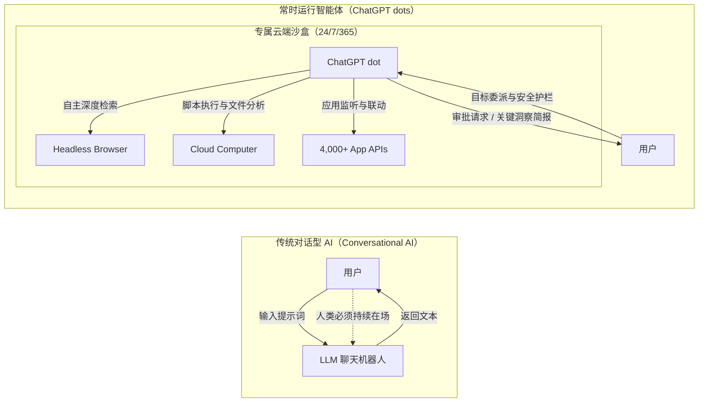
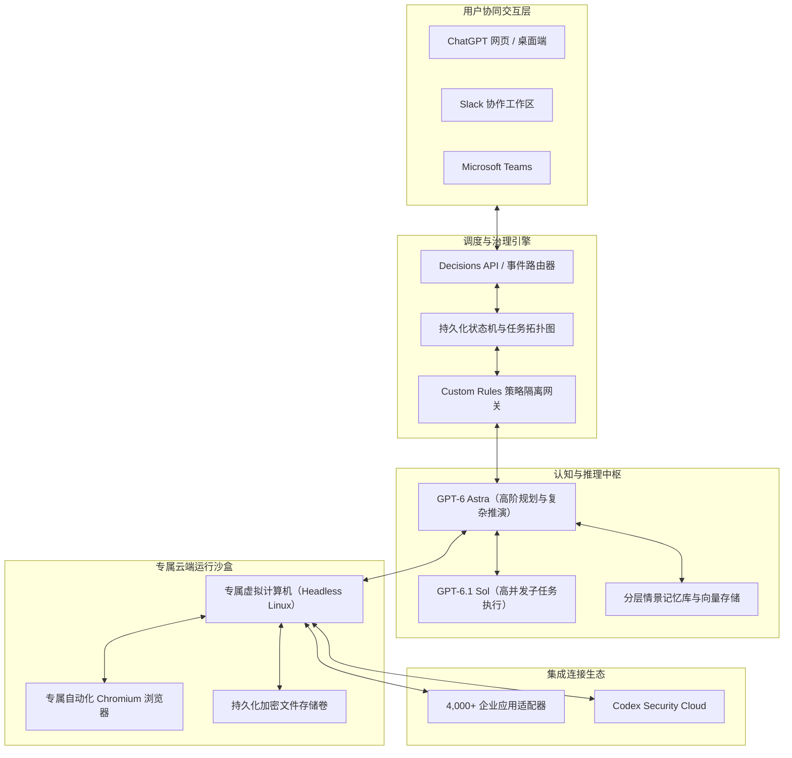
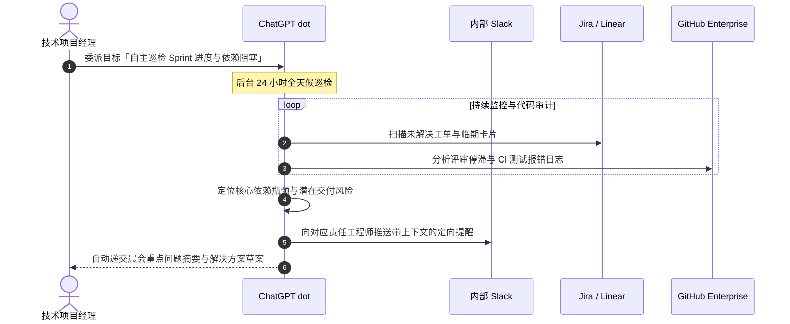
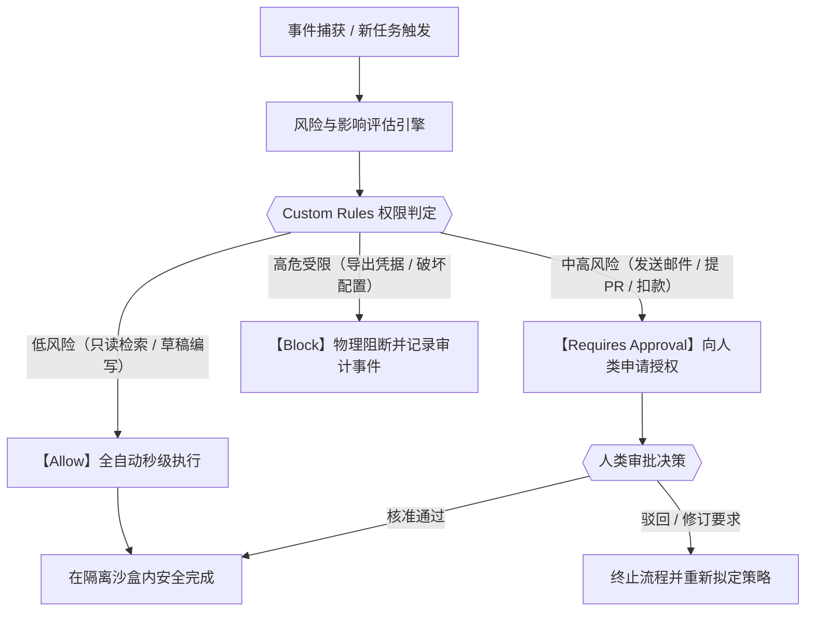

## 前言：AI 从「对话交互工具」向「全天候自主数字同事」的历史跨越

2026 年 9 月 29 日，在美国旧金山举办的「OpenAI DevDay 2026」盛会上，OpenAI 发布了一项颠覆整个人工智能产业格局的核心产品——常时运行自主 AI 智能体 **“ChatGPT dots（OpenAI dots）”** 。

自 2022 年底 ChatGPT 问世以来，全球生成式 AI 的主流交互界面一直被锚定在“对话框（Chat UI）”内。尽管 Prompt 驱动的问答范式极大地提升了个体生产力，但它始终受困于两大物理瓶颈：一是人类必须守在屏幕前持续发号施令，二是只要关闭网页标签页，AI 的计算进程就会彻底停摆。

ChatGPT dots 的革命性意义正在于彻底击碎了 **“人类时间占用与被动应答”** 的枷锁。每个 dot 均被分配了一台运行于云端的专属虚拟计算机与无头浏览器，即便用户断网、睡眠或参加其他会议，dot 也会在云端 24 小时 365 天不间断地理解目标、自主检索、调用工具并推进多步骤业务流程，真正成为不知疲倦的专属数字同事（Personal Coworker）。

---

## 1. 架构范式转移：从对话交互到持续驻留智能体

### 1.1 传统对话型 AI 的三大核心瓶颈

1. **被动响应性（Passivity）**：传统模型必须等待人类给出提示词，模型自身无法感知外部环境的变化。
2. **多轮会话的上下文挥发（Context Volatility）**：会话关闭或窗口压缩后，长达数周的项目推进历史与中间假设极易丢失。
3. **与人类物理时间的完全绑定（Human Time Bound）**：处理需要跨越数百份文档的调查分析时，人类必须全程在场分步引导。

### 1.2 个人同事模式：以目标为驱动的高阶委派

dots 的核心哲学是 **从微观指令走向目标委派（Goal Delegation）** 。在真实团队中，主管向高级雇员布置任务时只会设定最终目标与风控边界。dots 完美继承了这种委派模式，用户只需指定目标（例如“持续监控竞品发布动向并在每周一早晨生成战略简报”），dot 就会自主将其拆解为有向无环图（DAG），在后台有条不紊地巡检执行。

---

## 2. ChatGPT dots 系统概览与技术基石

### 2.1 传统 ChatGPT Plus 与 dots 的本质区别

| 对比维度 | 传统 ChatGPT Plus（含 GPTs） | ChatGPT dots（OpenAI dots） |
| :--- | :--- | :--- |
| **运行机制** | 被动对话触发（单次会话） | **常时运行（Always-On / 后台自主推进）** |
| **交互单元** | 提示词（Prompt） | **总体目标与任务使命（Goal / Mission）** |
| **计算环境** | 瞬态共享容器（随会话销毁） | **独立云端 Linux 虚拟 PC 与专属浏览器** |
| **外部通信** | 用户触发时发起单次请求 | **自主定时轮询与 Webhook 事件驱动** |
| **协同界面** | ChatGPT 网页端/移动端内部 | **跨越 Slack、Teams 与 ChatGPT 无缝漫游** |
| **记忆持久度** | 受限于单会话上下文窗口 | **分层情景记忆网络与长效知识图谱** |
| **人类介入度** | 全程实时参与 | **人在回路（仅在关键决策与异常时介入）** |

### 2.2 DevDay 2026 技术生态的有机协同

dots 是 OpenAI 全栈 Agent 基础设施的集大成者，与 DevDay 2026 发布的其他核心技术深度联动：
- **GPT-6.1 Sol**：专为编程与结构化分析优化的高能效模型，负责并发执行由 dot 拆解出的轻量级子任务。
- **ChatGPT Space**：人类与多个 dot 共同编辑代码、文档和看板的统一数字工作空间。
- **Agents API**：面向开发者的底层接口，支持将计算机使用（Computer Use）集成到企业自建系统中。
- **Decisions API**：毫秒级超低延迟决策引擎，用于对海量外部事件流进行预过滤，确保算力精准聚焦。

---

## 3. 技术架构全景深度解析

### 3.1 核心大脑：GPT-6 Astra

dots 搭载的旗舰模型 **GPT-6 Astra** 具备三大突破性能力：
1. **超长时域任务规划能力（Long-Horizon Planning）**：面对长达数周的复合业务，能够维护清晰的任务依赖树，杜绝目标漂移。
2. **反思与动态自愈循环（Self-Correction）**：在遇到网页结构改动或代码报错时，自主诊断失败根因并动态尝试备用方案。
3. **多模态视觉 DOM 解析**：将 DOM 树结构与截图视觉信号深度对齐，精准识别复杂的现代 Web 界面与动态交互元素。

### 3.2 专属云端计算机与持久化浏览器

每个 dot 均运行在隔离的 Linux 容器内，具备 Python/Node.js 运行环境与持久化磁盘卷。浏览器会安全保留登录态与 Cookie，使得跨多个内部 SaaS 系统的自动化操作得以长效稳定运转。

### 3.3 主动探索机制（Proactive Research）

dot 会在后台自主巡检指定的目标源，通过 Decisions API 剔除无意义的页面翻新，仅当提取到关键性异动时才进行深度分析并形成精炼简报。

---

## 4. 价格体系与订阅方案

| 订阅层级 | 月费标准 | dots 权限 | 标配实例 | 资源特权与治理属性 |
| :--- | :--- | :---: | :---: | :--- |
| **Free 免费版** | $0 | × 不可用 | 0 | 不提供常时运行算力 |
| **ChatGPT Plus** | $20 / 月 | × 不可用 | 0 | 仅限于传统单次会话与自定义 GPTs |
| **ChatGPT Pro** | $100 - $500 / 月 | **○ 完全支持** | 1 个专属 dot | 完整 GPT-6 Astra 推理、专属沙盒、Proactive Research |
| **Business Premium** | 组织级定制 | **○ 完全支持** | 按席位配置 | 团队共享 dot、组织管理控制台、访问策略细分 |
| **Enterprise** | 企业级 SLA | **○ 测试资格** | 管理员申请 | 租户级物理隔离、ZDR、SLA 保障、全链路审计日志 |

### 4.1 为何 Plus（$20/月）无法支持 dots？

主要受制于云端虚拟机长期占用的刚性基建成本以及 GPT-6 Astra 在自主巡检过程中产生的巨大 Token 消耗量。月费 100 美元以上的 Pro 订阅与企业方案才具备覆盖底层独立容器成本的商业合理性。

### 4.2 欧洲经济区（EEA）与英国的合规限制

由于欧洲《人工智能法案》（EU AI Act）对高风险自主通用 AI 系统在合规评估上的严格要求，以及 GDPR 对自动化爬取和持续画像的规范，个人端 Pro 用户在上述地区暂时延后提供，企业级租户需通过管理员独立签署合规协议开展测试。

---

## 5. 企业级 5 大实战应用场景

### 场景 1：研发项目管理与研发阻塞自主排查
- **目标设定**：常时监控 Linear、GitHub 及 Slack `#dev-sprint` 频道，识别逾期未提交、CI 失败超 4 小时及评审停滞的 PR，每日 9:00 输出优先级排序的风险清单。
- **智能体行为**：解析 Sentry 报错日志与构建快照，自主编写修复补丁草案并挂载至工单下。

### 场景 2：24 小时全天候竞品与市场情报追踪
- **目标设定**：跟踪 5 家核心竞品的官网、SEC 监管财报及全球专利公示，一旦发现重要发布或定价重构，即刻生成影响评估并推送至 Slack。
- **智能体行为**：利用云端无头浏览器在深夜抓取海外动态，完成结构化清洗后与公司内部产品矩阵交叉验证。

### 场景 3：线上缺陷自动复现与修复 PR 拟定
- **目标设定**：监控线上高优先级告警，在专属沙盒内克隆代码库并构建最小复现用例，编写单元测试与补丁分支，发起合并请求前须人工确认。

### 场景 4：复杂商务差旅与日程全流程代办
- **目标设定**：在差旅预算限额内动态追踪国际航班运价波动与酒店库存，拟定两套最优解，最终扣款出票前向高管申请一键核准。

### 场景 5：客户心声（VoC）与客服工单全域聚类
- **目标设定**：汇总应用商店评分、社交媒体提及与 Zendesk 服务单，当负向情绪指数突增或出现群体性严重故障时，实时触发应急预警。

---

## 6. 人在回路（Human-in-the-Loop）与安全治理

### 6.1 Custom Rules 三级权限矩阵
1. **Allow（自动放行）**：只读查询、沙盒内代码运行、内部草稿拟定。无外部副作用的操作完全由智能体自主闭环。
2. **Requires Approval（强制审批）**：对外发送邮件、向生产分支合并代码、修改云服务配置。dot 会暂停执行并提供清晰的差异对比图。
3. **Block（硬性阻断）**：明文导出密码私钥、访问未经批准的外网域名。底层基础设施直接阻断，免疫一切提示词注入攻击。

### 6.2 Codex Security Cloud 与企业级安全防线
dot 编写的代码均自动经过安全云网关的动静态扫描，防范注入漏洞与不安全依赖引入。企业租户享有严格的零数据保留（ZDR）协议，确保私有数据绝不流入公开模型训练池。

---

## 7. 行业竞品全景横向评测

| 评测维度 | OpenAI dots | Anthropic Computer Use | Google Project Astra / Gemini | Microsoft Copilot Actions |
| :--- | :--- | :--- | :--- | :--- |
| **架构理念** | **云端全天候数字同事** | 本地操作系统 GUI 模拟 | 移动端多模态环境助理 | 办公套件自动化触发器 |
| **执行载体** | **专属云端 Linux PC 与浏览器** | 用户本地工作站（Docker） | Google Cloud 基础设施 | Microsoft 365 云平台 |
| **常时运行性** | **持续 24/7/365 Always-On** | 主机休眠即停止 | 后台服务轮询调用 | 定时与规则驱动 |
| **主力端入口** | ChatGPT / Slack / Teams | API / 开发者桌面 | 手机 / 智能眼镜终端 | Teams / Office 365 全系 |
| **连接生态** | **4,000+ 应用适配器** | 开发者自定义脚本 | Google Workspace 深度整合 | Microsoft Graph / Power Platform |
| **主要客群** | 知识型员工、PM、研发工程师 | 软件开发与自动化测试工程师 | 移动办公人员、大众消费者 | 微软企业级客户全家桶 |

---

## 8. 结语：迈向智能体编排协作的新组织范式

ChatGPT dots 的面世标志着人类知识生产关系的深刻蜕变。在过去，扩展生产力的唯一途径是扩招团队与增加层级。而在 dots 普及的未来，每个专业人士都将成为掌控多智能体编排的微型特遣队负责人。

人类员工的核心竞争力不再是微观的提示词微调，而是 **智能体编排能力（Agent Orchestration）**——如何将模糊商业蓝图拆解为机器可识别的使命树，如何在效率与风险之间划定精准的审批边界，并在智能体持续反馈的洞察之海中作出坚定的战略决断。
