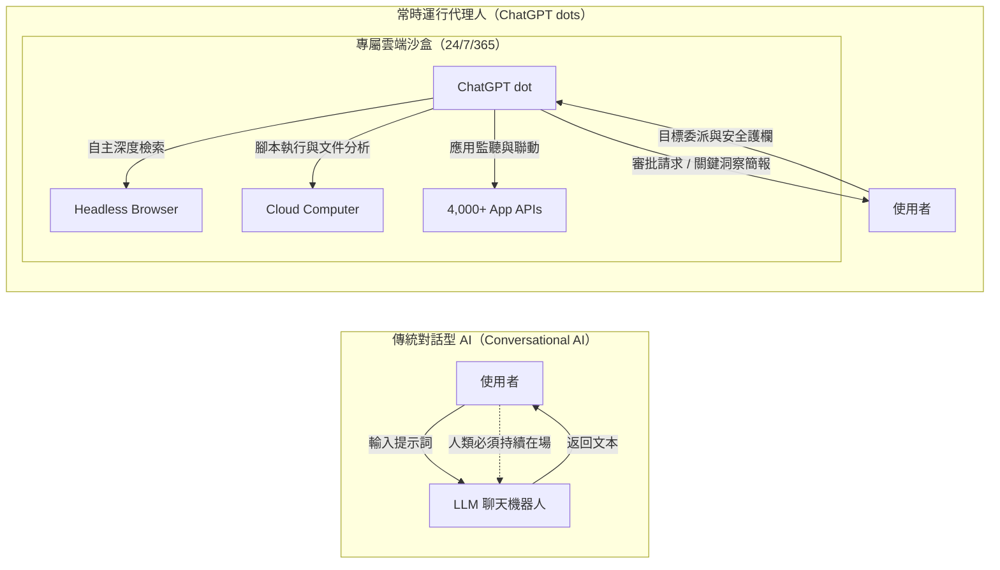

## 前言：AI 從「對話互動工具」向「全天候自主數位同事」的歷史跨越

2026 年 9 月 29 日，在美國舊金山舉辦的「OpenAI DevDay 2026」盛會上，OpenAI 發布了一項顛覆整個人工智慧產業格局的核心產品——常時運行自主 AI 代理人 **「ChatGPT dots（OpenAI dots）」** 。

自 2022 年底 ChatGPT 問世以來，全球生成式 AI 的主流互動介面一直被錨定在「對話框（Chat UI）」內。儘管 Prompt 驅動的問答範式極大地提升了個人生產力，但它始終受困於兩大物理瓶頸：一是人類必須守在螢幕前持續發號施令，二是只要關閉網頁標籤頁，AI 的計算進程就會徹底停擺。

ChatGPT dots 的革命性意義正在於徹底擊碎了 **「人類時間佔用與被動應答」** 的枷鎖。每個 dot 均被分配了一台運行於雲端的專屬虛擬電腦與無頭瀏覽器，即便使用者斷網、睡眠或參加其他會議，dot 也會在雲端 24 小時 365 天不間斷地理解目標、自主檢索、調用工具並推進多步驟業務流程，真正成為不知疲倦的專屬數位同事（Personal Coworker）。

---

## 1. 架構範式轉移：從對話互動到持續駐留代理人

### 1.1 傳統對話型 AI 的三大核心瓶頸

1. **被動響應性（Passivity）**：傳統模型必須等待人類給出提示詞，模型自身無法感知外部環境的變化。
2. **多輪對話的上下文揮發（Context Volatility）**：對話關閉或窗口壓縮後，長達數週的專案推進歷史與中間假設極易丟失。
3. **與人類物理時間的完全綁定（Human Time Bound）**：處理需要跨越數百份文件的調查分析時，人類必須全程在場逐步引導。

### 1.2 個人同事模式：以目標為驅動的高階委派

dots 的核心哲學是 **從微觀指令走向目標委派（Goal Delegation）** 。在真實團隊中，主管向高階同仁佈置任務時只會設定最終目標與風控邊界。dots 完美繼承了這種委派模式，使用者只需指定目標（例如「持續監控競品發布動向並在每週一早晨生成戰略簡報」），dot 就會自主將其拆解為有向無環圖（DAG），在後台有條不紊地巡檢執行。

---

## 2. ChatGPT dots 系統概覽與技術基石

### 2.1 傳統 ChatGPT Plus 與 dots 的本質區別

| 對比維度 | 傳統 ChatGPT Plus（含 GPTs） | ChatGPT dots（OpenAI dots） |
| :--- | :--- | :--- |
| **運行機制** | 被動對話觸發（單次對話） | **常時運行（Always-On / 後台自主推進）** |
| **互動單元** | 提示詞（Prompt） | **總體目標與任務使命（Goal / Mission）** |
| **計算環境** | 瞬態共享容器（隨對話銷毀） | **獨立雲端 Linux 虛擬 PC 與專屬瀏覽器** |
| **外部通訊** | 使用者觸發時發起單次請求 | **自主定時輪詢與 Webhook 事件驅動** |
| **協同介面** | ChatGPT 網頁端/行動端內部 | **跨越 Slack、Teams 與 ChatGPT 無縫漫遊** |
| **記憶持久度** | 受限於單對話上下文窗口 | **分層情景記憶網路與長效知識圖譜** |
| **人類介入度** | 全程即時參與 | **人在迴路（僅在關鍵決策與異常時介入）** |

---

## 3. 技術架構全景深度解析

### 3.1 核心大腦：GPT-6 Astra

dots 搭載的旗艦模型 **GPT-6 Astra** 具備三大突破性能力：
1. **超長時域任務規劃能力（Long-Horizon Planning）**：面對長達數週的複合業務，能夠維護清晰的任務依賴樹，杜絕目標漂移。
2. **反思與動態自癒循環（Self-Correction）**：在遇到網頁結構改動或程式碼報錯時，自主診斷失敗根因並動態嘗試備用方案。
3. **多模態視覺 DOM 解析**：將 DOM 樹結構與截圖視覺信號深度對齊，精準識別複雜的現代 Web 介面。

### 3.2 專屬雲端電腦與持久化瀏覽器

每個 dot 均運行在隔離的 Linux 容器內，具備 Python/Node.js 運行環境與持久化磁碟卷。瀏覽器會安全保留登入態與 Cookie，使得跨多個內部 SaaS 系統的自動化操作得以長效穩定運轉。

---

## 4. 價格體系與訂閱方案

| 訂閱層級 | 月費標準 | dots 權限 | 標配實例 | 資源特權與治理屬性 |
| :--- | :--- | :---: | :---: | :--- |
| **Free 免費版** | $0 | × 不可用 | 0 | 不提供常時運行算力 |
| **ChatGPT Plus** | $20 / 月 | × 不可用 | 0 | 僅限於傳統單次對話與自定義 GPTs |
| **ChatGPT Pro** | $100 - $500 / 月 | **○ 完全支援** | 1 個專屬 dot | 完整 GPT-6 Astra 推理、專屬沙盒、Proactive Research |
| **Business Premium** | 組織級客製 | **○ 完全支援** | 按席位配置 | 團隊共享 dot、組織管理主控台、存取策略細分 |
| **Enterprise** | 企業級 SLA | **○ 測試資格** | 管理員申請 | 租戶級物理隔離、ZDR、SLA 保障、全鏈路稽核日誌 |

---

## 5. 企業級 5 大實戰應用場景

1. **研發專案管理與阻塞自主排查**：常時監控 Linear、GitHub 及 Slack `#dev-sprint` 頻道，定位程式碼審查停滯並起草修復 PR。
2. **24 小時全天候競品與市場情報追蹤**：監控競品官網與 SEC 監管財報，即刻輸出戰略影響評估簡報。
3. **線上缺陷自動復現與修復 PR 擬定**：捕捉 Sentry 異常堆疊並在沙盒中搭建最小復現測試環境。
4. **複雜商務差旅與日程全流程代辦**：符合公司差旅政策下智慧比對機票與飯店，扣款前由使用者一鍵審批。
5. **客戶心聲（VoC）與客服工單全域聚類**：分析多通路客戶回饋，辨識潛在系統性故障並觸發緊急通報。

---

## 6. 人在迴路（Human-in-the-Loop）與安全治理

- **Allow（自動放行）**：唯讀資料查詢、沙盒內腳本執行、內部草稿撰寫。
- **Requires Approval（強制審批）**：對外發送郵件、合併生產分支程式碼、發起資金支付。
- **Block（硬性阻斷）**：匯出機密金鑰憑據、未經授權之外網通訊。

---

## 7. 結語：邁向代理人編排協作的新組織範式

ChatGPT dots 的面世標誌著人類知識生產關係的深刻蛻變。未來的核心競爭力不再是提示詞微調，而是 **代理人編排能力（Agent Orchestration）**——如何將模糊商業藍圖拆解為機器可識別的使命樹，並在持續反饋的洞察之海中作出堅定的戰略決斷。
