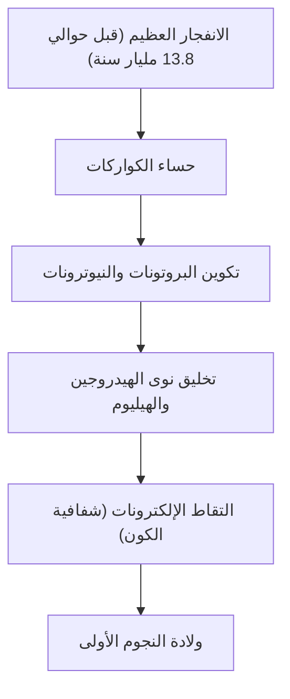

# ما هي العناصر: اللبنات الأساسية التي يتكون منها الكون

الكون مليء بتنوع مذهل. النجوم المشتعلة، الكواكب الجليدية الباردة، البكتيريا المجهرية، وأنت نفسك الذي تقرأ هذا المقال الآن. كل هذه الأشياء التي تبدو مختلفة تمامًا تتكون من أساس واحد مشترك. هذا هو "العنصر".

في هذا المقال، نقترب من اللغز الجذري لوجود العناصر، من بداية الكون إلى موت النجوم، ثم إلى استكشاف العناصر فائقة الثقل التي تمثل طليعة العلم الحديث. مرحبًا بك في عالم الجدول الدوري حيث تتقاطع الكيمياء والفيزياء.

## 1. بداية الكون وولادة العناصر

من أين أتت المادة التي يتكون منها كوننا؟ للإجابة على هذا، يجب أن نعود حوالي 13.8 مليار سنة إلى الانفجار العظيم.

### التخليق النووي للانفجار العظيم (تخليق العناصر في الكون المبكر)

كان الكون بعد الانفجار العظيم مباشرة عبارة عن حساء من الطاقة ذات درجة حرارة فائقة وكثافة هائلة. ومع توسع الكون وتبريده، اتحدت الكواركات لتشكل نويات مثل البروتونات والنيوترونات. هذه هي بداية المادة.

بعد حوالي 3 دقائق من الانفجار العظيم، عندما انخفضت درجة حرارة الكون إلى حوالي مليار درجة، اتحدت البروتونات والنيوترونات لتشكل النوى الذرية الأولى. ما وُلد في هذه العملية هما العنصران الأخف والأكثر وفرة في الكون: الهيدروجين (H) والهيليوم (He). تم إنتاج كميات ضئيلة جدًا من الليثيوم (Li) والبريليوم (Be)، ولكن هذه هي العناصر الوحيدة التي نشأت في المراحل الأولى من الكون. لم يكن هناك كربون ولا أكسجين ولا حديد في الكون في ذلك الوقت.

## 2. النجوم: أفران الخيمياء العملاقة في الكون

في حين كان الكون المبكر يحتوي على عناصر خفيفة فقط، فإن جميع العناصر الثقيلة التي تشكل العالم الغني الذي نعرفه اليوم تم تصنيعها داخل النجوم. عندما قال كارل ساجان: 'نحن مصنوعون من مادة النجوم (We are made of star-stuff)'، لم يكن هذا مجرد تعبير شعري، بل كان حقيقة علمية دقيقة.

### الاندماج النووي داخل النجوم

مركز النجم عبارة عن مفاعل اندماج نووي عملاق. تولد النجوم مثل شمسنا الطاقة عن طريق تحويل الهيدروجين إلى هيليوم في بيئة ذات ضغط عالٍ ودرجات حرارة فائقة في مركزها.

عندما يستنفد النجم الهيدروجين، يبدأ في حرق الهيليوم لإنتاج الكربون (C) والأكسجين (O). في حالة النجوم الضخمة التي تزيد كتلتها عن 8 أضعاف كتلة الشمس، ترتفع درجة الحرارة أكثر، ويتم تصنيع عناصر أثقل واحدًا تلو الآخر مثل النيون (Ne)، والمغنيسيوم (Mg)، والسيليكون (Si). ومع ذلك، تتوقف هذه العملية عند الحديد (Fe). نواة ذرة الحديد هي الأكثر استقرارًا، ومحاولة دمج الحديد نوويًا تمتص الطاقة بدلاً من إطلاقها.

### انفجارات المستعرات العظمى وتصادم النجوم النيوترونية

عندما يمتلئ قلب النجم بالحديد، يُفقد الضغط الخارجي الناتج عن الاندماج النووي، وينهار النجم على الفور تحت تأثير جاذبيته الخاصة (الانهيار الجاذبي). رد الفعل على ذلك هو انفجار المستعر الأعظم.

في هذه البيئة الانفجارية، يتم إنتاج عناصر أثقل من الحديد (مثل الذهب والفضة واليورانيوم) في لحظة. علاوة على ذلك، في السنوات الأخيرة، أكدت ملاحظات موجات الجاذبية أن معظم العناصر الثقيلة جدًا مثل الذهب والبلاتين يتم إنتاجها في ظاهرة تُعرف باسم 'كيلونوفا'، والتي تحدث عندما يصطدم ويندمج نجمان نيوترونيان.

## 3. اكتشاف العناصر وتاريخ البشرية

منذ العصور القديمة، عرفت البشرية العديد من العناصر مثل الذهب (Au)، الفضة (Ag)، النحاس (Cu)، الحديد (Fe)، الرصاص (Pb)، والزئبق (Hg). ومع ذلك، استغرق الأمر وقتًا طويلاً للوصول إلى الفهم الحديث بأن هذه 'عناصر (مواد أساسية لا يمكن تقسيمها أكثر من ذلك)'.

### من الخيمياء إلى الكيمياء الحديثة

بحث خيميائيو العصور الوسطى عن 'حجر الفلاسفة' الذي يحول المعادن الرخيصة إلى ذهب. فشلت محاولاتهم، ولكن خلال تلك العملية تم إنشاء طرق عمليات كيميائية مثل التقطير والاستخلاص، وتم اكتشاف عناصر جديدة مثل الفوسفور (P).

في القرن السابع عشر، رفض روبرت بويل في كتابه 'الكيميائي المتشكك' نظرية العناصر الأربعة لليونان القديمة (النار والهواء والماء والأرض)، واقترح المفهوم الحديث للعناصر. ثم في أواخر القرن الثامن عشر، اكتشف أنطوان لافوازييه أن جوهر الاحتراق هو الاتحاد مع الأكسجين، وأنشأ قائمة بـ 33 عنصرًا كانت معروفة في ذلك الوقت.

## 4. مندلييف وسحر الجدول الدوري

في القرن التاسع عشر، تم اكتشاف العديد من العناصر، وحاول العلماء إيجاد نظام في خصائصها المتنوعة. في قمة هذه المحاولات كان الكيميائي الروسي ديميتري مندلييف.

في عام 1869، رتب مندلييف 63 عنصرًا كانت معروفة في ذلك الوقت حسب وزنها الذري، واكتشف أن العناصر ذات الخصائص المتشابهة تظهر بشكل دوري. أعظم إنجازاته كان ترك 'مساحات فارغة' في الجدول الدوري للحفاظ على هذا النظام، والتنبؤ بوجود عناصر غير مكتشفة ستملأ هذه الفراغات.

على سبيل المثال، أطلق على المساحة الفارغة أسفل السيليكون اسم 'إيكا-سيليكون'، وتوقع بالتفصيل وزنه الذري وثقله النوعي. بعد 15 عامًا، اكتشف الكيميائي الألماني كليمنس وينكلر الجرمانيوم (Ge)، وكانت خصائصه متطابقة بشكل مذهل مع توقعات مندلييف، مما أثبت للعالم صحة الجدول الدوري.

## 5. ميكانيكا الكم تكشف 'لماذا توجد الدورية'

أنشأ مندلييف الجدول الدوري، لكنه لم يستطع تفسير 'لماذا' تحدث هذه الدورية. جاءت الإجابة مع ميكانيكا الكم التي ظهرت في أوائل القرن العشرين.

تتكون الذرات من 'نواة ذرية' ذات شحنة موجبة (بروتونات ونيوترونات) في المركز، و'إلكترونات' ذات شحنة سالبة تدور حولها. ما يحدد نوع العنصر (العدد الذري) هو 'عدد البروتونات' في النواة الذرية.

### الأغلفة الإلكترونية ومبدأ استبعاد باولي

لا تدور الإلكترونات حول النواة بشكل عشوائي، بل يمكن أن توجد فقط في مستويات طاقة معينة (أغلفة إلكترونية). بالإضافة إلى ذلك، وفقًا لـ 'مبدأ استبعاد باولي' الذي اقترحه فولفغانغ باولي، لا يمكن أن يحتوي المدار الواحد إلا على عدد محدود من الإلكترونات.

السبب في أن الأعمدة الرأسية (المجموعات) في الجدول الدوري لها خصائص كيميائية متشابهة هو أن لديها نفس عدد الإلكترونات في الغلاف الإلكتروني الخارجي (إلكترونات التكافؤ). التفاعل الكيميائي هو في الأساس ظاهرة تتبادل فيها الذرات أو تتشارك الإلكترونات الخارجية. لقد أعطت ميكانيكا الكم أساسًا فيزيائيًا متينًا لجدول مندلييف البديهي.

## 6. العناصر الهامة التي تدعم الحضارة

من بين 118 عنصرًا في الجدول الدوري، يوجد حوالي 90 عنصرًا بشكل طبيعي على الأرض. بعضها لا غنى عنه للحضارة البشرية وللحياة نفسها.

- **الكربون (C)**: أساس الحياة. بفضل قدرته على تكوين 4 روابط مع الذرات الأخرى، فإنه يشكل الهيكل العظمي لجزيئات معقدة بلا حدود مثل الحمض النووي (DNA) والبروتينات.
- **الحديد (Fe)**: يشكل حوالي 32% من كتلة الأرض. دعم الثورة الصناعية للبشرية ولا يزال يشكل أساس البنية التحتية الحديثة.
- **السيليكون (Si)**: النجم الرئيسي لأشباه الموصلات. من أجهزة الكمبيوتر إلى الهواتف الذكية إلى الذكاء الاصطناعي، يُبنى مجتمع المعلومات على بلورات السيليكون (رقائق السيليكون).
- **العناصر الأرضية النادرة**: لا غنى عن عناصر مثل النيوديميوم (Nd) والديسبروسيوم (Dy) لصنع مغناطيسات دائمة قوية، وهي ضرورية لمحركات السيارات الكهربائية ومولدات طاقة الرياح.

## 7. إلى المجهول: العناصر فائقة الثقل وجزيرة الاستقرار

أثقل عنصر موجود في الطبيعة هو اليورانيوم (العدد الذري 92). العناصر الأثقل منه (العناصر ما بعد اليورانيوم) يتم إنتاجها صناعيًا بواسطة البشر باستخدام مسرعات الجسيمات.

حاليًا، يكتمل الجدول الدوري حتى الأوغانيسون (Og) ذي العدد الذري 118. هذه 'العناصر فائقة الثقل' غير مستقرة للغاية، وحتى إذا تم إنتاجها، فإنها تتحلل في جزء من الثانية (أقل من ملي ثانية) لتصبح عناصر أخرى أخف.

ومع ذلك، تتنبأ نظرية الفيزياء النووية بوجود منطقة تسمى 'جزيرة الاستقرار'. وهي فرضية تنص على أنه عندما يصل عدد البروتونات والنيوترونات إلى 'أرقام سحرية' معينة، تصبح النواة الذرية في حالة مستقرة قريبة من الشكل الكروي، ويزداد عمرها بشكل كبير. إذا تمكنا من اكتشاف العناصر التي تنتمي إلى جزيرة الاستقرار، فقد نحصل على مواد ذات خصائص جديدة تمامًا لم نرها من قبل.

## 8. الخاتمة: قطع اللغز للكون

كل ما يحيط بنا ليس سوى مزيج من أكثر من 100 نوع من 'اللبنات'. تم تشكيل هذه اللبنات في خضم الدراما الكونية الكبرى، مثل الانفجار العظيم قبل 13.8 مليار سنة، وموت النجوم في أماكن بعيدة.

الجدول الدوري ليس مجرد أداة للكيمياء. إنه 'كتاب وصفات' يوضح كيف شكل الكون نفسه وأنتج حياة معقدة. في المرة القادمة التي تشرب فيها الماء، أو تأخذ نفسًا عميقًا، أو تلتقط هاتفك الذكي، تخيل قليلاً. تلك الذرات التي تتكون منها أنت، كانت تحترق يومًا ما في قلب نجم، في مكان ما في الكون.
