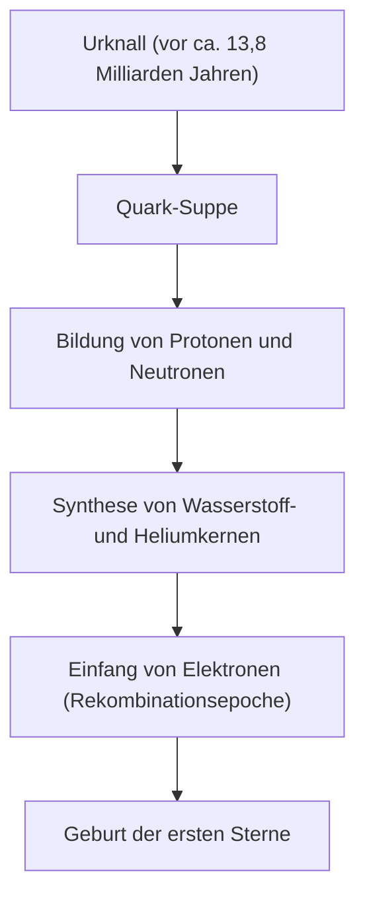
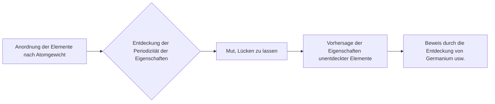

# Was sind chemische Elemente: Die ultimativen Bausteine des Universums

Das Universum ist voll von erstaunlicher Vielfalt. Brennende Sterne, kalte Eisplaneten, winzige Bakterien und Sie selbst, der diesen Artikel gerade liest. All diese scheinbar völlig unterschiedlichen Dinge bestehen aus einer einzigen, gemeinsamen Basis: den "Elementen".

In diesem Artikel gehen wir den grundlegenden Rätseln der Existenz von Elementen auf den Grund, von den Anfängen des Universums über den Tod der Sterne bis hin zur Erforschung superschwerer Elemente, die an der Spitze der modernen Wissenschaft steht. Willkommen in der Welt des Periodensystems, in der sich Chemie und Physik kreuzen.

## 1. Der Beginn des Universums und die Geburt der Elemente

Woher stammt die Materie, aus der unser Universum besteht? Um diese Frage zu beantworten, müssen wir etwa 13,8 Milliarden Jahre bis zum Urknall zurückgehen.

### Urknall-Nukleosynthese (Elementsynthese im frühen Universum)

Das Universum unmittelbar nach dem Urknall war eine Suppe aus Energie mit ultrahohen Temperaturen und extremer Dichte. Als das Universum expandierte und abkühlte, verbanden sich Quarks zu Nukleonen wie Protonen und Neutronen. Dies war der Beginn der Materie.

Etwa drei Minuten nach dem Urknall, als die Temperatur des Universums auf etwa 1 Milliarde Grad gesunken war, verbanden sich Protonen und Neutronen zu den ersten Atomkernen. In diesem Prozess entstanden die beiden leichtesten und am häufigsten vorkommenden Elemente im Universum: Wasserstoff (H) und Helium (He). Auch sehr geringe Mengen an Lithium (Li) und Beryllium (Be) wurden erzeugt, aber dies waren die einzigen Elemente, die in den frühen Phasen des Universums gebildet wurden. Damals gab es im Universum weder Kohlenstoff noch Sauerstoff oder Eisen.

## 2. Sterne: Die riesigen Alchemie-Öfen des Universums

Während es im frühen Universum nur leichte Elemente gab, wurden die schweren Elemente, die die reiche Welt bilden, die wir heute kennen, alle im Inneren von Sternen erzeugt. Als Carl Sagan sagte "Wir bestehen aus Sternenstaub (We are made of star-stuff)", war das nicht nur ein poetischer Ausdruck, sondern eine strenge wissenschaftliche Tatsache.

### Kernfusion im Inneren von Sternen

Der Kern eines Sterns ist ein riesiger Kernfusionsreaktor. Ein Stern wie unsere Sonne erzeugt Energie, indem er in der extrem unter hohem Druck und hoher Temperatur stehenden Umgebung seines Kerns Wasserstoff in Helium umwandelt.

Wenn einem Stern der Wasserstoff ausgeht, beginnt er Helium zu verbrennen, um Kohlenstoff (C) und Sauerstoff (O) zu erzeugen. Bei riesigen Sternen mit mehr als der achtfachen Masse der Sonne steigt die Temperatur weiter an, und es werden nacheinander schwerere Elemente wie Neon (Ne), Magnesium (Mg) und Silizium (Si) synthetisiert. Dieser Prozess stoppt jedoch bei Eisen (Fe). Der Eisenkern ist der stabilste, und der Versuch, Eisen zu fusionieren, würde Energie absorbieren anstatt sie freizusetzen.

### Supernova-Explosionen und Kollisionen von Neutronensternen

Wenn der Kern eines Sterns mit Eisen gefüllt ist, geht der nach außen gerichtete Druck der Kernfusion verloren, und der Stern kollabiert plötzlich unter seiner eigenen Schwerkraft (Gravitationskollaps). Die Reaktion darauf ist eine Supernova-Explosion.

In dieser explosiven Umgebung werden schwerere Elemente als Eisen (Gold, Silber, Uran usw.) in einem Augenblick erzeugt. Darüber hinaus haben Gravitationswellenbeobachtungen in den letzten Jahren bestätigt, dass die meisten der sehr schweren Elemente wie Gold und Platin bei einem Phänomen namens "Kilonova" entstehen, das auftritt, wenn zwei Neutronensterne kollidieren und verschmelzen.

## 3. Die Entdeckung der Elemente und die Geschichte der Menschheit

Die Menschheit kannte seit der Antike einige Elemente wie Gold (Au), Silber (Ag), Kupfer (Cu), Eisen (Fe), Blei (Pb) und Quecksilber (Hg). Es dauerte jedoch lange, bis man zu dem modernen Verständnis gelangte, dass es sich dabei um "Elemente (grundlegende Substanzen, die nicht weiter unterteilt werden können)" handelt.

### Von der Alchemie zur modernen Chemie

Mittelalterliche Alchemisten suchten nach dem "Stein der Weisen", um unedle Metalle in Gold zu verwandeln. Ihre Versuche scheiterten zwar, aber im Zuge dieses Prozesses wurden chemische Verfahren wie Destillation und Extraktion etabliert und neue Elemente wie Phosphor (P) entdeckt.

Im 17. Jahrhundert verwarf Robert Boyle in seinem Buch "Der skeptische Chemiker" die altgriechische Vier-Elemente-Lehre (Feuer, Luft, Wasser, Erde) und schlug das moderne Konzept der Elemente vor. Und im späten 18. Jahrhundert fand Antoine Lavoisier heraus, dass die Essenz der Verbrennung die Verbindung mit Sauerstoff ist, und erstellte eine Liste der 33 damals bekannten Elemente.

## 4. Mendelejew und die Magie des Periodensystems

Im 19. Jahrhundert wurden viele Elemente entdeckt, und Wissenschaftler bemühten sich, in ihren vielfältigen Eigenschaften Regelmäßigkeiten zu finden. An der Spitze stand der russische Chemiker Dmitri Mendelejew.

1869 ordnete Mendelejew die damals 63 bekannten Elemente nach ihrem Atomgewicht an und entdeckte, dass Elemente mit ähnlichen Eigenschaften periodisch auftraten. Seine größte Errungenschaft bestand darin, dass er "Lücken" im Periodensystem ließ, um die Regelmäßigkeit aufrechtzuerhalten, und vorhersagte, dass dort unentdeckte Elemente existieren.

Er nannte beispielsweise die Lücke unter Silizium "Eka-Silizium" und sagte dessen Atomgewicht und Dichte detailliert voraus. 15 Jahre später entdeckte der deutsche Chemiker Clemens Winkler Germanium (Ge), und da dessen Eigenschaften erstaunlich gut mit Mendelejews Vorhersagen übereinstimmten, wurde die Richtigkeit des Periodensystems der Welt bewiesen.

## 5. Die Quantenmechanik entschlüsselt das "Warum der Periodizität"

Mendelejew erstellte das Periodensystem, konnte aber das "Warum" hinter dieser Periodizität nicht erklären. Die Antwort lieferte die Quantenmechanik, die zu Beginn des 20. Jahrhunderts entstand.

Ein Atom besteht aus einem "Atomkern (Protonen und Neutronen)" mit einer positiven Ladung im Zentrum und "Elektronen" mit einer negativen Ladung, die ihn umkreisen. Die Art des Elements (Ordnungszahl) wird durch die "Anzahl der Protonen" im Atomkern bestimmt.

### Elektronenschalen und das Pauli-Prinzip

Elektronen umkreisen den Atomkern nicht zufällig, sondern können nur auf bestimmten Energieniveaus (Elektronenschalen) existieren. Darüber hinaus können aufgrund des von Wolfgang Pauli aufgestellten "Pauli-Prinzips" nur eine begrenzte Anzahl von Elektronen ein einziges Orbital besetzen.

Der Grund, warum vertikale Spalten (Gruppen) des Periodensystems ähnliche chemische Eigenschaften aufweisen, liegt darin, dass sie die gleiche Anzahl von Elektronen in der äußersten Elektronenschale (Valenzelektronen) haben. Eine chemische Reaktion ist im Wesentlichen ein Phänomen, bei dem Atome ihre äußersten Elektronen austauschen oder teilen. Die Quantenmechanik gab Mendelejews intuitiver Tabelle eine solide physikalische Grundlage.

## 6. Wichtige Elemente, die unsere Zivilisation stützen

Von den 118 Elementen im Periodensystem sind etwa 90 natürlich auf der Erde zu finden. Einige von ihnen sind für die menschliche Zivilisation und das Leben selbst unerlässlich.

- **Kohlenstoff (C)**: Die Grundlage des Lebens. Die Fähigkeit, vier Bindungen mit anderen Atomen einzugehen, macht ihn zum Gerüst für unendlich komplexe Moleküle wie DNA und Proteine.
- **Eisen (Fe)**: Macht etwa 32 % der Erdmasse aus. Es stützte die industrielle Revolution der Menschheit und ist auch heute noch die Grundlage der modernen Infrastruktur.
- **Silizium (Si)**: Der Hauptakteur bei Halbleitern. Von Computern über Smartphones bis hin zu KI ist die Informationsgesellschaft auf Siliziumkristallen (Silizium-Wafern) aufgebaut.
- **Seltene Erden (Seltenerdmetalle)**: Neodym (Nd) und Dysprosium (Dy) sind unter anderem entscheidend für die Herstellung starker Permanentmagnete und unerlässlich für Elektromotoren und Windkraftanlagen.

## 7. Auf in unbekannte Gebiete: Superschwere Elemente und die Insel der Stabilität

Das schwerste natürlich vorkommende Element ist Uran (Ordnungszahl 92). Schwerere Elemente (Transurane) wurden künstlich vom Menschen mit Hilfe von Teilchenbeschleunigern erzeugt.

Derzeit ist das Periodensystem bis zum Oganesson (Og) mit der Ordnungszahl 118 vervollständigt. Diese "superschweren Elemente" sind extrem instabil, und selbst wenn sie erzeugt werden, zerfallen sie im Bruchteil einer Sekunde (weniger als eine Millisekunde) in andere, leichtere Elemente.

Theorien der Kernphysik sagen jedoch die Existenz einer Region voraus, die als "Insel der Stabilität" bezeichnet wird. Es handelt sich um die Hypothese, dass Atomkerne einen stabilen, nahezu kugelförmigen Zustand erreichen und ihre Lebensdauer dramatisch zunimmt, wenn die Anzahl von Protonen und Neutronen bestimmte "magische Zahlen" erreicht. Wenn wir Elemente finden können, die zur Insel der Stabilität gehören, könnten wir Materialien mit völlig neuen Eigenschaften erhalten, wie wir sie noch nie zuvor gesehen haben.

## 8. Fazit: Die Puzzleteile des Universums

Alles, was uns umgibt, ist nichts weiter als eine Kombination von gut 100 Arten von "Bausteinen". Diese Bausteine wurden in den grandiosen Dramen des Universums geschmiedet, wie dem Urknall vor 13,8 Milliarden Jahren und dem Tod von Sternen in weiter Ferne.

Das Periodensystem ist nicht nur ein chemisches Werkzeug. Es ist das "Rezeptbuch", wie das Universum sich selbst formte und komplexes Leben hervorbrachte. Wenn Sie das nächste Mal Wasser trinken, tief einatmen oder Ihr Smartphone in die Hand nehmen, stellen Sie sich für einen Moment vor: Die Atome, aus denen Sie bestehen, brannten einst im Herzen eines Sterns, irgendwo im Universum.
