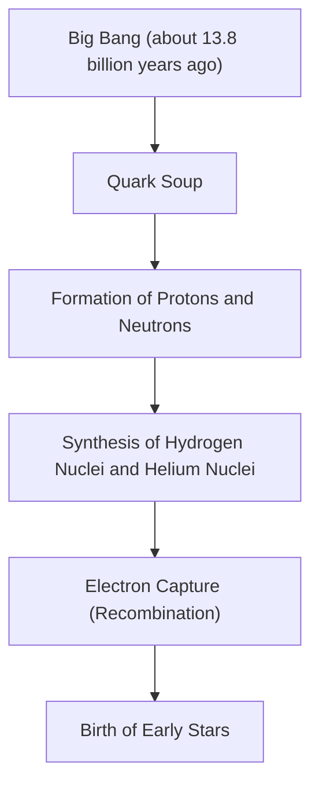
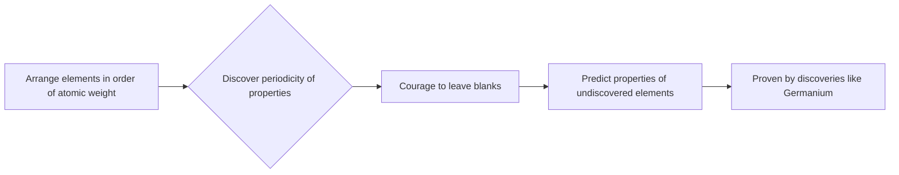

# What are Elements: The Ultimate Building Blocks of the Universe

The universe is full of astonishing diversity. Blazing stars, cold ice planets, microscopic bacteria, and you yourself reading this article right now. All these seemingly completely different things are made of just one common foundation. That is "elements".

In this article, we approach the fundamental mystery of the existence of elements, from the beginning of the universe to the death of stars, and to the cutting-edge of modern science: the search for superheavy elements. Welcome to the world of the periodic table, where chemistry and physics intersect.

## 1. The Beginning of the Universe and the Birth of Elements

Where did the matter that makes up our universe come from? To answer that, we must go back to the Big Bang about 13.8 billion years ago.

### Big Bang Nucleosynthesis (Element Synthesis in the Early Universe)

The universe immediately after the Big Bang was a soup of ultra-high temperature and ultra-high density energy. As the universe expanded and cooled, quarks combined to form nucleons such as protons and neutrons. This was the beginning of matter.

About 3 minutes after the Big Bang, when the temperature of the universe dropped to about 1 billion degrees, protons and neutrons combined to form the first atomic nuclei. What was born in this process were the two lightest and most abundant elements in the universe, hydrogen (H) and helium (He). Very trace amounts of lithium (Li) and beryllium (Be) were also produced, but these were the only elements created in the early stages of the universe. At that time, there was no carbon, oxygen, or iron in the universe.

## 2. Stars: The Giant Alchemical Furnaces of the Universe

While the early universe contained only light elements, all the heavy elements that form the rich world we know today were created inside stars. When Carl Sagan said, 'We are made of star-stuff,' it was not merely a poetic expression, but a strict scientific fact.

### Nuclear Fusion Inside Stars

The core of a star is a giant nuclear fusion reactor. Stars like our sun generate energy by converting hydrogen into helium in an ultra-high pressure and ultra-high temperature environment at their core.

When a star exhausts its hydrogen, it then begins to burn helium to create carbon (C) and oxygen (O). In the case of massive stars with a mass more than 8 times that of the sun, the temperature rises further, and heavier elements such as neon (Ne), magnesium (Mg), and silicon (Si) are synthesized one after another. However, this process stops at iron (Fe). This is because the nucleus of iron is the most stable, and attempting to fuse iron absorbs energy instead of releasing it.

### Supernova Explosions and Neutron Star Collisions

When the star's core is filled with iron, the outward pressure from nuclear fusion is lost, and the star suddenly collapses under its own gravity (gravitational collapse). The resulting rebound is a supernova explosion.

In this explosive environment, elements heavier than iron (such as gold, silver, and uranium) are generated in an instant. Furthermore, in recent years, gravitational wave observations have confirmed that the majority of extremely heavy elements such as gold and platinum are produced by a phenomenon called a "kilonova," which occurs when two neutron stars collide and merge.

## 3. The Discovery of Elements and Human History

Since ancient times, humanity has known of several elements such as gold (Au), silver (Ag), copper (Cu), iron (Fe), lead (Pb), and mercury (Hg). However, it took a long time to reach the modern understanding that these are "elements" (fundamental substances that cannot be divided further).

### From Alchemy to Modern Chemistry

Medieval alchemists sought the "Philosopher's Stone" to turn base metals into gold. Although their attempts ended in failure, chemical operation methods such as distillation and extraction were established in the process, and new elements such as phosphorus (P) were discovered.

In the 17th century, Robert Boyle denied the ancient Greek theory of the four elements (fire, air, water, earth) in his book 'The Sceptical Chymist,' and proposed a modern concept of elements. Then, in the late 18th century, Antoine Lavoisier discovered that the essence of combustion was combination with oxygen, and created a list of the 33 elements known at the time.

## 4. Mendeleev and the Magic of the Periodic Table

Many elements were discovered in the 19th century, and scientists tried to find regularity among their diverse properties. Standing at the pinnacle of this was the Russian chemist Dmitri Mendeleev.

In 1869, Mendeleev arranged the 63 elements known at the time in order of atomic weight and discovered that elements with similar properties appeared periodically. His greatest achievement was that he left "blanks" in the periodic table to maintain the regularity, and predicted that undiscovered elements existed there.

For example, he named the blank below silicon "eka-silicon" and predicted its atomic weight and specific gravity in detail. Fifteen years later, the German chemist Clemens Winkler discovered germanium (Ge), and the fact that its properties matched Mendeleev's predictions surprisingly well proved to the world the correctness of the periodic table.

## 5. Quantum Mechanics Explains "Why There is Periodicity"

Although Mendeleev created the periodic table, he could not explain "why" such periodicity occurred. The answer was brought about by quantum mechanics, which was born in the early 20th century.

Atoms consist of an "atomic nucleus" (protons and neutrons) with a positive charge at the center, and "electrons" with a negative charge orbiting around it. What determines the type of element (atomic number) is the "number of protons" contained in the atomic nucleus.

### Electron Shells and Pauli's Exclusion Principle

Electrons do not orbit randomly around the atomic nucleus, but can only exist in specific energy levels (electron shells). Furthermore, according to "Pauli's exclusion principle" proposed by Wolfgang Pauli, only a limited number of electrons can fit into a single orbital.

The reason why vertical columns (groups) in the periodic table have similar chemical properties is that they have the same number of electrons (valence electrons) in the outermost electron shell. A chemical reaction is essentially a phenomenon in which atoms exchange or share their outermost electrons. Quantum mechanics provided a solid physical foundation for Mendeleev's intuitive table.

## 6. Important Elements Supporting Civilization

Of the 118 elements on the periodic table, about 90 are found naturally on Earth. Among them are some that are essential to human civilization and life itself.

- **Carbon (C)**: The foundation of life. Its ability to form four bonds with other atoms makes it the skeleton of infinitely complex molecules such as DNA and proteins.
- **Iron (Fe)**: Accounts for about 32% of the Earth's mass. It supported humanity's Industrial Revolution and continues to be the foundation of modern infrastructure today.
- **Silicon (Si)**: The star of semiconductors. From computers to smartphones to AI, the information society is built on crystals of silicon (silicon wafers).
- **Rare Earths (Rare Earth Elements)**: Neodymium (Nd) and dysprosium (Dy) are indispensable for making powerful permanent magnets, and are essential for electric vehicle motors and wind turbines.

## 7. Into the Unknown: Superheavy Elements and the Island of Stability

The heaviest element existing in nature is uranium (atomic number 92). Elements heavier than that (transuranium elements) were artificially created by humans using particle accelerators.

Currently, the periodic table is complete up to element 118, Oganesson (Og). These "superheavy elements" are extremely unstable, and even if they are created, they decay into other lighter elements in an instant (less than a millisecond).

However, theories of nuclear physics predict the existence of a region called the "island of stability." It is a hypothesis that when the number of protons or neutrons reaches specific "magic numbers," the atomic nucleus becomes a nearly spherical, stable state, and its lifespan increases dramatically. If elements belonging to the island of stability can be discovered, we might obtain substances with completely new properties that have never been seen before.

## 8. Conclusion: The Puzzle Pieces of the Universe

Everything around us is nothing more than a combination of over 100 kinds of "blocks." These blocks were forged in grand cosmic dramas such as the Big Bang 13.8 billion years ago and the deaths of stars far away.

The periodic table is not just a tool for chemistry. It is a "recipe book" that led the universe to shape itself and give birth to complex life. The next time you drink water, take a deep breath, or pick up your smartphone, imagine for a moment: the very atoms that make you up were once blazing in the heart of a star somewhere in the universe.
