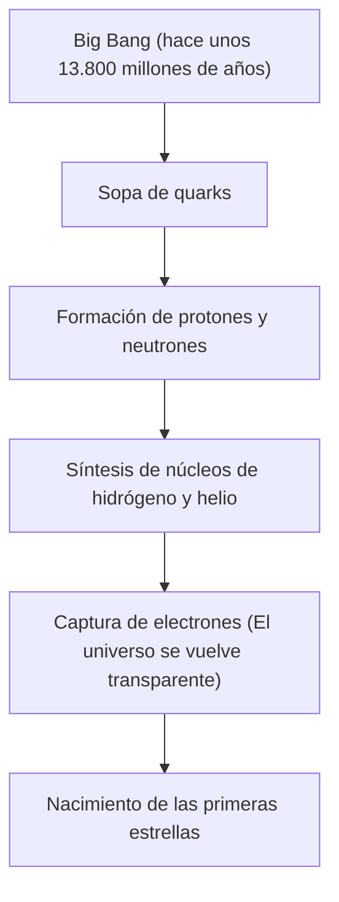

# ¿Qué son los elementos químicos? Los bloques definitivos que componen el universo

El universo está lleno de una sorprendente diversidad. Estrellas ardientes, planetas helados, bacterias minúsculas, y tú mismo leyendo este artículo ahora mismo. Todas estas cosas que parecen completamente diferentes están formadas a partir de una única base común. Eso son los 'elementos'.

En este artículo, desde el origen del universo hasta la muerte de las estrellas, y llegando hasta la frontera de la ciencia moderna con la exploración de elementos superpesados, nos acercaremos a los misterios fundamentales de la existencia de los elementos. Bienvenido al mundo de la tabla periódica donde la química y la física se cruzan.

## 1. El origen del universo y el nacimiento de los elementos

¿De dónde vino la materia que compone nuestro universo? Para responder a eso, necesitamos retroceder hasta el Big Bang hace unos 13.800 millones de años.

### Nucleosíntesis del Big Bang (Síntesis de elementos en el universo temprano)

El universo justo después del Big Bang era una sopa de energía de altísima temperatura y densidad. A medida que el universo se expandió y se enfrió, los quarks se combinaron para formar nucleones como protones y neutrones. Este es el comienzo de la materia.

Aproximadamente 3 minutos después del Big Bang, cuando la temperatura del universo descendió a unos mil millones de grados, los protones y neutrones se combinaron para formar los primeros núcleos atómicos. Lo que nació en este proceso fueron los dos elementos más ligeros y abundantes del universo: el hidrógeno (H) y el helio (He). También se generaron cantidades ínfimas de litio (Li) y berilio (Be), pero estos fueron los únicos elementos creados en las etapas iniciales del universo. En aquel entonces, no existían ni el carbono, ni el oxígeno, ni el hierro en el universo.

## 2. Las estrellas: Los gigantescos hornos de alquimia del universo

El universo temprano solo tenía elementos ligeros, pero los elementos pesados que forman el rico mundo que conocemos hoy fueron todos creados en el interior de las estrellas. Cuando Carl Sagan dijo que 'estamos hechos de polvo de estrellas' (We are made of star-stuff), no era una mera expresión poética, sino un hecho científico estricto.

### Fusión nuclear en el interior de las estrellas

El centro de una estrella es un gigantesco reactor de fusión nuclear. Estrellas como nuestro Sol generan energía convirtiendo hidrógeno en helio en un entorno de presión y temperatura ultra altas en sus núcleos.

Cuando una estrella agota su hidrógeno, comienza a quemar helio para crear carbono (C) y oxígeno (O). En el caso de estrellas masivas con más de 8 veces la masa del Sol, la temperatura aumenta aún más y se sintetizan elementos cada vez más pesados como el neón (Ne), el magnesio (Mg) y el silicio (Si). Sin embargo, este proceso se detiene en el hierro (Fe). El núcleo atómico del hierro es el más estable, y si se intenta fusionar hierro, en lugar de liberar energía, la absorbe.

### Explosiones de supernovas y colisiones de estrellas de neutrones

Cuando el núcleo de una estrella se llena de hierro, se pierde la presión hacia afuera de la fusión nuclear y la estrella colapsa instantáneamente bajo su propia gravedad (colapso gravitacional). La reacción a esto es la explosión de una supernova.

En este entorno explosivo, se generan en un instante elementos más pesados que el hierro (oro, plata, uranio, etc.). Además, en los últimos años, observaciones de ondas gravitacionales han confirmado que la mayor parte de los elementos muy pesados, como el oro y el platino, se generan en un fenómeno llamado 'kilonova' que ocurre cuando dos estrellas de neutrones chocan y se fusionan.

## 3. El descubrimiento de los elementos y la historia humana

Desde la antigüedad, la humanidad conocía algunos elementos como el oro (Au), la plata (Ag), el cobre (Cu), el hierro (Fe), el plomo (Pb) y el mercurio (Hg). Sin embargo, tomó mucho tiempo llegar a la comprensión moderna de que estos eran 'elementos' (sustancias básicas que no se pueden dividir más).

### De la alquimia a la química moderna

Los alquimistas de la Edad Media buscaron la 'piedra filosofal' para transformar metales base en oro. Sus intentos fracasaron, pero en el proceso se establecieron operaciones químicas como la destilación y la extracción, y se descubrieron nuevos elementos como el fósforo (P).

En el siglo XVII, Robert Boyle, en su libro "El químico escéptico", rechazó la teoría de los cuatro elementos de la antigua Grecia (fuego, aire, agua, tierra) y propuso el concepto moderno de elemento. A finales del siglo XVIII, Antoine Lavoisier descubrió que la esencia de la combustión era la combinación con oxígeno y compiló una lista de los 33 elementos conocidos en ese momento.

## 4. Mendeléyev y la magia de la tabla periódica

En el siglo XIX se descubrieron numerosos elementos, y los científicos se esforzaron por encontrar regularidades en sus diversas propiedades. En la cima de estos esfuerzos se situó el químico ruso Dmitri Mendeléyev.

En 1869, Mendeléyev ordenó los 63 elementos conocidos en ese momento por su peso atómico y descubrió que los elementos con propiedades similares aparecían periódicamente. Su mayor logro fue dejar 'espacios en blanco' en la tabla periódica para mantener la regularidad y predecir la existencia de elementos aún no descubiertos en esos lugares.

Por ejemplo, llamó 'eka-silicio' al espacio en blanco debajo del silicio y predijo detalladamente su peso atómico y gravedad específica. Quince años después, el químico alemán Clemens Winkler descubrió el germanio (Ge), y el hecho de que sus propiedades coincidieran asombrosamente con las predicciones de Mendeléyev demostró al mundo la exactitud de la tabla periódica.

## 5. La mecánica cuántica revela 'por qué hay periodicidad'

Mendeléyev creó la tabla periódica, pero no pudo explicar 'por qué' se producía tal periodicidad. Esa respuesta llegó con la mecánica cuántica, que nació a principios del siglo XX.

Un átomo está compuesto por un 'núcleo atómico' (protones y neutrones) con carga positiva en el centro, y 'electrones' con carga negativa que giran a su alrededor. Lo que determina el tipo de elemento (número atómico) es el 'número de protones' contenidos en el núcleo atómico.

### Capas electrónicas y el principio de exclusión de Pauli

Los electrones no giran aleatoriamente alrededor del núcleo, sino que solo pueden existir en niveles de energía específicos (capas electrónicas). Además, según el 'principio de exclusión de Pauli' propuesto por Wolfgang Pauli, solo un número limitado de electrones puede entrar en un orbital.

La razón por la que las columnas verticales (grupos) de la tabla periódica tienen propiedades químicas similares es porque tienen el mismo número de electrones (electrones de valencia) en su capa electrónica más externa. Las reacciones químicas son esencialmente fenómenos en los que los átomos intercambian o comparten sus electrones más externos. La mecánica cuántica dio una sólida base física a la tabla intuitiva de Mendeléyev.

## 6. Los elementos clave que sostienen la civilización

De los 118 elementos de la tabla periódica, unos 90 se encuentran de forma natural en la Tierra. Entre ellos hay algunos que son indispensables para la civilización humana y la vida misma.

- **Carbono (C)**: La base de la vida. Su capacidad para formar 4 enlaces con otros átomos lo convierte en el esqueleto de moléculas infinitamente complejas como el ADN y las proteínas.
- **Hierro (Fe)**: Constituye aproximadamente el 32% de la masa de la Tierra. Sustentó la revolución industrial de la humanidad y sigue siendo hoy la base de la infraestructura moderna.
- **Silicio (Si)**: El protagonista de los semiconductores. Desde los ordenadores hasta los teléfonos inteligentes y la IA, la sociedad de la información se construye sobre cristales de silicio (obleas de silicio).
- **Tierras raras (Elementos de tierras raras)**: El neodimio (Nd) y el disprosio (Dy) son indispensables para hacer potentes imanes permanentes, y son vitales para los motores de vehículos eléctricos y los generadores eólicos.

## 7. Hacia territorios desconocidos: Elementos superpesados y la isla de estabilidad

El elemento más pesado que existe en la naturaleza es el uranio (número atómico 92). Los elementos más pesados que este (elementos transuránicos) han sido creados artificialmente por humanos usando aceleradores de partículas.

Actualmente, la tabla periódica se ha completado hasta el oganesón (Og), número atómico 118. Estos 'elementos superpesados' son muy inestables e incluso cuando se crean, decaen en una fracción de segundo (milisegundos) convirtiéndose en otros elementos más ligeros.

Sin embargo, las teorías de la física nuclear predicen la existencia de una región llamada la 'isla de estabilidad'. Es la hipótesis de que cuando el número de protones y neutrones alcanza ciertos 'números mágicos', el núcleo atómico se vuelve casi esférico y estable, y su vida útil se prolonga drásticamente. Si pudiéramos descubrir elementos pertenecientes a la isla de estabilidad, podríamos obtener materiales con propiedades completamente nuevas nunca antes vistas.

## 8. Conclusión: Las piezas del rompecabezas del universo

Todo lo que nos rodea es solo una combinación de algo más de 100 tipos de 'bloques'. Esos bloques fueron forjados en el gran drama cósmico, como el Big Bang de hace 13.800 millones de años o la muerte de las estrellas muy lejanas.

La tabla periódica no es solo una herramienta química. Es el 'libro de recetas' que llevó al universo a formarse a sí mismo y a crear vida compleja. La próxima vez que bebas agua, respires profundamente o cojas tu teléfono inteligente, imagínalo por un momento: que los átomos que te componen estuvieron una vez, en algún lugar del universo, ardiendo en el corazón de una estrella.
