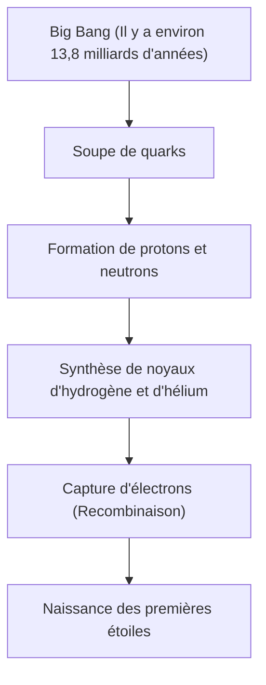

# Qu'est-ce qu'un élément : Les blocs ultimes qui composent l'univers

L'univers est rempli d'une étonnante diversité. Des étoiles brûlantes, des planètes de glace froides, des bactéries microscopiques, et vous-même qui lisez cet article en ce moment. Toutes ces choses qui semblent complètement différentes sont faites d'un seul fondement commun. C'est l'« élément ».

Dans cet article, nous explorerons le mystère fondamental de l'existence des éléments, depuis le début de l'univers jusqu'à la mort des étoiles, en passant par l'exploration des éléments super-lourds à la pointe de la science moderne. Bienvenue dans le monde du tableau périodique où la chimie et la physique se croisent.

## 1. Le début de l'univers et la naissance des éléments

D'où vient la matière qui compose notre univers ? Pour y répondre, il faut remonter jusqu'au Big Bang, il y a environ 13,8 milliards d'années.

### Nucléosynthèse primordiale (Synthèse des éléments dans l'univers primitif)

L'univers juste après le Big Bang était une soupe d'énergie à ultra-haute température et ultra-haute densité. À mesure que l'univers s'est étendu et refroidi, les quarks se sont combinés pour former des nucléons tels que les protons et les neutrons. C'est le début de la matière.

Environ 3 minutes après le Big Bang, lorsque la température de l'univers a chuté à environ 1 milliard de degrés, les protons et les neutrons se sont combinés pour former les premiers noyaux atomiques. Ce processus a donné naissance aux deux éléments les plus légers et les plus abondants de l'univers : l'hydrogène (H) et l'hélium (He). Des traces de lithium (Li) et de béryllium (Be) ont également été produites, mais ce sont les seuls éléments créés dans les premiers stades de l'univers. À l'époque, il n'y avait ni carbone, ni oxygène, ni fer dans l'univers.

## 2. Les étoiles : Les immenses fours alchimiques de l'univers

L'univers primitif ne contenait que des éléments légers, mais tous les éléments lourds qui forment le monde riche que nous connaissons aujourd'hui ont été créés à l'intérieur des étoiles. Lorsque Carl Sagan disait « Nous sommes faits de poussière d'étoiles (We are made of star-stuff) », ce n'était pas seulement une expression poétique, mais un fait scientifique rigoureux.

### Fusion nucléaire à l'intérieur des étoiles

Le cœur d'une étoile est un réacteur de fusion géant. Une étoile comme notre Soleil produit de l'énergie en convertissant l'hydrogène en hélium dans l'environnement à ultra-haute pression et ultra-haute température de son cœur.

Lorsqu'une étoile épuise son hydrogène, elle commence à brûler de l'hélium pour créer du carbone (C) et de l'oxygène (O). Dans le cas d'étoiles massives faisant plus de 8 fois la masse du Soleil, la température augmente encore, et des éléments plus lourds tels que le néon (Ne), le magnésium (Mg) et le silicium (Si) sont synthétisés les uns après les autres. Cependant, ce processus s'arrête au fer (Fe). Le noyau de fer est le plus stable, et si l'on tente de fusionner le fer, il absorbe de l'énergie au lieu d'en libérer.

### Explosions de supernova et collisions d'étoiles à neutrons

Lorsque le cœur de l'étoile est rempli de fer, la pression vers l'extérieur due à la fusion nucléaire est perdue, et l'étoile s'effondre d'un coup sous sa propre gravité (effondrement gravitationnel). Le rebond qui en résulte provoque une explosion de supernova.

Dans cet environnement explosif, des éléments plus lourds que le fer (or, argent, uranium, etc.) sont créés en un instant. De plus, les observations d'ondes gravitationnelles ont récemment confirmé que la plupart des éléments très lourds comme l'or et le platine sont générés lors d'un phénomène appelé « kilonova », qui se produit lorsque deux étoiles à neutrons entrent en collision et fusionnent.

## 3. La découverte des éléments et l'histoire de l'humanité

Depuis l'Antiquité, l'humanité connaissait plusieurs éléments tels que l'or (Au), l'argent (Ag), le cuivre (Cu), le fer (Fe), le plomb (Pb) et le mercure (Hg). Cependant, il a fallu beaucoup de temps pour atteindre la compréhension moderne que ceux-ci sont des « éléments » (des substances fondamentales qui ne peuvent pas être divisées davantage).

### De l'alchimie à la chimie moderne

Les alchimistes du Moyen Âge cherchaient la « pierre philosophale » pour transformer les métaux vils en or. Leurs tentatives ont échoué, mais au cours du processus, des méthodes d'opérations chimiques telles que la distillation et l'extraction ont été établies, et de nouveaux éléments comme le phosphore (P) ont été découverts.

Au 17ème siècle, Robert Boyle a rejeté la théorie des quatre éléments (feu, air, eau, terre) de la Grèce antique dans son livre « The Sceptical Chymist » (Le Chimiste Sceptique) et a proposé le concept moderne d'élément. Puis, à la fin du 18ème siècle, Antoine Lavoisier a découvert que l'essence de la combustion était la combinaison avec l'oxygène, et a dressé une liste des 33 éléments connus à l'époque.

## 4. Mendeleïev et la magie du tableau périodique

De nombreux éléments ont été découverts au 19ème siècle, et les scientifiques ont fait de grands efforts pour trouver une régularité dans leurs propriétés diverses. Au sommet de ces efforts se trouvait le chimiste russe Dmitri Mendeleïev.

En 1869, Mendeleïev a ordonné les 63 éléments connus à l'époque par poids atomique, et a découvert que les éléments ayant des propriétés similaires apparaissaient de manière périodique. Sa plus grande réalisation a été de laisser des « cases vides » dans le tableau périodique pour maintenir la régularité, en prédisant l'existence d'éléments non encore découverts à ces endroits.

Par exemple, il a nommé la case vide sous le silicium « éka-silicium » et a prédit en détail son poids atomique et sa densité. 15 ans plus tard, le chimiste allemand Clemens Winkler a découvert le germanium (Ge), et ses propriétés correspondaient étonnamment bien aux prédictions de Mendeleïev, prouvant ainsi la validité du tableau périodique au monde entier.

## 5. La mécanique quantique explique le « pourquoi de la périodicité »

Mendeleïev a créé le tableau périodique, mais n'a pas pu expliquer « pourquoi » une telle périodicité se produisait. La réponse a été apportée par la mécanique quantique, née au début du 20ème siècle.

Un atome est composé d'un « noyau atomique (protons et neutrons) » avec une charge positive au centre, et d'« électrons » avec une charge négative tournant autour. Ce qui détermine le type d'élément (numéro atomique), c'est le « nombre de protons » contenus dans le noyau atomique.

### Couches électroniques et principe d'exclusion de Pauli

Les électrons ne tournent pas autour du noyau de manière aléatoire, mais ne peuvent exister que dans des niveaux d'énergie spécifiques (couches électroniques). De plus, selon le « principe d'exclusion de Pauli » proposé par Wolfgang Pauli, seul un nombre limité d'électrons peut entrer dans une seule orbitale.

La raison pour laquelle les colonnes verticales (groupes) du tableau périodique partagent des propriétés chimiques similaires est qu'elles ont le même nombre d'électrons dans leur couche électronique la plus externe (électrons de valence). Les réactions chimiques sont fondamentalement des phénomènes où les atomes échangent ou partagent leurs électrons les plus externes. La mécanique quantique a donné une solide base physique au tableau intuitif de Mendeleïev.

## 6. Les éléments importants qui soutiennent la civilisation

Sur les 118 éléments du tableau périodique, environ 90 se trouvent à l'état naturel sur Terre. Parmi eux, certains sont essentiels à la civilisation humaine et à la vie elle-même.

- **Carbone (C)** : La base de la vie. Sa capacité à former 4 liaisons avec d'autres atomes en fait le squelette de molécules infiniment complexes comme l'ADN et les protéines.
- **Fer (Fe)** : Représente environ 32% de la masse de la Terre. Il a soutenu la révolution industrielle de l'humanité et continue d'être la base de l'infrastructure moderne.
- **Silicium (Si)** : Le protagoniste des semi-conducteurs. Des ordinateurs aux smartphones, en passant par l'IA, la société de l'information est bâtie sur des cristaux de silicium (plaquettes de silicium).
- **Terres rares (Éléments des terres rares)** : Le néodyme (Nd) et le dysprosium (Dy) sont indispensables à la fabrication de puissants aimants permanents, essentiels pour les moteurs de véhicules électriques et les éoliennes.

## 7. Vers l'inconnu : Les éléments super-lourds et l'îlot de stabilité

L'élément le plus lourd existant dans la nature est l'uranium (numéro atomique 92). Les éléments plus lourds (éléments transuraniens) ont été créés artificiellement par les humains en utilisant des accélérateurs de particules.

Actuellement, le tableau périodique est complet jusqu'à l'oganesson (Og) avec le numéro atomique 118. Ces « éléments super-lourds » sont très instables, et même lorsqu'ils sont créés, ils se désintègrent en une fraction de seconde (moins d'une milliseconde) pour devenir d'autres éléments plus légers.

Cependant, les théories de la physique nucléaire prédisent l'existence d'une région appelée l'« îlot de stabilité ». C'est l'hypothèse selon laquelle, lorsque le nombre de protons et de neutrons atteint des « nombres magiques » spécifiques, le noyau atomique adopte un état stable quasi sphérique, et sa durée de vie est considérablement prolongée. Si nous pouvions découvrir des éléments appartenant à cet îlot de stabilité, nous pourrions obtenir des matériaux dotés de propriétés entièrement nouvelles, jamais vues auparavant.

## 8. Conclusion : Les pièces du puzzle de l'univers

Tout ce qui nous entoure n'est qu'une combinaison d'une centaine de « blocs ». Ces blocs ont été forgés au cours de drames cosmiques épiques, comme le Big Bang il y a 13,8 milliards d'années, et la mort d'étoiles lointaines.

Le tableau périodique n'est pas seulement un outil de chimie. C'est le « livre de recettes » à travers lequel l'univers s'est façonné et a donné naissance à la vie complexe. La prochaine fois que vous boirez de l'eau, que vous prendrez une grande inspiration, ou que vous prendrez votre smartphone, imaginez un instant : les atomes qui vous composent brûlaient autrefois au cœur d'une étoile, quelque part dans l'univers.
