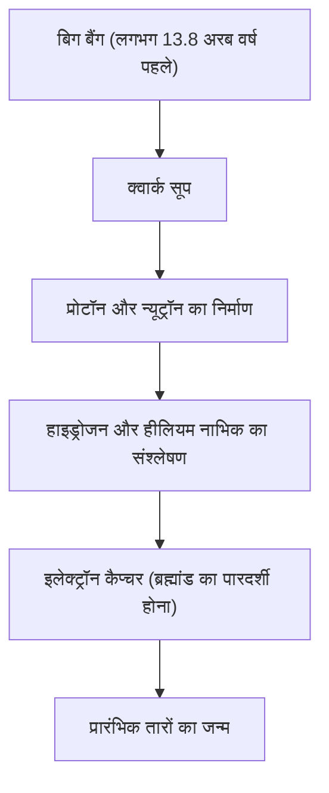

# रासायनिक तत्व क्या हैं: ब्रह्मांड का निर्माण करने वाले अंतिम ब्लॉक्स

ब्रह्मांड आश्चर्यजनक विविधता से भरा हुआ है। जलते हुए तारे, बर्फीले ग्रह, सूक्ष्म बैक्टीरिया, और आप स्वयं जो इस समय इस लेख को पढ़ रहे हैं। ये सभी चीजें, जो पूरी तरह से अलग लगती हैं, केवल एक ही सामान्य आधार से बनी हैं। वह है 'तत्व'।

इस लेख में, हम ब्रह्मांड की शुरुआत से लेकर तारों की मृत्यु तक, और आधुनिक विज्ञान में सुपरहेवी तत्वों की खोज तक, तत्वों के अस्तित्व के मूलभूत रहस्यों का पता लगाएंगे। रसायन विज्ञान और भौतिकी के प्रतिच्छेदन पर स्थित आवर्त सारणी (पीरियोडिक टेबल) की दुनिया में आपका स्वागत है।

## 1. ब्रह्मांड की शुरुआत और तत्वों का जन्म

हमारे ब्रह्मांड को बनाने वाले पदार्थ कहाँ से आए? इसका उत्तर खोजने के लिए, हमें लगभग 13.8 अरब वर्ष पहले हुए बिग बैंग तक वापस जाना होगा।

### बिग बैंग न्यूक्लियोसिंथेसिस (प्रारंभिक ब्रह्मांड में तत्वों का संश्लेषण)

बिग बैंग के ठीक बाद का ब्रह्मांड अति-उच्च तापमान और अति-उच्च घनत्व वाली ऊर्जा का सूप था। जैसे-जैसे ब्रह्मांड का विस्तार हुआ और यह ठंडा हुआ, क्वार्क आपस में जुड़कर प्रोटॉन और न्यूट्रॉन जैसे न्यूक्लिऑन बन गए। यही पदार्थ की शुरुआत थी।

बिग बैंग के लगभग 3 मिनट बाद, जब ब्रह्मांड का तापमान लगभग 1 अरब डिग्री तक गिर गया, तो प्रोटॉन और न्यूट्रॉन ने मिलकर पहले परमाणु नाभिक का निर्माण किया। इस प्रक्रिया में, ब्रह्मांड के दो सबसे हल्के और सबसे प्रचुर तत्व, हाइड्रोजन (H) और हीलियम (He) पैदा हुए। लिथियम (Li) और बेरिलियम (Be) की बहुत कम मात्रा भी उत्पन्न हुई थी, लेकिन ब्रह्मांड के प्रारंभिक चरण में बनाए गए केवल यही तत्व थे। उस समय ब्रह्मांड में कार्बन, ऑक्सीजन या लोहा मौजूद नहीं था।

## 2. तारे: ब्रह्मांड की विशाल कीमिया भट्ठियां

प्रारंभिक ब्रह्मांड में केवल हल्के तत्व थे, लेकिन भारी तत्व, जो आज हम जानते हैं उस समृद्ध दुनिया को आकार देते हैं, वे सभी तारों के अंदर बने थे। कार्ल सागन ने कहा था कि 'हम स्टार-स्टफ (तारों की धूल) से बने हैं', यह केवल एक काव्यात्मक अभिव्यक्ति नहीं है, बल्कि एक कठोर वैज्ञानिक तथ्य है।

### तारों के अंदर परमाणु संलयन

एक तारे का मूल एक विशाल परमाणु संलयन रिएक्टर होता है। हमारे सूर्य जैसे तारे अपने केंद्र में अत्यधिक दबाव और अत्यधिक तापमान वाले वातावरण में हाइड्रोजन को हीलियम में परिवर्तित करके ऊर्जा उत्पन्न करते हैं।

जब एक तारे की हाइड्रोजन समाप्त हो जाती है, तो वह हीलियम जलाना शुरू कर देता है और कार्बन (C) और ऑक्सीजन (O) का उत्पादन करता है। सूर्य के द्रव्यमान से 8 गुना अधिक द्रव्यमान वाले विशाल तारों के मामले में, तापमान और भी अधिक बढ़ जाता है, और नियॉन (Ne), मैग्नीशियम (Mg), और सिलिकॉन (Si) जैसे भारी तत्वों का एक के बाद एक संश्लेषण होता है। हालाँकि, यह प्रक्रिया लोहे (Fe) पर रुक जाती है। लोहे का परमाणु नाभिक सबसे स्थिर होता है, और यदि आप लोहे को संलयन करने का प्रयास करते हैं, तो यह ऊर्जा छोड़ने के बजाय इसे अवशोषित कर लेगा।

### सुपरनोवा विस्फोट और न्यूट्रॉन तारों का टकराव

जब किसी तारे का केंद्र लोहे से भर जाता है, तो परमाणु संलयन के कारण बाहर की ओर लगने वाला दबाव खत्म हो जाता है, और तारा अपने ही गुरुत्वाकर्षण के कारण अचानक ढह जाता है (गुरुत्वाकर्षण पतन)। इसके परिणामस्वरूप सुपरनोवा विस्फोट होता है।

इस विस्फोटक वातावरण में, लोहे से भारी तत्व (सोना, चांदी, यूरेनियम, आदि) एक पल में बन जाते हैं। इसके अलावा, हाल के वर्षों में गुरुत्वाकर्षण तरंग अवलोकनों से यह पुष्टि हुई है कि सोने और प्लैटिनम जैसे अधिकांश बहुत भारी तत्व 'किलोनोवा' नामक एक घटना में उत्पन्न होते हैं, जो तब होती है जब दो न्यूट्रॉन तारे टकराते हैं और विलीन हो जाते हैं।

## 3. तत्वों की खोज और मानव इतिहास

प्राचीन काल से, मनुष्य सोना (Au), चांदी (Ag), तांबा (Cu), लोहा (Fe), सीसा (Pb), और पारा (Hg) जैसे कई तत्वों को जानता था। हालाँकि, इस आधुनिक समझ तक पहुँचने में लंबा समय लगा कि ये 'तत्व' (मूल पदार्थ जिन्हें आगे विभाजित नहीं किया जा सकता) हैं।

### कीमिया से लेकर आधुनिक रसायन विज्ञान तक

मध्ययुगीन कीमियागरों (एल्केमिस्ट) ने 'पारस पत्थर' (फिलॉसॉफर्स स्टोन) की खोज की जो बेस धातुओं को सोने में बदल सके। उनके प्रयास विफल रहे, लेकिन इस प्रक्रिया में, आसवन (डिस्टिलेशन) और निष्कर्षण (एक्सट्रैक्शन) जैसे रासायनिक संचालन स्थापित हुए, और फास्फोरस (P) जैसे नए तत्वों की खोज की गई।

17वीं शताब्दी में, रॉबर्ट बॉयल ने अपनी पुस्तक 'द स्केप्टिकल केमिस्ट' में प्राचीन ग्रीस के चार तत्वों के सिद्धांत (आग, हवा, पानी, पृथ्वी) को खारिज कर दिया और तत्व की आधुनिक अवधारणा का प्रस्ताव रखा। फिर 18वीं शताब्दी के अंत में, एंटोनी लैवोजियर ने पता लगाया कि दहन का सार ऑक्सीजन के साथ संयोजन है, और उन्होंने उस समय ज्ञात 33 तत्वों की एक सूची बनाई।

## 4. मेंडेलीव और आवर्त सारणी का जादू

19वीं शताब्दी में कई तत्वों की खोज की गई, और वैज्ञानिकों ने उनके विविध गुणों में नियमितता खोजने का प्रयास किया। इसके शिखर पर रूसी रसायनज्ञ दिमित्री मेंडेलीव थे।

1869 में, मेंडेलीव ने उस समय ज्ञात 63 तत्वों को उनके परमाणु भार के क्रम में व्यवस्थित किया, और पाया कि समान गुणों वाले तत्व समय-समय पर (आवधिक रूप से) प्रकट होते हैं। उनकी सबसे बड़ी उपलब्धि नियमितता बनाए रखने के लिए आवर्त सारणी में 'खाली जगह' छोड़ना और यह भविष्यवाणी करना था कि वहां अनदेखे तत्व मौजूद हैं।

उदाहरण के लिए, उन्होंने सिलिकॉन के नीचे की खाली जगह को 'एका-सिलिकॉन' नाम दिया और इसके परमाणु भार और विशिष्ट गुरुत्व की विस्तार से भविष्यवाणी की। पंद्रह साल बाद, जब जर्मन रसायनज्ञ क्लेमेंस विंकलर ने जर्मेनियम (Ge) की खोज की, तो इसके गुण मेंडेलीव की भविष्यवाणियों से आश्चर्यजनक रूप से मेल खाते थे, जिससे दुनिया को आवर्त सारणी की शुद्धता साबित हुई।

## 5. क्वांटम यांत्रिकी बताती है कि 'आवधिकता क्यों है'

मेंडेलीव ने आवर्त सारणी तो बनाई, लेकिन यह नहीं बता सके कि 'क्यों' ऐसी आवधिकता (नियमितता) उत्पन्न होती है। इसका उत्तर 20वीं सदी की शुरुआत में पैदा हुए क्वांटम यांत्रिकी (क्वांटम मैकेनिक्स) द्वारा प्रदान किया गया।

परमाणु के केंद्र में एक धनात्मक रूप से चार्ज किया गया 'परमाणु नाभिक' (प्रोटॉन और न्यूट्रॉन) होता है, जिसके चारों ओर ऋणात्मक रूप से चार्ज किए गए 'इलेक्ट्रॉन' घूमते हैं। तत्व का प्रकार (परमाणु क्रमांक) परमाणु नाभिक में 'प्रोटॉन की संख्या' से निर्धारित होता है।

### इलेक्ट्रॉन कोश (इलेक्ट्रॉन शेल) और पाउली का अपवर्जन सिद्धांत

इलेक्ट्रॉन परमाणु नाभिक के चारों ओर बेतरतीब ढंग से नहीं घूमते हैं, बल्कि केवल विशिष्ट ऊर्जा स्तरों (इलेक्ट्रॉन कोशों) में मौजूद हो सकते हैं। इसके अलावा, वोल्फगैंग पाउली द्वारा प्रस्तावित 'पाउली के अपवर्जन सिद्धांत' के अनुसार, एक ही कक्षा (ऑर्बिटल) में केवल सीमित संख्या में ही इलेक्ट्रॉन हो सकते हैं।

आवर्त सारणी के ऊर्ध्वाधर स्तंभों (समूहों) में समान रासायनिक गुण होने का कारण यह है कि उनके सबसे बाहरी इलेक्ट्रॉन कोश (संयोजी इलेक्ट्रॉन) में इलेक्ट्रॉनों की संख्या समान होती है। रासायनिक प्रतिक्रियाएं अनिवार्य रूप से ऐसी घटनाएं हैं जहां परमाणु अपने सबसे बाहरी इलेक्ट्रॉनों का आदान-प्रदान या साझा करते हैं। क्वांटम यांत्रिकी ने मेंडेलीव की सहज ज्ञान युक्त सारणी को एक ठोस भौतिक आधार प्रदान किया।

## 6. सभ्यता का समर्थन करने वाले महत्वपूर्ण तत्व

आवर्त सारणी में 118 तत्वों में से लगभग 90 पृथ्वी पर स्वाभाविक रूप से पाए जाते हैं। इनमें से कुछ मानव सभ्यता और जीवन के लिए ही अपरिहार्य हैं।

- **कार्बन (C)**: जीवन का आधार। अन्य परमाणुओं के साथ 4 बांड बनाने की इसकी क्षमता इसे डीएनए और प्रोटीन जैसे असीम रूप से जटिल अणुओं की रीढ़ बनाती है।
- **लोहा (Fe)**: पृथ्वी के द्रव्यमान का लगभग 32% हिस्सा है। इसने मानव औद्योगिक क्रांति का समर्थन किया और आज भी आधुनिक बुनियादी ढांचे की नींव बना हुआ है।
- **सिलिकॉन (Si)**: अर्धचालक (सेमीकंडक्टर) का मुख्य पात्र। कंप्यूटर से लेकर स्मार्टफोन और एआई तक, सूचना समाज सिलिकॉन क्रिस्टल (सिलिकॉन वेफर्स) पर बना है।
- **दुर्लभ पृथ्वी तत्व (रेयर अर्थ एलिमेंट्स)**: नियोडिमियम (Nd) और डिस्प्रोसियम (Dy) शक्तिशाली स्थायी चुंबक बनाने के लिए आवश्यक हैं, और इलेक्ट्रिक वाहन मोटर्स और पवन टर्बाइनों के लिए अपरिहार्य हैं।

## 7. अज्ञात क्षेत्र में: सुपरहेवी तत्व और स्थिरता का द्वीप

प्रकृति में पाया जाने वाला सबसे भारी तत्व यूरेनियम (परमाणु क्रमांक 92) है। इससे भारी तत्व (ट्रांसयूरेनियम तत्व) कृत्रिम रूप से कण त्वरक (पार्टिकल एक्सेलेरेटर) का उपयोग करके मनुष्यों द्वारा बनाए गए हैं।

वर्तमान में, परमाणु क्रमांक 118, ओगनेसन (Og) तक आवर्त सारणी पूरी हो चुकी है। ये 'सुपरहेवी तत्व' अत्यधिक अस्थिर होते हैं, और बनने पर भी वे एक पल (एक मिलीसेकंड से भी कम) में विघटित हो जाते हैं और अन्य हल्के तत्व बन जाते हैं।

हालाँकि, परमाणु भौतिकी का सिद्धांत भविष्यवाणी करता है कि 'स्थिरता का द्वीप' नामक एक क्षेत्र मौजूद है। परिकल्पना यह है कि যখন प्रोटॉन और न्यूट्रॉन की संख्या एक निश्चित 'जादुई संख्या' (मैजिक नंबर) तक पहुँच जाती है, तो परमाणु नाभिक लगभग गोलाकार, स्थिर अवस्था में आ जाता है, और इसका जीवनकाल नाटकीय रूप से बढ़ जाता है। यदि हम स्थिरता के द्वीप से संबंधित तत्वों की खोज कर सकते हैं, तो हमें अभूतपूर्व गुणों वाले पूरी तरह से नए पदार्थ मिल सकते हैं।

## 8. निष्कर्ष: ब्रह्मांड के पहेली के टुकड़े

हमारे आस-पास की हर चीज 100 से अधिक प्रकार के 'ब्लॉक' के संयोजन से ज्यादा कुछ नहीं है। वे ब्लॉक 13.8 अरब साल पहले हुए बिग बैंग और दूर तारों की मृत्यु जैसे भव्य ब्रह्मांडीय नाटकों में गढ़े गए थे।

आवर्त सारणी केवल रसायन विज्ञान का एक उपकरण नहीं है। यह 'रेसिपी बुक' है कि कैसे ब्रह्मांड ने खुद को आकार दिया और जटिल जीवन का निर्माण किया। अगली बार जब आप पानी पिएं, गहरी सांस लें, या अपना स्मार्टफोन उठाएं, तो बस एक पल के लिए कल्पना करें: आपको बनाने वाले वे परमाणु कभी ब्रह्मांड में कहीं किसी तारे के हृदय में जल रहे थे।
