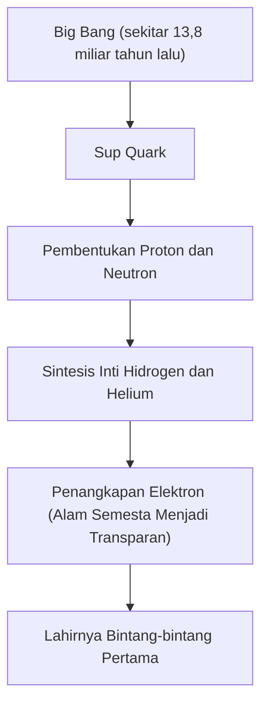
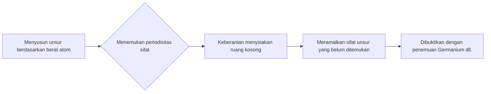

# Apa Itu Unsur: Blok Bangunan Utama Pembentuk Alam Semesta

Alam semesta penuh dengan keragaman yang menakjubkan. Bintang yang menyala-nyala, planet es yang dingin, bakteri mikroskopis, dan bahkan Anda sendiri yang sedang membaca artikel ini. Semua hal yang tampaknya sama sekali berbeda ini terdiri dari satu fondasi yang sama. Itulah yang disebut 'unsur'.

Dalam artikel ini, kita akan mengungkap misteri fundamental dari keberadaan unsur-unsur, mulai dari awal mula alam semesta hingga kematian bintang-bintang, dan pencarian unsur superberat yang merupakan ujung tombak sains modern. Selamat datang di dunia tabel periodik tempat kimia dan fisika bersinggungan.

## 1. Awal Mula Alam Semesta dan Lahirnya Unsur

Dari mana asal materi yang membentuk alam semesta kita? Untuk menjawabnya, kita perlu kembali ke sekitar 13,8 miliar tahun yang lalu saat Big Bang terjadi.

### Nukleosintesis Big Bang (Sintesis Unsur di Alam Semesta Awal)

Alam semesta tepat setelah Big Bang adalah sup energi bersuhu sangat tinggi dan berkerapatan sangat tinggi. Saat alam semesta mengembang dan mendingin, quark bergabung membentuk nukleon seperti proton dan neutron. Inilah awal mula materi.

Sekitar tiga menit setelah Big Bang, ketika suhu alam semesta turun menjadi sekitar 1 miliar derajat, proton dan neutron bergabung membentuk inti atom pertama. Proses ini melahirkan dua unsur paling ringan dan paling melimpah di alam semesta: hidrogen (H) dan helium (He). Sejumlah kecil litium (Li) dan berilium (Be) juga dihasilkan, tetapi ini adalah satu-satunya unsur yang tercipta pada tahap awal alam semesta. Tidak ada karbon, oksigen, atau besi di alam semesta pada waktu itu.

## 2. Bintang-bintang: Tungku Alkimia Raksasa Alam Semesta

Meskipun alam semesta awal hanya memiliki unsur-unsur ringan, unsur-unsur berat yang membentuk dunia kita yang kaya saat ini semuanya tercipta di dalam bintang. Saat Carl Sagan berkata 'Kita terbuat dari debu bintang (We are made of star-stuff)', itu bukanlah sekadar ungkapan puitis, melainkan fakta ilmiah yang ketat.

### Fusi Nuklir di Dalam Bintang

Inti bintang adalah reaktor fusi raksasa. Bintang seperti matahari kita menghasilkan energi dengan mengubah hidrogen menjadi helium di lingkungan inti yang bertekanan dan bersuhu sangat tinggi.

Setelah bintang kehabisan hidrogen, ia mulai membakar helium untuk menghasilkan karbon (C) dan oksigen (O). Dalam kasus bintang raksasa yang bermassa 8 kali lipat dari matahari atau lebih, suhunya semakin meningkat, dan unsur-unsur yang lebih berat seperti neon (Ne), magnesium (Mg), dan silikon (Si) disintesis secara berurutan. Namun, proses ini berhenti pada besi (Fe). Inti atom besi adalah yang paling stabil, dan mencoba untuk memfusi besi tidak akan melepaskan energi, melainkan menyerapnya.

### Ledakan Supernova dan Tabrakan Bintang Neutron

Ketika inti bintang dipenuhi dengan besi, tekanan keluar dari fusi nuklir menghilang, dan bintang itu seketika runtuh di bawah gravitasinya sendiri (keruntuhan gravitasi). Reaksi terhadap hal ini adalah ledakan supernova.

Dalam lingkungan eksplosif ini, unsur-unsur yang lebih berat dari besi (emas, perak, uranium, dll.) tercipta dalam sekejap. Terlebih lagi, dalam beberapa tahun terakhir, observasi gelombang gravitasi telah mengonfirmasi bahwa sebagian besar unsur yang sangat berat seperti emas dan platina dihasilkan oleh fenomena yang disebut 'kilonova', yang terjadi ketika dua bintang neutron bertabrakan dan bergabung.

## 3. Penemuan Unsur dan Sejarah Umat Manusia

Sejak zaman kuno, manusia telah mengetahui beberapa unsur seperti emas (Au), perak (Ag), tembaga (Cu), besi (Fe), timbal (Pb), dan merkuri (Hg). Namun, butuh waktu lama untuk mencapai pemahaman modern bahwa hal-hal ini adalah 'unsur (zat dasar yang tidak dapat dibagi lagi)'.

### Dari Alkimia ke Kimia Modern

Para alkemis di Abad Pertengahan mencari 'Batu Bertuah' yang dapat mengubah logam dasar menjadi emas. Upaya mereka gagal, tetapi dalam prosesnya, prosedur kimia seperti distilasi dan ekstraksi dikembangkan, dan unsur-unsur baru seperti fosfor (P) ditemukan.

Pada abad ke-17, Robert Boyle menolak teori empat unsur (api, udara, air, tanah) Yunani kuno dalam bukunya 'The Sceptical Chymist' dan mengusulkan konsep unsur modern. Kemudian, di akhir abad ke-18, Antoine Lavoisier menemukan bahwa esensi pembakaran adalah kombinasi dengan oksigen, dan menyusun daftar 33 unsur yang diketahui saat itu.

## 4. Mendeleev dan Keajaiban Tabel Periodik

Banyak unsur ditemukan pada abad ke-19, dan para ilmuwan berjuang keras untuk menemukan keteraturan dalam sifat-sifatnya yang beragam. Puncak dari upaya ini dicapai oleh ahli kimia Rusia, Dmitri Mendeleev.

Pada tahun 1869, Mendeleev menyusun 63 unsur yang diketahui saat itu berdasarkan berat atom, dan menemukan bahwa unsur-unsur dengan sifat serupa muncul secara periodik. Pencapaian terbesarnya adalah ia meninggalkan 'ruang kosong' dalam tabel periodik untuk mempertahankan keteraturan, dan meramalkan keberadaan unsur-unsur yang belum ditemukan di sana.

Misalnya, ia menamai ruang kosong di bawah silikon sebagai 'eka-silikon', dan memprediksi berat atom dan berat jenisnya secara mendetail. Lima belas tahun kemudian, ahli kimia Jerman Clemens Winkler menemukan germanium (Ge), dan fakta bahwa sifat-sifatnya sangat cocok dengan prediksi Mendeleev membuktikan kebenaran tabel periodik kepada dunia.

## 5. Mekanika Kuantum Mengungkap 'Mengapa Ada Periodisitas'

Mendeleev menciptakan tabel periodik, tetapi ia tidak dapat menjelaskan 'mengapa' periodisitas semacam itu terjadi. Jawabannya diberikan oleh mekanika kuantum yang lahir pada awal abad ke-20.

Atom terdiri dari 'inti atom (proton dan neutron)' bermuatan positif di tengahnya, dan 'elektron' bermuatan negatif yang mengorbit di sekitarnya. Jenis unsur (nomor atom) ditentukan oleh 'jumlah proton' dalam inti atom.

### Kulit Elektron dan Prinsip Eksklusi Pauli

Elektron tidak mengorbit inti atom secara acak, melainkan hanya dapat berada pada tingkat energi tertentu (kulit elektron). Terlebih lagi, menurut 'prinsip eksklusi Pauli' yang diusulkan oleh Wolfgang Pauli, hanya sejumlah elektron tertentu yang dapat masuk ke dalam satu orbital.

Alasan mengapa kolom vertikal (golongan) pada tabel periodik memiliki sifat kimia yang mirip adalah karena mereka memiliki jumlah elektron yang sama pada kulit elektron terluar (elektron valensi). Reaksi kimia pada dasarnya adalah fenomena di mana atom bertukar atau berbagi elektron terluarnya. Mekanika kuantum memberikan dasar fisik yang kuat bagi tabel intuitif Mendeleev.

## 6. Unsur-unsur Penting yang Menopang Peradaban

Dari 118 unsur dalam tabel periodik, hanya sekitar 90 yang ditemukan secara alami di Bumi. Beberapa di antaranya sangat penting bagi peradaban manusia dan kehidupan itu sendiri.

- **Karbon (C)**: Fondasi kehidupan. Kemampuannya membentuk empat ikatan dengan atom lain memungkinkannya menjadi kerangka penyusun molekul kompleks yang tak terbatas seperti DNA dan protein.
- **Besi (Fe)**: Menyusun sekitar 32% massa Bumi. Mendukung Revolusi Industri manusia dan terus menjadi fondasi infrastruktur modern hingga hari ini.
- **Silikon (Si)**: Karakter utama semikonduktor. Mulai dari komputer hingga ponsel pintar dan AI, masyarakat informasi dibangun di atas kristal silikon (wafer silikon).
- **Logam Tanah Jarang (Rare Earths)**: Neodymium (Nd) dan disprosium (Dy) sangat penting untuk membuat magnet permanen yang kuat, dan tidak terpisahkan bagi motor kendaraan listrik serta generator tenaga angin.

## 7. Menuju Wilayah Tak Dikenal: Unsur Superberat dan Pulau Stabilitas

Unsur terberat yang ada di alam adalah uranium (nomor atom 92). Unsur-unsur yang lebih berat (unsur transuranium) diciptakan secara artifisial oleh manusia menggunakan akselerator partikel.

Saat ini, tabel periodik telah lengkap hingga oganesson (Og) dengan nomor atom 118. 'Unsur-unsur superberat' ini sangat tidak stabil, dan meskipun diciptakan, mereka meluruh dalam sekejap (kurang dari milidetik) menjadi unsur yang lebih ringan.

Namun, teori fisika nuklir memprediksi keberadaan wilayah yang disebut 'pulau stabilitas'. Ini adalah hipotesis bahwa ketika jumlah proton dan neutron mencapai 'angka ajaib' tertentu, inti atom mencapai keadaan stabil yang hampir berbentuk bola, dan masa hidupnya meningkat drastis. Jika kita dapat menemukan unsur yang termasuk dalam pulau stabilitas, kita mungkin akan mendapatkan materi dengan sifat-sifat baru yang belum pernah terlihat sebelumnya.

## 8. Kesimpulan: Potongan Teka-teki Alam Semesta

Segala sesuatu di sekitar kita hanyalah kombinasi dari lebih dari 100 'blok'. Blok-blok tersebut ditempa dalam drama kosmik yang luar biasa, seperti Big Bang 13,8 miliar tahun yang lalu, atau kematian bintang di kejauhan.

Tabel periodik bukan sekadar alat bantu kimia. Ia adalah 'buku resep' tentang bagaimana alam semesta membentuk dirinya sendiri dan melahirkan kehidupan yang kompleks. Lain kali saat Anda meminum air, menarik napas dalam-dalam, atau mengambil ponsel pintar Anda, bayangkan sejenak. Atom-atom yang membentuk diri Anda, dulunya, terbakar di jantung sebuah bintang di suatu tempat di alam semesta.
